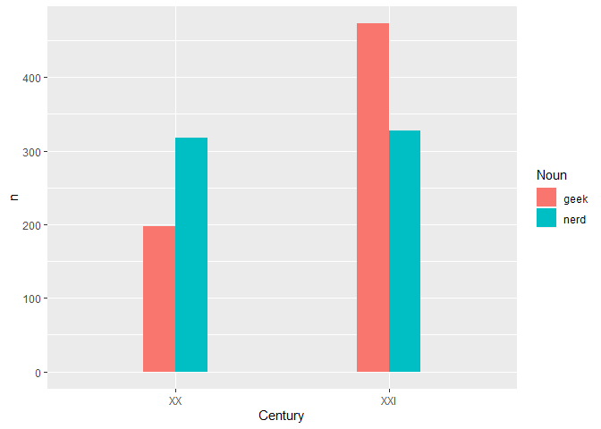
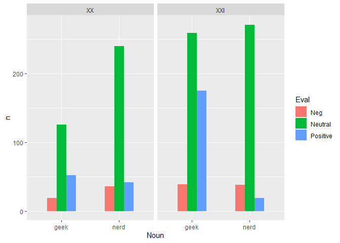
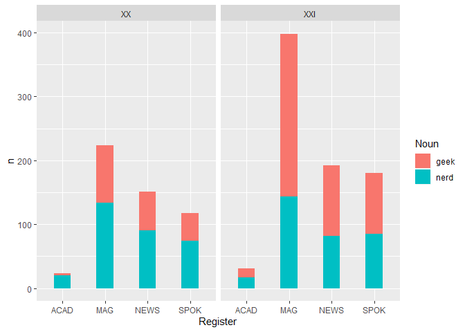

最近在老師的研究安排下讀了 [*How to do Linguistics with
R*](https://benjamins.com/sites/z.195/) 的第十二章 *Probabilistic
multifactorial grammar and lexicology: Binominal logistic
regression*。本章介紹了如何以 logistic regression
解釋並預測兩個近似詞的使用情形。接下來將使用 `Rling` 中的資料集 `nerd`
做練習。

    # Following the instructions of the book:
    # install.packages(c("rms", "visreg", "car"))
    # To install `Rling`:
    # install.packages(pkgs = file.choose(), repos = NULL, type = "source")
    library(Rling)
    library(rms)
    library(dplyr)
    library(ggplot2)

### 1. 取得 `Rling` 中的資料集 `nerd`

    data(nerd)
    summary(nerd)

    ##    Noun     Num      Century   Register         Eval    
    ##  geek:670   pl:436   XX :515   ACAD: 54   Neg     :132  
    ##  nerd:646   sg:880   XXI:801   MAG :622   Neutral :896  
    ##                                NEWS:343   Positive:288  
    ##                                SPOK:297

### 2. 資料視覺化

由下圖所示，在 20 世紀時，`nerd` 出現的次數比 `geek` 多。但在 21
世紀，`geek` 的使用次數超過前一世紀的兩倍，而 `nerd`
在兩世紀的次數無明顯差異，因此 `geek` 在 21 世紀的出現次數超過 `nerd`。

    nerd %>%
      group_by(Noun, Century) %>%
      count(Noun) %>%
      ungroup() %>%
      ggplot(aes(Century, n, fill = Noun)) +
      geom_bar(position = "dodge", stat = "identity", width = 0.3)

接下來看看不同世紀使用 `nerd` 與 `geek` 時的 polarities。可以發現不論在
20 或 21 世紀，使用 `nerd` 和 `geek` 時大部分都是 neutrual
polarity。特別的是，`geek` 在 21 世紀時被使用於 positive polarity
的次數很高。

    nerd %>%
      group_by(Noun, Century, Eval) %>%
      summarise(n = n()) %>%
      ungroup() %>%
      ggplot(aes(Noun, n, fill = Eval)) +
      facet_wrap(~Century) +
      geom_bar(position = "dodge", stat = "identity", width = 0.5)

因為好奇，到 [Cambridge Dictionary](https://dictionary.cambridge.org/)
上查了兩字的釋義：

> nerd (n.)  
> (1) *a person, especially a man, who is not attractive and is awkward
> or socially embarrassing*  
> (2) *a person who is extremely interested in one subject, especially
> computers, and knows a lot of facts about it*

> geek (n.)  
> *someone who is intelligent but not fashionable or popular*

看起來 `geek` 似乎真的比 `nerd` 還來得正面一些，至少有 intelligent
的部分~

再看看兩詞在不同領域中的使用情形。在 20 與 21 世紀，`geek` 和 `nerd`
出現次數於學術領域最少，雜誌最多，而新聞又比口語多一些。且 21 世紀時，
`geek` 在雜誌出現的次數增加許多。

    nerd %>%
      group_by(Century, Noun, Register, Eval) %>%
      summarise(n = n()) %>%
      ungroup() %>%
      ggplot(aes(Register, n, fill = Noun)) +
      facet_wrap(~Century) +
      geom_bar(stat = "identity", width = 0.4)

### 3. Logistic Regression Model

試著用書上的方式 (p.258) 跑 lrm。

    m.lrm <- lrm(Noun ~ Num + Century + Register + Eval, data = nerd)
    m.lrm

    ## Logistic Regression Model
    ##  
    ##  lrm(formula = Noun ~ Num + Century + Register + Eval, data = nerd)
    ##  
    ##                        Model Likelihood     Discrimination    Rank Discrim.    
    ##                           Ratio Test           Indexes           Indexes       
    ##  Obs          1316    LR chi2     180.32    R2       0.171    C       0.687    
    ##   geek         670    d.f.             7    g        0.905    Dxy     0.374    
    ##   nerd         646    Pr(> chi2) <0.0001    gr       2.471    gamma   0.394    
    ##  max |deriv| 3e-08                          gp       0.200    tau-a   0.187    
    ##                                             Brier    0.219                     
    ##  
    ##                Coef    S.E.   Wald Z Pr(>|Z|)
    ##  Intercept      1.5038 0.3515  4.28  <0.0001 
    ##  Num=sg        -0.2724 0.1291 -2.11  0.0348  
    ##  Century=XXI   -0.8063 0.1220 -6.61  <0.0001 
    ##  Register=MAG  -0.7457 0.3208 -2.32  0.0201  
    ##  Register=NEWS -0.5962 0.3301 -1.81  0.0709  
    ##  Register=SPOK -0.5729 0.3310 -1.73  0.0835  
    ##  Eval=Neutral   0.0991 0.1942  0.51  0.6098  
    ##  Eval=Positive -1.5084 0.2375 -6.35  <0.0001 
    ## 

#### 3.1 `Model Likelihood Ratio Test`

從 `Model Likelihood Ratio Test` 的欄位中，可以得知 *p*-value 小於
0.05，代表這個 model 的顯著。

#### 3.2 `Discrimination Indexes`

在 `Discrimination Indexes` 欄中可以看到 R2 值。R2 值介於 0 和 1
之間，這個 model 的 R2 值為 0.171，代表預測能力低。但書中提到 logistic
regression 的 R2 值通常會比 linear regression models
的來得低，因此並不建議採用 R2 值作為評斷。

#### 3.3 `Rank Discrim. Indexes`

在 `Rank Discrim. Indexes` 欄中，*C* 代表 [concordance index
(一致性指數)](https://www.itread01.com/content/1541051301.html)，說明
model 的預測能力。表中可見 *C* = 0.687，預測能力普通。

#### 3.4 `Coef`

接著來到 `Coef` 欄。以變數 `Register` 為例，`ACAD` 是 reference
level，因此不在表上。與 `ACAD` 差異最大的是 `MAG`（Coef =
-0.7457），其中 *p* = 0.0201 (&lt;0.05) 代表顯著。

`Century=XXI` 的 Coef = -0.8063，表示 `nerd` 對 `geek` 的 odds 在 21
世紀降低了。也可以說，`geek` 在 21 世紀時出現次數較 `nerd` 頻繁。

相較於 `Eval=Neutral`，`Eval=Positive` 的 Coef 更小且為負數，表示 `geek`
在使用上較 `nerd` 有更多 positive connotation。

`Num=sg` 的 Coef = -0.2724，表示 `geek` 較 `nerd` 更常以單數出現。

### 4. Murmuring

照著書上的步驟跑了一個 Logistic Regression
Model，但卻不大懂數值所代表的意義，重複讀了很多遍才稍微了解一點點。統計知識真的要補足啊！
