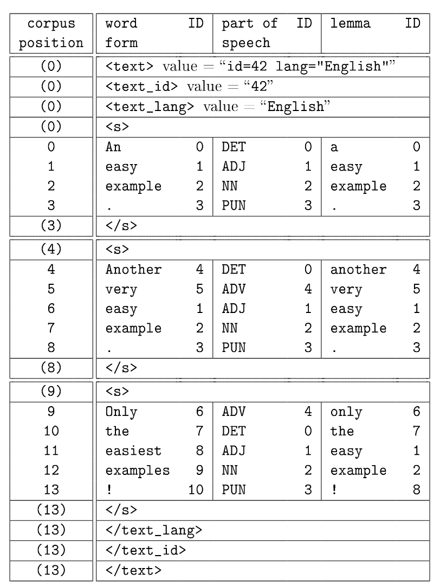

上次看了CWB關於p-attribute encoding的實現，現在來看的是CWB如何編碼.vrt檔中像是XML tag的資訊。
以下是我準備這次要用的 .vrt 檔：

```
<post>
<title author="don" year="2008">
How	  M
to	  TO
save  V
money N
</title>
<body author="don" year="2008">
I	    PROP
would	M
say	    V
save	V
money	N
</body>
</post>
```

然後下編碼指令：
```bash
$ cwb-encode \
-d /Users/koukantou/Desktop/try_cwb_encode/data/corpus_ptt \
-f /Users/koukantou/Desktop/try_cwb_encode/corpus_ptt.vrt \
-R /Users/koukantou/Desktop/try_cwb_encode/registry/corpus_ptt \
-P pos \
-S post \
-S title:0+author+year \
-S body:0+author+year \
-c utf8 \
-vDxsB \
```

成功執行後會看到在我指定的data directory裡面增加了以下幾個新檔案：

- body.rng
- body_author.rng
- body_author.avs
- body_author.avx
- post.rng
- title.rng 
- title_author.rng
- title_author.avs
- title_author.avx
- title_year.rng
- title_year.avs
- title_year.avx 
           

`utils/cwb-encode.c` 中有提到三種副檔名的檔案的作用

```
*.rng: rng component (cpos start/end pairs for the attribute's ranges)
*.avx: avx component (the attribute value index)
*.avs: avs component (the attribute values)
  ```
  
 所以這也是為什麼我的 `body` `post` `title` 只有 `.rng`檔，因為以`post`來看的話，在我的`.vrt`中，`<post></post>`是非常單純的XML tag，這個tag裡頭沒有加上任何的 attribute-value pair。
 
# CWB 的編碼


(來源：http://cwb.sourceforge.net/files/CQP_Tutorial.pdf)

可以注意的是最左邊的corpus position，對CWB來說，真正會佔一個實質position的元素是 p-attribute，而像是XML tag的s-attribute，並不會真正佔一個位置。

按這這個邏輯，我也來把我的`.vrt`加上CWB眼中的corpus position：
```
(0)  <post>
(0)  <title author="don" year="2008">
0    How	  M
1    to	  TO
2    save    V
3    money   N
(3)  </title>
(4)  <body author="don" year="2008">
4   I	    PROP
5   would	M
6   say	  V
7   save 	V
8   money	N
(8)  </body>
(8) </post>
```


# 哪幾行將文字寫進了檔案
經過上次的經驗，我發現我可以先去找出到底是哪幾行程式執行了「寫入檔案」這件事，找出來之後就可以比較快回推到底寫了什麼東西進去。

我發現把資料寫進 `.rng`, `.avs`, `.avx` 檔的程式是在一個叫做 `s_att_close_range` 的函式裡：

## 寫進 `.rng`

`s_att_close_range()` in `utils/cwb-encode.c`:

```C
/* write (start, end) to .rng component */
NwriteInt(encoder->start_pos, encoder->fd);
NwriteInt(end_pos, encoder->fd);
```

從作者的註釋就可以看到，寫進`.rng`的是所謂的 `start_pos` 和 `end_pos`，我猜測應該就是只一個tag他在哪個corpus position開啟、在哪個corpus position關閉。我實際打開 `post.rng`：

```
0000 0000 0000 0008
```

的確與我上面幫`.vrt`檔標的corpus position相吻合。`<post>`在第0個位置(`00000000`)，而`</post>`在第8個位置(`00000008`)。原來`.rng`記載的就是這樣的資訊而已。（不知道.rng這個名字的意義是什麼。）

剛剛忘了說，CWB會把一個tag的屬性（如果有的話）視為一個新的tag。例如，我的`<title>`標籤，包含了`author`的屬性：

```
<title author="don">
</title>
```

對CWB來說，他會把這個看成：

```
<title>
<title_author>
   [value = "don"]
</title_author>
</title>
```

這也是為什麼我們會在生成的檔案中看到以 `title_author` 開頭的檔案，因為CWB把這個視為一個獨立的XML標籤。


## 寫進 `.avs`

`s_att_close_range()` in `utils/cwb-encode.c`:
```C
/* check if annot is already in hash */
if (!(entry = cl_lexhash_find(encoder->lh, encoder->annot)))  {
  /*
   * present annotation was not found in the hash - so it is a new value.
   * so insert annotation string into lexicon hash (with the avs offset as data.integer)
   */
  entry = cl_lexhash_add(encoder->lh, encoder->annot);
  entry->data.integer = encoder->offset;

  /* write annotation string to .avs component (at offset encoder->offset) */
  fprintf(encoder->avs, "%s%c", encoder->annot, '\0');
}
```

重點在最後一行：

```C
fprintf(encoder->avs, "%s%c", encoder->annot, '\0');
```

把每個annotation作為字串寫進去，最後再加上一個`\0`字元。舉例來說，我的`<title_year>`的值是2008，那我們打開`title_year.avs`就可以看到：

```
3230 3038 00
```

`32303038`就是2008的ASCII編碼，然後最後再加上一個`00`用來表示`\0`字元。

而且`.avs`存的是所有**不重複**的attribute們（像個lexicon那樣）。

## 寫進 `.avx`

`s_att_close_range()` in `utils/cwb-encode.c`:

```
/* write (range_number, offset) to .avx component */
NwriteInt(encoder->num, encoder->avx);  /* this was intended for 'sparse' annotations, which I don't like (so they're no longer there) */
NwriteInt(entry->data.integer, encoder->avx);
```

以`title_author.avx`來說，我的`.vrt`檔裡出現幾個title_author的值，就會存幾筆資料。他不像是`.avs`只存所有不重複的資料。`.avx`裡的每筆資料的後半部是告訴我們，這筆資料要到`.avs`檔的第幾個byte去尋找。
