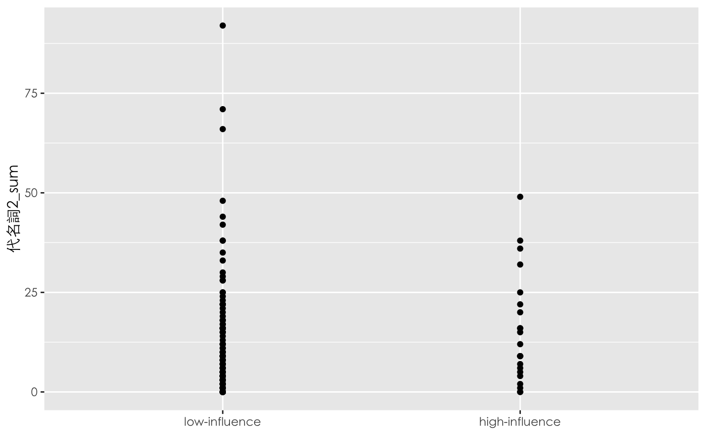
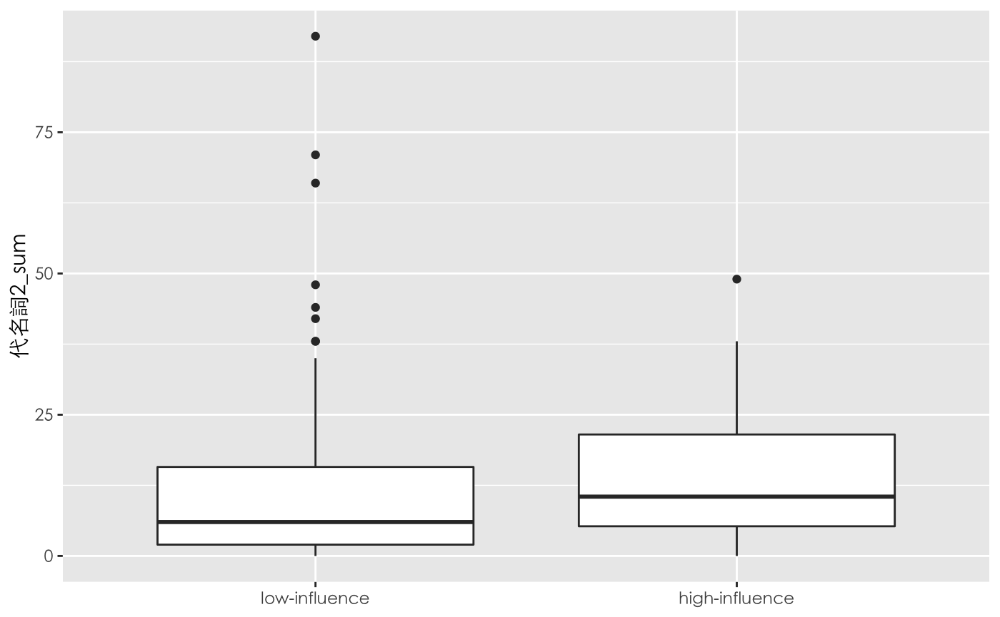

最近由於需要把資料視覺化，因此就想說來順便練習使用R跟ggplot。


我的資料是PTT婚姻版上，分類出高影響力和低影響力的作者後，想看這兩類群體的代名詞數量是否有差異。

先用點圖來呈現，可以看到在低影響力的群體中比較離散。但是兩邊的資料幾乎都擠在一起，根本看不出實際的分布狀況。

```r
ggplot(df, aes(高影響力, 代名詞2_sum)) + 
    geom_point() + 
    theme(text = element_text(family = "Heiti TC Light")) +
    scale_x_discrete(labels=c("FALSE" = "low-influence", "TRUE" = "high-influence")) + 
    xlab(NULL)
```




所以再用box plot來看一下，可以看到高影響力的群體中，使用第二人稱的數量的確平均來說比較高。

```r
ggplot(df, aes(高影響力, 代名詞2_sum)) + 
    geom_boxplot() + 
    theme(text = element_text(family = "Heiti TC Light")) +
    scale_x_discrete(labels=c("FALSE" = "low-influence", "TRUE" = "high-influence")) + 
    xlab(NULL)
```




最後是有在別的地方看到，有些人會在點圖的基礎上，幫兩邊的平均值連線，畫出一條直線，能比較直觀的呈現相關走勢。這是我這次學到的地方，使用`stat_summary()`的組合。


要畫出兩群資料中的平均值（圖中的紅點），只要輸入` + stat_summary(fun=mean, color="red", geom="point")`就可以。而我遇到的困難是要將兩個紅點連線，一開始我是用 `+ stat_summary(fun=mean, color="red", geom="line")`，但完全沒有跑出直線，後來上網找到答案，要加一個constant group mapping，也就是下面程式碼中`aes(group = 0)`的部分，才會work。

```r
ggplot(df, aes(高影響力, 代名詞2_sum)) + 
    geom_point() + 
    stat_summary(fun=mean, aes(group = 0), colour="red", geom="line") + 
    stat_summary(fun=mean, colour="red", geom="point") + theme(text = element_text(family = "Heiti TC Light")) +
    scale_x_discrete(labels=c("FALSE" = "low-influence", "TRUE" = "high-influence")) + 
    xlab(NULL)
```


其實到底為什麼會這樣，我還沒理解，我先附上我找到的教學：[ggplot2: aes(group = ...) overrides default grouping](https://www.gl-li.com/2017/08/13/ggplot2-group-overrides-default-grouping/)
