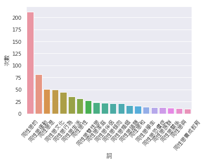
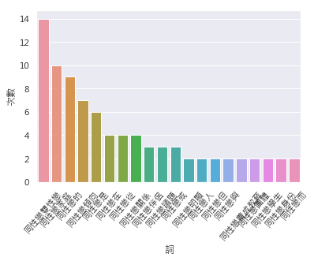

# 台灣同性婚姻論述中的「同性戀」

## 前情提要
我在[第二篇文章](https://collabin.netlify.com/don/taiwan-same-sex-marriage2/)中發現下福盟和伴侶盟兩個語料中，「同志」和「同性戀」兩個詞使用頻率有明顯的不同情形：



接著我先討論「同志」一詞分別作為「複合名詞前半部」（見[第三篇文章](https://collabin.netlify.com/don/tongzhi-in-samesex-marriage-corpora/)）以及作為「動詞的主事者或受事者」（見[第四篇文章](https://collabin.netlify.com/don/tongzhi-in-samesex-marriage-corpora-2/)）的分佈情形。

關於「同志」一詞大概有了一些結果，但我的終極目標是比較「同志」和「同性戀」這一對近義詞在兩個語料中的使用差異。

## 所以...
本篇要看的是「同性戀」一詞在兩個語料中的差異。「同性戀」比起「同志」有趣的地方在於，「同性戀」在下福盟的語料中出現的頻率幾乎與「同志」出現的頻率平起平坐，但在伴侶盟的語料中，「同性戀」的出現頻率卻只有「同志」的三分之一不到。

到底什麼為什麼這個詞在兩個語料中會有那麼懸殊的比例呢？在兩個語料中究竟這個詞是如何被使用的呢？

以下仿照我在第三篇文章就已經寫好的code：匯入語料，並轉換成`nltk.text.Text()`物件。


```python
import nltk
import re
import jieba
import pandas as pd
import seaborn as sns
import matplotlib.pyplot as plt
from matplotlib.font_manager import FontProperties
from IPython.display import display

plt.rcParams['figure.figsize'] = [10, 5]
myfont = FontProperties(fname=r'/usr/local/lib/python3.7/site-packages/matplotlib/mpl-data/fonts/ttf/msj.ttf',size=14)
sns.set(font=myfont.get_name())

%matplotlib inline

pd.set_option('display.max_rows', 2000)

LGBTFAMILY_PATH = "line_sentence_lgbtfamily.txt"
LOVEFAMILY_PATH = "line_sentence_lovefamily.txt"

lgbtfamily_raw_text = ""
lovefamily_raw_text = ""

with open(LGBTFAMILY_PATH) as f:
    lgbtfamily_raw_text = f.read()

with open(LOVEFAMILY_PATH) as f:
    lovefamily_raw_text = f.read()
    
# 將文本拆成 list of words
lgbtfamily_word_list = [word for sentence in lgbtfamily_raw_text.split('\n') for word in sentence.split(' ')]
lovefamily_word_list = [word for sentence in lovefamily_raw_text.split('\n') for word in sentence.split(' ')]

# 轉換好後，丟入 nltk.text.Text
lovefamily_text = nltk.text.Text(lovefamily_word_list)
lgbtfamily_text = nltk.text.Text(lgbtfamily_word_list)
```

## 下福盟中的「同性戀」

大家可以先稍微瀏覽一下在下福盟語料中「同性戀」一詞出現的句子有哪些：


```python
lovefamily_tongzhi_c = lovefamily_text.concordance_list('同性戀', width=50, lines=10000)

lovefamily_tongzhi_df = pd.DataFrame({
    "left_context": [' '.join(line.left) for line in lovefamily_tongzhi_c],
    "query": '同性戀',
    "right_context": [' '.join(line.right) for line in lovefamily_tongzhi_c],
})

lovefamily_tongzhi_df
```


<div>
<style scoped>
    .dataframe tbody tr th:only-of-type {
        vertical-align: middle;
    }

    .dataframe tbody tr th {
        vertical-align: top;
    }

    .dataframe thead th {
        text-align: right;
    }
</style>
<table border="1" class="dataframe">
  <thead>
    <tr style="text-align: right;">
      <th></th>
      <th>left_context</th>
      <th>query</th>
      <th>right_context</th>
    </tr>
  </thead>
  <tbody>
    <tr>
      <th>0</th>
      <td>國家 定 有 雞姦 法 禁止 同性 肛交 另一方面 國際 間 對於</td>
      <td>同性戀</td>
      <td>是否 為 天生 仍多 爭論 同性 間 的 性行為 並無 增進</td>
    </tr>
    <tr>
      <th>1</th>
      <td>權力 約束 聯合國 成員國 在 聯合國 的 組織 裡面 的確 有 支持</td>
      <td>同性戀</td>
      <td>運動 的 如 日惹 原則 的 發佈 但 其他 有 主權</td>
    </tr>
    <tr>
      <th>2</th>
      <td>增刪 的 權利 投稿 信箱 為 了 逼 田納西州 中學 通過 有利於</td>
      <td>同性戀</td>
      <td>學生 社團 的 校規 同運 份子 威脅 要 破壞 學校 董事</td>
    </tr>
    <tr>
      <th>3</th>
      <td>與 生計 以 官司 對付 董事會 他們 先前 且 在 該校 的</td>
      <td>同性戀</td>
      <td>社團 集會 中 痛 敺 家長 好消息 是 越來越 多人 不</td>
    </tr>
    <tr>
      <th>4</th>
      <td>社團 集會 中 痛 敺 家長 好消息 是 越來越 多人 不 支持</td>
      <td>同性戀</td>
      <td>他們 正 挺身而出 反 嗆 發動 攻擊 的 人士 每當 田納西州</td>
    </tr>
    <tr>
      <th>5</th>
      <td>攻擊 的 人士 每當 田納西州 有 學校 董事會 考慮 禁止 或 撤銷</td>
      <td>同性戀</td>
      <td>學生 社團 時 全美 同性戀 雙性戀 和 跨性別 運動 通常 的</td>
    </tr>
    <tr>
      <th>6</th>
      <td>有 學校 董事會 考慮 禁止 或 撤銷 同性戀 學生 社團 時 全美</td>
      <td>同性戀</td>
      <td>雙性戀 和 跨性別 運動 通常 的 反應 都 是 威脅 要</td>
    </tr>
    <tr>
      <th>7</th>
      <td>反抗 組織 的 協助 下 法蘭克 林 中學 的 董事會 不但 阻止</td>
      <td>同性戀</td>
      <td>在 學校 設立 社團 且 在 打官司 上 安全 過關 該</td>
    </tr>
    <tr>
      <th>8</th>
      <td>在 準備 為 新 校規 進行 投票表決 這些 新 校規 足以 影響</td>
      <td>同性戀</td>
      <td>社團 在 學校 的 生存 因此 董事 們 和 說話 直率</td>
    </tr>
    <tr>
      <th>9</th>
      <td>電子郵件 與 該 董事會 聯繫 他 也 曾 在 月 日 到</td>
      <td>同性戀</td>
      <td>學生 社團 的 集會 發表演說 給 學生 令人 不寒 而 憟</td>
    </tr>
    <tr>
      <th>10</th>
      <td>團體 及 青年 倡導 的 議題 且 似乎 特別 重視 各校 成立</td>
      <td>同性戀</td>
      <td>社團 的 事 有趣 的 是 他 同時 是 集體 反抗</td>
    </tr>
    <tr>
      <th>11</th>
      <td>第一封 電郵 指名 要給 蓋斯 因為 蓋斯 一直 批評 在 學校 成立</td>
      <td>同性戀</td>
      <td>社團 的 事 蓋斯 的 正職 乃是 法蘭克 林郡 最高 保安局</td>
    </tr>
    <tr>
      <th>12</th>
      <td>特仁契 控告 蓋斯 指揮 警官 聯署 一份 文件 同意 警員 不必 理會</td>
      <td>同性戀</td>
      <td>社團 申訴 的 遭霸凌 事件 因為 蓋斯 反對 這類 學生 社團</td>
    </tr>
    <tr>
      <th>13</th>
      <td>讓 校規 給予 家長 有 選擇 參與 學校 決策 的 權力 則</td>
      <td>同性戀</td>
      <td>學生 社團 就 不 可能 是 安全 的 環境 因為 他們</td>
    </tr>
    <tr>
      <th>14</th>
      <td>同運 份子 都 戴 著 彩虹 顏色 的 花環 和 其他 象徵</td>
      <td>同性戀</td>
      <td>的 服飾 另一半 的 參與者 則是 當地 家長 及護家 人士 蓋斯</td>
    </tr>
    <tr>
      <th>15</th>
      <td>控告 他 指使 警官 聯署 一份 文件 支持 警方 可以 不 理會</td>
      <td>同性戀</td>
      <td>社團 申訴 遭霸凌 的 事 他 毫不 生氣 地 表示 法蘭克</td>
    </tr>
    <tr>
      <th>16</th>
      <td>三個 月 來 最大 的 事 就是 在 法蘭克 林郡 中學 建立</td>
      <td>同性戀</td>
      <td>和 異性戀 社團 事實上 問題 在於 同性戀 及 異性戀 教育網絡</td>
    </tr>
    <tr>
      <th>17</th>
      <td>在 法蘭克 林郡 中學 建立 同性戀 和 異性戀 社團 事實上 問題 在於</td>
      <td>同性戀</td>
      <td>及 異性戀 教育網絡   簡稱 和 同性戀 與 直 同志</td>
    </tr>
    <tr>
      <th>18</th>
      <td>社團 事實上 問題 在於 同性戀 及 異性戀 教育網絡   簡稱 和</td>
      <td>同性戀</td>
      <td>與 直 同志 聯盟 簡稱 譯註 直 同志 意指 對 同性戀</td>
    </tr>
    <tr>
      <th>19</th>
      <td>和 同性戀 與 直 同志 聯盟 簡稱 譯註 直 同志 意指 對</td>
      <td>同性戀</td>
      <td>友善 的 異性戀 者 實際上 是 由 成人 左派 活躍 份子</td>
    </tr>
    <tr>
      <th>20</th>
      <td>電郵 中 所 警告 的 事 投票 結果 七比 一 通過 反對</td>
      <td>同性戀</td>
      <td>社團 的 校規 接著 開始 投票 就算 有 任何 疑問 蓋斯</td>
    </tr>
    <tr>
      <th>21</th>
      <td>覺得 真的 是 很 難 你們 真的 很棒 然後 第四點 我要 跟</td>
      <td>同性戀</td>
      <td>的 朋友 說 我 真的 沒有 恨 你們 我 沒有 要</td>
    </tr>
    <tr>
      <th>22</th>
      <td>一個 機會 來 表明 他們 認同 的 是 哪 一種 美德 也許</td>
      <td>同性戀</td>
      <td>行為 真的 會 被 認為 是 一種 美德 阿 我 認為</td>
    </tr>
    <tr>
      <th>23</th>
      <td>的 法案 使 義大利 社會 變得 更加 世俗化 拋棄 信仰 真理 迎合</td>
      <td>同性戀</td>
      <td>運動 的 要求 甘心 走向 破壞 傳統 家庭 的 道路 這也</td>
    </tr>
    <tr>
      <th>24</th>
      <td>信任票 企圖 含混 地 讓 整個 法案 過關 聯合政府 轉向 左派 同情</td>
      <td>同性戀</td>
      <td>運動 目前 屬 多數 的 聯合 執政黨 中 左派 右派 參半</td>
    </tr>
    <tr>
      <th>25</th>
      <td>其他 已 核准 的 同性婚姻 權利 不同 的 是 目前 尚 不准</td>
      <td>同性戀</td>
      <td>配偶 領養 小孩 但是 不用 預言 也 知道 這項 法案 未來</td>
    </tr>
    <tr>
      <th>26</th>
      <td>有 問題 的 條款 包括 規定 選擇 民事 結合 的 人 意指</td>
      <td>同性戀</td>
      <td>人 結成 的 婚姻 不必 負責 任 協助 及 照顧 遭遇</td>
    </tr>
    <tr>
      <th>27</th>
      <td>格是 卡里亞 生前 經常 發表意見 的 地方 他 的 言論 不是 出於</td>
      <td>同性戀</td>
      <td>恐懼症 而是 出於 他 認為 規範 及 重新 定義 婚姻 是</td>
    </tr>
    <tr>
      <th>28</th>
      <td>美國最高法院 以六票 對 三票 通過 科羅拉多州 憲法 修正案 該案 旨在 讓 保護</td>
      <td>同性戀</td>
      <td>或 雙性戀 的 條文 不至於 違反 該州 憲法 的 平等 保護</td>
    </tr>
    <tr>
      <th>29</th>
      <td>所 反映 的 觀點 和 價值觀 會 被 全民 採納 他們 對</td>
      <td>同性戀</td>
      <td>的 看法 會成 為 各 公私 機構 為 求職者 面試 時</td>
    </tr>
    <tr>
      <th>30</th>
      <td>小熊 棒球隊 而 拒絕 錄取 他 但是 如果 面試官 是 因為 反對</td>
      <td>同性戀</td>
      <td>而 不 願意 與 求職者 成為 同僚 或 工作 夥伴 他</td>
    </tr>
    <tr>
      <th>31</th>
      <td>告 德州 案 年 美國最高法院 曾 以六票 對 三票 推翻 德州 反</td>
      <td>同性戀</td>
      <td>法案 促使 同性戀 行為 在 全美 各州 都 合法化 史 卡里亞</td>
    </tr>
    <tr>
      <th>32</th>
      <td>年 美國最高法院 曾 以六票 對 三票 推翻 德州 反 同性戀 法案 促使</td>
      <td>同性戀</td>
      <td>行為 在 全美 各州 都 合法化 史 卡里亞 反對 如今 的</td>
    </tr>
    <tr>
      <th>33</th>
      <td>是 法學專業 文化 的 產品 這 意見 卻是 簽字 認同 所謂 的</td>
      <td>同性戀</td>
      <td>議程 史 卡里亞 說 他 所謂 的 議程 是 指 由</td>
    </tr>
    <tr>
      <th>34</th>
      <td>同運 活躍 份子 指導 的 計畫 這計畫 旨在 消除 傳統 上 對</td>
      <td>同性戀</td>
      <td>行為 施加 的 道德 羞恥感 史 卡里亞 指出 從 這件 事</td>
    </tr>
    <tr>
      <th>35</th>
      <td>情況 許多 美國 人並 不 希望 有人 在 他們 公司 公開 從事</td>
      <td>同性戀</td>
      <td>行為 或 由 同性戀者 擔任 他們 子女 的 童軍 隊長 和</td>
    </tr>
    <tr>
      <th>36</th>
      <td>膳宿 美國 民眾 視此 為 自保 之道 以免 自己 和 家庭 受到</td>
      <td>同性戀</td>
      <td>這種 不道德 且 有害 的 生活 模式 影響 史 卡里亞 說</td>
    </tr>
    <tr>
      <th>37</th>
      <td>阻止 這樣 的 事情 因此 最高法院 已經 被 法學專業 人士 的 反反</td>
      <td>同性戀</td>
      <td>文化 染 了 色 這種 文化 的 態度 似乎 尚未可知 會</td>
    </tr>
    <tr>
      <th>38</th>
      <td>獲得成功 企業界 都 知道 德州 是 全美 少數幾個 將 私人 兩情相悅 的</td>
      <td>同性戀</td>
      <td>行為 視為 非法 的 州 但是 奉勸 其 成員 追隨 團體</td>
    </tr>
    <tr>
      <th>39</th>
      <td>又 是 另一回事 史 卡里亞 說 我 不會 再 要求 任何 一州將</td>
      <td>同性戀</td>
      <td>行為 非法 化 或者 表露 同性戀 行為 有 多麼 不成體統 我會</td>
    </tr>
    <tr>
      <th>40</th>
      <td>我 不會 再 要求 任何 一州將 同性戀 行為 非法 化 或者 表露</td>
      <td>同性戀</td>
      <td>行為 有 多麼 不成體統 我會 直接 禁止 同性戀 德州 的 抉擇</td>
    </tr>
    <tr>
      <th>41</th>
      <td>非法 化 或者 表露 同性戀 行為 有 多麼 不成體統 我會 直接 禁止</td>
      <td>同性戀</td>
      <td>德州 的 抉擇 正是 在 傳統 民主 行為 範圍 內 的</td>
    </tr>
    <tr>
      <th>42</th>
      <td>美國 憲法 修正案 的 平等 保護 條款 最高法院 以五票 對 四票 通過</td>
      <td>同性戀</td>
      <td>伴侶 擁有 結婚 的 基本權利 史 卡里亞 反對 今天 的 法令</td>
    </tr>
    <tr>
      <th>43</th>
      <td>發展 有何 好處 難道 政府 一昧 追隨 世界 各國 政府 致力 討好</td>
      <td>同性戀</td>
      <td>不婚 主義者 一步步 解構 婚姻家庭 就是 跟上 世界潮流 嗎 可 收養</td>
    </tr>
    <tr>
      <th>44</th>
      <td>的 最佳 利益 兒童 擁有 被 他們 爸爸媽媽 養育 的 權利 不論是</td>
      <td>同性戀</td>
      <td>或是 異性戀 都 不能 任意 剝奪 孩子 這個 基本 權力 在</td>
    </tr>
    <tr>
      <th>45</th>
      <td>可以 收養 小孩 基本上 已經 枉顧 兒童 的 最佳 利益 許多 被</td>
      <td>同性戀</td>
      <td>撫養 長大 的 孩子 都 站 出來 見證 同性 收養 小孩</td>
    </tr>
    <tr>
      <th>46</th>
      <td>有 任何 反對 同性婚姻 的 言論 也 會 被 視為 創造 敵視</td>
      <td>同性戀</td>
      <td>學生 的 教學 環境 許多 辦公室 甚至 非營利 機構 都 已經</td>
    </tr>
    <tr>
      <th>47</th>
      <td>宣導 的 名義 而是 狡猾地 以 預防 校園 霸凌為 名 宣傳 接納</td>
      <td>同性戀</td>
      <td>青少年 及 那些 來自 於 同性 家庭 的 孩童 政府 鼓勵</td>
    </tr>
    <tr>
      <th>48</th>
      <td>主義 的 傷害 例如 安大略省 政府 規定 天主教 學校 必須 定期 舉辦</td>
      <td>同性戀</td>
      <td>異性戀 聯合 主日學 且 規定 使用 同性 之類 的 名稱 並且</td>
    </tr>
    <tr>
      <th>49</th>
      <td>承認 結果 是 可 預期 的 儘管如此 判決 結果 對 歐洲 的</td>
      <td>同性戀</td>
      <td>權利 帶來 毀滅性 的 影響 粉碎 同性婚姻 成為 事實 的 希望</td>
    </tr>
    <tr>
      <th>50</th>
      <td>願意 被 相關 條約 規範 此 判決 特別 重創 了 芬蘭 的</td>
      <td>同性戀</td>
      <td>權益 其實 國會議員 在 上個月 已 拒絕 通過 同性婚姻 立法 這是</td>
    </tr>
    <tr>
      <th>51</th>
      <td>芬蘭 外交部 人員 外電 原文     翻譯 參考 自</td>
      <td>同性戀</td>
      <td>資料庫 小編 補充 新聞 原文 既然 已 報導 同性婚姻 非 權利</td>
    </tr>
    <tr>
      <th>52</th>
      <td>使用 同志 平權 或 婚姻 平權 直接 稱 之 同性 婚 或</td>
      <td>同性戀</td>
      <td>議程 可能 會 較 合適</td>
    </tr>
    <tr>
      <th>53</th>
      <td>背景 本站 保留 編輯 增刪 的 權利 投稿 信箱 關啟 文近 數十年</td>
      <td>同性戀</td>
      <td>社運 簡稱 同運風 起雲 湧 不單 在 西方 帶來 巨大 衝擊</td>
    </tr>
    <tr>
      <th>54</th>
      <td>成長 的 研究 該校 副教授 負責 他 比較 其 父母 曾經 有</td>
      <td>同性戀</td>
      <td>關係 的 青壯年 與其 他 家庭 模式 的 青壯年 發現 在</td>
    </tr>
    <tr>
      <th>55</th>
      <td>有期徒刑 前項 之 未遂犯 罰 之 你 想要 愛滋 嘛 請勿 支持</td>
      <td>同性戀</td>
      <td>議程 一般 媒體 會錯 譯成 同志 平權 原文 聯合報 記者 黃</td>
    </tr>
    <tr>
      <th>56</th>
      <td>超過 一百萬名 義大利人 聚集 羅馬 圓形 競技場 抗議 國會 正在 研議 的</td>
      <td>同性戀</td>
      <td>結合 及 收養 子女 法案 一事 網友 紛紛 表態 支持 認為</td>
    </tr>
    <tr>
      <th>57</th>
      <td>梵諦岡 當局 因此 瞭解 民眾 想要 的 是 什麼 而 不要 讓</td>
      <td>同性戀</td>
      <td>運動 因為 有 能力 了 就 將著 魔 似的 議程 強壓</td>
    </tr>
    <tr>
      <th>58</th>
      <td>的 議題 沒有 經過 討論 就 自行決定 用 納稅人 的 錢 推動</td>
      <td>同性戀</td>
      <td>文化 我們 表達 強列 反對 大家 一起 向 市府 反對 吧</td>
    </tr>
    <tr>
      <th>59</th>
      <td>是 納稅人 的 錢 本應 依法行政 不應 為 特定 意識 背書 推動</td>
      <td>同性戀</td>
      <td>文化 民政局長 藍世聰 表示 擁有 伴侶 與 婚姻 應 屬 每個</td>
    </tr>
    <tr>
      <th>60</th>
      <td>多年 以 性別 平等 教育 之 名義 偷渡 多元 情慾 教育 和</td>
      <td>同性戀</td>
      <td>養成教育 令 全台 各地 眾多 家長 跳腳 多次 引發 地方 民眾</td>
    </tr>
    <tr>
      <th>61</th>
      <td>養成教育 東森 公民 課本 教 異性戀 霸權 反同 團體 誘導 孩子 成為</td>
      <td>同性戀</td>
      <td>上報 本 教科書 談 異性戀 霸權 台 師大 教授 讓 成</td>
    </tr>
    <tr>
      <th>62</th>
      <td>這份 問卷 真的 具有 參考價值 嗎 民調 發起者 有 同志 團體 和</td>
      <td>同性戀</td>
      <td>學者 同運 團體 最愛 拿 研究 單位 的 身分 背景 來</td>
    </tr>
    <tr>
      <th>63</th>
      <td>是 進入 同性伴侶 關係 的 女 同性戀者 且 是 平常 活躍 於</td>
      <td>同性戀</td>
      <td>文化 和 同志 運動 的 同運 人士 柯乃熒 是 愛滋 團體</td>
    </tr>
    <tr>
      <th>64</th>
      <td>近幾年 亦 屢屢 跟 同運 團體 開 記者會 要求 政府 推動 校園</td>
      <td>同性戀</td>
      <td>教育 並 反對 同性戀者 自願 接受 精神 治療 的 醫療 權益</td>
    </tr>
    <tr>
      <th>65</th>
      <td>高達 依據 中研院 在 年 發佈 的 研究 台灣 自認 為 是</td>
      <td>同性戀</td>
      <td>的 民眾僅 即便 納入 雙性戀 和 不 清楚 自己 性 傾向</td>
    </tr>
    <tr>
      <th>66</th>
      <td>的 同志 族群 也僅 佔 總人口 的 但是 這次 同運 團體 和</td>
      <td>同性戀</td>
      <td>教授 發佈 的 民調 光 同性戀者 比例 就 高達 雙性戀 者</td>
    </tr>
    <tr>
      <th>67</th>
      <td>的 細節 在 三年級 歲 小朋友 要 學習 什麼 是 性 傾向</td>
      <td>同性戀</td>
      <td>性別 認同 跨性別 以及 有 兩個 爸爸 跟 兩個 媽媽 的</td>
    </tr>
    <tr>
      <th>68</th>
      <td>同性戀 性別 認同 跨性別 以及 有 兩個 爸爸 跟 兩個 媽媽 的</td>
      <td>同性戀</td>
      <td>家庭 等 相關 知識 在 四年級 歲 老師 要 跟 學童</td>
    </tr>
    <tr>
      <th>69</th>
      <td>表示 我 看過 他們 的 性 教育 大綱 因為 有 一部分 的</td>
      <td>同性戀</td>
      <td>需要 把 同性戀 的 權利 放進 教學大綱 裡 這 一點 我</td>
    </tr>
    <tr>
      <th>70</th>
      <td>他們 的 性 教育 大綱 因為 有 一部分 的 同性戀 需要 把</td>
      <td>同性戀</td>
      <td>的 權利 放進 教學大綱 裡 這 一點 我 不 反對 我們</td>
    </tr>
    <tr>
      <th>71</th>
      <td>前言 要 區分 個人 問題 與 政治 問題 反對 高度 政治化 的</td>
      <td>同性戀</td>
      <td>社動 同運 不 代表 反對 同性戀者 本身 並不 全盤否定 同運 的</td>
    </tr>
    <tr>
      <th>72</th>
      <td>家庭 的 芬蘭 新政府 上任 後 發行 新 芬蘭文 版 集體 抗議</td>
      <td>同性戀</td>
      <td>運動 小冊子 支持 傳統 家庭 的 芬蘭 新政府 去年 中期 就任</td>
    </tr>
    <tr>
      <th>73</th>
      <td>些微 多數 通過 同性婚姻 法 就 像 世界 其他 許多 地區 一樣</td>
      <td>同性戀</td>
      <td>運動 陣營 採取 咄咄逼人 且 不 民主 的 策略 在 國會</td>
    </tr>
    <tr>
      <th>74</th>
      <td>最大 的 阻礙 就是 芬蘭 的 新聞媒體 媒體 大致 上 都 為</td>
      <td>同性戀</td>
      <td>遊說 團體 說話 媒體 老是 用 錯誤 的 假 資訊 向大眾</td>
    </tr>
    <tr>
      <th>75</th>
      <td>資訊 向大眾 洗腦 芬蘭 全國 和 政治 領袖 一直 被 媒體 灌輸</td>
      <td>同性戀</td>
      <td>的 不當 觀念 真是 遺憾 第二個 問題 是 我們 在 芬蘭</td>
    </tr>
    <tr>
      <th>76</th>
      <td>起來 不斷 舉行 大型 的 禱告 會 運動 以 阻止 打敗 同運</td>
      <td>同性戀</td>
      <td>遊說 團體 正在 召聚 幼童 揮舞 彩虹 旗幟 參加 他們 的</td>
    </tr>
    <tr>
      <th>77</th>
      <td>各州 均 得 承認 同性婚姻 使 美國 成為 第個 全國 都 享有</td>
      <td>同性戀</td>
      <td>可 合法 註冊 結婚 的 國家 同時 也 是 第二個 同性婚姻</td>
    </tr>
    <tr>
      <th>78</th>
      <td>權利 投稿 信箱 原文 出處 將近 親相姦 戀童 等 兩 事項 與</td>
      <td>同性戀</td>
      <td>做 類比 圖片 來源 澳洲 新南 威爾斯 州 一名 法官 在</td>
    </tr>
    <tr>
      <th>79</th>
      <td>的 年代 婚前 性行為 已 不 被 視為 不 合法 並 以</td>
      <td>同性戀</td>
      <td>為例 認為 該行 為 在 過去 同樣 被視 為 不 自然</td>
    </tr>
    <tr>
      <th>80</th>
      <td>幸福 盟 內部 有 討論 提出 第三個 公投 提案 方向 是 保障</td>
      <td>同性戀</td>
      <td>朋友 的 權益 幸福 盟 婚姻 定義 公投 主文 設計 符合</td>
    </tr>
    <tr>
      <th>81</th>
      <td>的 義務 呢 以下 提供 簡便 的 法治 資訊 供想 成家 的</td>
      <td>同性戀</td>
      <td>朋友 們 參考 一 民法 已 允許 同性伴侶 成家 民法 條規</td>
    </tr>
    <tr>
      <th>82</th>
      <td>遷入 戶籍 登記 申請書 一 登記 於 自有 房屋 之 情形 假如</td>
      <td>同性戀</td>
      <td>屋主 希望 與 同性伴侶 登記 為 一戶 辦理 戶籍 登記 要</td>
    </tr>
    <tr>
      <th>83</th>
      <td>幫 同性愛 人辦 遷入 登記 由 屋主 幫 愛人 辦 登記 請</td>
      <td>同性戀</td>
      <td>屋主 攜帶 兩人 的 戶口名簿 印鑑 身分證 以及 同性伴侶 的 委託書</td>
    </tr>
    <tr>
      <th>84</th>
      <td>機關 均會 提供 無 底片 的 照相 服務 一張 照片 元 如果</td>
      <td>同性戀</td>
      <td>伴侶 渴望 身分證 能 證明 兩 人間 的 親密關係 其實 在</td>
    </tr>
    <tr>
      <th>85</th>
      <td>自有 房屋 是 貧窮 同志 或 均 為 外地 打拼 求學 的</td>
      <td>同性戀</td>
      <td>青年 也 可以 選擇 徵求 房東 同意 將 戶籍 掛在 租屋</td>
    </tr>
    <tr>
      <th>86</th>
      <td>北 市 中正 區 戶政事務 所 登記 結婚 的 活動 新興 的</td>
      <td>同性戀</td>
      <td>團體 同心盟 也 反對 主流 同運 人士 在 國難 當前 的</td>
    </tr>
    <tr>
      <th>87</th>
      <td>在 戶籍 只能 登記 為 寄居 所以 必須 通過 同性婚姻 延伸 閱讀</td>
      <td>同性戀</td>
      <td>已能 依法 成家 簽 手術 同意書 台灣 不 需要 會 升高</td>
    </tr>
    <tr>
      <th>88</th>
      <td>為 物品 的 危險 他們 的 權利 也將 受到 侵害 另一方面 義大利</td>
      <td>同性戀</td>
      <td>陣營 的 目標 顯然 比 大部分 護家 陣營 的 專家 更</td>
    </tr>
    <tr>
      <th>89</th>
      <td>主要 原因 締造 誤導 的 統計數字 讓 諸如 計畫 生育 協會 和</td>
      <td>同性戀</td>
      <td>雙性戀 與 跨性別 團體 等 激進 的 組織 用來 說服 政治</td>
    </tr>
    <tr>
      <th>90</th>
      <td>市 應該 接納 性別 與性 傾向 的 多樣化 及性 自決 並 反對</td>
      <td>同性戀</td>
      <td>恐懼症 及 跨性別 恐懼症 此外 應 給予 指 同性戀 雙性戀 跨性別</td>
    </tr>
    <tr>
      <th>91</th>
      <td>自決 並 反對 同性戀 恐懼症 及 跨性別 恐懼症 此外 應 給予 指</td>
      <td>同性戀</td>
      <td>雙性戀 跨性別 雙靈者 酷兒 性別 有 疑問 者 平等權 拒絕 這項</td>
    </tr>
    <tr>
      <th>92</th>
      <td>的 利益 其三 民主 政治 是 一種 妥協 的 政治 國會 對</td>
      <td>同性戀</td>
      <td>結婚 另訂 專法 學校 對 性別 認同 差異 予以 尊重 而</td>
    </tr>
    <tr>
      <th>93</th>
      <td>守護 同性婚姻 會 帶來 哪些 壞事 台灣 勿 重演 國外 慘痛 經驗</td>
      <td>同性戀</td>
      <td>已能 依法 成家 簽 手術 同意書 台灣 不 需要 會 升高</td>
    </tr>
    <tr>
      <th>94</th>
      <td>請到 下一代 幸福 聯盟 臉書 按 讚 下一代 幸福 聯盟 針對 歐洲</td>
      <td>同性戀</td>
      <td>運動 猖獗 歐洲 公民 委員會 草擬 名為 父母 與 兒童 的</td>
    </tr>
    <tr>
      <th>95</th>
      <td>正 不斷 企圖 藉由 絲毫 不 經過 討論 的 方式 強行 倡議</td>
      <td>同性戀</td>
      <td>的 婚姻家庭 觀 因此 越來越 多人 起來 反對 歐洲 已有 國</td>
    </tr>
    <tr>
      <th>96</th>
      <td>的 傳統 定義 而 瑞士 選民 則以 極微小 的 差距 否決 有利於</td>
      <td>同性戀</td>
      <td>人 結婚 的 法案 支持者 這項 法案 的 人 指出 將</td>
    </tr>
    <tr>
      <th>97</th>
      <td>婚姻 定義 為 一男一女 結合 的 賦稅 法案 將使 渴望 結婚 的</td>
      <td>同性戀</td>
      <td>伴侶 面對 阻礙 瑞士 中庸 派 基督 民主黨 認為 這項 名為</td>
    </tr>
    <tr>
      <th>98</th>
      <td>法案 獲得 通過 將讓 國會 有 清楚 的 權限 可以 取消 對</td>
      <td>同性戀</td>
      <td>人 結婚 和 註冊 成為 同居 伴侶 者 的 歧視 倡議者</td>
    </tr>
    <tr>
      <th>99</th>
      <td>進入 學校 教導 兒童 性別 平等 教育 而 實際 的 內容 卻是</td>
      <td>同性戀</td>
      <td>養成教育 庫比 女士 說 性別 意識 型態 性別 意識形態 是 一種</td>
    </tr>
    <tr>
      <th>100</th>
      <td>信箱 澳洲 昆士蘭 省 一名 越南 裔 戀童 癖 男子 左 與其</td>
      <td>同性戀</td>
      <td>伴侶 右年 領養 一名 男嬰 卻將 孩子 當洩 慾 工具 把</td>
    </tr>
    <tr>
      <th>101</th>
      <td>如 配合 立法 理由 解釋 多元 性別 不僅 包含 同性戀者 還 包括</td>
      <td>同性戀</td>
      <td>以外 的 性 少數 那麼 性 少數 人士 是 哪些 人</td>
    </tr>
    <tr>
      <th>102</th>
      <td>的 難度 延伸 閱讀 多元 成家 相關 政治 正確 的 警訊 關於</td>
      <td>同性戀</td>
      <td>收養 兒童 的 權利 同性伴侶 收養 子女 與 人工 生殖 等</td>
    </tr>
    <tr>
      <th>103</th>
      <td>例外 狀況 必須 在 非 不得已 的 情形 時才 可 施行 但</td>
      <td>同性戀</td>
      <td>運動 者 卻 為 了 推動 同性戀 議程 滿足 部分 同性戀者</td>
    </tr>
    <tr>
      <th>104</th>
      <td>情形 時才 可 施行 但 同性戀 運動 者 卻 為 了 推動</td>
      <td>同性戀</td>
      <td>議程 滿足 部分 同性戀者 擁有 子女 的 慾望 以及 為 了</td>
    </tr>
    <tr>
      <th>105</th>
      <td>質疑 同志 運動 的 原因 最後 小編 再次 重申 護家網 的 主張</td>
      <td>同性戀</td>
      <td>個人 同性戀 運動 者 雖然 同運 團體 性解放 團體 漠視 兒童</td>
    </tr>
    <tr>
      <th>106</th>
      <td>運動 的 原因 最後 小編 再次 重申 護家網 的 主張 同性戀 個人</td>
      <td>同性戀</td>
      <td>運動 者 雖然 同運 團體 性解放 團體 漠視 兒童 需求 推動</td>
    </tr>
    <tr>
      <th>107</th>
      <td>將成 為 老師 進入 校園 向 學生 灌輸 特定 的 意識 型態</td>
      <td>同性戀</td>
      <td>已能 依法 成家 簽 手術 同意書 民法 不用 通過 同婚 同運</td>
    </tr>
    <tr>
      <th>108</th>
      <td>簽下 同意書 以花 不怕 死亡 帶走 小顏 只是 捨不得 小顏 受苦 當心</td>
      <td>同性戀</td>
      <td>運動 正 利用 社會 正義 原則 荼毒 國家 幼苗 西方 世界</td>
    </tr>
    <tr>
      <th>109</th>
      <td>暴力 攻擊性 工作者 的 傳單 當然 也 包括 教導 小學生 不 歧視</td>
      <td>同性戀</td>
      <td>支持 跨性別 者 按 其 性別 認同 使用 廁所 等 事</td>
    </tr>
    <tr>
      <th>110</th>
      <td>性別 之分 的 海報 海報 中 的 照片 甚至 顯示 異性戀 和</td>
      <td>同性戀</td>
      <td>配偶 兩男一女 和 兩女一男 合組 的 婚姻 該 海報 傳遞 的</td>
    </tr>
    <tr>
      <th>111</th>
      <td>指導老師 教導 六到 九年 級 學生 在 工人 權益 種族 爭議 和</td>
      <td>同性戀</td>
      <td>恐懼症 等 問題 上 用解 數學 問題 的 方法 去 增加</td>
    </tr>
    <tr>
      <th>112</th>
      <td>這類 內容 包括 地球 環境 不斷 被 毀壞 可能 帶來 浩劫 及</td>
      <td>同性戀</td>
      <td>的 性觀念 等 她 說 兒童 必須 感到 安全 他們 的</td>
    </tr>
    <tr>
      <th>113</th>
      <td>同性婚姻 的 人 都 得 了 恐同症 自從 美國 精神 醫學會 將</td>
      <td>同性戀</td>
      <td>從 精神疾病 中 以 政治 手段 去 病化 後 他們 有將</td>
    </tr>
    <tr>
      <th>114</th>
      <td>對 世界 的 認識 若 課本 寫錯 怎麼辦 在 課本 中 關於</td>
      <td>同性戀</td>
      <td>族群 的 權益 受到 損害 描寫 就 有 重大 手術 的</td>
    </tr>
    <tr>
      <th>115</th>
      <td>要 負責 嗎 公民 課本 應 教導 尊重 差異 而 非 鼓倡</td>
      <td>同性戀</td>
      <td>霸權 當同運 人士 以 平等 尊重 的 名義 來 推動 同性婚姻</td>
    </tr>
    <tr>
      <th>116</th>
      <td>其實 骨子 裡 就是 要求 社會 大眾 一定 要 接受 同性婚姻 的</td>
      <td>同性戀</td>
      <td>運動 思想 而 不 支持 同性婚姻 的 人 就是 不 平等</td>
    </tr>
    <tr>
      <th>117</th>
      <td>及 家長 意見 不應 被 同運 團體 綁架 高一 公民 課本 充滿</td>
      <td>同性戀</td>
      <td>文化 教科書 驚 見 性變態 教育部 被 同運 團體 綁架 了</td>
    </tr>
    <tr>
      <th>118</th>
      <td>上圖 為 國二下 的 綜合 活動 課本 第頁 康軒 出版 對於 有</td>
      <td>同性戀</td>
      <td>性 傾向 的 人 我們 尊重 他 但是 同志 圈內 的</td>
    </tr>
    <tr>
      <th>119</th>
      <td>是 誰 完 編輯 守護 家庭 網站 推薦 閱讀 海德堡 法學博士 候選人</td>
      <td>同性戀</td>
      <td>權益 保障 不 等於 同性戀 文化 推廣性 傾向 迴轉 治療 禁止</td>
    </tr>
    <tr>
      <th>120</th>
      <td>家庭 網站 推薦 閱讀 海德堡 法學博士 候選人 同性戀 權益 保障 不 等於</td>
      <td>同性戀</td>
      <td>文化 推廣性 傾向 迴轉 治療 禁止 凸顯 最 矛盾 的 世界潮流</td>
    </tr>
    <tr>
      <th>121</th>
      <td>迴轉 治療 禁止 凸顯 最 矛盾 的 世界潮流 高一 公民 課本 充滿</td>
      <td>同性戀</td>
      <td>文化 台灣 教育 危機 驚 不當 教材 入侵 校園 教科書 驚</td>
    </tr>
    <tr>
      <th>122</th>
      <td>不當 教材 入侵 校園 台灣 守護 家庭 網站 高一 公民 課本 充滿</td>
      <td>同性戀</td>
      <td>文化 台灣 守護 家庭 教科書 驚 見 性變態 內有 兒少 不宜</td>
    </tr>
    <tr>
      <th>123</th>
      <td>矛盾 的 世界潮流 出處 全文 前言 香港 的 同志 團體 一直 聲稱</td>
      <td>同性戀</td>
      <td>是 與生俱來 的 這種 性 傾向 不 應 受到 歧視 他們</td>
    </tr>
    <tr>
      <th>124</th>
      <td>制訂 反性 傾向 歧視 條例 防止 同性戀者 的 權利 被 剝奪 究竟</td>
      <td>同性戀</td>
      <td>是 天生 的 還是 後天 的 呢 本文 嘗試 從 生物學</td>
    </tr>
    <tr>
      <th>125</th>
      <td>的 呢 本文 嘗試 從 生物學 心理學 及 社會學 的 角度 分析</td>
      <td>同性戀</td>
      <td>的 起源 問題 並 深入 檢視 一些 支持 同性戀 天生 論</td>
    </tr>
    <tr>
      <th>126</th>
      <td>的 角度 分析 同性戀 的 起源 問題 並 深入 檢視 一些 支持</td>
      <td>同性戀</td>
      <td>天生 論 的 遺傳學 產 前 神經 激素 神經 解剖學 等</td>
    </tr>
    <tr>
      <th>127</th>
      <td>等 方面 的 證據 盼望 能 減少 和 糾正 一般 人 對</td>
      <td>同性戀</td>
      <td>起源 的 誤解 及 不 正確 觀念 引發 這方面 更 多</td>
    </tr>
    <tr>
      <th>128</th>
      <td>正確 觀念 引發 這方面 更 多 的 討論 從而 讓 大眾 對</td>
      <td>同性戀</td>
      <td>有 更 全面 的 認識 隨時 收到 最新消息 請 上 下一代</td>
    </tr>
    <tr>
      <th>129</th>
      <td>投稿 信箱 自從 去年 多元 成家 論戰 爆發 以來 網路上 不斷 出現</td>
      <td>同性戀</td>
      <td>伴侶 無法 簽署 手術 同意書 醫療 權益 不 被 保障 的</td>
    </tr>
    <tr>
      <th>130</th>
      <td>醫療 法令 是否 確實 如同 運 團體 所 言 完全 沒有 給予</td>
      <td>同性戀</td>
      <td>伴侶 一定 程度 的 醫療 權益 保障 為何 即使 醫療 法令</td>
    </tr>
    <tr>
      <th>131</th>
      <td>一定 程度 的 醫療 權益 保障 為何 即使 醫療 法令 已 容許</td>
      <td>同性戀</td>
      <td>伴侶 參與 醫療 事務 了 仍 聽聞 有 伴侶 被 阻擾</td>
    </tr>
    <tr>
      <th>132</th>
      <td>呢 不論 困境 的 產生 係 因 法律 非 法律 的 緣故</td>
      <td>同性戀</td>
      <td>伴侶 是否 還有 其他 的 補救 空間 制度 要 如何 調整</td>
    </tr>
    <tr>
      <th>133</th>
      <td>睡著 醫療 法令 並非 如同 運 團體 所 言 完全 沒有 給予</td>
      <td>同性戀</td>
      <td>伴侶 一定 程度 的 醫療 權益 保障 同性戀 伴侶 仍然 有</td>
    </tr>
    <tr>
      <th>134</th>
      <td>言 完全 沒有 給予 同性戀 伴侶 一定 程度 的 醫療 權益 保障</td>
      <td>同性戀</td>
      <td>伴侶 仍然 有 處理 醫療 事務 之 法定 空間 編 沒空</td>
    </tr>
    <tr>
      <th>135</th>
      <td>建立 社會 共識 本站 鼓勵 傳統 家庭 的 擁護者 如 家族 內有</td>
      <td>同性戀</td>
      <td>性 傾向 或 跨性別 的 血親 請 多方 嘗試 與 病人</td>
    </tr>
    <tr>
      <th>136</th>
      <td>如何 尊重 同性戀者 的 性 傾向 等等 若 父母 發現 孩子 有</td>
      <td>同性戀</td>
      <td>性 傾向 甚至 已經 發生 過 同性 性關係 也 請 不要</td>
    </tr>
    <tr>
      <th>137</th>
      <td>分 黨派 重 砲 抨擊 內有 兒少 不宜 畫面 下一代 幸福 聯盟</td>
      <td>同性戀</td>
      <td>文化 和 同性 性交 教育 偷渡 到 性別 平等 教育 已有</td>
    </tr>
    <tr>
      <th>138</th>
      <td>投案 非修憲 不可 走向 憲政 主義 民國 八 十三年 頁 同運為 了將</td>
      <td>同性戀</td>
      <td>行為 合理化 不斷 推出 超乎 傳統 甚至 超乎 倫常 的 議題</td>
    </tr>
    <tr>
      <th>139</th>
      <td>在於 教育 下一代 含糊 的 性別 和 性觀念 以致 能 合理 接受</td>
      <td>同性戀</td>
      <td>的 各種 思維 同運 最後 的 戰場 早就 打 進校園 和</td>
    </tr>
    <tr>
      <th>140</th>
      <td>告訴 學生 可以 選擇 做 男 做 女 選擇 要 不要 當</td>
      <td>同性戀</td>
      <td>如果 家長 擔心 小孩 性別 混淆 反對 這種 性平 教育 有</td>
    </tr>
    <tr>
      <th>141</th>
      <td>社會 的 影響 左圖 為 課本 第一章 心理 社會 與 文化 頁</td>
      <td>同性戀</td>
      <td>先天 後天 尚無 定論 孩子 身心 尚未 成熟 可能 被 誘導</td>
    </tr>
    <tr>
      <th>142</th>
      <td>同性戀 先天 後天 尚無 定論 孩子 身心 尚未 成熟 可能 被 誘導</td>
      <td>同性戀</td>
      <td>是 先天 還是 後天 形成 科學 尚無 定論 性 傾向 很</td>
    </tr>
    <tr>
      <th>143</th>
      <td>環境 更會 引導 孩子 性 傾向 的 發展 使 學生 被 導向</td>
      <td>同性戀</td>
      <td>文化 我們 尊重 同性戀者 的 性 傾向 反對 校園 霸凌 我們</td>
    </tr>
    <tr>
      <th>144</th>
      <td>會 誘導 青少年 嘗試 性行為 的 性交 教育 以及 在 校園 散播</td>
      <td>同性戀</td>
      <td>文化 和 同性戀 養成教育 全國 家長 站 出來 自己 的 孩子</td>
    </tr>
    <tr>
      <th>145</th>
      <td>嘗試 性行為 的 性交 教育 以及 在 校園 散播 同性戀 文化 和</td>
      <td>同性戀</td>
      <td>養成教育 全國 家長 站 出來 自己 的 孩子 自己 救 擋掉</td>
    </tr>
    <tr>
      <th>146</th>
      <td>家長 站 出來 自己 的 孩子 自己 救 擋掉 同婚 法案 拒絕</td>
      <td>同性戀</td>
      <td>養成教育 性別 教育 平等 法 實施 十多年 來 不當 教材 在</td>
    </tr>
    <tr>
      <th>147</th>
      <td>威脅 若台灣 通過 同性婚姻 入法 等 於是 為 同性 性交 背書 未來</td>
      <td>同性戀</td>
      <td>文化 及 同性戀 養成教育 入侵 校園 的 狀況 會 更 嚴重</td>
    </tr>
    <tr>
      <th>148</th>
      <td>同性婚姻 入法 等 於是 為 同性 性交 背書 未來 同性戀 文化 及</td>
      <td>同性戀</td>
      <td>養成教育 入侵 校園 的 狀況 會 更 嚴重 家長 擋 也</td>
    </tr>
    <tr>
      <th>149</th>
      <td>同志 運動 不能 代表 所有 同性戀者 的 聲音 並 不是 每 一個</td>
      <td>同性戀</td>
      <td>都 支持 同志 遊行 脫序 的 色情 訴求 和 表演 我們</td>
    </tr>
    <tr>
      <th>150</th>
      <td>的 權利 投稿 信箱 台灣 守護 家庭 網站 高一 公民 課本 充滿</td>
      <td>同性戀</td>
      <td>文化 台灣 守護 家庭 網站 教科書 驚 見 性變態 內有 兒少</td>
    </tr>
    <tr>
      <th>151</th>
      <td>小孩 在 跨性別 廁所 被 性侵  近幾年 全球 最大 的 中國</td>
      <td>同性戀</td>
      <td>約炮 軟體 進軍 台灣 其 創辦 人馬 保力 網名 耿樂為 前</td>
    </tr>
    <tr>
      <th>152</th>
      <td>所謂 的 馬拉松式 電音 派對 如今 已成 為 國際 知名 的 超大型</td>
      <td>同性戀</td>
      <td>舞會 每次 舉辦 必定 從 晚間 開始 通宵達旦 直到 翌日 上午</td>
    </tr>
    <tr>
      <th>153</th>
      <td>大批 同性戀者 參與 另 一種 名為 黑 派對 的 舞會 也 是</td>
      <td>同性戀</td>
      <td>派對 的 濫觴 之一 這些 舞會 必然 有 的 戲碼 是</td>
    </tr>
    <tr>
      <th>154</th>
      <td>刺激 舞客 在 舞池 裡 互相 愛撫 寬衣解帶 隨之而來 的 當然 是</td>
      <td>同性戀</td>
      <td>社群 的 愛滋病 人數 暴增 爭議 與 醫療界 的 擔憂 馬拉松式</td>
    </tr>
    <tr>
      <th>155</th>
      <td>常視 這類 舞會 的 特色 只是 極度 膚淺 此外 參與者 往往 是</td>
      <td>同性戀</td>
      <td>圈子 大幅 謾罵 的 對象 因為 這類 舞會 必然 有 雜交</td>
    </tr>
    <tr>
      <th>156</th>
      <td>男 同性 者 和 雙性戀 者 之間 的 危險 性行為 具有 關連性</td>
      <td>同性戀</td>
      <td>圈子 及 醫療界 的 觀察家 均 對 馬拉松式 電音 派對 表示</td>
    </tr>
    <tr>
      <th>157</th>
      <td>吸引 來自 世界各地 的 同性戀者 參加 這些 舞會 創造 了 專門 為</td>
      <td>同性戀</td>
      <td>族群 舉辦 舞會 的 概念 喬治亞州 首府 亞特蘭大 的 馬拉松式 電音</td>
    </tr>
    <tr>
      <th>158</th>
      <td>增長 到 年代 年代 早期 乍見 愛滋病 危機 開始 冒 出頭 所有</td>
      <td>同性戀</td>
      <td>社群 都 受到 影響 全美 興起 若干 利益 團體 這些 由</td>
    </tr>
    <tr>
      <th>159</th>
      <td>提供 環境 讓 男 同性戀者 處理 感染 愛滋病 的 經驗 且 建立</td>
      <td>同性戀</td>
      <td>圈子 共同 回應 這種 流行 疾病 的 特殊 模式 加州 黛娜</td>
    </tr>
    <tr>
      <th>160</th>
      <td>巨星 型 的 節目 主持人 和 表演者 主辦者 有時 甚至 將 這類</td>
      <td>同性戀</td>
      <td>舞會 擴展 到 各個 不同 地點 且 由 一系列 同性戀 團體</td>
    </tr>
    <tr>
      <th>161</th>
      <td>將 這類 同性戀 舞會 擴展 到 各個 不同 地點 且 由 一系列</td>
      <td>同性戀</td>
      <td>團體 聯合 主辦 將 週末 化為 三天 以上 持續 狂歡 不停</td>
    </tr>
    <tr>
      <th>162</th>
      <td>年 減少 馬拉松式 電音 派對 發現 自身 不過 是 整個 大得多 的</td>
      <td>同性戀</td>
      <td>圈子 活動 的 一小部分 罷了 年 紐約時報 旅遊 版 深度 報導</td>
    </tr>
    <tr>
      <th>163</th>
      <td>紐約時報 旅遊 版 深度 報導 加州 棕櫚泉 市 的 白 舞會 與</td>
      <td>同性戀</td>
      <td>雜誌 員工 的 關連 該文 的 焦點 在於 探討 為 什麼</td>
    </tr>
    <tr>
      <th>164</th>
      <td>及 馬達 舞會 等 到 了 年代 初 主辦者 擔憂 許多 這類</td>
      <td>同性戀</td>
      <td>舞會 的 參加 人數 巨幅 減少 減少 的 原因 很多 包括</td>
    </tr>
    <tr>
      <th>165</th>
      <td>之下 同性戀者 罹患 愛滋病 的 共同 經驗 改變 了 何況 只 接受</td>
      <td>同性戀</td>
      <td>上船 的 遊輪 每艘 都 吸引 名 以上 的 乘客 也</td>
    </tr>
    <tr>
      <th>166</th>
      <td>有些 舞會 甚至 已經 消失 無蹤 但 也 有 一些 地方 的</td>
      <td>同性戀</td>
      <td>舞會 在 年 以後 繼續 興旺 參加 人數 從 谷底 翻揚</td>
    </tr>
    <tr>
      <th>167</th>
      <td>及 美國 紐 奧爾良 的 南方 頹廢 舞會 尤其 暢旺 而且 所有</td>
      <td>同性戀</td>
      <td>遊輪 都 會 搭載 名 以上 的 乘客 進行 一個 星期</td>
    </tr>
    <tr>
      <th>168</th>
      <td>就 每年 舉辦 馬拉松式 電音 派對 節慶 目前 這項 節慶 是 國際</td>
      <td>同性戀</td>
      <td>圈子 中 規模 最大 的 活動 在 西班牙 巴塞隆納 市 連續</td>
    </tr>
    <tr>
      <th>169</th>
      <td>了 超過 五十 位 主持人 且 邀聚 了 所有 國際 知名 的</td>
      <td>同性戀</td>
      <td>樂團 助陣 綱要 與 媒體 的 看法 儘管 馬拉松式 電音 派對</td>
    </tr>
    <tr>
      <th>170</th>
      <td>為 男 同性戀者 的 社交活動 馬拉松式 電音 派對 都 要 收費 有些</td>
      <td>同性戀</td>
      <td>團體 甚至 以 舉辦 這項 舞會 賺錢 或 轉而 將 盈利</td>
    </tr>
    <tr>
      <th>171</th>
      <td>以 舉辦 這項 舞會 賺錢 或 轉而 將 盈利 所得 捐贈 給</td>
      <td>同性戀</td>
      <td>雙性戀 及 跨性別 團體 或 健康 醫療 計畫 文 取材自 資料</td>
    </tr>
    <tr>
      <th>172</th>
      <td>及其 他 代表 參與 的 主教團 特別 會議 卻 主要 是 探討</td>
      <td>同性戀</td>
      <td>議題 在 會議 的 前一晚 梵諦岡 才 解除 一名 波蘭 神父</td>
    </tr>
    <tr>
      <th>173</th>
      <td>解除 一名 波蘭 神父 的 職務 因為 這位 神父 不僅 公開 其</td>
      <td>同性戀</td>
      <td>身份 甚至 還 要求 教廷 改變 有關 反對 同性戀 行為 的</td>
    </tr>
    <tr>
      <th>174</th>
      <td>不僅 公開 其 同性戀 身份 甚至 還 要求 教廷 改變 有關 反對</td>
      <td>同性戀</td>
      <td>行為 的 訓導 天主教會 在 召開 全球 主教團 特別 會議 之前</td>
    </tr>
    <tr>
      <th>175</th>
      <td>同性戀者 編按 支持性 解放 的 同運 活躍 份子 與 僅僅 是 有</td>
      <td>同性戀</td>
      <td>性 傾向 的 一般 信徒 兩者 間 仍 有所不同 即便如此 教宗</td>
    </tr>
    <tr>
      <th>176</th>
      <td>的 決定 同情 受害者 的 論點 一些 支持 同性婚姻 的 人士 聲稱</td>
      <td>同性戀</td>
      <td>是 與生俱來 的 情況 即 或是 由 後天 環境 塑造 出來</td>
    </tr>
    <tr>
      <th>177</th>
      <td>這個 論點 我們 要 指出 直到 今天 為止 並無 任何 證據 表明</td>
      <td>同性戀</td>
      <td>傾向 是 天然 遺傳 的 再者 不少 人 曾經 成功 地</td>
    </tr>
    <tr>
      <th>178</th>
      <td>尊重 個別 同性戀者 同情 他們 的 困境 但 我們 不 應 忽視</td>
      <td>同性戀</td>
      <td>運動 者 要 顛覆 傳統 婚姻 的 手段 他們 對 學術界</td>
    </tr>
    <tr>
      <th>179</th>
      <td>人士 若本 於 鋤強扶弱 的 心理 贊成 同性婚姻 合法化 終 有 一天</td>
      <td>同性戀</td>
      <td>運動 者 會 遏止 任何 反對 同性戀 的 聲音 宗教自由 言論自由</td>
    </tr>
    <tr>
      <th>180</th>
      <td>同性婚姻 合法化 終 有 一天 同性戀 運動 者 會 遏止 任何 反對</td>
      <td>同性戀</td>
      <td>的 聲音 宗教自由 言論自由 便會 變成 明日黃花 一去不返 隨時 收到 最新消息</td>
    </tr>
    <tr>
      <th>181</th>
      <td>他們 因為 信仰 緣故 拒絕 為 同性 婚禮 製作 蛋糕 以致 遭到</td>
      <td>同性戀</td>
      <td>雙性戀 及 跨性別 圈子 活躍 份子 的 死亡威脅 與 破壞 家產</td>
    </tr>
    <tr>
      <th>182</th>
      <td>烘焙 店 但是 自從 月 日 他們 拒絕 為 要 結婚 的</td>
      <td>同性戀</td>
      <td>人瓦倫 希亞 及馬摩勒喬 製作 蛋糕 以來 就 不斷 被 找麻煩 儘管</td>
    </tr>
    <tr>
      <th>183</th>
      <td>包括 一位 同性戀者 一直 都 是 他們 忠心 的 客戶 另 一對</td>
      <td>同性戀</td>
      <td>伴侶 也 支持 他們 並且 為 他們 遭受 的 攻訐 向</td>
    </tr>
    <tr>
      <th>184</th>
      <td>支持 他們 並且 為 他們 遭受 的 攻訐 向 他們 道歉 一對</td>
      <td>同性戀</td>
      <td>紳士 進來 店裡 向 我們 道歉 我們 感謝 他們 的 作為</td>
    </tr>
    <tr>
      <th>185</th>
      <td>教會 猶太 會堂 和 清真寺 同時 也 經營 學校 他們 將會 是</td>
      <td>同性戀</td>
      <td>運動 下 一個 攻擊 的 目標 反對 將 同性婚姻 合法化 的</td>
    </tr>
    <tr>
      <th>186</th>
      <td>裁決 顯示 目前 美國法院 將視 加快 廣泛 接受 同性婚姻 及 消弭 對</td>
      <td>同性戀</td>
      <td>的 憎惡 和 敵意 為 合法 且 不得不 行 的 政府</td>
    </tr>
    <tr>
      <th>187</th>
      <td>在 美國 歷史 上 也 不是 新鮮事 可以 預料 得到 這將 引爆</td>
      <td>同性戀</td>
      <td>活躍 份子 和 當地 自由派 媒體 譬如 紐約時報 美國 新聞 與</td>
    </tr>
    <tr>
      <th>188</th>
      <td>德州 有史以來 素 不 屈服於 暴政 果然 如 集體 反抗 組織 所料</td>
      <td>同性戀</td>
      <td>活躍 份子 開始 群起 散佈 假消息 威脅 恐嚇 企圖 阻止 這項</td>
    </tr>
    <tr>
      <th>189</th>
      <td>的 事 許多 美國 人 覺得 該是 美國 各州 和民眾 起來 對抗</td>
      <td>同性戀</td>
      <td>運動 和 同性婚姻 的 時候 了 此事 已經 耽擱 太久 集體</td>
    </tr>
    <tr>
      <th>190</th>
      <td>草案 中 父母 用詞 改成 雙親 夫妻 改成 配偶 並且 主張 不論</td>
      <td>同性戀</td>
      <td>雙性戀 跨性別 者 任何 形態 的 配偶 與 可 隨時 隨意</td>
    </tr>
    <tr>
      <th>191</th>
      <td>同運 的 開山祖師 馬歇爾 柯克和赫 特馬 德森寫 了 一篇 文章 翻新 非</td>
      <td>同性戀</td>
      <td>的 美國 此文 一出 立刻 成為 同運 人士 的 教戰 守則</td>
    </tr>
    <tr>
      <th>192</th>
      <td>同運 在 美國 麻州 及 世界各地 的 活動 後 合著 移風易俗 的</td>
      <td>同性戀</td>
      <td>運動 一書 其中 定義 同運 是 一門 經過 精心 部署 有</td>
    </tr>
    <tr>
      <th>193</th>
      <td>孩子 上 的 性 教材內容 嗎 陳 鳳翔 高一 公民 課本 充滿</td>
      <td>同性戀</td>
      <td>文化 性別 平等 課本 一點 都 不 平等 同性婚姻 對 美國</td>
    </tr>
    <tr>
      <th>194</th>
      <td>表明 性解放 的 魔爪 最終 要 伸向 兒童 台灣 同運 如何 推行</td>
      <td>同性戀</td>
      <td>洗腦 教育 關啟 文 香港 學者 關啟 文 博士 於 年</td>
    </tr>
    <tr>
      <th>195</th>
      <td>從 孩童 權益 轉向 成年 同性戀者 的 權益 當 焦點 集中 於</td>
      <td>同性戀</td>
      <td>族群 時 諸如 把 同性戀 族群 喻為 新一代 黑人 等 許多</td>
    </tr>
    <tr>
      <th>196</th>
      <td>同性戀者 的 權益 當 焦點 集中 於 同性戀 族群 時 諸如 把</td>
      <td>同性戀</td>
      <td>族群 喻為 新一代 黑人 等 許多 類比 掩護 同運 人士 免受</td>
    </tr>
    <tr>
      <th>197</th>
      <td>到 美國 的 同性伴侶 家庭 這些 伴侶 知道 孩子 原生 文化 反對</td>
      <td>同性戀</td>
      <td>關係 對於 這些 孩子 我們 可以 用 甚麼 類比 有些 孩子</td>
    </tr>
    <tr>
      <th>198</th>
      <td>買賣 的 普世性 支持 我們 可以 倚賴 一個 青少年 在 他 的</td>
      <td>同性戀</td>
      <td>母親 們 面前 支持 同婚 的 證詞 嗎 我們 的 批判</td>
    </tr>
    <tr>
      <th>199</th>
      <td>有 集會遊行 及 表達意見 的 權利 很多 理性 及 關心 下一代 的</td>
      <td>同性戀</td>
      <td>朋友 們 也 都 允許 不同 的 意見 表達 甚至 支持</td>
    </tr>
    <tr>
      <th>200</th>
      <td>保留 編輯 增刪 的 權利 投稿 信箱 同運 鼓吹 政治 正確 並將</td>
      <td>同性戀</td>
      <td>正常化 同婚 合法化 及 跨性別 平權 等 理念 都 說 成</td>
    </tr>
    <tr>
      <th>201</th>
      <td>父母 扶養 的 孩子 遭遇 的 青春期 危機 會 更加 嚴重 何況</td>
      <td>同性戀</td>
      <td>家庭 領養 的 子女 不 只會 有 與 親生父母 相關 問題</td>
    </tr>
    <tr>
      <th>202</th>
      <td>的 權利 且會 鬥志 高昂 地 奮力 要求 社會 認同 他們 的</td>
      <td>同性戀</td>
      <td>理念 激發 他們 鬥志 的 是 他們 無法 給予 自己 的</td>
    </tr>
    <tr>
      <th>203</th>
      <td>多半 是 異性戀 者 至於 那些 異性戀 者 為 什麼 會 支持</td>
      <td>同性戀</td>
      <td>他們 很 可能 是 受 同情心 利他主義 罪惡感 或 政治 正確</td>
    </tr>
    <tr>
      <th>204</th>
      <td>受到 影響 家長 們 贊成 同性戀者 的 權益 保障 但 對於 推廣</td>
      <td>同性戀</td>
      <td>文化 感到 焦慮 請 所有 立委 和 各政黨 正視 這 問題</td>
    </tr>
    <tr>
      <th>205</th>
      <td>試圖用 教育 社會化 的 方式 訓練 及 推廣 小孩 質疑 自己 有</td>
      <td>同性戀</td>
      <td>認同 同性 性 傾向 這 已經 遠遠 超過 性別 平等 教育法</td>
    </tr>
    <tr>
      <th>206</th>
      <td>我們 發現 孩子 不再 是 基於 人 的 本質 發現 他 的</td>
      <td>同性戀</td>
      <td>傾向 而是 透過 媒體 的 散播 與 教育 的 社會化 引導</td>
    </tr>
    <tr>
      <th>207</th>
      <td>傾向 而是 透過 媒體 的 散播 與 教育 的 社會化 引導 成為</td>
      <td>同性戀</td>
      <td>傾向 這 不是 家長 所 樂見 的 如果 孩子 成年 後</td>
    </tr>
    <tr>
      <th>208</th>
      <td>家長 站 出來 自己 的 孩子 自己 救 擋掉 同婚 法案 拒絕</td>
      <td>同性戀</td>
      <td>養成教育 性別 教育 平等 法 實施 十多年 來 不當 教材 在</td>
    </tr>
    <tr>
      <th>209</th>
      <td>威脅 若台灣 通過 同性婚姻 入法 等 於是 為 同性 性交 背書 未來</td>
      <td>同性戀</td>
      <td>文化 及 同性戀 養成教育 入侵 校園 的 狀況 會 更 嚴重</td>
    </tr>
    <tr>
      <th>210</th>
      <td>同性婚姻 入法 等 於是 為 同性 性交 背書 未來 同性戀 文化 及</td>
      <td>同性戀</td>
      <td>養成教育 入侵 校園 的 狀況 會 更 嚴重 家長 擋 也</td>
    </tr>
    <tr>
      <th>211</th>
      <td>教材 入侵 校園 性病 愛滋 疫情 氾濫 下一代 健康 誰 來 守護</td>
      <td>同性戀</td>
      <td>已能 依法 成家 簽 手術 同意書 台灣 不 需要 會 升高</td>
    </tr>
    <tr>
      <th>212</th>
      <td>會 升高 社會 對立 的 同性婚姻 推薦 文章 高一 公民 課本 充滿</td>
      <td>同性戀</td>
      <td>文化 性別 平等 課本 一點 都 不 平等 教科書 驚 見</td>
    </tr>
    <tr>
      <th>213</th>
      <td>公聽會 播放 郭 大衛 父親 的 影片 主旨 是 知道 兒子 是</td>
      <td>同性戀</td>
      <td>後 不但 沒有 責備 他 或 要求 他 改變 性 向</td>
    </tr>
    <tr>
      <th>214</th>
      <td>改變 性 向 而是 如常 的 愛他 另一方面 我 研究所 有 關於</td>
      <td>同性戀</td>
      <td>的 研究 文獻 深入 了解 讓 我 能 以 正確 的</td>
    </tr>
    <tr>
      <th>215</th>
      <td>了 這 證明 以 正確 的 態度 面對 找出 自己 孩子 成為</td>
      <td>同性戀</td>
      <td>的 原因 同性戀 是 有 可能 改變 的 因此 在 此</td>
    </tr>
    <tr>
      <th>216</th>
      <td>以 正確 的 態度 面對 找出 自己 孩子 成為 同性戀 的 原因</td>
      <td>同性戀</td>
      <td>是 有 可能 改變 的 因此 在 此 呼籲 政府 不要</td>
    </tr>
    <tr>
      <th>217</th>
      <td>在 此 呼籲 政府 不要 立法 促成 同性婚姻 以免 沒有 真正 解決</td>
      <td>同性戀</td>
      <td>的 問題 反而 製造 社會 家庭 更 多 的 問題 和</td>
    </tr>
    <tr>
      <th>218</th>
      <td>繼續 成為 同志 不 繼續 發生 同性 性行為 不 繼續 做 一個</td>
      <td>同性戀</td>
      <td>的 人 她們 的 選擇權 我們 要 積極 的 介入 嗎</td>
    </tr>
    <tr>
      <th>219</th>
      <td>個 男同性戀 的 事實 這是 台灣 同志 圈 長期存在 的 陋習 一種</td>
      <td>同性戀</td>
      <td>霸權 下 雙重標準 文化 的 概念 只要 稍微 觀察 同志 圈</td>
    </tr>
    <tr>
      <th>220</th>
      <td>圈 相當 強調 當事人 的 自我 認同 對於 積極主動 宣稱 自己 是</td>
      <td>同性戀</td>
      <td>的 行為 同運 人士 總是 拍手叫好 並 歡迎 這樣 的 人</td>
    </tr>
    <tr>
      <th>221</th>
      <td>的 行為 同運 人士 總是 拍手叫好 並 歡迎 這樣 的 人 進入</td>
      <td>同性戀</td>
      <td>生活 鼓勵 他們 活 出自 我 即使 該 同志 曾 與</td>
    </tr>
    <tr>
      <th>222</th>
      <td>受到 同志 圈 的 肯定 及 讚美 然而 當有 同性戀者 意識 到</td>
      <td>同性戀</td>
      <td>文化 的 生活 性 成癮 跟 情感 依賴 並不 健康 而</td>
    </tr>
    <tr>
      <th>223</th>
      <td>小 編想 提醒 同志 族群 與 在 頂層 的 同運 領袖 既然</td>
      <td>同性戀</td>
      <td>運動 與 酷兒 理論 強調 尊重 個人 自主 的 選擇 那麼</td>
    </tr>
    <tr>
      <th>224</th>
      <td>選擇 那麼 同運 人士 也 必須 尊重 不 願意 繼續 生活 在</td>
      <td>同性戀</td>
      <td>生活 裡的 他者 一群 被 邊緣化 的 後 同性戀者 當 同志</td>
    </tr>
    <tr>
      <th>225</th>
      <td>不敢 承認 後 同 也 可以 活得 很 快樂 的 事實 後</td>
      <td>同性戀</td>
      <td>的 相關 資料 從 同志 到 後 同志 的 生命 歷程</td>
    </tr>
    <tr>
      <th>226</th>
      <td>改編 小編 提醒 這個 社會 仍 有 許多 人 不 知道 後</td>
      <td>同性戀</td>
      <td>的 資訊 懇請 網友 協助 轉載 資訊 出去 其他 公聽會 影音</td>
    </tr>
    <tr>
      <th>227</th>
      <td>的 看板 褻瀆 聖經 污辱 聖物 燒毀 你 的 文件 時 顯然</td>
      <td>同性戀</td>
      <td>運動 的 議程 並不 真的 包括 包容 里 契說 而是 一種</td>
    </tr>
    <tr>
      <th>228</th>
      <td>產生 混亂 的 前 幾個 小時 騰博才剛 參加 上週末 舉行 的 雪梨</td>
      <td>同性戀</td>
      <td>狂歡節 活動 這且 是 澳洲 有史以來 有 總理 級 的 人物</td>
    </tr>
    <tr>
      <th>229</th>
      <td>狂歡節 活動 這且 是 澳洲 有史以來 有 總理 級 的 人物 參加</td>
      <td>同性戀</td>
      <td>的 活動 甚至 勞工 黨 領袖 蕭騰 和 副 黨魁 普利</td>
    </tr>
    <tr>
      <th>230</th>
      <td>領袖 蕭騰 和 副 黨魁 普利 伯 塞克 也 參加 一年一度 的</td>
      <td>同性戀</td>
      <td>遊行 勞工 黨且 控告 總理 騰博 未能 藉由 尋求 舉行 公投</td>
    </tr>
    <tr>
      <th>231</th>
      <td>將像 加拿大 英國 美國 法國 紐西蘭 愛爾蘭 及 南非 一樣 成為 允許</td>
      <td>同性戀</td>
      <td>結婚 的 國家 莫利 森說 舉行 公投 的 重點 在於 反對</td>
    </tr>
    <tr>
      <th>232</th>
      <td>例如 老師 須和 學生 討論 同性戀者 的 性行為 在 小學 幼兒園 教導</td>
      <td>同性戀</td>
      <td>父母 沒有 權力 涉及 關於 學校 之同 性關係 之 教學 更</td>
    </tr>
    <tr>
      <th>233</th>
      <td>判決 一所 天主教 女子 大學 預校 違犯 反 歧視 法 撤銷 一名</td>
      <td>同性戀</td>
      <td>男子 巴瑞特 的 工作 這項 消息 刊登 在 網路上 後 引發</td>
    </tr>
    <tr>
      <th>234</th>
      <td>權勢 的 同性戀者 正 利用 政府 的 權力 去 壓制 任何 反對</td>
      <td>同性戀</td>
      <td>計畫 的 人 尤其 是 來自 宗教團體 的 反對 美國 的</td>
    </tr>
    <tr>
      <th>235</th>
      <td>在 星期天 跳舞 喝酒 網友 說 所有 神職人員 都 避免 向 支持</td>
      <td>同性戀</td>
      <td>的 選民 顯露 敵意 且 懲戒 他們 當中 發言 被視 為</td>
    </tr>
    <tr>
      <th>236</th>
      <td>敵對 天主教會 尤其 是 神職人員 過去 十多年 來 愛爾蘭 天主教會 一直 遭到</td>
      <td>同性戀</td>
      <td>遊說 團體 無情 的 攻訐 由於 天主教 的 神職人員 未能 坦然</td>
    </tr>
    <tr>
      <th>237</th>
      <td>地面 對 他們 的 沈默 就 被 當成 是 默認 這 正是</td>
      <td>同性戀</td>
      <td>遊說 團體 所 樂見 的 網友 說 這是 旨在 顛覆 教會</td>
    </tr>
    <tr>
      <th>238</th>
      <td>的 人 有 福 了 網友 支持 同運 的 陣營 只 強調</td>
      <td>同性戀</td>
      <td>的 正面 事項 且 挨家挨戶 分享 他們 的 故事 這 往往</td>
    </tr>
    <tr>
      <th>239</th>
      <td>敵對 贊成 以 公投 守護 傳統 家庭 價值 的 選民 甚至 用</td>
      <td>同性戀</td>
      <td>恐懼症 形容 反對 婚姻 平權 的 人 同運 陣營 的 這種</td>
    </tr>
    <tr>
      <th>240</th>
      <td>這只 會 激發 更多人 出席 公投 投 出 支持 傳統 婚姻家庭 反</td>
      <td>同性戀</td>
      <td>的 票 也 會 激發 主要 政黨 支持 投 反對 同性戀</td>
    </tr>
    <tr>
      <th>241</th>
      <td>反 同性戀 的 票 也 會 激發 主要 政黨 支持 投 反對</td>
      <td>同性戀</td>
      <td>的 票 甚至 刺激 媒體 轉向 支持 守護 家庭 的 陣營</td>
    </tr>
    <tr>
      <th>242</th>
      <td>就是 這樣 至於 那些 投票 支持 同運 的 人 並不 真的 支持</td>
      <td>同性戀</td>
      <td>而 只不過 是 贊成 公平 對待 任何人 罷了 畢竟 真正 有</td>
    </tr>
    <tr>
      <th>243</th>
      <td>常 表示 他們 不敢 說出 反對 之聲 怕 因此 被 貼 上</td>
      <td>同性戀</td>
      <td>恐懼症 的 標籤 投 支持 票 的 人 卻 不怕 一大群</td>
    </tr>
    <tr>
      <th>244</th>
      <td>擔憂 巴瑞特想 混進 學校 在 學生 和 教職員 面前 炫耀 他 的</td>
      <td>同性戀</td>
      <td>婚姻 法官 判決 所 憑 的 敏銳 感受力 是 什麼 撇開</td>
    </tr>
    <tr>
      <th>245</th>
      <td>文件 接著 這些 宗教 條文 便成 為 美國 憲法 的 一部分 反對</td>
      <td>同性戀</td>
      <td>的 陣營 花 那麼 多 時間 探索 追循 進步 這 思想</td>
    </tr>
    <tr>
      <th>246</th>
      <td>的 事情 發生 歧視 智能 就業 能力 言語 令人滿意 度 公開 坦承</td>
      <td>同性戀</td>
      <td>觀點 等 事情 你 以 為 谷 歌會 在 街頭 雇用</td>
    </tr>
    <tr>
      <th>247</th>
      <td>第一 優先 要務 在於 轉化 人 的 生命 而 不是 教導 雇用</td>
      <td>同性戀</td>
      <td>員工 無疑 會 冒犯 千禧年 世代 原即 脆弱 的 敏銳 感受</td>
    </tr>
    <tr>
      <th>248</th>
      <td>雇用 他 那個 宗教 的 信徒 這位 應徵者 沒有 隱藏 他 的</td>
      <td>同性戀</td>
      <td>婚姻 將 同性 丈夫 列為 緊急 連絡 人 宗教 信念 只有</td>
    </tr>
    <tr>
      <th>249</th>
      <td>規定 做事 網友 有 家長會 將 子女 送到 天主教 學校 去 接受</td>
      <td>同性戀</td>
      <td>很 美妙 之類 的 宣傳 嗎 我 家族 的 歷史 有</td>
    </tr>
    <tr>
      <th>250</th>
      <td>的 信仰 我 就 有 權利 可以 讓 他們 接受 錯誤 的</td>
      <td>同性戀</td>
      <td>宣傳 嗎 文 取材自 圖片 來源 波士頓 環球 報 資料 來源</td>
    </tr>
    <tr>
      <th>251</th>
      <td>教科書 驚 見 性變態 內有 兒少 不宜 圖文 高一 公民 課本 充滿</td>
      <td>同性戀</td>
      <td>文化 讀者 投稿 孩子 我 好 擔心 同婚 合法化 深深 傷害</td>
    </tr>
    <tr>
      <th>252</th>
      <td>一個 相關 議題 的 研究者 更 重要 的 我 是 以 一個</td>
      <td>同性戀</td>
      <td>的 過來人 的 身分 我 從 學生 時代 起有 十多年 的</td>
    </tr>
    <tr>
      <th>253</th>
      <td>同性戀 的 過來人 的 身分 我 從 學生 時代 起有 十多年 的</td>
      <td>同性戀</td>
      <td>的 經驗 但 現在 我 是 一個 已婚者 我 的 孩子</td>
    </tr>
    <tr>
      <th>254</th>
      <td>學者 等 人 在 年 做 的 整合 分析 從 份 的</td>
      <td>同性戀</td>
      <td>研究 當中 挑出 了 篇 研究 方法 最好 最 精準 的</td>
    </tr>
    <tr>
      <th>255</th>
      <td>中 相比 尋找 單次 進行 無 保護措施 性行為 的 愛滋病 的 機率</td>
      <td>同性戀</td>
      <td>族群 是 異性戀 族群 的 倍 再以 台灣 的 例子 衛福部</td>
    </tr>
    <tr>
      <th>256</th>
      <td>關係 但是 最長 的 情感 關係 是 一個月 相較 於 我 的</td>
      <td>同性戀</td>
      <td>戀情 我 跟 我 的 太太 交往 五年 結婚 半年 我們</td>
    </tr>
    <tr>
      <th>257</th>
      <td>下一代 的 父母 會 覺得 他們 可以 支持 他們 的 孩子 往</td>
      <td>同性戀</td>
      <td>的 道路 走 但是 這些 父母 他們 有 知道 他們 的</td>
    </tr>
    <tr>
      <th>258</th>
      <td>個 男同性戀 的 事實 這是 台灣 同志 圈 長期存在 的 陋習 一種</td>
      <td>同性戀</td>
      <td>霸權 下 雙重標準 文化 的 概念 只要 稍微 觀察 同志 圈</td>
    </tr>
    <tr>
      <th>259</th>
      <td>圈 相當 強調 當事人 的 自我 認同 對於 積極主動 宣稱 自己 是</td>
      <td>同性戀</td>
      <td>的 行為 同運 人士 總是 拍手叫好 並 歡迎 這樣 的 人</td>
    </tr>
    <tr>
      <th>260</th>
      <td>的 行為 同運 人士 總是 拍手叫好 並 歡迎 這樣 的 人 進入</td>
      <td>同性戀</td>
      <td>生活 鼓勵 他們 活 出自 我 即使 該 同志 曾 與</td>
    </tr>
    <tr>
      <th>261</th>
      <td>受到 同志 圈 的 肯定 及 讚美 然而 當有 同性戀者 意識 到</td>
      <td>同性戀</td>
      <td>文化 的 生活 性 成癮 跟 情感 依賴 並不 健康 而</td>
    </tr>
    <tr>
      <th>262</th>
      <td>小 編想 提醒 同志 族群 與 在 頂層 的 同運 領袖 既然</td>
      <td>同性戀</td>
      <td>運動 與 酷兒 理論 強調 尊重 個人 自主 的 選擇 那麼</td>
    </tr>
    <tr>
      <th>263</th>
      <td>選擇 那麼 同運 人士 也 必須 尊重 不 願意 繼續 生活 在</td>
      <td>同性戀</td>
      <td>生活 裡的 他者 一群 被 邊緣化 的 後 同性戀者 當 同志</td>
    </tr>
    <tr>
      <th>264</th>
      <td>可以 活得 很 快樂 的 事實 延伸 閱讀 同性戀者 性伴侶 數字 統計</td>
      <td>同性戀</td>
      <td>資料庫 大馬 後 同 電影 女性 真人真事 改編 從 同志 到</td>
    </tr>
    <tr>
      <th>265</th>
      <td>日報 小編 提醒 這個 社會 仍 有 許多 人 不 知道 後</td>
      <td>同性戀</td>
      <td>的 資訊 懇請 網友 協助 轉載 資訊 出去 隨時 收到 最新消息</td>
    </tr>
    <tr>
      <th>266</th>
      <td>專業性 絕對 不能 簡化 成 你 感覺 你 喜歡 同性 你 就是</td>
      <td>同性戀</td>
      <td>因此 從 發展 心理學 在 孩子 性別 認同 發展 尚未 穩定</td>
    </tr>
    <tr>
      <th>267</th>
      <td>調查結果 司法院 院長 被 提名 人 許宗 力 教授 指出 同性婚姻 關鍵在於</td>
      <td>同性戀</td>
      <td>究竟 是 必須 治療 隔絕 的 病態 抑或 是 天生 使然</td>
    </tr>
    <tr>
      <th>268</th>
      <td>在 同性婚姻 議題 上 他 認為 必須 先 進行 事實 調查 確認</td>
      <td>同性戀</td>
      <td>是否 先天 後天 同性戀 是否 病態 需要 治療  唯有 在</td>
    </tr>
    <tr>
      <th>269</th>
      <td>他 認為 必須 先 進行 事實 調查 確認 同性戀 是否 先天 後天</td>
      <td>同性戀</td>
      <td>是否 病態 需要 治療  唯有 在 事實 的 前提 確認</td>
    </tr>
    <tr>
      <th>270</th>
      <td>他 無知 支持 同婚 的 人常以 美國 精神 醫學 學會 在 年將</td>
      <td>同性戀</td>
      <td>性 傾向 從 精神疾病 的 診斷 列表 中 去除 作為 同性戀</td>
    </tr>
    <tr>
      <th>271</th>
      <td>年將 同性戀 性 傾向 從 精神疾病 的 診斷 列表 中 去除 作為</td>
      <td>同性戀</td>
      <td>性 傾向 不是 精神疾病 的 科學 證據 然而 大部分 人 卻</td>
    </tr>
    <tr>
      <th>272</th>
      <td>為 基礎 這個 決定 背後 是 有 政治動員 因素 的 簡單 來說</td>
      <td>同性戀</td>
      <td>去 病化 是 同運 政治 施壓 的 產物 因此 本站 人員</td>
    </tr>
    <tr>
      <th>273</th>
      <td>同運 政治 施壓 的 產物 因此 本站 人員 也 支持 對於 有</td>
      <td>同性戀</td>
      <td>性 傾向 或 同性 性行為 的 人 進行 大規模 的 事實</td>
    </tr>
    <tr>
      <th>274</th>
      <td>進行 事實 調查 程序 時 我們 提醒 大法官 有心人士 要 製造 出</td>
      <td>同性戀</td>
      <td>性 傾向 是 先天 因素 科學家 找到 同性戀 基因 性 傾向</td>
    </tr>
    <tr>
      <th>275</th>
      <td>有心人士 要 製造 出 同性戀 性 傾向 是 先天 因素 科學家 找到</td>
      <td>同性戀</td>
      <td>基因 性 傾向 不 可能 改變 同性伴侶 領養 小孩 對 下一代</td>
    </tr>
    <tr>
      <th>276</th>
      <td>的 負面 效果 坊間 已有 相關 資料 可供 大眾 參閱 例如 在</td>
      <td>同性戀</td>
      <td>扶養 初探 一文 就 有 舉出 同性戀 家庭 不 適合 扶養</td>
    </tr>
    <tr>
      <th>277</th>
      <td>可供 大眾 參閱 例如 在 同性戀 扶養 初探 一文 就 有 舉出</td>
      <td>同性戀</td>
      <td>家庭 不 適合 扶養 兒童 的 三大 因素 同性戀 關係 的</td>
    </tr>
    <tr>
      <th>278</th>
      <td>就 有 舉出 同性戀 家庭 不 適合 扶養 兒童 的 三大 因素</td>
      <td>同性戀</td>
      <td>關係 的 不穩定性 同性伴侶 中 的 暴力 問題 藥物濫用 及 精神狀態</td>
    </tr>
    <tr>
      <th>279</th>
      <td>同性伴侶 中 的 暴力 問題 藥物濫用 及 精神狀態 請見 平權 霸權 審視</td>
      <td>同性戀</td>
      <td>議題 頁 其他 論點 因 本文 篇幅 有限 茲 不 贅述</td>
    </tr>
    <tr>
      <th>280</th>
      <td>以下 資料 關啟 文戴耀廷 康貴華 等 人 合 註 平權 霸權 審視</td>
      <td>同性戀</td>
      <td>議題 天地 圖書 出版 關啟 文 同性 與 變性 評價 同性戀</td>
    </tr>
    <tr>
      <th>281</th>
      <td>審視 同性戀 議題 天地 圖書 出版 關啟 文 同性 與 變性 評價</td>
      <td>同性戀</td>
      <td>運動 和 變性人 婚姻 宣道 出版社 楊思言 同性婚姻 其實 不是 婚姻</td>
    </tr>
    <tr>
      <th>282</th>
      <td>一名 孤兒 的 心聲  年月日 新聞報導 最新 沒有 科學 證據 顯示</td>
      <td>同性戀</td>
      <td>是 天生 的 年月日 隨時 收到 最新消息 請 上 下一代 幸福</td>
    </tr>
    <tr>
      <th>283</th>
      <td>左派份子 占據 精神科 已經 有 一段時間 了 也 就 是從 他們 說</td>
      <td>同性戀</td>
      <td>是 正常 行為 那時 開始 他們 就 占 據 精神科 門診</td>
    </tr>
    <tr>
      <th>284</th>
      <td>鏡報 上個月 的 情人節 不知 大家 如何 渡過 泰國 就 有 三名</td>
      <td>同性戀</td>
      <td>男士 選擇 了 不 一樣 的 方法 渡過 他們 在 這天</td>
    </tr>
    <tr>
      <th>285</th>
      <td>叫 歲 及 歲 二人 因 業務 上 的 往來 早已 是</td>
      <td>同性戀</td>
      <td>伴侶 後來 在 大學 進修 時 認識 了 歲 但 因</td>
    </tr>
    <tr>
      <th>286</th>
      <td>同性戀者 的 學生 成年 之後 有 的 高 比例 認為 自己 不是</td>
      <td>同性戀</td>
      <td>因此 這種 性 傾向 的 恆常 性 不攻自破 既然 性 傾向</td>
    </tr>
    <tr>
      <th>287</th>
      <td>以及 通過 後 的 結果 並認 為 應 透過 修 專法 保障</td>
      <td>同性戀</td>
      <td>的 財產 醫療 救護 等 保障 予以 支持 及 尊重 由於</td>
    </tr>
    <tr>
      <th>288</th>
      <td>權利 投稿 信箱 在 麻州 自由 風氣 之下 變得 益加 猖獗 的</td>
      <td>同性戀</td>
      <td>運動 促使 波士頓 同運 團體 大膽 地 向上 教會 做禮拜 的</td>
    </tr>
    <tr>
      <th>289</th>
      <td>教堂 正在 和平 地 訓練 前 同性戀者 解脫 他們 不 想要 的</td>
      <td>同性戀</td>
      <td>傾向 同運 份子 卻 使用 擴音器 非法 踐踏 毗鄰 該 教堂</td>
    </tr>
    <tr>
      <th>290</th>
      <td>以 協助 牧師 支援 一些 前 同性戀者 處理 他們 不 想要 的</td>
      <td>同性戀</td>
      <td>情愫 但是 同運 團體 無法 處理 袪除 同性戀 傾向 的 這種</td>
    </tr>
    <tr>
      <th>291</th>
      <td>他們 不 想要 的 同性戀 情愫 但是 同運 團體 無法 處理 袪除</td>
      <td>同性戀</td>
      <td>傾向 的 這種 觀念 因此 即使 這 只是 教會 私自 舉辦</td>
    </tr>
    <tr>
      <th>292</th>
      <td>麻州 男 女同性戀 政治 協調會 贊助 的 根據 這群 同運 暴民 告訴</td>
      <td>同性戀</td>
      <td>報紙 灣區 窗戶 報 的 消息 這是 不能 等閒視之 的 示威</td>
    </tr>
    <tr>
      <th>293</th>
      <td>常客 且常 撰寫 反對 護家 團體 及 個人 的 文章 他 是</td>
      <td>同性戀</td>
      <td>團體 大眾 平等 和 今日 男 同性戀者 的 創辦人 且 是</td>
    </tr>
    <tr>
      <th>294</th>
      <td>創辦人 且 是 同運 活動 加入 衝擊 的 領袖 郎 湯姆 創立</td>
      <td>同性戀</td>
      <td>組織 認識 你 的 鄰舍 及其 官網 將 簽名 反對 婚姻</td>
    </tr>
    <tr>
      <th>295</th>
      <td>食言而肥 將 示威 行動 轉移 到 針對 這 教堂 煽動 群眾 下</td>
      <td>同性戀</td>
      <td>組織 認識 你 的 鄰舍 創辦人 郎 湯姆 熱心 勸導 群眾</td>
    </tr>
    <tr>
      <th>296</th>
      <td>筆名 和 職業 背景 本站 保留 編輯 增刪 的 權利 投稿 信箱</td>
      <td>同性戀</td>
      <td>運動 陣營 若 不 訴諸 殘暴 的 策略 甚至 恐怖 攻擊</td>
    </tr>
    <tr>
      <th>297</th>
      <td>進行 褻瀆 上帝 的 攻擊 行動 大聲 叫囂 的 同運 惡棍 和</td>
      <td>同性戀</td>
      <td>佔領 波士頓 組織 早 在 年月日 即 曾 干擾 淹沒 茶黨</td>
    </tr>
    <tr>
      <th>298</th>
      <td>並 大聲 高喊 胎兒 並 沒有 活著 的 口號 左圖 拿 著</td>
      <td>同性戀</td>
      <td>基督徒 標語 的 男子 叫弋頓 他 是 正在 麻州 各級 學校</td>
    </tr>
    <tr>
      <th>299</th>
      <td>推廣 反霸 凌計畫 的 波士頓 主要 同運 活躍 人士 他 所屬 的</td>
      <td>同性戀</td>
      <td>團體 加入 衝擊 也 在 現場 攪局 多年 前 這個 團體</td>
    </tr>
    <tr>
      <th>300</th>
      <td>知名 的 反同運 評論家 卡曼 克 經常 發表演說 批評 政府 撥款 贊助</td>
      <td>同性戀</td>
      <td>團體 到 各校 散發 文情並茂 的 情色 刊物 大力 促銷 同性戀</td>
    </tr>
    <tr>
      <th>301</th>
      <td>贊助 同性戀 團體 到 各校 散發 文情並茂 的 情色 刊物 大力 促銷</td>
      <td>同性戀</td>
      <td>觀念 同運 暴民 決定 不讓 茶黨 的 活動 包含 這些 講員</td>
    </tr>
    <tr>
      <th>302</th>
      <td>中 發生 的 攻擊 事件 事實上 早 在 這項 集會 之前 幾天</td>
      <td>同性戀</td>
      <td>組織 佔領 波士頓 就 透過 網路 張貼 信息 表示 要 干擾</td>
    </tr>
    <tr>
      <th>303</th>
      <td>大 的 困惑 我 不敢想像 在 通過 同性婚姻 的 北歐 各國 中</td>
      <td>同性戀</td>
      <td>比例 未 增加 但 性別 流動 主要 發生 在 女同性戀 女</td>
    </tr>
    <tr>
      <th>304</th>
      <td>最大 的 支持 下一代 幸福 聯盟 徵求 讀者 投稿 你 進入 過</td>
      <td>同性戀</td>
      <td>關係 嗎 你 來自 同性戀 家庭 嗎 如果 您 也 反對</td>
    </tr>
    <tr>
      <th>305</th>
      <td>聯盟 徵求 讀者 投稿 你 進入 過 同性戀 關係 嗎 你 來自</td>
      <td>同性戀</td>
      <td>家庭 嗎 如果 您 也 反對 同性婚姻 入法 歡迎您 投稿 到</td>
    </tr>
    <tr>
      <th>306</th>
      <td>的 權利 信箱 司 改會 董事長 林永頌 上 公視 節目 表達 反對</td>
      <td>同性戀</td>
      <td>霸權 立場 後 竟 遭同運 團體 大肆 抨擊 製造 輿論壓力 企圖</td>
    </tr>
    <tr>
      <th>307</th>
      <td>這些 處處 著墨 的 痕跡 如此 雙重標準 說明 了 高喊 平權 的</td>
      <td>同性戀</td>
      <td>運動 其實 是 多麼 強勢 的 霸權 從 第一場 公聽會 後</td>
    </tr>
    <tr>
      <th>308</th>
      <td>性別 教育 的 觀察 家長 們 請 三思 高一 公民 課本 充滿</td>
      <td>同性戀</td>
      <td>文化 教科書 驚 見 性變態 本文 含 不適 未成年 閱讀 的</td>
    </tr>
    <tr>
      <th>309</th>
      <td>編輯 增刪 的 權利 投稿 信箱 不 只 在 美國 宗教自由 受到</td>
      <td>同性戀</td>
      <td>運動 的 嚴重威脅 在 歐洲各國 也 同樣 有 此 趨勢 讓</td>
    </tr>
    <tr>
      <th>310</th>
      <td>污染環境 的 事 引發 爭議 之 前不久 歐洲議會 才剛 呼籲 會員國 在</td>
      <td>同性戀</td>
      <td>婚姻 的 議題 上 支持 理性 和解 原則 但是 愛爾蘭人 並未</td>
    </tr>
    <tr>
      <th>311</th>
      <td>婚姻 的 議題 上 支持 理性 和解 原則 但是 愛爾蘭人 並未 將</td>
      <td>同性戀</td>
      <td>情侶 結合 的 儀式 叫做 婚禮 而是 稱之為 民事 伴侶 關係</td>
    </tr>
    <tr>
      <th>312</th>
      <td>的 印刷 公司 因為 信仰 立場 拒絕 為 一對 要 結婚 的</td>
      <td>同性戀</td>
      <td>印刷 婚禮 邀請函 卻 引發 同運 團體 的 強烈 爭議 這</td>
    </tr>
    <tr>
      <th>313</th>
      <td>邀請函 該 公司 且 發表聲明 強調 他們 的 決定 只 出於 反對</td>
      <td>同性戀</td>
      <td>婚姻 而 不是 針對 客戶 個人 的 攻訐 畢竟 他們 已經</td>
    </tr>
    <tr>
      <th>314</th>
      <td>的 見證人 和 代表人 我們 並非 反對 同性戀者 但是 卻 不 支持</td>
      <td>同性戀</td>
      <td>婚姻 而 印刷 婚禮 邀請函 卻 代表 支持 同性戀 婚姻 我們</td>
    </tr>
    <tr>
      <th>315</th>
      <td>卻 不 支持 同性戀 婚姻 而 印刷 婚禮 邀請函 卻 代表 支持</td>
      <td>同性戀</td>
      <td>婚姻 我們 相信 上帝 的 愛 擴及 世上 每 一個 人</td>
    </tr>
    <tr>
      <th>316</th>
      <td>公司 就 面臨 法院 訴訟 因為 它 拒絕 提供 蛋糕 給 支持</td>
      <td>同性戀</td>
      <td>婚姻 的 運動 組織 平等 委員會 結果 遭 這個 由 納稅人</td>
    </tr>
    <tr>
      <th>317</th>
      <td>心理障礙 通常 與 個人 的 歇斯底里 精神 錯亂 病 歷史 及 對</td>
      <td>同性戀</td>
      <td>的 疾病 觀 有關 以上 皆 非 事實 任何 有關 跨性別</td>
    </tr>
    <tr>
      <th>318</th>
      <td>成年人 之間 的 自殺 行為 高得 無可比擬 這是 由 美國加州大學洛杉磯分校 威廉斯 研究所</td>
      <td>同性戀</td>
      <td>雙性戀 和 跨性別 者 問題 智庫 及 美國 自殺 防治 基金會</td>
    </tr>
    <tr>
      <th>319</th>
      <td>法則 一代 一代 的 傳承 在 台灣 這塊 土地 上 當我過 著</td>
      <td>同性戀</td>
      <td>生活 時 我 只 想 擁有 一份 穩定 的 關係 與</td>
    </tr>
    <tr>
      <th>320</th>
      <td>時 我 從來不 曾想 過要 與 愛人 撫養 孩子 不是 因為 我們</td>
      <td>同性戀</td>
      <td>不能 有 愛 孩子 的 權利 而是 我 擔心 他們 沒有</td>
    </tr>
    <tr>
      <th>321</th>
      <td>各界 反對 性 傾向 歧視 條例 立法 群組 文章 更新 年月日 前言</td>
      <td>同性戀</td>
      <td>的 核心 爭議 問題 是 同性 性行為 不 涉及 同性 性行為</td>
    </tr>
    <tr>
      <th>322</th>
      <td>都 不應 就 被 稱 為 是 又 或 自稱 為 是</td>
      <td>同性戀</td>
      <td>詳參 我算否 同性戀者 交心 之友 或 死黨 跟 愛人 如何 分界</td>
    </tr>
    <tr>
      <th>323</th>
      <td>證實 的 論說 推薦 閱讀      認同 關心</td>
      <td>同性戀</td>
      <td>香港 明光 社  頁 同性 性行為 是否 不宜 不作 或</td>
    </tr>
    <tr>
      <th>324</th>
      <td>到 後 同志 的 生命 歷程 後 同志 暨前 同運 人士 從</td>
      <td>同性戀</td>
      <td>毒梟 到 神僕 袁幼軒 分享 見證 附 視頻 分鐘 視頻 分鐘</td>
    </tr>
    <tr>
      <th>325</th>
      <td>神僕 袁幼軒 分享 見證 附 視頻 分鐘 視頻 分鐘 連 父母 訪問</td>
      <td>同性戀</td>
      <td>過來人 或 後 同性戀者 可 有 兩類 備註 詞彙 上 有些</td>
    </tr>
    <tr>
      <th>326</th>
      <td>後 同性戀者 可 有 兩類 備註 詞彙 上 有些 人會稱 下面 第一類</td>
      <td>同性戀</td>
      <td>過來人 為 後 同性戀者 及稱 下面 第二類 同性戀 過來人 為 前</td>
    </tr>
    <tr>
      <th>327</th>
      <td>有些 人會稱 下面 第一類 同性戀 過來人 為 後 同性戀者 及稱 下面 第二類</td>
      <td>同性戀</td>
      <td>過來人 為 前 同性戀者 但 本文 不作此 細分 和 會 把</td>
    </tr>
    <tr>
      <th>328</th>
      <td>同性戀者 但 本文 不作此 細分 和 會 把 兩者 都 稱 為</td>
      <td>同性戀</td>
      <td>過來人 或 後 同性戀者 一 仍 間或 有受 同性 性 吸引</td>
    </tr>
    <tr>
      <th>329</th>
      <td>然而 傾向 總該 決定 行為 卻是 性 傾向 歧視 條例 立法 及</td>
      <td>同性戀</td>
      <td>教育 背後 所 要 隱含 和 灌輸 的 意識 豈 是</td>
    </tr>
    <tr>
      <th>330</th>
      <td>加諸 於 例如 新造 的 人 協會 等 協助 任何 希望 離開</td>
      <td>同性戀</td>
      <td>生活 又 或 因性 傾向 感到 困擾 而 主動 求助 之</td>
    </tr>
    <tr>
      <th>331</th>
      <td>聲明 且 參康 貴華 醫生 拗直 治療 與我何干 康貴華 醫生 教會 關懷</td>
      <td>同性戀</td>
      <td>肢體 六項 原則 我們 大概 也 可 從 這 六項 原則</td>
    </tr>
    <tr>
      <th>332</th>
      <td>不宜 道聽途說 跟 著 以訛傳訛 事實上 在 某些 主流 傳媒 長期 對</td>
      <td>同性戀</td>
      <td>課題 欠 公允 報導 與 篩選 刊載 來稿 或 來函 的</td>
    </tr>
    <tr>
      <th>333</th>
      <td>絕不 代表 任何 組織 或 機構 參關 啟文 台灣 同運 如何 推行</td>
      <td>同性戀</td>
      <td>洗腦 教育 隨時 收到 最新消息 請 上 下一代 幸福 聯盟 按</td>
    </tr>
    <tr>
      <th>334</th>
      <td>婦女解放 運動 的 脈絡 並且 發揚光大 以 情慾 流動 論述 來說 從</td>
      <td>同性戀</td>
      <td>流 到 異性戀 的 脈絡 思考 這也 是 一種 性 少數</td>
    </tr>
    <tr>
      <th>335</th>
      <td>埃及 的 正當性 及 合法性 但是 對於 一個 想要 尋求 改變 的</td>
      <td>同性戀</td>
      <td>族群 這是 他 的 權益 同運 卻 大肆 的 質疑 走出</td>
    </tr>
    <tr>
      <th>336</th>
      <td>青少年 去 探索性 傾向 但當 同性戀者 自願 的 想要 改變 不再 想過</td>
      <td>同性戀</td>
      <td>生活 時 為 甚麼 幾乎 全世界 各地 的 同運 都 要</td>
    </tr>
    <tr>
      <th>337</th>
      <td>先進 的 民主 的 國家 中 不斷 地以 雙重標準 對 不 認同</td>
      <td>同性戀</td>
      <td>的 人 進行 一場 批鬥 後 同性戀者 投書 被 貼反 同</td>
    </tr>
    <tr>
      <th>338</th>
      <td>互相 控告 當 本人 投書 回應 廿二 位 同志 教會 牧師 的</td>
      <td>同性戀</td>
      <td>不是 罪 的 立場 後 即刻 被 同志 在 網路上 貼上</td>
    </tr>
    <tr>
      <th>339</th>
      <td>同志 給 外界 的 形象 會 與 愛滋 產生 關連 關鍵點 在於</td>
      <td>同性戀</td>
      <td>運動 被 性解放 運動 侵蝕 這 狀況 反映 於 台灣 愛滋</td>
    </tr>
    <tr>
      <th>340</th>
      <td>文化 是 因 感染性 病 包括 愛滋 為果 同性婚姻 作為 性解放 運動</td>
      <td>同性戀</td>
      <td>運動 底下 的 一環 同性婚姻 的 入法 化加促 同性戀 運動 實際上</td>
    </tr>
    <tr>
      <th>341</th>
      <td>作為 性解放 運動 同性戀 運動 底下 的 一環 同性婚姻 的 入法 化加促</td>
      <td>同性戀</td>
      <td>運動 實際上 被 性解放 文化 入侵 的 進展 是 合理 的</td>
    </tr>
    <tr>
      <th>342</th>
      <td>與 愛滋 的 風險 反之 如 單一 同志 及其 伴侶 未 投入</td>
      <td>同性戀</td>
      <td>運動 且 未 進入 被 性解放 文化 侵蝕 的 同志 圈</td>
    </tr>
    <tr>
      <th>343</th>
      <td>根據 嗎 年月日 編按 該 文章 回答 了 異性戀 感染 愛滋 比</td>
      <td>同性戀</td>
      <td>多 的 迷思 迷思 一 全世界 的 愛滋 經由 異性戀 性行為</td>
    </tr>
    <tr>
      <th>344</th>
      <td>非洲地區 台灣 愛滋 傳染 途徑 不應 與 第三世界 坐 對照 迷思 二</td>
      <td>同性戀</td>
      <td>得 愛滋 案例 很少 網友 答 在 全台灣 愛滋病患 佔 總人口</td>
    </tr>
    <tr>
      <th>345</th>
      <td>數約 的 情況 下 愛滋病 佔 了 男同性戀 人口 萬人迷 思三 愛滋病</td>
      <td>同性戀</td>
      <td>較 多 是 因為 同性戀 篩檢 的 較 多 網友 答</td>
    </tr>
    <tr>
      <th>346</th>
      <td>佔 了 男同性戀 人口 萬人迷 思三 愛滋病 同性戀 較 多 是 因為</td>
      <td>同性戀</td>
      <td>篩檢 的 較 多 網友 答 愛滋病 不 治療 是 會</td>
    </tr>
    <tr>
      <th>347</th>
      <td>取自 於 高雄 小編 研判 會 出入 者 多數 為 浸淫 於</td>
      <td>同性戀</td>
      <td>文化 性解放 文化 的 客戶 故於 特定 環境 情境 所 蒐集</td>
    </tr>
    <tr>
      <th>348</th>
      <td>會 中 天主教 主教團 秘書長 陳 科 神父 說明 教宗 反對 同運</td>
      <td>同性戀</td>
      <td>運動 但 不 論斷 同性戀者 的 立場 也 說明 同性戀 運動</td>
    </tr>
    <tr>
      <th>349</th>
      <td>反對 同運 同性戀 運動 但 不 論斷 同性戀者 的 立場 也 說明</td>
      <td>同性戀</td>
      <td>運動 和 同性戀者 的 不同 護家盟 更 舉出 歷屆 同志 大</td>
    </tr>
    <tr>
      <th>350</th>
      <td>的 媒體 及 社會 氛圍 被 同運 團體 影響 及 誤導 以為</td>
      <td>同性戀</td>
      <td>運動性 解放 文化 有益 社會 在 這種 氛圍 下 每當 有人</td>
    </tr>
    <tr>
      <th>351</th>
      <td>詞 教宗 回應 記者 對 同性戀者 的 提問 如果 有 一個 人有</td>
      <td>同性戀</td>
      <td>的 傾向 他 願意 尋找 天主 並且 心裡 向善 我 是</td>
    </tr>
    <tr>
      <th>352</th>
      <td>可以 去 審判 他 呢 隔天 媒體 大肆 報導 認為 教宗 支持</td>
      <td>同性戀</td>
      <td>運動 陳 科 神父 解釋 大家 都 沒 發現 教宗 的</td>
    </tr>
    <tr>
      <th>353</th>
      <td>是 我 在 梵蒂岡 從未 看到 有人 的 身分證 上 寫明 是</td>
      <td>同性戀</td>
      <td>當 我們 面對 一個 有 同性戀 傾向 的 人時 我們 切記</td>
    </tr>
    <tr>
      <th>354</th>
      <td>有人 的 身分證 上 寫明 是 同性戀 當 我們 面對 一個 有</td>
      <td>同性戀</td>
      <td>傾向 的 人時 我們 切記 一個 事實 這人 是 有 同性戀</td>
    </tr>
    <tr>
      <th>355</th>
      <td>有 同性戀 傾向 的 人時 我們 切記 一個 事實 這人 是 有</td>
      <td>同性戀</td>
      <td>傾向 與 這人 是 同性戀 運動 中 一份 子 是 兩碼子</td>
    </tr>
    <tr>
      <th>356</th>
      <td>我們 切記 一個 事實 這人 是 有 同性戀 傾向 與 這人 是</td>
      <td>同性戀</td>
      <td>運動 中 一份 子 是 兩碼子 事 二者 絕不 可 混為</td>
    </tr>
    <tr>
      <th>357</th>
      <td>中 一份 子 是 兩碼子 事 二者 絕不 可 混為 一談 因為</td>
      <td>同性戀</td>
      <td>運動 就是 不好 要不得 如果 一個 人有 同性戀 的 傾向 他</td>
    </tr>
    <tr>
      <th>358</th>
      <td>可 混為 一談 因為 同性戀 運動 就是 不好 要不得 如果 一個 人有</td>
      <td>同性戀</td>
      <td>的 傾向 他 願意 尋找 天主 並且 心裡 向善 我 是</td>
    </tr>
    <tr>
      <th>359</th>
      <td>並且 心裡 向善 我 是 誰 可以 去 論斷 他 呢</td>
      <td>同性戀</td>
      <td>運動 是 透過 社會 運動 來 達到 特定 目標 的 性解放</td>
    </tr>
    <tr>
      <th>360</th>
      <td>被 瓦解 現在 台灣 已 是 相對 成熟 進步 的 社會 不論是</td>
      <td>同性戀</td>
      <td>教授 同性戀 演藝 人員 同性戀 作家 或 同性戀 醫師 律師 只要</td>
    </tr>
    <tr>
      <th>361</th>
      <td>現在 台灣 已 是 相對 成熟 進步 的 社會 不論是 同性戀 教授</td>
      <td>同性戀</td>
      <td>演藝 人員 同性戀 作家 或 同性戀 醫師 律師 只要 是 有</td>
    </tr>
    <tr>
      <th>362</th>
      <td>是 相對 成熟 進步 的 社會 不論是 同性戀 教授 同性戀 演藝 人員</td>
      <td>同性戀</td>
      <td>作家 或 同性戀 醫師 律師 只要 是 有 能力 優秀 努力</td>
    </tr>
    <tr>
      <th>363</th>
      <td>進步 的 社會 不論是 同性戀 教授 同性戀 演藝 人員 同性戀 作家 或</td>
      <td>同性戀</td>
      <td>醫師 律師 只要 是 有 能力 優秀 努力 打拼 的 人</td>
    </tr>
    <tr>
      <th>364</th>
      <td>大 遊行 的 四個 基本 訴求 包括 堅持 婚姻 乃 一男一女 反對</td>
      <td>同性戀</td>
      <td>伴侶 領養 小孩 反對 人工受孕 及 代孕 生產 嬰兒 以及 反對</td>
    </tr>
    <tr>
      <th>365</th>
      <td>領養 小孩 反對 人工受孕 及 代孕 生產 嬰兒 以及 反對 歐盟 實施</td>
      <td>同性戀</td>
      <td>平權 的 政策 更 多 相關 報導 請參閱 逆向 歧視 粉絲</td>
    </tr>
    <tr>
      <th>366</th>
      <td>為 生理 性別 並未 包含 性 傾向 與 性別 認同 之 概念</td>
      <td>同性戀</td>
      <td>雙性戀 跨性別 均 非 性別 的 一種 憲法 第條 所說 的</td>
    </tr>
    <tr>
      <th>367</th>
      <td>平權 話題 備受 注目 同志 議題 的 能見度 亦 隨之 提高 但是</td>
      <td>同性戀</td>
      <td>對 許多 人 來說 仍 是 一團 迷霧 爭取 同性婚姻 的</td>
    </tr>
    <tr>
      <th>368</th>
      <td>的 同運 團體 為 了 自己 的 政治 目的 往往 對外 傳遞</td>
      <td>同性戀</td>
      <td>是 先天 不可 改變 同性戀 沒有 變成 異性戀 的 可能 等</td>
    </tr>
    <tr>
      <th>369</th>
      <td>自己 的 政治 目的 往往 對外 傳遞 同性戀 是 先天 不可 改變</td>
      <td>同性戀</td>
      <td>沒有 變成 異性戀 的 可能 等 假說 但是 上述 說法 在</td>
    </tr>
    <tr>
      <th>370</th>
      <td>研究 報告 全文 長達 兩萬四千 多字 多頁 內容 是 訪問 六位 走出</td>
      <td>同性戀</td>
      <td>生活 的 前 同性戀者 探討 他 她們 從 發現自己 是 同性戀</td>
    </tr>
    <tr>
      <th>371</th>
      <td>走出 同性戀 生活 的 前 同性戀者 探討 他 她們 從 發現自己 是</td>
      <td>同性戀</td>
      <td>到 決心 改變 的 歷程 主題 涵蓋 同性戀 啟蒙 經驗 同性戀</td>
    </tr>
    <tr>
      <th>372</th>
      <td>她們 從 發現自己 是 同性戀 到 決心 改變 的 歷程 主題 涵蓋</td>
      <td>同性戀</td>
      <td>啟蒙 經驗 同性戀 身分 認同 的 掙扎 與 矛盾 同性戀 的</td>
    </tr>
    <tr>
      <th>373</th>
      <td>是 同性戀 到 決心 改變 的 歷程 主題 涵蓋 同性戀 啟蒙 經驗</td>
      <td>同性戀</td>
      <td>身分 認同 的 掙扎 與 矛盾 同性戀 的 愛慕 經驗 童年</td>
    </tr>
    <tr>
      <th>374</th>
      <td>主題 涵蓋 同性戀 啟蒙 經驗 同性戀 身分 認同 的 掙扎 與 矛盾</td>
      <td>同性戀</td>
      <td>的 愛慕 經驗 童年 經驗 與 家人 的 關係 孤單 的</td>
    </tr>
    <tr>
      <th>375</th>
      <td>子 議題 錢玉芬 做 完 研究 後 發現 同性戀者 若 要 走出</td>
      <td>同性戀</td>
      <td>生活 從 努力 到 實踐 是 相當 長 的 歷程 每</td>
    </tr>
    <tr>
      <th>376</th>
      <td>也 強調 沒有 任何人 有 要求 同性戀者 一定 要 改變 的 權力</td>
      <td>同性戀</td>
      <td>改變 的 起點 來自 自己 的 意願 對於 同志 朋友 錢玉芬</td>
    </tr>
    <tr>
      <th>377</th>
      <td>不 自覺 的 情況 下 繼續 影響 自己 論文 全文 下載 從</td>
      <td>同性戀</td>
      <td>到 前 同性戀 基督徒 前 同性戀者 生命 改變 歷程 的 解釋</td>
    </tr>
    <tr>
      <th>378</th>
      <td>情況 下 繼續 影響 自己 論文 全文 下載 從 同性戀 到 前</td>
      <td>同性戀</td>
      <td>基督徒 前 同性戀者 生命 改變 歷程 的 解釋 現象學 分析 摘要</td>
    </tr>
    <tr>
      <th>379</th>
      <td>同性戀 基督徒 前 同性戀者 生命 改變 歷程 的 解釋 現象學 分析 摘要</td>
      <td>同性戀</td>
      <td>是 病 同性戀 是 罪 這些 議題 一直 非常 具 爭議性</td>
    </tr>
    <tr>
      <th>380</th>
      <td>同性戀者 生命 改變 歷程 的 解釋 現象學 分析 摘要 同性戀 是 病</td>
      <td>同性戀</td>
      <td>是 罪 這些 議題 一直 非常 具 爭議性 美國 精神 醫學會</td>
    </tr>
    <tr>
      <th>381</th>
      <td>這些 議題 一直 非常 具 爭議性 美國 精神 醫學會 已經 排除 了</td>
      <td>同性戀</td>
      <td>是 心理疾病 的 說法 但是 同性戀 是不是 罪 這個 議題 卻</td>
    </tr>
    <tr>
      <th>382</th>
      <td>美國 精神 醫學會 已經 排除 了 同性戀 是 心理疾病 的 說法 但是</td>
      <td>同性戀</td>
      <td>是不是 罪 這個 議題 卻 仍然 在 基督教 會界 激辯 一群</td>
    </tr>
    <tr>
      <th>383</th>
      <td>激辯 一群 基督徒 一直 持續 的 在 開展 一項 國際性 的 走出</td>
      <td>同性戀</td>
      <td>運動 事工 走出 埃及 輔導 協會 就是 在 台灣 做 此事</td>
    </tr>
    <tr>
      <th>384</th>
      <td>經驗 又 是 什麼 呢 本 研究 共 訪談 了 六位 走出</td>
      <td>同性戀</td>
      <td>的 基督徒 三位 男生 三位 女生 不同 年紀 不同 業別 四位</td>
    </tr>
    <tr>
      <th>385</th>
      <td>的 分析方法 發現 受訪 的 基督徒 前 同性戀者 皆 省察 到 自己</td>
      <td>同性戀</td>
      <td>傾向 的 形成 有 童年 成長 經驗 的 基礎 此外 基督徒</td>
    </tr>
    <tr>
      <th>386</th>
      <td>愛 因而 有 突破性 的 轉變 動力 最後 本 研究 歸結 出</td>
      <td>同性戀</td>
      <td>可能 受 童年 經驗 的 影響 與 同性戀 有 改變 的</td>
    </tr>
    <tr>
      <th>387</th>
      <td>本 研究 歸結 出 同性戀 可能 受 童年 經驗 的 影響 與</td>
      <td>同性戀</td>
      <td>有 改變 的 可能 兩項 結論 並且 分別 從 學術 聖經</td>
    </tr>
    <tr>
      <th>388</th>
      <td>並 期許 未來 值得 更近 一步 發展 的 研究 議題 壹 緒論</td>
      <td>同性戀</td>
      <td>是 病 同性戀 是 罪 這些 議題 一直 非常 具 爭議性</td>
    </tr>
    <tr>
      <th>389</th>
      <td>值得 更近 一步 發展 的 研究 議題 壹 緒論 同性戀 是 病</td>
      <td>同性戀</td>
      <td>是 罪 這些 議題 一直 非常 具 爭議性 年 同志 運動</td>
    </tr>
    <tr>
      <th>390</th>
      <td>是 罪 這些 議題 一直 非常 具 爭議性 年 同志 運動 爭取</td>
      <td>同性戀</td>
      <td>一詞 能 自 美國 精神 醫學會 簡稱 的 精神 疾病診斷 與</td>
    </tr>
    <tr>
      <th>391</th>
      <td>的 抗爭 年 終於 在 年 會 中 正式 宣布 基於 認為</td>
      <td>同性戀</td>
      <td>是 心理疾病 的 假定 而 對 同性戀者 施予 修復 治療 是</td>
    </tr>
    <tr>
      <th>392</th>
      <td>而 對 同性戀者 施予 修復 治療 是 不符 倫理 的 排除 了</td>
      <td>同性戀</td>
      <td>是 心理疾病 的 說法 但是 同性戀 是否 為 心理疾病 這個 議題</td>
    </tr>
    <tr>
      <th>393</th>
      <td>是 不符 倫理 的 排除 了 同性戀 是 心理疾病 的 說法 但是</td>
      <td>同性戀</td>
      <td>是否 為 心理疾病 這個 議題 仍然 沒有 定論 美國 國家 同性戀</td>
    </tr>
    <tr>
      <th>394</th>
      <td>但是 同性戀 是否 為 心理疾病 這個 議題 仍然 沒有 定論 美國 國家</td>
      <td>同性戀</td>
      <td>研究 與 治療 學會 簡稱 仍然 一直 努力 於 論述 同性戀</td>
    </tr>
    <tr>
      <th>395</th>
      <td>國家 同性戀 研究 與 治療 學會 簡稱 仍然 一直 努力 於 論述</td>
      <td>同性戀</td>
      <td>的 的 改變 治療 效益 及 病理 分析  和 努力</td>
    </tr>
    <tr>
      <th>396</th>
      <td>立論 嚴謹 且 數據 清晰 的 討論 同性戀者 性取向 改變 的 可能性</td>
      <td>同性戀</td>
      <td>的 性取向 治療 效果 不具 傷害性 以及 同性戀 的 病理 分系</td>
    </tr>
    <tr>
      <th>397</th>
      <td>性取向 改變 的 可能性 同性戀 的 性取向 治療 效果 不具 傷害性 以及</td>
      <td>同性戀</td>
      <td>的 病理 分系 其 文獻 的 資料 之 豐富 與 立論</td>
    </tr>
    <tr>
      <th>398</th>
      <td>的 資料 之 豐富 與 立論 邏輯 之 嚴謹 實 前所未見 此外</td>
      <td>同性戀</td>
      <td>是不是 罪 這個 議題 也 仍然 在 基督教 會界 激辯 以</td>
    </tr>
    <tr>
      <th>399</th>
      <td>長老教會 宗派 內 的 討論 同志 運動 到 學術 論述 的 內涵</td>
      <td>同性戀</td>
      <td>的 議題 演變 出 贊成 或 反對 意識 對立 的 兩派</td>
    </tr>
    <tr>
      <th>400</th>
      <td>新約 聖經 中 羅馬 書 哥林 多前 書 提摩太前 書 皆 指向</td>
      <td>同性戀</td>
      <td>行為 是 不 正當 的 的 明確 立場 因此 就 在</td>
    </tr>
    <tr>
      <th>401</th>
      <td>是 不 正當 的 的 明確 立場 因此 就 在 年 宣布</td>
      <td>同性戀</td>
      <td>不是 心理疾病 的 同時 一些 基督徒 堅信 同性戀 不是 上帝 的</td>
    </tr>
    <tr>
      <th>402</th>
      <td>就 在 年 宣布 同性戀 不是 心理疾病 的 同時 一些 基督徒 堅信</td>
      <td>同性戀</td>
      <td>不是 上帝 的 心意 同性戀 是 可以 改變 的 也 展開</td>
    </tr>
    <tr>
      <th>403</th>
      <td>不是 心理疾病 的 同時 一些 基督徒 堅信 同性戀 不是 上帝 的 心意</td>
      <td>同性戀</td>
      <td>是 可以 改變 的 也 展開 一項 國際性 的 走出 同性戀</td>
    </tr>
    <tr>
      <th>404</th>
      <td>心意 同性戀 是 可以 改變 的 也 展開 一項 國際性 的 走出</td>
      <td>同性戀</td>
      <td>運動 事工   儘管 許多 國家 也 有 贊成 同性戀</td>
    </tr>
    <tr>
      <th>405</th>
      <td>走出 同性戀 運動 事工   儘管 許多 國家 也 有 贊成</td>
      <td>同性戀</td>
      <td>的 基督教 會  但是 從事 走出 同性戀 事工 基督徒 仍然</td>
    </tr>
    <tr>
      <th>406</th>
      <td>國家 也 有 贊成 同性戀 的 基督教 會  但是 從事 走出</td>
      <td>同性戀</td>
      <td>事工 基督徒 仍然 堅定 的 認為 同性戀 是 罪 同性戀者 需要</td>
    </tr>
    <tr>
      <th>407</th>
      <td>會  但是 從事 走出 同性戀 事工 基督徒 仍然 堅定 的 認為</td>
      <td>同性戀</td>
      <td>是 罪 同性戀者 需要 改變 並且 持續 的 進行 修復 同性戀者</td>
    </tr>
    <tr>
      <th>408</th>
      <td>在 台灣 做 此事 工的 機構 不管 是 國內 或 國外 走出</td>
      <td>同性戀</td>
      <td>事工 的 相關 機構 都 經常 提出 同性戀者 生命 改變 的</td>
    </tr>
    <tr>
      <th>409</th>
      <td>以質性 研究 取徑 透過 深度 訪談 的 方式 來 探討 曾 為</td>
      <td>同性戀</td>
      <td>的 基督徒 努力 尋求 改變 時 內心 所 經歷 的 心路歷程</td>
    </tr>
    <tr>
      <th>410</th>
      <td>過 走出 埃及 輔導 協會 完整 課程 並且 現在 已經 是 走出</td>
      <td>同性戀</td>
      <td>的 前 同性戀者 為 對象 進行 半 結構式 的 深度 訪談</td>
    </tr>
    <tr>
      <th>411</th>
      <td>什麼 你 覺得 自己 要 改變 為 什麼 你 不 接受 認為</td>
      <td>同性戀</td>
      <td>不必 改變 的 神學 主張 請 描述 你 的 改變 歷程</td>
    </tr>
    <tr>
      <th>412</th>
      <td>主張 請 描述 你 的 改變 歷程 請 從 自身 經驗 為</td>
      <td>同性戀</td>
      <td>的 改變 下 屬於 你 的 定義 雖然 有 上述 問題</td>
    </tr>
    <tr>
      <th>413</th>
      <td>發現 到 決心 尋求 改變 每 一位 受訪者 都 是從 發現自己 是</td>
      <td>同性戀</td>
      <td>的 經驗 談起 雖然 每個 人 談話 的 風格 步調 所</td>
    </tr>
    <tr>
      <th>414</th>
      <td>所 處 年代 與 生命 經驗 差異 甚大 但 是從 發現自己 是</td>
      <td>同性戀</td>
      <td>到 決定 要 尋求 協助 或 改變 六位 受訪者 卻 談出</td>
    </tr>
    <tr>
      <th>415</th>
      <td>或 改變 六位 受訪者 卻 談出 共同 的 六個 次 主題 一</td>
      <td>同性戀</td>
      <td>的 啟蒙 經驗 受訪者 談到 發現自己 喜歡 的 對象 是 同性</td>
    </tr>
    <tr>
      <th>416</th>
      <td>小時候 也 會 喜歡 異性 但 受到 同儕 或 環境 中 的</td>
      <td>同性戀</td>
      <td>行為 的 誘發 我國 小 六年級 的 時候 就 有 暗戀</td>
    </tr>
    <tr>
      <th>417</th>
      <td>喜歡 同性 與性 連結 在 一起 是 很 後面 的 事 二</td>
      <td>同性戀</td>
      <td>身份 認同 的 掙扎 與 矛盾 幾乎 每 一個 受訪者 都</td>
    </tr>
    <tr>
      <th>418</th>
      <td>掙扎 與 矛盾 幾乎 每 一個 受訪者 都 提到 在 知道 自己</td>
      <td>同性戀</td>
      <td>的 傾向 之後 心裡 都 經歷 過 掙扎 與 矛盾 細細的</td>
    </tr>
    <tr>
      <th>419</th>
      <td>的 婚姻 也 是 一男一女 的 關係 所以 當我 開始 發現自己 有</td>
      <td>同性戀</td>
      <td>的 傾向 時 我 是 完全 拒絕 完全 否認 的 我</td>
    </tr>
    <tr>
      <th>420</th>
      <td>從小 就 在 教會 的 環境 長大 很 清楚 聖經 中 反對</td>
      <td>同性戀</td>
      <td>的 立場 因此 當 知道 自己 有 同性戀 傾向 又 認為</td>
    </tr>
    <tr>
      <th>421</th>
      <td>清楚 聖經 中 反對 同性戀 的 立場 因此 當 知道 自己 有</td>
      <td>同性戀</td>
      <td>傾向 又 認為 這種 性 傾向 無法 改變 時 所感 受到</td>
    </tr>
    <tr>
      <th>422</th>
      <td>是 沈重 到 想 死 那 時候 得到 的 都 是 說</td>
      <td>同性戀</td>
      <td>是 天生 的 這 說法 對 我 是 蠻 打擊 的</td>
    </tr>
    <tr>
      <th>423</th>
      <td>跟 男生 有 關係 所以 我 就 會 想要 去 自殺 三</td>
      <td>同性戀</td>
      <td>的 愛慕 經驗 當 受訪者 談到 對 同性戀 對象 的 愛慕</td>
    </tr>
    <tr>
      <th>424</th>
      <td>想要 去 自殺 三 同性戀 的 愛慕 經驗 當 受訪者 談到 對</td>
      <td>同性戀</td>
      <td>對象 的 愛慕 經驗 時 隱約 可以 浮現 出 兩種 不同</td>
    </tr>
    <tr>
      <th>425</th>
      <td>出 兩種 不同 的 類型 一是 以 滿足 肉體 慾望 為主 的</td>
      <td>同性戀</td>
      <td>情 我 都 是 去 新 公園 發展 速食 式 的</td>
    </tr>
    <tr>
      <th>426</th>
      <td>跟 他 發生 關係 而已 二是 以 滿足 心理 情感 渴望 為主</td>
      <td>同性戀</td>
      <td>情 我國 一 的 時候 很 黏 一個 大姊姊 我 很</td>
    </tr>
    <tr>
      <th>427</th>
      <td>家住 會 很 希望 跟 她 都 在 一起 我 背 負著</td>
      <td>同性戀</td>
      <td>的 這種 感情 後來 明白 這個 叫做 情感 依賴 就是 妳會</td>
    </tr>
    <tr>
      <th>428</th>
      <td>一份 關係 與 認同 而 這種 以 滿足 心理 情感 渴望 為主</td>
      <td>同性戀</td>
      <td>情 在 喜歡 的 對象 上 都 可以 看見 受訪者 似乎</td>
    </tr>
    <tr>
      <th>429</th>
      <td>骯髒 很 過份 六 孤單 的 內心世界 六位 受訪者 也 都 談到</td>
      <td>同性戀</td>
      <td>的 內心世界 的 孤單 這種 孤單 很難 向 人 訴說 更難</td>
    </tr>
    <tr>
      <th>430</th>
      <td>的 漫漫 長路 如前所述 每 一個 受訪者 幾乎 都 是 因為 在</td>
      <td>同性戀</td>
      <td>的 情愛 世界 中 內心 深受 孤單 之苦 因而 逐漸 或</td>
    </tr>
    <tr>
      <th>431</th>
      <td>故事 第一種 典型 故事 是 受訪者 本來 就是 基督徒 在 發現自己 是</td>
      <td>同性戀</td>
      <td>之後 雖然 也 浮 沈 於 同性戀 的 情愛 世界 中</td>
    </tr>
    <tr>
      <th>432</th>
      <td>就是 基督徒 在 發現自己 是 同性戀 之後 雖然 也 浮 沈 於</td>
      <td>同性戀</td>
      <td>的 情愛 世界 中 但是 他們 自始至終 都 認同 自己 需要</td>
    </tr>
    <tr>
      <th>433</th>
      <td>典型 故事 的 受訪者 第二種 典型 故事 是 受訪者 在 發現自己 是</td>
      <td>同性戀</td>
      <td>時 還 不是 基督徒 成為 基督徒 是 想要 藉由 信仰 的</td>
    </tr>
    <tr>
      <th>434</th>
      <td>故事 第三種 典型 故事 則是 受訪者 本來 就是 基督徒 在 發現自己 是</td>
      <td>同性戀</td>
      <td>之後 先是 離開 信仰 隨後 是 信仰 與 同性戀 狀態 平行</td>
    </tr>
    <tr>
      <th>435</th>
      <td>在 發現自己 是 同性戀 之後 先是 離開 信仰 隨後 是 信仰 與</td>
      <td>同性戀</td>
      <td>狀態 平行 發展 最後 還是 走上 改變 之 路 就是 屬於</td>
    </tr>
    <tr>
      <th>436</th>
      <td>發現 有 五個 共通 且 重要 的 主題 出現 一 發現自己 成為</td>
      <td>同性戀</td>
      <td>的 原因 決定 嘗試 改變 意味著 受訪者 開始 正視 自己 不管</td>
    </tr>
    <tr>
      <th>437</th>
      <td>而 這些 發現 幾乎 都 圍繞 在 解釋 為 什麼 自己 是</td>
      <td>同性戀</td>
      <td>彙 整 訪談 資料 發現 受訪者 認同 的 同性戀 成因 有</td>
    </tr>
    <tr>
      <th>438</th>
      <td>什麼 自己 是 同性戀 彙 整 訪談 資料 發現 受訪者 認同 的</td>
      <td>同性戀</td>
      <td>成因 有 被 錯置 的 性別 期待 是 典型 的 例子</td>
    </tr>
    <tr>
      <th>439</th>
      <td>在 那邊 是 中等 的 我 告訴 妳 我 大概 不會 是</td>
      <td>同性戀</td>
      <td>原生 家庭 的 影響 認為 自己 的 同性戀 現象 是 多種</td>
    </tr>
    <tr>
      <th>440</th>
      <td>我 大概 不會 是 同性戀 原生 家庭 的 影響 認為 自己 的</td>
      <td>同性戀</td>
      <td>現象 是 多種 因素 交錯 產生 的 影響 環境 他人 以及</td>
    </tr>
    <tr>
      <th>441</th>
      <td>在 原生 家庭 的 概念 之下 有 受訪者 省察 到 自己 的</td>
      <td>同性戀</td>
      <td>傾向 的 形成 與 原生 家庭 中 的 某些 成員 有關</td>
    </tr>
    <tr>
      <th>442</th>
      <td>他 要 抱 我 我會 覺得 很 可怕 二 在 信仰 與</td>
      <td>同性戀</td>
      <td>之間 來來回回 同性戀者 要 離開 同性戀 的 情感 型態 並不 容易</td>
    </tr>
    <tr>
      <th>443</th>
      <td>很 可怕 二 在 信仰 與 同性戀 之間 來來回回 同性戀者 要 離開</td>
      <td>同性戀</td>
      <td>的 情感 型態 並不 容易 幾乎 每 一個 受訪者 都 經歷</td>
    </tr>
    <tr>
      <th>444</th>
      <td>反反覆覆 的 過程 更是 刻骨銘心 她 不但 與 助人 的 伙伴 發生</td>
      <td>同性戀</td>
      <td>的 情愫 也 被 受助者 的 移情 困擾 不已 我們 都</td>
    </tr>
    <tr>
      <th>445</th>
      <td>覺得 自己 是 很 孤單 的 助人 者 但 她 不是 一個</td>
      <td>同性戀</td>
      <td>她 完全 是 一個 典型 的 異性戀 者 可是 我們 兩個</td>
    </tr>
    <tr>
      <th>446</th>
      <td>是 困難 的 研究者 追問 受訪者 為 什麼 不 尋求 可以 接受</td>
      <td>同性戀</td>
      <td>的 信仰 解釋 結果 發現 受訪者 幾乎 都 有 根深蒂固 的</td>
    </tr>
    <tr>
      <th>447</th>
      <td>狀態 當成 是 遠離 神 而 不是 把 聖經 解釋 成是 贊成</td>
      <td>同性戀</td>
      <td>的 立場 我心 裡面 深知 就是 聖經 的 教導 同性戀 是</td>
    </tr>
    <tr>
      <th>448</th>
      <td>成是 贊成 同性戀 的 立場 我心 裡面 深知 就是 聖經 的 教導</td>
      <td>同性戀</td>
      <td>是 不 對 的 絕對 不討神 喜悅 我心 裡 很 清楚</td>
    </tr>
    <tr>
      <th>449</th>
      <td>是 主是 造物主 我 不 需要 扭曲 聖經 來 合理化 自己 而且</td>
      <td>同性戀</td>
      <td>的 經驗 本來 就是 就是 不 愉快 的 我 就是 因為</td>
    </tr>
    <tr>
      <th>450</th>
      <td>阿 就算 沒有 神學 的 顧慮 我 一樣 不 開心 我 覺得</td>
      <td>同性戀</td>
      <td>的 罪 沒有 比較 大 承認 罪有 什麼 了不起 會 死</td>
    </tr>
    <tr>
      <th>451</th>
      <td>聖經 去 印證 別人 到底 講的 對 不 對 雖然 有人 講</td>
      <td>同性戀</td>
      <td>是 但是 我 再 看 回經 的 教導 我 還是 覺得</td>
    </tr>
    <tr>
      <th>452</th>
      <td>不 需要 再 聽 合理化 的 解釋 了 此外 受訪者 觀察 到</td>
      <td>同性戀</td>
      <td>群體 的 次 文化 覺得 無法 找到 真正 的 忠貞 和</td>
    </tr>
    <tr>
      <th>453</th>
      <td>舒服 我 想要 跟 同志 教會 理性 的 對話 同志 教會 贊成</td>
      <td>同性戀</td>
      <td>那麼 除了 性 向 問題 的 主張 之外 同志 教會 與其</td>
    </tr>
    <tr>
      <th>454</th>
      <td>想 改變 的 關鍵 但是 當然 也 不是 所有 教會 界 對</td>
      <td>同性戀</td>
      <td>的 解釋 都 可以 接受 受訪者 雖然 有 根深蒂固 的 信仰</td>
    </tr>
    <tr>
      <th>455</th>
      <td>的 信仰 認同 但是 遇見 牧者 的 鬼 附 說法 教會 強調</td>
      <td>同性戀</td>
      <td>是 罪 的 說法 仍然 無法 接受 有 一次 我 去</td>
    </tr>
    <tr>
      <th>456</th>
      <td>醫治 的 研習營 有 一堂 好像 是 講到 趕鬼 牧師 竟然 說</td>
      <td>同性戀</td>
      <td>的 人 是 因為 有 同性戀 的 靈在 他 身上 所以</td>
    </tr>
    <tr>
      <th>457</th>
      <td>是 講到 趕鬼 牧師 竟然 說 同性戀 的 人 是 因為 有</td>
      <td>同性戀</td>
      <td>的 靈在 他 身上 所以 直接 要 趕掉 命令 同性戀 的靈</td>
    </tr>
    <tr>
      <th>458</th>
      <td>因為 有 同性戀 的 靈在 他 身上 所以 直接 要 趕掉 命令</td>
      <td>同性戀</td>
      <td>的靈 離開 他 我 非常 不 認同 這種 作法 認為 他</td>
    </tr>
    <tr>
      <th>459</th>
      <td>同志 就 喜歡 雙向 溝通 後來 因為 有 一陣子 教會 常常 提到</td>
      <td>同性戀</td>
      <td>是 罪 的 言論 讓 我 覺得 越來越 反感 這種 言論</td>
    </tr>
    <tr>
      <th>460</th>
      <td>對 弱勢 族群 有 很 特別 的 詮釋 有 一次 我們 談到</td>
      <td>同性戀</td>
      <td>的 問題 他 就 說 這個 我 不 瞭解 但是 我</td>
    </tr>
    <tr>
      <th>461</th>
      <td>不要 以為 進入 婚姻 就 認為 自己 完全 改變 了 我 覺得</td>
      <td>同性戀</td>
      <td>基本上 不是 性 的 問題 而是 情感 的 問題 所以 改變</td>
    </tr>
    <tr>
      <th>462</th>
      <td>分 六項 陳述 之 同性戀者 改變 的 一項 關鍵 是 破除 認定</td>
      <td>同性戀</td>
      <td>是 不能 改變 的 的 想法 我 最 主要 的 迷思</td>
    </tr>
    <tr>
      <th>463</th>
      <td>是 後天 造成 環境 的 我 記得 在 走出 埃及 上課 聽到</td>
      <td>同性戀</td>
      <td>是 可以 改變 的 就 覺得 好像 一個 曙光 以前 我</td>
    </tr>
    <tr>
      <th>464</th>
      <td>才 知道 我 根本 都 沒有 解決 這時候 我 才 發現 原來</td>
      <td>同性戀</td>
      <td>的 改變 是 要 深入 去 醫治 的 它 不是 只有</td>
    </tr>
    <tr>
      <th>465</th>
      <td>去 纏裹 醫治 揭露 需要 勇敢 的 去 看清楚 其實 我 覺得</td>
      <td>同性戀</td>
      <td>的 改變 是 一種 蛻變 而 蛻變 是 很 一個 長</td>
    </tr>
    <tr>
      <th>466</th>
      <td>就 會 發生 汰換 我還 記得 那個 時候 我 還在 抽煙 還去</td>
      <td>同性戀</td>
      <td>酒吧 兩邊 都 還是 尬 在 一起 可是 到 了 某</td>
    </tr>
    <tr>
      <th>467</th>
      <td>可是 到 了 某 一天 就 發現 這邊 信仰 變多 了 另一邊</td>
      <td>同性戀</td>
      <td>圈子 變少 了 後來 甚至 我 完全 沒有 同性戀 的 感覺</td>
    </tr>
    <tr>
      <th>468</th>
      <td>變多 了 另一邊 同性戀 圈子 變少 了 後來 甚至 我 完全 沒有</td>
      <td>同性戀</td>
      <td>的 感覺 真的 沒有 而且 我 記不起來 那種 感覺 是 什麼</td>
    </tr>
    <tr>
      <th>469</th>
      <td>強調 愛的 情況 下 更難 因為 我 沒有 公 開說 我 是</td>
      <td>同性戀</td>
      <td>所以 很多 尺度 都 是 自己 要 去 揣摩 自己 要</td>
    </tr>
    <tr>
      <th>470</th>
      <td>生理 的 反應 但是 我會 壓抑 這種 感覺 告訴 自己 我 不是</td>
      <td>同性戀</td>
      <td>嗎 我 怎麼 可能 對 男生 有 反應 不是 這 一定</td>
    </tr>
    <tr>
      <th>471</th>
      <td>同性戀者 是 先要 在 愛中 復原 而後 才能 甦醒 要 去 面對</td>
      <td>同性戀</td>
      <td>是 一個 罪 的 部份 必須 要 底層 有個 東西 必須</td>
    </tr>
    <tr>
      <th>472</th>
      <td>但是 被 我 壓抑 下去 了 我 以前 常常 強調 我 不是</td>
      <td>同性戀</td>
      <td>我 是 異性戀 因為 我 自己 給 自己 設定 劇本 認為</td>
    </tr>
    <tr>
      <th>473</th>
      <td>我 爸爸 沒有 禁止 我 高中 談戀愛 的話 我 也許 就 不是</td>
      <td>同性戀</td>
      <td>肆 研究 結論 與 研究 建議 一本 研究 之 主要 結論</td>
    </tr>
    <tr>
      <th>474</th>
      <td>本 研究 歸結 出 以下 兩項 主要 的 研究 結論 一 有些</td>
      <td>同性戀</td>
      <td>的 形成 是 受 童年 經驗 的 影響 本 研究 的</td>
    </tr>
    <tr>
      <th>475</th>
      <td>的 角度 來 輔導 同性戀者 的 觀點 是 相 呼應 的 認為</td>
      <td>同性戀</td>
      <td>的 自我 形象 的 形成 是 一個 發展 過程 在 輔導</td>
    </tr>
    <tr>
      <th>476</th>
      <td>同性戀 的 自我 形象 的 形成 是 一個 發展 過程 在 輔導</td>
      <td>同性戀</td>
      <td>時會 先請 他們 說出 早期 回憶 和 生命 中 的 重要</td>
    </tr>
    <tr>
      <th>477</th>
      <td>生命 中 的 重要 事件 因為 他 認為當 輔導員 越 多 了解</td>
      <td>同性戀</td>
      <td>和 他們 的 人際關係 後 越能 提供 他們 協助 而 至</td>
    </tr>
    <tr>
      <th>478</th>
      <td>成長 歷史 才能 予以 更好 的 協助 在 和 的 研究 中</td>
      <td>同性戀</td>
      <td>的 受訪者 透露 他們 在 情緒 需求 上 家庭 和 社交</td>
    </tr>
    <tr>
      <th>479</th>
      <td>因此 研究者 認為 一個 同性戀者 不管 想 不 想要 走出</td>
      <td>同性戀</td>
      <td>重新 審視 自己 的 成長 經驗 是 必要 之 舉 因為</td>
    </tr>
    <tr>
      <th>480</th>
      <td>是 使 人 身心 更 健康 的 一般 途徑 了 二 有些</td>
      <td>同性戀</td>
      <td>傾向 可以 改變 從本 研究 受訪者 的 訪談 資料 中 確實</td>
    </tr>
    <tr>
      <th>481</th>
      <td>改變 從本 研究 受訪者 的 訪談 資料 中 確實 可以 看到 有些</td>
      <td>同性戀</td>
      <td>的 傾向 是 可以 改變 的 但是 這種 改變 不是 以</td>
    </tr>
    <tr>
      <th>482</th>
      <td>目標 受訪者 認為 改變 是 個 蛻變 與汰換 的 過程 則認 為</td>
      <td>同性戀</td>
      <td>的 改變 是 甦醒 的 過程 是 讓 本來 有 的</td>
    </tr>
    <tr>
      <th>483</th>
      <td>是 讓 本來 有 的 內在 狀態 顯明 恢復 出來 事實上 對於</td>
      <td>同性戀</td>
      <td>的 改變 性取向 的 治療 過去 不管 在 臨 床上 與</td>
    </tr>
    <tr>
      <th>484</th>
      <td>治療 等   有 許多 後 設 分析 的 研究 顯示</td>
      <td>同性戀</td>
      <td>是 可以 改變 的 例如 和 以後 設 分析 的 技術</td>
    </tr>
    <tr>
      <th>485</th>
      <td>幾十年 來 各個 研究所 使用 過的 標準 實 不勝枚舉 金賽 的 異性戀</td>
      <td>同性戀</td>
      <td>等 第 量表 應該 是 最 被 廣為 使用 的 一項</td>
    </tr>
    <tr>
      <th>486</th>
      <td>一項 金賽 等 人 將人 的 性取向 從 完全 異性戀 到 完全</td>
      <td>同性戀</td>
      <td>之間 分為 七 等   後來 在 金賽 量表 的</td>
    </tr>
    <tr>
      <th>487</th>
      <td>三個 評量 時期 而 修改 成 簡稱 亦 廣為 使用 而則 認為</td>
      <td>同性戀</td>
      <td>改變 成功 的 標誌 有 四 分別 是 對 異性 的</td>
    </tr>
    <tr>
      <th>488</th>
      <td>不管 是 性取向 的 改變 還是 內在 生命 的 汰換 或是 甦醒</td>
      <td>同性戀</td>
      <td>的 改變 歷程 是 很長 的 無法 一蹴可幾 一定 要 當事人</td>
    </tr>
    <tr>
      <th>489</th>
      <td>四點 建議 提供 給對 未來 研究 與此 議題 感興趣 者 參考 一</td>
      <td>同性戀</td>
      <td>的 發生 歷程 與 改變 歷程 都 是 複雜 與 細膩</td>
    </tr>
    <tr>
      <th>490</th>
      <td>的 傾聽 與 尊重 本 研究 的 受訪者 在 回想 其 發現</td>
      <td>同性戀</td>
      <td>傾向 的 過程 中 受訪者 回憶 出 許多 過去 成長 的</td>
    </tr>
    <tr>
      <th>491</th>
      <td>介入 許多 個別 主觀 的 認知 用 單調 的 標準 去 判定</td>
      <td>同性戀</td>
      <td>的 成因 或 能否 改變 都 會 模糊 當事人 的 個別</td>
    </tr>
    <tr>
      <th>492</th>
      <td>當事人 的 個別 主體性 因此 研究者 認為 想 投入 研究 與 論述</td>
      <td>同性戀</td>
      <td>議題 的 人 應該 懷著 更 開放 與 尊重 的 態度</td>
    </tr>
    <tr>
      <th>493</th>
      <td>此一 議題 如果 論述 的 觀點 只 是從 鐘擺 的 彼端 主張</td>
      <td>同性戀</td>
      <td>是 要 改變 與 治療 的 擺盪 到 不能 主張 同性戀</td>
    </tr>
    <tr>
      <th>494</th>
      <td>主張 同性戀 是 要 改變 與 治療 的 擺盪 到 不能 主張</td>
      <td>同性戀</td>
      <td>是 可 改變 與 治療 的 的 此端 亦非 學術 精神</td>
    </tr>
    <tr>
      <th>495</th>
      <td>尊重 每 一個 當事人 的 主觀 感受 與 意願 有 同性戀者 覺得</td>
      <td>同性戀</td>
      <td>並不 快樂 他 想要 離開 同性戀 的 生活圈 他 就 能夠</td>
    </tr>
    <tr>
      <th>496</th>
      <td>感受 與 意願 有 同性戀者 覺得 同性戀 並不 快樂 他 想要 離開</td>
      <td>同性戀</td>
      <td>的 生活圈 他 就 能夠 受到 幫助 與 輔導 而 不是</td>
    </tr>
    <tr>
      <th>497</th>
      <td>一個 人 都 是 需要 醫治 與 救贖 的 病人 和 罪人</td>
      <td>同性戀</td>
      <td>病 與 罪 的 概念 應該 回歸到 聖經 的 觀點 基督教</td>
    </tr>
    <tr>
      <th>498</th>
      <td>是 極為 普遍 的 甚至 是 人人 皆 罪人 的 觀點 因此</td>
      <td>同性戀</td>
      <td>的 病 與 罪 的 概念 不應 與 法律 及 醫學</td>
    </tr>
    <tr>
      <th>499</th>
      <td>及 醫學 臨 床上 的 的 定義 等 同類 比 過去 許多</td>
      <td>同性戀</td>
      <td>相關 文獻 中 的 論辯 支持 同性戀 的 基督徒 常著 重於</td>
    </tr>
    <tr>
      <th>500</th>
      <td>等 同類 比 過去 許多 同性戀 相關 文獻 中 的 論辯 支持</td>
      <td>同性戀</td>
      <td>的 基督徒 常著 重於 倫理 法律 精神 醫學 以及 臨床 心理</td>
    </tr>
    <tr>
      <th>501</th>
      <td>的 本質 來 定義 病 與 罪 的 概念 三對 不 支持</td>
      <td>同性戀</td>
      <td>的 教會 的 一些 提醒 從 受訪者 的 訪談 內容 中</td>
    </tr>
    <tr>
      <th>502</th>
      <td>受訪者 的 訪談 內容 中 不斷 的 看見 基督徒 同性戀者 在 走出</td>
      <td>同性戀</td>
      <td>的 過程 中 幾乎 都 會 出現 來來回回 反反覆覆 的 現象</td>
    </tr>
    <tr>
      <th>503</th>
      <td>會 出現 來來回回 反反覆覆 的 現象 其中 不乏 是 因為 教會 對</td>
      <td>同性戀</td>
      <td>議題 嚴格 的 律法 主張 所 導致 但 從 訪談 資料</td>
    </tr>
    <tr>
      <th>504</th>
      <td>牧養 工作 上 有 如下 建議 不要 談罪 的 問題 只 針對</td>
      <td>同性戀</td>
      <td>同性戀 是 罪 婚外情 壞脾氣 不 守時 結黨營私 偷竊 說謊 許多</td>
    </tr>
    <tr>
      <th>505</th>
      <td>工作 上 有 如下 建議 不要 談罪 的 問題 只 針對 同性戀</td>
      <td>同性戀</td>
      <td>是 罪 婚外情 壞脾氣 不 守時 結黨營私 偷竊 說謊 許多 都</td>
    </tr>
    <tr>
      <th>506</th>
      <td>如此 應可 減少 人們 對 認罪 的 排斥 與 恐懼 四對 支持</td>
      <td>同性戀</td>
      <td>的 教會 的 一些 提醒 本 研究 的 受訪者 都 是</td>
    </tr>
    <tr>
      <th>507</th>
      <td>本 研究 的 受訪者 都 是 基督徒 也 曾經 深入 過 過</td>
      <td>同性戀</td>
      <td>的 生活 並 瞭解 同性戀 族群 的 文化 本 研究 的</td>
    </tr>
    <tr>
      <th>508</th>
      <td>是 基督徒 也 曾經 深入 過 過 同性戀 的 生活 並 瞭解</td>
      <td>同性戀</td>
      <td>族群 的 文化 本 研究 的 受訪者 都 曾經 是 同性戀者</td>
    </tr>
    <tr>
      <th>509</th>
      <td>但是 除了 神學 詮釋 的 認同 問題 外 這些 受訪者 無法 認同</td>
      <td>同性戀</td>
      <td>的 另 一 主要 原因 就是 看到 在 同性戀 群體 的</td>
    </tr>
    <tr>
      <th>510</th>
      <td>受訪者 無法 認同 同性戀 的 另 一 主要 原因 就是 看到 在</td>
      <td>同性戀</td>
      <td>群體 的 文化 中 鮮見 忠誠 與 專一 的 身體 與</td>
    </tr>
    <tr>
      <th>511</th>
      <td>忠誠 與 專一 的 身體 與 情感 關係 因此 研究者 認為 支持</td>
      <td>同性戀</td>
      <td>的 教會 應當 重視 其 對 性愛 與 婚姻 的 倫理</td>
    </tr>
    <tr>
      <th>512</th>
      <td>六位 基督徒 前 同性戀者 的 訪談 與 訪談 資料 分析 因此 在</td>
      <td>同性戀</td>
      <td>的 相關 議題 上 仍 有 掛一漏萬 之憾 例如 也 有</td>
    </tr>
    <tr>
      <th>513</th>
      <td>值得 探索 又 例如 本 研究 的 受訪者 有 兩位 已經 走出</td>
      <td>同性戀</td>
      <td>並且 進入 異性戀 的 婚姻生活 中 其 在 異性戀 的 婚姻</td>
    </tr>
    <tr>
      <th>514</th>
      <td>更 多 的 瞭解 與 對話 能夠 展開 參考文獻 柯志明 聖經 對</td>
      <td>同性戀</td>
      <td>的 雙面 倫理觀 神學 與 教會  頁 陳 尚仁 同性戀</td>
    </tr>
    <tr>
      <th>515</th>
      <td>對 同性戀 的 雙面 倫理觀 神學 與 教會  頁 陳 尚仁</td>
      <td>同性戀</td>
      <td>行為 的 道德 評價 生命 教育 學會 國際 學術 研討會 論文集</td>
    </tr>
    <tr>
      <th>516</th>
      <td>大學 生命 教育 研發 育成 中心 頁 陳 南州 基督教 會 對</td>
      <td>同性戀</td>
      <td>的 態度 之 研究 神學 與 教會  頁 楊風 月</td>
    </tr>
    <tr>
      <th>517</th>
      <td>後 設 反思 摘要 我 是 一個 異性戀 的 基督徒 原本 對於</td>
      <td>同性戀</td>
      <td>議題 的 觀點 非常簡單 改變 就是 了 而 我 認為 所謂</td>
    </tr>
    <tr>
      <th>518</th>
      <td>性行為 的 發生 積極 層面 是 去 探討 為 什麼 自己 是</td>
      <td>同性戀</td>
      <td>然後 克服 過去 經驗 的 影響 再 努力 去 發展 異性戀</td>
    </tr>
    <tr>
      <th>519</th>
      <td>詮釋 學 的 眼光 來看 是 好 的 這 表示 我 對</td>
      <td>同性戀</td>
      <td>的 觀點 不斷 的 增加 新 的 知識 這些 知識 是</td>
    </tr>
    <tr>
      <th>520</th>
      <td>的 理解 二是 我 發現 不管 是不是 基督徒 當 受訪者 發現自己 是</td>
      <td>同性戀</td>
      <td>的 時候 心裡 的 掙扎 與 痛苦 是 深刻 的 愛情</td>
    </tr>
    <tr>
      <th>521</th>
      <td>感令 我 深深 的 感到 不忍 三 我 發現 同性戀者 要 走出</td>
      <td>同性戀</td>
      <td>從 決定 到 努力 實踐 是 很長 的 歷程 每 一個</td>
    </tr>
    <tr>
      <th>522</th>
      <td>的 同性戀者 應當 更 重視 一己 之 身心健康 因為 許多 研究 發現</td>
      <td>同性戀</td>
      <td>族群 所 暴露 的 危機 生理 疾病 心理 脆弱 關係 破碎</td>
    </tr>
    <tr>
      <th>523</th>
      <td>請 上 下一代 幸福 聯盟 按 讚 下一代 幸福 聯盟 錢玉芬 從</td>
      <td>同性戀</td>
      <td>到 前 同性戀 基督徒 前 同性戀者 生命 改變 歷程 的 解釋</td>
    </tr>
    <tr>
      <th>524</th>
      <td>幸福 聯盟 按 讚 下一代 幸福 聯盟 錢玉芬 從 同性戀 到 前</td>
      <td>同性戀</td>
      <td>基督徒 前 同性戀者 生命 改變 歷程 的 解釋 現象學 分析 頁</td>
    </tr>
    <tr>
      <th>525</th>
      <td>麻州 各級 學校 性 教育 的 內容 之一 並 灌輸 孩童 各種</td>
      <td>同性戀</td>
      <td>文化 年 月 美國 麻州 布魯克 連區 一位 教 八年級 生性</td>
    </tr>
    <tr>
      <th>526</th>
      <td>八年級 生性 教育 的 女老師 她 在 課堂 上 用圖表 詳細 介紹</td>
      <td>同性戀</td>
      <td>性行為 她問 學生 女人 和 女人 能以 陰道 做愛 嗎 全班</td>
    </tr>
    <tr>
      <th>527</th>
      <td>教育 裡面 出 了 以上 三本 遭致 立委 和 家長 震怒 的</td>
      <td>同性戀</td>
      <td>性 教育 教材 性別 平等 教育法 的 前身 其實 是 兩性</td>
    </tr>
    <tr>
      <th>528</th>
      <td>的 權利 投稿 信箱 我 大學 時代 有位 得 了 愛滋病 的</td>
      <td>同性戀</td>
      <td>教授 我 記得 我 總是 坐離 他 最近 的 位置 好</td>
    </tr>
    <tr>
      <th>529</th>
      <td>個人 人權 關係不大 因此 不該 把 反對 同性婚姻 制度 簡化 成 反對</td>
      <td>同性戀</td>
      <td>或 反對 同志 人權 更何況 傳統 婚姻制度 本身 也 因為 不得</td>
    </tr>
    <tr>
      <th>530</th>
      <td>他們 支持 同志 權 卻 在 心裡 希望 自己 的 小孩 不是</td>
      <td>同性戀</td>
      <td>他們 說 同志 有 身體 自由 卻 又 說不清楚 他們 支</td>
    </tr>
    <tr>
      <th>531</th>
      <td>他們 支 不 支持 多妻制 支持 同志 權的 人 有時 又 說</td>
      <td>同性戀</td>
      <td>是 天生 的 若 是 天生 的 就 不能 同時 又</td>
    </tr>
    <tr>
      <th>532</th>
      <td>就 不能 同時 又 說 是 在 自由 的 選擇 下成 為</td>
      <td>同性戀</td>
      <td>卻 又 說不清楚 為何 天生 就是 對 的 天生 有 貪念</td>
    </tr>
    <tr>
      <th>533</th>
      <td>意識 型態 之實 本文 再次 強調 讀者 務必 要 善待 身邊 的</td>
      <td>同性戀</td>
      <td>朋友 並 不是 所有 的 人士 都 追求 性解放 的 意識</td>
    </tr>
    <tr>
      <th>534</th>
      <td>給霸凌 了 最近 在 網路上 大量 傳閱 的 高一 公民 課本 充滿</td>
      <td>同性戀</td>
      <td>文化 網址 引起 家長 不滿 及 熱烈 討論 以 教育部 公布</td>
    </tr>
    <tr>
      <th>535</th>
      <td>強加 其 激進 的 性別 觀念 在 教材 中 強迫 大家 接受</td>
      <td>同性戀</td>
      <td>文化 比起 擔心 孩子 發生 婚前 性行為 現在 很多 家長 更</td>
    </tr>
    <tr>
      <th>536</th>
      <td>孩子 發生 婚前 性行為 現在 很多 家長 更 擔心 孩子 長大 變成</td>
      <td>同性戀</td>
      <td>因為 現在 同運 霸權 侵入 到 校園 裏 在 高一 的</td>
    </tr>
    <tr>
      <th>537</th>
      <td>媽媽 有些 驚訝 沒想到 孩子 接著 說 因為 今天 上課 老師 說</td>
      <td>同性戀</td>
      <td>很 正常 每個 人 都 可以 找到 自己 的 性 傾向</td>
    </tr>
    <tr>
      <th>538</th>
      <td>的 年度 會議 美國 資深 同運 人士 和 邀請 醫師 以 匿名</td>
      <td>同性戀</td>
      <td>醫師 的 身分 向 學會 施壓 要求 將 同性戀 由 精神疾病</td>
    </tr>
    <tr>
      <th>539</th>
      <td>醫師 以 匿名 同性戀 醫師 的 身分 向 學會 施壓 要求 將</td>
      <td>同性戀</td>
      <td>由 精神疾病 中 除名 他們 的 行動 影響 了將 同性戀 性</td>
    </tr>
    <tr>
      <th>540</th>
      <td>要求 將 同性戀 由 精神疾病 中 除名 他們 的 行動 影響 了將</td>
      <td>同性戀</td>
      <td>性 傾向 由 精神疾病 中 除名 的 決定 圖片 來源 波士頓</td>
    </tr>
    <tr>
      <th>541</th>
      <td>由 精神疾病 中 除名 的 決定 圖片 來源 波士頓 環球 報 關於</td>
      <td>同性戀</td>
      <td>在 精神 醫學 是否 為 疾病 同運 團體 最 常 舉出</td>
    </tr>
    <tr>
      <th>542</th>
      <td>為 疾病 同運 團體 最 常 舉出 的 論點 為 已經 將</td>
      <td>同性戀</td>
      <td>去 病化 然而  美國 心理學 會 決定 將 同性戀 從</td>
    </tr>
    <tr>
      <th>543</th>
      <td>已經 將 同性戀 去 病化 然而  美國 心理學 會 決定 將</td>
      <td>同性戀</td>
      <td>從 精神疾病 中 移除 究竟 是 基於 科學研究 或者 有 其他</td>
    </tr>
    <tr>
      <th>544</th>
      <td>除 談到 憂鬱症 過動症 兒童 外 在 行文 中 亦 指出 決定</td>
      <td>同性戀</td>
      <td>去 病化 的 過程 在 科學 上 是 有 爭議 的</td>
    </tr>
    <tr>
      <th>545</th>
      <td>去 病化 的 過程 在 科學 上 是 有 爭議 的 將</td>
      <td>同性戀</td>
      <td>去 病化 的 決議 是 以 投票表決 為準 暗示 同性戀 去</td>
    </tr>
    <tr>
      <th>546</th>
      <td>的 將 同性戀 去 病化 的 決議 是 以 投票表決 為準 暗示</td>
      <td>同性戀</td>
      <td>去 病化並 不 具備 研究成果 基礎 我 相信 新北 市長 很想</td>
    </tr>
    <tr>
      <th>547</th>
      <td>這種 非 科學 檢測 的 病症 投票制 曾 在 年 表決 通過</td>
      <td>同性戀</td>
      <td>是 精神疾病 後來 在 同性戀 團體 多次 上街 遊行 後 年</td>
    </tr>
    <tr>
      <th>548</th>
      <td>病症 投票制 曾 在 年 表決 通過 同性戀 是 精神疾病 後來 在</td>
      <td>同性戀</td>
      <td>團體 多次 上街 遊行 後 年 又 以 投票 的 方式</td>
    </tr>
    <tr>
      <th>549</th>
      <td>醫學界 和 心理學 界會 不會 分別 在 年 和 年 正式 將</td>
      <td>同性戀</td>
      <td>去 病理 化從 精神 病症 中 除名 著 丁凡譯 同志 伴侶</td>
    </tr>
    <tr>
      <th>550</th>
      <td>丁凡譯 同志 伴侶 諮商 台北 心靈 工坊 初版 年 頁 另一方面 決議</td>
      <td>同性戀</td>
      <td>不是 精神疾病 的 起草人 美國 前 心理學 會 主席 後來 也</td>
    </tr>
    <tr>
      <th>551</th>
      <td>政治 上 的 利益 持續 操縱 學界 為 政治 服務 以 確定</td>
      <td>同性戀</td>
      <td>現象 議題 不 被 真正 的 科學 方法 研究 檢驗 結論</td>
    </tr>
    <tr>
      <th>552</th>
      <td>的 研究 結果 產生 博士 表示 我 同時 也 尊重 人有 反對</td>
      <td>同性戀</td>
      <td>和 同性 同 婚姻 的 權利 但 現在 這是 在 不</td>
    </tr>
    <tr>
      <th>553</th>
      <td>的 這位 博士 並 不是 無名之輩 他 正是 當年 推動 不再 將</td>
      <td>同性戀</td>
      <td>歸入 精神疾病 決議 的 主要 起草人 也 就是 因為 這項 決議</td>
    </tr>
    <tr>
      <th>554</th>
      <td>就是 因為 這項 決議 引致 現在 美國 有 一大部分 民意 認定 了</td>
      <td>同性戀</td>
      <td>行為 其實 沒有 什麼 不 對 甚至 進一步 認為 那些 不</td>
    </tr>
    <tr>
      <th>555</th>
      <td>行為 其實 沒有 什麼 不 對 甚至 進一步 認為 那些 不 認同</td>
      <td>同性戀</td>
      <td>行為 的 人 是 過時 的 極端 保守 分子 其實 當年</td>
    </tr>
    <tr>
      <th>556</th>
      <td>數據 及 可證 之 專業 經歷 聲明 可惜 自從 提出 不再 將</td>
      <td>同性戀</td>
      <td>歸入 精神疾病 之後 同運 人士 和 他們 的 盟友 逐步 掌控</td>
    </tr>
    <tr>
      <th>557</th>
      <td>和 邏輯 的 程序 而是 任由 政治立場 超越 科學 證據 以至 讓</td>
      <td>同性戀</td>
      <td>轉化 為 人權 議題 規避 使用 合乎 正統 社會科學 的 方法</td>
    </tr>
    <tr>
      <th>558</th>
      <td>為 人權 議題 規避 使用 合乎 正統 社會科學 的 方法 來 研究</td>
      <td>同性戀</td>
      <td>現象 議題 儘管 博士 對於 的 決議 過程 提出 質疑 但須</td>
    </tr>
    <tr>
      <th>559</th>
      <td>使用 合乎 科學 的 方法 去導 證出來 正確 的 結論 綜上 將</td>
      <td>同性戀</td>
      <td>去 病化 的 投票 結果 不但 無法 正當 化 同性戀 性</td>
    </tr>
    <tr>
      <th>560</th>
      <td>綜上 將 同性戀 去 病化 的 投票 結果 不但 無法 正當 化</td>
      <td>同性戀</td>
      <td>性 傾向 符合 健康 標準 之 說法 且 反而 產生 決議</td>
    </tr>
    <tr>
      <th>561</th>
      <td>符合 健康 標準 之 說法 且 反而 產生 決議 結果 是 美國</td>
      <td>同性戀</td>
      <td>政治 運動 下 產物 的 疑慮 由 同性戀 由 精神疾病 除名</td>
    </tr>
    <tr>
      <th>562</th>
      <td>決議 結果 是 美國 同性戀 政治 運動 下 產物 的 疑慮 由</td>
      <td>同性戀</td>
      <td>由 精神疾病 除名 的 過程 中 我們 可以 發現 同志 並非</td>
    </tr>
    <tr>
      <th>563</th>
      <td>的 過程 中 我們 可以 發現 同志 並非 弱勢 族群 美國 的</td>
      <td>同性戀</td>
      <td>運動 勢力 已 龐大 到 足以 撼動 美國 心理學 會 投票</td>
    </tr>
    <tr>
      <th>564</th>
      <td>結果 經同運 人士 多次 遊行 施壓 終於 在 年 改變 立場 決議</td>
      <td>同性戀</td>
      <td>是 健康 的 在 同性戀 性 傾向 是否 為 疾病 未定論</td>
    </tr>
    <tr>
      <th>565</th>
      <td>施壓 終於 在 年 改變 立場 決議 同性戀 是 健康 的 在</td>
      <td>同性戀</td>
      <td>性 傾向 是否 為 疾病 未定論 的 前提 下 台灣 同志</td>
    </tr>
    <tr>
      <th>566</th>
      <td>傾向 是否 為 疾病 未定論 的 前提 下 台灣 同志 圈內 主張</td>
      <td>同性戀</td>
      <td>生活 很 健康 的 聲音 遠大於 抱持 同性戀 生活 不 健康</td>
    </tr>
    <tr>
      <th>567</th>
      <td>台灣 同志 圈內 主張 同性戀 生活 很 健康 的 聲音 遠大於 抱持</td>
      <td>同性戀</td>
      <td>生活 不 健康 的 同志 而 後者 的 主張 亦 常</td>
    </tr>
    <tr>
      <th>568</th>
      <td>小 編想 提醒 同志 族群 與 在 頂層 的 同運 領袖 既然</td>
      <td>同性戀</td>
      <td>運動 與 酷兒 理論 強調 尊重 個人 自主 的 選擇 那麼</td>
    </tr>
    <tr>
      <th>569</th>
      <td>選擇 那麼 同運 人士 也 必須 尊重 不 願意 繼續 生活 在</td>
      <td>同性戀</td>
      <td>生活 裡的 他者 即 一群 被 邊緣化 的 後 同性戀者 小編</td>
    </tr>
    <tr>
      <th>570</th>
      <td>療程 但 假如 有 同性戀者 自願 藉由 團體 輔導 的 方式 脫離</td>
      <td>同性戀</td>
      <td>生活 處理 性 成癮 情感 依賴 的 問題 那麼 社會 大眾</td>
    </tr>
    <tr>
      <th>571</th>
      <td>社會 而 刻意 忽略 貶抑 這些 不 願意 進入 或 欲 脫離</td>
      <td>同性戀</td>
      <td>生活 的 後 同性戀者 延伸 閱讀 我們 為何 反對 多元 成家</td>
    </tr>
    <tr>
      <th>572</th>
      <td>跟 繼承 的 問題 因為 這個 公聽會 我 有 興趣 拜讀 這些</td>
      <td>同性戀</td>
      <td>的 制度 發現 說 離婚 的 時候 有人 建議 說 兒女</td>
    </tr>
    <tr>
      <th>573</th>
      <td>不會 取得 低收入 戶 的 資格 佛洛伊德 的 精神分析 學派 認為 說</td>
      <td>同性戀</td>
      <td>是 異性戀 的 一種 停止 遏制 或者 是 退化 的 狀態</td>
    </tr>
    <tr>
      <th>574</th>
      <td>陰性 月亮 是 陽性 我們 一直 用 平等 的 觀念 來 討論</td>
      <td>同性戀</td>
      <td>或 同性婚姻 的 議題 的 時候 我 感到 有點 困惑 到底</td>
    </tr>
    <tr>
      <th>575</th>
      <td>生活 權益 之 保障 不 涉及 收養 子女 世界 精神 醫學會 指出</td>
      <td>同性戀</td>
      <td>性 傾向 的 原因 除 生理 因素 尚 包括 心理 生活</td>
    </tr>
    <tr>
      <th>576</th>
      <td>差異 二 另立 專法 是 對 少數 族群 之 特殊 保護 台灣</td>
      <td>同性戀</td>
      <td>人口比例 有 多少 依據 中研院 於 年 發表 之台灣 社會變遷 基本</td>
    </tr>
    <tr>
      <th>577</th>
      <td>鑑於 異性 婚姻 和 同 性關係 具 本質 上 的 不同 且</td>
      <td>同性戀</td>
      <td>佔 總人口 比率 極低 未來 立法 宜 另立 專法 依照 同</td>
    </tr>
    <tr>
      <th>578</th>
      <td>對 美國 麻州 所 帶來 的 影響 它 脅迫 每個 人 對</td>
      <td>同性戀</td>
      <td>的 接受 和 正常化 這是 滑坡 謬誤 即 不合理 地 使用</td>
    </tr>
    <tr>
      <th>579</th>
      <td>學校 一在 校園 分發 同性婚姻 的 印刷品 二二 四年 開始 大肆 教導</td>
      <td>同性戀</td>
      <td>老師 須和 學生 討論 同性戀者 的 性行為 例如 告訴 學生 女</td>
    </tr>
    <tr>
      <th>580</th>
      <td>如何 使用 性玩具 來 達到 性交 目的 三 在 小學 幼兒園 關於</td>
      <td>同性戀</td>
      <td>的 教導 若 父母 不 同意 其 子女 學習 這些 內容</td>
    </tr>
    <tr>
      <th>581</th>
      <td>法院 駁回 因為 同性婚姻 在 麻州 是 合法 學校 有 責任 教導</td>
      <td>同性戀</td>
      <td>關係 的 正常化 學校 沒有 義務 通知 家長 讓 孩子 退出</td>
    </tr>
    <tr>
      <th>582</th>
      <td>家長 讓 孩子 退出 無論 父母 的 想法 和 信念 為何 接受</td>
      <td>同性戀</td>
      <td>已經 變成 好 市民 的 事情 了 五 學校 圖書館 很快</td>
    </tr>
    <tr>
      <th>583</th>
      <td>慶祝 同性婚姻 的 精裝 通俗 雜誌 開始 出現 在 各州 圖書館 由</td>
      <td>同性戀</td>
      <td>團體 提供 以 公平 求愛 為題 目的 是 要 教 孩子</td>
    </tr>
    <tr>
      <th>584</th>
      <td>的 以 對抗 恐同症 數以百計 的 高中 及 中學 現在 都 舉行</td>
      <td>同性戀</td>
      <td>雷絲邊 雙性 跨性別 日 學校 不 只是 慶祝 同性婚姻 而且 進一步</td>
    </tr>
    <tr>
      <th>585</th>
      <td>至 年 的 數據 比較 則 成長 到 來源 如下 九 一旦</td>
      <td>同性戀</td>
      <td>正常化 所有 界線 開始 倒塌 學校 已經 開始 讓 跨性別 正常化</td>
    </tr>
    <tr>
      <th>586</th>
      <td>讓 跨性別 正常化 包括 反串 變裝及 變性 州立 青年 聯合 委員會 推動</td>
      <td>同性戀</td>
      <td>和 跨性別 活動 進入 學校 公衛 方面 一一 位與 另 一</td>
    </tr>
    <tr>
      <th>587</th>
      <td>但 在 同性婚姻 五個 月 之後 被 取消 了 無視於 當時 在</td>
      <td>同性戀</td>
      <td>之間 的 梅毒 及其 他性 傳染病 的 增加 二 近年 在</td>
    </tr>
    <tr>
      <th>588</th>
      <td>的 增加 二 近年 在 麻州 針對 的 經費 顯著 提高 而</td>
      <td>同性戀</td>
      <td>導致 的 新增 感染 案例 也 是 如此 根據 麻州 公共</td>
    </tr>
    <tr>
      <th>589</th>
      <td>的 研討會 二一 波士頓 醫院 威脅 要 解雇 一個 醫生 當他 反對</td>
      <td>同性戀</td>
      <td>行為 的 推動 他 也 指出 他 督導 醫院 的 同性戀</td>
    </tr>
    <tr>
      <th>590</th>
      <td>反對 同性戀 行為 的 推動 他 也 指出 他 督導 醫院 的</td>
      <td>同性戀</td>
      <td>健康 風險 並說 他 和 醫院 的 其他人 都 認為 同</td>
    </tr>
    <tr>
      <th>591</th>
      <td>受罰 事業 體 經常 被 測試 是否 容忍 同志 活動 例如 一群</td>
      <td>同性戀</td>
      <td>運動 者 進入 餐廳 或 酒館 並 公開 親吻 並 互相</td>
    </tr>
    <tr>
      <th>592</th>
      <td>企業 在 麻州 的 執業 家庭 法 的 律師 現在 必須 參加</td>
      <td>同性戀</td>
      <td>婚姻 的 研討會 關於 同性戀 家庭 的 問題 現在 深入 在</td>
    </tr>
    <tr>
      <th>593</th>
      <td>家庭 法 的 律師 現在 必須 參加 同性戀 婚姻 的 研討會 關於</td>
      <td>同性戀</td>
      <td>家庭 的 問題 現在 深入 在 麻州 的 法律 體系 此外</td>
    </tr>
    <tr>
      <th>594</th>
      <td>問題 現在 深入 在 麻州 的 法律 體系 此外 現在 有 數位</td>
      <td>同性戀</td>
      <td>法官 監督 麻州 家庭 法院 三年 州長 任命 一位 已婚 的</td>
    </tr>
    <tr>
      <th>595</th>
      <td>四 麻州 目前 結婚證書 上 用來 取代 丈夫 和 妻子 收養 一在</td>
      <td>同性戀</td>
      <td>婚姻 實施 一年 後 州政府 的 收養 和 寄養 工作人員 經歷</td>
    </tr>
    <tr>
      <th>596</th>
      <td>公司 重點 是 那些 從事 兒童 工作 的 人員 必須 受訓 接受</td>
      <td>同性戀</td>
      <td>和 跨性別 是 正常 在 一次 會議 上 講師 宣布 新</td>
    </tr>
    <tr>
      <th>597</th>
      <td>只是 容忍 還是 侵犯 人權 你 必須 要 認同 這種 行為 二</td>
      <td>同性戀</td>
      <td>結婚 夫婦 現在 可以 要求 領養 孩子 通過 任何 代辦 機構</td>
    </tr>
    <tr>
      <th>598</th>
      <td>收養 所 已經 推 組成 的 家庭 並 舉辦 收養 團體 鼓勵</td>
      <td>同性戀</td>
      <td>夫婦 出席 和 親自 看看 可 選擇 的 兒童 這是 在</td>
    </tr>
    <tr>
      <th>599</th>
      <td>同性戀 夫婦 出席 和 親自 看看 可 選擇 的 兒童 這是 在</td>
      <td>同性戀</td>
      <td>出版 刊物 的 突顯 廣告 教會 受到 騷擾 教會 和 宗教</td>
    </tr>
    <tr>
      <th>600</th>
      <td>宗教 人士 被 醜化 騷擾 和 威脅 卻 沒有 肇事者 召到 處罰</td>
      <td>同性戀</td>
      <td>婚姻 實施 以來 那些 公開 反對 同性婚姻 或 不 認同 同性戀</td>
    </tr>
    <tr>
      <th>601</th>
      <td>處罰 同性戀 婚姻 實施 以來 那些 公開 反對 同性婚姻 或 不 認同</td>
      <td>同性戀</td>
      <td>為 正常 或 舉辦 促進 傳統 信仰 的 活動 都 成為</td>
    </tr>
    <tr>
      <th>602</th>
      <td>同性戀 為 正常 或 舉辦 促進 傳統 信仰 的 活動 都 成為</td>
      <td>同性戀</td>
      <td>激進 者 攻擊 的 目標 警察 和 政府 官員 都 無意</td>
    </tr>
    <tr>
      <th>603</th>
      <td>政府 官員 都 無意 制止 這類 攻擊 我們 沒 聽說 有 任何</td>
      <td>同性戀</td>
      <td>激進 者 被捕 或 被 因 仇恨 罪 被 罰緩 他們</td>
    </tr>
    <tr>
      <th>604</th>
      <td>軟化 最後 教會 退讓 學校 改變 其 政策 在 年 的 數十位</td>
      <td>同性戀</td>
      <td>激進 者 對 一場 在 伍斯特 市 由 天主教 舉辦 的</td>
    </tr>
    <tr>
      <th>605</th>
      <td>的 人民 結合 激進主義 者 傲慢 的 法官 和 懦弱 的 政治家</td>
      <td>同性戀</td>
      <td>運動 正 以此 組合 模式 在 全國 各地 持續 其 優勢</td>
    </tr>
    <tr>
      <th>606</th>
      <td>抑或 是 其 真正 的 渴望 推動 同性婚姻 真的 就是 把 贊同</td>
      <td>同性戀</td>
      <td>的 合法 標籤 強加在 其他 不 願意 的 公民 身上 以及</td>
    </tr>
    <tr>
      <th>607</th>
      <td>這 全都 是 因為 現今 只 講求 政治 正確 高舉 自由 迎合</td>
      <td>同性戀</td>
      <td>雙性戀 與 跨性別 族群 造成 的 湯普森 說 身為 女兒 的</td>
    </tr>
    <tr>
      <th>608</th>
      <td>跟 社會 共識 沒有 關係 現在 我 不是 說 有沒有 空間 讓</td>
      <td>同性戀</td>
      <td>生活 如果 沒有 社會 共識 我 也 會 主張 要 寬容</td>
    </tr>
    <tr>
      <th>609</th>
      <td>提出 政府 應就性 傾向 歧視 立法 以 法律 阻嚇 市民 表達 對</td>
      <td>同性戀</td>
      <td>的 異見 強迫 市民 要 認同 同性戀 五月 中 平 機會</td>
    </tr>
    <tr>
      <th>610</th>
      <td>法律 阻嚇 市民 表達 對 同性戀 的 異見 強迫 市民 要 認同</td>
      <td>同性戀</td>
      <td>五月 中 平 機會 主席 林煥光 在 不同 場合 多次 提出</td>
    </tr>
    <tr>
      <th>611</th>
      <td>一個 活在 中世紀 的 人 作為 教會 牧者 應 小心 言論 將</td>
      <td>同性戀</td>
      <td>比喻 為 犯罪 很 荒謬 他 自己 都 說 若 在</td>
    </tr>
    <tr>
      <th>612</th>
      <td>話 因 美國 已 立法 不 提倡 憎恨 言論 一直 以來 支持</td>
      <td>同性戀</td>
      <td>社會 運動 的 人士 都 在 爭取 訂立 性 傾向 歧視</td>
    </tr>
    <tr>
      <th>613</th>
      <td>以及 轉承 責任 等 內容 均將 一把 刀 放在 那些 想 表達</td>
      <td>同性戀</td>
      <td>異見 的 市民 頭上 令 市民 發表 不 認同 同性戀 意見</td>
    </tr>
    <tr>
      <th>614</th>
      <td>想 表達 同性戀 異見 的 市民 頭上 令 市民 發表 不 認同</td>
      <td>同性戀</td>
      <td>意見 時 冒著 被 法律制裁 的 風險 同運 人士 往往 會</td>
    </tr>
    <tr>
      <th>615</th>
      <td>能 察覺 這是 一種 專權 的 做法  多元 社會 應 容許</td>
      <td>同性戀</td>
      <td>的 多元 意見 的 而且 確 我們 是 活 在 一個多元</td>
    </tr>
    <tr>
      <th>616</th>
      <td>活 在 一個多元 自由 的 社會 但是 一個多元 價值 的 社會 對</td>
      <td>同性戀</td>
      <td>的 想法 也 應該 有著 多元 包容 的 空間 無論 對</td>
    </tr>
    <tr>
      <th>617</th>
      <td>同性戀 的 想法 也 應該 有著 多元 包容 的 空間 無論 對</td>
      <td>同性戀</td>
      <td>持著 認同 還是 不 認同 的 意見 社會 都 應該 有</td>
    </tr>
    <tr>
      <th>618</th>
      <td>有 空間 讓 人 去 表達 同運 人士 可以 表達 他們 以</td>
      <td>同性戀</td>
      <td>而 自豪 的 言論 有 結社 集會 的 自由 去 表達</td>
    </tr>
    <tr>
      <th>619</th>
      <td>自豪 的 言論 有 結社 集會 的 自由 去 表達 他們 認為</td>
      <td>同性戀</td>
      <td>生活 有 多 美好 的 意見 與此同時 但 社會 也 應該</td>
    </tr>
    <tr>
      <th>620</th>
      <td>社會 也 應該 有 空間 讓 人 去 表達 他們 不 認同</td>
      <td>同性戀</td>
      <td>的 理由 以及 批評 同性戀 的 生活 會為 同性戀者 本人 及</td>
    </tr>
    <tr>
      <th>621</th>
      <td>讓 人 去 表達 他們 不 認同 同性戀 的 理由 以及 批評</td>
      <td>同性戀</td>
      <td>的 生活 會為 同性戀者 本人 及 社會 帶來 各種 傷害 以林</td>
    </tr>
    <tr>
      <th>622</th>
      <td>高興 但是 若 他 的 言論 主要 只是 想 檢視 一些 支持</td>
      <td>同性戀</td>
      <td>的 理由 透過 與其 他 類同 的 例子 作出 比較 從而</td>
    </tr>
    <tr>
      <th>623</th>
      <td>透過 與其 他 類同 的 例子 作出 比較 從而 顯出 那些 支持</td>
      <td>同性戀</td>
      <td>的 理由 並 不合理 如同 運 人士 經常 提出 同性戀 是</td>
    </tr>
    <tr>
      <th>624</th>
      <td>那些 支持 同性戀 的 理由 並 不合理 如同 運 人士 經常 提出</td>
      <td>同性戀</td>
      <td>是 天生 所以 同性戀 是 正常 的 言論 但 世界 上</td>
    </tr>
    <tr>
      <th>625</th>
      <td>理由 並 不合理 如同 運 人士 經常 提出 同性戀 是 天生 所以</td>
      <td>同性戀</td>
      <td>是 正常 的 言論 但 世界 上 很多 情況 天生 並不一定</td>
    </tr>
    <tr>
      <th>626</th>
      <td>對方 貼上標籤 為 別人 製做 污名 意圖 產生 寒蟬 效應 令 批評</td>
      <td>同性戀</td>
      <td>的 意見 消失 例如 同運 人士 很 喜歡 表示 同性戀 已經</td>
    </tr>
    <tr>
      <th>627</th>
      <td>令 批評 同性戀 的 意見 消失 例如 同運 人士 很 喜歡 表示</td>
      <td>同性戀</td>
      <td>已經 不 屬於 精神病 的 類別 中 所以 不應 再將 同性戀</td>
    </tr>
    <tr>
      <th>628</th>
      <td>表示 同性戀 已經 不 屬於 精神病 的 類別 中 所以 不應 再將</td>
      <td>同性戀</td>
      <td>與 一些 疾病 作 相提並論 否則 就是 歧視 同性戀 污名 化</td>
    </tr>
    <tr>
      <th>629</th>
      <td>所以 不應 再將 同性戀 與 一些 疾病 作 相提並論 否則 就是 歧視</td>
      <td>同性戀</td>
      <td>污名 化 同性戀 不過 他們 同時 會將 不 認同 同性戀 的</td>
    </tr>
    <tr>
      <th>630</th>
      <td>同性戀 與 一些 疾病 作 相提並論 否則 就是 歧視 同性戀 污名 化</td>
      <td>同性戀</td>
      <td>不過 他們 同時 會將 不 認同 同性戀 的 人 標籤 為</td>
    </tr>
    <tr>
      <th>631</th>
      <td>就是 歧視 同性戀 污名 化 同性戀 不過 他們 同時 會將 不 認同</td>
      <td>同性戀</td>
      <td>的 人 標籤 為 同性戀 恐懼症 或 恐同症 看來 也 是</td>
    </tr>
    <tr>
      <th>632</th>
      <td>同性戀 不過 他們 同時 會將 不 認同 同性戀 的 人 標籤 為</td>
      <td>同性戀</td>
      <td>恐懼症 或 恐同症 看來 也 是 一種 精神病 同運 人士 一方面</td>
    </tr>
    <tr>
      <th>633</th>
      <td>恐懼症 或 恐同症 看來 也 是 一種 精神病 同運 人士 一方面 強調</td>
      <td>同性戀</td>
      <td>不是 精神病 要 去 污名 化 另一方面 卻 污名 化 別人</td>
    </tr>
    <tr>
      <th>634</th>
      <td>道德 塔利班 道德 恐 佈 份子 宗教 右派 等 帽子 假若 把</td>
      <td>同性戀</td>
      <td>與 吸毒 等 行為 相提並論 已 是 瀰 天大 罪 那為何</td>
    </tr>
    <tr>
      <th>635</th>
      <td>與 吸毒 等 行為 相提並論 已 是 瀰 天大 罪 那為何 把</td>
      <td>同性戀</td>
      <td>異見 人士 與 塔利班 獨裁者 與 謀殺 犯 相提並論 就 可以</td>
    </tr>
    <tr>
      <th>636</th>
      <td>是 正常 的 倫理 觀念 但是 當 有人 提出 同性戀者 可以 離開</td>
      <td>同性戀</td>
      <td>生活 改變 性 傾向 甚至 會 與 異性 相戀 結婚 時</td>
    </tr>
    <tr>
      <th>637</th>
      <td>甚至 會 與 異性 相戀 結婚 時 同運 人士 卻 往往 以</td>
      <td>同性戀</td>
      <td>不能 改變 為 理由 批評 改變 同性戀 會 帶來 種種 傷害</td>
    </tr>
    <tr>
      <th>638</th>
      <td>同運 人士 卻 往往 以 同性戀 不能 改變 為 理由 批評 改變</td>
      <td>同性戀</td>
      <td>會 帶來 種種 傷害 甚至 認為 改變 同性戀 就是 歧視 同性戀</td>
    </tr>
    <tr>
      <th>639</th>
      <td>為 理由 批評 改變 同性戀 會 帶來 種種 傷害 甚至 認為 改變</td>
      <td>同性戀</td>
      <td>就是 歧視 同性戀 等 藉口 去 攻擊 要 幫助 同性戀者 改變</td>
    </tr>
    <tr>
      <th>640</th>
      <td>改變 同性戀 會 帶來 種種 傷害 甚至 認為 改變 同性戀 就是 歧視</td>
      <td>同性戀</td>
      <td>等 藉口 去 攻擊 要 幫助 同性戀者 改變 的 人士 及</td>
    </tr>
    <tr>
      <th>641</th>
      <td>同運 人士 一方面 會 說性 傾向 是 流動 的 一方面 又 說</td>
      <td>同性戀</td>
      <td>不能 改變 那 究竟 性 傾向 是 流動 的 還是 不</td>
    </tr>
    <tr>
      <th>642</th>
      <td>流動 的 呢 抑或 是 性 傾向 只能 單向 的 流動 到</td>
      <td>同性戀</td>
      <td>才 是 對 同性戀者 有益 若 反過來 的話 就是 歧視 及</td>
    </tr>
    <tr>
      <th>643</th>
      <td>同性戀者 有益 若 反過來 的話 就是 歧視 及 傷害 同性戀者 多元 的</td>
      <td>同性戀</td>
      <td>意見 不應 被 河蟹 幾個 月 前 電視劇 天與地 有 一句</td>
    </tr>
    <tr>
      <th>644</th>
      <td>尊重 但願 支持 同運 的 人士 也 把 這句 說話 應用 到</td>
      <td>同性戀</td>
      <td>的 議題 中 而 不是 動輒 要 以 法例 及 公共政策</td>
    </tr>
    <tr>
      <th>645</th>
      <td>以 法例 及 公共政策 去 令 不同 意見 人士 消音 污名 化</td>
      <td>同性戀</td>
      <td>異見 人士 構建 一個 同性戀 的 河蟹 社會  時代 論壇</td>
    </tr>
    <tr>
      <th>646</th>
      <td>令 不同 意見 人士 消音 污名 化 同性戀 異見 人士 構建 一個</td>
      <td>同性戀</td>
      <td>的 河蟹 社會  時代 論壇 時代 講場 隨時 收到 最新消息</td>
    </tr>
    <tr>
      <th>647</th>
      <td>是 同運 最後 的 目標 鼓勵 兒童 變換 性別 並在 學校 提倡</td>
      <td>同性戀</td>
      <td>歷經 同運 數十年 處心積慮 推動 宣傳 及 灌輸 同性戀 的 各種</td>
    </tr>
    <tr>
      <th>648</th>
      <td>並在 學校 提倡 同性戀 歷經 同運 數十年 處心積慮 推動 宣傳 及 灌輸</td>
      <td>同性戀</td>
      <td>的 各種 意識形態 如今 一般 大眾 不再 將 同性戀 聯想 成是</td>
    </tr>
    <tr>
      <th>649</th>
      <td>宣傳 及 灌輸 同性戀 的 各種 意識形態 如今 一般 大眾 不再 將</td>
      <td>同性戀</td>
      <td>聯想 成是 年代 女扮男裝 男扮女裝 的 一群 人 在 街頭 公然</td>
    </tr>
    <tr>
      <th>650</th>
      <td>街頭 公然 淫蕩 的 場景 而是 好萊塢 電影 中 溫文儒雅 辛勤工作 的</td>
      <td>同性戀</td>
      <td>配偶 他們 只 想要 平等 與 包容 照片 來源 這是 政治</td>
    </tr>
    <tr>
      <th>651</th>
      <td>的 目標 則是 鼓吹 兒童 變換 性別 及 在 各個 校園 提倡</td>
      <td>同性戀</td>
      <td>行為 終結 童年 同運 迫使 兒童 早早 脫離 天真 無憂 的</td>
    </tr>
    <tr>
      <th>652</th>
      <td>同運 迫使 兒童 早早 脫離 天真 無憂 的 童年 自從 年 起</td>
      <td>同性戀</td>
      <td>與 異性戀 教育網絡   簡稱 便 一直 在 美國 各校</td>
    </tr>
    <tr>
      <th>653</th>
      <td>與 異性戀 教育網絡   簡稱 便 一直 在 美國 各校 提倡</td>
      <td>同性戀</td>
      <td>迄今 他們 已經 在 全美 約 所 小學 中學 和 大專院校</td>
    </tr>
    <tr>
      <th>654</th>
      <td>迄今 他們 已經 在 全美 約 所 小學 中學 和 大專院校 創立</td>
      <td>同性戀</td>
      <td>異性戀 聯盟 這些 組織 等 於是 同運 一年一度 緘默 日 活動</td>
    </tr>
    <tr>
      <th>655</th>
      <td>同樣 地 同運 也 瞭解 為 了 改變 社會 執拗 不變 拒絕</td>
      <td>同性戀</td>
      <td>行為 的 態度 他們 必須 改從 最 年幼 的 那 一群</td>
    </tr>
    <tr>
      <th>656</th>
      <td>小學 不但 舉行 男同性戀 驕傲 日 活動 向 幼稚園 兒童 唸誦 支持</td>
      <td>同性戀</td>
      <td>的 兒童讀物 並 邀請 同性戀 活躍 份子 到校 向 高年級 學生</td>
    </tr>
    <tr>
      <th>657</th>
      <td>日 活動 向 幼稚園 兒童 唸誦 支持 同性戀 的 兒童讀物 並 邀請</td>
      <td>同性戀</td>
      <td>活躍 份子 到校 向 高年級 學生 演講 該校 且 自年 開始</td>
    </tr>
    <tr>
      <th>658</th>
      <td>向 高年級 學生 演講 該校 且 自年 開始 每年 都 參加 波士頓</td>
      <td>同性戀</td>
      <td>驕傲 遊行 的 活動 無論如何 同性戀 和 跨性別 革命 挑起 的</td>
    </tr>
    <tr>
      <th>659</th>
      <td>自年 開始 每年 都 參加 波士頓 同性戀 驕傲 遊行 的 活動 無論如何</td>
      <td>同性戀</td>
      <td>和 跨性別 革命 挑起 的 變革 不 只是 想要 重新 教育</td>
    </tr>
    <tr>
      <th>660</th>
      <td>者 和 同性戀者 的 權利 問題 緬 恩斯 的 父母 且常 聲援</td>
      <td>同性戀</td>
      <td>倡議者 與 辯護者 組織 同運 支持者 美國 公民自由 聯盟 簡稱 和</td>
    </tr>
    <tr>
      <th>661</th>
      <td>風範 的 男人 惡魔 化 的 革命 更是 促使 跨性別 主義 和</td>
      <td>同性戀</td>
      <td>運動 猖獗 起來 無論如何 俗話說 江山易改 本性難移 人類 的 性別 特徵</td>
    </tr>
    <tr>
      <th>662</th>
      <td>公投 背離 民意 尤 美女 毀家 廢 婚假 人權 同性婚姻 不是 人權</td>
      <td>同性戀</td>
      <td>領養 剝奪 孩子 權益 停止 剝奪 孩子 擁有 父母 的 權利</td>
    </tr>
    <tr>
      <th>663</th>
      <td>與 共存共榮 現在 台灣 已 是 相對 成熟 進步 的 社會 不論是</td>
      <td>同性戀</td>
      <td>教授 同性戀 演藝 人員 同性戀 作家 或 同性戀 醫師 律師 只要</td>
    </tr>
    <tr>
      <th>664</th>
      <td>現在 台灣 已 是 相對 成熟 進步 的 社會 不論是 同性戀 教授</td>
      <td>同性戀</td>
      <td>演藝 人員 同性戀 作家 或 同性戀 醫師 律師 只要 是 有</td>
    </tr>
    <tr>
      <th>665</th>
      <td>是 相對 成熟 進步 的 社會 不論是 同性戀 教授 同性戀 演藝 人員</td>
      <td>同性戀</td>
      <td>作家 或 同性戀 醫師 律師 只要 是 有 能力 優秀 努力</td>
    </tr>
    <tr>
      <th>666</th>
      <td>進步 的 社會 不論是 同性戀 教授 同性戀 演藝 人員 同性戀 作家 或</td>
      <td>同性戀</td>
      <td>醫師 律師 只要 是 有 能力 優秀 努力 打拼 的 人</td>
    </tr>
    <tr>
      <th>667</th>
      <td>變遷 原本 就 不 只是 兩 人間 的 事 也 不 只是</td>
      <td>同性戀</td>
      <td>族群 的 事 而是 關乎 台灣 的 前途 下一代 的 未來</td>
    </tr>
    <tr>
      <th>668</th>
      <td>分居 了 但 卻 仍 擁有 合法 的 婚姻關係 根據 專門 為</td>
      <td>同性戀</td>
      <td>雙性戀 及 跨性 人 辦理 婚姻 事宜 的 律師 表示 在</td>
    </tr>
    <tr>
      <th>669</th>
      <td>權益 反對 婚姻 定義 改變 同志 家庭 不會 影響 兒童 歐美 研究</td>
      <td>同性戀</td>
      <td>家庭 子女 較易 跨性別 且性 傾向 較 不 確定 隨時 收到</td>
    </tr>
    <tr>
      <th>670</th>
      <td>和 職業 背景 本站 保留 編輯 增刪 的 權利 投稿 信箱 兩個</td>
      <td>同性戀</td>
      <td>想 結婚 關我 什麼 事 轉發 一位 建中 生 媽媽 對於</td>
    </tr>
    <tr>
      <th>671</th>
      <td>課 的 時候 那 時候 他 是 高二 老師 問有 誰 反對</td>
      <td>同性戀</td>
      <td>的 老大 因為 很 單純 就 舉手 結果 就 被 這</td>
    </tr>
    <tr>
      <th>672</th>
      <td>一起 在 校園 聊天 是 很 正常 的 但 我 絕對 不是</td>
      <td>同性戀</td>
      <td>小學生 的 時候 當然 是 男生 一國 女生 一國 桌子 中間</td>
    </tr>
    <tr>
      <th>673</th>
      <td>從來 沒有 人 把 同志 們 當 黑奴 般的 虐待 殘害 但</td>
      <td>同性戀</td>
      <td>把 排泄器官 當作 性器官 當然 讓 人家 覺得 很 可疑 啊</td>
    </tr>
    <tr>
      <th>674</th>
      <td>不 報導 孩子 們 的 教育 狀況 您 有沒有 發現 你 旁邊</td>
      <td>同性戀</td>
      <td>傾向 的 孩子 越來越 多 多年 教育 下來 當時 高中 的</td>
    </tr>
    <tr>
      <th>675</th>
      <td>有 賣 煎餅 的 太太 跟 我 說 她 隔壁鄰居 的 孩子</td>
      <td>同性戀</td>
      <td>了 怎麼辦 唉 以後 會 怎麼樣 呢 如果 大家 繼續 冷漠</td>
    </tr>
    <tr>
      <th>676</th>
      <td>或 生理 方面 受同 性別 或 不同 性別 者 所 吸引 如</td>
      <td>同性戀</td>
      <td>異性戀 雙性戀 等 性別 認同 又稱 心理 性別 指 個人 對</td>
    </tr>
    <tr>
      <th>677</th>
      <td>不宜 混為 一談 本 段 補充 推薦 閱讀 高一 公民 課本 充滿</td>
      <td>同性戀</td>
      <td>文化 教科書 驚 見 性變態 內有 兒少 不宜 圖文 讀者 投稿</td>
    </tr>
    <tr>
      <th>678</th>
      <td>是 要 破除 對 雜交 的 限制 早 在 年代 美國 兩百多個</td>
      <td>同性戀</td>
      <td>組織 的 共同綱領 便是 要求 廢除 性行為 的 所有 年齡 和</td>
    </tr>
    <tr>
      <th>679</th>
      <td>只是 人格特質 偏 陰柔 男孩 擁有 陰柔 的 特質 並不等於 他 是</td>
      <td>同性戀</td>
      <td>但是 在 葉永 鋕 過世 後 那些 同運 大人 卻 忽略</td>
    </tr>
    <tr>
      <th>680</th>
      <td>大人 卻 忽略 了 葉 小弟 的 主體性 強加 女性化 娘娘腔 和</td>
      <td>同性戀</td>
      <td>的 標籤 在 他 身上 試想 葉永 鋕 本人 會 對</td>
    </tr>
    <tr>
      <th>681</th>
      <td>鋕 家屬 與 高樹 當地人 很大 的 不滿 她們 認為將 娘娘腔 以及</td>
      <td>同性戀</td>
      <td>加在 葉永 鋕 身上 是 對 他 的 侮辱 在 婦女</td>
    </tr>
    <tr>
      <th>682</th>
      <td>傳承 給 孩子 的 二元 性別 觀 和 道德觀 誘導 學生 往</td>
      <td>同性戀</td>
      <td>文化 和 性 開放 的 方向 發展 如此 激進 的 性別</td>
    </tr>
    <tr>
      <th>683</th>
      <td>解釋 這 叫做 同運 的 正太 蘿莉 光源 氏 養成 計畫 上述</td>
      <td>同性戀</td>
      <td>繪本 的 作者 是 高雄市 港和國 小 老師 劉育豪 他 曾</td>
    </tr>
    <tr>
      <th>684</th>
      <td>使 教育 淪為 同運 吸納 虹 衛兵 的 大 平台 雖然 有些</td>
      <td>同性戀</td>
      <td>學生 或 因 瘦弱 或 因 功課 不好 或 因 家境清寒</td>
    </tr>
    <tr>
      <th>685</th>
      <td>結合 的類 婚姻 甚至 同性伴侶 法 正是 世界 各國 政府 致力 討好</td>
      <td>同性戀</td>
      <td>不婚 主義者 的 新 法律 但 這些 法律條文 卻 讓 同性</td>
    </tr>
    <tr>
      <th>686</th>
      <td>起來 反對 抗拒 有些 國家 甚至 認為 父母 沒有 結婚 尤其 是</td>
      <td>同性戀</td>
      <td>結合 的 家庭 並 不是 扶養 子女 的 健康 環境 在</td>
    </tr>
    <tr>
      <th>687</th>
      <td>國都 有 組織 共同 出面 對抗 一波 又 一波 攻擊 家庭 的</td>
      <td>同性戀</td>
      <td>運動 同運 團體 也 不甘示弱 推出 贊成 民事 結合法 的 文宣</td>
    </tr>
    <tr>
      <th>688</th>
      <td>子女 的 國家 理由 通常 都 是 這樣 的 家庭 尤其 是</td>
      <td>同性戀</td>
      <td>結合 的 家庭 並 不是 扶養 子女 的 健康 環境 科羅拉多州</td>
    </tr>
    <tr>
      <th>689</th>
      <td>在 美國 民事 結合 的 倡議者 認為 這種 結合 等同於 婚姻 但是</td>
      <td>同性戀</td>
      <td>圈子 似乎 並不 同意 這種 觀點 反對 民事 結合 的 人則</td>
    </tr>
    <tr>
      <th>690</th>
      <td>反對者 並且 相信 在 民事 結合法 底下 以 不同 的 方式 對待</td>
      <td>同性戀</td>
      <td>伴侶 勢必 為 這些 人 及其 養子 養女 將來 遭遇 不</td>
    </tr>
    <tr>
      <th>691</th>
      <td>筆名 和 職業 背景 本站 保留 編輯 增刪 的 權利 投稿 信箱</td>
      <td>同性戀</td>
      <td>既然 已 被 社會 接受 且視 為 正常 尤其 是 在</td>
    </tr>
    <tr>
      <th>692</th>
      <td>二十倍 甚至 在 瑞典 這類 變性 自殺 的 情況 絕大部分 發生 在</td>
      <td>同性戀</td>
      <td>雙性戀 及 跨性別 圈子 任何 富有 憐憫 心 和 理性 的</td>
    </tr>
    <tr>
      <th>693</th>
      <td>太 武斷 在 性 探索 階段 是 有 可能 被 導向 偏</td>
      <td>同性戀</td>
      <td>他 自己 就是 一例 目前 有 學校 的 同志 教育 是</td>
    </tr>
    <tr>
      <th>694</th>
      <td>太 武斷 在 性 探索 階段 是 有 可能 被 導向 偏</td>
      <td>同性戀</td>
      <td>他 自己 就是 一例 幸福 盟 理事長 曾獻瑩 表示 絕對 支持</td>
    </tr>
    <tr>
      <th>695</th>
      <td>獨厚 同性戀者 卻 忽略 其他 被 欺負 的 學生 的 處境 三</td>
      <td>同性戀</td>
      <td>性 傾向 是 天生 的 完全 不能 改變 的 答 如果</td>
    </tr>
    <tr>
      <th>696</th>
      <td>是 流動 的 性別 是 流動 的 的 說法 當有 異性戀 變成</td>
      <td>同性戀</td>
      <td>的 時候 他們 就 會 拍手 說 你好 勇敢 告訴 你</td>
    </tr>
    <tr>
      <th>697</th>
      <td>情慾 時 他們 又 會 罵 你 恐同 歧視 義正嚴詞 告訴 你</td>
      <td>同性戀</td>
      <td>是 天生 的 甚至 當有 後 同性戀者 跟大眾 見證 身為 同志</td>
    </tr>
    <tr>
      <th>698</th>
      <td>當事人 向 戶政 機關 為 結婚 之 登記 民法 並 沒有 規定</td>
      <td>同性戀</td>
      <td>不能 結婚 只要 同性戀者 找到 異性 伴侶 他們 就 能 步入</td>
    </tr>
    <tr>
      <th>699</th>
      <td>婚姻 且 有 小孩 例如 後 同 但是 同運 團體 卻 謊稱</td>
      <td>同性戀</td>
      <td>不能 結婚 誤導 大眾 以 為 同性戀者 絕對 不 可能 進入</td>
    </tr>
    <tr>
      <th>700</th>
      <td>結婚 誤導 大眾 以 為 同性戀者 絕對 不 可能 進入 婚姻關係 八</td>
      <td>同性戀</td>
      <td>跟 異性戀 一樣 有 愛 同性 的 結合 與 異性 婚姻</td>
    </tr>
    <tr>
      <th>701</th>
      <td>同性 的 結合 與 異性 婚姻 沒有 什麼 不同 答 我 知道</td>
      <td>同性戀</td>
      <td>跟 異性戀 都 可以 很 有 愛 但是 能否 用 自然</td>
    </tr>
    <tr>
      <th>702</th>
      <td>保障 同性戀者 的 家庭 權 前面 已經 說過 我國 民法 已 允許</td>
      <td>同性戀</td>
      <td>成家 雖然 保障 不 一定 完全符合 同運 的 期待 但是 保障</td>
    </tr>
    <tr>
      <th>703</th>
      <td>權益 十四 立專法 保障 同志 是 歧視 答同運 團體 不是 最愛 宣稱</td>
      <td>同性戀</td>
      <td>是 社會 弱勢 你 奇怪 耶 既然 這麼 愛 透過 媒體</td>
    </tr>
    <tr>
      <th>704</th>
      <td>增刪 的 權利 投稿 信箱 作者 陳 尚仁 原文 網址 近年來 有</td>
      <td>同性戀</td>
      <td>運動 團體 積極 推動 同性婚姻 合法化 宣稱 同性婚姻 是 世界 公認</td>
    </tr>
    <tr>
      <th>705</th>
      <td>決定 政府 該不該 承認 同性婚姻 怎 可能 不先 為 婚姻 之 目的</td>
      <td>同性戀</td>
      <td>的 道德 地位 來 一場 道德 辯論 呢 然而 如果 不</td>
    </tr>
    <tr>
      <th>706</th>
      <td>利他 行為 兩個 成年人 不論是 有 堅定 友情 的 同性 朋友 或是</td>
      <td>同性戀</td>
      <td>伴侶 不論如何 相愛 充其量 是 一種 平等互惠 的 愛 不 構成</td>
    </tr>
    <tr>
      <th>707</th>
      <td>家庭 正是 為 鼓勵 這種 利他 行為 所 設計 的 一種 社會制度</td>
      <td>同性戀</td>
      <td>運動 者 主張 宗教團體 不 應 基於 陳舊 的 道德 偏見</td>
    </tr>
    <tr>
      <th>708</th>
      <td>反對 把 婚姻 的 定義 擴及 到 那些 無 利於 社會 的</td>
      <td>同性戀</td>
      <td>關係 在 台灣 早 在 一百多年 前 宗教團體 就 積極 關懷</td>
    </tr>
    <tr>
      <th>709</th>
      <td>也 是 養育 下一代 最 重要 的 自然 制度 他們 不 贊成</td>
      <td>同性戀</td>
      <td>婚姻 因為 同性戀 伴侶 充其量 是 互惠 的 關係 平等互惠 固然</td>
    </tr>
    <tr>
      <th>710</th>
      <td>下一代 最 重要 的 自然 制度 他們 不 贊成 同性戀 婚姻 因為</td>
      <td>同性戀</td>
      <td>伴侶 充其量 是 互惠 的 關係 平等互惠 固然 重要 但是 自願性</td>
    </tr>
    <tr>
      <th>711</th>
      <td>國家 和 社會 的 制度 也 應 給予 優惠 和 保障 把</td>
      <td>同性戀</td>
      <td>關係 等同於 夫妻 婚姻關係 是 對 婚姻 與 家庭 制度 的</td>
    </tr>
    <tr>
      <th>712</th>
      <td>的 結果 是 大家 所 樂見 的 嗎 當 我們 在 討論</td>
      <td>同性戀</td>
      <td>議題 時 不 應該 因為 少數 激進 團體 的 主張 就</td>
    </tr>
    <tr>
      <th>713</th>
      <td>東亞國家 如 日本 韓國 新加坡 為何 這些 國家 一直 不 立法 保障</td>
      <td>同性戀</td>
      <td>伴侶 關係 難道 法務部 認為 中華民國 的 民情 比較 接近 法國</td>
    </tr>
    <tr>
      <th>714</th>
      <td>被 瓦解 現在 台灣 已 是 相對 成熟 進步 的 社會 不論是</td>
      <td>同性戀</td>
      <td>教授 同性戀 演藝 人員 同性戀 作家 或 同性戀 醫師 律師 只要</td>
    </tr>
    <tr>
      <th>715</th>
      <td>現在 台灣 已 是 相對 成熟 進步 的 社會 不論是 同性戀 教授</td>
      <td>同性戀</td>
      <td>演藝 人員 同性戀 作家 或 同性戀 醫師 律師 只要 是 有</td>
    </tr>
    <tr>
      <th>716</th>
      <td>是 相對 成熟 進步 的 社會 不論是 同性戀 教授 同性戀 演藝 人員</td>
      <td>同性戀</td>
      <td>作家 或 同性戀 醫師 律師 只要 是 有 能力 優秀 努力</td>
    </tr>
    <tr>
      <th>717</th>
      <td>進步 的 社會 不論是 同性戀 教授 同性戀 演藝 人員 同性戀 作家 或</td>
      <td>同性戀</td>
      <td>醫師 律師 只要 是 有 能力 優秀 努力 打拼 的 人</td>
    </tr>
    <tr>
      <th>718</th>
      <td>變遷 原本 就 不 只是 兩 人間 的 事 也 不 只是</td>
      <td>同性戀</td>
      <td>族群 的 事 而是 關乎 台灣 的 前途 下一代 的 未來</td>
    </tr>
    <tr>
      <th>719</th>
      <td>家庭 的 團體 像 集體 反抗 組織 那樣 揭發 同運之惡 激進 的</td>
      <td>同性戀</td>
      <td>雙性戀 和 跨性別 運動 已將 目標 鎖定 在 全美 各 公立學校</td>
    </tr>
    <tr>
      <th>720</th>
      <td>歲 的 孩子 都 被 帶到 麻州 各地 的 街頭 參與 這場</td>
      <td>同性戀</td>
      <td>遊行 活躍 份子 宣稱 這是 在 宣導 關乎 性 安全 的</td>
    </tr>
    <tr>
      <th>721</th>
      <td>拿 糖果 時 很難 不連 保險套 也 一起 拿走 甚至 有 一位</td>
      <td>同性戀</td>
      <td>遊行者 甘脆 咄咄逼人 地 發送 保險套 給 在場 的 兒童 參與</td>
    </tr>
    <tr>
      <th>722</th>
      <td>上訴 法院 法官 的 任命 案 麻州 州長 貝克 亨利 左 與</td>
      <td>同性戀</td>
      <td>青年 照片 來源 亨利 月 日 即 獲 麻州 州長 貝克</td>
    </tr>
    <tr>
      <th>723</th>
      <td>貝克 自 競選 州長 以來 就 一直 毫不客氣 地 支持 墮胎 和</td>
      <td>同性戀</td>
      <td>遺憾 的 是 有 許多 麻州 護家 的 保守派 人士 仍</td>
    </tr>
    <tr>
      <th>724</th>
      <td>年 政績 包括 設立 賭場 支持 同性婚姻 合法化 而今 支持 墮胎 和</td>
      <td>同性戀</td>
      <td>的 貝克 才剛 上任 第一年 過去 數年 來 亨利 一直 是</td>
    </tr>
    <tr>
      <th>725</th>
      <td>激進 的 反 家庭 作為 包括 利用 法律 壓力 硬將 教育 兒童</td>
      <td>同性戀</td>
      <td>觀念 的 那 一套 教材 送 進 各級 學校 和 政府</td>
    </tr>
    <tr>
      <th>726</th>
      <td>希 與其 他 政治 人物 居然 在 市政府 大廈 前 舉起 象徵</td>
      <td>同性戀</td>
      <td>的 彩虹 旗 護家 陣營 在 麻州 法律 的 前景 越來越</td>
    </tr>
    <tr>
      <th>727</th>
      <td>他 波士頓 市長 瓦爾 希 甚至 在 市政府 大樓 前 高舉 象徵</td>
      <td>同性戀</td>
      <td>的 彩虹 旗 這樣 放縱 自由 任憑 同運 團體 享受 罪中</td>
    </tr>
    <tr>
      <th>728</th>
      <td>成人 子女 則 沒有 而且 女 同志 所 養育 的 女兒 對</td>
      <td>同性戀</td>
      <td>行為 很 開放 引自    研究 顯示 女 同志</td>
    </tr>
    <tr>
      <th>729</th>
      <td>家庭 組織 該 組織 計畫部 主任 姆 洛澤 克 在 官網 指出</td>
      <td>同性戀</td>
      <td>運動 處心積慮 推行 的 更衣室 廁所 改革 運動 就是 自認 為</td>
    </tr>
    <tr>
      <th>730</th>
      <td>不進 同一個 廁所 結果 搞 得 大家 都 不 方便 為 因應</td>
      <td>同性戀</td>
      <td>運動 猖獗 破壞 社會 結構 言論 及 信仰自由 加拿大 婚姻 與</td>
    </tr>
    <tr>
      <th>731</th>
      <td>性別 本 相與 媒體 呈現 的 男女有別 的 刻板 印象 之間 讓</td>
      <td>同性戀</td>
      <td>族群 感到 緊張 和 莫大 的 壓力 你 會 變得 很</td>
    </tr>
    <tr>
      <th>732</th>
      <td>的 同性戀者 或 異性 進入 更衣 時 邊 換衣服 邊聊 異性 或</td>
      <td>同性戀</td>
      <td>的 話題 也 會 有 男人 不 習慣 女人 穿著 濕塔塔</td>
    </tr>
    <tr>
      <th>733</th>
      <td>一些 國家 在 肯尼亞 訪問 時 他 發言 中 表示 他 相信</td>
      <td>同性戀</td>
      <td>家庭 應 享有 平等 這在 全世界 都 如是 暗示 肯尼亞 應</td>
    </tr>
    <tr>
      <th>734</th>
      <td>如 肯尼亞 烏干達 加納 塞內加爾 尼日利亞 民眾 認為 社會 不 應 接受</td>
      <td>同性戀</td>
      <td>的 比率 高達 至 奧巴馬 以 宣傳 同性戀 為 主要 外交政策</td>
    </tr>
    <tr>
      <th>735</th>
      <td>社會 不 應 接受 同性戀 的 比率 高達 至 奧巴馬 以 宣傳</td>
      <td>同性戀</td>
      <td>為 主要 外交政策 引來 不少 評擊 有 指 這名 首位 來自</td>
    </tr>
    <tr>
      <th>736</th>
      <td>普京 表明 歡迎 同志 運動員 只是 法例 不容 向 俄國 兒童 宣揚</td>
      <td>同性戀</td>
      <td>意識 即 被 西方 一些 國家 杯葛 出席 開幕禮 也 有</td>
    </tr>
    <tr>
      <th>737</th>
      <td>的 不是 同志 受 不 受歡迎 的 問題 而是 當地 不 認同</td>
      <td>同性戀</td>
      <td>的 文化 首當其衝 的 正是 兒童 傅柯認 為 政治 權力 與</td>
    </tr>
    <tr>
      <th>738</th>
      <td>非洲 買 一個 黑人 孩子 回家 有趣 的 是 今天 主要 推動</td>
      <td>同性戀</td>
      <td>運動 的 國家 亦 是 昔日 主要 買賣 黑奴 的 國家</td>
    </tr>
    <tr>
      <th>739</th>
      <td>貧窮 國家 移風易俗 改變 他們 的 法例 迫 他們 一定 要 接受</td>
      <td>同性戀</td>
      <td>在 這些 貧窮 國家 要 解決 的 問題 已多 不 勝數</td>
    </tr>
    <tr>
      <th>740</th>
      <td>同性戀 在 這些 貧窮 國家 要 解決 的 問題 已多 不 勝數</td>
      <td>同性戀</td>
      <td>根本 不會 是 什麼 首要 焦點 現在 卻 要 面對 西方</td>
    </tr>
    <tr>
      <th>741</th>
      <td>觀念 定義 為 歧視 根據 報導 全球 約 的 慈善 落 在</td>
      <td>同性戀</td>
      <td>平權 上 這是 在 全球 還在 面對 飢餓 貧窮 難民潮 各樣</td>
    </tr>
    <tr>
      <th>742</th>
      <td>傳統 道德觀念 來作 適當 的 人生 選擇 當 我們 說 不應 論斷</td>
      <td>同性戀</td>
      <td>時 有錢 人家 如 身家 過 億英鎊 的 同性戀者 或 可以</td>
    </tr>
    <tr>
      <th>743</th>
      <td>一名 大學女生 困惑 地 提問 學校 的 性 教育課 綱 明顯 認可</td>
      <td>同性戀</td>
      <td>現在 的 大學生 應該 怎麼辦 這 正是 庫比 女士 所 關切</td>
    </tr>
    <tr>
      <th>744</th>
      <td>的 倫理 價值 庫比 指出 性解放 運動 藉 著 性別 平等 夾雜</td>
      <td>同性戀</td>
      <td>運動 與 性解放 風潮 推動 多元 成家 議題 這些 正 來勢洶洶</td>
    </tr>
    <tr>
      <th>745</th>
      <td>認同 的 文化 觀念 道德 價值體系 和 半 科學 等 而今 的</td>
      <td>同性戀</td>
      <td>運動 正是 以 這樣 的 共識 和 觀念 強逼 世界 各國</td>
    </tr>
    <tr>
      <th>746</th>
      <td>的 畢竟 給予 兒童 扭曲 的 性 教育 遠比 教化 成人 接受</td>
      <td>同性戀</td>
      <td>容易 多 了 尤其 麻煩 的 是 年 歐美 出 了</td>
    </tr>
    <tr>
      <th>747</th>
      <td>不 對 主動 提出 離婚 的 那 一方 要 負責 任 美國</td>
      <td>同性戀</td>
      <td>除罪 化 年代 同性戀 在 歐洲 還是 罪 因此 同性戀者 必須</td>
    </tr>
    <tr>
      <th>748</th>
      <td>離婚 的 那 一方 要 負責 任 美國 同性戀 除罪 化 年代</td>
      <td>同性戀</td>
      <td>在 歐洲 還是 罪 因此 同性戀者 必須 躲避 隱藏 身份 德國</td>
    </tr>
    <tr>
      <th>749</th>
      <td>集中營 年代 因 美國 心理學 會 的 結論 認為 心理 失調 導致</td>
      <td>同性戀</td>
      <td>傾向 精神分析學家 佛洛依德 視 同性戀 為 一種 疾病 因此 美國 心理學</td>
    </tr>
    <tr>
      <th>750</th>
      <td>會 的 結論 認為 心理 失調 導致 同性戀 傾向 精神分析學家 佛洛依德 視</td>
      <td>同性戀</td>
      <td>為 一種 疾病 因此 美國 心理學 會 指出 既然 是 疾病</td>
    </tr>
    <tr>
      <th>751</th>
      <td>疾病 因此 美國 心理學 會 指出 既然 是 疾病 是 天生 的</td>
      <td>同性戀</td>
      <td>就 不是 罪 於是 美國 將 同性戀 除罪 化 後來 的</td>
    </tr>
    <tr>
      <th>752</th>
      <td>是 疾病 是 天生 的 同性戀 就 不是 罪 於是 美國 將</td>
      <td>同性戀</td>
      <td>除罪 化 後來 的 學者 均 被 禁止 調查 對 同性戀</td>
    </tr>
    <tr>
      <th>753</th>
      <td>將 同性戀 除罪 化 後來 的 學者 均 被 禁止 調查 對</td>
      <td>同性戀</td>
      <td>不利 的 事 且 不能 說 同性戀 是 後天 形成 的</td>
    </tr>
    <tr>
      <th>754</th>
      <td>均 被 禁止 調查 對 同性戀 不利 的 事 且 不能 說</td>
      <td>同性戀</td>
      <td>是 後天 形成 的 研究 領域 包括 女性主義 酷兒 理論 政治</td>
    </tr>
    <tr>
      <th>755</th>
      <td>並且 呼籲 在 自由 全球化 的 世界 裡 不 應該 歧視 有</td>
      <td>同性戀</td>
      <td>傾向 的 人 這本 書成 為 現今 性解放 運動 的 基礎</td>
    </tr>
    <tr>
      <th>756</th>
      <td>要 讓 彼此 都 快樂 多國 的 諸多 研究 調查 都 發現</td>
      <td>同性戀</td>
      <td>生活 是 性 濫交 的 同性戀者 允許 自己 同時 愛另 一個</td>
    </tr>
    <tr>
      <th>757</th>
      <td>世說 若 沒有 真愛 性關係 就是 我們 的 身體 在 騙人 至於</td>
      <td>同性戀</td>
      <td>配偶 領養 子女 的 問題 庫比 指出 每個 人 都 渴望</td>
    </tr>
    <tr>
      <th>758</th>
      <td>同運 猖獗 巴黎 的 那 一場 百萬 人 示威 已經 來不及 阻擋</td>
      <td>同性戀</td>
      <td>婚姻 合法化 的 法案 通過 愛爾蘭 的 公民投票 也 通過 同性戀</td>
    </tr>
    <tr>
      <th>759</th>
      <td>阻擋 同性戀 婚姻 合法化 的 法案 通過 愛爾蘭 的 公民投票 也 通過</td>
      <td>同性戀</td>
      <td>婚姻 合法化 歐美國家 幾乎 一個 接著 一個 倒 難怪 台灣 的</td>
    </tr>
    <tr>
      <th>760</th>
      <td>等 庫比 說 德國 的 新聞媒體 不但 不 報導 且 多半 替</td>
      <td>同性戀</td>
      <td>講話 她 說 年輕人 最會 使用 網路 我們 抵抗 沒有 把握</td>
    </tr>
    <tr>
      <th>761</th>
      <td>在 白宮 張掛 彩虹 似的 霓虹燈 但是 最高法院 收到 的 許多 支持</td>
      <td>同性戀</td>
      <td>及其 婚姻 合法化 的 研究 報告 都 讓 人 覺得 證據不足</td>
    </tr>
    <tr>
      <th>762</th>
      <td>的 時候 也 早就 知道 中華民國 中國 古代 就 已經 有 了</td>
      <td>同性戀</td>
      <td>有 一句 成語 叫做 斷袖之癖 某個 朝代 的 那個 君王 他</td>
    </tr>
    <tr>
      <th>763</th>
      <td>了 剛剛 所說 到 的 立法者 有沒有 形成 立法 的 空間 如果說</td>
      <td>同性戀</td>
      <td>是 普世 價值 不是 同性戀 啦 就是 異性 結婚 的 權利</td>
    </tr>
    <tr>
      <th>764</th>
      <td>立法者 有沒有 形成 立法 的 空間 如果說 同性戀 是 普世 價值 不是</td>
      <td>同性戀</td>
      <td>啦 就是 異性 結婚 的 權利 同性 收養 同性 結婚 的</td>
    </tr>
    <tr>
      <th>765</th>
      <td>解構 了 要 不要 這麼 大 的 代價 你 可以 去 保障</td>
      <td>同性戀</td>
      <td>人 的 婚姻 你 也 可以 保障 他 可以 收養 可是</td>
    </tr>
    <tr>
      <th>766</th>
      <td>不好 的 太 多 了 其實 我 覺得 孩子 教得 好不好 跟</td>
      <td>同性戀</td>
      <td>異性戀 一點 關係 也 沒有 但是 人 是 社會 的 動物</td>
    </tr>
    <tr>
      <th>767</th>
      <td>是 自己 喜歡 出自於 你 自然 的 穿著 但 我 有 很多</td>
      <td>同性戀</td>
      <td>的 朋友 其實 平常 兩個 人 都 是 穿 牛仔褲 都</td>
    </tr>
    <tr>
      <th>768</th>
      <td>來源 集體 反抗 組織 集體 反抗 組織 最近 提供 的 文件 顯示</td>
      <td>同性戀</td>
      <td>雙性戀 及 跨性別 運動 如何 推展 不 歧視 跨性別 法律 以</td>
    </tr>
    <tr>
      <th>769</th>
      <td>其實 性 傾向 是 天生 的 老師 教 不來 正解 科學界 對於</td>
      <td>同性戀</td>
      <td>是 先天 還是 後天 形成 尚無 定論 然而 學習 環境 會</td>
    </tr>
    <tr>
      <th>770</th>
      <td>其實 一個 人 的 生命 中 可能 有 異性戀 經驗 也 有</td>
      <td>同性戀</td>
      <td>經驗 認識 同志 簡版 說明 美國 尼爾 懷 海德 博士 認為</td>
    </tr>
    <tr>
      <th>771</th>
      <td>同性戀 經驗 認識 同志 簡版 說明 美國 尼爾 懷 海德 博士 認為</td>
      <td>同性戀</td>
      <td>並非 先天 遺傳 美國 生物 統計學 教授 梅爾及 約翰霍普金斯 醫院 精神科</td>
    </tr>
    <tr>
      <th>772</th>
      <td>醫院 精神科 院長 麥克 休均 認為 沒有 足夠 的 證據 表明 異性戀</td>
      <td>同性戀</td>
      <td>或 跨性別 者 擁有 先天 固定 的 性 傾向 說明 當今</td>
    </tr>
    <tr>
      <th>773</th>
      <td>性別 教育 的 觀察 家長 們 請 三思 高一 公民 課本 充滿</td>
      <td>同性戀</td>
      <td>文化 隨時 收到 最新消息 請 上 下一代 幸福 聯盟 按 讚</td>
    </tr>
    <tr>
      <th>774</th>
      <td>本站 保留 編輯 增刪 的 權利 投稿 信箱 反對 同性婚姻 意味 歧視</td>
      <td>同性戀</td>
      <td>人權 很多 同性戀 維權 份子 主張 反對 同性戀者 締結 同性婚姻 權利</td>
    </tr>
    <tr>
      <th>775</th>
      <td>增刪 的 權利 投稿 信箱 反對 同性婚姻 意味 歧視 同性戀 人權 很多</td>
      <td>同性戀</td>
      <td>維權 份子 主張 反對 同性戀者 締結 同性婚姻 權利 無異於 歧視 否定</td>
    </tr>
    <tr>
      <th>776</th>
      <td>無異於 歧視 否定 其 基本 人權 面對 以 人權 口號 包裝 的</td>
      <td>同性戀</td>
      <td>運動 基督徒 要 如何 應對 續 基督徒 學者 同性戀 伴侶 有</td>
    </tr>
    <tr>
      <th>777</th>
      <td>口號 包裝 的 同性戀 運動 基督徒 要 如何 應對 續 基督徒 學者</td>
      <td>同性戀</td>
      <td>伴侶 有 締結 婚約 的 權利 台灣 大學 哲學系 副教授 知名</td>
    </tr>
    <tr>
      <th>778</th>
      <td>教育 工作 等 之 平等權利 但 這並 不 蘊涵 同性戀者 享有 締結</td>
      <td>同性戀</td>
      <td>婚姻 的 權利 因為 從 原則上 講 人人 都 享有 基本</td>
    </tr>
    <tr>
      <th>779</th>
      <td>以此類推 柯 教授 又 拿 著 諸多 人際關係 或 性關係 形態 質疑</td>
      <td>同性戀</td>
      <td>爭取 結婚 立法 的 根據 如 朋友 愛情 同居 等 關係</td>
    </tr>
    <tr>
      <th>780</th>
      <td>立法 的 根據 如 朋友 愛情 同居 等 關係 未必 展現 比</td>
      <td>同性戀</td>
      <td>關係 更少 的 價值 但 為 何不 立法 規範 或 保障</td>
    </tr>
    <tr>
      <th>781</th>
      <td>換言之 除非 法律 規定 同性 性行為 違法 否則 同性戀者 即 享有 行</td>
      <td>同性戀</td>
      <td>行為 的 自由 與 權利 他們 可以 自由 相愛 同居 工作</td>
    </tr>
    <tr>
      <th>782</th>
      <td>與 異性戀 者 無異 他 說 不過 在 一個 法律 已經 包容</td>
      <td>同性戀</td>
      <td>的 民主 法治 社會 探討 同性婚姻 立法 時 柯 教授 希望</td>
    </tr>
    <tr>
      <th>783</th>
      <td>聯合國 人權 理事會 通過 了 一則 保障 家庭 的 決議 嚴正 拒絕</td>
      <td>同性戀</td>
      <td>議程 在 國際 版圖 的 擴散 年 適逢 國際 家庭 年</td>
    </tr>
    <tr>
      <th>784</th>
      <td>可以 看到 別人 不 可以 批判 同運 的 性解放 文化 只要 是</td>
      <td>同性戀</td>
      <td>做 的 事情 都 是 正確 的 假如 你 批判 他</td>
    </tr>
    <tr>
      <th>785</th>
      <td>理事會 採取 不同 立場 有 讀者來信 質疑 說 聯合國 在 宣布 承認</td>
      <td>同性戀</td>
      <td>職員 的 同性婚姻 同志 職員 的 配偶 亦 享用 等同 異性戀</td>
    </tr>
    <tr>
      <th>786</th>
      <td>才 受 聯合國 此 行政 單位 承認 也就是說 倘若 某位 韓國 國籍</td>
      <td>同性戀</td>
      <td>職員 遲遲 未至 其他 開放 同婚 的 國家 登記 結婚 那麼</td>
    </tr>
    <tr>
      <th>787</th>
      <td>新 規定 就 如同 公司 行號 的 內部 政策 老闆 想要 優惠</td>
      <td>同性戀</td>
      <td>職員 他 當然 可以 自由 給予 職員 的 同性伴侶 等同於 異性戀</td>
    </tr>
    <tr>
      <th>788</th>
      <td>時機 雙方 都 要 請 支持者 自制 不要 模糊 焦點 原文 連結</td>
      <td>同性戀</td>
      <td>資料庫 問 者 支持 修改 婚姻 定義 的 男 同性戀者 答者問</td>
    </tr>
    <tr>
      <th>789</th>
      <td>戰爭 消耗 國家 社會 許多 資源 與 能量 卻 仍然 無解 關於</td>
      <td>同性戀</td>
      <td>是否 為 天生 及 同性婚姻 是否 為 人權 的 論述 也</td>
    </tr>
    <tr>
      <th>790</th>
      <td>帶領 學生 看 完 影片 後 引導 學生 認識 同志 遊行 的</td>
      <td>同性戀</td>
      <td>文化 男 講師 告訴 學生 同志 勇敢 走上 街頭 遊行 你們</td>
    </tr>
    <tr>
      <th>791</th>
      <td>同志 教育 等 課程 以提 昇 學生 之 性別 平等 意識 對於</td>
      <td>同性戀</td>
      <td>性 傾向 我們 願意 尊重 但是 為何 老師 的 上課 內容</td>
    </tr>
    <tr>
      <th>792</th>
      <td>傾向 我們 願意 尊重 但是 為何 老師 的 上課 內容 要 推動</td>
      <td>同性戀</td>
      <td>運動 的 意識 型態 把 各種 不當 情色 訊息 包裝 成</td>
    </tr>
    <tr>
      <th>793</th>
      <td>合適 的 性平 教育 對於 誘導 青少年 嘗試 性行為 的 性交 教育</td>
      <td>同性戀</td>
      <td>文化 推廣 教育 和 同性戀 養成教育 您 會 如何 因應 三</td>
    </tr>
    <tr>
      <th>794</th>
      <td>誘導 青少年 嘗試 性行為 的 性交 教育 同性戀 文化 推廣 教育 和</td>
      <td>同性戀</td>
      <td>養成教育 您 會 如何 因應 三 請問 您 是否 支持 同性婚姻</td>
    </tr>
    <tr>
      <th>795</th>
      <td>維護 純樸 社會 文化 公 投書 下載 延伸 閱讀 海德堡 法學博士 候選人</td>
      <td>同性戀</td>
      <td>權益 保障 不 等於 同性戀 文化 推廣 同性婚姻 入 民法 民法</td>
    </tr>
    <tr>
      <th>796</th>
      <td>投書 下載 延伸 閱讀 海德堡 法學博士 候選人 同性戀 權益 保障 不 等於</td>
      <td>同性戀</td>
      <td>文化 推廣 同性婚姻 入 民法 民法 教授 同性伴侶 收養 小孩 將</td>
    </tr>
    <tr>
      <th>797</th>
      <td>收養 子女 法案 的 推動 同志 話題 倍受 矚目 不少 人 對</td>
      <td>同性戀</td>
      <td>家庭 領養 兒童 持 保留 態度 因為 他們 擔心 這種 家庭</td>
    </tr>
    <tr>
      <th>798</th>
      <td>來看 時 才 發現 事實 並非 如同 運 所說 兒童 不管 在</td>
      <td>同性戀</td>
      <td>家庭 或 在 異性戀 成長 都 毫無 差別 綜合 國外 的</td>
    </tr>
    <tr>
      <th>799</th>
      <td>毫無 差別 綜合 國外 的 研究成果 我 得出 的 結論 是 在</td>
      <td>同性戀</td>
      <td>家庭 中 成長 的 孩子 跟 在 異性戀 家庭 中 成長</td>
    </tr>
    <tr>
      <th>800</th>
      <td>差異 值得 國人 重視 台灣 真的 有 必要 這麼 快 立法 開放</td>
      <td>同性戀</td>
      <td>家庭 領養 小孩 嗎 未來 若 政府 要立 專法 真的 要</td>
    </tr>
    <tr>
      <th>801</th>
      <td>或 問題 而 造成 以訛傳訛 的 現象 當年 高 特曼 做 完</td>
      <td>同性戀</td>
      <td>領養 研究 後 在 結論 表示 找 不到 證據 證明 孩子</td>
    </tr>
    <tr>
      <th>802</th>
      <td>領養 研究 後 在 結論 表示 找 不到 證據 證明 孩子 被</td>
      <td>同性戀</td>
      <td>家長 養育 長大 會 造成 負面影響 可能 是 因為 資料 不足</td>
    </tr>
    <tr>
      <th>803</th>
      <td>開放 彈性 數年 後 哥柏格 等 人 年 進一步 研究 發現 在</td>
      <td>同性戀</td>
      <td>家庭 中 長大 的 孩子 在 行為 表現 上 更 為</td>
    </tr>
    <tr>
      <th>804</th>
      <td>表現 上 更 為 中性 根據 訪問 這些 家長 後 的 結果</td>
      <td>同性戀</td>
      <td>家庭 子女 較 不常出現 跟 其 生理 性別 相對 應 的</td>
    </tr>
    <tr>
      <th>805</th>
      <td>粗獷 相反 的 在 異性 家庭 子女 所 表現 的 性別差異 比</td>
      <td>同性戀</td>
      <td>家庭 的 孩子 來得 明顯 而且 在 女同性戀 家庭 成長 的</td>
    </tr>
    <tr>
      <th>806</th>
      <td>模範 造成 他們 較 少 表現 出 男性化 的 性別 特質 顯示</td>
      <td>同性戀</td>
      <td>家庭 無法 兼顧 男女 平衡 結構 這類 家庭 所 塑造 的</td>
    </tr>
    <tr>
      <th>807</th>
      <td>親密關係 與 家庭 功能 之 剖析 中 引用 這份 研究 作為 證明</td>
      <td>同性戀</td>
      <td>家庭 孩子 在 性別角色 認同 發展 上 與 異性戀 家庭 沒有</td>
    </tr>
    <tr>
      <th>808</th>
      <td>尊重 不同 的 性別 特質 家庭 組合 等 但 當中 一些 涉及</td>
      <td>同性戀</td>
      <td>和 性解放 的 題材 卻 引起 了 不少 爭議 這些 教材</td>
    </tr>
    <tr>
      <th>809</th>
      <td>孩子 們 對 同性戀者 感到 噁心 但連 奇怪 的 感覺 也 不容許</td>
      <td>同性戀</td>
      <td>特別 是 同性婚姻 在 社會 上 是 有 爭議 的 議題</td>
    </tr>
    <tr>
      <th>810</th>
      <td>孩子 灌輸 同運 那種 仍 有 極大 爭議 的 意識形態 七 教授</td>
      <td>同性戀</td>
      <td>童話 我 分別 用 不同 的 繪本 企圖 提高 同志 家庭</td>
    </tr>
    <tr>
      <th>811</th>
      <td>的 文本 我們 可以 這樣 教 性別 第頁 在 國小 階段 教授</td>
      <td>同性戀</td>
      <td>童話 圖令 學生 從小 接受 同性伴侶 家庭 猶如 異性戀 家庭 般</td>
    </tr>
    <tr>
      <th>812</th>
      <td>和 彩色 的 故事書 直接 改造 小孩子 的 思想 和 價值觀 豈不是</td>
      <td>同性戀</td>
      <td>意識形態 的 洗腦 教育 呢 八對 同性戀 不自在 恐同 教學 小</td>
    </tr>
    <tr>
      <th>813</th>
      <td>的 思想 和 價值觀 豈不是 同性戀 意識形態 的 洗腦 教育 呢 八對</td>
      <td>同性戀</td>
      <td>不自在 恐同 教學 小 叮嚀 同性戀 恐懼 又 簡稱 為 恐同</td>
    </tr>
    <tr>
      <th>814</th>
      <td>意識形態 的 洗腦 教育 呢 八對 同性戀 不自在 恐同 教學 小 叮嚀</td>
      <td>同性戀</td>
      <td>恐懼 又 簡稱 為 恐同 就是指 因為 同性戀 的 身分 引起</td>
    </tr>
    <tr>
      <th>815</th>
      <td>恐同 教學 小 叮嚀 同性戀 恐懼 又 簡稱 為 恐同 就是指 因為</td>
      <td>同性戀</td>
      <td>的 身分 引起 的 恐懼 焦慮 與 不自在 感 包含 同志</td>
    </tr>
    <tr>
      <th>816</th>
      <td>發起 聯署 的 幾個 市民 務要 藉 法律 的 恫嚇 叫 反對</td>
      <td>同性戀</td>
      <td>洗腦 教育 的 人 從此 閉嘴 其實 要 從小 學起 甚至</td>
    </tr>
    <tr>
      <th>817</th>
      <td>從此 閉嘴 其實 要 從小 學起 甚至 幼稚園 階段 起向 小孩子 灌輸</td>
      <td>同性戀</td>
      <td>雙性戀 跨性別 及 同性 家庭 的 觀念 是 世界各地 同運 都</td>
    </tr>
    <tr>
      <th>818</th>
      <td>亦 是 打著 平等 尊重 共融 的 旗號 到 中小學 推廣 提倡</td>
      <td>同性戀</td>
      <td>是 正常 而且 性 傾向 是 不能 改變 的 我們 明白</td>
    </tr>
    <tr>
      <th>819</th>
      <td>受 尊重 相信 大部分 家長 都 不會 同意 他們 的 孩子 接受</td>
      <td>同性戀</td>
      <td>洗腦 教育 因此 同運 強行 推動 同性戀 洗腦 教育 是 漠視</td>
    </tr>
    <tr>
      <th>820</th>
      <td>同意 他們 的 孩子 接受 同性戀 洗腦 教育 因此 同運 強行 推動</td>
      <td>同性戀</td>
      <td>洗腦 教育 是 漠視 了 這些 家長 的 人權 並 儼然</td>
    </tr>
    <tr>
      <th>821</th>
      <td>力 大法官 於 接受 人事 案 提名 時 曾 指出 同性婚姻 關鍵在於</td>
      <td>同性戀</td>
      <td>究竟 是 必須 治療 隔絕 的 病態 抑或 是 天生 使然</td>
    </tr>
    <tr>
      <th>822</th>
      <td>違反 平等 按許 大法官 的 說法 大法官 須先 進行 事實 調查 確認</td>
      <td>同性戀</td>
      <td>是否 先天 後天 同性戀 是否 病態 需要 治療 後 才能 進入</td>
    </tr>
    <tr>
      <th>823</th>
      <td>的 說法 大法官 須先 進行 事實 調查 確認 同性戀 是否 先天 後天</td>
      <td>同性戀</td>
      <td>是否 病態 需要 治療 後 才能 進入 憲法 討論 一男一女 的</td>
    </tr>
    <tr>
      <th>824</th>
      <td>大法官 有 兩點 請求 一 一男一女 婚姻 定義 違憲 與否 不宜 僅以</td>
      <td>同性戀</td>
      <td>性 傾向 先天 與否 作為 唯一 考量 同性婚姻 對 公共利益 產生</td>
    </tr>
    <tr>
      <th>825</th>
      <td>事實 調查 程序 後 幸福 盟 提醒 大法官 有心人士 要 製造 出</td>
      <td>同性戀</td>
      <td>性 傾向 是 先天 因素 科學家 找到 同性戀 基因 性 傾向</td>
    </tr>
    <tr>
      <th>826</th>
      <td>有心人士 要 製造 出 同性戀 性 傾向 是 先天 因素 科學家 找到</td>
      <td>同性戀</td>
      <td>基因 性 傾向 不 可能 改變 同性伴侶 領養 小孩 對 下一代</td>
    </tr>
    <tr>
      <th>827</th>
      <td>狀態 甚至 引導 他們 去 做 風險 極高且 不 可逆 的 變性手術</td>
      <td>同性戀</td>
      <td>性 傾向 的 原因 除 生理 因素 還有 心理 生活 經驗</td>
    </tr>
    <tr>
      <th>828</th>
      <td>影響 的 可能 教育 更不應 倡議 多元 情慾 文化 誘導 學生 往</td>
      <td>同性戀</td>
      <td>發展 國 中小學生 處於 同性 密友 期 會 一定 程度 排斥</td>
    </tr>
    <tr>
      <th>829</th>
      <td>性 傾向 認同 及友伴 關係 在 心理 上誤 以 為 自己 是</td>
      <td>同性戀</td>
      <td>或 雙性戀 最後 我們 來看 一個 影片 在 我 旁邊 的</td>
    </tr>
    <tr>
      <th>830</th>
      <td>投 影片 上 所 看到 的 本案 所 提出 的 是 對於</td>
      <td>同性戀</td>
      <td>文化 成為 教育 的 內容 進入 到國 中小 提出 公投 很</td>
    </tr>
    <tr>
      <th>831</th>
      <td>下一代 長大 後 可以 填寫 第三種 性別 該報 看穿 這 只不過 是</td>
      <td>同性戀</td>
      <td>運動 奮力 爭取 社會 認同 他們 的 一 小步 罷了 例如</td>
    </tr>
    <tr>
      <th>832</th>
      <td>例如 在 德國 婚姻 一直 被 定義 為 一男一女 的 結合 兩個</td>
      <td>同性戀</td>
      <td>人則 只能 註冊 登記 為 民事 伴侶 關係 跨性別 倡議者 同時</td>
    </tr>
    <tr>
      <th>833</th>
      <td>中間 的 那些 孩子 要 去 哪裡 上 廁所 歐洲 的 國際</td>
      <td>同性戀</td>
      <td>雙性戀 和 跨性別 人士 權益 組織 政策 主任 亞吉 尤斯說 他</td>
    </tr>
    <tr>
      <th>834</th>
      <td>民眾 大吃一驚 但 其實 美國 民眾 已經 見怪不怪 了 這 只不過 是</td>
      <td>同性戀</td>
      <td>運動 長期以來 為 實現 他們 一長串 社會 工程 的 又 一次</td>
    </tr>
    <tr>
      <th>835</th>
      <td>散播 仇恨 言論 目前 暫時 似乎 還 沒有 到 那個 地步 因為</td>
      <td>同性戀</td>
      <td>圈子 的 人 正在 奮力 確認 自己 是 哪 一種 特定</td>
    </tr>
    <tr>
      <th>836</th>
      <td>不利 同運 的 言論 就 被 解僱 被 罰錢 地方 政府 將</td>
      <td>同性戀</td>
      <td>教育 列為 必須 科目 學校 必須 教授 同性戀 行為 家長 無權</td>
    </tr>
    <tr>
      <th>837</th>
      <td>罰錢 地方 政府 將 同性戀 教育 列為 必須 科目 學校 必須 教授</td>
      <td>同性戀</td>
      <td>行為 家長 無權 拒絕 讓 子女 上 同性戀 課程 年 加拿大</td>
    </tr>
    <tr>
      <th>838</th>
      <td>科目 學校 必須 教授 同性戀 行為 家長 無權 拒絕 讓 子女 上</td>
      <td>同性戀</td>
      <td>課程 年 加拿大 安大略省 民眾 抗議性 教育課 綱 因課 綱除 不</td>
    </tr>
    <tr>
      <th>839</th>
      <td>性 文化 資料庫 譯 加拿大 同性婚姻 合法化 對 教會 的 啟示</td>
      <td>同性戀</td>
      <td>資料庫 加拿大 前車 可 鑒 同性婚姻 侵蝕 基本 人權 同性婚姻 通過</td>
    </tr>
    <tr>
      <th>840</th>
      <td>保留 編輯 增刪 的 權利 投稿 信箱 美國 在 對抗 猖獗 的</td>
      <td>同性戀</td>
      <td>運動 多年 後 終於 領悟 同性戀 運動 發起 的 不是 一場</td>
    </tr>
    <tr>
      <th>841</th>
      <td>信箱 美國 在 對抗 猖獗 的 同性戀 運動 多年 後 終於 領悟</td>
      <td>同性戀</td>
      <td>運動 發起 的 不是 一場 性解放 性 革命 而是 道德 革命</td>
    </tr>
    <tr>
      <th>842</th>
      <td>使 人類 的 靈魂 留下 空洞 同運 必須 說服 自己 和 社會</td>
      <td>同性戀</td>
      <td>行為 是 美好 且 合乎 道德 的 因此 同運 必須 創造</td>
    </tr>
    <tr>
      <th>843</th>
      <td>傾向 相符 的 性行為 給我 快樂 快樂 是 美好 的 事 因此</td>
      <td>同性戀</td>
      <td>是 好 的 同性戀 作家 柯文 諾 在 標題 為 同性戀</td>
    </tr>
    <tr>
      <th>844</th>
      <td>給我 快樂 快樂 是 美好 的 事 因此 同性戀 是 好 的</td>
      <td>同性戀</td>
      <td>作家 柯文 諾 在 標題 為 同性戀 的 美德 的 文章</td>
    </tr>
    <tr>
      <th>845</th>
      <td>因此 同性戀 是 好 的 同性戀 作家 柯文 諾 在 標題 為</td>
      <td>同性戀</td>
      <td>的 美德 的 文章 中 闡述 同性戀 合乎 道德 的 理由</td>
    </tr>
    <tr>
      <th>846</th>
      <td>柯文 諾 在 標題 為 同性戀 的 美德 的 文章 中 闡述</td>
      <td>同性戀</td>
      <td>合乎 道德 的 理由 我 已 耗費 前 五個 段落 及</td>
    </tr>
    <tr>
      <th>847</th>
      <td>道德 的 理由 我 已 耗費 前 五個 段落 及 大半生 護衛</td>
      <td>同性戀</td>
      <td>免遭 受 道德 的 攻訐 但是 有時 我得花 好多 時間 解釋</td>
    </tr>
    <tr>
      <th>848</th>
      <td>受 道德 的 攻訐 但是 有時 我得花 好多 時間 解釋 為 什麼</td>
      <td>同性戀</td>
      <td>並非 壞事 以致 我 忽略 了 考量 為 什麼 同性戀 是</td>
    </tr>
    <tr>
      <th>849</th>
      <td>為 什麼 同性戀 並非 壞事 以致 我 忽略 了 考量 為 什麼</td>
      <td>同性戀</td>
      <td>是 正面 良好 的 事 我能 提供 任何理由 說服 眾人 相信</td>
    </tr>
    <tr>
      <th>850</th>
      <td>正面 良好 的 事 我能 提供 任何理由 說服 眾人 相信 一 想到</td>
      <td>同性戀</td>
      <td>就 覺得 它 不 只是 可以 包容 的 事 且 是</td>
    </tr>
    <tr>
      <th>851</th>
      <td>包容 的 事 且 是 對 道德 有利 的 事 嗎 首先</td>
      <td>同性戀</td>
      <td>可以 是 歡愉 的 源頭 而 歡愉 是 一件 好事 我們</td>
    </tr>
    <tr>
      <th>852</th>
      <td>接受 不 可逆 的 邏輯 就會 接著 主宰 人心 如果 快樂 能將</td>
      <td>同性戀</td>
      <td>行為 合理化 則 其他 能 讓 人 感到 快樂 的 反常</td>
    </tr>
    <tr>
      <th>853</th>
      <td>想法 可 行時 就 會 產生 痛苦 據此 可以 預料 的 是</td>
      <td>同性戀</td>
      <td>道德 革命 的 激進主義 無可避免 地將會 導致 社會 思想 的 大</td>
    </tr>
    <tr>
      <th>854</th>
      <td>尊重 不同 的 性別 特質 家庭 組合 等 但 當中 一些 涉及</td>
      <td>同性戀</td>
      <td>和 性解放 的 題材 卻 引起 了 不少 爭議 這些 教材</td>
    </tr>
    <tr>
      <th>855</th>
      <td>孩子 們 對 同性戀者 感到 噁心 但連 奇怪 的 感覺 也 不容許</td>
      <td>同性戀</td>
      <td>特別 是 同性婚姻 在 社會 上 是 有 爭議 的 議題</td>
    </tr>
    <tr>
      <th>856</th>
      <td>孩子 灌輸 同運 那種 仍 有 極大 爭議 的 意識形態 七 教授</td>
      <td>同性戀</td>
      <td>童話 我 分別 用 不同 的 繪本 企圖 提高 同志 家庭</td>
    </tr>
    <tr>
      <th>857</th>
      <td>的 文本 我們 可以 這樣 教 性別 第頁 在 國小 階段 教授</td>
      <td>同性戀</td>
      <td>童話 圖令 學生 從小 接受 同性伴侶 家庭 猶如 異性戀 家庭 般</td>
    </tr>
    <tr>
      <th>858</th>
      <td>和 彩色 的 故事書 直接 改造 小孩子 的 思想 和 價值觀 豈不是</td>
      <td>同性戀</td>
      <td>意識形態 的 洗腦 教育 呢 八對 同性戀 不自在 恐同 教學 小</td>
    </tr>
    <tr>
      <th>859</th>
      <td>的 思想 和 價值觀 豈不是 同性戀 意識形態 的 洗腦 教育 呢 八對</td>
      <td>同性戀</td>
      <td>不自在 恐同 教學 小 叮嚀 同性戀 恐懼 又 簡稱 為 恐同</td>
    </tr>
    <tr>
      <th>860</th>
      <td>意識形態 的 洗腦 教育 呢 八對 同性戀 不自在 恐同 教學 小 叮嚀</td>
      <td>同性戀</td>
      <td>恐懼 又 簡稱 為 恐同 就是指 因為 同性戀 的 身分 引起</td>
    </tr>
    <tr>
      <th>861</th>
      <td>恐同 教學 小 叮嚀 同性戀 恐懼 又 簡稱 為 恐同 就是指 因為</td>
      <td>同性戀</td>
      <td>的 身分 引起 的 恐懼 焦慮 與 不自在 感 包含 同志</td>
    </tr>
    <tr>
      <th>862</th>
      <td>發起 聯署 的 幾個 市民 務要 藉 法律 的 恫嚇 叫 反對</td>
      <td>同性戀</td>
      <td>洗腦 教育 的 人 從此 閉嘴 其實 要 從小 學起 甚至</td>
    </tr>
    <tr>
      <th>863</th>
      <td>從此 閉嘴 其實 要 從小 學起 甚至 幼稚園 階段 起向 小孩子 灌輸</td>
      <td>同性戀</td>
      <td>雙性戀 跨性別 及 同性 家庭 的 觀念 是 世界各地 同運 都</td>
    </tr>
    <tr>
      <th>864</th>
      <td>亦 是 打著 平等 尊重 共融 的 旗號 到 中小學 推廣 提倡</td>
      <td>同性戀</td>
      <td>是 正常 而且 性 傾向 是 不能 改變 的 我們 明白</td>
    </tr>
    <tr>
      <th>865</th>
      <td>受 尊重 相信 大部分 家長 都 不會 同意 他們 的 孩子 接受</td>
      <td>同性戀</td>
      <td>洗腦 教育 因此 同運 強行 推動 同性戀 洗腦 教育 是 漠視</td>
    </tr>
    <tr>
      <th>866</th>
      <td>同意 他們 的 孩子 接受 同性戀 洗腦 教育 因此 同運 強行 推動</td>
      <td>同性戀</td>
      <td>洗腦 教育 是 漠視 了 這些 家長 的 人權 並 儼然</td>
    </tr>
    <tr>
      <th>867</th>
      <td>也 沒能 結識 女朋友 入讀 大學 後 羅比 斯 走進 每 一間</td>
      <td>同性戀</td>
      <td>酒店 陣營 很快 接觸 他 肯定 他 一定 百分百 是 個</td>
    </tr>
    <tr>
      <th>868</th>
      <td>個 同性戀者 年 母親 逝世 羅比 斯 大受打擊 大學 中途輟學 沉淪 於</td>
      <td>同性戀</td>
      <td>的 地下 世界 經歷 了 很多 可怕 事情 作為 一個 經歷</td>
    </tr>
    <tr>
      <th>869</th>
      <td>其 研究 中 分辨 出名 受訪者 他們 的 父母 曾經 處於 一段</td>
      <td>同性戀</td>
      <td>的 關係 研究 結果顯示 同性戀 家庭 成長 的 孩子 在 很多</td>
    </tr>
    <tr>
      <th>870</th>
      <td>受訪者 他們 的 父母 曾經 處於 一段 同性戀 的 關係 研究 結果顯示</td>
      <td>同性戀</td>
      <td>家庭 成長 的 孩子 在 很多 方面 比不上 原生 雙親 家庭</td>
    </tr>
    <tr>
      <th>871</th>
      <td>的 經歷 就 如 自己 的 故事 一樣 值得 傳揚 出來 不過</td>
      <td>同性戀</td>
      <td>運動 正在 用盡 千方百計 阻止 人們 知道 這些 事實 羅比 斯</td>
    </tr>
    <tr>
      <th>872</th>
      <td>羅比 斯 指出 早年 有關 同性 撫養 的 研究 訪問 的 那些</td>
      <td>同性戀</td>
      <td>家庭 孩童 仍然 和 家長 同 住 他們 很難 暢所欲言 而</td>
    </tr>
    <tr>
      <th>873</th>
      <td>斯 來說 即使 他 如何 懷念 母親 也 要 直言不諱 說出 在</td>
      <td>同性戀</td>
      <td>家庭 中 長大 是 怎樣 艱難 的 一 回事 資料 來源</td>
    </tr>
    <tr>
      <th>874</th>
      <td>較 為 妥適 的 規劃 方式 不過 要 提醒 的 是 因為</td>
      <td>同性戀</td>
      <td>一直 被 保險公司 認為 有 高於 異性戀 的 致病 風險 所以</td>
    </tr>
    <tr>
      <th>875</th>
      <td>教育性 教育 親職教育 媒體 識讀 的 主題 只有 項 指標 是 與</td>
      <td>同性戀</td>
      <td>性取向 有關 分別 是 認識 多元 的 性取向 以及 尊重 多元</td>
    </tr>
    <tr>
      <th>876</th>
      <td>應著 重於 上述 項 指標 以外 的 主題 而 與 多元性 取向</td>
      <td>同性戀</td>
      <td>等 有關 的 內容 應 占 少數 篇幅 不能 成為 主流</td>
    </tr>
    <tr>
      <th>877</th>
      <td>識讀 占 節目 比例 連 一半 都 不到 僅 但 多元性 取向</td>
      <td>同性戀</td>
      <td>等 內容 竟然 占 了 快 此 節目 的 主持人 之一</td>
    </tr>
    <tr>
      <th>878</th>
      <td>具體 節目 內容 改善 措施 延伸 閱讀 名詞解釋 同運 團體 全名 為</td>
      <td>同性戀</td>
      <td>文化 運動 團體 透過 媒體 教育 或 政治 等 手段 推動</td>
    </tr>
    <tr>
      <th>879</th>
      <td>同性戀 文化 運動 團體 透過 媒體 教育 或 政治 等 手段 推動</td>
      <td>同性戀</td>
      <td>文化 在 訴求 上 幾乎 與 性解放 理念 重疊 成為 推動</td>
    </tr>
    <tr>
      <th>880</th>
      <td>不 只 創下 世界 先例 在 立法 技術 上 也 不負責任 對於</td>
      <td>同性戀</td>
      <td>伴侶 權益 的 保障 葉光洲 表示 目前 可以 簽署 所謂 的</td>
    </tr>
    <tr>
      <th>881</th>
      <td>甚麼 樣 的 同志會 想 結婚 有 的 異性戀 都 不想 結婚</td>
      <td>同性戀</td>
      <td>結 甚麼 婚 同性戀 不 都 是 性 自由性 解放 的</td>
    </tr>
    <tr>
      <th>882</th>
      <td>想 結婚 有 的 異性戀 都 不想 結婚 同性戀 結 甚麼 婚</td>
      <td>同性戀</td>
      <td>不 都 是 性 自由性 解放 的 嗎 幹嘛 要 結婚</td>
    </tr>
    <tr>
      <th>883</th>
      <td>不能 改 因為性 傾向 做 差別待遇 就 很 危險 異性戀 可以 結婚</td>
      <td>同性戀</td>
      <td>有 一樣 的 需求 卻 只 因為 他 的 性 傾向</td>
    </tr>
    <tr>
      <th>884</th>
      <td>大部分 是 異性戀 若有 一天 法律 跟 社會 規定 異性戀 要 愛</td>
      <td>同性戀</td>
      <td>並 結婚 生小孩 你還 不能 講要 丟 工作 講了 被 人</td>
    </tr>
    <tr>
      <th>885</th>
      <td>是 個人 問題 與 政治 問題 並且 強調 反對 高度 政治化 的</td>
      <td>同性戀</td>
      <td>社運 不 代表 反對 同性戀者 本身 因為 我 不能 仇恨 同性戀者</td>
    </tr>
    <tr>
      <th>886</th>
      <td>的 來看 這個 問題 所以 關 教授 的 主張 是 並不 全盤否定</td>
      <td>同性戀</td>
      <td>社運 的 訴求 但 要 質疑 不合理 的 訴求 如 同性婚姻</td>
    </tr>
    <tr>
      <th>887</th>
      <td>制度化 和 性 傾向 歧視 法等 法例 是否 用 強制 手法 把</td>
      <td>同性戀</td>
      <td>社運 簡稱 同運 的 政治 議程 和 價值觀 強加於 整個 社會</td>
    </tr>
    <tr>
      <th>888</th>
      <td>決定 政府 該不該 承認 同性婚姻 怎 可能 不先 為 婚姻 之 目的</td>
      <td>同性戀</td>
      <td>的 道德 地位 來 一場 道德 辯論 呢 他 指出 婚姻</td>
    </tr>
    <tr>
      <th>889</th>
      <td>是 公平 因此 要 把 同性婚姻 等同 婚姻 平權 首先 要 證立</td>
      <td>同性戀</td>
      <td>結合 與 異性戀 結合 有 相同 價值 這點 最少 有 爭議性</td>
    </tr>
    <tr>
      <th>890</th>
      <td>方濟各 仍 反對 同性婚姻 但 因 方濟各 曾 表示 如 有人 是</td>
      <td>同性戀</td>
      <td>並抱 着 善意 追尋 上帝 我 有 甚麼 資格 論斷 他人</td>
    </tr>
    <tr>
      <th>891</th>
      <td>則是 不 被 容許 的 而 之後 他 明確 表達 了 對</td>
      <td>同性戀</td>
      <td>納入 婚姻制度 的 看法 至於 制定 同性婚姻 法律 的 事 說</td>
    </tr>
    <tr>
      <th>892</th>
      <td>聖經 所 表明 的 自然法則 基礎 就是 男人 與 女人 的 結合</td>
      <td>同性戀</td>
      <td>會 一直 存在 希臘 的 萊斯 博群島 以 女 同性戀者 居住</td>
    </tr>
    <tr>
      <th>893</th>
      <td>要求 婚姻 身分 的 情形 直到現在 這個 時期 才 第一次 出現 要將</td>
      <td>同性戀</td>
      <td>納入 婚姻制度 的 法律 爭議 我 認為 這是 相反 價值觀 的</td>
    </tr>
    <tr>
      <th>894</th>
      <td>優質 好書 圖片 來源 啟示 出版社 教宗 拉比 合著 第個 對話 看待</td>
      <td>同性戀</td>
      <td>從 尊重 開始 與 教宗 對話 教宗 方濟各 談 信仰 家庭</td>
    </tr>
    <tr>
      <th>895</th>
      <td>保留 編輯 增刪 的 權利 投稿 信箱 為 了 推行 包含 倡導</td>
      <td>同性戀</td>
      <td>行為 的 包羅萬象 性 教育 美國 同運 指稱 美國 青年 的</td>
    </tr>
    <tr>
      <th>896</th>
      <td>進入 校園 演講 超 過場 告訴 你們 喜歡 與 同性 互動 就是</td>
      <td>同性戀</td>
      <td>當 你們 對 同性戀 好奇 進入 熱線 老師 的 官網 會</td>
    </tr>
    <tr>
      <th>897</th>
      <td>過場 告訴 你們 喜歡 與 同性 互動 就是 同性戀 當 你們 對</td>
      <td>同性戀</td>
      <td>好奇 進入 熱線 老師 的 官網 會 教導 你 如何 使用</td>
    </tr>
    <tr>
      <th>898</th>
      <td>們 赫然 發現 根據 政府 的 調查報告 全州 的 高中生 自認 為</td>
      <td>同性戀</td>
      <td>和 有 發生 同性 性行為 的 百分比 比起 年 竟然 都</td>
    </tr>
    <tr>
      <th>899</th>
      <td>比起 年 竟然 都 暴增 了 近 到 了 年 自認 為</td>
      <td>同性戀</td>
      <td>的 比例 甚至 比年 飆升 了 近 這跟 同婚 合法 後</td>
    </tr>
    <tr>
      <th>900</th>
      <td>的 性 教育 一年級 教導 性器官 三年級 教導 性別 可以 改變 與</td>
      <td>同性戀</td>
      <td>六年級 教導 手淫 七年級 教導 肛 交與 口交 八年級 應 隨身攜帶</td>
    </tr>
    <tr>
      <th>901</th>
      <td>去 年月日 向 衛福部 發函 說明 表示 接獲 民眾陳情 有 醫護人員 以</td>
      <td>同性戀</td>
      <td>多元性 傾向 為病 診斷 並 進行 迴轉 治療 致其 身心 受創</td>
    </tr>
    <tr>
      <th>902</th>
      <td>的 性 傾向 劃成 七等份 兩端 才 是 百分百 的 異性戀 與</td>
      <td>同性戀</td>
      <td>大多數 人依 受到 同性 異性 吸引 的 程度 不同 在 中間</td>
    </tr>
    <tr>
      <th>903</th>
      <td>教育 的 內容 等 均 與此 息息相關 倘若 我國 政府 在 面對</td>
      <td>同性戀</td>
      <td>性 傾向 並無 一個 公正 立場 輕易 地 放任 各個 團體</td>
    </tr>
    <tr>
      <th>904</th>
      <td>相撞 彼此 矛盾 了 更 不要 提 幼小 孩童 該 如何 正確認識</td>
      <td>同性戀</td>
      <td>性 傾向 呢 筆者 認為 同性戀者 的 性 傾向 是 值得尊重</td>
    </tr>
    <tr>
      <th>905</th>
      <td>違背 這 是否 代表 同性戀者 的 自我 認同 根本 莫衷一是 到底 是</td>
      <td>同性戀</td>
      <td>朋友 自己 說了算 還是 天生 無法 改變 抑或 可 被 改變</td>
    </tr>
    <tr>
      <th>906</th>
      <td>朋友 自己 說了算 還是 天生 無法 改變 抑或 可 被 改變 若有</td>
      <td>同性戀</td>
      <td>朋友 想 改變 自己 的 同性 性 傾向 請問 這是 可能</td>
    </tr>
    <tr>
      <th>907</th>
      <td>的 性別 認同 是 可以 流動 的 難道 只能 從 異性戀 變成</td>
      <td>同性戀</td>
      <td>而 不 可能 從 同性戀 變成 異性戀 嗎 矛盾 的 世界潮流</td>
    </tr>
    <tr>
      <th>908</th>
      <td>流動 的 難道 只能 從 異性戀 變成 同性戀 而 不 可能 從</td>
      <td>同性戀</td>
      <td>變成 異性戀 嗎 矛盾 的 世界潮流 撇開 衛福部 教育部 兩邊 所</td>
    </tr>
    <tr>
      <th>909</th>
      <td>當 玩伴 但 課本 內容 卻會 誤導 學生 以為 同性 交往 就是</td>
      <td>同性戀</td>
      <td>家長 們 一致 認同 現在 不是 在 教導 不同 傾向 彼此</td>
    </tr>
    <tr>
      <th>910</th>
      <td>的 寫法 誇大 同性戀者 的 弱勢 處境 並 引導 學生 誤以 為</td>
      <td>同性戀</td>
      <td>的 挫敗 是 因為 被 異性戀 主流 社會 打壓 例如 高中</td>
    </tr>
    <tr>
      <th>911</th>
      <td>打壓 警察 依法 臨檢 色情 場所 被 說 成 是 在 騷擾</td>
      <td>同性戀</td>
      <td>或 同性戀者 基於 交友 和 尋找 情感 伴侶 和 性伴侶 之</td>
    </tr>
    <tr>
      <th>912</th>
      <td>文化 商業 和 色情 活動 也 被 歸類 是 因為 異性戀 打壓</td>
      <td>同性戀</td>
      <td>教材 對於 同性戀 處境 之 呈現 方式 不僅 與 社會 事實</td>
    </tr>
    <tr>
      <th>913</th>
      <td>色情 活動 也 被 歸類 是 因為 異性戀 打壓 同性戀 教材 對於</td>
      <td>同性戀</td>
      <td>處境 之 呈現 方式 不僅 與 社會 事實 有 出入 且</td>
    </tr>
    <tr>
      <th>914</th>
      <td>的 困難 都 尚未 被 解決 前 就要 在 小學 階段 展開</td>
      <td>同性戀</td>
      <td>雙性戀 跨性別 甚至 不 確認 性別 的 教育 才能 體現 我們</td>
    </tr>
    <tr>
      <th>915</th>
      <td>性別 的 教育 才能 體現 我們 對 這個 議題 的 重視 尊重</td>
      <td>同性戀</td>
      <td>多元 性別 與 多元 情慾 是否 就 意謂 著 對 異性戀</td>
    </tr>
    <tr>
      <th>916</th>
      <td>在 性別歧視 教育 的 階段 差異 點 只是 現在 反而 由 歧視</td>
      <td>同性戀</td>
      <td>多元 性別 與 多元 情慾 轉向 為 歧視 異性戀 兩性關係 與</td>
    </tr>
    <tr>
      <th>917</th>
      <td>市場 需要 本來 念 小學 的 孩子 並 沒有 太多 人會 對</td>
      <td>同性戀</td>
      <td>多元 性別 與 多元 情慾 有 認識 的 心理 需要 教材</td>
    </tr>
    <tr>
      <th>918</th>
      <td>探索 超過 對 情感 的 教育 探索 情慾 的 層面 主要 放在</td>
      <td>同性戀</td>
      <td>而 不是 異性戀 即使 有 探索 異性戀 的 議題 都 只</td>
    </tr>
    <tr>
      <th>919</th>
      <td>教材 的 機會 展開 學術 奪權 的 實質 目的 其 藉機 取得</td>
      <td>同性戀</td>
      <td>多元 性別 與 多元 情慾 的 社會 合法性 的 用意 遠大於</td>
    </tr>
    <tr>
      <th>920</th>
      <td>本來 已 呈現 極其 複雜 難解 的 兩性關係 不談 反而 大規模 探索</td>
      <td>同性戀</td>
      <td>與 多元 情慾 這不 只是 違背 現階段 的 憲法 與 民法</td>
    </tr>
    <tr>
      <th>921</th>
      <td>尚 不 明顯 的 階段 存在 的 同性 情誼 全都 轉成 詮釋</td>
      <td>同性戀</td>
      <td>的 潛在 環境 這是 在 製造 問題 而 不是 解決問題 這種</td>
    </tr>
    <tr>
      <th>922</th>
      <td>不斷 為 自己 政治 上 的 利益 而 持續 操縱 以 確定</td>
      <td>同性戀</td>
      <td>完全 不曾 真正 被 研究 也 因此 其實 並無 任何 實際</td>
    </tr>
    <tr>
      <th>923</th>
      <td>受訪 的 這位 博士 不是 泛泛之輩 而 正是 當年 決議 不再 將</td>
      <td>同性戀</td>
      <td>歸入 精神疾病 的 那位 就是 因著 那個 決議 現在 美國 才</td>
    </tr>
    <tr>
      <th>924</th>
      <td>那位 就是 因著 那個 決議 現在 美國 才 有 那麼 多人 認為</td>
      <td>同性戀</td>
      <td>沒有 甚麼 不好 而 任何 還 覺得 同性戀 不好 的 人</td>
    </tr>
    <tr>
      <th>925</th>
      <td>有 那麼 多人 認為 同性戀 沒有 甚麼 不好 而 任何 還 覺得</td>
      <td>同性戀</td>
      <td>不好 的 人 就是 食古不化 但是 當 博士 在 參與 美國</td>
    </tr>
    <tr>
      <th>926</th>
      <td>必須 根據 科學 數據 及 可證 之 專業 經歷 自從 不再 將</td>
      <td>同性戀</td>
      <td>歸入 精神疾病 的 決議 被 提出 後 支持 同運者 和 他們</td>
    </tr>
    <tr>
      <th>927</th>
      <td>於 理性 和 邏輯 的 程序 政治立場 超越 科學 證據 以至 讓</td>
      <td>同性戀</td>
      <td>漸漸 成為 人權 議題 而 不是 以 科學 方法 來 研究</td>
    </tr>
    <tr>
      <th>928</th>
      <td>同性戀 漸漸 成為 人權 議題 而 不是 以 科學 方法 來 研究</td>
      <td>同性戀</td>
      <td>現象 很 重要 的 是 我們 必須 了解 這位 博士 並</td>
    </tr>
    <tr>
      <th>929</th>
      <td>什麼 是 性 傾向 條文 所說 的 性 傾向 只 限定 在</td>
      <td>同性戀</td>
      <td>雙性戀 嗎 還是 在 保障 對象 上 有 更 廣泛 的</td>
    </tr>
    <tr>
      <th>930</th>
      <td>說法 聲稱 戀童 癖 是 一種 性 傾向 就 跟 異性戀 和</td>
      <td>同性戀</td>
      <td>一樣 都 屬於 根深蒂固 的 性 吸引 因此 吾人 暫時 可</td>
    </tr>
    <tr>
      <th>931</th>
      <td>成 加拿大 的 前車之鑑 美同 運以 安全 為 號召 在 校園 推展</td>
      <td>同性戀</td>
      <td>教育 同性婚姻 關我 什麼 事 一位 建中 生 媽媽 對於 性別</td>
    </tr>
    <tr>
      <th>932</th>
      <td>他 的 投訴 後將 架上 兩本 童書 撤下 張 凱倫 在 反對</td>
      <td>同性戀</td>
      <td>平權 組織 主辦 的 粉 紅點 的 網絡 社團 分享 文章</td>
    </tr>
    <tr>
      <th>933</th>
      <td>本能 卻 被 同運 人士 解讀 為 兩隻 公 企鵝 間 有</td>
      <td>同性戀</td>
      <td>情誼 雖然 日後 兩隻 公 企鵝 依 其 本能 尋覓 母</td>
    </tr>
    <tr>
      <th>934</th>
      <td>污名 標籤 參東森 新聞 雲 分手 天 就 和 母 的 嘿咻</td>
      <td>同性戀</td>
      <td>公 企鵝 玩完 了 此 無異 是 同運 人士 的 雙重標準</td>
    </tr>
    <tr>
      <th>935</th>
      <td>我們 尊重 同性戀者 也 可以 幫助 所有 感染者 治療 但 愛滋病 和</td>
      <td>同性戀</td>
      <td>之間 明顯 的 關係 告訴 我們 為 了 全體 國人 的</td>
    </tr>
    <tr>
      <th>936</th>
      <td>國人 的 健康 及 經濟 我們 不 應 立法 支持 及 鼓勵</td>
      <td>同性戀</td>
      <td>文化 和 我們 下一代 有 關係 同性婚姻 合法化 等於 變相 鼓勵</td>
    </tr>
    <tr>
      <th>937</th>
      <td>嚐試 同性 性行為 若 現在 政府 及 立法院 卻 要 立法 支持</td>
      <td>同性戀</td>
      <td>文化 告訴 全國 人民 這也 是 一個 選擇 很多 年輕人 似懂非懂</td>
    </tr>
    <tr>
      <th>938</th>
      <td>也 可 養育 小孩 這對 孩子 來說 並 不是 最佳 的 選擇</td>
      <td>同性戀</td>
      <td>伴侶 的 孩子 只會 來自 幾種 情形 男 同性伴侶 則 尋找</td>
    </tr>
    <tr>
      <th>939</th>
      <td>理想 情況 中 每個 孩子 都 應 擁有 自己 親生父母 的 權利</td>
      <td>同性戀</td>
      <td>伴侶 扶養 小孩 的 過程 中 許多 同 二代 因為 身處</td>
    </tr>
    <tr>
      <th>940</th>
      <td>的 過程 中 許多 同 二代 因為 身處 的 社區 社群 對</td>
      <td>同性戀</td>
      <td>文化 極端 認同 的 情況 下 往往 有 許多 人 告訴</td>
    </tr>
    <tr>
      <th>941</th>
      <td>從小 缺少 男性 榜樣 阿斯塔 同志 家庭 不會 影響 兒童 歐美 研究</td>
      <td>同性戀</td>
      <td>家庭 子女 較易 跨性別 且性 傾向 較 不 確定 台灣 守護</td>
    </tr>
    <tr>
      <th>942</th>
      <td>中文翻譯 請 參 女同性戀 家庭 子女 同性伴侶 養育 的 小孩 對</td>
      <td>同性戀</td>
      <td>較 好奇 較會 嘗試 當 同性戀 風向 新聞 女同性戀 認同 父母</td>
    </tr>
    <tr>
      <th>943</th>
      <td>子女 同性伴侶 養育 的 小孩 對 同性戀 較 好奇 較會 嘗試 當</td>
      <td>同性戀</td>
      <td>風向 新聞 女同性戀 認同 父母 角色 不同 告訴 孩子 兩個 男人</td>
    </tr>
    <tr>
      <th>944</th>
      <td>感 也 讓 我 感覺 自己 不太 一樣 但 那時 並 沒有</td>
      <td>同性戀</td>
      <td>的 概念 只 知道 男生 比較 吸引 我 然後 我 把</td>
    </tr>
    <tr>
      <th>945</th>
      <td>時期 的 摸索 與 實踐 直到 高中 時期 看 了 一部 描述</td>
      <td>同性戀</td>
      <td>情誼 的 電影 白先勇 著作 孽子 讓 我 隱藏 內心 的</td>
    </tr>
    <tr>
      <th>946</th>
      <td>我 尋著 內在 驅動 找到 了 電影 中 的 地方 新 公園</td>
      <td>同性戀</td>
      <td>最大 社群 之地 我 就此 展開 同性戀 的 探索 的 生命</td>
    </tr>
    <tr>
      <th>947</th>
      <td>中 的 地方 新 公園 同性戀 最大 社群 之地 我 就此 展開</td>
      <td>同性戀</td>
      <td>的 探索 的 生命 旅途 在 性別 認同 與 情感 的</td>
    </tr>
    <tr>
      <th>948</th>
      <td>的 侵蝕 我 的 意志 與 精神 我 有 愛滋 因為 我</td>
      <td>同性戀</td>
      <td>我 遭天 譴 的 意念 一直 環繞 在 內心世界 不斷 地</td>
    </tr>
    <tr>
      <th>949</th>
      <td>壓力 一個 死 也 不能 說 的 秘密 父母 從沒 問過 我</td>
      <td>同性戀</td>
      <td>及 感染 愛滋 的 事情 大概 是 因為 他們 認為 即將</td>
    </tr>
    <tr>
      <th>950</th>
      <td>復原 的 起步 但 那 沒有 解決 我 對 生命 疾病 身為</td>
      <td>同性戀</td>
      <td>提出 的 質疑 為何 我 的 第一次 就 感染 了 愛滋</td>
    </tr>
    <tr>
      <th>951</th>
      <td>就 感染 了 愛滋 為何 我 感受 社會 是 歧視 我 為何</td>
      <td>同性戀</td>
      <td>會 遭天 譴 我 在 想 如果 我 沒 被 接納</td>
    </tr>
    <tr>
      <th>952</th>
      <td>開始 求 家人 讓 我 北上 工作 當然 我 也 回到 了</td>
      <td>同性戀</td>
      <td>的 社群 裡 並且 刻意 忘記 有 愛滋 的 事實 工作</td>
    </tr>
    <tr>
      <th>953</th>
      <td>的 生命 給 自己 一段 沉澱 的 時光 我 想 先 放下</td>
      <td>同性戀</td>
      <td>的 問題 以及 隨之而來 對 關係 的 詮釋 在 教會 共同</td>
    </tr>
    <tr>
      <th>954</th>
      <td>生活 確實 讓 我 有 新 的 認識 不用 太 在乎 是不是</td>
      <td>同性戀</td>
      <td>與 一群 人 在 一起 享受 團契 但並 沒有 處理 同性戀</td>
    </tr>
    <tr>
      <th>955</th>
      <td>是不是 同性戀 與 一群 人 在 一起 享受 團契 但並 沒有 處理</td>
      <td>同性戀</td>
      <td>傾向 的 問題 我 問過 那位 牧師 你 怎麼 會 接納</td>
    </tr>
    <tr>
      <th>956</th>
      <td>議題 在 台灣 被 看見 教會 也 開始 常常 在講 台上 談起</td>
      <td>同性戀</td>
      <td>的 問題 我 感覺 那個 刺 又 來 了 我 很</td>
    </tr>
    <tr>
      <th>957</th>
      <td>感覺 那個 刺 又 來 了 我 很 不 喜歡 教會 對</td>
      <td>同性戀</td>
      <td>的 批判 漸漸 的 我 與 教會 漸行 漸遠 之後 投入</td>
    </tr>
    <tr>
      <th>958</th>
      <td>看法 這也 是 我 對 同運 訴求 感到 困惑 的 地方 在</td>
      <td>同性戀</td>
      <td>社群 中 愛情 可以 是 開放 的 關係 只要 兩人 同意</td>
    </tr>
    <tr>
      <th>959</th>
      <td>我 時常 哭泣 流淚 被 神愛的 地方 他們 要 面對 愛滋 與</td>
      <td>同性戀</td>
      <td>的 重大 課題 但是 我 卻 從來 沒有 感受 排斥 或</td>
    </tr>
    <tr>
      <th>960</th>
      <td>沒有 軟弱 漸漸 的 我 可以 感受 到 這裏 是 一個 接納</td>
      <td>同性戀</td>
      <td>的 地方 我 曾經 告訴 牧師 我 選擇 獨身 但 她</td>
    </tr>
    <tr>
      <th>961</th>
      <td>釋放 在 我 身上 我 遇到 過 一位 同性戀者 他 說 有</td>
      <td>同性戀</td>
      <td>傾向 者 不 一定 要過 同性戀 的 生活 這讓 我 非常</td>
    </tr>
    <tr>
      <th>962</th>
      <td>過 一位 同性戀者 他 說 有 同性戀 傾向 者 不 一定 要過</td>
      <td>同性戀</td>
      <td>的 生活 這讓 我 非常 的 震驚 他 對 他 的</td>
    </tr>
    <tr>
      <th>963</th>
      <td>我 自己 不 做 同志 認為 的 同性戀者 身體 情感 雖 有</td>
      <td>同性戀</td>
      <td>的 經驗 與 感受 但 我 可以 不要 過 同性戀 的</td>
    </tr>
    <tr>
      <th>964</th>
      <td>雖 有 同性戀 的 經驗 與 感受 但 我 可以 不要 過</td>
      <td>同性戀</td>
      <td>的 生活 模式 這是 我 的 決定 我 不想 被 任何</td>
    </tr>
    <tr>
      <th>965</th>
      <td>追求 一位 心儀 的 女同學 的 感覺 好像 回來 了 但是 過往</td>
      <td>同性戀</td>
      <td>的 經驗 會將 這些 感動 化做 為 一連串 的 疑惑 直到</td>
    </tr>
    <tr>
      <th>966</th>
      <td>了 我 認清 有 一群 人 確實 是 想要 尋求 協助 不願過</td>
      <td>同性戀</td>
      <td>的 生活 他們 的 聲音 竟然 被 打壓 剝削 鼓勵 了</td>
    </tr>
    <tr>
      <th>967</th>
      <td>打壓 剝削 鼓勵 了 我 要求 報社 刊登 我 的 回應文 後</td>
      <td>同性戀</td>
      <td>的 心聲 自願 改變 是 人 的 基本權利 不可 被 剝奪</td>
    </tr>
    <tr>
      <th>968</th>
      <td>因為 我們 是 自願 的 我 提出 了 這樣 的 訴求 因為</td>
      <td>同性戀</td>
      <td>有 決定 選擇 過不 一樣 生活 的 權利 這是 我們 的</td>
    </tr>
    <tr>
      <th>969</th>
      <td>的 選擇 去年 月 我 寫文章 回應 了 位 親同 牧師 說</td>
      <td>同性戀</td>
      <td>不是 罪 的 文告 引起 同志 的 不滿 並在 網路 回擊</td>
    </tr>
    <tr>
      <th>970</th>
      <td>的 信仰 與 言論自由 但 你 不 可以 相同 的 方式 對待</td>
      <td>同性戀</td>
      <td>法律 要判 你 違法 罰 你 犯 歧視 同性戀者 之罪 這</td>
    </tr>
    <tr>
      <th>971</th>
      <td>你 違法 罰 你 犯 歧視 同性戀者 之罪 這 就是 當代 的</td>
      <td>同性戀</td>
      <td>特權 對 我 而言 沒有 比 這個 更 可憎 無恥 的</td>
    </tr>
    <tr>
      <th>972</th>
      <td>言論 之 自由 為 目的 經常 以 法律 行動 控告 所有 反對</td>
      <td>同性戀</td>
      <td>的 言論 都 是 在 歧視 打壓 同性戀者 這是 什麼樣 的</td>
    </tr>
    <tr>
      <th>973</th>
      <td>我 講完 我 的 故事 我 再次 強調 改變 過不 一樣 於</td>
      <td>同性戀</td>
      <td>的 生活 提出 不 一樣 的 意見 是 基本 人權 請</td>
    </tr>
    <tr>
      <th>974</th>
      <td>論述 簡單 說 基於 不同 個人 因素 不 適應 同志 文化 不願過</td>
      <td>同性戀</td>
      <td>的 生活 或 對 同性戀 身分 感到 不自在 不 自由 並想</td>
    </tr>
    <tr>
      <th>975</th>
      <td>個人 因素 不 適應 同志 文化 不願過 同性戀 的 生活 或 對</td>
      <td>同性戀</td>
      <td>身分 感到 不自在 不 自由 並想 重新 定義 自己 的 位置</td>
    </tr>
    <tr>
      <th>976</th>
      <td>但 不是 現在 同性戀者 但 改變 生活 模式 相信 大家 對於 後</td>
      <td>同性戀</td>
      <td>的 名詞 是 陌生 的 除 上述 資料 外 小編 特別</td>
    </tr>
    <tr>
      <th>977</th>
      <td>馬來西亞 台灣 新加坡 很多 地方 認識 了 一群 另 一種 型態 的</td>
      <td>同性戀</td>
      <td>傾向 者 與 同志 社群 關係 深淺 不 一 他們 想要</td>
    </tr>
    <tr>
      <th>978</th>
      <td>甚至 覺得 若 跟 一個 男人 談戀愛 結婚 那才 是 真正 的</td>
      <td>同性戀</td>
      <td>在 她 小學 一 二年級 時 遭受 了 公園 裡 遇見</td>
    </tr>
    <tr>
      <th>979</th>
      <td>是 女生 甚至 存錢 準備 出國 變性 過去 連雅敏 也 有 幾段</td>
      <td>同性戀</td>
      <td>情 最後 她 的 伴侶 幾乎 都 因 家裏 逼婚 的</td>
    </tr>
    <tr>
      <th>980</th>
      <td>阿嬤性 侵 就 在 自我 認同 的 困惑 下 她 開始 流連</td>
      <td>同性戀</td>
      <td>酒吧 並 開始 使用 毒品 和 藥物 來 麻醉 自己 直到</td>
    </tr>
    <tr>
      <th>981</th>
      <td>跟 她 最後 一任 女友 長 的 極為 相似 但 她 在</td>
      <td>同性戀</td>
      <td>裡所 扮演 的 角色 卻 與 自己 相同 這樣 的 矛盾</td>
    </tr>
    <tr>
      <th>982</th>
      <td>同性婚姻 議題 她 也 提出 如果 不 先 解決 家庭 內部 面對</td>
      <td>同性戀</td>
      <td>成員 的 衝突 即便 同性婚姻 立法 通過 仍然 無法 解決 同性戀者</td>
    </tr>
    <tr>
      <th>983</th>
      <td>長大 也 會 變成 男生 高 中時 也 開始 有 了 第一段</td>
      <td>同性戀</td>
      <td>情 不過 即便 兩個 女生 可以 人為 相愛 仍 克服 不了</td>
    </tr>
    <tr>
      <th>984</th>
      <td>母親 接納 她 針對 現今 同婚 議題 戴明娟 表示 還好 在 她</td>
      <td>同性戀</td>
      <td>生活 時 同性婚姻 尚未 合法 不然 她 很 可能 已經 走到</td>
    </tr>
    <tr>
      <th>985</th>
      <td>和 特質 而 不是 會 帶來 性別 混淆 或 引導 學生 進入</td>
      <td>同性戀</td>
      <td>關係 的 性別 教育 對於 現今 的 同婚 議題 郭 大衛</td>
    </tr>
    <tr>
      <th>986</th>
      <td>大法官 有 兩點 請求 一 一男一女 婚姻 定義 違憲 與否 不宜 僅以</td>
      <td>同性戀</td>
      <td>性 傾向 先天 與否 作為 唯一 考量 同性婚姻 對 公共利益 產生</td>
    </tr>
    <tr>
      <th>987</th>
      <td>事實 調查 程序 後 幸福 盟 提醒 大法官 有心人士 要 製造 出</td>
      <td>同性戀</td>
      <td>性 傾向 是 先天 因素 科學家 找到 同性戀 基因 性 傾向</td>
    </tr>
    <tr>
      <th>988</th>
      <td>有心人士 要 製造 出 同性戀 性 傾向 是 先天 因素 科學家 找到</td>
      <td>同性戀</td>
      <td>基因 性 傾向 不 可能 改變 同性伴侶 領養 小孩 對 下一代</td>
    </tr>
    <tr>
      <th>989</th>
      <td>的 政治 正確 做出 不利 國家 未來 發展 的 解釋 延伸 閱讀</td>
      <td>同性戀</td>
      <td>無法 改變 心理學 教授 如果 你 想 改變 我會 陪伴 你</td>
    </tr>
    <tr>
      <th>990</th>
      <td>遵循 聯邦最高法院 的 裁決 重新 定義 婚姻 也 不將 同性婚姻 合法化 引發</td>
      <td>同性戀</td>
      <td>團體 抗議 且 有 憲法學 者 認為 他 的 法律依據 站不住腳</td>
    </tr>
    <tr>
      <th>991</th>
      <td>法律 形成 約束力 該州 不會 遵循 同性婚姻 合法化 的 法規 這 引發</td>
      <td>同性戀</td>
      <td>團體 聚集 在 法院 面前 抗議 及 兩派 法學 專家 的</td>
    </tr>
    <tr>
      <th>992</th>
      <td>葛蘭納德 的 裁決 讓 阿拉巴馬州 的 家事 法官 在 發 結婚證書 給</td>
      <td>同性戀</td>
      <td>配偶 的 事 上 備受 壓力 但是 早 在 葛蘭納德 的</td>
    </tr>
    <tr>
      <th>993</th>
      <td>的 家事 法官 沒有 合法 的 權利 可以 拒絕 發 結婚證書 給</td>
      <td>同性戀</td>
      <td>配偶 他 並且 重申 他 在 元月 日 發現 若干 州將</td>
    </tr>
    <tr>
      <th>994</th>
      <td>同性 圈 出現 反對 同性婚姻 的 聲音 這些 人 可能 是 後</td>
      <td>同性戀</td>
      <td>註 或 單純 支持 傳統 家庭 功能 的 同志 例如 法國</td>
    </tr>
    <tr>
      <th>995</th>
      <td>是 基於 保障 兒童 因素 反同婚 但 他 仍然 繼續 自由 地過</td>
      <td>同性戀</td>
      <td>生活 倘若 台灣 同志 圈 一味 地 否認 同志 也 有</td>
    </tr>
    <tr>
      <th>996</th>
      <td>是 同志 但 我 非常 反對 妳 的 提案 我 完全 了解</td>
      <td>同性戀</td>
      <td>長久以來 一直 在 婚姻制度 之外 我 小時候 也 有 這種 夢想</td>
    </tr>
    <tr>
      <th>997</th>
      <td>正是 這樣 的 珍貴 的 理由 法律 才 會 如此 訂立 並非</td>
      <td>同性戀</td>
      <td>走霉運 衰到 剛好 生 在 只有 異性戀 婚姻 保障 的 社會</td>
    </tr>
    <tr>
      <th>998</th>
      <td>正常 的 標準 是 什麼 一男一女 婚姻 的 保障 不是 巧合 不是</td>
      <td>同性戀</td>
      <td>走 衰運 生 在 一個 恰巧 法律 剛好 訂為 一男一女 婚姻</td>
    </tr>
    <tr>
      <th>999</th>
      <td>上 這樣 唯獨 保障 一男一女 婚姻 是 有 它 的 意義 在</td>
      <td>同性戀</td>
      <td>婚姻 若 要求 保障 請問 同性戀 婚姻 的 不可 取代 價值</td>
    </tr>
    <tr>
      <th>1000</th>
      <td>是 有 它 的 意義 在 同性戀 婚姻 若 要求 保障 請問</td>
      <td>同性戀</td>
      <td>婚姻 的 不可 取代 價值 是 什麼 其實 朋友 之間 的</td>
    </tr>
    <tr>
      <th>1001</th>
      <td>動物 之間 的 情誼 親人 之間 的 情誼 也 都 不 比</td>
      <td>同性戀</td>
      <td>情誼 所 表現 的 價值 低 那 按 這些 人 的</td>
    </tr>
    <tr>
      <th>1002</th>
      <td>與 他們 立場 不同 的 都 會 被 掛上 異性戀 霸權 歧視</td>
      <td>同性戀</td>
      <td>的 罪名 但 我 必須 說 這些 人 帶領 的 寒蟬</td>
    </tr>
    <tr>
      <th>1003</th>
      <td>可以 嘲笑 揶揄 甚至 辱罵 歧視 宗教 但 卻 不准 別人 歧視</td>
      <td>同性戀</td>
      <td>在我看來 這種 所謂 的 尊重 多元 所謂 的 平等 最 變態</td>
    </tr>
    <tr>
      <th>1004</th>
      <td>延伸 閱讀 法國 無神論 男 同性戀者 反對 同性婚姻 的 理由 註 後</td>
      <td>同性戀</td>
      <td>意指 具有 同性 性 傾向 者 因 私人 健康 等 因素</td>
    </tr>
    <tr>
      <th>1005</th>
      <td>性 傾向 者 因 私人 健康 等 因素 脫離 或 拒絕 進入</td>
      <td>同性戀</td>
      <td>生活 小編 更新 原本 這 篇文章 有 附上 本人 姓名 跟</td>
    </tr>
    <tr>
      <th>1006</th>
      <td>代表 開明 和 先進 拒絕 同性婚姻 者 代表 保守 和 退步 根據</td>
      <td>同性戀</td>
      <td>與 婚姻 都 是 基本 人權 的 邏輯 以及 立法 保障</td>
    </tr>
    <tr>
      <th>1007</th>
      <td>的 標籤 基本上 人權宣言 揭櫫 人 生而自由 平等 的 大義 名分 不論是</td>
      <td>同性戀</td>
      <td>或 異性戀 者 的 人權 都 應該 受到 同等 保障 但是</td>
    </tr>
    <tr>
      <th>1008</th>
      <td>游 信義 表示 日前 許宗 力 大法官 曾 指出 同性婚姻 的 關鍵在於</td>
      <td>同性戀</td>
      <td>性 傾向 是否 天生 後 同志 代表 郭 大衛 向許 大法官</td>
    </tr>
    <tr>
      <th>1009</th>
      <td>傾向 是否 天生 後 同志 代表 郭 大衛 向許 大法官 陳 情</td>
      <td>同性戀</td>
      <td>性 傾向 不是 天生 的 同性 性 傾向 有 改變 的</td>
    </tr>
    <tr>
      <th>1010</th>
      <td>異性戀 在 光譜 的 最 左邊 接著 往右邊 走 依序是 一對一 的</td>
      <td>同性戀</td>
      <td>然後 是 雙性戀 還有 雜居 的 多 配偶 再來 是 近親</td>
    </tr>
    <tr>
      <th>1011</th>
      <td>最 基本 底線 當這道 底線 已經 移動 一步 到 光譜 上 的</td>
      <td>同性戀</td>
      <td>這個 位置 下 一步 可不可以 移動 到 雙性戀 以 人權 論</td>
    </tr>
    <tr>
      <th>1012</th>
      <td>位置 下 一步 可不可以 移動 到 雙性戀 以 人權 論 來說 既然</td>
      <td>同性戀</td>
      <td>雙性戀 被視 為 人權 自由 難道 多 配偶 就 不是 人權</td>
    </tr>
    <tr>
      <th>1013</th>
      <td>給 同性戀者 舉行 婚禮 年 神父 因為 在 主日學 依據 聖經 教導</td>
      <td>同性戀</td>
      <td>是 罪 婚姻 是 一男一女 的 結合 遭到 加拿大 人權委員會 立案</td>
    </tr>
    <tr>
      <th>1014</th>
      <td>遭到 加拿大 人權委員會 立案 調查 並 暫停 牧區 職務 印刷業者 因為 回絕</td>
      <td>同性戀</td>
      <td>活動 文宣 印刷 業務 遭 人權委員會 裁定 罰款 五千 加幣 安大略省</td>
    </tr>
    <tr>
      <th>1015</th>
      <td>業務 遭 人權委員會 裁定 罰款 五千 加幣 安大略省 倫敦市 市長 拒絕 頒定</td>
      <td>同性戀</td>
      <td>自豪 日為 法定 節日 同樣 遭 人權委員會 重罰 一萬 加幣 年</td>
    </tr>
    <tr>
      <th>1016</th>
      <td>不適 任 理由 是 他 投書 給 教會 媒體 紅鹿 倡導者 陳述</td>
      <td>同性戀</td>
      <td>不道德 且 危害 身心 教育 當局 不 應當 在 校園 提倡</td>
    </tr>
    <tr>
      <th>1017</th>
      <td>同性戀 不道德 且 危害 身心 教育 當局 不 應當 在 校園 提倡</td>
      <td>同性戀</td>
      <td>同運 團體 發起 遊說 要求 國會 立法 給予 郵政 系統對 所有</td>
    </tr>
    <tr>
      <th>1018</th>
      <td>系統對 所有 郵件 進行 仇恨 罪 篩檢 除將 帶有 反對 或 歧視</td>
      <td>同性戀</td>
      <td>的 私人 郵件 退 寄 以外 還應 訂定 罰則 以 仇恨</td>
    </tr>
    <tr>
      <th>1019</th>
      <td>平等 課程 波士頓 一家 天主教 慈善機構 因 拒絕 將 院內 以同 出養給</td>
      <td>同性戀</td>
      <td>家庭 被 法庭 裁定 解散 幼童 扶養 事工 部門 波士頓 市政府</td>
    </tr>
    <tr>
      <th>1020</th>
      <td>通知 所有 公立學校 教職員 必須 在 課 城內 安排 積極 正面 的</td>
      <td>同性戀</td>
      <td>教育 否則 將 予以 解聘 俄亥俄州 托萊多 大學 一位 非裔 行政</td>
    </tr>
    <tr>
      <th>1021</th>
      <td>大學 一位 非裔 行政 人員 投書 當地 媒體 表達 將 黑人 與</td>
      <td>同性戀</td>
      <td>相提並論 視為 受壓迫 的 少數 族裔 是 不符邏輯 事實 的 謬論</td>
    </tr>
    <tr>
      <th>1022</th>
      <td>普雷金 在 美國 小姐 決賽 的 機智問答 項目 上 回答 一位 具</td>
      <td>同性戀</td>
      <td>背景 的 評審 提問 直接 表明 認同 一夫一妻制 度 的 婚姻</td>
    </tr>
    <tr>
      <th>1023</th>
      <td>去 想像 文末 要 特別 傳遞 一件 事 婚姻 不是 人權 議題</td>
      <td>同性戀</td>
      <td>異性戀 雙性戀 你 愛誰愛 什麼 想 跟 誰 在 一起 生活</td>
    </tr>
    <tr>
      <th>1024</th>
      <td>與 孩子 建立 良好 的 關係 就 顯得 格外 重要 由於 近幾年來</td>
      <td>同性戀</td>
      <td>婚姻 合法化 的 議題 浮上 檯面 大家 爭執 的 焦點 都</td>
    </tr>
    <tr>
      <th>1025</th>
      <td>曾 有 機會 特地 詢問 兩所 授課 學校 的 輔導 老師 關於</td>
      <td>同性戀</td>
      <td>情 輔導 案例 其中 兩件 因 分手 造成 自殺未遂 案例 中</td>
    </tr>
    <tr>
      <th>1026</th>
      <td>破裂 為 根源 我 不想 把 這樣 的 結果 就 直接 指向</td>
      <td>同性戀</td>
      <td>情都 是 父親 角色 出 問題 所 造成 的 原因 但</td>
    </tr>
    <tr>
      <th>1027</th>
      <td>及性 教育 會 外銷 到 美國 讓 美國 原即 無法 收拾 的</td>
      <td>同性戀</td>
      <td>運動 亂局 可能 雪上加霜 這些年來 美國 一直 極力 想 在 家庭</td>
    </tr>
    <tr>
      <th>1028</th>
      <td>一家 公立 模範 幼兒園 埃戈 利亞 所有 的 教科書 全都 在 談</td>
      <td>同性戀</td>
      <td>配偶 單親 家長 或 被 領養 的 兒童 當園童 在 玩扮</td>
    </tr>
    <tr>
      <th>1029</th>
      <td>很大 因為 他 的 樣本 大多 為 監獄 性 罪犯 或是 流連</td>
      <td>同性戀</td>
      <td>酒吧 的 人 缺乏 代表性 如今 美國 的 性 氾濫 道德</td>
    </tr>
    <tr>
      <th>1030</th>
      <td>金賽 的 祕密 花園 時報 文化 推薦 文章 高一 公民 課本 充滿</td>
      <td>同性戀</td>
      <td>文化 性別 平等 課本 一點 都 不 平等 影音 同婚 公聽會</td>
    </tr>
    <tr>
      <th>1031</th>
      <td>申請 社會 住宅 的 政策 廣受 媒體 報導 當 某些 人為 了</td>
      <td>同性戀</td>
      <td>能 更 平權 感到 開心 時 卻 沒想到 同志 的 平權</td>
    </tr>
    <tr>
      <th>1032</th>
      <td>對 國家 前景 毫無 貢獻 的 用途 上 例如 浪費 納稅錢 宣導</td>
      <td>同性戀</td>
      <td>性 文化 挪用 教育資源 引導 未成年人 縱慾 和 自慰 這個 社會</td>
    </tr>
    <tr>
      <th>1033</th>
      <td>同性戀者 極度 友好 的 國家 我們 不像 新加坡 有 雞姦 罪 現在</td>
      <td>同性戀</td>
      <td>男男女女 要 如何 戀愛 交友 法律 都 不會 處罰 就 法律</td>
    </tr>
    <tr>
      <th>1034</th>
      <td>法律 都 不會 處罰 就 法律 規定 的 層面 來看 我國 給予</td>
      <td>同性戀</td>
      <td>的 福利 非常 多 當 男同性戀 感染 愛滋 他 可以 用</td>
    </tr>
    <tr>
      <th>1035</th>
      <td>假裝 對 同志 友善 卻 推動 會 助長 愛滋 疫情 的 政策</td>
      <td>同性戀</td>
      <td>已 可 申請 社會 住宅 政府 不 應 開放 伴侶 特權</td>
    </tr>
    <tr>
      <th>1036</th>
      <td>他 也 可以 依法 申請 社會 住宅 畢竟 法律 是 中性 的</td>
      <td>同性戀</td>
      <td>的 性 向 特徵 不是 社會 住宅 的 排除 事由 相關</td>
    </tr>
    <tr>
      <th>1037</th>
      <td>北 市府 卻 因為 同運 團體 施壓 打算 修改 地方 辦法 開放</td>
      <td>同性戀</td>
      <td>的 伴侶 納入 家庭 人口 計算 不 但是 浪費 社會 公共資源</td>
    </tr>
    <tr>
      <th>1038</th>
      <td>政府 要給 同性伴侶 特權 三 鼓勵 更多人 進行 同性伴侶 註 記 進入</td>
      <td>同性戀</td>
      <td>關係 現在 台灣 少子 化 的 問題 已經 很 嚴重 了</td>
    </tr>
    <tr>
      <th>1039</th>
      <td>化 的 問題 已經 很 嚴重 了 如果 年輕一代 越來越 多人 進入</td>
      <td>同性戀</td>
      <td>關係 對 台灣 社會 的 發展 毫無 益處 此外 政府 開放</td>
    </tr>
    <tr>
      <th>1040</th>
      <td>對 同性戀者 已經 是 相對 寬鬆 不像 有些 國家 甚至 立法 禁止</td>
      <td>同性戀</td>
      <td>及 同性 性行為 如 俄羅斯 及 新加坡 但 若 要 將此</td>
    </tr>
    <tr>
      <th>1041</th>
      <td>台北 報導 掛羊頭賣狗肉 不是 性別 教育 節目 嗎 怎麼 聽來聽去 都 是</td>
      <td>同性戀</td>
      <td>運動 一名 平時 就 關心 教育 的 民眾 向 本站 反應</td>
    </tr>
    <tr>
      <th>1042</th>
      <td>等 但 今年 主題 竟然 大部分 都 是 暗藏 色情 文化 的</td>
      <td>同性戀</td>
      <td>運動 節目 中 甚至 還 聽到 高中 老師 說 自己 帶</td>
    </tr>
    <tr>
      <th>1043</th>
      <td>之 嫌 性別 平等 教育 內容 極少 大部分 都 是 在 談</td>
      <td>同性戀</td>
      <td>議題 宣傳 同性戀 運動 多元 情慾 應該 改名 為 同性戀 運動</td>
    </tr>
    <tr>
      <th>1044</th>
      <td>平等 教育 內容 極少 大部分 都 是 在 談 同性戀 議題 宣傳</td>
      <td>同性戀</td>
      <td>運動 多元 情慾 應該 改名 為 同性戀 運動 散播 性解放 的</td>
    </tr>
    <tr>
      <th>1045</th>
      <td>在 談 同性戀 議題 宣傳 同性戀 運動 多元 情慾 應該 改名 為</td>
      <td>同性戀</td>
      <td>運動 散播 性解放 的 價值觀 如何 改善 社會風氣 根據 該 電台</td>
    </tr>
    <tr>
      <th>1046</th>
      <td>不符 比例 原則 今年 月份 節目 集中 就 有集 高達 是 關於</td>
      <td>同性戀</td>
      <td>議題 這樣 的 比例 與 實際 人口 的 比例 相差太多 全</td>
    </tr>
    <tr>
      <th>1047</th>
      <td>議題 這樣 的 比例 與 實際 人口 的 比例 相差太多 全 台</td>
      <td>同性戀</td>
      <td>雙性戀 人口 約 若 加上 性 傾向 不 確定 者 頂多</td>
    </tr>
    <tr>
      <th>1048</th>
      <td>涵蓋 多元 議題 但 實際上 該 節目 卻是 同運 思想 一言堂 施以</td>
      <td>同性戀</td>
      <td>運動 洗腦 教育 不 符合 性別 平等 教育法 第條 所 要求</td>
    </tr>
    <tr>
      <th>1049</th>
      <td>投訴 信箱 聽眾 意見 反應 延伸 閱讀 名詞解釋 同運 團體 全名 為</td>
      <td>同性戀</td>
      <td>文化 運動 團體 透過 媒體 教育 或 政治 等 手段 推動</td>
    </tr>
    <tr>
      <th>1050</th>
      <td>同性戀 文化 運動 團體 透過 媒體 教育 或 政治 等 手段 推動</td>
      <td>同性戀</td>
      <td>文化 在 訴求 上 幾乎 與 性解放 理念 重疊 成為 推動</td>
    </tr>
    <tr>
      <th>1051</th>
      <td>下一代 孩子 的 立場 堅決 反對 同運 團體 主張 的 性解放 運動</td>
      <td>同性戀</td>
      <td>運動 如何 控制 心理學 美國 前 心理學 會 主席 認識 同志</td>
    </tr>
    <tr>
      <th>1052</th>
      <td>及 家長 意見 不應 被 同運 團體 綁架 台灣 同運 如何 推行</td>
      <td>同性戀</td>
      <td>洗腦 教育 關啟 文 你 知道 孩子 上 的 性 教材內容</td>
    </tr>
    <tr>
      <th>1053</th>
      <td>信箱 儘管 同運 團體 和 大眾 傳播媒體 數十年 積極 鼓吹 民眾 接納</td>
      <td>同性戀</td>
      <td>他們 且 在 政治 和 司法 上 贏得 不少次 勝利 但</td>
    </tr>
    <tr>
      <th>1054</th>
      <td>和 司法 上 贏得 不少次 勝利 但 大多數 美國 人 依舊 相信</td>
      <td>同性戀</td>
      <td>行為 是 道德 上 的 惡行 而 灌輸 天 真的 學童</td>
    </tr>
    <tr>
      <th>1055</th>
      <td>真的 學童 這類 性觀念 比 勸服 成人 更 容易 改變 大眾 看待</td>
      <td>同性戀</td>
      <td>的 態度 但 直接 向 學生 鼓吹 同性戀 行為 必定 引發</td>
    </tr>
    <tr>
      <th>1056</th>
      <td>容易 改變 大眾 看待 同性戀 的 態度 但 直接 向 學生 鼓吹</td>
      <td>同性戀</td>
      <td>行為 必定 引發 爭議 因此 同運 活躍 份子 常 否認 或</td>
    </tr>
    <tr>
      <th>1057</th>
      <td>引發 爭議 因此 同運 活躍 份子 常 否認 或 低調 處理 鼓吹</td>
      <td>同性戀</td>
      <td>之 舉 相反 地 他們 開始 透過 政治 行動 進入 學校</td>
    </tr>
    <tr>
      <th>1058</th>
      <td>政策 計畫 中 以 贏得 最大 的 認同 他們 首先 倡議 的</td>
      <td>同性戀</td>
      <td>口號 就是 安全 華盛頓 特區 家庭 研究 委員會 政策 研究 資深</td>
    </tr>
    <tr>
      <th>1059</th>
      <td>格 指出 同運 活躍 份子 認為 美國 校園 有 大批 學生 是</td>
      <td>同性戀</td>
      <td>雙性戀 或 跨性別 者 但 著 有 憤慨 同性戀 活躍 份子</td>
    </tr>
    <tr>
      <th>1060</th>
      <td>大批 學生 是 同性戀 雙性戀 或 跨性別 者 但 著 有 憤慨</td>
      <td>同性戀</td>
      <td>活躍 份子 和 自由派 法官 如何 糟蹋 民主 重新 定義 婚姻</td>
    </tr>
    <tr>
      <th>1061</th>
      <td>自由派 法官 如何 糟蹋 民主 重新 定義 婚姻 恢復 異性戀 研究 顯露</td>
      <td>同性戀</td>
      <td>之弊 等 書 的 史 普里 格 最近 揭露 許多 人</td>
    </tr>
    <tr>
      <th>1062</th>
      <td>格 最近 揭露 許多 人 的 子女 在 學校 所 面臨 的</td>
      <td>同性戀</td>
      <td>性 教育 情況 十分 險惡 同運 推展 的 安全 學校 一點</td>
    </tr>
    <tr>
      <th>1063</th>
      <td>其實 他們 不 一定 是 因為性 傾向 而 被 欺負 也 指出</td>
      <td>同性戀</td>
      <td>年輕人 比 異性戀 者 更 容易 自殺 他們 說 這是 因為</td>
    </tr>
    <tr>
      <th>1064</th>
      <td>同性 家庭 參與 驕傲 遊行 但 大多數 美國 家長 仍 無法 接受</td>
      <td>同性戀</td>
      <td>是 正面 行為 照片 來源 然而 卻 有 證據 顯示 同性戀</td>
    </tr>
    <tr>
      <th>1065</th>
      <td>接受 同性戀 是 正面 行為 照片 來源 然而 卻 有 證據 顯示</td>
      <td>同性戀</td>
      <td>青少年 並不像 一些 同性戀 支持者 所言 的 經常 嚴重 不成比例 地</td>
    </tr>
    <tr>
      <th>1066</th>
      <td>行為 照片 來源 然而 卻 有 證據 顯示 同性戀 青少年 並不像 一些</td>
      <td>同性戀</td>
      <td>支持者 所言 的 經常 嚴重 不成比例 地 遭受 到 欺負 其實</td>
    </tr>
    <tr>
      <th>1067</th>
      <td>不是 因性 傾向 遭霸 凌辱 罵 或 騷擾 指出 接受 調查 的</td>
      <td>同性戀</td>
      <td>青少年 有 表示 去年 不曾 因性 傾向 而 在 學校 遭</td>
    </tr>
    <tr>
      <th>1068</th>
      <td>另 說 不曾 因 同樣 的 理由 遭 人身攻擊 同運 所稱 的</td>
      <td>同性戀</td>
      <td>青少年 自殺 率 也 是 誇大之詞 據 今日 美國 報 報導</td>
    </tr>
    <tr>
      <th>1069</th>
      <td>也 是 誇大之詞 據 今日 美國 報 報導 有 一項 由 支持</td>
      <td>同性戀</td>
      <td>的 研究者 所 做 的 調查 發現 同性戀 青少年 只 比</td>
    </tr>
    <tr>
      <th>1070</th>
      <td>有 一項 由 支持 同性戀 的 研究者 所 做 的 調查 發現</td>
      <td>同性戀</td>
      <td>青少年 只 比 異性戀 孩子 稍微 可能 企圖 自殺 美國 自殺</td>
    </tr>
    <tr>
      <th>1071</th>
      <td>博士 指出 毫無 證據 顯示 社會 歧視 是 他 所 研究 的</td>
      <td>同性戀</td>
      <td>學生 企圖 自殺 的 原因 反 歧視 條例 同運 活躍 份子</td>
    </tr>
    <tr>
      <th>1072</th>
      <td>天生 不由自主 不變 且 不會 觸怒 眾人 的 這些 因素 完全 無關</td>
      <td>同性戀</td>
      <td>行為 但 同運 活躍 份子 卻 相信 同性戀者 不 只 應該</td>
    </tr>
    <tr>
      <th>1073</th>
      <td>他們 的 性 偏好 加州 有 一個 學區 即 採取 政策 允許</td>
      <td>同性戀</td>
      <td>學生 和 教職員 出櫃 且 教師 可 在 課堂 上 灌輸</td>
    </tr>
    <tr>
      <th>1074</th>
      <td>形象 有 一份 教導 學童 反 歧視 的 政策 海報 出自 猶他州</td>
      <td>同性戀</td>
      <td>老師 韋佛 她 在 出櫃 後 被 開除 擔任 學校 排球隊</td>
    </tr>
    <tr>
      <th>1075</th>
      <td>職務 後來 又 復職 因 排球隊 有些 女 學生 覺得 與 這位</td>
      <td>同性戀</td>
      <td>教練 共用 更衣室 有點 不自在 怕 被 這位 老師 當成 具有</td>
    </tr>
    <tr>
      <th>1076</th>
      <td>但 顯然 這樣 的 憂慮 不 具備 什麼 份量 教師 有 坦承</td>
      <td>同性戀</td>
      <td>傾向 的 權利 甚至 被 擴大 到 跨性別 教職員 身上 這</td>
    </tr>
    <tr>
      <th>1077</th>
      <td>讓 他們 透過 強制性 培訓 課程 教導 老師 和 行政 人員 支持</td>
      <td>同性戀</td>
      <td>的 宣傳 手法 無論如何 探索 的 網站 將會 發現 他們 尋求</td>
    </tr>
    <tr>
      <th>1078</th>
      <td>克服 的 主要 惡事 不是 騷擾 或 暴力 而是 他們 所謂 的</td>
      <td>同性戀</td>
      <td>恐懼症 和 異性戀 的 歧視 主義 同性戀 恐懼症 一詞 把 抱持</td>
    </tr>
    <tr>
      <th>1079</th>
      <td>暴力 而是 他們 所謂 的 同性戀 恐懼症 和 異性戀 的 歧視 主義</td>
      <td>同性戀</td>
      <td>恐懼症 一詞 把 抱持 傳統 婚姻家庭 觀 的 人 污名 化</td>
    </tr>
    <tr>
      <th>1080</th>
      <td>抱持 傳統 婚姻家庭 觀 的 人 污名 化 這個 詞意 指凡 不是</td>
      <td>同性戀</td>
      <td>的 人 都 是 有 心理疾病 的 人 即使 最近 的</td>
    </tr>
    <tr>
      <th>1081</th>
      <td>心理疾病 的 人 即使 最近 的 一項 研究 顯示 就 臨床 而言</td>
      <td>同性戀</td>
      <td>恐懼症 這種 疾病 並不 存在 異性戀 的 歧視 主義 原本 認為</td>
    </tr>
    <tr>
      <th>1082</th>
      <td>教職員 之 基本 取向 的 大綱 顯示 再 沒有 比 完全 支持</td>
      <td>同性戀</td>
      <td>更大 的 目標 該 大綱 包含 一個 明確 的 態度 等級</td>
    </tr>
    <tr>
      <th>1083</th>
      <td>無法 接受 的 軟弱 立場 它 的 目標 不 只是 要 讓</td>
      <td>同性戀</td>
      <td>學生 有 安全 且 要 藉由 主動 肯定 同性戀 行為 將</td>
    </tr>
    <tr>
      <th>1084</th>
      <td>只是 要 讓 同性戀 學生 有 安全 且 要 藉由 主動 肯定</td>
      <td>同性戀</td>
      <td>行為 將 學生 的 地位 從受 保護 階級 晉升 到 被</td>
    </tr>
    <tr>
      <th>1085</th>
      <td>因為 對 來說 追求 安全 和 肯定 是 他們 唯一 的 目標</td>
      <td>同性戀</td>
      <td>異性戀 聯盟 支持 同性戀 的 活躍 份子 更 重要 的 任務</td>
    </tr>
    <tr>
      <th>1086</th>
      <td>安全 和 肯定 是 他們 唯一 的 目標 同性戀 異性戀 聯盟 支持</td>
      <td>同性戀</td>
      <td>的 活躍 份子 更 重要 的 任務 在於 親自 灌輸 兒童</td>
    </tr>
    <tr>
      <th>1087</th>
      <td>的 活躍 份子 更 重要 的 任務 在於 親自 灌輸 兒童 有關</td>
      <td>同性戀</td>
      <td>的 事 通常 都 是 由 組成 所謂 的 同性戀 異性戀</td>
    </tr>
    <tr>
      <th>1088</th>
      <td>兒童 有關 同性戀 的 事 通常 都 是 由 組成 所謂 的</td>
      <td>同性戀</td>
      <td>異性戀 聯盟 簡稱 學生 社團 開始 做起 據說 常 提倡 安全</td>
    </tr>
    <tr>
      <th>1089</th>
      <td>討論 性 傾向 和 性別 認同 問題 但是 就 像 其他 支持</td>
      <td>同性戀</td>
      <td>的 學校 政策 一樣 社團 經常 扮演 的 角色 都 遠超過</td>
    </tr>
    <tr>
      <th>1090</th>
      <td>世界 的種 方法 提到 的 方法 包括 讓 學校 圖書館 存有 支持</td>
      <td>同性戀</td>
      <td>的 書籍 抗議 異性戀 歧視 主義 的 實例 譬如 抗議 區分</td>
    </tr>
    <tr>
      <th>1091</th>
      <td>異性戀 歧視 主義 的 實例 譬如 抗議 區分 性別 的 廁所 參與</td>
      <td>同性戀</td>
      <td>驕傲 遊行 及將 同性戀 外展 到 中學校園 麻州 教育局 甚至 將</td>
    </tr>
    <tr>
      <th>1092</th>
      <td>實例 譬如 抗議 區分 性別 的 廁所 參與 同性戀 驕傲 遊行 及將</td>
      <td>同性戀</td>
      <td>外展 到 中學校園 麻州 教育局 甚至 將 納稅人 的 錢 分給</td>
    </tr>
    <tr>
      <th>1093</th>
      <td>中學校園 麻州 教育局 甚至 將 納稅人 的 錢 分給 去 贊助 支持</td>
      <td>同性戀</td>
      <td>的 政治 活動 和 社會 事件 有些 人 擔憂 將 鼓勵</td>
    </tr>
    <tr>
      <th>1094</th>
      <td>中學 低 年輕 女 學生 瑞吉兒 她 說 她 加入 學校 的</td>
      <td>同性戀</td>
      <td>和 異性戀 聯盟 時 對於 自己 的 性 傾向 有 一些</td>
    </tr>
    <tr>
      <th>1095</th>
      <td>我 認為 我 不會 感到 自 在 她 說 灌輸 學生 支持</td>
      <td>同性戀</td>
      <td>特殊 聚會 為 了 培養 全新 的 年輕 世代 毫無疑問 地</td>
    </tr>
    <tr>
      <th>1096</th>
      <td>聚會 為 了 培養 全新 的 年輕 世代 毫無疑問 地 接受 支持</td>
      <td>同性戀</td>
      <td>的 教條 就 需要 舉辦 一些 足以 接觸 到 所有 學生</td>
    </tr>
    <tr>
      <th>1097</th>
      <td>規範 之外 的 生活 在 專業 世界 當 一個 同性戀者 及 反抗</td>
      <td>同性戀</td>
      <td>恐懼症 每年 都 會 舉辦 一天 的 沈默 日 活動 護衛</td>
    </tr>
    <tr>
      <th>1098</th>
      <td>同性戀 恐懼症 每年 都 會 舉辦 一天 的 沈默 日 活動 護衛</td>
      <td>同性戀</td>
      <td>的 人會 在 這 一天 以 沈默 抗議 歧視 和 騷擾</td>
    </tr>
    <tr>
      <th>1099</th>
      <td>納入 學校 的 文化 和 傳統 慶祝 活動 中 校園 裡的 支持</td>
      <td>同性戀</td>
      <td>活動 極力 吹噓 說 有 無數 的 藝術家 哲學家 發明家 甚至</td>
    </tr>
    <tr>
      <th>1100</th>
      <td>的 藝術家 哲學家 發明家 甚至 世界 領袖 都 是 同性戀者 有 一對</td>
      <td>同性戀</td>
      <td>活躍 份子 且 指出 有些 知名 的 歷史 人物 並 沒有</td>
    </tr>
    <tr>
      <th>1101</th>
      <td>知名 的 歷史 人物 並 沒有 身份 地位 可以 否認 他們 的</td>
      <td>同性戀</td>
      <td>傾向 及 控告 被 貼 了 標籤 同運 指稱 許多 古今</td>
    </tr>
    <tr>
      <th>1102</th>
      <td>公費 贊助 的 精英 學校 居然 設立 一個 講習會 主旨 為 新</td>
      <td>同性戀</td>
      <td>青少年 鼓勵 學生 質疑 自己 的 性 傾向 及 聖經 反對</td>
    </tr>
    <tr>
      <th>1103</th>
      <td>同性戀 青少年 鼓勵 學生 質疑 自己 的 性 傾向 及 聖經 反對</td>
      <td>同性戀</td>
      <td>的 教導 講習會 的 其中 一位 領袖 歲 的 中學 女同性戀</td>
    </tr>
    <tr>
      <th>1104</th>
      <td>都 是 歲 以上 的 年輕人 會 中 清楚 表明 學生 的</td>
      <td>同性戀</td>
      <td>課綱 旨在 討論 性愛 而 非 只是 探討 安全 麻州 公務員</td>
    </tr>
    <tr>
      <th>1105</th>
      <td>開放 給 年輕人 的 講習會 中 艾 貝爾斯 描述 所多瑪 古城 的</td>
      <td>同性戀</td>
      <td>習俗 就是 眾所 週知 的 拳交 他 說 用 拳頭 性交</td>
    </tr>
    <tr>
      <th>1106</th>
      <td>同運 要求 小學 連 英文課 歷史課 藝術課 和 自然課 也 要 融入</td>
      <td>同性戀</td>
      <td>議題 照片 來源 灌輸 學生 錯誤 的 性觀念 每個 教室 都</td>
    </tr>
    <tr>
      <th>1107</th>
      <td>教室 都 不能 倖免 描述 真正 令人 驚嘆 的 橫掃 全美 的</td>
      <td>同性戀</td>
      <td>教育 計畫 是 教育者 需要 在 所有 的 課程 中 整合</td>
    </tr>
    <tr>
      <th>1108</th>
      <td>之類 的 課 連 英文課 歷史課 藝術課 和 自然課 也 要 融入</td>
      <td>同性戀</td>
      <td>議題 支持 同性戀 的 活躍 份子 同時 企圖 讓 學校 圖書館</td>
    </tr>
    <tr>
      <th>1109</th>
      <td>連 英文課 歷史課 藝術課 和 自然課 也 要 融入 同性戀 議題 支持</td>
      <td>同性戀</td>
      <td>的 活躍 份子 同時 企圖 讓 學校 圖書館 充滿 同性戀 的</td>
    </tr>
    <tr>
      <th>1110</th>
      <td>議題 支持 同性戀 的 活躍 份子 同時 企圖 讓 學校 圖書館 充滿</td>
      <td>同性戀</td>
      <td>的 書籍 並且 要求 學校 給 學生 的 課外讀物 清單 必須</td>
    </tr>
    <tr>
      <th>1111</th>
      <td>學校 給 學生 的 課外讀物 清單 必須 包括 以 正面 觀點 論述</td>
      <td>同性戀</td>
      <td>甚至 是 以 露骨 詞彙 描述 年輕人 同性戀 行為 的 書籍</td>
    </tr>
    <tr>
      <th>1112</th>
      <td>以 正面 觀點 論述 同性戀 甚至 是 以 露骨 詞彙 描述 年輕人</td>
      <td>同性戀</td>
      <td>行為 的 書籍 例如 麻州 中學 課堂 上 使用 的 其中</td>
    </tr>
    <tr>
      <th>1113</th>
      <td>是從 青少年 的 觀點 寫 的 描述 他 的 朋友 第一次 的</td>
      <td>同性戀</td>
      <td>經驗 他大醉 酩酊 到 與 一隻 狗 交配 也 與 一個</td>
    </tr>
    <tr>
      <th>1114</th>
      <td>推薦 的 書則 是 以 正面 觀點 描寫 年輕 男女 同性戀者 第一次</td>
      <td>同性戀</td>
      <td>的 性經驗 但 其中 也 描述 一夜情 大部分 美國 家長 絕不會</td>
    </tr>
    <tr>
      <th>1115</th>
      <td>絕不會 認為 這些 性行為 是 正面 的 很 遺憾 小學 也 充塞</td>
      <td>同性戀</td>
      <td>性 教育 課程 也許 同性戀 活躍 份子 進攻 各級 學校 的</td>
    </tr>
    <tr>
      <th>1116</th>
      <td>正面 的 很 遺憾 小學 也 充塞 同性戀 性 教育 課程 也許</td>
      <td>同性戀</td>
      <td>活躍 份子 進攻 各級 學校 的 行徑 中 最 令人震驚 的</td>
    </tr>
    <tr>
      <th>1117</th>
      <td>學校 的 行徑 中 最 令人震驚 的 是 他們 決意 將 支持</td>
      <td>同性戀</td>
      <td>的 宣傳 教材 灌輸 給 最低 年輕 的 小學生 甚至 從</td>
    </tr>
    <tr>
      <th>1118</th>
      <td>給 最低 年輕 的 小學生 甚至 從 幼稚 班 就 開始 教育</td>
      <td>同性戀</td>
      <td>性行為 他們 在給 成人 看 的 影片 這是 最 基本 的</td>
    </tr>
    <tr>
      <th>1119</th>
      <td>成人 看 的 影片 這是 最 基本 的 在 學校 中 論</td>
      <td>同性戀</td>
      <td>議題 中 非常 清楚 口齒伶俐 地 敘述 這項 性 教育 計畫</td>
    </tr>
    <tr>
      <th>1120</th>
      <td>性 教育 計畫 影片 中 特別 描述 全校 男 女同性戀 驕傲 日及</td>
      <td>同性戀</td>
      <td>驕傲 集會 的 活動 並且 強調 可能 是 同性戀者 的 藝術家</td>
    </tr>
    <tr>
      <th>1121</th>
      <td>影片 那 就是 家庭 鼓勵 學校 接納 各種 型式 的 家庭 包括</td>
      <td>同性戀</td>
      <td>家庭 這部 影片 旨在 保護 由 非傳統 家庭 的 家長 扶養</td>
    </tr>
    <tr>
      <th>1122</th>
      <td>的 態度 並不需要 肯定 成人 對 其 生活 模式 的 選擇 支援</td>
      <td>同性戀</td>
      <td>的 活躍 份子 同時 在 小學 使用 戲劇 式 的 書籍</td>
    </tr>
    <tr>
      <th>1123</th>
      <td>污辱 和 暴力 言語 的 敏感 對於 年齡 較大 的 兒童 支持</td>
      <td>同性戀</td>
      <td>的 性 教育 則 使用 新興 的 教材 從 字頭 教到</td>
    </tr>
    <tr>
      <th>1124</th>
      <td>今天 這 課題 已 變得 愈來愈 有 爭議性 主要 的 衝擊 來自</td>
      <td>同性戀</td>
      <td>社運 簡稱 同運 對 同性婚姻 的 爭取 這 不單是 西方 的</td>
    </tr>
    <tr>
      <th>1125</th>
      <td>甚或 會 產生 重重 問題 要 注意 論證 這點 時並 不用 假設</td>
      <td>同性戀</td>
      <td>行為 是 不道德 的 結語 在 制度 上 肯定 一夫一妻 而</td>
    </tr>
    <tr>
      <th>1126</th>
      <td>作出 裁決 認為 禁止 同性婚姻 違反 了 加拿大 的 憲法 是 對</td>
      <td>同性戀</td>
      <td>的 性 傾向 歧視 聯邦政府 本 可以 向 全國 的 最高法院</td>
    </tr>
    <tr>
      <th>1127</th>
      <td>月 最高法院 裁定 這些 法例 是 違憲 的 這 等於 賦 與</td>
      <td>同性戀</td>
      <td>行為 受 憲法 保障 的 權利 這 自然 為 同性婚姻 大開綠燈</td>
    </tr>
    <tr>
      <th>1128</th>
      <td>半點 鬆懈 在 年月日 他們 在 台北 街頭 舉行 了 大型 的</td>
      <td>同性戀</td>
      <td>遊行 有 上 千名 同志 和 支持者 參加 當時 的 台北</td>
    </tr>
    <tr>
      <th>1129</th>
      <td>正 草擬 國家 人權 報告 撰寫 小組 六月 底 開會 首度 觸及</td>
      <td>同性戀</td>
      <td>可否 組織 家庭 的 敏感 議題 多數 與會者 主張 應 正視</td>
    </tr>
    <tr>
      <th>1130</th>
      <td>同性戀 可否 組織 家庭 的 敏感 議題 多數 與會者 主張 應 正視</td>
      <td>同性戀</td>
      <td>組織 家庭 的 人權 認為 政府 應朝 同性戀 婚姻 合法化 的</td>
    </tr>
    <tr>
      <th>1131</th>
      <td>與會者 主張 應 正視 同性戀 組織 家庭 的 人權 認為 政府 應朝</td>
      <td>同性戀</td>
      <td>婚姻 合法化 的 方向 努力 研究 日前 電視節目 主持人 陶晶瑩 也</td>
    </tr>
    <tr>
      <th>1132</th>
      <td>詢問 台北 市長 郝龍斌 郝龍斌 說 未來 台北市 可朝此 方向 努力 使得</td>
      <td>同性戀</td>
      <td>婚姻 議題 成為 各界 注目 焦點 初步 看來 社會 和 政府</td>
    </tr>
    <tr>
      <th>1133</th>
      <td>院長 陳 進利 但 陳 進利 說 他 本人 是 基督徒 反對</td>
      <td>同性戀</td>
      <td>結婚 宗教團體 反對 更為 強烈 因此 政府 馬上 同意 同性婚姻 合法化</td>
    </tr>
    <tr>
      <th>1134</th>
      <td>因此 政府 馬上 同意 同性婚姻 合法化 仍 有 困難 但 大方向 應朝</td>
      <td>同性戀</td>
      <td>可 組織 家庭 做 努力 及 研究 正視 同性戀 組織 家庭</td>
    </tr>
    <tr>
      <th>1135</th>
      <td>但 大方向 應朝 同性戀 可 組織 家庭 做 努力 及 研究 正視</td>
      <td>同性戀</td>
      <td>組織 家庭 的 人權 在 現階段 總統府 表示 總統府 國家 人權</td>
    </tr>
    <tr>
      <th>1136</th>
      <td>亦 認為 當局 無需 急於 立法 國民黨 立委 賴士 葆 表示 針對</td>
      <td>同性戀</td>
      <td>婚姻 不 只是 宗教團體 有 意見 連 教育部 想 把 同性戀</td>
    </tr>
    <tr>
      <th>1137</th>
      <td>針對 同性戀 婚姻 不 只是 宗教團體 有 意見 連 教育部 想 把</td>
      <td>同性戀</td>
      <td>議題 放入 國 小 教材 都 引起 家長 團體 的 反對</td>
    </tr>
    <tr>
      <th>1138</th>
      <td>的 社論 也 以 同志 結婚 長路 漫漫 為題 它且 指出 同情</td>
      <td>同性戀</td>
      <td>的 人 未必 贊成 同志 結婚 認為 是 國家 背書 蓋章</td>
    </tr>
    <tr>
      <th>1139</th>
      <td>的 人 未必 贊成 同志 結婚 認為 是 國家 背書 蓋章 認同</td>
      <td>同性戀</td>
      <td>他們 認為 同性戀 是 兩個 人 的 私事 可以 接受 但</td>
    </tr>
    <tr>
      <th>1140</th>
      <td>贊成 同志 結婚 認為 是 國家 背書 蓋章 認同 同性戀 他們 認為</td>
      <td>同性戀</td>
      <td>是 兩個 人 的 私事 可以 接受 但 由 政府 同意</td>
    </tr>
    <tr>
      <th>1141</th>
      <td>但 以上 一段話 說 得 比較 清醒 因為 它 最少 看到 對</td>
      <td>同性戀</td>
      <td>私人生活 的 接納 和 尊重 與 政府 把 同性婚姻 制度化 是</td>
    </tr>
    <tr>
      <th>1142</th>
      <td>大多 慷慨激昂 認為 同性婚姻 是 基本 人權 是 一個 接納 和 尊重</td>
      <td>同性戀</td>
      <td>的 社會 必須 實施 的 例如 侯浩中 說 性知識 的 進步</td>
    </tr>
    <tr>
      <th>1143</th>
      <td>認為 若為 真正 公平 對待 及給 每個 人其 所 應得 的 尊嚴</td>
      <td>同性戀</td>
      <td>之 人 權當 有 其 意義 存在 也就是說 存在 即 合理</td>
    </tr>
    <tr>
      <th>1144</th>
      <td>甚至 是 反對 的 台灣 行政院 研考會 年 月初 公布 的 一份</td>
      <td>同性戀</td>
      <td>結婚 的 民意調查 結果 卻 顯示 有 的 受訪者 不 贊成</td>
    </tr>
    <tr>
      <th>1145</th>
      <td>同性戀 結婚 的 民意調查 結果 卻 顯示 有 的 受訪者 不 贊成</td>
      <td>同性戀</td>
      <td>男女 可以 結婚 並 收養 子女 而 贊成 的 只 占</td>
    </tr>
    <tr>
      <th>1146</th>
      <td>的 制度化 這 意味著 傳統 一夫一妻制 的 顛覆 和 社會 整體 對</td>
      <td>同性戀</td>
      <td>全然 認同 同性戀 和 異性戀 的 分別 將會 系統地 泯滅 這</td>
    </tr>
    <tr>
      <th>1147</th>
      <td>意味著 傳統 一夫一妻制 的 顛覆 和 社會 整體 對 同性戀 全然 認同</td>
      <td>同性戀</td>
      <td>和 異性戀 的 分別 將會 系統地 泯滅 這 必然 帶來 社會制度</td>
    </tr>
    <tr>
      <th>1148</th>
      <td>這種 價值觀 就 會 強加於 每 一個 人 無論 他認 不 認同</td>
      <td>同性戀</td>
      <td>行為 例如 一些 回教 僱主 會 被 逼 違反 他們 的</td>
    </tr>
    <tr>
      <th>1149</th>
      <td>的  在 道德 立場 上 他 也 並不右 他 自己 認為</td>
      <td>同性戀</td>
      <td>純粹 是 個人 選擇 不會 引起 任何 道德 問題  就</td>
    </tr>
    <tr>
      <th>1150</th>
      <td>做法 我 是 贊成 的 但 卻 不宜 特別 用 法例 為</td>
      <td>同性戀</td>
      <td>族群 創造 一些 集體 權利 而 這 正是 的 目標 格雷</td>
    </tr>
    <tr>
      <th>1151</th>
      <td>異性戀 者 在 所有 處境 獲得 一模一樣 的 看待 對 異性戀 和</td>
      <td>同性戀</td>
      <td>徹底 中立 意味著 法律 要 認可 同性婚姻 若 我們 要 走</td>
    </tr>
    <tr>
      <th>1152</th>
      <td>做法 很 可能 產生 更 多 不 寬容 而 提出 處理 有關</td>
      <td>同性戀</td>
      <td>的 爭議 時 應 採用 寬容 的 政策 而 不是 激進</td>
    </tr>
    <tr>
      <th>1153</th>
      <td>會 分化 社會 的 議題  因此 雖然 他 個人 並不認 為</td>
      <td>同性戀</td>
      <td>墮胎 賣淫 和 色情 等 在 道德 上 有 甚麼 大</td>
    </tr>
    <tr>
      <th>1154</th>
      <td>就是 中立 了 嗎 當然 不是 以上 已 指出 這也 假設 了</td>
      <td>同性戀</td>
      <td>在 道德 上 是 完全 沒有 問題 但 這也 是 一種</td>
    </tr>
    <tr>
      <th>1155</th>
      <td>自己 的 自由 事實上 這 目標 己 達到 了 而是 社會 對</td>
      <td>同性戀</td>
      <td>的 全面 認同 一天 教會 仍然 持守 不 贊同 同性戀 行為</td>
    </tr>
    <tr>
      <th>1156</th>
      <td>社會 對 同性戀 的 全面 認同 一天 教會 仍然 持守 不 贊同</td>
      <td>同性戀</td>
      <td>行為 的 立場 同運 的 訴求 仍然 會 與 教會 發生衝突</td>
    </tr>
    <tr>
      <th>1157</th>
      <td>指出 為 了 和平共處 教會 的確 要 在 多元 社會 中 寬容</td>
      <td>同性戀</td>
      <td>行為 但 另一方面 我們 也 要 提防 同運 反過來 不 寬容</td>
    </tr>
    <tr>
      <th>1158</th>
      <td>時應 怎樣 處理 例如 教會 能否 不 承認 同性婚姻 和 不 聘請</td>
      <td>同性戀</td>
      <td>員工 信徒 的 子女 能否 免除 學校 中同運 意識形態 的 教育</td>
    </tr>
    <tr>
      <th>1159</th>
      <td>加拿大 的 同運 差不多 獲得 全盤 勝利 後 仍 積極爭取 制定 關於</td>
      <td>同性戀</td>
      <td>的 仇恨 罪 法例 能 煽動 人 對 同性戀者 的 仇恨</td>
    </tr>
    <tr>
      <th>1160</th>
      <td>在 言論 上 得罪 同性戀者 不 租屋 給 同性戀者 寫 學術論文 指出</td>
      <td>同性戀</td>
      <td>生活 方式 的 不 健康 在 私人機構 不給 員工 的 同性伴侶</td>
    </tr>
    <tr>
      <th>1161</th>
      <td>健康 在 私人機構 不給 員工 的 同性伴侶 福利 在 學校 不 提倡</td>
      <td>同性戀</td>
      <td>等等 都 可能 構成 違法 的 歧視 行為 參關 啟文 第六章</td>
    </tr>
    <tr>
      <th>1162</th>
      <td>你 可能 認為 我 在 危言聳聽 但 幾十年 前 西方 國家 把</td>
      <td>同性戀</td>
      <td>非 刑事 化 之際 誰 又 會 想到 今天 同運會 如此</td>
    </tr>
    <tr>
      <th>1163</th>
      <td>我並 沒有 看到 教會 主動 控訴 同運 團體 的 案例 所以 無論</td>
      <td>同性戀</td>
      <td>法例 的 具體內容 如何 和 有 多 大 可能性 成功 控訴</td>
    </tr>
    <tr>
      <th>1164</th>
      <td>馬英九 政府 則把 它 放進 國家 人權 報告 支持者 認為 要 正視</td>
      <td>同性戀</td>
      <td>組織 家庭 的 人權 然而 這 說法 大有 問題 為何 同性婚姻</td>
    </tr>
    <tr>
      <th>1165</th>
      <td>絕 沒有 誇大 不 接納 的 有 歐盟 及 加拿大 等 支持</td>
      <td>同性戀</td>
      <td>的 國家 是 少數派 但 卻 擁有 不成比例 的 影響力 可見</td>
    </tr>
    <tr>
      <th>1166</th>
      <td>配對 亦 有 不少 中西方 的 哲學 傳統 及 世界 宗教 認為</td>
      <td>同性戀</td>
      <td>行為 是 違反 自然 及 人類 本性 的 甚或 是 不道德</td>
    </tr>
    <tr>
      <th>1167</th>
      <td>共識 則 明顯 是 誇大 了 當 談到 性觀念 家庭 基督教 對</td>
      <td>同性戀</td>
      <td>的 看法 時 自由派 馬上會 指出 這些 觀念 的 多元性 但</td>
    </tr>
    <tr>
      <th>1168</th>
      <td>不同 的 看法 和 評價 是 非常 自然 的 贊成 和 反對</td>
      <td>同性戀</td>
      <td>行為 雙方 都 有權 持守 自己 的 意見 這也 是 良心</td>
    </tr>
    <tr>
      <th>1169</th>
      <td>自己 的 意見 這也 是 良心 自由 的 人權 強求 不 認同</td>
      <td>同性戀</td>
      <td>行為 的 人 改變 看法 不單 不是 人權 更加 是 不</td>
    </tr>
    <tr>
      <th>1170</th>
      <td>人權 呢 不 一定 要 知道 不 制度化 同性婚姻 與 刑事 化</td>
      <td>同性戀</td>
      <td>行為 是 兩碼子 事 到 今天 還有 不少 人 把 兩個</td>
    </tr>
    <tr>
      <th>1171</th>
      <td>今天 還有 不少 人 把 兩個 課題 混淆 了 若 刑事 化</td>
      <td>同性戀</td>
      <td>行為 那 同性戀者 的確 可能 動轍 被 剝奪 基本 的 自主</td>
    </tr>
    <tr>
      <th>1172</th>
      <td>不能 有 孩子 和 養育 孩子 但 這對 我們 大多數 人 而言</td>
      <td>同性戀</td>
      <td>與否 是 在 人生 中 獲得 重要 成就 的 最佳 機會</td>
    </tr>
    <tr>
      <th>1173</th>
      <td>但 對 其他人 特別 是 宗教 人士 不 被 強逼 去 認同</td>
      <td>同性戀</td>
      <td>和 他們 的 孩子 不 被 灌輸 同運 的 意識形態 也</td>
    </tr>
    <tr>
      <th>1174</th>
      <td>決定 政府 該不該 承認 同性婚姻 怎 可能 不先 為 婚姻 之 目的</td>
      <td>同性戀</td>
      <td>的 道德 地位 來 一場 道德 辯論 呢 頁 可見 桑德爾</td>
    </tr>
    <tr>
      <th>1175</th>
      <td>是 唯一 價值 並非 中立 而且 何秀蘭 也 假設 了 這種 價值觀</td>
      <td>同性戀</td>
      <td>沒有 道德 問題 且 與 異性戀 在 各 方面 都 有</td>
    </tr>
    <tr>
      <th>1176</th>
      <td>結婚 是 歧視 反 同性婚姻 的 人 說 政府 承認 同性婚姻 對</td>
      <td>同性戀</td>
      <td>就 不僅 是 包容 而且 還是 認可 替 它 蓋 上</td>
    </tr>
    <tr>
      <th>1177</th>
      <td>任何 家庭 單位 公民 從此 可以 避免 為 了 婚姻 有何 目的</td>
      <td>同性戀</td>
      <td>能否 勝任 該 目的 再 進行 爭論 然而 同性婚姻 的 正反</td>
    </tr>
    <tr>
      <th>1178</th>
      <td>維護 多元 婚姻 認為 它 也 是 建 基於 一 種類 同於</td>
      <td>同性戀</td>
      <td>的 傾向 她 相信 我們 每個 人 心底 都 有 一點</td>
    </tr>
    <tr>
      <th>1179</th>
      <td>轉化 家庭 的 概念 而 法律系 教授 及 同運 活躍 份子 稱</td>
      <td>同性戀</td>
      <td>運動 不單 止 是 建立 家庭 與 同性 別的 人同眠 和</td>
    </tr>
    <tr>
      <th>1180</th>
      <td>是 建立 家庭 與 同性 別的 人同眠 和 爭取 國家 的 認同</td>
      <td>同性戀</td>
      <td>運動 是 指拉闊性 性愛 和 家庭 的 界限 並在 過程 中</td>
    </tr>
    <tr>
      <th>1181</th>
      <td>文化 的 力量 和 普遍性 實在 是 使 人 注目 的</td>
      <td>同性戀</td>
      <td>與 異性戀 等同 同性婚姻 支持者 往往 假設 了 同性戀 與 異性戀</td>
    </tr>
    <tr>
      <th>1182</th>
      <td>注目 的  同性戀 與 異性戀 等同 同性婚姻 支持者 往往 假設 了</td>
      <td>同性戀</td>
      <td>與 異性戀 在 各 方面 都 是 等同 的 所以 他們</td>
    </tr>
    <tr>
      <th>1183</th>
      <td>這些 孩子 和 所有 同性戀者 都 是 透過 異性 性交 所生 的</td>
      <td>同性戀</td>
      <td>父母 始終 不能 指著 某 一 孩子 說 這 就是 我們</td>
    </tr>
    <tr>
      <th>1184</th>
      <td>的 孩子 一定 牽涉 第三者 的 基因 再者 對 比起 異性戀 者</td>
      <td>同性戀</td>
      <td>生活 方式 整體而言 較 不 健康 男 同性戀者 特別 傾向 濫交</td>
    </tr>
    <tr>
      <th>1185</th>
      <td>所以 不 認同 彩虹 行動 對 同志 婚姻 的 訴求 我們 喜歡</td>
      <td>同性戀</td>
      <td>文化 中 開放 自由 的 情慾 與 親蜜 關係 上面 亦</td>
    </tr>
    <tr>
      <th>1186</th>
      <td>在 七個 州 和 六大 城市 的 校區 的 調查 數據 指出</td>
      <td>同性戀</td>
      <td>和 雙性戀 的 學生 比 異性戀 學生 進行 更 多 不</td>
    </tr>
    <tr>
      <th>1187</th>
      <td>及 藥物 的 濫用 高風險 性行為 自殺 和 暴力 等 概略 而言</td>
      <td>同性戀</td>
      <td>比 異性戀 學生 多 而 雙性戀 比 異性戀 學生 則多 面對</td>
    </tr>
    <tr>
      <th>1188</th>
      <td>但 假若 這 說法 是 對 的 那 在 一個 更 接納</td>
      <td>同性戀</td>
      <td>的 文化 中 同性戀者 的 問題 就 應 減少 讓 我們</td>
    </tr>
    <tr>
      <th>1189</th>
      <td>通過 同性婚姻 後者 的 文化 應對 同性戀者 較 友善 那 其中 的</td>
      <td>同性戀</td>
      <td>學生 所 面對 的 問題 也 應 較 少 吧 事實</td>
    </tr>
    <tr>
      <th>1190</th>
      <td>應 較 少 吧 事實 剛好 相反 在 麻省 有 約 的</td>
      <td>同性戀</td>
      <td>學生 曾 因 感到 不 安全 而 逃學 但 的 相應</td>
    </tr>
    <tr>
      <th>1191</th>
      <td>不 安全 而 逃學 但 的 相應 數字 只是 在 麻省 的</td>
      <td>同性戀</td>
      <td>學生 說 他們 感到 悲哀 或 絕望 但 的 相應 數字</td>
    </tr>
    <tr>
      <th>1192</th>
      <td>悲哀 或 絕望 但 的 相應 數字 只是 在 麻省 有 的</td>
      <td>同性戀</td>
      <td>學生 曾 試圖 自殺 但 的 相應 數字 少於 看來 社會</td>
    </tr>
    <tr>
      <th>1193</th>
      <td>但 的 相應 數字 少於 看來 社會 歧視 論並 不能 圓滿 解釋</td>
      <td>同性戀</td>
      <td>學生 身上 出現 的 問題 其他 調查 亦 印證 以上 結論</td>
    </tr>
    <tr>
      <th>1194</th>
      <td>問題 其他 調查 亦 印證 以上 結論 荷蘭 社會 遠比 美國 寬容</td>
      <td>同性戀</td>
      <td>但 在 那裡 做 的 兩次 調查 得出 的 結果 與</td>
    </tr>
    <tr>
      <th>1195</th>
      <td>抑鬱 自殺 傾向 等 這些 事實 有 重大 涵義 第一 主流 的</td>
      <td>同性戀</td>
      <td>生活 方式 是 不大 健康 的 社會 沒有 理由 提倡 這種</td>
    </tr>
    <tr>
      <th>1196</th>
      <td>社會 沒有 理由 提倡 這種 生活 方式 但 同性婚姻 法正 正是 對</td>
      <td>同性戀</td>
      <td>生活 方式 的 肯定 和 提倡 第二 支持 同性婚姻 者 假設</td>
    </tr>
    <tr>
      <th>1197</th>
      <td>生活 方式 的 肯定 和 提倡 第二 支持 同性婚姻 者 假設 了</td>
      <td>同性戀</td>
      <td>與 異性戀 有 同等 價值 但 事實上 前者 比 後者 在</td>
    </tr>
    <tr>
      <th>1198</th>
      <td>有如 鳳毛麟角 在 社會 或 文化 認受 性 方面 也 不能 說</td>
      <td>同性戀</td>
      <td>跟 異性戀 是 等同 的 把 差別 對待 等同 歧視 是</td>
    </tr>
    <tr>
      <th>1199</th>
      <td>才 是 法律 應 考慮 的 假若 婚姻制度 是 一種 肯定 而</td>
      <td>同性戀</td>
      <td>在 重要 層面 上 沒 異性戀 那麼 值得 肯定 那 讓</td>
    </tr>
    <tr>
      <th>1200</th>
      <td>的 意思 是 指 對 某種 性 表達方式 的 特別 喜好 除</td>
      <td>同性戀</td>
      <td>外 也 應 包括 亂倫 孌童 獸交 等 假設 全是 自願</td>
    </tr>
    <tr>
      <th>1201</th>
      <td>因有 一點 相同 便 一視同仁 吳敏倫 的 論點 不 正好 可 加於</td>
      <td>同性戀</td>
      <td>和 異性戀 嗎 同性戀 和 異性戀 的確 各有 其極 不同之處 所以</td>
    </tr>
    <tr>
      <th>1202</th>
      <td>一視同仁 吳敏倫 的 論點 不 正好 可 加於 同性戀 和 異性戀 嗎</td>
      <td>同性戀</td>
      <td>和 異性戀 的確 各有 其極 不同之處 所以 我們 不能 只 因</td>
    </tr>
    <tr>
      <th>1203</th>
      <td>都當 接受 同性婚姻 他們 最少 會 要求 是 反對者 有 責任 證明</td>
      <td>同性戀</td>
      <td>有 甚麼 特別 不當之處 若 接受 這種 思路 稍 有腦 的</td>
    </tr>
    <tr>
      <th>1204</th>
      <td>婚戀 童婚 和 人 獸 婚 的 合法性 吳敏倫論 到 異性戀 與</td>
      <td>同性戀</td>
      <td>時 就 把 它們 一視同仁 但 一旦 加進 近親 戀童 人獸交</td>
    </tr>
    <tr>
      <th>1205</th>
      <td>常態 的 分野 認為 所有 性 少數 都 應 平反 他們 包括</td>
      <td>同性戀</td>
      <td>雙性戀 第三者 濫交 者 賣淫 者 或 其他 性工作者 豪放女 群交</td>
    </tr>
    <tr>
      <th>1206</th>
      <td>同性戀者 也 必然 支持 亂倫 我 說 的 是 最常 用來 合理化</td>
      <td>同性戀</td>
      <td>的 論據 也 可 用來 合理化 亂倫 接受 前者 而 不</td>
    </tr>
    <tr>
      <th>1207</th>
      <td>家庭 制度 反而 有助 穩定 家庭 為 甚麼 呢 因為當 我們 把</td>
      <td>同性戀</td>
      <td>關係 納入 家庭 制度 時 也 是 表示 把 同性戀 行為</td>
    </tr>
    <tr>
      <th>1208</th>
      <td>我們 把 同性戀 關係 納入 家庭 制度 時 也 是 表示 把</td>
      <td>同性戀</td>
      <td>行為 臣服於 一夫一妻制 的 價值觀 忠貞 和 性 節制 這樣 不是</td>
    </tr>
    <tr>
      <th>1209</th>
      <td>節制 等 價值 但 他 真實 的 人生 卻是 在 濫交 的</td>
      <td>同性戀</td>
      <td>社群 中 度過 蘇利曼 的 雙面 人 生涯 提醒 我們 要</td>
    </tr>
    <tr>
      <th>1210</th>
      <td>第五卷 第一期 吳敏倫 性 禁忌 香港 聚賢館 文化 有限公司  潘國森 解析</td>
      <td>同性戀</td>
      <td>反常現象 報告 香港 次 文化 堂  潘國森 透視 同性戀 異常</td>
    </tr>
    <tr>
      <th>1211</th>
      <td>潘國森 解析 同性戀 反常現象 報告 香港 次 文化 堂  潘國森 透視</td>
      <td>同性戀</td>
      <td>異常 行為 報告 香港 次 文化 堂  關啟 文 刻不容緩</td>
    </tr>
    <tr>
      <th>1212</th>
      <td>的 挑戰 校園 卷期 年 月 頁 關啟 文著 是非曲直 對 人權</td>
      <td>同性戀</td>
      <td>的 倫理 反思 增訂 版 香港 宣道  關啟 文 基督教</td>
    </tr>
    <tr>
      <th>1213</th>
      <td>香港 天道 書樓  關啟 文戴耀庭 康貴華 等 著 平權 霸權 審視</td>
      <td>同性戀</td>
      <td>議題 香港 天地  湯瑪斯 施密德 當代 基督徒 與 同性戀 議題</td>
    </tr>
    <tr>
      <th>1214</th>
      <td>霸權 審視 同性戀 議題 香港 天地  湯瑪斯 施密德 當代 基督徒 與</td>
      <td>同性戀</td>
      <td>議題 台北 校園  何秀蘭 同志 被 拒 結婚 經濟 被</td>
    </tr>
    <tr>
      <th>1215</th>
      <td>若 禁制 違 人權法 梁愛詩 同性婚姻 或 承認 明報 年月日</td>
      <td>同性戀</td>
      <td>圈子 遊走 灰色 空間 大公報 年月日 李銀河 中國 通過 法律 保障</td>
    </tr>
    <tr>
      <th>1216</th>
      <td>府 國家 人權 報告 小組 首度 觸及 敏感 議題 多 主張 正視</td>
      <td>同性戀</td>
      <td>組織 家庭 人權 府 言之過早 聯合報 年月日 同 上 台擬 推動</td>
    </tr>
    <tr>
      <th>1217</th>
      <td>的 廢除 我 在 下面 會 詳細 解釋 如 李銀河 說 對於</td>
      <td>同性戀</td>
      <td>這個 特殊 的 群體 不能 歧視 同性戀者 應該 得到 平等 對待</td>
    </tr>
    <tr>
      <th>1218</th>
      <td>如葛琳 卡 同性戀者 的 健康 危機 載於 關啟 文等編 平權 霸權 審視</td>
      <td>同性戀</td>
      <td>議題 香港 天地 圖書 有限公司  頁  當代 基督徒 與</td>
    </tr>
    <tr>
      <th>1219</th>
      <td>同性戀 議題 香港 天地 圖書 有限公司  頁  當代 基督徒 與</td>
      <td>同性戀</td>
      <td>議題 台北 校園 書房  頁 另參 潘國森</td>
    </tr>
    <tr>
      <th>1220</th>
      <td>性 傾向 的 學術 定義 而 抽象地 把 性 傾向 限於 異性戀</td>
      <td>同性戀</td>
      <td>雙性戀 三種 其實 性 傾向 包羅萬有 據 性學家 吳敏倫 醫生 指出</td>
    </tr>
    <tr>
      <th>1221</th>
      <td>隨意 擴充 人權 的 內容 就 會 適得其反 同性婚姻 都 假設 了</td>
      <td>同性戀</td>
      <td>是 沒 問題 的 這對 不少 國家 如 回教 國家 和</td>
    </tr>
    <tr>
      <th>1222</th>
      <td>法理 觀點 一定 要 考慮 公平 義務 的 原則 如果 你 用到</td>
      <td>同性戀</td>
      <td>不用 到 其他 關係 人家 會 感覺 會 認為 你 的</td>
    </tr>
    <tr>
      <th>1223</th>
      <td>很多 同運 和 自由派 份子 共同 支持 同性婚姻 就是 因為 不 願意</td>
      <td>同性戀</td>
      <td>落到 異性戀 的 體制 下 他們 說 的 很 明白 理念</td>
    </tr>
    <tr>
      <th>1224</th>
      <td>不要 像 我 這 一代 一堆 沒 結婚 更多人 不生 孩子 而</td>
      <td>同性戀</td>
      <td>還 想來 結婚 他 覺得 你好 神聖 我 想要 所以 未必</td>
    </tr>
    <tr>
      <th>1225</th>
      <td>所以 未必 會 傷害 甚麼 神聖 的 問題 傷害 主流 異性 婚</td>
      <td>同性戀</td>
      <td>結婚 為 甚麼 異性戀 被 傷害 唯一 可能 的 說法 很多</td>
    </tr>
    <tr>
      <th>1226</th>
      <td>例 李安 電影 喜宴 基本上 承認 同性 結婚 並不等於 不許 異性 結婚</td>
      <td>同性戀</td>
      <td>性 傾向 的 人 在 這個 世界 上 還是 少數 同性戀者</td>
    </tr>
    <tr>
      <th>1227</th>
      <td>看來 都 還是 少數 今天 我們 這些 絕對多數 的 每天 緊張 說</td>
      <td>同性戀</td>
      <td>要 把 我們 的 婚姻制度 破壞 那 是 對 自己 的</td>
    </tr>
    <tr>
      <th>1228</th>
      <td>信心 我們 去 愛 我們 去 包容 我們 去 結婚 我怕 甚麼</td>
      <td>同性戀</td>
      <td>去 跟 我 搶 不 生育 這跟 婚姻 本質 不合 現代</td>
    </tr>
    <tr>
      <th>1229</th>
      <td>結婚 這個 理由 只是 原因 之一 但 要 完全 限制 也 不太夠</td>
      <td>同性戀</td>
      <td>本身 不 忠誠 現在 是 想 結婚 的 同志 要來 結婚</td>
    </tr>
    <tr>
      <th>1230</th>
      <td>不至於 美國 剛 過世 一位 反同 大法官 史 卡里亞 年 曾 討論</td>
      <td>同性戀</td>
      <td>除罪 化 他 說當 同性 性交 不能 用 法律 處罰 當</td>
    </tr>
    <tr>
      <th>1231</th>
      <td>代表 郭 大衛 表示 司法院長 許宗 力 曾 強調 事實 調查 即</td>
      <td>同性戀</td>
      <td>是否 先天 能否 改變 是 釋憲 結果 的 關鍵 但 本次</td>
    </tr>
    <tr>
      <th>1232</th>
      <td>和 職業 背景 本站 保留 編輯 增刪 的 權利 投稿 信箱 一</td>
      <td>同性戀</td>
      <td>性 傾向 的 完整 定義 以下 的 數據 不同 文獻 略有出入</td>
    </tr>
    <tr>
      <th>1233</th>
      <td>真正 的 同性戀者 根據 年 的 統計 受訪 的 中學生 中 自認</td>
      <td>同性戀</td>
      <td>與 雙性戀 者 有 但 幾年 後 再次 受訪 時 又</td>
    </tr>
    <tr>
      <th>1234</th>
      <td>幾年 後 再次 受訪 時 又 聲稱 自己 已 恢復 異性戀 二</td>
      <td>同性戀</td>
      <td>五大 成因 同性戀 並非 天生 而是 非 自願 早期 後天 但</td>
    </tr>
    <tr>
      <th>1235</th>
      <td>受訪 時 又 聲稱 自己 已 恢復 異性戀 二 同性戀 五大 成因</td>
      <td>同性戀</td>
      <td>並非 天生 而是 非 自願 早期 後天 但 這 令人 感覺</td>
    </tr>
    <tr>
      <th>1236</th>
      <td>一樣 以下 的 事實 很 殘酷 也許 是 許多 人 尤其 是</td>
      <td>同性戀</td>
      <td>朋友 夢裡 的 痛 但是 為 了 完整 我 還是 需要</td>
    </tr>
    <tr>
      <th>1237</th>
      <td>了 完整 我 還是 需要 列出來 如果 心臟 不夠 強請 跳過 目前</td>
      <td>同性戀</td>
      <td>的 先天 論 依舊 毫無 生物科學 根據 筆者 這 十年 在</td>
    </tr>
    <tr>
      <th>1238</th>
      <td>論 依舊 毫無 生物科學 根據 筆者 這 十年 在 生物 科學界 對於</td>
      <td>同性戀</td>
      <td>的 成因 很 有 興趣 大量 搜索 尋找 同性戀 是 天生</td>
    </tr>
    <tr>
      <th>1239</th>
      <td>生物 科學界 對於 同性戀 的 成因 很 有 興趣 大量 搜索 尋找</td>
      <td>同性戀</td>
      <td>是 天生 的 科學 證據 卻 無功而返 反而 找到 很多 論證</td>
    </tr>
    <tr>
      <th>1240</th>
      <td>大宗 暫時性 環境因素 如 男女 校 軍隊 監獄 遠洋 偏遠地區 媒體 影響</td>
      <td>同性戀</td>
      <td>片 動漫 然而 對於 這群 特別 敏感 各項 能力 與 藝術</td>
    </tr>
    <tr>
      <th>1241</th>
      <td>團體 試圖 要 透過 取得 合法 的 結婚 來 證明 與 保障</td>
      <td>同性戀</td>
      <td>伴侶 的 相愛 並 取得 一種 名分 與 榮耀 然而 只要</td>
    </tr>
    <tr>
      <th>1242</th>
      <td>污泥 阻塞 應該 除去 污泥 而 非 乾脆 改用 污泥 洗澡 九</td>
      <td>同性戀</td>
      <td>運動 團體 不 等於 同性戀者 其實 同性戀 運動 團體 中 的</td>
    </tr>
    <tr>
      <th>1243</th>
      <td>乾脆 改用 污泥 洗澡 九 同性戀 運動 團體 不 等於 同性戀者 其實</td>
      <td>同性戀</td>
      <td>運動 團體 中 的 組成 份子 有 許多 都 不是 同性戀者</td>
    </tr>
    <tr>
      <th>1244</th>
      <td>上 許多 的 同性戀者 並 不在 同運 團體 中 也 不 參與</td>
      <td>同性戀</td>
      <td>運動 而是 隱身 在 你 我 身邊 筆者 認識 的 眾多</td>
    </tr>
    <tr>
      <th>1245</th>
      <td>得到 上述 的 需要 罷了 網友 看 完上 文 的 評論 有位</td>
      <td>同性戀</td>
      <td>表達 對 同性婚姻 領養 子女 的 疑慮 有位 大學生 從 分配</td>
    </tr>
    <tr>
      <th>1246</th>
      <td>不像 新加坡 或 其他 國家 定 有 法律 禁止 同性 性行為 及</td>
      <td>同性戀</td>
      <td>然而 婚姻 及 家庭 制度 關係 到 全國 人民 與 國家</td>
    </tr>
    <tr>
      <th>1247</th>
      <td>與 雙方 親屬 沒有 姻親 關係 自主 選擇 多人 家屬 及 讓</td>
      <td>同性戀</td>
      <td>雙性戀 跨性別 者 結合 之 伴侶 關係 皆 可 領養 小孩</td>
    </tr>
    <tr>
      <th>1248</th>
      <td>選擇 的 自由 可以 選擇 結婚 亦 可以 不 選擇 結婚 而</td>
      <td>同性戀</td>
      <td>在 近幾年 已 逐漸 不 被 視為 精神病 而視 為 天生</td>
    </tr>
    <tr>
      <th>1249</th>
      <td>的 孩子 需要 考慮 照顧 來看 也 要 看 很多 孩子 是</td>
      <td>同性戀</td>
      <td>自己 生 的 不 只是 領養 孩子 台灣 是不是 憲法 可以</td>
    </tr>
    <tr>
      <th>1250</th>
      <td>在 台灣 你 不要 想 大法官 會 解釋 憲法 允許 你 有</td>
      <td>同性戀</td>
      <td>的 大法官 基本上 會 按照 非常 保守 的 傳統 這是 一定</td>
    </tr>
    <tr>
      <th>1251</th>
      <td>按照 非常 保守 的 傳統 這是 一定 的 如果 你 真的 要</td>
      <td>同性戀</td>
      <td>的 新 的 制度 能夠 被 承認 不 一定 叫 婚姻</td>
    </tr>
    <tr>
      <th>1252</th>
      <td>教材 入侵 校園 性病 愛滋 疫情 氾濫 下一代 健康 誰 來 守護</td>
      <td>同性戀</td>
      <td>文化 和 同性 性交 教育 偷渡 到 性別 平等 教育 已有</td>
    </tr>
    <tr>
      <th>1253</th>
      <td>聯合 電視 台 網主 播 拉莫斯 如果 有 朋友 邀請 他會 參加</td>
      <td>同性戀</td>
      <td>的 婚姻 他將 此事 比擬 成就 像是 參加 離婚者 再婚 的</td>
    </tr>
    <tr>
      <th>1254</th>
      <td>呼籲 政府 應 加重 反 同行 為 的 處罰 學校 應 加強</td>
      <td>同性戀</td>
      <td>相關 教育 本案 在 社群 網站 引起 極大 的 關注 人們</td>
    </tr>
    <tr>
      <th>1255</th>
      <td>教育 不 遵從 的 學校 將被 處罰 當 社會 燃起 一波 友善</td>
      <td>同性戀</td>
      <td>的 政治 正確 熱潮 社會黨 議員 賈斯柏 狄克 打鐵趁熱 月 日</td>
    </tr>
    <tr>
      <th>1256</th>
      <td>同志 教育 驚 見 性虐待 綁縛 和 小鳥 畫面 海德堡 法學博士 候選人</td>
      <td>同性戀</td>
      <td>權益 保障 不 等於 同性戀 文化 推廣 高一 公民 課本 充滿</td>
    </tr>
    <tr>
      <th>1257</th>
      <td>綁縛 和 小鳥 畫面 海德堡 法學博士 候選人 同性戀 權益 保障 不 等於</td>
      <td>同性戀</td>
      <td>文化 推廣 高一 公民 課本 充滿 同性戀 文化 讀者 投稿 須知</td>
    </tr>
    <tr>
      <th>1258</th>
      <td>同性戀 權益 保障 不 等於 同性戀 文化 推廣 高一 公民 課本 充滿</td>
      <td>同性戀</td>
      <td>文化 讀者 投稿 須知 本站 歡迎 讀者 投稿 主流 媒體 不願</td>
    </tr>
    <tr>
      <th>1259</th>
      <td>信仰自由 只有 的 人 反對 認為 政府 應 優先 保障 權利 指</td>
      <td>同性戀</td>
      <td>雙性戀 及 跨性別 者 如果 地方 公務員 基於 信仰 緣故 拒絕</td>
    </tr>
    <tr>
      <th>1260</th>
      <td>邁入 新 的 階段 已有 報導 指出 接觸 色情 容易 使人 認同</td>
      <td>同性戀</td>
      <td>婚姻 因 兩者 同樣 只重 情慾 發洩 妄顧 道德 與 責任</td>
    </tr>
    <tr>
      <th>1261</th>
      <td>權利 由此可見 公政 公約 第條 第項 有關 婚姻 權的 定義 並不 包括</td>
      <td>同性戀</td>
      <td>人 的 自願 結合 故 締約國 並 沒有 必然 義務 訂立</td>
    </tr>
    <tr>
      <th>1262</th>
      <td>本 條文 中 的 成家 權也 不 包括 生活 在 一起 的</td>
      <td>同性戀</td>
      <td>人 直到 今天 聯合國人權委員會 在 一案 對公 政 公約 第條 第項</td>
    </tr>
    <tr>
      <th>1263</th>
      <td>同性戀者 時 我們 切記 一個 事實 這人 是 同性戀者 與 這人 是</td>
      <td>同性戀</td>
      <td>運動 的 一份 子 是 兩回事 兩者 絕不 可 混為 一談</td>
    </tr>
    <tr>
      <th>1264</th>
      <td>運動 的 一份 子 是 兩回事 兩者 絕不 可 混為 一談 因為</td>
      <td>同性戀</td>
      <td>運動 就是 不好 如果 一個 人有 同性戀 的 傾向 他 願意</td>
    </tr>
    <tr>
      <th>1265</th>
      <td>絕不 可 混為 一談 因為 同性戀 運動 就是 不好 如果 一個 人有</td>
      <td>同性戀</td>
      <td>的 傾向 他 願意 尋找 上帝 並且 心理 向善 我 是</td>
    </tr>
    <tr>
      <th>1266</th>
      <td>同性戀者 並 以此 作為 新聞標題 但 關於 教宗 前段 的 主張 即</td>
      <td>同性戀</td>
      <td>運動 不好 卻 被 同運 國防 布 蓋住 媒體 仍 執意</td>
    </tr>
    <tr>
      <th>1267</th>
      <td>且 不利 社會 發展 例如 帶來 沉默 的 螺旋 人們 以為 同運及</td>
      <td>同性戀</td>
      <td>文化 是 主流 如 有人 稍微 表示 不同 意見 馬上會 面臨</td>
    </tr>
    <tr>
      <th>1268</th>
      <td>的 網路 霸凌 攻擊 和 指責 這是 一種 對於 言論自由 的 壓迫</td>
      <td>同性戀</td>
      <td>運動 成為 特權 只要 是 出自 同運 的 文宣 都 被</td>
    </tr>
    <tr>
      <th>1269</th>
      <td>醫生 護士 都 超時 工作 人力 嚴重不足 在 一片 忙亂 中 不論是</td>
      <td>同性戀</td>
      <td>異性戀 朋友 家屬 或 戀人 醫護人員 在 百忙中 實在 難以 面面俱到</td>
    </tr>
    <tr>
      <th>1270</th>
      <td>雖然 沒有 向 您 透漏 自己 的 性 傾向 但並 不 代表</td>
      <td>同性戀</td>
      <td>就 不在 您 的 生活圈 中 當您 分享 每 一篇 守護</td>
    </tr>
    <tr>
      <th>1271</th>
      <td>報告 頁 而且 認為 許多 人 接受 治療 後 非但 沒有 擇脫</td>
      <td>同性戀</td>
      <td>反而 造成 嚴重 的 憂鬱症 性無能 或 自殺 報告 頁 這裡</td>
    </tr>
    <tr>
      <th>1272</th>
      <td>引用 的 唯一 論文 是 結論 是 因為 既有 的 文獻 顯示</td>
      <td>同性戀</td>
      <td>並非 精神疾病 再 加上 各種 矯正 治療 無法 證實 有效 且</td>
    </tr>
    <tr>
      <th>1273</th>
      <td>證明 所謂 成功 改變 同性 性 傾向 的 案例 非但 沒有 擺脫</td>
      <td>同性戀</td>
      <td>反而 造成 更 嚴重 的 憂鬱症 性無能 或 以 自殺 收場</td>
    </tr>
    <tr>
      <th>1274</th>
      <td>最後 發生變化 並 發生 不良後果 那 就 表示 這些 後果 是 由</td>
      <td>同性戀</td>
      <td>的 治療 產生 的 嗎 這 因果關係 如何 確立 其實 在</td>
    </tr>
    <tr>
      <th>1275</th>
      <td>社工 的 輔導 產生 的 嗎 的確 有 不少 專業 組織 反對</td>
      <td>同性戀</td>
      <td>治療 然而 另 一些 專業 轉導 員 心理學家 臨床 心理學家 精神科</td>
    </tr>
    <tr>
      <th>1276</th>
      <td>組成 了 繼續 這方面 的 研究 和 工作 最近 把 當代 關於</td>
      <td>同性戀</td>
      <td>的 研究成果 做 了 一個 很 詳盡 的 總結 和 分析</td>
    </tr>
    <tr>
      <th>1277</th>
      <td>為 異性戀 完全 或 接近 完全 以前 是 完全 或 接近 完全</td>
      <td>同性戀</td>
      <td>現在 只 餘下 那些 改變 了 的 人且 經歷 心理 和</td>
    </tr>
    <tr>
      <th>1278</th>
      <td>同性戀者 男和女 他們 曾 接受 治療 整體而言 男女 都 由 相當 高</td>
      <td>同性戀</td>
      <td>的 領域 轉到 相當 高 異性戀 的 領域 治療 前 沒有</td>
    </tr>
    <tr>
      <th>1279</th>
      <td>沒有 人 說 是 完全 異性戀 男 和 女 說 是 完全</td>
      <td>同性戀</td>
      <td>治療 後 男 和 女 說 是 完全 異性戀 說 就算</td>
    </tr>
    <tr>
      <th>1280</th>
      <td>同性戀者 是 能夠 改變 他們 性 傾向 的 核心 特性 的 很多</td>
      <td>同性戀</td>
      <td>活躍分子 攻擊 但 他們 往往 用過 高 和 不切實際 的 標準</td>
    </tr>
    <tr>
      <th>1281</th>
      <td>往往 用過 高 和 不切實際 的 標準 若用 同樣 標準 衡量 支持</td>
      <td>同性戀</td>
      <td>的 資料 或 研究 也 同樣 不 合格  這 似乎</td>
    </tr>
    <tr>
      <th>1282</th>
      <td>的 數據 卻 得出 這 結論 在 的 研究 中 我們 看到</td>
      <td>同性戀</td>
      <td>行為 同性戀 的 自我 認同 和 幻想 的 改變 呈現 有</td>
    </tr>
    <tr>
      <th>1283</th>
      <td>卻 得出 這 結論 在 的 研究 中 我們 看到 同性戀 行為</td>
      <td>同性戀</td>
      <td>的 自我 認同 和 幻想 的 改變 呈現 有 秩序 有</td>
    </tr>
    <tr>
      <th>1284</th>
      <td>的 證據 支持 修補 治療 能 幫助 個體 的 性 傾向 由</td>
      <td>同性戀</td>
      <td>轉為 異性戀 那 現在 是 那些 懷疑 修補 治療 的 人</td>
    </tr>
    <tr>
      <th>1285</th>
      <td>仍 在 過程 中 沒 明顯 改變 感到 混亂 放棄 治療 擁抱</td>
      <td>同性戀</td>
      <td>身分 他們 說 我們 已 提供 證據 透過 參與 出 埃及</td>
    </tr>
    <tr>
      <th>1286</th>
      <td>他們 說 我們 已 提供 證據 透過 參與 出 埃及 的 事工</td>
      <td>同性戀</td>
      <td>性 傾向 的 改變 是 可能 的 我們 也 找 不到</td>
    </tr>
    <tr>
      <th>1287</th>
      <td>證據 支持 參與 出 埃及 的 改變 過程 是 有害 的 治療</td>
      <td>同性戀</td>
      <td>真的 大多 有害 嗎 未必 研究 了 曾 接受 治療 的</td>
    </tr>
    <tr>
      <th>1288</th>
      <td>的 故事 和 與 他們 談話 他 她們 大多 曾 多年 實踐</td>
      <td>同性戀</td>
      <td>生活 方式 已 不再 介意 社會 或 家庭 的 看法 然而</td>
    </tr>
    <tr>
      <th>1289</th>
      <td>生活 方式 已 不再 介意 社會 或 家庭 的 看法 然而 是</td>
      <td>同性戀</td>
      <td>生活 方式 內蘊 的 各種 問題 關係 不斷 破裂 不能 控制</td>
    </tr>
    <tr>
      <th>1290</th>
      <td>主 真的 患 了 愛滋病 責任 是 在 誰 身上 呢 所以</td>
      <td>同性戀</td>
      <td>治療 的 合法性 最終 建 基於 求助 人 的 自決權</td>
    </tr>
    <tr>
      <th>1291</th>
      <td>關啟 文 反對</td>
      <td>同性戀</td>
      <td>並非 基於 恐懼 回應 陳 立言 生命 教育 研究 第三卷 第一期</td>
    </tr>
    <tr>
      <th>1292</th>
      <td>女性 的 標準 定義 根據 庫碧 這本 書 在 這場 戰爭 中</td>
      <td>同性戀</td>
      <td>陣營 的 具體 武器 包括 摧毀 男女性 別的 區別 改變 一般</td>
    </tr>
    <tr>
      <th>1293</th>
      <td>婚姻家庭 這些 天生 含有 犧牲 精神 的 制度 相 連結 如今 在</td>
      <td>同性戀</td>
      <td>運動 的 逼迫 之下 護家 陣營 的 這些 觀念 反而 變成</td>
    </tr>
    <tr>
      <th>1294</th>
      <td>運動 的 逼迫 之下 護家 陣營 的 這些 觀念 反而 變成 是</td>
      <td>同性戀</td>
      <td>恐懼症 甚至 可能 被判 入獄 在 這樣 一本 鉅細靡遺 的 書籍</td>
    </tr>
    <tr>
      <th>1295</th>
      <td>在 這樣 一本 鉅細靡遺 的 書籍 中 毫不 令人 驚訝 會 發現</td>
      <td>同性戀</td>
      <td>恐懼症 一詞 的 起源 是 如何 被 解釋 及 批判 的</td>
    </tr>
    <tr>
      <th>1296</th>
      <td>一詞 的 起源 是 如何 被 解釋 及 批判 的 庫碧 報導</td>
      <td>同性戀</td>
      <td>恐懼症 一詞 是 年代 末期 的 精神分析學家 暨 同性戀 活躍 人士</td>
    </tr>
    <tr>
      <th>1297</th>
      <td>的 庫碧 報導 同性戀 恐懼症 一詞 是 年代 末期 的 精神分析學家 暨</td>
      <td>同性戀</td>
      <td>活躍 人士 韋恩柏格 創立 的 旨在 讓 那些 拒絕 同性戀 的</td>
    </tr>
    <tr>
      <th>1298</th>
      <td>精神分析學家 暨 同性戀 活躍 人士 韋恩柏格 創立 的 旨在 讓 那些 拒絕</td>
      <td>同性戀</td>
      <td>的 人 看起來 顯得 心理 上 有 病 這場 思想 的</td>
    </tr>
    <tr>
      <th>1299</th>
      <td>連 革命 譯註 泛指 摧毀 自由 開放 社會 之 福祉 的 運動</td>
      <td>同性戀</td>
      <td>原 被 認為 是 心理疾病 但 同運 卻 反指 抱持 這種</td>
    </tr>
    <tr>
      <th>1300</th>
      <td>這種 想法 的 人才 是 心理 有病 如今 這場 革命 已經 超越</td>
      <td>同性戀</td>
      <td>的 議題 庫碧 的 書 指出 在 德國 同運 團體 的</td>
    </tr>
    <tr>
      <th>1301</th>
      <td>公民 台灣 以 你們 為榮  很多 理性 及 關心 下一代 的</td>
      <td>同性戀</td>
      <td>朋友 們 也 都 允許 不同 的 意見 表達 甚至 支持</td>
    </tr>
    <tr>
      <th>1302</th>
      <td>仍 有 感染性 病 未婚 懷孕 不孕 的 風險 二由 他 是不是</td>
      <td>同性戀</td>
      <td>談同運 的 雙重標準 一般而言 同運 在 判斷 一個 人 是否 為</td>
    </tr>
    <tr>
      <th>1303</th>
      <td>同性戀 談同運 的 雙重標準 一般而言 同運 在 判斷 一個 人 是否 為</td>
      <td>同性戀</td>
      <td>的 時候 通常 會 強調 該 人 的 主觀 認定 即便</td>
    </tr>
    <tr>
      <th>1304</th>
      <td>異性 交往 過 甚至 發生 過 性關係 但 倘若 當事人 自稱 是</td>
      <td>同性戀</td>
      <td>同運會 基於 尊重 當事人 自決 承認 他 是 同性戀 然而 當曾</td>
    </tr>
    <tr>
      <th>1305</th>
      <td>當事人 自稱 是 同性戀 同運會 基於 尊重 當事人 自決 承認 他 是</td>
      <td>同性戀</td>
      <td>然而 當曾 發生 過 同性 性行為 的 人 主張 自己 是</td>
    </tr>
    <tr>
      <th>1306</th>
      <td>發生 過 同性 性行為 的 人 主張 自己 是 異性戀 而 非</td>
      <td>同性戀</td>
      <td>的 時候 同運 人士 卻 可能 會 提出 他 不敢 出櫃</td>
    </tr>
    <tr>
      <th>1307</th>
      <td>的 意願 這類 雙重標準 的 思維 在 網路上 算是 常見 三 假性</td>
      <td>同性戀</td>
      <td>既然 文章 作者 是 異性戀 為何 還要 與 同性 發生 性關係</td>
    </tr>
    <tr>
      <th>1308</th>
      <td>充斥 同性 的 環境 裡 例如 軍隊 監獄 及 單性 學校 加上</td>
      <td>同性戀</td>
      <td>性 文化 的 刺激 如 媒體 網路 動漫 充斥 同性戀 資訊</td>
    </tr>
    <tr>
      <th>1309</th>
      <td>學校 加上 同性戀 性 文化 的 刺激 如 媒體 網路 動漫 充斥</td>
      <td>同性戀</td>
      <td>資訊 使得 異性戀 進而 與 同性 發生 親密關係 這類 人 在</td>
    </tr>
    <tr>
      <th>1310</th>
      <td>同性 發生 親密關係 這類 人 在 學理 上 即 稱 為 假性</td>
      <td>同性戀</td>
      <td>或 情境 同性戀 假性 同性戀 的 概念 提醒 世人 同性戀 的</td>
    </tr>
    <tr>
      <th>1311</th>
      <td>這類 人 在 學理 上 即 稱 為 假性 同性戀 或 情境</td>
      <td>同性戀</td>
      <td>假性 同性戀 的 概念 提醒 世人 同性戀 的 行為 可經 模仿</td>
    </tr>
    <tr>
      <th>1312</th>
      <td>在 學理 上 即 稱 為 假性 同性戀 或 情境 同性戀 假性</td>
      <td>同性戀</td>
      <td>的 概念 提醒 世人 同性戀 的 行為 可經 模仿 習得 同性戀</td>
    </tr>
    <tr>
      <th>1313</th>
      <td>為 假性 同性戀 或 情境 同性戀 假性 同性戀 的 概念 提醒 世人</td>
      <td>同性戀</td>
      <td>的 行為 可經 模仿 習得 同性戀 的 產生 亦 包括 後天</td>
    </tr>
    <tr>
      <th>1314</th>
      <td>假性 同性戀 的 概念 提醒 世人 同性戀 的 行為 可經 模仿 習得</td>
      <td>同性戀</td>
      <td>的 產生 亦 包括 後天 成因 隨時 收到 最新消息 請 上</td>
    </tr>
    <tr>
      <th>1315</th>
      <td>信箱 同運 霸權 已 入侵 高中 公民 課本 高一 公民 課本 充滿</td>
      <td>同性戀</td>
      <td>文化 家長 憤怒 自 課綱 之後 一股 性別 解放 勢力 不斷</td>
    </tr>
    <tr>
      <th>1316</th>
      <td>平等 教科書 驚 見 性變態 內有 兒少 不宜 圖文 海德堡 法學博士 候選人</td>
      <td>同性戀</td>
      <td>權益 保障 不 等於 同性戀 文化 推廣 隨時 收到 最新消息 請</td>
    </tr>
    <tr>
      <th>1317</th>
      <td>內有 兒少 不宜 圖文 海德堡 法學博士 候選人 同性戀 權益 保障 不 等於</td>
      <td>同性戀</td>
      <td>文化 推廣 隨時 收到 最新消息 請 上 下一代 幸福 聯盟 按</td>
    </tr>
    <tr>
      <th>1318</th>
      <td>特質 當然 這些 都 是 老掉牙 的 成規 但當 你 不得不 離開</td>
      <td>同性戀</td>
      <td>母親 的 拖車 進 到 一個 全部 的 人 甚至 同性戀者</td>
    </tr>
    <tr>
      <th>1319</th>
      <td>分類 的 方面 都 深受其害 我 顯得 既 緊張 又 生硬 連</td>
      <td>同性戀</td>
      <td>及 雙性戀 者 都 覺得 我 很 奇怪 我 在 他們</td>
    </tr>
    <tr>
      <th>1320</th>
      <td>社團 很快 就 找 上 我 並 告訴 我 絕對 是 個</td>
      <td>同性戀</td>
      <td>當我 出來 承認 我 是 雙性戀 時 他們 告訴 大家 我</td>
    </tr>
    <tr>
      <th>1321</th>
      <td>說謊 還跟 大家 說 我 只是 沒 準備 好 承認 自己 是</td>
      <td>同性戀</td>
      <td>母親 的 過世 讓 我 受到 極大 的 驚嚇 及 創傷</td>
    </tr>
    <tr>
      <th>1322</th>
      <td>驚嚇 及 創傷 我 在 年 從 大學 輟學 墮入 所謂 的</td>
      <td>同性戀</td>
      <td>黑暗世界 中 在 那裏 我 有 著 許多 可怕 的 遭遇</td>
    </tr>
    <tr>
      <th>1323</th>
      <td>寄 電子郵件 聯繫 活 了 四十一個 年頭 從未 有人 至少 所有 的</td>
      <td>同性戀</td>
      <td>運動 人士 會 想要 我 誠實 地 說出 生命 中 那些</td>
    </tr>
    <tr>
      <th>1324</th>
      <td>人士 會 想要 我 誠實 地 說出 生命 中 那些 錯綜複雜 的</td>
      <td>同性戀</td>
      <td>脈絡 單為 了 這個 原因 馬克 就 配得 極大 的 殊榮</td>
    </tr>
    <tr>
      <th>1325</th>
      <td>脈絡 單為 了 這個 原因 馬克 就 配得 極大 的 殊榮 而且</td>
      <td>同性戀</td>
      <td>社群 應該 要 獎勵 他 而 不是 嘗試 使 他 噤聲</td>
    </tr>
    <tr>
      <th>1326</th>
      <td>但 其實 他特 重於 女同性戀 及 男同性戀 並 嚴重 地 歧視 雙</td>
      <td>同性戀</td>
      <td>同志 家庭 子女 較會 嘗試 當 同性戀 那些 同志 家長 的</td>
    </tr>
    <tr>
      <th>1327</th>
      <td>並 嚴重 地 歧視 雙 同性戀 同志 家庭 子女 較會 嘗試 當</td>
      <td>同性戀</td>
      <td>那些 同志 家長 的 孩子 又 該 從何而來 呢 如果 家長</td>
    </tr>
    <tr>
      <th>1328</th>
      <td>性生活 的 需要 一旦 我成 為 父親 我 就 必須 放下 身為</td>
      <td>同性戀</td>
      <td>的 過往 並 發誓 永不 跟 妻子 離婚 或是 在 離世</td>
    </tr>
    <tr>
      <th>1329</th>
      <td>在 性取向 上 做 評斷 的 自由 主張 在 布朗 克斯 區的</td>
      <td>同性戀</td>
      <td>世界 中 我 清理 過太多 死於 愛滋病 的 人 的 公寓</td>
    </tr>
    <tr>
      <th>1330</th>
      <td>同志 運動 者 費盡心力 抹煞 至少 是 刻意 忽略 的 事實 無論</td>
      <td>同性戀</td>
      <td>是 天生 或是 出自於 選擇 無論 同性婚姻 是否 合法化 作為 一個</td>
    </tr>
    <tr>
      <th>1331</th>
      <td>年 八月 羅 碧玲 牧師 應邀 於 全砂 六個 地方 分享 其</td>
      <td>同性戀</td>
      <td>及性 上癮 的 心路歷程 引起 了 極大 的 迴響 不論 會</td>
    </tr>
    <tr>
      <th>1332</th>
      <td>迴響 不論 會 時會 後 不少 與會者 都 急切 地 詢問 她</td>
      <td>同性戀</td>
      <td>課題 也 有人 立即 向 她 求助 由此看來 對於 同性戀 課題</td>
    </tr>
    <tr>
      <th>1333</th>
      <td>詢問 她 同性戀 課題 也 有人 立即 向 她 求助 由此看來 對於</td>
      <td>同性戀</td>
      <td>課題 大家 的 心裡 藏 著 諸多 的 困擾 再 加上</td>
    </tr>
    <tr>
      <th>1334</th>
      <td>大家 的 心裡 藏 著 諸多 的 困擾 再 加上 身邊 不乏</td>
      <td>同性戀</td>
      <td>的 親戚朋友 更多人 想 知道 如何 能 更進一步 地 與 他們</td>
    </tr>
    <tr>
      <th>1335</th>
      <td>想 知道 如何 能 更進一步 地 與 他們 相處 或 給予 協助</td>
      <td>同性戀</td>
      <td>課題 已成 為 無從 迴避 的 社會 課題 迴避 只會 使</td>
    </tr>
    <tr>
      <th>1336</th>
      <td>能 藉由 這麼 一部 搬上 螢幕 的 真人 故事 讓 大家 看到</td>
      <td>同性戀</td>
      <td>的 成因 及 心理 女性 故事 簡介 一個 破碎 不堪 的</td>
    </tr>
    <tr>
      <th>1337</th>
      <td>圖片 來源 女性 臉書 粉絲 頁 小編 短評 這部 電影 改編自 前</td>
      <td>同性戀</td>
      <td>羅 碧玲 的 真實 經歷 告訴 世人 她 成為 女同性戀 的</td>
    </tr>
    <tr>
      <th>1338</th>
      <td>被 嘲笑 原生 家庭婚姻 家庭 的 破碎 均 係 將 她 導入</td>
      <td>同性戀</td>
      <td>情慾 性 成癮 和 情感 依賴 的 原因 直到 多年 後</td>
    </tr>
    <tr>
      <th>1339</th>
      <td>圈 相當 強調 當事人 的 自我 認同 對於 積極主動 宣稱 自己 是</td>
      <td>同性戀</td>
      <td>的 行為 同運 人士 總是 拍手叫好 並 歡迎 這樣 的 人</td>
    </tr>
    <tr>
      <th>1340</th>
      <td>的 行為 同運 人士 總是 拍手叫好 並 歡迎 這樣 的 人 進入</td>
      <td>同性戀</td>
      <td>生活 鼓勵 他們 活 出自 我 然而 當有 同性戀者 的 自我</td>
    </tr>
    <tr>
      <th>1341</th>
      <td>他們 活 出自 我 然而 當有 同性戀者 的 自我 認同 是 認為</td>
      <td>同性戀</td>
      <td>生活 性 成癮 跟 情感 依賴 並不 健康 而 想到 脫離</td>
    </tr>
    <tr>
      <th>1342</th>
      <td>小 編想 提醒 同志 族群 與 在 頂層 的 同運 領袖 既然</td>
      <td>同性戀</td>
      <td>運動 與 酷兒 理論 強調 尊重 個人 自主 的 選擇 那麼</td>
    </tr>
    <tr>
      <th>1343</th>
      <td>選擇 那麼 同運 人士 也 必須 尊重 不 願意 繼續 生活 在</td>
      <td>同性戀</td>
      <td>生活 裡的 他者 就是 一群 被 邊緣化 的 後 同性戀者 小編</td>
    </tr>
    <tr>
      <th>1344</th>
      <td>療程 但 假如 有 同性戀者 自願 藉由 團體 輔導 的 方式 脫離</td>
      <td>同性戀</td>
      <td>生活 那麼 社會 大眾 同運 人士 和 情慾 論者 對於 這些</td>
    </tr>
    <tr>
      <th>1345</th>
      <td>社會 而 刻意 忽略 貶抑 這些 不 願意 進入 或 欲 脫離</td>
      <td>同性戀</td>
      <td>生活 的 後 同性戀者 其實 脫離 同性戀 生活 並不等於 扭歪 為直</td>
    </tr>
    <tr>
      <th>1346</th>
      <td>願意 進入 或 欲 脫離 同性戀 生活 的 後 同性戀者 其實 脫離</td>
      <td>同性戀</td>
      <td>生活 並不等於 扭歪 為直 而是 幫助 不 快樂 的 同性戀 人士</td>
    </tr>
    <tr>
      <th>1347</th>
      <td>其實 脫離 同性戀 生活 並不等於 扭歪 為直 而是 幫助 不 快樂 的</td>
      <td>同性戀</td>
      <td>人士 不要 活在性 成癮 情感 依賴 的 世界 裡 學習 以</td>
    </tr>
    <tr>
      <th>1348</th>
      <td>的 方式 去 處理 同性 情慾 衍生 而來 的 需求 因此 脫離</td>
      <td>同性戀</td>
      <td>生活 並非 如台灣 同志 圈 所言為 扭歪 為直 而是 幫助 同性戀者</td>
    </tr>
    <tr>
      <th>1349</th>
      <td>親友 的 關懷 與 接納 所以 當 我們 面對 這種 願意 脫離</td>
      <td>同性戀</td>
      <td>生活 的 同志 時 應該 以 正面 積極 的 態度 肯定</td>
    </tr>
    <tr>
      <th>1350</th>
      <td>他們 的 自我 選擇 而 非 落井下石 嘲笑 他們 延伸 閱讀 前</td>
      <td>同性戀</td>
      <td>羅 碧玲 的 生命 歷程 羅 碧玲 同性戀 醫治 復原 須有</td>
    </tr>
    <tr>
      <th>1351</th>
      <td>他們 延伸 閱讀 前 同性戀 羅 碧玲 的 生命 歷程 羅 碧玲</td>
      <td>同性戀</td>
      <td>醫治 復原 須有 守望者 基督教 論壇報 從 同志 到 後 同志</td>
    </tr>
    <tr>
      <th>1352</th>
      <td>社會 衝突 增溫 幸福 盟認 為 今日 之 言詞辯論 庭 未能 反映</td>
      <td>同性戀</td>
      <td>族群 內部 之 多元 意見 及 需求 在 社會 對 同性婚姻</td>
    </tr>
    <tr>
      <th>1353</th>
      <td>守護 同性婚姻 會 帶來 哪些 壞事 台灣 勿 重演 國外 慘痛 經驗</td>
      <td>同性戀</td>
      <td>已能 依法 成家 簽 手術 同意書 台灣 不 需要 會 升高</td>
    </tr>
    <tr>
      <th>1354</th>
      <td>而 其中 有 父母 以及 孩子 們 問這是 你 要 成立 不婚</td>
      <td>同性戀</td>
      <td>協會 的 原因 嗎 答 我們 希望 能 聽到 那些 不</td>
    </tr>
    <tr>
      <th>1355</th>
      <td>的 完全 沒有 關於 這個 問題 的 任何 的 辯論 問 其他</td>
      <td>同性戀</td>
      <td>群體 對於 你 的 行動 的 反應 為何 答 當然 有</td>
    </tr>
    <tr>
      <th>1356</th>
      <td>媽媽 有些 驚訝 沒想到 孩子 接著 說 因為 今天 上課 老師 說</td>
      <td>同性戀</td>
      <td>很 正常 每個 人 都 可以 找到 自己 的 性 傾向</td>
    </tr>
    <tr>
      <th>1357</th>
      <td>小學 時期 的 心動 喜歡 就是 愛嗎 若 因此 就 肯定 其</td>
      <td>同性戀</td>
      <td>傾向 是否 過於 草率 而 同性戀 是否是 天生 的 在 目前</td>
    </tr>
    <tr>
      <th>1358</th>
      <td>愛嗎 若 因此 就 肯定 其 同性戀 傾向 是否 過於 草率 而</td>
      <td>同性戀</td>
      <td>是否是 天生 的 在 目前 科學 的 研究 尚未 有 結論</td>
    </tr>
    <tr>
      <th>1359</th>
      <td>天生 的 在 目前 科學 的 研究 尚未 有 結論 無法 證明</td>
      <td>同性戀</td>
      <td>絕對 是 天生 的 先天 後天 的 因素 都 有 可能</td>
    </tr>
    <tr>
      <th>1360</th>
      <td>的 先天 後天 的 因素 都 有 可能 教材 卻 直接 教導</td>
      <td>同性戀</td>
      <td>是 天生 的 在 民主 社會 中 以上 教材 的 論述</td>
    </tr>
    <tr>
      <th>1361</th>
      <td>是 每個 人 都 擁有 的 同性戀者 當然 也 不 例外 但</td>
      <td>同性戀</td>
      <td>的 非 刑事 化已 通過 多年 了 我 另 有 文章</td>
    </tr>
    <tr>
      <th>1362</th>
      <td>有如 雨後春筍 的 同志 組織 看來 他們 的 結社自由 當然 亦非 問題</td>
      <td>同性戀</td>
      <td>運動 的 訴求 與 人權 界線 的 爭議 既然 在 以上</td>
    </tr>
    <tr>
      <th>1363</th>
      <td>上 的 保障 不比 其他 人士 為少 那 一般 人 可能 大惑不解</td>
      <td>同性戀</td>
      <td>運動 還在 爭取 甚麼 基本 人權 呢 這是 因為 同性戀 運動</td>
    </tr>
    <tr>
      <th>1364</th>
      <td>可能 大惑不解 同性戀 運動 還在 爭取 甚麼 基本 人權 呢 這是 因為</td>
      <td>同性戀</td>
      <td>運動 認為 以下 幾樣 東西 也 是 基本 人權 一 要求</td>
    </tr>
    <tr>
      <th>1365</th>
      <td>認為 以下 幾樣 東西 也 是 基本 人權 一 要求 社會 接受</td>
      <td>同性戀</td>
      <td>和 異性戀 是 等同 的 且 是 完全 沒 問題 的</td>
    </tr>
    <tr>
      <th>1366</th>
      <td>對待 三 同性婚姻 現時 社會 人士 對 人權 的 理解 甚大 分歧</td>
      <td>同性戀</td>
      <td>運動 一些 議員 和 人權 組織 認為 以上 三項 是 天經地義</td>
    </tr>
    <tr>
      <th>1367</th>
      <td>和 議會 的 辯論 與 妥協 制訂 合宜 的 政策 不 支持</td>
      <td>同性戀</td>
      <td>運動 的 全盤 訴求 不 代表 否定 同性戀者 的 基本 人權</td>
    </tr>
    <tr>
      <th>1368</th>
      <td>不同 的 看法 和 評價 是 非常 自然 的 贊成 和 反對</td>
      <td>同性戀</td>
      <td>行為 雙方 都 有權 持守 自己 的 意見 這也 是 良心</td>
    </tr>
    <tr>
      <th>1369</th>
      <td>自己 的 意見 這也 是 良心 自由 的 人權 強求 不 認同</td>
      <td>同性戀</td>
      <td>行為 的 人 改變 看法 不單 不是 人權 更加 是 不</td>
    </tr>
    <tr>
      <th>1370</th>
      <td>沒有 特別 的 法例 保障 如 胖子 煙民 嫖客 和 不 認同</td>
      <td>同性戀</td>
      <td>行為 的 人 可稱 為 同性戀 異見 人士 我 的 是非曲直</td>
    </tr>
    <tr>
      <th>1371</th>
      <td>胖子 煙民 嫖客 和 不 認同 同性戀 行為 的 人 可稱 為</td>
      <td>同性戀</td>
      <td>異見 人士 我 的 是非曲直 第四章 有 更 詳細 討論 雖然</td>
    </tr>
    <tr>
      <th>1372</th>
      <td>人權 牌為 不可 質疑 但 只 應用 到 有 高度 爭議性 的</td>
      <td>同性戀</td>
      <td>行為 上 而 不 應用 到 同性戀 異見 人士 身上 又</td>
    </tr>
    <tr>
      <th>1373</th>
      <td>到 有 高度 爭議性 的 同性戀 行為 上 而 不 應用 到</td>
      <td>同性戀</td>
      <td>異見 人士 身上 又 不經意 流露 對 宗教自由 和 市民 的</td>
    </tr>
    <tr>
      <th>1374</th>
      <td>和 平等 的 角度 思考 制度 問題 實 是 緣木求魚 不 認同</td>
      <td>同性戀</td>
      <td>行為 者 也 有 不受 歧視 的 基本 人 權當 同性戀</td>
    </tr>
    <tr>
      <th>1375</th>
      <td>認同 同性戀 行為 者 也 有 不受 歧視 的 基本 人 權當</td>
      <td>同性戀</td>
      <td>運動 的 訴求 超越 個人 的 自由 而 包括 一些 社會</td>
    </tr>
    <tr>
      <th>1376</th>
      <td>強制 手法 對付 他們 是 漠視 這些 人 的 人權 總結 而言</td>
      <td>同性戀</td>
      <td>異見 分子 其實 所有 市民 有 以下 人權 用 合法 的</td>
    </tr>
    <tr>
      <th>1377</th>
      <td>其實 所有 市民 有 以下 人權 用 合法 的 方式 表達 反對</td>
      <td>同性戀</td>
      <td>的 自由 不因 其 立場 受 滋擾 和 歧視 的 權利</td>
    </tr>
    <tr>
      <th>1378</th>
      <td>不 被 強逼 去 用 自己 的 財物 認可 同性 性行為 和</td>
      <td>同性戀</td>
      <td>的 權利 同性戀者 權利 不是 絕對 的 當 他們 的 權利</td>
    </tr>
    <tr>
      <th>1379</th>
      <td>等 直系 血親 尊 親屬 養父母 被 改成 養親 法官 不能 拒絕</td>
      <td>同性戀</td>
      <td>雙性戀 跨性別 人士 收養 小孩 同性婚姻 將 帶來 什麼 影響 答</td>
    </tr>
    <tr>
      <th>1380</th>
      <td>影響 社會 文化 及 下一代 婚姻家庭 觀念 從 法律 層面 強迫 推銷</td>
      <td>同性戀</td>
      <td>文化 給全 台灣 人民 義務教育 內容 也將 被 影響 參考 國外經驗</td>
    </tr>
    <tr>
      <th>1381</th>
      <td>內容 也將 被 影響 參考 國外經驗 國 小 教材 將被 強迫 放入</td>
      <td>同性戀</td>
      <td>內容 拒絕者 將 遭受 懲罰 同性婚姻 法案 允許 同性戀 收養 子女</td>
    </tr>
    <tr>
      <th>1382</th>
      <td>將被 強迫 放入 同性戀 內容 拒絕者 將 遭受 懲罰 同性婚姻 法案 允許</td>
      <td>同性戀</td>
      <td>收養 子女 嗎 答是 的 這次 修法 通過 後 兒童 擁有</td>
    </tr>
    <tr>
      <th>1383</th>
      <td>通過 後 兒童 擁有 爸爸媽媽 的 權利 將被 剝奪 法官 如果 拒絕</td>
      <td>同性戀</td>
      <td>雙性戀 跨性別 人士 收養 小孩 就 會 被 認定 是 歧視</td>
    </tr>
    <tr>
      <th>1384</th>
      <td>家長會 聯合會 顧問 也 特別 強調 家長 團體 對於 向 校園 推廣</td>
      <td>同性戀</td>
      <td>文化 是 有 疑慮 的 來源 張錕 盛 台北市 國 小學生</td>
    </tr>
    <tr>
      <th>1385</th>
      <td>若 要 友善 同性戀者 作法 有 很多 例如 幫助 民眾 了解 校園</td>
      <td>同性戀</td>
      <td>青少年 的 處境 讓 教職員 知道 能 如何 用 健康 友善</td>
    </tr>
    <tr>
      <th>1386</th>
      <td>讓 教職員 知道 能 如何 用 健康 友善 的 態度 輔導 疑似</td>
      <td>同性戀</td>
      <td>或 性別 認同 障礙 青少年 而 學生 所 需要 的 絕非</td>
    </tr>
    <tr>
      <th>1387</th>
      <td>市議員 家長 揭對 校園 不當 性平 教育 年月日 蘋果日報 柯 校園 推廣</td>
      <td>同性戀</td>
      <td>教育 我 有 意見 年月日 目前 立法院 討論 中 的 同性婚姻</td>
    </tr>
    <tr>
      <th>1388</th>
      <td>家長 站 出來 自己 的 孩子 自己 救 擋掉 同婚 法案 拒絕</td>
      <td>同性戀</td>
      <td>養成教育 性別 教育 平等 法 實施 十多年 來 不當 教材 在</td>
    </tr>
    <tr>
      <th>1389</th>
      <td>威脅 若台灣 通過 同性婚姻 入法 等 於是 為 同性 性交 背書 未來</td>
      <td>同性戀</td>
      <td>文化 及 同性戀 養成教育 入侵 校園 的 狀況 會 更 嚴重</td>
    </tr>
    <tr>
      <th>1390</th>
      <td>同性婚姻 入法 等 於是 為 同性 性交 背書 未來 同性戀 文化 及</td>
      <td>同性戀</td>
      <td>養成教育 入侵 校園 的 狀況 會 更 嚴重 家長 擋 也</td>
    </tr>
    <tr>
      <th>1391</th>
      <td>教材 入侵 校園 性病 愛滋 疫情 氾濫 下一代 健康 誰 來 守護</td>
      <td>同性戀</td>
      <td>已能 依法 成家 簽 手術 同意書 台灣 不 需要 會 升高</td>
    </tr>
    <tr>
      <th>1392</th>
      <td>爸爸 難道 這是 恐同 嗎 同志 家庭 不會 影響 兒童 歐美 研究</td>
      <td>同性戀</td>
      <td>家庭 子女 較易 跨性別 且性 傾向 較 不 確定 隨時 收到</td>
    </tr>
  </tbody>
</table>
</div>


## 伴侶盟中的「同性戀」

然後再看一下伴侶盟語料中「同性戀」一詞出現的句子又有哪些：


```python
lgbtfamily_tongzhi_c = lgbtfamily_text.concordance_list('同性戀', width=50, lines=10000)

lgbtfamily_tongzhi_df = pd.DataFrame({
    "left_context": [' '.join(line.left) for line in lgbtfamily_tongzhi_c],
    "query": '同性戀',
    "right_context": [' '.join(line.right) for line in lgbtfamily_tongzhi_c],
})

lgbtfamily_tongzhi_df
```


<div>
<style scoped>
    .dataframe tbody tr th:only-of-type {
        vertical-align: middle;
    }

    .dataframe tbody tr th {
        vertical-align: top;
    }

    .dataframe thead th {
        text-align: right;
    }
</style>
<table border="1" class="dataframe">
  <thead>
    <tr style="text-align: right;">
      <th></th>
      <th>left_context</th>
      <th>query</th>
      <th>right_context</th>
    </tr>
  </thead>
  <tbody>
    <tr>
      <th>0</th>
      <td>政務 次長 的 陳 明堂 的 一番 言論 明顯 恐同 他 批評</td>
      <td>同性戀</td>
      <td>在 精神 醫學界 認為 是 正常人 婚姻 的 殿堂 也 是</td>
    </tr>
    <tr>
      <th>1</th>
      <td>僅 保障 不孕症 夫妻 而 現今 夫妻 的 定義 僅限 異性戀 伴侶</td>
      <td>同性戀</td>
      <td>家庭 必須 透過 滴精 或者 其他 各式 方式 生 收養 孩子</td>
    </tr>
    <tr>
      <th>2</th>
      <td>申請 育嬰 留職停薪 假三是 台北市 政府 應 提供 所有 已 註 記</td>
      <td>同性戀</td>
      <td>伴侶 僱員 與 異性戀 伴侶 相同 的 福利 范雲並 呼籲 年底</td>
    </tr>
    <tr>
      <th>3</th>
      <td>告訴 我 女女 關係 是 不 正常 的 我 才 認識 到</td>
      <td>同性戀</td>
      <td>是 一個 禁忌 小時候 她 埋首 唸書 不 多 看電視 或</td>
    </tr>
    <tr>
      <th>4</th>
      <td>不 多 看電視 或 愛情小說 愛情 與 性別 的 概念 同樣 模糊</td>
      <td>同性戀</td>
      <td>這個 字 進入 了 她 的 視野 她 注意 到 教會</td>
    </tr>
    <tr>
      <th>5</th>
      <td>這個 字 進入 了 她 的 視野 她 注意 到 教會 對</td>
      <td>同性戀</td>
      <td>的 印象 十分 負面 比 其他 事情 所 背負 的 罪名</td>
    </tr>
    <tr>
      <th>6</th>
      <td>她 希望 男生 把 她 當成 男 生來 喜歡 她 兩者 像是</td>
      <td>同性戀</td>
      <td>的 關係 所以 她 無法 把 自己 視為 雙性戀 她 自己</td>
    </tr>
    <tr>
      <th>7</th>
      <td>書 邀集 連署 甚至 伴隨 著 邀集 連署 的 行動 加上 對於</td>
      <td>同性戀</td>
      <td>明顯 具有 偏見 與 敵意 的 說明 發放 連署 者 或許</td>
    </tr>
    <tr>
      <th>8</th>
      <td>使用 目的 並非 提供 優於 婚姻 的 保障 而是 透過 專法 把</td>
      <td>同性戀</td>
      <td>和 異性戀 區隔 開來 隔離 不是 真 平等 拒絕 隔離 拒簽</td>
    </tr>
    <tr>
      <th>9</th>
      <td>教授 畢恆達 台灣 社會 這 年來 出現 一個 劇烈 的 變化 就是</td>
      <td>同性戀</td>
      <td>議題 的 檯面 化 與 激烈 化 無論是 異是 同 經由</td>
    </tr>
    <tr>
      <th>10</th>
      <td>等 鋪天蓋地 的 公開 活動 幾乎 沒有 人 可以 免於 曝光 在</td>
      <td>同性戀</td>
      <td>議題 的 訊息 與 討論 之中 年 台灣 通過 性別 平等</td>
    </tr>
    <tr>
      <th>11</th>
      <td>地 從 立法 遊說 著書立說 街頭 抗議 到 校園 宣講 全力 向</td>
      <td>同性戀</td>
      <td>宣戰 雖然 喜歡 把 我 有 同性戀 朋友 我 尊重 同性戀</td>
    </tr>
    <tr>
      <th>12</th>
      <td>到 校園 宣講 全力 向 同性戀 宣戰 雖然 喜歡 把 我 有</td>
      <td>同性戀</td>
      <td>朋友 我 尊重 同性戀 當作 口頭禪 但是 卻 又 使用 各種</td>
    </tr>
    <tr>
      <th>13</th>
      <td>向 同性戀 宣戰 雖然 喜歡 把 我 有 同性戀 朋友 我 尊重</td>
      <td>同性戀</td>
      <td>當作 口頭禪 但是 卻 又 使用 各種 誤讀 栽贓 臆測 的</td>
    </tr>
    <tr>
      <th>14</th>
      <td>口頭禪 但是 卻 又 使用 各種 誤讀 栽贓 臆測 的 手法 污名</td>
      <td>同性戀</td>
      <td>連最 應該 追求真理 與 事實 的 學術研究 也 變成 反同婚 的</td>
    </tr>
    <tr>
      <th>15</th>
      <td>的 碩士論文 中 學者 明明 是 撰文 批評 要 滿歲 才能 算是</td>
      <td>同性戀</td>
      <td>的 看法 該碩論 作者 卻 移花接木 把 批評 的 論點 說成</td>
    </tr>
    <tr>
      <th>16</th>
      <td>大眾 不會 因此 懷疑 異性戀 本身 然而 同樣 的 事件 發生 在</td>
      <td>同性戀</td>
      <td>身上 的話 大眾 就 質疑 同性戀 存在 的 本質 結果 同性戀</td>
    </tr>
    <tr>
      <th>17</th>
      <td>然而 同樣 的 事件 發生 在 同性戀 身上 的話 大眾 就 質疑</td>
      <td>同性戀</td>
      <td>存在 的 本質 結果 同性戀 在 成長 過程 中 在剛 意識</td>
    </tr>
    <tr>
      <th>18</th>
      <td>在 同性戀 身上 的話 大眾 就 質疑 同性戀 存在 的 本質 結果</td>
      <td>同性戀</td>
      <td>在 成長 過程 中 在剛 意識 到 自己 和 多數 人</td>
    </tr>
    <tr>
      <th>19</th>
      <td>聯合報 法國 的 同性婚姻 合法化 立法 三年 後 已有 超過 兩萬五千 對</td>
      <td>同性戀</td>
      <td>人 結婚 全國 有 六千 五百個 市鎮 為 同性婚姻 舉辦 過</td>
    </tr>
    <tr>
      <th>20</th>
      <td>的 相關 數據 報導 同性婚姻 合法化 通過 後 已有 兩萬五千 九百 對</td>
      <td>同性戀</td>
      <td>人 登記 結婚 同性 結婚年齡 更 出現 下降 趨勢 在 立法</td>
    </tr>
    <tr>
      <th>21</th>
      <td>女性 都 是 卅 五歲 男性 則為 卅 七歲 顯示 異性戀 比</td>
      <td>同性戀</td>
      <td>早 結婚 法國 國家統計局 的 數據 也 顯示 同性婚姻 主要 集中</td>
    </tr>
    <tr>
      <th>22</th>
      <td>的 一萬六千多 對 到 去年 已 大幅 增加 到 十七萬 多 對</td>
      <td>同性戀</td>
      <td>同居 的 登記 數量 從 兩千年 的 五千 四百 十二 對</td>
    </tr>
    <tr>
      <th>23</th>
      <td>華裔 男友 張志 鵠 作為 第二 對 在 英國 登記註冊 結婚 的</td>
      <td>同性戀</td>
      <td>伴侶 在 英國 駐華大使 吳思田 的 見證 下 舉辦 了 婚禮</td>
    </tr>
    <tr>
      <th>24</th>
      <td>年月日 才 開始 正式 生效 英國政府 中樞 所在地 倫敦 白廳 街 懸掛</td>
      <td>同性戀</td>
      <td>權利 運動 的 標誌 彩虹 旗 以示 慶祝 英國 三大黨 領袖</td>
    </tr>
    <tr>
      <th>25</th>
      <td>婚姻 在 這 漫長 的 年 里 他 一直 因為 自己 的</td>
      <td>同性戀</td>
      <td>傾向 內心 飽受 折磨 某年 蒙 巴頓 在 瑞士 滑雪 時</td>
    </tr>
    <tr>
      <th>26</th>
      <td>摯愛 詹姆斯 他 才 在 兩年 前 終於 公開 了 自己 是</td>
      <td>同性戀</td>
      <td>的 事實 此事 曾 掀起 了 英國 國內 的 巨大 輿論</td>
    </tr>
    <tr>
      <th>27</th>
      <td>一方 擁有 荷蘭 國籍 或者 長期 居住 在 荷蘭 這也 是 大多數</td>
      <td>同性戀</td>
      <td>合法 國家 的 一條 統一 註冊 政策 緊隨其後 的則 是 比利時</td>
    </tr>
    <tr>
      <th>28</th>
      <td>比利時 德國 美國 部分 州 墨西哥 部分 州 等 均 通過 了</td>
      <td>同性戀</td>
      <td>婚姻法 年月日 台灣 司法院 大法官 釋憲 宣布 禁止 同性 結婚 是</td>
    </tr>
    <tr>
      <th>29</th>
      <td>台灣 社會 不 允許 孩子 談戀愛 即便 孩子 有性 男歡女愛 甚至 有</td>
      <td>同性戀</td>
      <td>取向 的 問題 時 他 沒有 辦法 問 所以 最後 只能</td>
    </tr>
    <tr>
      <th>30</th>
      <td>進入 高齡 化 社會 就是 要 一夫一妻制 度來 傳宗接代 她 願意 給</td>
      <td>同性戀</td>
      <td>一個 尊重 但 廣大 群眾 權益 更要 保障 她 要求 在</td>
    </tr>
    <tr>
      <th>31</th>
      <td>對 任何人 感到 怦然心動 我們 從小 所受 的 教育 都 刻意 忽視</td>
      <td>同性戀</td>
      <td>雙性戀 等 性別 傾向 的 存在 假裝 沒有 這一 回事 這</td>
    </tr>
    <tr>
      <th>32</th>
      <td>願意 或 不敢 自我 表態 為 同志 的 人 不見得 就 沒有</td>
      <td>同性戀</td>
      <td>傾向 對於 出櫃 的 抗拒 反而 可能 代表 他們 承受 的</td>
    </tr>
    <tr>
      <th>33</th>
      <td>以此 推論 我們 大概 可以 說 在 一個 社會 當中 實際上 有</td>
      <td>同性戀</td>
      <td>傾向 的 人 一定 比 在 上述 科學研究 問卷 裡 表態</td>
    </tr>
    <tr>
      <th>34</th>
      <td>改變 統計 結果 也 不會 改變 如果 你 的 小孩 是 個</td>
      <td>同性戀</td>
      <td>但 你 卻 無法 接受 同性戀 可能 造成 的 悲劇 在</td>
    </tr>
    <tr>
      <th>35</th>
      <td>如果 你 的 小孩 是 個 同性戀 但 你 卻 無法 接受</td>
      <td>同性戀</td>
      <td>可能 造成 的 悲劇 在 國語日報 副刊 粉絲 頁 我 看到</td>
    </tr>
    <tr>
      <th>36</th>
      <td>的 資訊 並 沒有 關係 過去 許多 雙胞胎 的 研究 也 暗示</td>
      <td>同性戀</td>
      <td>傾向 在 一定 程度 上 有 遺傳 基礎 考慮 到 這</td>
    </tr>
    <tr>
      <th>37</th>
      <td>多元 性別 這種 家長 最好 祈禱 他 的 小孩 不要 正好 是</td>
      <td>同性戀</td>
      <td>否則 小孩 恐怕 必須 度過 一段 很長 的 徬徨 痛苦 和</td>
    </tr>
    <tr>
      <th>38</th>
      <td>同志 專 法案 第三 案是 性別 平等 教育法 不應 教國 中及 小學生</td>
      <td>同性戀</td>
      <td>課程 中選會 通過 提案 引來 婚姻 平權 支持者 不滿 認為 三案</td>
    </tr>
    <tr>
      <th>39</th>
      <td>性別 議題 上 中國 現況 同樣 不容樂觀 微博 今年 月 一度 查禁</td>
      <td>同性戀</td>
      <td>內容 近來 網路上 更 熱衷 討論 男性 陰柔 化 議題 譏諷</td>
    </tr>
    <tr>
      <th>40</th>
      <td>報導 年月日 上午 月 日 為 國際 反恐 同日 是 世界衛生組織 將</td>
      <td>同性戀</td>
      <td>從 精神病 名冊 除名 周年 紀念 為 保障 同志 人權 台中市</td>
    </tr>
    <tr>
      <th>41</th>
      <td>兒少 家暴 霸凌 心理 創傷 及 自殺 劉信 詮說 未來 以 治療</td>
      <td>同性戀</td>
      <td>恢復性 傾向 的 宗教 組織 不論 醫療 民俗 或 宗教 都</td>
    </tr>
    <tr>
      <th>42</th>
      <td>心理健康 有何 影響 結果 發現 公投 期間 因為 日日 接觸 大量 針對</td>
      <td>同性戀</td>
      <td>的 負向 訊息 造成 同志 感受 較 多 的 負向 情緒</td>
    </tr>
    <tr>
      <th>43</th>
      <td>的 法律 保障 這個 法律 保障 的 爭點 只有 一個 如果 某些</td>
      <td>同性戀</td>
      <td>有 維持 長期 關係 的 想望 且 生養 小孩 除非 有</td>
    </tr>
    <tr>
      <th>44</th>
      <td>伴侶 與 子女 都 能 享受 法律 的 保障 有些 人 提及</td>
      <td>同性戀</td>
      <td>人數 那麼 少 想要 經營 家庭 的 人 更少 有 必要</td>
    </tr>
    <tr>
      <th>45</th>
      <td>特權 為何 需要 設 專法來 保障 有些 人 非常 緊張 地 認為</td>
      <td>同性戀</td>
      <td>雙性戀 有些 雙性戀 也 會 進入 同性伴侶 關係 因為 在 社會</td>
    </tr>
    <tr>
      <th>46</th>
      <td>分腦 手術 化學 去勢 毆打 等 對待 企圖 矯正 其性 傾向 許多</td>
      <td>同性戀</td>
      <td>雙性戀 者 自卑 孤單 地 結束 自己 的 生命 但是 隨著</td>
    </tr>
    <tr>
      <th>47</th>
      <td>生命 但是 隨著 社會 對 同性 愛戀 越來越 友善 年輕 一輩 的</td>
      <td>同性戀</td>
      <td>雙性戀 越來越 清楚 被 平等 的 對待 是 他們 應得 的</td>
    </tr>
    <tr>
      <th>48</th>
      <td>是 他們 應得 的 不是 社會 的 施捨 這也 是 為 什麼</td>
      <td>同性戀</td>
      <td>遊行 人數 越來越 多 許多 原本 躲 在 黑暗 角落 深怕</td>
    </tr>
    <tr>
      <th>49</th>
      <td>人數 越來越 多 許多 原本 躲 在 黑暗 角落 深怕 受傷害 的</td>
      <td>同性戀</td>
      <td>雙性戀 與 支持 同性戀 權益 的 異性戀 都 敢 走 在</td>
    </tr>
    <tr>
      <th>50</th>
      <td>原本 躲 在 黑暗 角落 深怕 受傷害 的 同性戀 雙性戀 與 支持</td>
      <td>同性戀</td>
      <td>權益 的 異性戀 都 敢 走 在 街頭 上 享受 理直氣壯</td>
    </tr>
    <tr>
      <th>51</th>
      <td>願意 平等 保障 我們 的 權益 又 有 誰 有 理由 把</td>
      <td>同性戀</td>
      <td>雙性戀 與 病態 變態 畫上 等號 呢 同性戀 雙性戀 的 孩子</td>
    </tr>
    <tr>
      <th>52</th>
      <td>誰 有 理由 把 同性戀 雙性戀 與 病態 變態 畫上 等號 呢</td>
      <td>同性戀</td>
      <td>雙性戀 的 孩子 們 會 逐漸 清楚 性 傾向 的 不同</td>
    </tr>
    <tr>
      <th>53</th>
      <td>是否 有 能力 照顧 孩子 根據 及 以 整合 分析 評估 個</td>
      <td>同性戀</td>
      <td>家庭 與 個 異性戀 家庭 根據 孩子 自陳 的 親子關係 認知</td>
    </tr>
    <tr>
      <th>54</th>
      <td>認同 性 偏好 心理 調適 的 結果 來看 我們 可以 明顯 看出</td>
      <td>同性戀</td>
      <td>與 異性戀 家庭 的 孩子 在 上述 表現 上 沒有 差異</td>
    </tr>
    <tr>
      <th>55</th>
      <td>的 孩子 在 上述 表現 上 沒有 差異 且 研究 也 發現</td>
      <td>同性戀</td>
      <td>家長 自覺 的 親子關係 品質 優於 異性戀 家長 這個 結果 與</td>
    </tr>
    <tr>
      <th>56</th>
      <td>相仿   及 以 整合 分析 評估 十個 研究 發現 男性</td>
      <td>同性戀</td>
      <td>家庭 子女 的 身心 調適 微 優於 異性戀 家庭 子女 而</td>
    </tr>
    <tr>
      <th>57</th>
      <td>其他 學者 的 研究 以 錯誤 的 資料 與 分析 方式 給出</td>
      <td>同性戀</td>
      <td>雙性戀 關係 不 適合 養育 兒童 的 結論 以 支持 自身</td>
    </tr>
    <tr>
      <th>58</th>
      <td>支持 自身 宗教 的 論點 這 證明 了 目前 社會 上 對於</td>
      <td>同性戀</td>
      <td>雙性戀 的 不 友善 仍 所在 多有 及 同性戀 雙性戀 在</td>
    </tr>
    <tr>
      <th>59</th>
      <td>社會 上 對於 同性戀 雙性戀 的 不 友善 仍 所在 多有 及</td>
      <td>同性戀</td>
      <td>雙性戀 在 台灣 的 弱勢 地位 在 此 本人 再度 呼籲</td>
    </tr>
    <tr>
      <th>60</th>
      <td>的 方式 之一 讓 孩子 知道 性 少數 者 的 存在 了解</td>
      <td>同性戀</td>
      <td>或 跨性別 並 不會 傷害 或 剝奪 多數 的 權利 唯有</td>
    </tr>
    <tr>
      <th>61</th>
      <td>產生 壓迫 且 該 團體 猶 毫無 根據地 聲稱 同志 教育 就是</td>
      <td>同性戀</td>
      <td>養成教育 主張 讓國 中小學生 接受 同志 教育 是 不 適齡 教育</td>
    </tr>
    <tr>
      <th>62</th>
      <td>的 主題 接納 內容 為 兒子 對 父親 出櫃 坦承 自己 是</td>
      <td>同性戀</td>
      <td>父親 大方 接納 的 故事 深深感動 網友 廣告 中 兒子 遞給</td>
    </tr>
    <tr>
      <th>63</th>
      <td>他 是 鼓起 多大 的 勇氣 才 敢 說出 自己 是 個</td>
      <td>同性戀</td>
      <td>同性戀 本身 並 沒有 錯 錯 的 是 社會 上 的</td>
    </tr>
    <tr>
      <th>64</th>
      <td>是 鼓起 多大 的 勇氣 才 敢 說出 自己 是 個 同性戀</td>
      <td>同性戀</td>
      <td>本身 並 沒有 錯 錯 的 是 社會 上 的 歧視</td>
    </tr>
    <tr>
      <th>65</th>
      <td>會 在 麥當勞 出櫃 阿  也 有人 提出 麥當勞 在 消費</td>
      <td>同性戀</td>
      <td>議題 的 質疑 原文 連結 新聞 許秀雯 律師 伴侶盟 執行長 報載</td>
    </tr>
    <tr>
      <th>66</th>
      <td>相關 規章 但 認可 同性婚姻 的 立場 已經 確定 規章 制定 後</td>
      <td>同性戀</td>
      <td>雙性戀 和 跨性別 者 可以 成為 教會 的 正式 成員 他們</td>
    </tr>
    <tr>
      <th>67</th>
      <td>取向 的 國家 年 一對 女性 的 婚姻 被 地區 法院 否決</td>
      <td>同性戀</td>
      <td>團體 隨後 提出 釋憲 要求 年 月 南非 憲法法院 裁決 相關</td>
    </tr>
    <tr>
      <th>68</th>
      <td>說 市長 你 的 觀念 太 落伍 柯文 哲才 開始 慢慢 接納</td>
      <td>同性戀</td>
      <td>如今 釋憲 結果 公布 柯文 哲在 臉 書上 寫下 這是 一個</td>
    </tr>
    <tr>
      <th>69</th>
      <td>副局長 梁慧琪 於 本周 四日 接受 訪問 時 表示 學生 倘 有</td>
      <td>同性戀</td>
      <td>傾向 學校 會將 個案 轉介至 公立醫院 精神科 作 診治 有關 言論</td>
    </tr>
    <tr>
      <th>70</th>
      <td>診治 有關 言論 引起 極大 迴響 而 世界衛生組織 早 在 年 已將</td>
      <td>同性戀</td>
      <td>從 心理疾病 名單 上 剔除 梁慧琪 今日 日 作出 澄清 在</td>
    </tr>
    <tr>
      <th>71</th>
      <td>四日 在 塔石 體育館 出席 一個 活動 後 說 如果 學生 展現</td>
      <td>同性戀</td>
      <td>傾向 我們 會將 個案 交到 其他 相關 機構 如果 學童 或</td>
    </tr>
    <tr>
      <th>72</th>
      <td>個案 交到 其他 相關 機構 如果 學童 或 學生 認為 他們 是</td>
      <td>同性戀</td>
      <td>那 我們 就 可以 轉交 給 醫生 或 心理學家 由 他們</td>
    </tr>
    <tr>
      <th>73</th>
      <td>或 心理學家 由 他們 作 診治 被 問到 為 何教 青局 認為</td>
      <td>同性戀</td>
      <td>學生 需要 臨床 支援 梁慧琪 補充 說教 育 只是 著 重於</td>
    </tr>
    <tr>
      <th>74</th>
      <td>會 與 朋友 玩得 好 埋 誰 可以 說 他 是否 真的</td>
      <td>同性戀</td>
      <td>呢 教青局 不 知道 那 學生 自己 也 不 知道 梁慧琪</td>
    </tr>
    <tr>
      <th>75</th>
      <td>一本 支援 手冊 是 一本 心理學 的 書 當中 有 一些 關於</td>
      <td>同性戀</td>
      <td>描述 澳門 同志 組織 轉介 治療 做法 聞所未聞 引述 當地 同志</td>
    </tr>
    <tr>
      <th>76</th>
      <td>回 復 到 正常性 向 林嘉龍 表示 不 知道 學校 居然 送</td>
      <td>同性戀</td>
      <td>學生 到 醫生 處 診治 他 認為 是 過分 關心 轉介給</td>
    </tr>
    <tr>
      <th>77</th>
      <td>那 這種 擔心 也 是 多餘 他 指出 世衛 組織 指年 起</td>
      <td>同性戀</td>
      <td>已 不再 是 疾病 若 政府 轉介 同志 學生 接受 診治</td>
    </tr>
    <tr>
      <th>78</th>
      <td>診斷 及 治療 是 與 現今 的 普世 價值 相 違背 因</td>
      <td>同性戀</td>
      <td>不屬 心理疾病 惟 學生 正值 青春期 或會 對 自己 的 性取向</td>
    </tr>
    <tr>
      <th>79</th>
      <td>可 從 旁 輔導 則是 正常 做法 梁慧琪 澄清 從 無 提及</td>
      <td>同性戀</td>
      <td>是 病 梁慧琪 今日 日 作出 澄清 表示 相關 報道 的</td>
    </tr>
    <tr>
      <th>80</th>
      <td>相關 報社 發出 電郵 並 作出 澄清 梁慧琪 強調 從沒 有 提及</td>
      <td>同性戀</td>
      <td>是 疾病 以及 十分 強調 學生 要 尊重 不同 人 的</td>
    </tr>
    <tr>
      <th>81</th>
      <td>書 邀集 連署 甚至 伴隨 著 邀集 連署 的 行動 加上 對於</td>
      <td>同性戀</td>
      <td>明顯 具有 偏見 與 敵意 的 說明 發放 連署 者 或許</td>
    </tr>
    <tr>
      <th>82</th>
      <td>上午 接受 媒體 人 周玉蔻 專訪 周 詢問 柯文 哲 有人 認為</td>
      <td>同性戀</td>
      <td>違反 自然 以 醫生 的 角度 認為 同性戀 是 天生 的</td>
    </tr>
    <tr>
      <th>83</th>
      <td>柯文 哲 有人 認為 同性戀 違反 自然 以 醫生 的 角度 認為</td>
      <td>同性戀</td>
      <td>是 天生 的 還是 後天 造成 的 柯文 哲回 應 都</td>
    </tr>
    <tr>
      <th>84</th>
      <td>伊麗莎白 二世 的 表弟 蒙 巴頓 爵士 年 宣布 了 自己 的</td>
      <td>同性戀</td>
      <td>身份 同時 也 成為 英國 王室 出櫃 第一 人 而 在</td>
    </tr>
    <tr>
      <th>85</th>
      <td>也 同意 這種 說法 他們 犯罪 的 動機 並 不是 因為 反對</td>
      <td>同性戀</td>
      <td>而 只是 想要 利用 這種 情形 而已 他 表示 我 認為</td>
    </tr>
    <tr>
      <th>86</th>
      <td>墮落 的 西方 世界 的 影響 俄羅斯 修法 禁止 向 兒童 宣傳</td>
      <td>同性戀</td>
      <td>在 此 狀況 下 犯罪 組織 也 變得 更加 膽大 妄為</td>
    </tr>
    <tr>
      <th>87</th>
      <td>可以 在 多種 情形 下 適用 舉例 而言 這個 法律 容易 使</td>
      <td>同性戀</td>
      <td>教師 成為 目標 因為 他們 的 工作 會 直接 接觸 到</td>
    </tr>
    <tr>
      <th>88</th>
      <td>為 模糊 當地 禁止 同性婚姻 過往 甚至 有 男 同性戀者 被 因</td>
      <td>同性戀</td>
      <td>法 被控 早前 巴基斯坦 東部 城市 拉合爾 一個 宗教 組織 發表</td>
    </tr>
    <tr>
      <th>89</th>
      <td>連結 江呈亨 風向 新聞 反同 媒體 蘋果 突發 中心 台北 報導 怕</td>
      <td>同性戀</td>
      <td>會 遺傳 所以 拒絕 我 捐卵 新竹 一名 打扮 中性 的</td>
    </tr>
    <tr>
      <th>90</th>
      <td>問卷 請 她 填寫 其中 一題 是 最近 年內 是否 有 任何</td>
      <td>同性戀</td>
      <td>的 接觸 張女 回答 自己 有 很多 同志 朋友 然後 護士</td>
    </tr>
    <tr>
      <th>91</th>
      <td>該表 捐贈者 自填 資料 中 列 有 最近 年內 是否 有 任何</td>
      <td>同性戀</td>
      <td>的 接觸 題項 係 考量 愛滋病 之 潛伏期 及 可能 造成</td>
    </tr>
    <tr>
      <th>92</th>
      <td>同志 權利 其中 包括 允許 性 活躍 男同志 捐血 並 特赦 年</td>
      <td>同性戀</td>
      <td>性行為 除罪 化 之前 被 定罪 的 男同志 杜魯 多月 將</td>
    </tr>
    <tr>
      <th>93</th>
      <td>申請 育嬰 留職停薪 假 台北市 政府 應 提供 所有 已 註 記</td>
      <td>同性戀</td>
      <td>伴侶 僱員 與 異性戀 伴侶 相同 的 福利 此外 社民黨 也</td>
    </tr>
    <tr>
      <th>94</th>
      <td>很多 保障 同志 權益 首都 責無旁貸 所以 大家 都 知道 費瑟 是</td>
      <td>同性戀</td>
      <td>了 老公 以 一種 意味深長 的 無奈 點頭 大家 都 知道</td>
    </tr>
    <tr>
      <th>95</th>
      <td>實情 的 調侃 下 我 才 慢慢 知道 家族 裡竟 有 一個</td>
      <td>同性戀</td>
      <td>徵兆 的 男孩 傳統 印巴 婚禮 總要 持續 三天 以上 其中</td>
    </tr>
    <tr>
      <th>96</th>
      <td>的 男性 我 悄聲 問 老公 所以 大家 都 知道 費瑟 是</td>
      <td>同性戀</td>
      <td>了 老公 以 一種 意味深長 的 無奈 點頭 大家 都 知道</td>
    </tr>
    <tr>
      <th>97</th>
      <td>呀 男同志 通常 更能 得 女性 姐妹 淘 信任 不是 嗎 真沒想到</td>
      <td>同性戀</td>
      <td>在 我們 家族 竟是 可以 如此 轉化 比起 其他 許多 擁有</td>
    </tr>
    <tr>
      <th>98</th>
      <td>委員會 註 一下 設立 獨立 專家 一職 其 有權 出訪 世界各地 對</td>
      <td>同性戀</td>
      <td>雙性戀 跨性別 等 議題 提出 觀察 報告 和 採取 必要措施 包含</td>
    </tr>
    <tr>
      <th>99</th>
      <td>不應 為 生理 性別 所限 而 可以 自然 流動 無論 你 是</td>
      <td>同性戀</td>
      <td>雙性戀 還是 哪 一類 性 少數 你 的 情感 都 是</td>
    </tr>
    <tr>
      <th>100</th>
      <td>堅持 錯誤 性 向 認同 者 的 為 害 更 大 追溯</td>
      <td>同性戀</td>
      <td>與 精神疾病 間 的 關係 年前 世界衛生組織 已將 同性戀 從 精神病</td>
    </tr>
    <tr>
      <th>101</th>
      <td>更 大 追溯 同性戀 與 精神疾病 間 的 關係 年前 世界衛生組織 已將</td>
      <td>同性戀</td>
      <td>從 精神病 名冊 除名 為 避免 性別 認同 因素 所 引起</td>
    </tr>
    <tr>
      <th>102</th>
      <td>智利 最高法院 認為 此事 應該 由 其 兒子 的 伴侶 決定 智利</td>
      <td>同性戀</td>
      <td>反 歧視 組織 發言人 希門尼斯 表示 在 這個 天主教會 勢力 強大</td>
    </tr>
    <tr>
      <th>103</th>
      <td>人 反應 在 辦公室 收到 反同 連署 書 還 宣稱 要 消滅</td>
      <td>同性戀</td>
      <td>氣到 都 想 轉身 下班 了 同志 們 保障 自己 的</td>
    </tr>
    <tr>
      <th>104</th>
      <td>場所 敵意 性 冒犯 性 之 性騷擾 無論是 明白 說 要 消滅</td>
      <td>同性戀</td>
      <td>或 發放 要求 簽署 連署 書 明顯 構成 性別歧視 侵害 人格尊嚴</td>
    </tr>
    <tr>
      <th>105</th>
      <td>小女孩 的 監管 人 愛護 照顧 她 聲明 又 說 他們 的</td>
      <td>同性戀</td>
      <td>傾向 不會 對 養育 女孩 及 讓 她 像 其他 孩子</td>
    </tr>
    <tr>
      <th>106</th>
      <td>法庭 為 全台灣 的 同性戀者 爭取 婚姻 權 目前 在 醫學 上</td>
      <td>同性戀</td>
      <td>是 正常 的 人 也 是 對 的 人 婚姻 是</td>
    </tr>
    <tr>
      <th>107</th>
      <td>怎能 刊出 這種 不負責任 的 文章 也 有 讀者 認為 灌輸 小學生</td>
      <td>同性戀</td>
      <td>觀念 可能 造成 他們 對 性取向 認知 更 猶疑 不定 此文</td>
    </tr>
    <tr>
      <th>108</th>
      <td>報導 在 日 召開 的 議會 會議 上 面對 台下 的 眾多</td>
      <td>同性戀</td>
      <td>人士 包括 多名 曾 因 同性戀 身份 而 被 定罪 的</td>
    </tr>
    <tr>
      <th>109</th>
      <td>會議 上 面對 台下 的 眾多 同性戀 人士 包括 多名 曾 因</td>
      <td>同性戀</td>
      <td>身份 而 被 定罪 的 男士 澳大利亞 維州 州長 安德魯 代表</td>
    </tr>
    <tr>
      <th>110</th>
      <td>定罪 的 男士 澳大利亞 維州 州長 安德魯 代表 州政府 就 過去 曾將</td>
      <td>同性戀</td>
      <td>行為 視為 犯罪 的 法案 作出 正式 道歉 這被 認為 是</td>
    </tr>
    <tr>
      <th>111</th>
      <td>的 法案 作出 正式 道歉 這被 認為 是 世界 上 首個 因對</td>
      <td>同性戀</td>
      <td>人群 的 不 公平 待遇 而 致歉 的 政府 性行為 維州</td>
    </tr>
    <tr>
      <th>112</th>
      <td>政府 性行為 維州 州長 安德魯 在 州 議會 上 就 過去 曾將</td>
      <td>同性戀</td>
      <td>視為 犯罪 的 法案 作出 正式 道歉 稱 我 可能 無法解釋</td>
    </tr>
    <tr>
      <th>113</th>
      <td>黨魁 蓋伊 表示 他 曾 聽說 過 一些 有關 那些 因身 為</td>
      <td>同性戀</td>
      <td>而 被 定罪 的 人 的 可怕 遭遇 他 說 二戰</td>
    </tr>
    <tr>
      <th>114</th>
      <td>可怕 遭遇 他 說 二戰 後 的 澳洲 已成 為 一個 對</td>
      <td>同性戀</td>
      <td>包容 度極 高 的 國度 尤其 是 同性戀 男性 而且 我們</td>
    </tr>
    <tr>
      <th>115</th>
      <td>已成 為 一個 對 同性戀 包容 度極 高 的 國度 尤其 是</td>
      <td>同性戀</td>
      <td>男性 而且 我們 今天 正式 為 此 作出 道歉 維州 政府</td>
    </tr>
    <tr>
      <th>116</th>
      <td>大學 文學系 學生 哈格 雷福斯 也 表示 實際上 我 從未 意識 到</td>
      <td>同性戀</td>
      <td>是 違法 的 因為 這聽 起來 太 怪異 了 哈格 雷福斯</td>
    </tr>
    <tr>
      <th>117</th>
      <td>捐獻 前個 月 內 關係 穩定 或 沒有 同性 性行為 者 部分</td>
      <td>同性戀</td>
      <td>團體 歡迎 政府 廢除 禁令 但 認為 捐血 前要 禁慾 一年</td>
    </tr>
    <tr>
      <th>118</th>
      <td>同日 一起 對 反同 公投 說 不 年 的 今天 世界衛生組織 將</td>
      <td>同性戀</td>
      <td>從 國際 疾病 統計 分類 中 刪除 為 了 紀念 這</td>
    </tr>
    <tr>
      <th>119</th>
      <td>年 距今 已 近年 但 台灣 仍 有人 因為 偏見 而 拒絕接受</td>
      <td>同性戀</td>
      <td>不是 病 這樣 的 基本 觀念 甚至 想 利用 公投 阻礙</td>
    </tr>
    <tr>
      <th>120</th>
      <td>的 是 有 引導 青少年 嘗試 性行為 的 性交 教育 和 鼓勵</td>
      <td>同性戀</td>
      <td>文化 的 同性戀 養成教育 媽媽 們 舉出 近年來 有 許多 仗</td>
    </tr>
    <tr>
      <th>121</th>
      <td>引導 青少年 嘗試 性行為 的 性交 教育 和 鼓勵 同性戀 文化 的</td>
      <td>同性戀</td>
      <td>養成教育 媽媽 們 舉出 近年來 有 許多 仗 著 性別 平等</td>
    </tr>
    <tr>
      <th>122</th>
      <td>的 身心健康 若 同婚 再 通過 更是 替 入侵 校園 教育 的</td>
      <td>同性戀</td>
      <td>文化 背書 家長 反對 也 沒輒 因此 他們 盼望 立委 重視</td>
    </tr>
    <tr>
      <th>123</th>
      <td>了 邱文祥 說 他 雖然 是 一個 基督徒 在 聖經上 不 允許</td>
      <td>同性戀</td>
      <td>但 他 在 當了 醫生 之後 他 改觀 了 深信 那</td>
    </tr>
    <tr>
      <th>124</th>
      <td>時 表示 同婚 民進黨 是 支持 的 我 也 支持 他 強調</td>
      <td>同性戀</td>
      <td>應該 被 尊重 但 因為 很多 事 涉及 法律 修改 所以</td>
    </tr>
    <tr>
      <th>125</th>
      <td>由於 代表 個 穆斯林 國家 的 伊斯蘭 合作 組織 提出 要求 個</td>
      <td>同性戀</td>
      <td>跨性別 組織 無法 參加 下個月 的 艾滋病 大會 代表 伊斯蘭 合作</td>
    </tr>
    <tr>
      <th>126</th>
      <td>駐 聯合國 代表 鮑爾說 伊斯蘭 合作 組織 是 因為 這些 組織 與</td>
      <td>同性戀</td>
      <td>或者 跨性別 有關 而 要求 禁止 他們 參加 在 發給 聯合國大會</td>
    </tr>
    <tr>
      <th>127</th>
      <td>被眾 多 的 學術研究 與 證據 所 推翻 多數 的 研究 結果顯示</td>
      <td>同性戀</td>
      <td>家庭 的 孩子 在 發展 適應 與 整體 幸福感 上 與</td>
    </tr>
    <tr>
      <th>128</th>
      <td>是 台灣 伴侶 權益 推動 聯盟 的 理事 李怡青 教授 的 大作</td>
      <td>同性戀</td>
      <td>的 親密關係 與 家庭 功能 之 剖析 這篇 論文 整理 分析</td>
    </tr>
    <tr>
      <th>129</th>
      <td>學術研究 成果 斷章取義 的 誤用 簡單 來說 李教授 整理 國外 研究 發現</td>
      <td>同性戀</td>
      <td>關係 和 異性戀 關係 比較 起來 並 沒有 比較 容易 分手</td>
    </tr>
    <tr>
      <th>130</th>
      <td>並 沒有 比較 容易 分手 也 就是 關係 穩定度 並無 顯著 差異</td>
      <td>同性戀</td>
      <td>關係 和 異性戀 關係 的 品質 也 幾乎 沒有 差距 但</td>
    </tr>
    <tr>
      <th>131</th>
      <td>關係 的 品質 也 幾乎 沒有 差距 但 得到 婚姻 保障 的</td>
      <td>同性戀</td>
      <td>壓力 較 小 憂鬱 較 少有 更 高 的 生命 意義</td>
    </tr>
    <tr>
      <th>132</th>
      <td>同性戀 壓力 較 小 憂鬱 較 少有 更 高 的 生命 意義</td>
      <td>同性戀</td>
      <td>關係 也 比 異性戀 關係 有 更 平等 的 家務 分工</td>
    </tr>
    <tr>
      <th>133</th>
      <td>有 更 平等 的 家務 分工 從 年 的 整合 分析 發現</td>
      <td>同性戀</td>
      <td>家庭 出生 的 孩子 和 異性戀 家庭 出生 的 孩子 在</td>
    </tr>
    <tr>
      <th>134</th>
      <td>傾向 的 偏好 上 也 沒有 差別 也就是說 人們 不 需要 擔憂</td>
      <td>同性戀</td>
      <td>家庭 養出 同性戀 孩子 同性戀 家庭 也 不 需要 期待 自己</td>
    </tr>
    <tr>
      <th>135</th>
      <td>上 也 沒有 差別 也就是說 人們 不 需要 擔憂 同性戀 家庭 養出</td>
      <td>同性戀</td>
      <td>孩子 同性戀 家庭 也 不 需要 期待 自己 的 孩子 可以</td>
    </tr>
    <tr>
      <th>136</th>
      <td>沒有 差別 也就是說 人們 不 需要 擔憂 同性戀 家庭 養出 同性戀 孩子</td>
      <td>同性戀</td>
      <td>家庭 也 不 需要 期待 自己 的 孩子 可以 跟 自己</td>
    </tr>
    <tr>
      <th>137</th>
      <td>在 避孕措施 上 異性戀 家庭 的 孩子 更 傾向 規律 的 避孕</td>
      <td>同性戀</td>
      <td>家庭 的 孩子 則 傾向 緊急 避孕 在 發生 性行為 的</td>
    </tr>
    <tr>
      <th>138</th>
      <td>的 孩子 則 傾向 緊急 避孕 在 發生 性行為 的 年紀 上</td>
      <td>同性戀</td>
      <td>家庭 的 孩子 比 異性戀 家庭 的 孩子 更 晚 發生</td>
    </tr>
    <tr>
      <th>139</th>
      <td>性行為 反同 組織 經常 拿出 等 人 以及 的 論文 來 證明</td>
      <td>同性戀</td>
      <td>家庭 的 家庭 功能 較差 或 更 容易 虐待 孩子 李教授</td>
    </tr>
    <tr>
      <th>140</th>
      <td>在 月 推出 款 彩虹 驕傲 鞋 將 部分 所得 捐獻 幫助</td>
      <td>同性戀</td>
      <td>雙性戀 跨性別 者 的 青少年 在 年 月 更是 發表聲明 公開</td>
    </tr>
    <tr>
      <th>141</th>
      <td>時 表示 同婚 民進黨 是 支持 的 我 也 支持 他 認為</td>
      <td>同性戀</td>
      <td>應 被 尊重 但 很多 事 涉及 法律 修改 需要 很多</td>
    </tr>
    <tr>
      <th>142</th>
      <td>報導 同性婚姻 在 美國聯邦政府 宣判 下 全國 合法化 許多 州 也 承認</td>
      <td>同性戀</td>
      <td>相關 權益 但 美國 喬治亞州 立法機關 卻 在 日時 宣布 通過</td>
    </tr>
    <tr>
      <th>143</th>
      <td>抗議 就 連安海瑟薇 茱莉安 摩爾 等 藝人 也 紛紛 站 出來 聲援</td>
      <td>同性戀</td>
      <td>反對 該 法案 通過 目前 這項 法案 將於月 日前 由 州長</td>
    </tr>
    <tr>
      <th>144</th>
      <td>裡說 只要 是 人 都 有 結婚 的 權利 可是 我媽 說</td>
      <td>同性戀</td>
      <td>不能 結婚 耶 為 什麼 永遠 忘不了 當時 的 自己 有</td>
    </tr>
    <tr>
      <th>145</th>
      <td>罡 與 機師 史葛 年 新西蘭 註冊 結婚 但 礙於 兩人 是</td>
      <td>同性戀</td>
      <td>關係 梁未 能夠 為史 葛向 當局 申請 異性戀 公僕 享有 的</td>
    </tr>
    <tr>
      <th>146</th>
      <td>支持 同性婚姻 但 在 兩人 的 童年時期 無論 在 東方 還是 西方</td>
      <td>同性戀</td>
      <td>被視 為 禁忌 兩人 分別 在 香港 和 英國 成長 但</td>
    </tr>
    <tr>
      <th>147</th>
      <td>相對 我 嚎啕大哭 對 父親 說 對不起 我 不想 的 我 是</td>
      <td>同性戀</td>
      <td>這 不能 控制 然後 我爸 也 哭 了 史葛 出生 在</td>
    </tr>
    <tr>
      <th>148</th>
      <td>和 其他人 沒有 分別 與 他們 的 成長 時期 不同 新生代 對</td>
      <td>同性戀</td>
      <td>的 認識 與 接納 程度 也 越來越 高 兩人 早前 在</td>
    </tr>
    <tr>
      <th>149</th>
      <td>史葛說 但 西方 也 曾經 恐同 英國 也 曾 有 法律 視</td>
      <td>同性戀</td>
      <td>為 非法 他 為 香港 同志 爭取 平權 的 心 與</td>
    </tr>
    <tr>
      <th>150</th>
      <td>廉價 啊 筆者 在 科技部 研究 計畫 中 調查 性 傾向 為</td>
      <td>同性戀</td>
      <td>或 雙性戀 年齡 在 至 歲 間 之 成年 初期 男性</td>
    </tr>
    <tr>
      <th>151</th>
      <td>原因 並非 如反同 團體 所 聲稱 的 因為 該 教材 包含 了</td>
      <td>同性戀</td>
      <td>認識 性別差異 性別 認同 等 不當 內容 憲法法院 在 此 判決</td>
    </tr>
    <tr>
      <th>152</th>
      <td>對象 僅限 同性 忽略 跨性別 陰陽人 等 其他 族群 固守 僵化 的</td>
      <td>同性戀</td>
      <td>異性戀 二分 思維 看不到 多元 性別 距離 婚姻 平權 只是 越來越</td>
    </tr>
  </tbody>
</table>
</div>


## 「同性戀」作為複合名詞的前半部


```python
def generate_bigram_freq(wordlist, keyword, order=0):
    # 生成 bigrams
    bigrams = [bigram for bigram in nltk.bigrams(wordlist) if bigram[order]== keyword]
    
    # 生成 Frequency list
    fq_list = nltk.probability.FreqDist(bigrams)
    
    #
    fq_list = [(''.join(k), v, v / len(bigrams)) for (k, v) in fq_list.items()]
    
    # 由次數大到小排序
    fq_list = sorted(fq_list, key=lambda tup: tup[1], reverse=True)
    
    return fq_list
```

### 下福盟
#### 下福盟語料中所有「同性戀」作為Bigram前半部的詞


```python
lovefamily_tongzhi_bigram_freq_right_context = pd.DataFrame(generate_bigram_freq(lovefamily_word_list, '同性戀'), columns=['詞', '次數', '次數/總數'])
lovefamily_tongzhi_bigram_freq_right_context
```


<div>
<style scoped>
    .dataframe tbody tr th:only-of-type {
        vertical-align: middle;
    }

    .dataframe tbody tr th {
        vertical-align: top;
    }

    .dataframe thead th {
        text-align: right;
    }
</style>
<table border="1" class="dataframe">
  <thead>
    <tr style="text-align: right;">
      <th></th>
      <th>詞</th>
      <th>次數</th>
      <th>次數/總數</th>
    </tr>
  </thead>
  <tbody>
    <tr>
      <th>0</th>
      <td>同性戀的</td>
      <td>212</td>
      <td>0.152190</td>
    </tr>
    <tr>
      <th>1</th>
      <td>同性戀運動</td>
      <td>81</td>
      <td>0.058148</td>
    </tr>
    <tr>
      <th>2</th>
      <td>同性戀是</td>
      <td>51</td>
      <td>0.036612</td>
    </tr>
    <tr>
      <th>3</th>
      <td>同性戀文化</td>
      <td>50</td>
      <td>0.035894</td>
    </tr>
    <tr>
      <th>4</th>
      <td>同性戀行為</td>
      <td>45</td>
      <td>0.032304</td>
    </tr>
    <tr>
      <th>5</th>
      <td>同性戀生活</td>
      <td>35</td>
      <td>0.025126</td>
    </tr>
    <tr>
      <th>6</th>
      <td>同性戀性</td>
      <td>31</td>
      <td>0.022254</td>
    </tr>
    <tr>
      <th>7</th>
      <td>同性戀雙性戀</td>
      <td>27</td>
      <td>0.019383</td>
    </tr>
    <tr>
      <th>8</th>
      <td>同性戀家庭</td>
      <td>23</td>
      <td>0.016511</td>
    </tr>
    <tr>
      <th>9</th>
      <td>同性戀伴侶</td>
      <td>22</td>
      <td>0.015793</td>
    </tr>
    <tr>
      <th>10</th>
      <td>同性戀傾向</td>
      <td>21</td>
      <td>0.015075</td>
    </tr>
    <tr>
      <th>11</th>
      <td>同性戀婚姻</td>
      <td>21</td>
      <td>0.015075</td>
    </tr>
    <tr>
      <th>12</th>
      <td>同性戀議題</td>
      <td>17</td>
      <td>0.012204</td>
    </tr>
    <tr>
      <th>13</th>
      <td>同性戀和</td>
      <td>16</td>
      <td>0.011486</td>
    </tr>
    <tr>
      <th>14</th>
      <td>同性戀學生</td>
      <td>14</td>
      <td>0.010050</td>
    </tr>
    <tr>
      <th>15</th>
      <td>同性戀恐懼症</td>
      <td>13</td>
      <td>0.009332</td>
    </tr>
    <tr>
      <th>16</th>
      <td>同性戀族群</td>
      <td>13</td>
      <td>0.009332</td>
    </tr>
    <tr>
      <th>17</th>
      <td>同性戀關係</td>
      <td>12</td>
      <td>0.008615</td>
    </tr>
    <tr>
      <th>18</th>
      <td>同性戀與</td>
      <td>11</td>
      <td>0.007897</td>
    </tr>
    <tr>
      <th>19</th>
      <td>同性戀養成教育</td>
      <td>10</td>
      <td>0.007179</td>
    </tr>
    <tr>
      <th>20</th>
      <td>同性戀團體</td>
      <td>10</td>
      <td>0.007179</td>
    </tr>
    <tr>
      <th>21</th>
      <td>同性戀或</td>
      <td>9</td>
      <td>0.006461</td>
    </tr>
    <tr>
      <th>22</th>
      <td>同性戀圈子</td>
      <td>9</td>
      <td>0.006461</td>
    </tr>
    <tr>
      <th>23</th>
      <td>同性戀洗腦</td>
      <td>9</td>
      <td>0.006461</td>
    </tr>
    <tr>
      <th>24</th>
      <td>同性戀是否</td>
      <td>8</td>
      <td>0.005743</td>
    </tr>
    <tr>
      <th>25</th>
      <td>同性戀在</td>
      <td>8</td>
      <td>0.005743</td>
    </tr>
    <tr>
      <th>26</th>
      <td>同性戀異性戀</td>
      <td>8</td>
      <td>0.005743</td>
    </tr>
    <tr>
      <th>27</th>
      <td>同性戀朋友</td>
      <td>8</td>
      <td>0.005743</td>
    </tr>
    <tr>
      <th>28</th>
      <td>同性戀去</td>
      <td>8</td>
      <td>0.005743</td>
    </tr>
    <tr>
      <th>29</th>
      <td>同性戀組織</td>
      <td>8</td>
      <td>0.005743</td>
    </tr>
    <tr>
      <th>30</th>
      <td>同性戀社團</td>
      <td>7</td>
      <td>0.005025</td>
    </tr>
    <tr>
      <th>31</th>
      <td>同性戀配偶</td>
      <td>7</td>
      <td>0.005025</td>
    </tr>
    <tr>
      <th>32</th>
      <td>同性戀青少年</td>
      <td>7</td>
      <td>0.005025</td>
    </tr>
    <tr>
      <th>33</th>
      <td>同性戀教育</td>
      <td>7</td>
      <td>0.005025</td>
    </tr>
    <tr>
      <th>34</th>
      <td>同性戀活躍</td>
      <td>7</td>
      <td>0.005025</td>
    </tr>
    <tr>
      <th>35</th>
      <td>同性戀人</td>
      <td>6</td>
      <td>0.004307</td>
    </tr>
    <tr>
      <th>36</th>
      <td>同性戀已能</td>
      <td>6</td>
      <td>0.004307</td>
    </tr>
    <tr>
      <th>37</th>
      <td>同性戀結婚</td>
      <td>6</td>
      <td>0.004307</td>
    </tr>
    <tr>
      <th>38</th>
      <td>同性戀有</td>
      <td>6</td>
      <td>0.004307</td>
    </tr>
    <tr>
      <th>39</th>
      <td>同性戀不是</td>
      <td>6</td>
      <td>0.004307</td>
    </tr>
    <tr>
      <th>40</th>
      <td>同性戀情</td>
      <td>6</td>
      <td>0.004307</td>
    </tr>
    <tr>
      <th>41</th>
      <td>同性戀異見</td>
      <td>6</td>
      <td>0.004307</td>
    </tr>
    <tr>
      <th>42</th>
      <td>同性戀他們</td>
      <td>5</td>
      <td>0.003589</td>
    </tr>
    <tr>
      <th>43</th>
      <td>同性戀而</td>
      <td>5</td>
      <td>0.003589</td>
    </tr>
    <tr>
      <th>44</th>
      <td>同性戀議程</td>
      <td>5</td>
      <td>0.003589</td>
    </tr>
    <tr>
      <th>45</th>
      <td>同性戀權益</td>
      <td>5</td>
      <td>0.003589</td>
    </tr>
    <tr>
      <th>46</th>
      <td>同性戀社運</td>
      <td>5</td>
      <td>0.003589</td>
    </tr>
    <tr>
      <th>47</th>
      <td>同性戀教授</td>
      <td>5</td>
      <td>0.003589</td>
    </tr>
    <tr>
      <th>48</th>
      <td>同性戀社群</td>
      <td>5</td>
      <td>0.003589</td>
    </tr>
    <tr>
      <th>49</th>
      <td>同性戀不能</td>
      <td>5</td>
      <td>0.003589</td>
    </tr>
    <tr>
      <th>50</th>
      <td>同性戀並非</td>
      <td>5</td>
      <td>0.003589</td>
    </tr>
    <tr>
      <th>51</th>
      <td>同性戀及</td>
      <td>4</td>
      <td>0.002872</td>
    </tr>
    <tr>
      <th>52</th>
      <td>同性戀資料庫</td>
      <td>4</td>
      <td>0.002872</td>
    </tr>
    <tr>
      <th>53</th>
      <td>同性戀結合</td>
      <td>4</td>
      <td>0.002872</td>
    </tr>
    <tr>
      <th>54</th>
      <td>同性戀遊說</td>
      <td>4</td>
      <td>0.002872</td>
    </tr>
    <tr>
      <th>55</th>
      <td>同性戀從</td>
      <td>4</td>
      <td>0.002872</td>
    </tr>
    <tr>
      <th>56</th>
      <td>同性戀霸權</td>
      <td>4</td>
      <td>0.002872</td>
    </tr>
    <tr>
      <th>57</th>
      <td>同性戀舞會</td>
      <td>4</td>
      <td>0.002872</td>
    </tr>
    <tr>
      <th>58</th>
      <td>同性戀過來人</td>
      <td>4</td>
      <td>0.002872</td>
    </tr>
    <tr>
      <th>59</th>
      <td>同性戀課題</td>
      <td>4</td>
      <td>0.002872</td>
    </tr>
    <tr>
      <th>60</th>
      <td>同性戀作家</td>
      <td>4</td>
      <td>0.002872</td>
    </tr>
    <tr>
      <th>61</th>
      <td>同性戀醫師</td>
      <td>4</td>
      <td>0.002872</td>
    </tr>
    <tr>
      <th>62</th>
      <td>同性戀到</td>
      <td>4</td>
      <td>0.002872</td>
    </tr>
    <tr>
      <th>63</th>
      <td>同性戀現象</td>
      <td>4</td>
      <td>0.002872</td>
    </tr>
    <tr>
      <th>64</th>
      <td>同性戀之間</td>
      <td>4</td>
      <td>0.002872</td>
    </tr>
    <tr>
      <th>65</th>
      <td>同性戀等</td>
      <td>4</td>
      <td>0.002872</td>
    </tr>
    <tr>
      <th>66</th>
      <td>同性戀歸入</td>
      <td>4</td>
      <td>0.002872</td>
    </tr>
    <tr>
      <th>67</th>
      <td>同性戀就</td>
      <td>4</td>
      <td>0.002872</td>
    </tr>
    <tr>
      <th>68</th>
      <td>同性戀童話</td>
      <td>4</td>
      <td>0.002872</td>
    </tr>
    <tr>
      <th>69</th>
      <td>同性戀多元</td>
      <td>4</td>
      <td>0.002872</td>
    </tr>
    <tr>
      <th>70</th>
      <td>同性戀母親</td>
      <td>3</td>
      <td>0.002154</td>
    </tr>
    <tr>
      <th>71</th>
      <td>同性戀遊行</td>
      <td>3</td>
      <td>0.002154</td>
    </tr>
    <tr>
      <th>72</th>
      <td>同性戀很</td>
      <td>3</td>
      <td>0.002154</td>
    </tr>
    <tr>
      <th>73</th>
      <td>同性戀基因</td>
      <td>3</td>
      <td>0.002154</td>
    </tr>
    <tr>
      <th>74</th>
      <td>同性戀基督徒</td>
      <td>3</td>
      <td>0.002154</td>
    </tr>
    <tr>
      <th>75</th>
      <td>同性戀演藝</td>
      <td>3</td>
      <td>0.002154</td>
    </tr>
    <tr>
      <th>76</th>
      <td>同性戀平權</td>
      <td>3</td>
      <td>0.002154</td>
    </tr>
    <tr>
      <th>77</th>
      <td>同性戀沒有</td>
      <td>3</td>
      <td>0.002154</td>
    </tr>
    <tr>
      <th>78</th>
      <td>同性戀身分</td>
      <td>3</td>
      <td>0.002154</td>
    </tr>
    <tr>
      <th>79</th>
      <td>同性戀時</td>
      <td>3</td>
      <td>0.002154</td>
    </tr>
    <tr>
      <th>80</th>
      <td>同性戀群體</td>
      <td>3</td>
      <td>0.002154</td>
    </tr>
    <tr>
      <th>81</th>
      <td>同性戀酒吧</td>
      <td>3</td>
      <td>0.002154</td>
    </tr>
    <tr>
      <th>82</th>
      <td>同性戀為</td>
      <td>3</td>
      <td>0.002154</td>
    </tr>
    <tr>
      <th>83</th>
      <td>同性戀激進</td>
      <td>3</td>
      <td>0.002154</td>
    </tr>
    <tr>
      <th>84</th>
      <td>同性戀會</td>
      <td>3</td>
      <td>0.002154</td>
    </tr>
    <tr>
      <th>85</th>
      <td>同性戀驕傲</td>
      <td>3</td>
      <td>0.002154</td>
    </tr>
    <tr>
      <th>86</th>
      <td>同性戀跟</td>
      <td>3</td>
      <td>0.002154</td>
    </tr>
    <tr>
      <th>87</th>
      <td>同性戀除罪</td>
      <td>3</td>
      <td>0.002154</td>
    </tr>
    <tr>
      <th>88</th>
      <td>同性戀職員</td>
      <td>3</td>
      <td>0.002154</td>
    </tr>
    <tr>
      <th>89</th>
      <td>同性戀情誼</td>
      <td>3</td>
      <td>0.002154</td>
    </tr>
    <tr>
      <th>90</th>
      <td>同性戀治療</td>
      <td>3</td>
      <td>0.002154</td>
    </tr>
    <tr>
      <th>91</th>
      <td>同性戀不婚</td>
      <td>2</td>
      <td>0.001436</td>
    </tr>
    <tr>
      <th>92</th>
      <td>同性戀可</td>
      <td>2</td>
      <td>0.001436</td>
    </tr>
    <tr>
      <th>93</th>
      <td>同性戀做</td>
      <td>2</td>
      <td>0.001436</td>
    </tr>
    <tr>
      <th>94</th>
      <td>同性戀屋主</td>
      <td>2</td>
      <td>0.001436</td>
    </tr>
    <tr>
      <th>95</th>
      <td>同性戀青年</td>
      <td>2</td>
      <td>0.001436</td>
    </tr>
    <tr>
      <th>96</th>
      <td>同性戀陣營</td>
      <td>2</td>
      <td>0.001436</td>
    </tr>
    <tr>
      <th>97</th>
      <td>同性戀收養</td>
      <td>2</td>
      <td>0.001436</td>
    </tr>
    <tr>
      <th>98</th>
      <td>同性戀身份</td>
      <td>2</td>
      <td>0.001436</td>
    </tr>
    <tr>
      <th>99</th>
      <td>同性戀正常化</td>
      <td>2</td>
      <td>0.001436</td>
    </tr>
    <tr>
      <th>100</th>
      <td>同性戀父母</td>
      <td>2</td>
      <td>0.001436</td>
    </tr>
    <tr>
      <th>101</th>
      <td>同性戀員工</td>
      <td>2</td>
      <td>0.001436</td>
    </tr>
    <tr>
      <th>102</th>
      <td>同性戀研究</td>
      <td>2</td>
      <td>0.001436</td>
    </tr>
    <tr>
      <th>103</th>
      <td>同性戀因此</td>
      <td>2</td>
      <td>0.001436</td>
    </tr>
    <tr>
      <th>104</th>
      <td>同性戀究竟</td>
      <td>2</td>
      <td>0.001436</td>
    </tr>
    <tr>
      <th>105</th>
      <td>同性戀觀念</td>
      <td>2</td>
      <td>0.001436</td>
    </tr>
    <tr>
      <th>106</th>
      <td>同性戀較</td>
      <td>2</td>
      <td>0.001436</td>
    </tr>
    <tr>
      <th>107</th>
      <td>同性戀當</td>
      <td>2</td>
      <td>0.001436</td>
    </tr>
    <tr>
      <th>108</th>
      <td>同性戀改變</td>
      <td>2</td>
      <td>0.001436</td>
    </tr>
    <tr>
      <th>109</th>
      <td>同性戀是不是</td>
      <td>2</td>
      <td>0.001436</td>
    </tr>
    <tr>
      <th>110</th>
      <td>同性戀事工</td>
      <td>2</td>
      <td>0.001436</td>
    </tr>
    <tr>
      <th>111</th>
      <td>同性戀之後</td>
      <td>2</td>
      <td>0.001436</td>
    </tr>
    <tr>
      <th>112</th>
      <td>同性戀我</td>
      <td>2</td>
      <td>0.001436</td>
    </tr>
    <tr>
      <th>113</th>
      <td>同性戀相關</td>
      <td>2</td>
      <td>0.001436</td>
    </tr>
    <tr>
      <th>114</th>
      <td>同性戀然後</td>
      <td>2</td>
      <td>0.001436</td>
    </tr>
    <tr>
      <th>115</th>
      <td>同性戀性行為</td>
      <td>2</td>
      <td>0.001436</td>
    </tr>
    <tr>
      <th>116</th>
      <td>同性戀由</td>
      <td>2</td>
      <td>0.001436</td>
    </tr>
    <tr>
      <th>117</th>
      <td>同性戀老師</td>
      <td>2</td>
      <td>0.001436</td>
    </tr>
    <tr>
      <th>118</th>
      <td>同性戀已經</td>
      <td>2</td>
      <td>0.001436</td>
    </tr>
    <tr>
      <th>119</th>
      <td>同性戀意見</td>
      <td>2</td>
      <td>0.001436</td>
    </tr>
    <tr>
      <th>120</th>
      <td>同性戀領養</td>
      <td>2</td>
      <td>0.001436</td>
    </tr>
    <tr>
      <th>121</th>
      <td>同性戀既然</td>
      <td>2</td>
      <td>0.001436</td>
    </tr>
    <tr>
      <th>122</th>
      <td>同性戀他</td>
      <td>2</td>
      <td>0.001436</td>
    </tr>
    <tr>
      <th>123</th>
      <td>同性戀現在</td>
      <td>2</td>
      <td>0.001436</td>
    </tr>
    <tr>
      <th>124</th>
      <td>同性戀經驗</td>
      <td>2</td>
      <td>0.001436</td>
    </tr>
    <tr>
      <th>125</th>
      <td>同性戀家長</td>
      <td>2</td>
      <td>0.001436</td>
    </tr>
    <tr>
      <th>126</th>
      <td>同性戀特別</td>
      <td>2</td>
      <td>0.001436</td>
    </tr>
    <tr>
      <th>127</th>
      <td>同性戀意識形態</td>
      <td>2</td>
      <td>0.001436</td>
    </tr>
    <tr>
      <th>128</th>
      <td>同性戀不自在</td>
      <td>2</td>
      <td>0.001436</td>
    </tr>
    <tr>
      <th>129</th>
      <td>同性戀恐懼</td>
      <td>2</td>
      <td>0.001436</td>
    </tr>
    <tr>
      <th>130</th>
      <td>同性戀納入</td>
      <td>2</td>
      <td>0.001436</td>
    </tr>
    <tr>
      <th>131</th>
      <td>同性戀這個</td>
      <td>2</td>
      <td>0.001436</td>
    </tr>
    <tr>
      <th>132</th>
      <td>同性戀活動</td>
      <td>2</td>
      <td>0.001436</td>
    </tr>
    <tr>
      <th>133</th>
      <td>同性戀之</td>
      <td>2</td>
      <td>0.001436</td>
    </tr>
    <tr>
      <th>134</th>
      <td>同性戀然而</td>
      <td>2</td>
      <td>0.001436</td>
    </tr>
    <tr>
      <th>135</th>
      <td>同性戀反而</td>
      <td>2</td>
      <td>0.001436</td>
    </tr>
    <tr>
      <th>136</th>
      <td>同性戀羅</td>
      <td>2</td>
      <td>0.001436</td>
    </tr>
    <tr>
      <th>137</th>
      <td>同性戀友善</td>
      <td>1</td>
      <td>0.000718</td>
    </tr>
    <tr>
      <th>138</th>
      <td>同性戀法案</td>
      <td>1</td>
      <td>0.000718</td>
    </tr>
    <tr>
      <th>139</th>
      <td>同性戀這種</td>
      <td>1</td>
      <td>0.000718</td>
    </tr>
    <tr>
      <th>140</th>
      <td>同性戀德州</td>
      <td>1</td>
      <td>0.000718</td>
    </tr>
    <tr>
      <th>141</th>
      <td>同性戀或是</td>
      <td>1</td>
      <td>0.000718</td>
    </tr>
    <tr>
      <th>142</th>
      <td>同性戀撫養</td>
      <td>1</td>
      <td>0.000718</td>
    </tr>
    <tr>
      <th>143</th>
      <td>同性戀權利</td>
      <td>1</td>
      <td>0.000718</td>
    </tr>
    <tr>
      <th>144</th>
      <td>同性戀上報</td>
      <td>1</td>
      <td>0.000718</td>
    </tr>
    <tr>
      <th>145</th>
      <td>同性戀學者</td>
      <td>1</td>
      <td>0.000718</td>
    </tr>
    <tr>
      <th>146</th>
      <td>同性戀性別</td>
      <td>1</td>
      <td>0.000718</td>
    </tr>
    <tr>
      <th>147</th>
      <td>同性戀需要</td>
      <td>1</td>
      <td>0.000718</td>
    </tr>
    <tr>
      <th>148</th>
      <td>同性戀社動</td>
      <td>1</td>
      <td>0.000718</td>
    </tr>
    <tr>
      <th>149</th>
      <td>同性戀為例</td>
      <td>1</td>
      <td>0.000718</td>
    </tr>
    <tr>
      <th>150</th>
      <td>同性戀以外</td>
      <td>1</td>
      <td>0.000718</td>
    </tr>
    <tr>
      <th>151</th>
      <td>同性戀個人</td>
      <td>1</td>
      <td>0.000718</td>
    </tr>
    <tr>
      <th>152</th>
      <td>同性戀支持</td>
      <td>1</td>
      <td>0.000718</td>
    </tr>
    <tr>
      <th>153</th>
      <td>同性戀天生</td>
      <td>1</td>
      <td>0.000718</td>
    </tr>
    <tr>
      <th>154</th>
      <td>同性戀起源</td>
      <td>1</td>
      <td>0.000718</td>
    </tr>
    <tr>
      <th>155</th>
      <td>同性戀如果</td>
      <td>1</td>
      <td>0.000718</td>
    </tr>
    <tr>
      <th>156</th>
      <td>同性戀先天</td>
      <td>1</td>
      <td>0.000718</td>
    </tr>
    <tr>
      <th>157</th>
      <td>同性戀都</td>
      <td>1</td>
      <td>0.000718</td>
    </tr>
    <tr>
      <th>158</th>
      <td>同性戀約炮</td>
      <td>1</td>
      <td>0.000718</td>
    </tr>
    <tr>
      <th>159</th>
      <td>同性戀派對</td>
      <td>1</td>
      <td>0.000718</td>
    </tr>
    <tr>
      <th>160</th>
      <td>同性戀雜誌</td>
      <td>1</td>
      <td>0.000718</td>
    </tr>
    <tr>
      <th>161</th>
      <td>同性戀上船</td>
      <td>1</td>
      <td>0.000718</td>
    </tr>
    <tr>
      <th>162</th>
      <td>同性戀遊輪</td>
      <td>1</td>
      <td>0.000718</td>
    </tr>
    <tr>
      <th>163</th>
      <td>同性戀樂團</td>
      <td>1</td>
      <td>0.000718</td>
    </tr>
    <tr>
      <th>164</th>
      <td>同性戀人瓦倫</td>
      <td>1</td>
      <td>0.000718</td>
    </tr>
    <tr>
      <th>165</th>
      <td>同性戀紳士</td>
      <td>1</td>
      <td>0.000718</td>
    </tr>
    <tr>
      <th>166</th>
      <td>同性戀理念</td>
      <td>1</td>
      <td>0.000718</td>
    </tr>
    <tr>
      <th>167</th>
      <td>同性戀認同</td>
      <td>1</td>
      <td>0.000718</td>
    </tr>
    <tr>
      <th>168</th>
      <td>同性戀後</td>
      <td>1</td>
      <td>0.000718</td>
    </tr>
    <tr>
      <th>169</th>
      <td>同性戀狂歡節</td>
      <td>1</td>
      <td>0.000718</td>
    </tr>
    <tr>
      <th>170</th>
      <td>同性戀男子</td>
      <td>1</td>
      <td>0.000718</td>
    </tr>
    <tr>
      <th>171</th>
      <td>同性戀計畫</td>
      <td>1</td>
      <td>0.000718</td>
    </tr>
    <tr>
      <th>172</th>
      <td>同性戀觀點</td>
      <td>1</td>
      <td>0.000718</td>
    </tr>
    <tr>
      <th>173</th>
      <td>同性戀宣傳</td>
      <td>1</td>
      <td>0.000718</td>
    </tr>
    <tr>
      <th>174</th>
      <td>同性戀戀情</td>
      <td>1</td>
      <td>0.000718</td>
    </tr>
    <tr>
      <th>175</th>
      <td>同性戀扶養</td>
      <td>1</td>
      <td>0.000718</td>
    </tr>
    <tr>
      <th>176</th>
      <td>同性戀男士</td>
      <td>1</td>
      <td>0.000718</td>
    </tr>
    <tr>
      <th>177</th>
      <td>同性戀情愫</td>
      <td>1</td>
      <td>0.000718</td>
    </tr>
    <tr>
      <th>178</th>
      <td>同性戀報紙</td>
      <td>1</td>
      <td>0.000718</td>
    </tr>
    <tr>
      <th>179</th>
      <td>同性戀佔領</td>
      <td>1</td>
      <td>0.000718</td>
    </tr>
    <tr>
      <th>180</th>
      <td>同性戀比例</td>
      <td>1</td>
      <td>0.000718</td>
    </tr>
    <tr>
      <th>181</th>
      <td>同性戀情侶</td>
      <td>1</td>
      <td>0.000718</td>
    </tr>
    <tr>
      <th>182</th>
      <td>同性戀印刷</td>
      <td>1</td>
      <td>0.000718</td>
    </tr>
    <tr>
      <th>183</th>
      <td>同性戀詳參</td>
      <td>1</td>
      <td>0.000718</td>
    </tr>
    <tr>
      <th>184</th>
      <td>同性戀香港</td>
      <td>1</td>
      <td>0.000718</td>
    </tr>
    <tr>
      <th>185</th>
      <td>同性戀毒梟</td>
      <td>1</td>
      <td>0.000718</td>
    </tr>
    <tr>
      <th>186</th>
      <td>同性戀肢體</td>
      <td>1</td>
      <td>0.000718</td>
    </tr>
    <tr>
      <th>187</th>
      <td>同性戀流</td>
      <td>1</td>
      <td>0.000718</td>
    </tr>
    <tr>
      <th>188</th>
      <td>同性戀多</td>
      <td>1</td>
      <td>0.000718</td>
    </tr>
    <tr>
      <th>189</th>
      <td>同性戀得</td>
      <td>1</td>
      <td>0.000718</td>
    </tr>
    <tr>
      <th>190</th>
      <td>同性戀篩檢</td>
      <td>1</td>
      <td>0.000718</td>
    </tr>
    <tr>
      <th>191</th>
      <td>同性戀運動性</td>
      <td>1</td>
      <td>0.000718</td>
    </tr>
    <tr>
      <th>192</th>
      <td>同性戀對</td>
      <td>1</td>
      <td>0.000718</td>
    </tr>
    <tr>
      <th>193</th>
      <td>同性戀啟蒙</td>
      <td>1</td>
      <td>0.000718</td>
    </tr>
    <tr>
      <th>194</th>
      <td>同性戀可能</td>
      <td>1</td>
      <td>0.000718</td>
    </tr>
    <tr>
      <th>195</th>
      <td>同性戀一詞</td>
      <td>1</td>
      <td>0.000718</td>
    </tr>
    <tr>
      <th>196</th>
      <td>同性戀不必</td>
      <td>1</td>
      <td>0.000718</td>
    </tr>
    <tr>
      <th>197</th>
      <td>同性戀對象</td>
      <td>1</td>
      <td>0.000718</td>
    </tr>
    <tr>
      <th>198</th>
      <td>同性戀狀態</td>
      <td>1</td>
      <td>0.000718</td>
    </tr>
    <tr>
      <th>199</th>
      <td>同性戀彙</td>
      <td>1</td>
      <td>0.000718</td>
    </tr>
    <tr>
      <th>200</th>
      <td>同性戀成因</td>
      <td>1</td>
      <td>0.000718</td>
    </tr>
    <tr>
      <th>201</th>
      <td>同性戀原生</td>
      <td>1</td>
      <td>0.000718</td>
    </tr>
    <tr>
      <th>202</th>
      <td>同性戀她</td>
      <td>1</td>
      <td>0.000718</td>
    </tr>
    <tr>
      <th>203</th>
      <td>同性戀那麼</td>
      <td>1</td>
      <td>0.000718</td>
    </tr>
    <tr>
      <th>204</th>
      <td>同性戀的靈</td>
      <td>1</td>
      <td>0.000718</td>
    </tr>
    <tr>
      <th>205</th>
      <td>同性戀基本上</td>
      <td>1</td>
      <td>0.000718</td>
    </tr>
    <tr>
      <th>206</th>
      <td>同性戀所以</td>
      <td>1</td>
      <td>0.000718</td>
    </tr>
    <tr>
      <th>207</th>
      <td>同性戀嗎</td>
      <td>1</td>
      <td>0.000718</td>
    </tr>
    <tr>
      <th>208</th>
      <td>同性戀肆</td>
      <td>1</td>
      <td>0.000718</td>
    </tr>
    <tr>
      <th>209</th>
      <td>同性戀時會</td>
      <td>1</td>
      <td>0.000718</td>
    </tr>
    <tr>
      <th>210</th>
      <td>同性戀重新</td>
      <td>1</td>
      <td>0.000718</td>
    </tr>
    <tr>
      <th>211</th>
      <td>同性戀並不</td>
      <td>1</td>
      <td>0.000718</td>
    </tr>
    <tr>
      <th>212</th>
      <td>同性戀病</td>
      <td>1</td>
      <td>0.000718</td>
    </tr>
    <tr>
      <th>213</th>
      <td>同性戀同性戀</td>
      <td>1</td>
      <td>0.000718</td>
    </tr>
    <tr>
      <th>214</th>
      <td>同性戀並且</td>
      <td>1</td>
      <td>0.000718</td>
    </tr>
    <tr>
      <th>215</th>
      <td>同性戀卻</td>
      <td>1</td>
      <td>0.000718</td>
    </tr>
    <tr>
      <th>216</th>
      <td>同性戀因為</td>
      <td>1</td>
      <td>0.000718</td>
    </tr>
    <tr>
      <th>217</th>
      <td>同性戀轉化</td>
      <td>1</td>
      <td>0.000718</td>
    </tr>
    <tr>
      <th>218</th>
      <td>同性戀政治</td>
      <td>1</td>
      <td>0.000718</td>
    </tr>
    <tr>
      <th>219</th>
      <td>同性戀人口比例</td>
      <td>1</td>
      <td>0.000718</td>
    </tr>
    <tr>
      <th>220</th>
      <td>同性戀佔</td>
      <td>1</td>
      <td>0.000718</td>
    </tr>
    <tr>
      <th>221</th>
      <td>同性戀雷絲邊</td>
      <td>1</td>
      <td>0.000718</td>
    </tr>
    <tr>
      <th>222</th>
      <td>同性戀導致</td>
      <td>1</td>
      <td>0.000718</td>
    </tr>
    <tr>
      <th>223</th>
      <td>同性戀健康</td>
      <td>1</td>
      <td>0.000718</td>
    </tr>
    <tr>
      <th>224</th>
      <td>同性戀法官</td>
      <td>1</td>
      <td>0.000718</td>
    </tr>
    <tr>
      <th>225</th>
      <td>同性戀夫婦</td>
      <td>1</td>
      <td>0.000718</td>
    </tr>
    <tr>
      <th>226</th>
      <td>同性戀出版</td>
      <td>1</td>
      <td>0.000718</td>
    </tr>
    <tr>
      <th>227</th>
      <td>同性戀五月</td>
      <td>1</td>
      <td>0.000718</td>
    </tr>
    <tr>
      <th>228</th>
      <td>同性戀比喻</td>
      <td>1</td>
      <td>0.000718</td>
    </tr>
    <tr>
      <th>229</th>
      <td>同性戀社會</td>
      <td>1</td>
      <td>0.000718</td>
    </tr>
    <tr>
      <th>230</th>
      <td>同性戀持著</td>
      <td>1</td>
      <td>0.000718</td>
    </tr>
    <tr>
      <th>231</th>
      <td>同性戀污名</td>
      <td>1</td>
      <td>0.000718</td>
    </tr>
    <tr>
      <th>232</th>
      <td>同性戀不過</td>
      <td>1</td>
      <td>0.000718</td>
    </tr>
    <tr>
      <th>233</th>
      <td>同性戀就是</td>
      <td>1</td>
      <td>0.000718</td>
    </tr>
    <tr>
      <th>234</th>
      <td>同性戀才</td>
      <td>1</td>
      <td>0.000718</td>
    </tr>
    <tr>
      <th>235</th>
      <td>同性戀歷經</td>
      <td>1</td>
      <td>0.000718</td>
    </tr>
    <tr>
      <th>236</th>
      <td>同性戀聯想</td>
      <td>1</td>
      <td>0.000718</td>
    </tr>
    <tr>
      <th>237</th>
      <td>同性戀迄今</td>
      <td>1</td>
      <td>0.000718</td>
    </tr>
    <tr>
      <th>238</th>
      <td>同性戀倡議者</td>
      <td>1</td>
      <td>0.000718</td>
    </tr>
    <tr>
      <th>239</th>
      <td>同性戀想</td>
      <td>1</td>
      <td>0.000718</td>
    </tr>
    <tr>
      <th>240</th>
      <td>同性戀小學生</td>
      <td>1</td>
      <td>0.000718</td>
    </tr>
    <tr>
      <th>241</th>
      <td>同性戀把</td>
      <td>1</td>
      <td>0.000718</td>
    </tr>
    <tr>
      <th>242</th>
      <td>同性戀了</td>
      <td>1</td>
      <td>0.000718</td>
    </tr>
    <tr>
      <th>243</th>
      <td>同性戀但是</td>
      <td>1</td>
      <td>0.000718</td>
    </tr>
    <tr>
      <th>244</th>
      <td>同性戀加在</td>
      <td>1</td>
      <td>0.000718</td>
    </tr>
    <tr>
      <th>245</th>
      <td>同性戀繪本</td>
      <td>1</td>
      <td>0.000718</td>
    </tr>
    <tr>
      <th>246</th>
      <td>同性戀成家</td>
      <td>1</td>
      <td>0.000718</td>
    </tr>
    <tr>
      <th>247</th>
      <td>同性戀遊行者</td>
      <td>1</td>
      <td>0.000718</td>
    </tr>
    <tr>
      <th>248</th>
      <td>同性戀遺憾</td>
      <td>1</td>
      <td>0.000718</td>
    </tr>
    <tr>
      <th>249</th>
      <td>同性戀意識</td>
      <td>1</td>
      <td>0.000718</td>
    </tr>
    <tr>
      <th>250</th>
      <td>同性戀根本</td>
      <td>1</td>
      <td>0.000718</td>
    </tr>
    <tr>
      <th>251</th>
      <td>同性戀容易</td>
      <td>1</td>
      <td>0.000718</td>
    </tr>
    <tr>
      <th>252</th>
      <td>同性戀不利</td>
      <td>1</td>
      <td>0.000718</td>
    </tr>
    <tr>
      <th>253</th>
      <td>同性戀講話</td>
      <td>1</td>
      <td>0.000718</td>
    </tr>
    <tr>
      <th>254</th>
      <td>同性戀及其</td>
      <td>1</td>
      <td>0.000718</td>
    </tr>
    <tr>
      <th>255</th>
      <td>同性戀啦</td>
      <td>1</td>
      <td>0.000718</td>
    </tr>
    <tr>
      <th>256</th>
      <td>同性戀人權</td>
      <td>1</td>
      <td>0.000718</td>
    </tr>
    <tr>
      <th>257</th>
      <td>同性戀維權</td>
      <td>1</td>
      <td>0.000718</td>
    </tr>
    <tr>
      <th>258</th>
      <td>同性戀爭取</td>
      <td>1</td>
      <td>0.000718</td>
    </tr>
    <tr>
      <th>259</th>
      <td>同性戀發展</td>
      <td>1</td>
      <td>0.000718</td>
    </tr>
    <tr>
      <th>260</th>
      <td>同性戀人則</td>
      <td>1</td>
      <td>0.000718</td>
    </tr>
    <tr>
      <th>261</th>
      <td>同性戀課程</td>
      <td>1</td>
      <td>0.000718</td>
    </tr>
    <tr>
      <th>262</th>
      <td>同性戀合乎</td>
      <td>1</td>
      <td>0.000718</td>
    </tr>
    <tr>
      <th>263</th>
      <td>同性戀免遭</td>
      <td>1</td>
      <td>0.000718</td>
    </tr>
    <tr>
      <th>264</th>
      <td>同性戀可以</td>
      <td>1</td>
      <td>0.000718</td>
    </tr>
    <tr>
      <th>265</th>
      <td>同性戀道德</td>
      <td>1</td>
      <td>0.000718</td>
    </tr>
    <tr>
      <th>266</th>
      <td>同性戀酒店</td>
      <td>1</td>
      <td>0.000718</td>
    </tr>
    <tr>
      <th>267</th>
      <td>同性戀一直</td>
      <td>1</td>
      <td>0.000718</td>
    </tr>
    <tr>
      <th>268</th>
      <td>同性戀性取向</td>
      <td>1</td>
      <td>0.000718</td>
    </tr>
    <tr>
      <th>269</th>
      <td>同性戀結</td>
      <td>1</td>
      <td>0.000718</td>
    </tr>
    <tr>
      <th>270</th>
      <td>同性戀不</td>
      <td>1</td>
      <td>0.000718</td>
    </tr>
    <tr>
      <th>271</th>
      <td>同性戀並</td>
      <td>1</td>
      <td>0.000718</td>
    </tr>
    <tr>
      <th>272</th>
      <td>同性戀並抱</td>
      <td>1</td>
      <td>0.000718</td>
    </tr>
    <tr>
      <th>273</th>
      <td>同性戀好奇</td>
      <td>1</td>
      <td>0.000718</td>
    </tr>
    <tr>
      <th>274</th>
      <td>同性戀六年級</td>
      <td>1</td>
      <td>0.000718</td>
    </tr>
    <tr>
      <th>275</th>
      <td>同性戀多元性</td>
      <td>1</td>
      <td>0.000718</td>
    </tr>
    <tr>
      <th>276</th>
      <td>同性戀大多數</td>
      <td>1</td>
      <td>0.000718</td>
    </tr>
    <tr>
      <th>277</th>
      <td>同性戀變成</td>
      <td>1</td>
      <td>0.000718</td>
    </tr>
    <tr>
      <th>278</th>
      <td>同性戀教材</td>
      <td>1</td>
      <td>0.000718</td>
    </tr>
    <tr>
      <th>279</th>
      <td>同性戀處境</td>
      <td>1</td>
      <td>0.000718</td>
    </tr>
    <tr>
      <th>280</th>
      <td>同性戀完全</td>
      <td>1</td>
      <td>0.000718</td>
    </tr>
    <tr>
      <th>281</th>
      <td>同性戀不好</td>
      <td>1</td>
      <td>0.000718</td>
    </tr>
    <tr>
      <th>282</th>
      <td>同性戀漸漸</td>
      <td>1</td>
      <td>0.000718</td>
    </tr>
    <tr>
      <th>283</th>
      <td>同性戀一樣</td>
      <td>1</td>
      <td>0.000718</td>
    </tr>
    <tr>
      <th>284</th>
      <td>同性戀公</td>
      <td>1</td>
      <td>0.000718</td>
    </tr>
    <tr>
      <th>285</th>
      <td>同性戀風向</td>
      <td>1</td>
      <td>0.000718</td>
    </tr>
    <tr>
      <th>286</th>
      <td>同性戀最大</td>
      <td>1</td>
      <td>0.000718</td>
    </tr>
    <tr>
      <th>287</th>
      <td>同性戀提出</td>
      <td>1</td>
      <td>0.000718</td>
    </tr>
    <tr>
      <th>288</th>
      <td>同性戀法律</td>
      <td>1</td>
      <td>0.000718</td>
    </tr>
    <tr>
      <th>289</th>
      <td>同性戀特權</td>
      <td>1</td>
      <td>0.000718</td>
    </tr>
    <tr>
      <th>290</th>
      <td>同性戀裡所</td>
      <td>1</td>
      <td>0.000718</td>
    </tr>
    <tr>
      <th>291</th>
      <td>同性戀成員</td>
      <td>1</td>
      <td>0.000718</td>
    </tr>
    <tr>
      <th>292</th>
      <td>同性戀無法</td>
      <td>1</td>
      <td>0.000718</td>
    </tr>
    <tr>
      <th>293</th>
      <td>同性戀註</td>
      <td>1</td>
      <td>0.000718</td>
    </tr>
    <tr>
      <th>294</th>
      <td>同性戀長久以來</td>
      <td>1</td>
      <td>0.000718</td>
    </tr>
    <tr>
      <th>295</th>
      <td>同性戀走霉運</td>
      <td>1</td>
      <td>0.000718</td>
    </tr>
    <tr>
      <th>296</th>
      <td>同性戀走</td>
      <td>1</td>
      <td>0.000718</td>
    </tr>
    <tr>
      <th>297</th>
      <td>同性戀在我看來</td>
      <td>1</td>
      <td>0.000718</td>
    </tr>
    <tr>
      <th>298</th>
      <td>同性戀意指</td>
      <td>1</td>
      <td>0.000718</td>
    </tr>
    <tr>
      <th>299</th>
      <td>同性戀自豪</td>
      <td>1</td>
      <td>0.000718</td>
    </tr>
    <tr>
      <th>300</th>
      <td>同性戀不道德</td>
      <td>1</td>
      <td>0.000718</td>
    </tr>
    <tr>
      <th>301</th>
      <td>同性戀同運</td>
      <td>1</td>
      <td>0.000718</td>
    </tr>
    <tr>
      <th>302</th>
      <td>同性戀相提並論</td>
      <td>1</td>
      <td>0.000718</td>
    </tr>
    <tr>
      <th>303</th>
      <td>同性戀背景</td>
      <td>1</td>
      <td>0.000718</td>
    </tr>
    <tr>
      <th>304</th>
      <td>同性戀情都</td>
      <td>1</td>
      <td>0.000718</td>
    </tr>
    <tr>
      <th>305</th>
      <td>同性戀能</td>
      <td>1</td>
      <td>0.000718</td>
    </tr>
    <tr>
      <th>306</th>
      <td>同性戀男男女女</td>
      <td>1</td>
      <td>0.000718</td>
    </tr>
    <tr>
      <th>307</th>
      <td>同性戀已</td>
      <td>1</td>
      <td>0.000718</td>
    </tr>
    <tr>
      <th>308</th>
      <td>同性戀口號</td>
      <td>1</td>
      <td>0.000718</td>
    </tr>
    <tr>
      <th>309</th>
      <td>同性戀之弊</td>
      <td>1</td>
      <td>0.000718</td>
    </tr>
    <tr>
      <th>310</th>
      <td>同性戀年輕人</td>
      <td>1</td>
      <td>0.000718</td>
    </tr>
    <tr>
      <th>311</th>
      <td>同性戀支持者</td>
      <td>1</td>
      <td>0.000718</td>
    </tr>
    <tr>
      <th>312</th>
      <td>同性戀教練</td>
      <td>1</td>
      <td>0.000718</td>
    </tr>
    <tr>
      <th>313</th>
      <td>同性戀更大</td>
      <td>1</td>
      <td>0.000718</td>
    </tr>
    <tr>
      <th>314</th>
      <td>同性戀外展</td>
      <td>1</td>
      <td>0.000718</td>
    </tr>
    <tr>
      <th>315</th>
      <td>同性戀特殊</td>
      <td>1</td>
      <td>0.000718</td>
    </tr>
    <tr>
      <th>316</th>
      <td>同性戀課綱</td>
      <td>1</td>
      <td>0.000718</td>
    </tr>
    <tr>
      <th>317</th>
      <td>同性戀習俗</td>
      <td>1</td>
      <td>0.000718</td>
    </tr>
    <tr>
      <th>318</th>
      <td>同性戀甚至</td>
      <td>1</td>
      <td>0.000718</td>
    </tr>
    <tr>
      <th>319</th>
      <td>同性戀可否</td>
      <td>1</td>
      <td>0.000718</td>
    </tr>
    <tr>
      <th>320</th>
      <td>同性戀私人生活</td>
      <td>1</td>
      <td>0.000718</td>
    </tr>
    <tr>
      <th>321</th>
      <td>同性戀男女</td>
      <td>1</td>
      <td>0.000718</td>
    </tr>
    <tr>
      <th>322</th>
      <td>同性戀全然</td>
      <td>1</td>
      <td>0.000718</td>
    </tr>
    <tr>
      <th>323</th>
      <td>同性戀純粹</td>
      <td>1</td>
      <td>0.000718</td>
    </tr>
    <tr>
      <th>324</th>
      <td>同性戀徹底</td>
      <td>1</td>
      <td>0.000718</td>
    </tr>
    <tr>
      <th>325</th>
      <td>同性戀墮胎</td>
      <td>1</td>
      <td>0.000718</td>
    </tr>
    <tr>
      <th>326</th>
      <td>同性戀等等</td>
      <td>1</td>
      <td>0.000718</td>
    </tr>
    <tr>
      <th>327</th>
      <td>同性戀非</td>
      <td>1</td>
      <td>0.000718</td>
    </tr>
    <tr>
      <th>328</th>
      <td>同性戀法例</td>
      <td>1</td>
      <td>0.000718</td>
    </tr>
    <tr>
      <th>329</th>
      <td>同性戀與否</td>
      <td>1</td>
      <td>0.000718</td>
    </tr>
    <tr>
      <th>330</th>
      <td>同性戀能否</td>
      <td>1</td>
      <td>0.000718</td>
    </tr>
    <tr>
      <th>331</th>
      <td>同性戀比</td>
      <td>1</td>
      <td>0.000718</td>
    </tr>
    <tr>
      <th>332</th>
      <td>同性戀但</td>
      <td>1</td>
      <td>0.000718</td>
    </tr>
    <tr>
      <th>333</th>
      <td>同性戀外</td>
      <td>1</td>
      <td>0.000718</td>
    </tr>
    <tr>
      <th>334</th>
      <td>同性戀反常現象</td>
      <td>1</td>
      <td>0.000718</td>
    </tr>
    <tr>
      <th>335</th>
      <td>同性戀異常</td>
      <td>1</td>
      <td>0.000718</td>
    </tr>
    <tr>
      <th>336</th>
      <td>同性戀不用</td>
      <td>1</td>
      <td>0.000718</td>
    </tr>
    <tr>
      <th>337</th>
      <td>同性戀落到</td>
      <td>1</td>
      <td>0.000718</td>
    </tr>
    <tr>
      <th>338</th>
      <td>同性戀還</td>
      <td>1</td>
      <td>0.000718</td>
    </tr>
    <tr>
      <th>339</th>
      <td>同性戀要</td>
      <td>1</td>
      <td>0.000718</td>
    </tr>
    <tr>
      <th>340</th>
      <td>同性戀本身</td>
      <td>1</td>
      <td>0.000718</td>
    </tr>
    <tr>
      <th>341</th>
      <td>同性戀五大</td>
      <td>1</td>
      <td>0.000718</td>
    </tr>
    <tr>
      <th>342</th>
      <td>同性戀片</td>
      <td>1</td>
      <td>0.000718</td>
    </tr>
    <tr>
      <th>343</th>
      <td>同性戀表達</td>
      <td>1</td>
      <td>0.000718</td>
    </tr>
    <tr>
      <th>344</th>
      <td>同性戀自己</td>
      <td>1</td>
      <td>0.000718</td>
    </tr>
    <tr>
      <th>345</th>
      <td>同性戀活躍分子</td>
      <td>1</td>
      <td>0.000718</td>
    </tr>
    <tr>
      <th>346</th>
      <td>同性戀轉為</td>
      <td>1</td>
      <td>0.000718</td>
    </tr>
    <tr>
      <th>347</th>
      <td>同性戀真的</td>
      <td>1</td>
      <td>0.000718</td>
    </tr>
    <tr>
      <th>348</th>
      <td>同性戀原</td>
      <td>1</td>
      <td>0.000718</td>
    </tr>
    <tr>
      <th>349</th>
      <td>同性戀談同運</td>
      <td>1</td>
      <td>0.000718</td>
    </tr>
    <tr>
      <th>350</th>
      <td>同性戀同運會</td>
      <td>1</td>
      <td>0.000718</td>
    </tr>
    <tr>
      <th>351</th>
      <td>同性戀資訊</td>
      <td>1</td>
      <td>0.000718</td>
    </tr>
    <tr>
      <th>352</th>
      <td>同性戀假性</td>
      <td>1</td>
      <td>0.000718</td>
    </tr>
    <tr>
      <th>353</th>
      <td>同性戀當我</td>
      <td>1</td>
      <td>0.000718</td>
    </tr>
    <tr>
      <th>354</th>
      <td>同性戀黑暗世界</td>
      <td>1</td>
      <td>0.000718</td>
    </tr>
    <tr>
      <th>355</th>
      <td>同性戀脈絡</td>
      <td>1</td>
      <td>0.000718</td>
    </tr>
    <tr>
      <th>356</th>
      <td>同性戀同志</td>
      <td>1</td>
      <td>0.000718</td>
    </tr>
    <tr>
      <th>357</th>
      <td>同性戀那些</td>
      <td>1</td>
      <td>0.000718</td>
    </tr>
    <tr>
      <th>358</th>
      <td>同性戀世界</td>
      <td>1</td>
      <td>0.000718</td>
    </tr>
    <tr>
      <th>359</th>
      <td>同性戀及性</td>
      <td>1</td>
      <td>0.000718</td>
    </tr>
    <tr>
      <th>360</th>
      <td>同性戀情慾</td>
      <td>1</td>
      <td>0.000718</td>
    </tr>
    <tr>
      <th>361</th>
      <td>同性戀人士</td>
      <td>1</td>
      <td>0.000718</td>
    </tr>
    <tr>
      <th>362</th>
      <td>同性戀醫治</td>
      <td>1</td>
      <td>0.000718</td>
    </tr>
    <tr>
      <th>363</th>
      <td>同性戀協會</td>
      <td>1</td>
      <td>0.000718</td>
    </tr>
    <tr>
      <th>364</th>
      <td>同性戀是否是</td>
      <td>1</td>
      <td>0.000718</td>
    </tr>
    <tr>
      <th>365</th>
      <td>同性戀絕對</td>
      <td>1</td>
      <td>0.000718</td>
    </tr>
    <tr>
      <th>366</th>
      <td>同性戀內容</td>
      <td>1</td>
      <td>0.000718</td>
    </tr>
  </tbody>
</table>
</div>


#### 下福盟中「同性戀」作為Bigram前半部的前20名


```python
g = sns.barplot(x="詞", y="次數", data=lovefamily_tongzhi_bigram_freq_right_context[:20])
plt.xticks(rotation=50) 
```


    (array([ 0,  1,  2,  3,  4,  5,  6,  7,  8,  9, 10, 11, 12, 13, 14, 15, 16,
            17, 18, 19]), <a list of 20 Text xticklabel objects>)


### 伴侶盟
#### 伴侶盟語料中所有「同性戀」作為Bigram前半部的詞


```python
lgbtfamily_tongzhi_bigram_freq_right_context = pd.DataFrame(generate_bigram_freq(lgbtfamily_word_list, '同性戀'), columns=['詞', '次數', '次數/總數'])
lgbtfamily_tongzhi_bigram_freq_right_context
```


<div>
<style scoped>
    .dataframe tbody tr th:only-of-type {
        vertical-align: middle;
    }

    .dataframe tbody tr th {
        vertical-align: top;
    }

    .dataframe thead th {
        text-align: right;
    }
</style>
<table border="1" class="dataframe">
  <thead>
    <tr style="text-align: right;">
      <th></th>
      <th>詞</th>
      <th>次數</th>
      <th>次數/總數</th>
    </tr>
  </thead>
  <tbody>
    <tr>
      <th>0</th>
      <td>同性戀雙性戀</td>
      <td>14</td>
      <td>0.091503</td>
    </tr>
    <tr>
      <th>1</th>
      <td>同性戀家庭</td>
      <td>10</td>
      <td>0.065359</td>
    </tr>
    <tr>
      <th>2</th>
      <td>同性戀的</td>
      <td>9</td>
      <td>0.058824</td>
    </tr>
    <tr>
      <th>3</th>
      <td>同性戀傾向</td>
      <td>7</td>
      <td>0.045752</td>
    </tr>
    <tr>
      <th>4</th>
      <td>同性戀是</td>
      <td>6</td>
      <td>0.039216</td>
    </tr>
    <tr>
      <th>5</th>
      <td>同性戀在</td>
      <td>4</td>
      <td>0.026144</td>
    </tr>
    <tr>
      <th>6</th>
      <td>同性戀從</td>
      <td>4</td>
      <td>0.026144</td>
    </tr>
    <tr>
      <th>7</th>
      <td>同性戀關係</td>
      <td>4</td>
      <td>0.026144</td>
    </tr>
    <tr>
      <th>8</th>
      <td>同性戀伴侶</td>
      <td>3</td>
      <td>0.019608</td>
    </tr>
    <tr>
      <th>9</th>
      <td>同性戀議題</td>
      <td>3</td>
      <td>0.019608</td>
    </tr>
    <tr>
      <th>10</th>
      <td>同性戀或</td>
      <td>3</td>
      <td>0.019608</td>
    </tr>
    <tr>
      <th>11</th>
      <td>同性戀明顯</td>
      <td>2</td>
      <td>0.013072</td>
    </tr>
    <tr>
      <th>12</th>
      <td>同性戀人</td>
      <td>2</td>
      <td>0.013072</td>
    </tr>
    <tr>
      <th>13</th>
      <td>同性戀但</td>
      <td>2</td>
      <td>0.013072</td>
    </tr>
    <tr>
      <th>14</th>
      <td>同性戀與</td>
      <td>2</td>
      <td>0.013072</td>
    </tr>
    <tr>
      <th>15</th>
      <td>同性戀養成教育</td>
      <td>2</td>
      <td>0.013072</td>
    </tr>
    <tr>
      <th>16</th>
      <td>同性戀團體</td>
      <td>2</td>
      <td>0.013072</td>
    </tr>
    <tr>
      <th>17</th>
      <td>同性戀學生</td>
      <td>2</td>
      <td>0.013072</td>
    </tr>
    <tr>
      <th>18</th>
      <td>同性戀身份</td>
      <td>2</td>
      <td>0.013072</td>
    </tr>
    <tr>
      <th>19</th>
      <td>同性戀而</td>
      <td>2</td>
      <td>0.013072</td>
    </tr>
    <tr>
      <th>20</th>
      <td>同性戀了</td>
      <td>2</td>
      <td>0.013072</td>
    </tr>
    <tr>
      <th>21</th>
      <td>同性戀文化</td>
      <td>2</td>
      <td>0.013072</td>
    </tr>
    <tr>
      <th>22</th>
      <td>同性戀這個</td>
      <td>1</td>
      <td>0.006536</td>
    </tr>
    <tr>
      <th>23</th>
      <td>同性戀和</td>
      <td>1</td>
      <td>0.006536</td>
    </tr>
    <tr>
      <th>24</th>
      <td>同性戀宣戰</td>
      <td>1</td>
      <td>0.006536</td>
    </tr>
    <tr>
      <th>25</th>
      <td>同性戀朋友</td>
      <td>1</td>
      <td>0.006536</td>
    </tr>
    <tr>
      <th>26</th>
      <td>同性戀當作</td>
      <td>1</td>
      <td>0.006536</td>
    </tr>
    <tr>
      <th>27</th>
      <td>同性戀連最</td>
      <td>1</td>
      <td>0.006536</td>
    </tr>
    <tr>
      <th>28</th>
      <td>同性戀身上</td>
      <td>1</td>
      <td>0.006536</td>
    </tr>
    <tr>
      <th>29</th>
      <td>同性戀存在</td>
      <td>1</td>
      <td>0.006536</td>
    </tr>
    <tr>
      <th>30</th>
      <td>同性戀早</td>
      <td>1</td>
      <td>0.006536</td>
    </tr>
    <tr>
      <th>31</th>
      <td>同性戀同居</td>
      <td>1</td>
      <td>0.006536</td>
    </tr>
    <tr>
      <th>32</th>
      <td>同性戀權利</td>
      <td>1</td>
      <td>0.006536</td>
    </tr>
    <tr>
      <th>33</th>
      <td>同性戀合法</td>
      <td>1</td>
      <td>0.006536</td>
    </tr>
    <tr>
      <th>34</th>
      <td>同性戀婚姻法</td>
      <td>1</td>
      <td>0.006536</td>
    </tr>
    <tr>
      <th>35</th>
      <td>同性戀取向</td>
      <td>1</td>
      <td>0.006536</td>
    </tr>
    <tr>
      <th>36</th>
      <td>同性戀一個</td>
      <td>1</td>
      <td>0.006536</td>
    </tr>
    <tr>
      <th>37</th>
      <td>同性戀可能</td>
      <td>1</td>
      <td>0.006536</td>
    </tr>
    <tr>
      <th>38</th>
      <td>同性戀否則</td>
      <td>1</td>
      <td>0.006536</td>
    </tr>
    <tr>
      <th>39</th>
      <td>同性戀課程</td>
      <td>1</td>
      <td>0.006536</td>
    </tr>
    <tr>
      <th>40</th>
      <td>同性戀內容</td>
      <td>1</td>
      <td>0.006536</td>
    </tr>
    <tr>
      <th>41</th>
      <td>同性戀恢復性</td>
      <td>1</td>
      <td>0.006536</td>
    </tr>
    <tr>
      <th>42</th>
      <td>同性戀有</td>
      <td>1</td>
      <td>0.006536</td>
    </tr>
    <tr>
      <th>43</th>
      <td>同性戀人數</td>
      <td>1</td>
      <td>0.006536</td>
    </tr>
    <tr>
      <th>44</th>
      <td>同性戀遊行</td>
      <td>1</td>
      <td>0.006536</td>
    </tr>
    <tr>
      <th>45</th>
      <td>同性戀權益</td>
      <td>1</td>
      <td>0.006536</td>
    </tr>
    <tr>
      <th>46</th>
      <td>同性戀家長</td>
      <td>1</td>
      <td>0.006536</td>
    </tr>
    <tr>
      <th>47</th>
      <td>同性戀父親</td>
      <td>1</td>
      <td>0.006536</td>
    </tr>
    <tr>
      <th>48</th>
      <td>同性戀同性戀</td>
      <td>1</td>
      <td>0.006536</td>
    </tr>
    <tr>
      <th>49</th>
      <td>同性戀本身</td>
      <td>1</td>
      <td>0.006536</td>
    </tr>
    <tr>
      <th>50</th>
      <td>同性戀如今</td>
      <td>1</td>
      <td>0.006536</td>
    </tr>
    <tr>
      <th>51</th>
      <td>同性戀那</td>
      <td>1</td>
      <td>0.006536</td>
    </tr>
    <tr>
      <th>52</th>
      <td>同性戀呢</td>
      <td>1</td>
      <td>0.006536</td>
    </tr>
    <tr>
      <th>53</th>
      <td>同性戀描述</td>
      <td>1</td>
      <td>0.006536</td>
    </tr>
    <tr>
      <th>54</th>
      <td>同性戀已</td>
      <td>1</td>
      <td>0.006536</td>
    </tr>
    <tr>
      <th>55</th>
      <td>同性戀不屬</td>
      <td>1</td>
      <td>0.006536</td>
    </tr>
    <tr>
      <th>56</th>
      <td>同性戀違反</td>
      <td>1</td>
      <td>0.006536</td>
    </tr>
    <tr>
      <th>57</th>
      <td>同性戀教師</td>
      <td>1</td>
      <td>0.006536</td>
    </tr>
    <tr>
      <th>58</th>
      <td>同性戀法</td>
      <td>1</td>
      <td>0.006536</td>
    </tr>
    <tr>
      <th>59</th>
      <td>同性戀會</td>
      <td>1</td>
      <td>0.006536</td>
    </tr>
    <tr>
      <th>60</th>
      <td>同性戀性行為</td>
      <td>1</td>
      <td>0.006536</td>
    </tr>
    <tr>
      <th>61</th>
      <td>同性戀徵兆</td>
      <td>1</td>
      <td>0.006536</td>
    </tr>
    <tr>
      <th>62</th>
      <td>同性戀反</td>
      <td>1</td>
      <td>0.006536</td>
    </tr>
    <tr>
      <th>63</th>
      <td>同性戀氣到</td>
      <td>1</td>
      <td>0.006536</td>
    </tr>
    <tr>
      <th>64</th>
      <td>同性戀觀念</td>
      <td>1</td>
      <td>0.006536</td>
    </tr>
    <tr>
      <th>65</th>
      <td>同性戀人士</td>
      <td>1</td>
      <td>0.006536</td>
    </tr>
    <tr>
      <th>66</th>
      <td>同性戀行為</td>
      <td>1</td>
      <td>0.006536</td>
    </tr>
    <tr>
      <th>67</th>
      <td>同性戀人群</td>
      <td>1</td>
      <td>0.006536</td>
    </tr>
    <tr>
      <th>68</th>
      <td>同性戀視為</td>
      <td>1</td>
      <td>0.006536</td>
    </tr>
    <tr>
      <th>69</th>
      <td>同性戀包容</td>
      <td>1</td>
      <td>0.006536</td>
    </tr>
    <tr>
      <th>70</th>
      <td>同性戀男性</td>
      <td>1</td>
      <td>0.006536</td>
    </tr>
    <tr>
      <th>71</th>
      <td>同性戀不是</td>
      <td>1</td>
      <td>0.006536</td>
    </tr>
    <tr>
      <th>72</th>
      <td>同性戀應該</td>
      <td>1</td>
      <td>0.006536</td>
    </tr>
    <tr>
      <th>73</th>
      <td>同性戀跨性別</td>
      <td>1</td>
      <td>0.006536</td>
    </tr>
    <tr>
      <th>74</th>
      <td>同性戀或者</td>
      <td>1</td>
      <td>0.006536</td>
    </tr>
    <tr>
      <th>75</th>
      <td>同性戀壓力</td>
      <td>1</td>
      <td>0.006536</td>
    </tr>
    <tr>
      <th>76</th>
      <td>同性戀孩子</td>
      <td>1</td>
      <td>0.006536</td>
    </tr>
    <tr>
      <th>77</th>
      <td>同性戀應</td>
      <td>1</td>
      <td>0.006536</td>
    </tr>
    <tr>
      <th>78</th>
      <td>同性戀相關</td>
      <td>1</td>
      <td>0.006536</td>
    </tr>
    <tr>
      <th>79</th>
      <td>同性戀反對</td>
      <td>1</td>
      <td>0.006536</td>
    </tr>
    <tr>
      <th>80</th>
      <td>同性戀不能</td>
      <td>1</td>
      <td>0.006536</td>
    </tr>
    <tr>
      <th>81</th>
      <td>同性戀被視</td>
      <td>1</td>
      <td>0.006536</td>
    </tr>
    <tr>
      <th>82</th>
      <td>同性戀這</td>
      <td>1</td>
      <td>0.006536</td>
    </tr>
    <tr>
      <th>83</th>
      <td>同性戀為</td>
      <td>1</td>
      <td>0.006536</td>
    </tr>
    <tr>
      <th>84</th>
      <td>同性戀認識</td>
      <td>1</td>
      <td>0.006536</td>
    </tr>
    <tr>
      <th>85</th>
      <td>同性戀異性戀</td>
      <td>1</td>
      <td>0.006536</td>
    </tr>
  </tbody>
</table>
</div>


#### 伴侶盟中「同性戀」作為Bigram前半部的前20名


```python
g = sns.barplot(x="詞", y="次數", data=lgbtfamily_tongzhi_bigram_freq_right_context[:20])
plt.xticks(rotation=50) 
```


    (array([ 0,  1,  2,  3,  4,  5,  6,  7,  8,  9, 10, 11, 12, 13, 14, 15, 16,
            17, 18, 19]), <a list of 20 Text xticklabel objects>)





```python
display(lovefamily_tongzhi_df[lovefamily_tongzhi_df['right_context'].str.startswith('的')])
```


<div>
<style scoped>
    .dataframe tbody tr th:only-of-type {
        vertical-align: middle;
    }

    .dataframe tbody tr th {
        vertical-align: top;
    }

    .dataframe thead th {
        text-align: right;
    }
</style>
<table border="1" class="dataframe">
  <thead>
    <tr style="text-align: right;">
      <th></th>
      <th>left_context</th>
      <th>query</th>
      <th>right_context</th>
    </tr>
  </thead>
  <tbody>
    <tr>
      <th>14</th>
      <td>同運 份子 都 戴 著 彩虹 顏色 的 花環 和 其他 象徵</td>
      <td>同性戀</td>
      <td>的 服飾 另一半 的 參與者 則是 當地 家長 及護家 人士 蓋斯</td>
    </tr>
    <tr>
      <th>21</th>
      <td>覺得 真的 是 很 難 你們 真的 很棒 然後 第四點 我要 跟</td>
      <td>同性戀</td>
      <td>的 朋友 說 我 真的 沒有 恨 你們 我 沒有 要</td>
    </tr>
    <tr>
      <th>29</th>
      <td>所 反映 的 觀點 和 價值觀 會 被 全民 採納 他們 對</td>
      <td>同性戀</td>
      <td>的 看法 會成 為 各 公私 機構 為 求職者 面試 時</td>
    </tr>
    <tr>
      <th>65</th>
      <td>高達 依據 中研院 在 年 發佈 的 研究 台灣 自認 為 是</td>
      <td>同性戀</td>
      <td>的 民眾僅 即便 納入 雙性戀 和 不 清楚 自己 性 傾向</td>
    </tr>
    <tr>
      <th>70</th>
      <td>他們 的 性 教育 大綱 因為 有 一部分 的 同性戀 需要 把</td>
      <td>同性戀</td>
      <td>的 權利 放進 教學大綱 裡 這 一點 我 不 反對 我們</td>
    </tr>
    <tr>
      <th>75</th>
      <td>資訊 向大眾 洗腦 芬蘭 全國 和 政治 領袖 一直 被 媒體 灌輸</td>
      <td>同性戀</td>
      <td>的 不當 觀念 真是 遺憾 第二個 問題 是 我們 在 芬蘭</td>
    </tr>
    <tr>
      <th>95</th>
      <td>正 不斷 企圖 藉由 絲毫 不 經過 討論 的 方式 強行 倡議</td>
      <td>同性戀</td>
      <td>的 婚姻家庭 觀 因此 越來越 多人 起來 反對 歐洲 已有 國</td>
    </tr>
    <tr>
      <th>112</th>
      <td>這類 內容 包括 地球 環境 不斷 被 毀壞 可能 帶來 浩劫 及</td>
      <td>同性戀</td>
      <td>的 性觀念 等 她 說 兒童 必須 感到 安全 他們 的</td>
    </tr>
    <tr>
      <th>125</th>
      <td>的 呢 本文 嘗試 從 生物學 心理學 及 社會學 的 角度 分析</td>
      <td>同性戀</td>
      <td>的 起源 問題 並 深入 檢視 一些 支持 同性戀 天生 論</td>
    </tr>
    <tr>
      <th>139</th>
      <td>在於 教育 下一代 含糊 的 性別 和 性觀念 以致 能 合理 接受</td>
      <td>同性戀</td>
      <td>的 各種 思維 同運 最後 的 戰場 早就 打 進校園 和</td>
    </tr>
    <tr>
      <th>180</th>
      <td>同性婚姻 合法化 終 有 一天 同性戀 運動 者 會 遏止 任何 反對</td>
      <td>同性戀</td>
      <td>的 聲音 宗教自由 言論自由 便會 變成 明日黃花 一去不返 隨時 收到 最新消息</td>
    </tr>
    <tr>
      <th>186</th>
      <td>裁決 顯示 目前 美國法院 將視 加快 廣泛 接受 同性婚姻 及 消弭 對</td>
      <td>同性戀</td>
      <td>的 憎惡 和 敵意 為 合法 且 不得不 行 的 政府</td>
    </tr>
    <tr>
      <th>191</th>
      <td>同運 的 開山祖師 馬歇爾 柯克和赫 特馬 德森寫 了 一篇 文章 翻新 非</td>
      <td>同性戀</td>
      <td>的 美國 此文 一出 立刻 成為 同運 人士 的 教戰 守則</td>
    </tr>
    <tr>
      <th>214</th>
      <td>改變 性 向 而是 如常 的 愛他 另一方面 我 研究所 有 關於</td>
      <td>同性戀</td>
      <td>的 研究 文獻 深入 了解 讓 我 能 以 正確 的</td>
    </tr>
    <tr>
      <th>215</th>
      <td>了 這 證明 以 正確 的 態度 面對 找出 自己 孩子 成為</td>
      <td>同性戀</td>
      <td>的 原因 同性戀 是 有 可能 改變 的 因此 在 此</td>
    </tr>
    <tr>
      <th>217</th>
      <td>在 此 呼籲 政府 不要 立法 促成 同性婚姻 以免 沒有 真正 解決</td>
      <td>同性戀</td>
      <td>的 問題 反而 製造 社會 家庭 更 多 的 問題 和</td>
    </tr>
    <tr>
      <th>218</th>
      <td>繼續 成為 同志 不 繼續 發生 同性 性行為 不 繼續 做 一個</td>
      <td>同性戀</td>
      <td>的 人 她們 的 選擇權 我們 要 積極 的 介入 嗎</td>
    </tr>
    <tr>
      <th>220</th>
      <td>圈 相當 強調 當事人 的 自我 認同 對於 積極主動 宣稱 自己 是</td>
      <td>同性戀</td>
      <td>的 行為 同運 人士 總是 拍手叫好 並 歡迎 這樣 的 人</td>
    </tr>
    <tr>
      <th>225</th>
      <td>不敢 承認 後 同 也 可以 活得 很 快樂 的 事實 後</td>
      <td>同性戀</td>
      <td>的 相關 資料 從 同志 到 後 同志 的 生命 歷程</td>
    </tr>
    <tr>
      <th>226</th>
      <td>改編 小編 提醒 這個 社會 仍 有 許多 人 不 知道 後</td>
      <td>同性戀</td>
      <td>的 資訊 懇請 網友 協助 轉載 資訊 出去 其他 公聽會 影音</td>
    </tr>
    <tr>
      <th>229</th>
      <td>狂歡節 活動 這且 是 澳洲 有史以來 有 總理 級 的 人物 參加</td>
      <td>同性戀</td>
      <td>的 活動 甚至 勞工 黨 領袖 蕭騰 和 副 黨魁 普利</td>
    </tr>
    <tr>
      <th>235</th>
      <td>在 星期天 跳舞 喝酒 網友 說 所有 神職人員 都 避免 向 支持</td>
      <td>同性戀</td>
      <td>的 選民 顯露 敵意 且 懲戒 他們 當中 發言 被視 為</td>
    </tr>
    <tr>
      <th>238</th>
      <td>的 人 有 福 了 網友 支持 同運 的 陣營 只 強調</td>
      <td>同性戀</td>
      <td>的 正面 事項 且 挨家挨戶 分享 他們 的 故事 這 往往</td>
    </tr>
    <tr>
      <th>240</th>
      <td>這只 會 激發 更多人 出席 公投 投 出 支持 傳統 婚姻家庭 反</td>
      <td>同性戀</td>
      <td>的 票 也 會 激發 主要 政黨 支持 投 反對 同性戀</td>
    </tr>
    <tr>
      <th>241</th>
      <td>反 同性戀 的 票 也 會 激發 主要 政黨 支持 投 反對</td>
      <td>同性戀</td>
      <td>的 票 甚至 刺激 媒體 轉向 支持 守護 家庭 的 陣營</td>
    </tr>
    <tr>
      <th>245</th>
      <td>文件 接著 這些 宗教 條文 便成 為 美國 憲法 的 一部分 反對</td>
      <td>同性戀</td>
      <td>的 陣營 花 那麼 多 時間 探索 追循 進步 這 思想</td>
    </tr>
    <tr>
      <th>252</th>
      <td>一個 相關 議題 的 研究者 更 重要 的 我 是 以 一個</td>
      <td>同性戀</td>
      <td>的 過來人 的 身分 我 從 學生 時代 起有 十多年 的</td>
    </tr>
    <tr>
      <th>253</th>
      <td>同性戀 的 過來人 的 身分 我 從 學生 時代 起有 十多年 的</td>
      <td>同性戀</td>
      <td>的 經驗 但 現在 我 是 一個 已婚者 我 的 孩子</td>
    </tr>
    <tr>
      <th>257</th>
      <td>下一代 的 父母 會 覺得 他們 可以 支持 他們 的 孩子 往</td>
      <td>同性戀</td>
      <td>的 道路 走 但是 這些 父母 他們 有 知道 他們 的</td>
    </tr>
    <tr>
      <th>259</th>
      <td>圈 相當 強調 當事人 的 自我 認同 對於 積極主動 宣稱 自己 是</td>
      <td>同性戀</td>
      <td>的 行為 同運 人士 總是 拍手叫好 並 歡迎 這樣 的 人</td>
    </tr>
    <tr>
      <th>265</th>
      <td>日報 小編 提醒 這個 社會 仍 有 許多 人 不 知道 後</td>
      <td>同性戀</td>
      <td>的 資訊 懇請 網友 協助 轉載 資訊 出去 隨時 收到 最新消息</td>
    </tr>
    <tr>
      <th>287</th>
      <td>以及 通過 後 的 結果 並認 為 應 透過 修 專法 保障</td>
      <td>同性戀</td>
      <td>的 財產 醫療 救護 等 保障 予以 支持 及 尊重 由於</td>
    </tr>
    <tr>
      <th>317</th>
      <td>心理障礙 通常 與 個人 的 歇斯底里 精神 錯亂 病 歷史 及 對</td>
      <td>同性戀</td>
      <td>的 疾病 觀 有關 以上 皆 非 事實 任何 有關 跨性別</td>
    </tr>
    <tr>
      <th>321</th>
      <td>各界 反對 性 傾向 歧視 條例 立法 群組 文章 更新 年月日 前言</td>
      <td>同性戀</td>
      <td>的 核心 爭議 問題 是 同性 性行為 不 涉及 同性 性行為</td>
    </tr>
    <tr>
      <th>337</th>
      <td>先進 的 民主 的 國家 中 不斷 地以 雙重標準 對 不 認同</td>
      <td>同性戀</td>
      <td>的 人 進行 一場 批鬥 後 同性戀者 投書 被 貼反 同</td>
    </tr>
    <tr>
      <th>351</th>
      <td>詞 教宗 回應 記者 對 同性戀者 的 提問 如果 有 一個 人有</td>
      <td>同性戀</td>
      <td>的 傾向 他 願意 尋找 天主 並且 心裡 向善 我 是</td>
    </tr>
    <tr>
      <th>358</th>
      <td>可 混為 一談 因為 同性戀 運動 就是 不好 要不得 如果 一個 人有</td>
      <td>同性戀</td>
      <td>的 傾向 他 願意 尋找 天主 並且 心裡 向善 我 是</td>
    </tr>
    <tr>
      <th>374</th>
      <td>主題 涵蓋 同性戀 啟蒙 經驗 同性戀 身分 認同 的 掙扎 與 矛盾</td>
      <td>同性戀</td>
      <td>的 愛慕 經驗 童年 經驗 與 家人 的 關係 孤單 的</td>
    </tr>
    <tr>
      <th>384</th>
      <td>經驗 又 是 什麼 呢 本 研究 共 訪談 了 六位 走出</td>
      <td>同性戀</td>
      <td>的 基督徒 三位 男生 三位 女生 不同 年紀 不同 業別 四位</td>
    </tr>
    <tr>
      <th>395</th>
      <td>國家 同性戀 研究 與 治療 學會 簡稱 仍然 一直 努力 於 論述</td>
      <td>同性戀</td>
      <td>的 的 改變 治療 效益 及 病理 分析  和 努力</td>
    </tr>
    <tr>
      <th>396</th>
      <td>立論 嚴謹 且 數據 清晰 的 討論 同性戀者 性取向 改變 的 可能性</td>
      <td>同性戀</td>
      <td>的 性取向 治療 效果 不具 傷害性 以及 同性戀 的 病理 分系</td>
    </tr>
    <tr>
      <th>397</th>
      <td>性取向 改變 的 可能性 同性戀 的 性取向 治療 效果 不具 傷害性 以及</td>
      <td>同性戀</td>
      <td>的 病理 分系 其 文獻 的 資料 之 豐富 與 立論</td>
    </tr>
    <tr>
      <th>399</th>
      <td>長老教會 宗派 內 的 討論 同志 運動 到 學術 論述 的 內涵</td>
      <td>同性戀</td>
      <td>的 議題 演變 出 贊成 或 反對 意識 對立 的 兩派</td>
    </tr>
    <tr>
      <th>405</th>
      <td>走出 同性戀 運動 事工   儘管 許多 國家 也 有 贊成</td>
      <td>同性戀</td>
      <td>的 基督教 會  但是 從事 走出 同性戀 事工 基督徒 仍然</td>
    </tr>
    <tr>
      <th>409</th>
      <td>以質性 研究 取徑 透過 深度 訪談 的 方式 來 探討 曾 為</td>
      <td>同性戀</td>
      <td>的 基督徒 努力 尋求 改變 時 內心 所 經歷 的 心路歷程</td>
    </tr>
    <tr>
      <th>410</th>
      <td>過 走出 埃及 輔導 協會 完整 課程 並且 現在 已經 是 走出</td>
      <td>同性戀</td>
      <td>的 前 同性戀者 為 對象 進行 半 結構式 的 深度 訪談</td>
    </tr>
    <tr>
      <th>412</th>
      <td>主張 請 描述 你 的 改變 歷程 請 從 自身 經驗 為</td>
      <td>同性戀</td>
      <td>的 改變 下 屬於 你 的 定義 雖然 有 上述 問題</td>
    </tr>
    <tr>
      <th>413</th>
      <td>發現 到 決心 尋求 改變 每 一位 受訪者 都 是從 發現自己 是</td>
      <td>同性戀</td>
      <td>的 經驗 談起 雖然 每個 人 談話 的 風格 步調 所</td>
    </tr>
    <tr>
      <th>415</th>
      <td>或 改變 六位 受訪者 卻 談出 共同 的 六個 次 主題 一</td>
      <td>同性戀</td>
      <td>的 啟蒙 經驗 受訪者 談到 發現自己 喜歡 的 對象 是 同性</td>
    </tr>
    <tr>
      <th>418</th>
      <td>掙扎 與 矛盾 幾乎 每 一個 受訪者 都 提到 在 知道 自己</td>
      <td>同性戀</td>
      <td>的 傾向 之後 心裡 都 經歷 過 掙扎 與 矛盾 細細的</td>
    </tr>
    <tr>
      <th>419</th>
      <td>的 婚姻 也 是 一男一女 的 關係 所以 當我 開始 發現自己 有</td>
      <td>同性戀</td>
      <td>的 傾向 時 我 是 完全 拒絕 完全 否認 的 我</td>
    </tr>
    <tr>
      <th>420</th>
      <td>從小 就 在 教會 的 環境 長大 很 清楚 聖經 中 反對</td>
      <td>同性戀</td>
      <td>的 立場 因此 當 知道 自己 有 同性戀 傾向 又 認為</td>
    </tr>
    <tr>
      <th>423</th>
      <td>跟 男生 有 關係 所以 我 就 會 想要 去 自殺 三</td>
      <td>同性戀</td>
      <td>的 愛慕 經驗 當 受訪者 談到 對 同性戀 對象 的 愛慕</td>
    </tr>
    <tr>
      <th>427</th>
      <td>家住 會 很 希望 跟 她 都 在 一起 我 背 負著</td>
      <td>同性戀</td>
      <td>的 這種 感情 後來 明白 這個 叫做 情感 依賴 就是 妳會</td>
    </tr>
    <tr>
      <th>429</th>
      <td>骯髒 很 過份 六 孤單 的 內心世界 六位 受訪者 也 都 談到</td>
      <td>同性戀</td>
      <td>的 內心世界 的 孤單 這種 孤單 很難 向 人 訴說 更難</td>
    </tr>
    <tr>
      <th>430</th>
      <td>的 漫漫 長路 如前所述 每 一個 受訪者 幾乎 都 是 因為 在</td>
      <td>同性戀</td>
      <td>的 情愛 世界 中 內心 深受 孤單 之苦 因而 逐漸 或</td>
    </tr>
    <tr>
      <th>432</th>
      <td>就是 基督徒 在 發現自己 是 同性戀 之後 雖然 也 浮 沈 於</td>
      <td>同性戀</td>
      <td>的 情愛 世界 中 但是 他們 自始至終 都 認同 自己 需要</td>
    </tr>
    <tr>
      <th>436</th>
      <td>發現 有 五個 共通 且 重要 的 主題 出現 一 發現自己 成為</td>
      <td>同性戀</td>
      <td>的 原因 決定 嘗試 改變 意味著 受訪者 開始 正視 自己 不管</td>
    </tr>
    <tr>
      <th>443</th>
      <td>很 可怕 二 在 信仰 與 同性戀 之間 來來回回 同性戀者 要 離開</td>
      <td>同性戀</td>
      <td>的 情感 型態 並不 容易 幾乎 每 一個 受訪者 都 經歷</td>
    </tr>
    <tr>
      <th>444</th>
      <td>反反覆覆 的 過程 更是 刻骨銘心 她 不但 與 助人 的 伙伴 發生</td>
      <td>同性戀</td>
      <td>的 情愫 也 被 受助者 的 移情 困擾 不已 我們 都</td>
    </tr>
    <tr>
      <th>446</th>
      <td>是 困難 的 研究者 追問 受訪者 為 什麼 不 尋求 可以 接受</td>
      <td>同性戀</td>
      <td>的 信仰 解釋 結果 發現 受訪者 幾乎 都 有 根深蒂固 的</td>
    </tr>
    <tr>
      <th>447</th>
      <td>狀態 當成 是 遠離 神 而 不是 把 聖經 解釋 成是 贊成</td>
      <td>同性戀</td>
      <td>的 立場 我心 裡面 深知 就是 聖經 的 教導 同性戀 是</td>
    </tr>
    <tr>
      <th>449</th>
      <td>是 主是 造物主 我 不 需要 扭曲 聖經 來 合理化 自己 而且</td>
      <td>同性戀</td>
      <td>的 經驗 本來 就是 就是 不 愉快 的 我 就是 因為</td>
    </tr>
    <tr>
      <th>450</th>
      <td>阿 就算 沒有 神學 的 顧慮 我 一樣 不 開心 我 覺得</td>
      <td>同性戀</td>
      <td>的 罪 沒有 比較 大 承認 罪有 什麼 了不起 會 死</td>
    </tr>
    <tr>
      <th>454</th>
      <td>想 改變 的 關鍵 但是 當然 也 不是 所有 教會 界 對</td>
      <td>同性戀</td>
      <td>的 解釋 都 可以 接受 受訪者 雖然 有 根深蒂固 的 信仰</td>
    </tr>
    <tr>
      <th>456</th>
      <td>醫治 的 研習營 有 一堂 好像 是 講到 趕鬼 牧師 竟然 說</td>
      <td>同性戀</td>
      <td>的 人 是 因為 有 同性戀 的 靈在 他 身上 所以</td>
    </tr>
    <tr>
      <th>457</th>
      <td>是 講到 趕鬼 牧師 竟然 說 同性戀 的 人 是 因為 有</td>
      <td>同性戀</td>
      <td>的 靈在 他 身上 所以 直接 要 趕掉 命令 同性戀 的靈</td>
    </tr>
    <tr>
      <th>458</th>
      <td>因為 有 同性戀 的 靈在 他 身上 所以 直接 要 趕掉 命令</td>
      <td>同性戀</td>
      <td>的靈 離開 他 我 非常 不 認同 這種 作法 認為 他</td>
    </tr>
    <tr>
      <th>460</th>
      <td>對 弱勢 族群 有 很 特別 的 詮釋 有 一次 我們 談到</td>
      <td>同性戀</td>
      <td>的 問題 他 就 說 這個 我 不 瞭解 但是 我</td>
    </tr>
    <tr>
      <th>464</th>
      <td>才 知道 我 根本 都 沒有 解決 這時候 我 才 發現 原來</td>
      <td>同性戀</td>
      <td>的 改變 是 要 深入 去 醫治 的 它 不是 只有</td>
    </tr>
    <tr>
      <th>465</th>
      <td>去 纏裹 醫治 揭露 需要 勇敢 的 去 看清楚 其實 我 覺得</td>
      <td>同性戀</td>
      <td>的 改變 是 一種 蛻變 而 蛻變 是 很 一個 長</td>
    </tr>
    <tr>
      <th>468</th>
      <td>變多 了 另一邊 同性戀 圈子 變少 了 後來 甚至 我 完全 沒有</td>
      <td>同性戀</td>
      <td>的 感覺 真的 沒有 而且 我 記不起來 那種 感覺 是 什麼</td>
    </tr>
    <tr>
      <th>474</th>
      <td>本 研究 歸結 出 以下 兩項 主要 的 研究 結論 一 有些</td>
      <td>同性戀</td>
      <td>的 形成 是 受 童年 經驗 的 影響 本 研究 的</td>
    </tr>
    <tr>
      <th>475</th>
      <td>的 角度 來 輔導 同性戀者 的 觀點 是 相 呼應 的 認為</td>
      <td>同性戀</td>
      <td>的 自我 形象 的 形成 是 一個 發展 過程 在 輔導</td>
    </tr>
    <tr>
      <th>478</th>
      <td>成長 歷史 才能 予以 更好 的 協助 在 和 的 研究 中</td>
      <td>同性戀</td>
      <td>的 受訪者 透露 他們 在 情緒 需求 上 家庭 和 社交</td>
    </tr>
    <tr>
      <th>481</th>
      <td>改變 從本 研究 受訪者 的 訪談 資料 中 確實 可以 看到 有些</td>
      <td>同性戀</td>
      <td>的 傾向 是 可以 改變 的 但是 這種 改變 不是 以</td>
    </tr>
    <tr>
      <th>482</th>
      <td>目標 受訪者 認為 改變 是 個 蛻變 與汰換 的 過程 則認 為</td>
      <td>同性戀</td>
      <td>的 改變 是 甦醒 的 過程 是 讓 本來 有 的</td>
    </tr>
    <tr>
      <th>483</th>
      <td>是 讓 本來 有 的 內在 狀態 顯明 恢復 出來 事實上 對於</td>
      <td>同性戀</td>
      <td>的 改變 性取向 的 治療 過去 不管 在 臨 床上 與</td>
    </tr>
    <tr>
      <th>488</th>
      <td>不管 是 性取向 的 改變 還是 內在 生命 的 汰換 或是 甦醒</td>
      <td>同性戀</td>
      <td>的 改變 歷程 是 很長 的 無法 一蹴可幾 一定 要 當事人</td>
    </tr>
    <tr>
      <th>489</th>
      <td>四點 建議 提供 給對 未來 研究 與此 議題 感興趣 者 參考 一</td>
      <td>同性戀</td>
      <td>的 發生 歷程 與 改變 歷程 都 是 複雜 與 細膩</td>
    </tr>
    <tr>
      <th>491</th>
      <td>介入 許多 個別 主觀 的 認知 用 單調 的 標準 去 判定</td>
      <td>同性戀</td>
      <td>的 成因 或 能否 改變 都 會 模糊 當事人 的 個別</td>
    </tr>
    <tr>
      <th>496</th>
      <td>感受 與 意願 有 同性戀者 覺得 同性戀 並不 快樂 他 想要 離開</td>
      <td>同性戀</td>
      <td>的 生活圈 他 就 能夠 受到 幫助 與 輔導 而 不是</td>
    </tr>
    <tr>
      <th>498</th>
      <td>是 極為 普遍 的 甚至 是 人人 皆 罪人 的 觀點 因此</td>
      <td>同性戀</td>
      <td>的 病 與 罪 的 概念 不應 與 法律 及 醫學</td>
    </tr>
    <tr>
      <th>500</th>
      <td>等 同類 比 過去 許多 同性戀 相關 文獻 中 的 論辯 支持</td>
      <td>同性戀</td>
      <td>的 基督徒 常著 重於 倫理 法律 精神 醫學 以及 臨床 心理</td>
    </tr>
    <tr>
      <th>501</th>
      <td>的 本質 來 定義 病 與 罪 的 概念 三對 不 支持</td>
      <td>同性戀</td>
      <td>的 教會 的 一些 提醒 從 受訪者 的 訪談 內容 中</td>
    </tr>
    <tr>
      <th>502</th>
      <td>受訪者 的 訪談 內容 中 不斷 的 看見 基督徒 同性戀者 在 走出</td>
      <td>同性戀</td>
      <td>的 過程 中 幾乎 都 會 出現 來來回回 反反覆覆 的 現象</td>
    </tr>
    <tr>
      <th>506</th>
      <td>如此 應可 減少 人們 對 認罪 的 排斥 與 恐懼 四對 支持</td>
      <td>同性戀</td>
      <td>的 教會 的 一些 提醒 本 研究 的 受訪者 都 是</td>
    </tr>
    <tr>
      <th>507</th>
      <td>本 研究 的 受訪者 都 是 基督徒 也 曾經 深入 過 過</td>
      <td>同性戀</td>
      <td>的 生活 並 瞭解 同性戀 族群 的 文化 本 研究 的</td>
    </tr>
    <tr>
      <th>509</th>
      <td>但是 除了 神學 詮釋 的 認同 問題 外 這些 受訪者 無法 認同</td>
      <td>同性戀</td>
      <td>的 另 一 主要 原因 就是 看到 在 同性戀 群體 的</td>
    </tr>
    <tr>
      <th>511</th>
      <td>忠誠 與 專一 的 身體 與 情感 關係 因此 研究者 認為 支持</td>
      <td>同性戀</td>
      <td>的 教會 應當 重視 其 對 性愛 與 婚姻 的 倫理</td>
    </tr>
    <tr>
      <th>512</th>
      <td>六位 基督徒 前 同性戀者 的 訪談 與 訪談 資料 分析 因此 在</td>
      <td>同性戀</td>
      <td>的 相關 議題 上 仍 有 掛一漏萬 之憾 例如 也 有</td>
    </tr>
    <tr>
      <th>514</th>
      <td>更 多 的 瞭解 與 對話 能夠 展開 參考文獻 柯志明 聖經 對</td>
      <td>同性戀</td>
      <td>的 雙面 倫理觀 神學 與 教會  頁 陳 尚仁 同性戀</td>
    </tr>
    <tr>
      <th>516</th>
      <td>大學 生命 教育 研發 育成 中心 頁 陳 南州 基督教 會 對</td>
      <td>同性戀</td>
      <td>的 態度 之 研究 神學 與 教會  頁 楊風 月</td>
    </tr>
    <tr>
      <th>519</th>
      <td>詮釋 學 的 眼光 來看 是 好 的 這 表示 我 對</td>
      <td>同性戀</td>
      <td>的 觀點 不斷 的 增加 新 的 知識 這些 知識 是</td>
    </tr>
    <tr>
      <th>520</th>
      <td>的 理解 二是 我 發現 不管 是不是 基督徒 當 受訪者 發現自己 是</td>
      <td>同性戀</td>
      <td>的 時候 心裡 的 掙扎 與 痛苦 是 深刻 的 愛情</td>
    </tr>
    <tr>
      <th>572</th>
      <td>跟 繼承 的 問題 因為 這個 公聽會 我 有 興趣 拜讀 這些</td>
      <td>同性戀</td>
      <td>的 制度 發現 說 離婚 的 時候 有人 建議 說 兒女</td>
    </tr>
    <tr>
      <th>578</th>
      <td>對 美國 麻州 所 帶來 的 影響 它 脅迫 每個 人 對</td>
      <td>同性戀</td>
      <td>的 接受 和 正常化 這是 滑坡 謬誤 即 不合理 地 使用</td>
    </tr>
    <tr>
      <th>580</th>
      <td>如何 使用 性玩具 來 達到 性交 目的 三 在 小學 幼兒園 關於</td>
      <td>同性戀</td>
      <td>的 教導 若 父母 不 同意 其 子女 學習 這些 內容</td>
    </tr>
    <tr>
      <th>606</th>
      <td>抑或 是 其 真正 的 渴望 推動 同性婚姻 真的 就是 把 贊同</td>
      <td>同性戀</td>
      <td>的 合法 標籤 強加在 其他 不 願意 的 公民 身上 以及</td>
    </tr>
    <tr>
      <th>609</th>
      <td>提出 政府 應就性 傾向 歧視 立法 以 法律 阻嚇 市民 表達 對</td>
      <td>同性戀</td>
      <td>的 異見 強迫 市民 要 認同 同性戀 五月 中 平 機會</td>
    </tr>
    <tr>
      <th>615</th>
      <td>能 察覺 這是 一種 專權 的 做法  多元 社會 應 容許</td>
      <td>同性戀</td>
      <td>的 多元 意見 的 而且 確 我們 是 活 在 一個多元</td>
    </tr>
    <tr>
      <th>616</th>
      <td>活 在 一個多元 自由 的 社會 但是 一個多元 價值 的 社會 對</td>
      <td>同性戀</td>
      <td>的 想法 也 應該 有著 多元 包容 的 空間 無論 對</td>
    </tr>
    <tr>
      <th>620</th>
      <td>社會 也 應該 有 空間 讓 人 去 表達 他們 不 認同</td>
      <td>同性戀</td>
      <td>的 理由 以及 批評 同性戀 的 生活 會為 同性戀者 本人 及</td>
    </tr>
    <tr>
      <th>621</th>
      <td>讓 人 去 表達 他們 不 認同 同性戀 的 理由 以及 批評</td>
      <td>同性戀</td>
      <td>的 生活 會為 同性戀者 本人 及 社會 帶來 各種 傷害 以林</td>
    </tr>
    <tr>
      <th>622</th>
      <td>高興 但是 若 他 的 言論 主要 只是 想 檢視 一些 支持</td>
      <td>同性戀</td>
      <td>的 理由 透過 與其 他 類同 的 例子 作出 比較 從而</td>
    </tr>
    <tr>
      <th>623</th>
      <td>透過 與其 他 類同 的 例子 作出 比較 從而 顯出 那些 支持</td>
      <td>同性戀</td>
      <td>的 理由 並 不合理 如同 運 人士 經常 提出 同性戀 是</td>
    </tr>
    <tr>
      <th>626</th>
      <td>對方 貼上標籤 為 別人 製做 污名 意圖 產生 寒蟬 效應 令 批評</td>
      <td>同性戀</td>
      <td>的 意見 消失 例如 同運 人士 很 喜歡 表示 同性戀 已經</td>
    </tr>
    <tr>
      <th>631</th>
      <td>就是 歧視 同性戀 污名 化 同性戀 不過 他們 同時 會將 不 認同</td>
      <td>同性戀</td>
      <td>的 人 標籤 為 同性戀 恐懼症 或 恐同症 看來 也 是</td>
    </tr>
    <tr>
      <th>644</th>
      <td>尊重 但願 支持 同運 的 人士 也 把 這句 說話 應用 到</td>
      <td>同性戀</td>
      <td>的 議題 中 而 不是 動輒 要 以 法例 及 公共政策</td>
    </tr>
    <tr>
      <th>646</th>
      <td>令 不同 意見 人士 消音 污名 化 同性戀 異見 人士 構建 一個</td>
      <td>同性戀</td>
      <td>的 河蟹 社會  時代 論壇 時代 講場 隨時 收到 最新消息</td>
    </tr>
    <tr>
      <th>648</th>
      <td>並在 學校 提倡 同性戀 歷經 同運 數十年 處心積慮 推動 宣傳 及 灌輸</td>
      <td>同性戀</td>
      <td>的 各種 意識形態 如今 一般 大眾 不再 將 同性戀 聯想 成是</td>
    </tr>
    <tr>
      <th>656</th>
      <td>小學 不但 舉行 男同性戀 驕傲 日 活動 向 幼稚園 兒童 唸誦 支持</td>
      <td>同性戀</td>
      <td>的 兒童讀物 並 邀請 同性戀 活躍 份子 到校 向 高年級 學生</td>
    </tr>
    <tr>
      <th>671</th>
      <td>課 的 時候 那 時候 他 是 高二 老師 問有 誰 反對</td>
      <td>同性戀</td>
      <td>的 老大 因為 很 單純 就 舉手 結果 就 被 這</td>
    </tr>
    <tr>
      <th>680</th>
      <td>大人 卻 忽略 了 葉 小弟 的 主體性 強加 女性化 娘娘腔 和</td>
      <td>同性戀</td>
      <td>的 標籤 在 他 身上 試想 葉永 鋕 本人 會 對</td>
    </tr>
    <tr>
      <th>696</th>
      <td>是 流動 的 性別 是 流動 的 的 說法 當有 異性戀 變成</td>
      <td>同性戀</td>
      <td>的 時候 他們 就 會 拍手 說 你好 勇敢 告訴 你</td>
    </tr>
    <tr>
      <th>705</th>
      <td>決定 政府 該不該 承認 同性婚姻 怎 可能 不先 為 婚姻 之 目的</td>
      <td>同性戀</td>
      <td>的 道德 地位 來 一場 道德 辯論 呢 然而 如果 不</td>
    </tr>
    <tr>
      <th>724</th>
      <td>年 政績 包括 設立 賭場 支持 同性婚姻 合法化 而今 支持 墮胎 和</td>
      <td>同性戀</td>
      <td>的 貝克 才剛 上任 第一年 過去 數年 來 亨利 一直 是</td>
    </tr>
    <tr>
      <th>726</th>
      <td>希 與其 他 政治 人物 居然 在 市政府 大廈 前 舉起 象徵</td>
      <td>同性戀</td>
      <td>的 彩虹 旗 護家 陣營 在 麻州 法律 的 前景 越來越</td>
    </tr>
    <tr>
      <th>727</th>
      <td>他 波士頓 市長 瓦爾 希 甚至 在 市政府 大樓 前 高舉 象徵</td>
      <td>同性戀</td>
      <td>的 彩虹 旗 這樣 放縱 自由 任憑 同運 團體 享受 罪中</td>
    </tr>
    <tr>
      <th>732</th>
      <td>的 同性戀者 或 異性 進入 更衣 時 邊 換衣服 邊聊 異性 或</td>
      <td>同性戀</td>
      <td>的 話題 也 會 有 男人 不 習慣 女人 穿著 濕塔塔</td>
    </tr>
    <tr>
      <th>734</th>
      <td>如 肯尼亞 烏干達 加納 塞內加爾 尼日利亞 民眾 認為 社會 不 應 接受</td>
      <td>同性戀</td>
      <td>的 比率 高達 至 奧巴馬 以 宣傳 同性戀 為 主要 外交政策</td>
    </tr>
    <tr>
      <th>737</th>
      <td>的 不是 同志 受 不 受歡迎 的 問題 而是 當地 不 認同</td>
      <td>同性戀</td>
      <td>的 文化 首當其衝 的 正是 兒童 傅柯認 為 政治 權力 與</td>
    </tr>
    <tr>
      <th>767</th>
      <td>是 自己 喜歡 出自於 你 自然 的 穿著 但 我 有 很多</td>
      <td>同性戀</td>
      <td>的 朋友 其實 平常 兩個 人 都 是 穿 牛仔褲 都</td>
    </tr>
    <tr>
      <th>782</th>
      <td>與 異性戀 者 無異 他 說 不過 在 一個 法律 已經 包容</td>
      <td>同性戀</td>
      <td>的 民主 法治 社會 探討 同性婚姻 立法 時 柯 教授 希望</td>
    </tr>
    <tr>
      <th>815</th>
      <td>恐同 教學 小 叮嚀 同性戀 恐懼 又 簡稱 為 恐同 就是指 因為</td>
      <td>同性戀</td>
      <td>的 身分 引起 的 恐懼 焦慮 與 不自在 感 包含 同志</td>
    </tr>
    <tr>
      <th>845</th>
      <td>因此 同性戀 是 好 的 同性戀 作家 柯文 諾 在 標題 為</td>
      <td>同性戀</td>
      <td>的 美德 的 文章 中 闡述 同性戀 合乎 道德 的 理由</td>
    </tr>
    <tr>
      <th>861</th>
      <td>恐同 教學 小 叮嚀 同性戀 恐懼 又 簡稱 為 恐同 就是指 因為</td>
      <td>同性戀</td>
      <td>的 身分 引起 的 恐懼 焦慮 與 不自在 感 包含 同志</td>
    </tr>
    <tr>
      <th>868</th>
      <td>個 同性戀者 年 母親 逝世 羅比 斯 大受打擊 大學 中途輟學 沉淪 於</td>
      <td>同性戀</td>
      <td>的 地下 世界 經歷 了 很多 可怕 事情 作為 一個 經歷</td>
    </tr>
    <tr>
      <th>869</th>
      <td>其 研究 中 分辨 出名 受訪者 他們 的 父母 曾經 處於 一段</td>
      <td>同性戀</td>
      <td>的 關係 研究 結果顯示 同性戀 家庭 成長 的 孩子 在 很多</td>
    </tr>
    <tr>
      <th>888</th>
      <td>決定 政府 該不該 承認 同性婚姻 怎 可能 不先 為 婚姻 之 目的</td>
      <td>同性戀</td>
      <td>的 道德 地位 來 一場 道德 辯論 呢 他 指出 婚姻</td>
    </tr>
    <tr>
      <th>899</th>
      <td>比起 年 竟然 都 暴增 了 近 到 了 年 自認 為</td>
      <td>同性戀</td>
      <td>的 比例 甚至 比年 飆升 了 近 這跟 同婚 合法 後</td>
    </tr>
    <tr>
      <th>910</th>
      <td>的 寫法 誇大 同性戀者 的 弱勢 處境 並 引導 學生 誤以 為</td>
      <td>同性戀</td>
      <td>的 挫敗 是 因為 被 異性戀 主流 社會 打壓 例如 高中</td>
    </tr>
    <tr>
      <th>921</th>
      <td>尚 不 明顯 的 階段 存在 的 同性 情誼 全都 轉成 詮釋</td>
      <td>同性戀</td>
      <td>的 潛在 環境 這是 在 製造 問題 而 不是 解決問題 這種</td>
    </tr>
    <tr>
      <th>944</th>
      <td>感 也 讓 我 感覺 自己 不太 一樣 但 那時 並 沒有</td>
      <td>同性戀</td>
      <td>的 概念 只 知道 男生 比較 吸引 我 然後 我 把</td>
    </tr>
    <tr>
      <th>947</th>
      <td>中 的 地方 新 公園 同性戀 最大 社群 之地 我 就此 展開</td>
      <td>同性戀</td>
      <td>的 探索 的 生命 旅途 在 性別 認同 與 情感 的</td>
    </tr>
    <tr>
      <th>952</th>
      <td>開始 求 家人 讓 我 北上 工作 當然 我 也 回到 了</td>
      <td>同性戀</td>
      <td>的 社群 裡 並且 刻意 忘記 有 愛滋 的 事實 工作</td>
    </tr>
    <tr>
      <th>953</th>
      <td>的 生命 給 自己 一段 沉澱 的 時光 我 想 先 放下</td>
      <td>同性戀</td>
      <td>的 問題 以及 隨之而來 對 關係 的 詮釋 在 教會 共同</td>
    </tr>
    <tr>
      <th>956</th>
      <td>議題 在 台灣 被 看見 教會 也 開始 常常 在講 台上 談起</td>
      <td>同性戀</td>
      <td>的 問題 我 感覺 那個 刺 又 來 了 我 很</td>
    </tr>
    <tr>
      <th>957</th>
      <td>感覺 那個 刺 又 來 了 我 很 不 喜歡 教會 對</td>
      <td>同性戀</td>
      <td>的 批判 漸漸 的 我 與 教會 漸行 漸遠 之後 投入</td>
    </tr>
    <tr>
      <th>959</th>
      <td>我 時常 哭泣 流淚 被 神愛的 地方 他們 要 面對 愛滋 與</td>
      <td>同性戀</td>
      <td>的 重大 課題 但是 我 卻 從來 沒有 感受 排斥 或</td>
    </tr>
    <tr>
      <th>960</th>
      <td>沒有 軟弱 漸漸 的 我 可以 感受 到 這裏 是 一個 接納</td>
      <td>同性戀</td>
      <td>的 地方 我 曾經 告訴 牧師 我 選擇 獨身 但 她</td>
    </tr>
    <tr>
      <th>962</th>
      <td>過 一位 同性戀者 他 說 有 同性戀 傾向 者 不 一定 要過</td>
      <td>同性戀</td>
      <td>的 生活 這讓 我 非常 的 震驚 他 對 他 的</td>
    </tr>
    <tr>
      <th>963</th>
      <td>我 自己 不 做 同志 認為 的 同性戀者 身體 情感 雖 有</td>
      <td>同性戀</td>
      <td>的 經驗 與 感受 但 我 可以 不要 過 同性戀 的</td>
    </tr>
    <tr>
      <th>964</th>
      <td>雖 有 同性戀 的 經驗 與 感受 但 我 可以 不要 過</td>
      <td>同性戀</td>
      <td>的 生活 模式 這是 我 的 決定 我 不想 被 任何</td>
    </tr>
    <tr>
      <th>965</th>
      <td>追求 一位 心儀 的 女同學 的 感覺 好像 回來 了 但是 過往</td>
      <td>同性戀</td>
      <td>的 經驗 會將 這些 感動 化做 為 一連串 的 疑惑 直到</td>
    </tr>
    <tr>
      <th>966</th>
      <td>了 我 認清 有 一群 人 確實 是 想要 尋求 協助 不願過</td>
      <td>同性戀</td>
      <td>的 生活 他們 的 聲音 竟然 被 打壓 剝削 鼓勵 了</td>
    </tr>
    <tr>
      <th>967</th>
      <td>打壓 剝削 鼓勵 了 我 要求 報社 刊登 我 的 回應文 後</td>
      <td>同性戀</td>
      <td>的 心聲 自願 改變 是 人 的 基本權利 不可 被 剝奪</td>
    </tr>
    <tr>
      <th>972</th>
      <td>言論 之 自由 為 目的 經常 以 法律 行動 控告 所有 反對</td>
      <td>同性戀</td>
      <td>的 言論 都 是 在 歧視 打壓 同性戀者 這是 什麼樣 的</td>
    </tr>
    <tr>
      <th>973</th>
      <td>我 講完 我 的 故事 我 再次 強調 改變 過不 一樣 於</td>
      <td>同性戀</td>
      <td>的 生活 提出 不 一樣 的 意見 是 基本 人權 請</td>
    </tr>
    <tr>
      <th>974</th>
      <td>論述 簡單 說 基於 不同 個人 因素 不 適應 同志 文化 不願過</td>
      <td>同性戀</td>
      <td>的 生活 或 對 同性戀 身分 感到 不自在 不 自由 並想</td>
    </tr>
    <tr>
      <th>976</th>
      <td>但 不是 現在 同性戀者 但 改變 生活 模式 相信 大家 對於 後</td>
      <td>同性戀</td>
      <td>的 名詞 是 陌生 的 除 上述 資料 外 小編 特別</td>
    </tr>
    <tr>
      <th>1002</th>
      <td>與 他們 立場 不同 的 都 會 被 掛上 異性戀 霸權 歧視</td>
      <td>同性戀</td>
      <td>的 罪名 但 我 必須 說 這些 人 帶領 的 寒蟬</td>
    </tr>
    <tr>
      <th>1018</th>
      <td>系統對 所有 郵件 進行 仇恨 罪 篩檢 除將 帶有 反對 或 歧視</td>
      <td>同性戀</td>
      <td>的 私人 郵件 退 寄 以外 還應 訂定 罰則 以 仇恨</td>
    </tr>
    <tr>
      <th>1034</th>
      <td>法律 都 不會 處罰 就 法律 規定 的 層面 來看 我國 給予</td>
      <td>同性戀</td>
      <td>的 福利 非常 多 當 男同性戀 感染 愛滋 他 可以 用</td>
    </tr>
    <tr>
      <th>1036</th>
      <td>他 也 可以 依法 申請 社會 住宅 畢竟 法律 是 中性 的</td>
      <td>同性戀</td>
      <td>的 性 向 特徵 不是 社會 住宅 的 排除 事由 相關</td>
    </tr>
    <tr>
      <th>1037</th>
      <td>北 市府 卻 因為 同運 團體 施壓 打算 修改 地方 辦法 開放</td>
      <td>同性戀</td>
      <td>的 伴侶 納入 家庭 人口 計算 不 但是 浪費 社會 公共資源</td>
    </tr>
    <tr>
      <th>1055</th>
      <td>真的 學童 這類 性觀念 比 勸服 成人 更 容易 改變 大眾 看待</td>
      <td>同性戀</td>
      <td>的 態度 但 直接 向 學生 鼓吹 同性戀 行為 必定 引發</td>
    </tr>
    <tr>
      <th>1069</th>
      <td>也 是 誇大之詞 據 今日 美國 報 報導 有 一項 由 支持</td>
      <td>同性戀</td>
      <td>的 研究者 所 做 的 調查 發現 同性戀 青少年 只 比</td>
    </tr>
    <tr>
      <th>1077</th>
      <td>讓 他們 透過 強制性 培訓 課程 教導 老師 和 行政 人員 支持</td>
      <td>同性戀</td>
      <td>的 宣傳 手法 無論如何 探索 的 網站 將會 發現 他們 尋求</td>
    </tr>
    <tr>
      <th>1080</th>
      <td>抱持 傳統 婚姻家庭 觀 的 人 污名 化 這個 詞意 指凡 不是</td>
      <td>同性戀</td>
      <td>的 人 都 是 有 心理疾病 的 人 即使 最近 的</td>
    </tr>
    <tr>
      <th>1086</th>
      <td>安全 和 肯定 是 他們 唯一 的 目標 同性戀 異性戀 聯盟 支持</td>
      <td>同性戀</td>
      <td>的 活躍 份子 更 重要 的 任務 在於 親自 灌輸 兒童</td>
    </tr>
    <tr>
      <th>1087</th>
      <td>的 活躍 份子 更 重要 的 任務 在於 親自 灌輸 兒童 有關</td>
      <td>同性戀</td>
      <td>的 事 通常 都 是 由 組成 所謂 的 同性戀 異性戀</td>
    </tr>
    <tr>
      <th>1089</th>
      <td>討論 性 傾向 和 性別 認同 問題 但是 就 像 其他 支持</td>
      <td>同性戀</td>
      <td>的 學校 政策 一樣 社團 經常 扮演 的 角色 都 遠超過</td>
    </tr>
    <tr>
      <th>1090</th>
      <td>世界 的種 方法 提到 的 方法 包括 讓 學校 圖書館 存有 支持</td>
      <td>同性戀</td>
      <td>的 書籍 抗議 異性戀 歧視 主義 的 實例 譬如 抗議 區分</td>
    </tr>
    <tr>
      <th>1093</th>
      <td>中學校園 麻州 教育局 甚至 將 納稅人 的 錢 分給 去 贊助 支持</td>
      <td>同性戀</td>
      <td>的 政治 活動 和 社會 事件 有些 人 擔憂 將 鼓勵</td>
    </tr>
    <tr>
      <th>1096</th>
      <td>聚會 為 了 培養 全新 的 年輕 世代 毫無疑問 地 接受 支持</td>
      <td>同性戀</td>
      <td>的 教條 就 需要 舉辦 一些 足以 接觸 到 所有 學生</td>
    </tr>
    <tr>
      <th>1098</th>
      <td>同性戀 恐懼症 每年 都 會 舉辦 一天 的 沈默 日 活動 護衛</td>
      <td>同性戀</td>
      <td>的 人會 在 這 一天 以 沈默 抗議 歧視 和 騷擾</td>
    </tr>
    <tr>
      <th>1103</th>
      <td>同性戀 青少年 鼓勵 學生 質疑 自己 的 性 傾向 及 聖經 反對</td>
      <td>同性戀</td>
      <td>的 教導 講習會 的 其中 一位 領袖 歲 的 中學 女同性戀</td>
    </tr>
    <tr>
      <th>1109</th>
      <td>連 英文課 歷史課 藝術課 和 自然課 也 要 融入 同性戀 議題 支持</td>
      <td>同性戀</td>
      <td>的 活躍 份子 同時 企圖 讓 學校 圖書館 充滿 同性戀 的</td>
    </tr>
    <tr>
      <th>1110</th>
      <td>議題 支持 同性戀 的 活躍 份子 同時 企圖 讓 學校 圖書館 充滿</td>
      <td>同性戀</td>
      <td>的 書籍 並且 要求 學校 給 學生 的 課外讀物 清單 必須</td>
    </tr>
    <tr>
      <th>1114</th>
      <td>推薦 的 書則 是 以 正面 觀點 描寫 年輕 男女 同性戀者 第一次</td>
      <td>同性戀</td>
      <td>的 性經驗 但 其中 也 描述 一夜情 大部分 美國 家長 絕不會</td>
    </tr>
    <tr>
      <th>1117</th>
      <td>學校 的 行徑 中 最 令人震驚 的 是 他們 決意 將 支持</td>
      <td>同性戀</td>
      <td>的 宣傳 教材 灌輸 給 最低 年輕 的 小學生 甚至 從</td>
    </tr>
    <tr>
      <th>1122</th>
      <td>的 態度 並不需要 肯定 成人 對 其 生活 模式 的 選擇 支援</td>
      <td>同性戀</td>
      <td>的 活躍 份子 同時 在 小學 使用 戲劇 式 的 書籍</td>
    </tr>
    <tr>
      <th>1123</th>
      <td>污辱 和 暴力 言語 的 敏感 對於 年齡 較大 的 兒童 支持</td>
      <td>同性戀</td>
      <td>的 性 教育 則 使用 新興 的 教材 從 字頭 教到</td>
    </tr>
    <tr>
      <th>1126</th>
      <td>作出 裁決 認為 禁止 同性婚姻 違反 了 加拿大 的 憲法 是 對</td>
      <td>同性戀</td>
      <td>的 性 傾向 歧視 聯邦政府 本 可以 向 全國 的 最高法院</td>
    </tr>
    <tr>
      <th>1138</th>
      <td>的 社論 也 以 同志 結婚 長路 漫漫 為題 它且 指出 同情</td>
      <td>同性戀</td>
      <td>的 人 未必 贊成 同志 結婚 認為 是 國家 背書 蓋章</td>
    </tr>
    <tr>
      <th>1142</th>
      <td>大多 慷慨激昂 認為 同性婚姻 是 基本 人權 是 一個 接納 和 尊重</td>
      <td>同性戀</td>
      <td>的 社會 必須 實施 的 例如 侯浩中 說 性知識 的 進步</td>
    </tr>
    <tr>
      <th>1152</th>
      <td>做法 很 可能 產生 更 多 不 寬容 而 提出 處理 有關</td>
      <td>同性戀</td>
      <td>的 爭議 時 應 採用 寬容 的 政策 而 不是 激進</td>
    </tr>
    <tr>
      <th>1155</th>
      <td>自己 的 自由 事實上 這 目標 己 達到 了 而是 社會 對</td>
      <td>同性戀</td>
      <td>的 全面 認同 一天 教會 仍然 持守 不 贊同 同性戀 行為</td>
    </tr>
    <tr>
      <th>1159</th>
      <td>加拿大 的 同運 差不多 獲得 全盤 勝利 後 仍 積極爭取 制定 關於</td>
      <td>同性戀</td>
      <td>的 仇恨 罪 法例 能 煽動 人 對 同性戀者 的 仇恨</td>
    </tr>
    <tr>
      <th>1165</th>
      <td>絕 沒有 誇大 不 接納 的 有 歐盟 及 加拿大 等 支持</td>
      <td>同性戀</td>
      <td>的 國家 是 少數派 但 卻 擁有 不成比例 的 影響力 可見</td>
    </tr>
    <tr>
      <th>1167</th>
      <td>共識 則 明顯 是 誇大 了 當 談到 性觀念 家庭 基督教 對</td>
      <td>同性戀</td>
      <td>的 看法 時 自由派 馬上會 指出 這些 觀念 的 多元性 但</td>
    </tr>
    <tr>
      <th>1174</th>
      <td>決定 政府 該不該 承認 同性婚姻 怎 可能 不先 為 婚姻 之 目的</td>
      <td>同性戀</td>
      <td>的 道德 地位 來 一場 道德 辯論 呢 頁 可見 桑德爾</td>
    </tr>
    <tr>
      <th>1178</th>
      <td>維護 多元 婚姻 認為 它 也 是 建 基於 一 種類 同於</td>
      <td>同性戀</td>
      <td>的 傾向 她 相信 我們 每個 人 心底 都 有 一點</td>
    </tr>
    <tr>
      <th>1188</th>
      <td>但 假若 這 說法 是 對 的 那 在 一個 更 接納</td>
      <td>同性戀</td>
      <td>的 文化 中 同性戀者 的 問題 就 應 減少 讓 我們</td>
    </tr>
    <tr>
      <th>1206</th>
      <td>同性戀者 也 必然 支持 亂倫 我 說 的 是 最常 用來 合理化</td>
      <td>同性戀</td>
      <td>的 論據 也 可 用來 合理化 亂倫 接受 前者 而 不</td>
    </tr>
    <tr>
      <th>1212</th>
      <td>的 挑戰 校園 卷期 年 月 頁 關啟 文著 是非曲直 對 人權</td>
      <td>同性戀</td>
      <td>的 倫理 反思 增訂 版 香港 宣道  關啟 文 基督教</td>
    </tr>
    <tr>
      <th>1237</th>
      <td>了 完整 我 還是 需要 列出來 如果 心臟 不夠 強請 跳過 目前</td>
      <td>同性戀</td>
      <td>的 先天 論 依舊 毫無 生物科學 根據 筆者 這 十年 在</td>
    </tr>
    <tr>
      <th>1238</th>
      <td>論 依舊 毫無 生物科學 根據 筆者 這 十年 在 生物 科學界 對於</td>
      <td>同性戀</td>
      <td>的 成因 很 有 興趣 大量 搜索 尋找 同性戀 是 天生</td>
    </tr>
    <tr>
      <th>1250</th>
      <td>在 台灣 你 不要 想 大法官 會 解釋 憲法 允許 你 有</td>
      <td>同性戀</td>
      <td>的 大法官 基本上 會 按照 非常 保守 的 傳統 這是 一定</td>
    </tr>
    <tr>
      <th>1251</th>
      <td>按照 非常 保守 的 傳統 這是 一定 的 如果 你 真的 要</td>
      <td>同性戀</td>
      <td>的 新 的 制度 能夠 被 承認 不 一定 叫 婚姻</td>
    </tr>
    <tr>
      <th>1253</th>
      <td>聯合 電視 台 網主 播 拉莫斯 如果 有 朋友 邀請 他會 參加</td>
      <td>同性戀</td>
      <td>的 婚姻 他將 此事 比擬 成就 像是 參加 離婚者 再婚 的</td>
    </tr>
    <tr>
      <th>1255</th>
      <td>教育 不 遵從 的 學校 將被 處罰 當 社會 燃起 一波 友善</td>
      <td>同性戀</td>
      <td>的 政治 正確 熱潮 社會黨 議員 賈斯柏 狄克 打鐵趁熱 月 日</td>
    </tr>
    <tr>
      <th>1265</th>
      <td>絕不 可 混為 一談 因為 同性戀 運動 就是 不好 如果 一個 人有</td>
      <td>同性戀</td>
      <td>的 傾向 他 願意 尋找 上帝 並且 心理 向善 我 是</td>
    </tr>
    <tr>
      <th>1274</th>
      <td>最後 發生變化 並 發生 不良後果 那 就 表示 這些 後果 是 由</td>
      <td>同性戀</td>
      <td>的 治療 產生 的 嗎 這 因果關係 如何 確立 其實 在</td>
    </tr>
    <tr>
      <th>1276</th>
      <td>組成 了 繼續 這方面 的 研究 和 工作 最近 把 當代 關於</td>
      <td>同性戀</td>
      <td>的 研究成果 做 了 一個 很 詳盡 的 總結 和 分析</td>
    </tr>
    <tr>
      <th>1278</th>
      <td>同性戀者 男和女 他們 曾 接受 治療 整體而言 男女 都 由 相當 高</td>
      <td>同性戀</td>
      <td>的 領域 轉到 相當 高 異性戀 的 領域 治療 前 沒有</td>
    </tr>
    <tr>
      <th>1281</th>
      <td>往往 用過 高 和 不切實際 的 標準 若用 同樣 標準 衡量 支持</td>
      <td>同性戀</td>
      <td>的 資料 或 研究 也 同樣 不 合格  這 似乎</td>
    </tr>
    <tr>
      <th>1283</th>
      <td>卻 得出 這 結論 在 的 研究 中 我們 看到 同性戀 行為</td>
      <td>同性戀</td>
      <td>的 自我 認同 和 幻想 的 改變 呈現 有 秩序 有</td>
    </tr>
    <tr>
      <th>1298</th>
      <td>精神分析學家 暨 同性戀 活躍 人士 韋恩柏格 創立 的 旨在 讓 那些 拒絕</td>
      <td>同性戀</td>
      <td>的 人 看起來 顯得 心理 上 有 病 這場 思想 的</td>
    </tr>
    <tr>
      <th>1300</th>
      <td>這種 想法 的 人才 是 心理 有病 如今 這場 革命 已經 超越</td>
      <td>同性戀</td>
      <td>的 議題 庫碧 的 書 指出 在 德國 同運 團體 的</td>
    </tr>
    <tr>
      <th>1303</th>
      <td>同性戀 談同運 的 雙重標準 一般而言 同運 在 判斷 一個 人 是否 為</td>
      <td>同性戀</td>
      <td>的 時候 通常 會 強調 該 人 的 主觀 認定 即便</td>
    </tr>
    <tr>
      <th>1306</th>
      <td>發生 過 同性 性行為 的 人 主張 自己 是 異性戀 而 非</td>
      <td>同性戀</td>
      <td>的 時候 同運 人士 卻 可能 會 提出 他 不敢 出櫃</td>
    </tr>
    <tr>
      <th>1312</th>
      <td>在 學理 上 即 稱 為 假性 同性戀 或 情境 同性戀 假性</td>
      <td>同性戀</td>
      <td>的 概念 提醒 世人 同性戀 的 行為 可經 模仿 習得 同性戀</td>
    </tr>
    <tr>
      <th>1313</th>
      <td>為 假性 同性戀 或 情境 同性戀 假性 同性戀 的 概念 提醒 世人</td>
      <td>同性戀</td>
      <td>的 行為 可經 模仿 習得 同性戀 的 產生 亦 包括 後天</td>
    </tr>
    <tr>
      <th>1314</th>
      <td>假性 同性戀 的 概念 提醒 世人 同性戀 的 行為 可經 模仿 習得</td>
      <td>同性戀</td>
      <td>的 產生 亦 包括 後天 成因 隨時 收到 最新消息 請 上</td>
    </tr>
    <tr>
      <th>1328</th>
      <td>性生活 的 需要 一旦 我成 為 父親 我 就 必須 放下 身為</td>
      <td>同性戀</td>
      <td>的 過往 並 發誓 永不 跟 妻子 離婚 或是 在 離世</td>
    </tr>
    <tr>
      <th>1334</th>
      <td>大家 的 心裡 藏 著 諸多 的 困擾 再 加上 身邊 不乏</td>
      <td>同性戀</td>
      <td>的 親戚朋友 更多人 想 知道 如何 能 更進一步 地 與 他們</td>
    </tr>
    <tr>
      <th>1336</th>
      <td>能 藉由 這麼 一部 搬上 螢幕 的 真人 故事 讓 大家 看到</td>
      <td>同性戀</td>
      <td>的 成因 及 心理 女性 故事 簡介 一個 破碎 不堪 的</td>
    </tr>
    <tr>
      <th>1339</th>
      <td>圈 相當 強調 當事人 的 自我 認同 對於 積極主動 宣稱 自己 是</td>
      <td>同性戀</td>
      <td>的 行為 同運 人士 總是 拍手叫好 並 歡迎 這樣 的 人</td>
    </tr>
    <tr>
      <th>1361</th>
      <td>是 每個 人 都 擁有 的 同性戀者 當然 也 不 例外 但</td>
      <td>同性戀</td>
      <td>的 非 刑事 化已 通過 多年 了 我 另 有 文章</td>
    </tr>
    <tr>
      <th>1377</th>
      <td>其實 所有 市民 有 以下 人權 用 合法 的 方式 表達 反對</td>
      <td>同性戀</td>
      <td>的 自由 不因 其 立場 受 滋擾 和 歧視 的 權利</td>
    </tr>
    <tr>
      <th>1378</th>
      <td>不 被 強逼 去 用 自己 的 財物 認可 同性 性行為 和</td>
      <td>同性戀</td>
      <td>的 權利 同性戀者 權利 不是 絕對 的 當 他們 的 權利</td>
    </tr>
  </tbody>
</table>
</div>


## 分析
以上大概是資料的部分，接下來我從中選了幾個我自己覺得有趣的發現來做分析。

### 同性戀/同志養成教育 vs. 同性戀文化 vs. 同性戀生活
在下福盟的論述中，兒童的性教育被扣上「同性戀/同志養成教育」的稱號：同性戀是一種文化，而且對他們而言，「同性戀文化」(在下福盟的語料中第四名常出現)不斷被鼓勵、被推廣，甚至被散播。同樣地，「同性戀生活」複合詞也大量出現在下福盟的語料之中（位居第六名），這個詞乍聽之下很拗口，或者說平常好像很少在其他地方使用或看到這個詞，我們看看這個詞出現的幾個句子：「並歡迎這樣的人進入同性戀生活鼓勵他們活出自我」、 「同運人士 也必須尊重不願意繼續生活在同性戀生活裡的他者，一群被邊緣化的後同性戀者」。聽起來對他們而言，「同性戀」是一種像是輕食生活、少油生活讓個體能自由選擇的一種生活方式，更有趣的是在剛剛的語料中出現了平常更少見的用語「後同性戀者」，所謂「後同性戀者」就是一開始選擇過同性戀生活、但後來決定放棄過同性戀生活的一群人。先無論在科學上同性戀的出現究竟是先天或後天，至少在下福盟的語料中，我們很清楚看到了對他們而言，「同性戀」比較像是透過後天養成教育而達致的一種生活方式，並擴及至更大的群體成為一種文化。


### 同性戀行為
另一個常出現在下福盟語料中的詞為「同性戀行為」。當我說「小明和小華正在從事同性戀行為」（或許是個不太通順的句子？），你腦海第一個浮現的畫面是什麼？同性別的小明小華牽著手在夕陽沙灘談情說愛？同性別的小明小華正在進行一個性交的動作？「同性戀行為」這個詞在下福盟的語料中，在所有以同性戀為首的複合詞中位居第五名最常出現的寶座，但到底什麼是「同性戀行為」？或者，什麼又是「異性戀行為」？換個角度問，如果所有的動作都是一種行為的話，什麼時候我們會特別在動作後面加上「行為」這個詞？「行為」這個名詞涉及了將動作給名物化(nominalization)的過程，平常描述一個動作我們不會特別需要將動作給名物化，我們說「小明在教室裡吃飯」，而不會說「小明正在從事一個在教室裡吃飯的行為」。但當我們想要針對小明在吃飯的動作作出評論時，我們才會加上「行為」，把整個動作變成一個對象：「小明在教室裡吃飯的行為引發討論/被老師發現」或者「他可以接受/他不喜歡小明在教室裡吃飯的行為」。我利用中文詞彙網路小組所開發的[中文詞彙速描系統(Word Sketch System)](http://wordsketch.ling.sinica.edu.tw/)，想看看「行為」一詞在語法關係上常常與哪些詞彙共現：

有趣的是，「行為」可以是與思想/觀念/態度相對的中性詞語，但在大部分的情況，某種行為之所以成為行為常常是與「違反」、「違背」某種規則相關連的，「行為」也常常是受爭議的、暴力的、嚴重的，甚至「同性戀行為」也顯著地出現在二三十年前的平衡語料庫當中。透過這個詞彙速描系統，我們看見了「行為」一詞的色調：能夠是無色無味的、單純扮演語法上名物化的功能，也能扮演著左右讀者對該行為評價的指針。

### 同性戀 / 異性戀 / 雙性戀
我還發現在兩邊的語料中，「同性戀」這個詞常常用在與「異性戀」或「雙性戀」的並置當中，例如「把同性戀和異性戀區分開來」、「同性戀伴侶和異性戀伴侶」和「把同性戀、雙性戀劃上等號」等等。或許這是由於中文喜愛對偶的特性所導致的，也就是在並列詞語時，我們似乎傾向使用相同字數的詞（如果有的話），例如，我就會覺得說「高個子和矮個子」比說「高個子和矮子」來得通順（剛好目前中文裡沒有「高子」的說法）。因此，當我們想將homosexuality拿來與異性戀或雙性戀做比較時，我們傾向使用也是三字詞而且形式上只差第一個字的「同性戀」，而不是二字詞且沒有任何相同字的「同志」。這時候的「同性戀」似乎就是比較中性的用法，同時這也是「同性戀」與「同志」的一個使用上的差別。（當然上面我說的中文喜歡使用對偶的說法需要更嚴謹的證明。）

# 小結與反省
每次在探索語料的時候，都能看到很多有趣的發現，同時也能學習到很多新詞彙的新用法。當然我們無法從一段文字的用字遣詞毫無缺失地推斷到作者的內心狀態（信念、想法、信仰），但我們常常是運用這兩者之間的相關性去回推一個擁有什麼樣信念的人會「傾向」使用什麼樣的文字。如果說同性戀真如同婚姻制度、宗教信仰、文化節慶等等是經由後天所養成的生活方式、而非先天給定無法改變的話，那麼我們還是可以繼續追問，究竟這樣的生活方式好不好，或者這樣的文化對那些主張同性戀不應納入婚姻制度人來說究竟錯在哪裡？

同性戀一詞從最早作為疾病化的術語、作為指涉某一種異於普通異性戀的反常行為，到現在作為一種生活、方式、社群乃至一種認同，我們看到的是同一個詞語在時間軸上的語意變形，這樣的變化反映著社會思想、觀念與價值觀的變化。而即便共時地來看，在同一個台灣社會中，還是存在著各種殊異對立的立場，我作為一個身處其中的分析者，好像不太可能以上帝視角來客觀地檢視兩造立場的概念，或者這也不是我原先的目的。所以我在檢視語料的過程中，不斷問自己我作為分析者的立場到底要踩著什麼樣的戰鬥位置。我突然想起以前讀到莊子時很喜歡的一段：

> 即使我與若辯矣，若勝我，我不若勝，若果是也，我果非也邪？我勝若，若不吾勝，我果是也，而果非也邪？其或是也，其或非也邪？其俱是也，其俱非也邪？我與若不能相知也，則人固受其黮暗，吾誰使正之？使同乎若者正之，既與若同矣，惡能正之？使同乎我者正之，既同乎我矣，惡能正之？使異乎我與若者正之，既異乎我與若矣，惡能正之？使同乎我與若者正之，既同乎我與若矣，惡能正之。然則我與若與人俱不能相知也，而待彼也邪？《莊子》〈齊物論〉

以下是摘自這個[部落格](http://blog.sina.com.cn/s/blog_4e5035b501008aov.html)的中譯：

> 假使我與你辯論，你勝了我，我沒有勝你，你果真是正確的，我果真是錯誤的嗎？我勝了你，你沒有勝我，我果真是正確的，而你果真是錯誤的嗎？或者我們之間有一人是正確的，有一人是錯誤的嗎？或兩個都正確，兩個都錯誤嗎？我與你都無法知道啊，世人固然智暗無明，我又能讓誰來作公正的評定？讓同意你觀點的來評判，既然與你的觀點相同，怎麽能作公平的評判呢？讓與我觀點相同的來評判，既然與我觀點相同，怎麽能作公平的評判呢？讓與我和你觀點都不同的人來評判，既然與我和你的觀點都不同，怎麽能作公平的評判呢？讓與我和你觀點都一樣的人來評判，既然與我和你觀點都相同，怎麽能作公平的評判呢？既然這樣，我與你，與大家都無法知道啊，而還要等待誰來評判嗎？

在爭辯誰對誰錯之前，或許我應該做的是先去好好了解兩邊的人到底在想什麼，或者更誠實的說，先去好好了解那些我所不同意的立場的人到底在想什麼。
