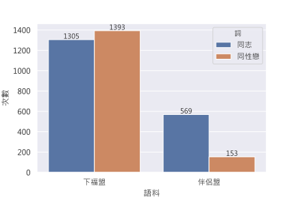
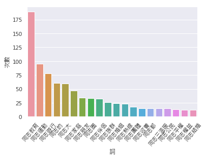
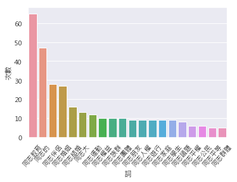

# 台灣同性婚姻論述中的「同志」

## 前情提要
在上一篇的文章中，我發現下福盟和伴侶盟兩個語料中，「同志」和「同性戀」兩個詞使用頻率有明顯的不同情形，在下福盟中，兩個詞出現的頻率幾乎相同，「同性戀」出現1393次，「同志」出現1305次；而在伴侶盟的語料中，「同性戀」出現569次，而「同志」則出現153次，前者出現的次數是後者出現的 3.7 倍。（見下圖圖表）



## 所以...
我很好奇到底這兩個詞在兩個語料中是如何使用的？以及為什麼在伴侶盟這兩個詞出現的次數差距很大，但在下福盟語料裡卻次數差不多。我將利用 concordance 工具，來看語料中這兩個詞出現的脈絡究竟是什麼，觀察前面接什麼樣的動詞，後面接什麼樣的名詞...等。透過觀察一個詞出現的脈絡，也許可以看出一些端倪。

先按照例行公事，匯入語料，並轉換成`nltk.text.Text()`物件：


```python
import nltk
import re
import jieba
import pandas as pd
import seaborn as sns
import matplotlib.pyplot as plt
from matplotlib.font_manager import FontProperties

plt.rcParams['figure.figsize'] = [10, 5]
myfont = FontProperties(fname=r'/usr/local/lib/python3.7/site-packages/matplotlib/mpl-data/fonts/ttf/msj.ttf',size=14)
sns.set(font=myfont.get_name())

%matplotlib inline

pd.set_option('display.max_rows', 2000)

LGBTFAMILY_PATH = "line_sentence_lgbtfamily.txt"
LOVEFAMILY_PATH = "line_sentence_lovefamily.txt"

lgbtfamily_raw_text = ""
lovefamily_raw_text = ""

with open(LGBTFAMILY_PATH) as f:
    lgbtfamily_raw_text = f.read()

with open(LOVEFAMILY_PATH) as f:
    lovefamily_raw_text = f.read()
    
# 將文本拆成 list of words
lgbtfamily_word_list = [word for sentence in lgbtfamily_raw_text.split('\n') for word in sentence.split(' ')]
lovefamily_word_list = [word for sentence in lovefamily_raw_text.split('\n') for word in sentence.split(' ')]

# 轉換好後，丟入 nltk.text.Text
lovefamily_text = nltk.text.Text(lovefamily_word_list)
lgbtfamily_text = nltk.text.Text(lgbtfamily_word_list)
```

`nltk` 套件中有兩個關於 concordance 工具的方法：`nltk.text.Text.concordance()`和`nltk.text.Text.concordance_list()`，前者可以直接以字串印出美美的 concordance，後者則是會把結果回傳成`list`，可以用來進行其他轉換。

下面我將利用 `nltk.text.Text.concordance_list()` 方法，再把結果轉成`pandas`的`DataFrame`，方便呈現出來。讓我們先看一下 `nltk.text.Text.concordance_list` 方法的文件：


```python
help(nltk.text.Text.concordance_list)
```

    Help on function concordance_list in module nltk.text:
    
    concordance_list(self, word, width=79, lines=25)
        Generate a concordance for ``word`` with the specified context window.
        Word matching is not case-sensitive.
        
        :param word: The target word
        :type word: str
        :param width: The width of each line, in characters (default=80)
        :type width: int
        :param lines: The number of lines to display (default=25)
        :type lines: int
        
        :seealso: ``ConcordanceIndex``
    


## 下福盟中的「同志」


```python
lovefamily_tongzhi_c = lovefamily_text.concordance_list('同志', width=50, lines=10000)

lovefamily_tongzhi_df = pd.DataFrame({
    "left_context": [' '.join(line.left) for line in lovefamily_tongzhi_c],
    "query": '同志',
    "right_context": [' '.join(line.right) for line in lovefamily_tongzhi_c],
})

lovefamily_tongzhi_df
```


<div>
<style scoped>
    .dataframe tbody tr th:only-of-type {
        vertical-align: middle;
    }

    .dataframe tbody tr th {
        vertical-align: top;
    }

    .dataframe thead th {
        text-align: right;
    }
    .dataframe {
        border-collapse: collapse;
    }
</style>
<table border="1" class="dataframe">
  <thead>
    <tr style="text-align: right;">
      <th></th>
      <th>left_context</th>
      <th>query</th>
      <th>right_context</th>
    </tr>
  </thead>
  <tbody>
    <tr>
      <th>0</th>
      <td>憲法 支持 的 是 台灣 現有 一男一女 一夫一妻 的 婚姻制度 同性婚姻 理由</td>
      <td>同志</td>
      <td>族群 因 社會 歧視 汙名 而 不易 現身 但 各國 研究</td>
    </tr>
    <tr>
      <th>1</th>
      <td>因 社會 歧視 汙名 而 不易 現身 但 各國 研究 均 顯示</td>
      <td>同志</td>
      <td>家庭 佔 人口 一定 比例 卻 無法 享有 身分 關係 的</td>
    </tr>
    <tr>
      <th>2</th>
      <td>擁抱 干擾 教會 聖誕 活動 根據 在 網路上 發起 的 真愛 聖誕</td>
      <td>同志</td>
      <td>路過 教會 公民 行動 中 提到 我 想到 了 一個 活動</td>
    </tr>
    <tr>
      <th>3</th>
      <td>提到 我 想到 了 一個 活動 計劃 就是 號召 全 臺灣 的</td>
      <td>同志</td>
      <td>與 直 同志 朋友 在 聖誕節 期月 日間 攻佔 各大 教會</td>
    </tr>
    <tr>
      <th>4</th>
      <td>了 一個 活動 計劃 就是 號召 全 臺灣 的 同志 與 直</td>
      <td>同志</td>
      <td>朋友 在 聖誕節 期月 日間 攻佔 各大 教會 的 晚會 並且</td>
    </tr>
    <tr>
      <th>5</th>
      <td>提供 給 司法 檢調 單位 作為 呈堂 證供 的 依據 真愛 聖誕</td>
      <td>同志</td>
      <td>路過 教會 公民 行動 時間 年月日 日 地點 臺灣 各地 教會</td>
    </tr>
    <tr>
      <th>6</th>
      <td>的 依據 來 參加 聖誕 晚會 嗎 聖誕夜 本來 就是 大型 晚會</td>
      <td>同志</td>
      <td>朋友 去 了 幾間 教會 後 發現 教會 也 都 很</td>
    </tr>
    <tr>
      <th>7</th>
      <td>接納 甚至 歡迎 送 小 禮物 很多 教會 也 都 表明 歡迎</td>
      <td>同志</td>
      <td>朋友 甚至 接待 他們 進 會場 握手 歡迎 他們 但 同運</td>
    </tr>
    <tr>
      <th>8</th>
      <td>的 人 這是 預謀 的 嗎 我們 相信 同運 團體 所有 的</td>
      <td>同志</td>
      <td>朋友 但 同運 團體 這樣 做 只會 製造 更 多 的</td>
    </tr>
    <tr>
      <th>9</th>
      <td>對立 及 衝突 難怪 教宗 會 說 同運 團體 不好 但 很多</td>
      <td>同志</td>
      <td>朋友 被 他們 給 污名 化 了 提供 教宗 影片 難道</td>
    </tr>
    <tr>
      <th>10</th>
      <td>在 平安夜 中舉 牌 干擾 聚會 我們 相信 同運 團體 所有 的</td>
      <td>同志</td>
      <td>朋友 但 同運 團體 這樣 作 只會 製造 更 多 的</td>
    </tr>
    <tr>
      <th>11</th>
      <td>的 對立 及 衝突 難怪 教宗 會 說 同運 團體 不好 很多</td>
      <td>同志</td>
      <td>朋友 都 因此 被 他們 給 污名 化 了 請 參考</td>
    </tr>
    <tr>
      <th>12</th>
      <td>在於 同性戀 及 異性戀 教育網絡   簡稱 和 同性戀 與 直</td>
      <td>同志</td>
      <td>聯盟 簡稱 譯註 直 同志 意指 對 同性戀 友善 的 異性戀</td>
    </tr>
    <tr>
      <th>13</th>
      <td>簡稱 和 同性戀 與 直 同志 聯盟 簡稱 譯註 直</td>
      <td>同志</td>
      <td>意指 對 同性戀 友善 的 異性戀 者 實際上 是 由 成人</td>
    </tr>
    <tr>
      <th>14</th>
      <td>的 心 把 每 一個 人 擁入 憲法 的 懷抱 同性婚姻 及</td>
      <td>同志</td>
      <td>收養 議題 時間 年月日 星期四 地點 立法院 紅樓 會議室 台北市 中山南路</td>
    </tr>
    <tr>
      <th>15</th>
      <td>婚姻 應 限定 在 一男一女 二是 在國 中小 不 應對 學生 實施</td>
      <td>同志</td>
      <td>教育 三是 婚姻 以外 其他 形式 保障 同 性生活 權益 曾獻瑩</td>
    </tr>
    <tr>
      <th>16</th>
      <td>語句 改成 或 可能 會 比較 合適 在 中文 的話 請勿 使用</td>
      <td>同志</td>
      <td>平權 或 婚姻 平權 直接 稱 之 同性 婚 或 同性戀</td>
    </tr>
    <tr>
      <th>17</th>
      <td>同性婚姻 在 網路上 可 看到 同運 內部 有 一派 人士 主張 爭取</td>
      <td>同志</td>
      <td>婚姻 的 人 非常 自私 並 不是 每 一個 同志 都</td>
    </tr>
    <tr>
      <th>18</th>
      <td>主張 爭取 同志 婚姻 的 人 非常 自私 並 不是 每 一個</td>
      <td>同志</td>
      <td>都 想要 結婚 婚姻 只是 個 枷鎖 不該 讓 同志 被</td>
    </tr>
    <tr>
      <th>19</th>
      <td>每 一個 同志 都 想要 結婚 婚姻 只是 個 枷鎖 不該 讓</td>
      <td>同志</td>
      <td>被 婚姻 束縛 既然 網友 認為 權利義務 與 婚姻 近似 的</td>
    </tr>
    <tr>
      <th>20</th>
      <td>一夫一妻 並不 違憲 顏 教授 主張 在 法律 中 創造 可以 保障</td>
      <td>同志</td>
      <td>伴侶 生活 需求 的 法律 基礎 並非 隔離 且 平等 而是</td>
    </tr>
    <tr>
      <th>21</th>
      <td>關於 性 傾向 歧視 法 的 激辯 和 台灣 在 年 關於</td>
      <td>同志</td>
      <td>教育 與 及 同性婚姻 同居 伴侶 法 的 爭論 世界各地 的</td>
    </tr>
    <tr>
      <th>22</th>
      <td>賦予 同性伴侶 領養 兒童 權利 或 以 人工 授孕 方法 產生 下一代</td>
      <td>同志</td>
      <td>教育 在 台灣 被 包裝 為 性別 平等 教育 有些 甚至</td>
    </tr>
    <tr>
      <th>23</th>
      <td>各級 學校 不 應對 學生 實施 性別 平等 教育法 施行細則 所定 之</td>
      <td>同志</td>
      <td>教育  完成 驗收 第三 案 婚姻 以外 形式 規範 同性</td>
    </tr>
    <tr>
      <th>24</th>
      <td>支持 家庭 價值 邏輯 上 最 合理 的 結果 其實 是 支持</td>
      <td>同志</td>
      <td>平權 註 他 認 為 多 年來 一個 又 一個 的</td>
    </tr>
    <tr>
      <th>25</th>
      <td>真的 想 見到 嗎 註 梁 啟 智 因為 家庭 價值 支持</td>
      <td>同志</td>
      <td>平權 明報 年月日 作者 是 浸會 大學 宗教 及 哲學系 教授</td>
    </tr>
    <tr>
      <th>26</th>
      <td>你 想要 愛滋 嘛 請勿 支持 同性戀 議程 一般 媒體 會錯 譯成</td>
      <td>同志</td>
      <td>平權 原文 聯合報 記者 黃 福其 台北 報導 市議員 許淑華向北 市府</td>
    </tr>
    <tr>
      <th>27</th>
      <td>使用 保險套 蘋果日報 肛門 黏膜 易 破損 愛滋 風險 高 但是 年</td>
      <td>同志</td>
      <td>大 遊行 的 主題 看見 性 難民 卻將 娛樂性 用藥 使用者</td>
    </tr>
    <tr>
      <th>28</th>
      <td>立報 追討 情慾 正義性 難民 拒 被 看 賤 除了 變像 鼓勵</td>
      <td>同志</td>
      <td>嗑 藥外 同時 也 誤導 廣大 同志 朋友 及大眾 錯以 為</td>
    </tr>
    <tr>
      <th>29</th>
      <td>看 賤 除了 變像 鼓勵 同志 嗑 藥外 同時 也 誤導 廣大</td>
      <td>同志</td>
      <td>朋友 及大眾 錯以 為 娛樂性 用藥 對 身體 無害 實則 娛樂性</td>
    </tr>
    <tr>
      <th>30</th>
      <td>以 尊重 之名 行 放縱 鼓勵 之實 的 政策 繼續 維持 則</td>
      <td>同志</td>
      <td>族群 得 愛滋 的 人口 逐年 上升 的 狀況 必然 繼續</td>
    </tr>
    <tr>
      <th>31</th>
      <td>逐年 上升 的 狀況 必然 繼續 惡化 下去 圖為 年 月 年</td>
      <td>同志</td>
      <td>大 遊行 前 兩個 月 某個 知名 同運 團體 舉辦 疑似</td>
    </tr>
    <tr>
      <th>32</th>
      <td>的 倍 愛滋病 成為 青少年 十大 死因 之一 性 解放者 染黑 了</td>
      <td>同志</td>
      <td>大 遊行 他們 高 分貝 主張 嗑 藥性 虐待 及 性交易</td>
    </tr>
    <tr>
      <th>33</th>
      <td>始得 為 之 當天 歡迎 所有 認同 此 理念 的 朋友 包含</td>
      <td>同志</td>
      <td>朋友 一 起來 參加 不 分 黨派 及 族群 不 分</td>
    </tr>
    <tr>
      <th>34</th>
      <td>同性婚姻 及 領養 法案 剝奪 兒童 擁有 爸爸媽媽 的 基本權利 並為 了</td>
      <td>同志</td>
      <td>而 開放 人工 生殖 及 代孕 服務 是 等同 將 孩子</td>
    </tr>
    <tr>
      <th>35</th>
      <td>某些 程度 上面 雖然 不是 精神疾病 但是 我們 要 去 關懷 很多</td>
      <td>同志</td>
      <td>我們 看到 原來 我們 是 可以 改變 的 原來 我們 是</td>
    </tr>
    <tr>
      <th>36</th>
      <td>去 追求 的 東西 我們 不能 這樣 子 我們 是不是 會 製造</td>
      <td>同志</td>
      <td>說 如果 你 的 觀念 在 推廣 的 時候 讓 國家</td>
    </tr>
    <tr>
      <th>37</th>
      <td>的 但是 抱歉 是 他 自己 形成 的 因為 他 是 我們</td>
      <td>同志</td>
      <td>他們 是 行為 不是 天生 的 他行 為 是 有 決定權</td>
    </tr>
    <tr>
      <th>38</th>
      <td>子 的 行為 他會 製造 你 通過 以後 製造 更 多 的</td>
      <td>同志</td>
      <td>出來 那 國家 社會 不是 亂 了 嗎 他們 的 祖先</td>
    </tr>
    <tr>
      <th>39</th>
      <td>他們 的 祖先 在 哪裡 你 只有 一個 兒子 結果 他 變成</td>
      <td>同志</td>
      <td>你家 裡絕 了 後代 請問 那 是不是 道德 問題 那 是不是</td>
    </tr>
    <tr>
      <th>40</th>
      <td>一個 就是 我們 這 一些 的 權益 是 相對 的 東西 你</td>
      <td>同志</td>
      <td>要 權利 那 你 說 我 尊重 他 要給 他 那</td>
    </tr>
    <tr>
      <th>41</th>
      <td>的 心 把 每 一個 人 擁入 憲法 的 懷抱 同性婚姻 及</td>
      <td>同志</td>
      <td>收養 議題 時間 年月日 星期四 地點 立法院 紅樓 會議室 台北市 中山南路</td>
    </tr>
    <tr>
      <th>42</th>
      <td>多次 引發 地方 民眾 向 政府 各 層級 抗議 之 聲浪 對於</td>
      <td>同志</td>
      <td>權益 相關 法案 之 制定 幸福 聯盟 表示 我們 支持 保障</td>
    </tr>
    <tr>
      <th>43</th>
      <td>立法 如級 地震 中央社 家長 批 性別 光譜 混淆 性平 教育 非</td>
      <td>同志</td>
      <td>養成 中國時報 中小學 性平 教材 起跑 太早 家長 轟淪 同志 養成教育</td>
    </tr>
    <tr>
      <th>44</th>
      <td>教育 非 同志 養成 中國時報 中小學 性平 教材 起跑 太早 家長 轟淪</td>
      <td>同志</td>
      <td>養成教育 東森 公民 課本 教 異性戀 霸權 反同 團體 誘導 孩子</td>
    </tr>
    <tr>
      <th>45</th>
      <td>權益 反對 婚姻 定義 改變 台灣 守護 家庭 年月日 國民教育 不 實施</td>
      <td>同志</td>
      <td>教育 公 投案 聽證會 學者 專家 國立 中正 大學 法學院 曾品傑</td>
    </tr>
    <tr>
      <th>46</th>
      <td>文中 關於 未成年 之文 似屬 贅語 爰 提案人 關於 國民教育 不 實施</td>
      <td>同志</td>
      <td>教育 之公 投案 主文 係 謂 你 是否 同意 在 國民教育</td>
    </tr>
    <tr>
      <th>47</th>
      <td>你 是否 同意 在 國民教育 階段 內 不 應對 未成年 孩子 實施</td>
      <td>同志</td>
      <td>教育  查 國民 教育法 第條 前段 記載 凡 六歲 至</td>
    </tr>
    <tr>
      <th>48</th>
      <td>國中 這個 國民教育 階段 不 應對 歲 至 歲 的 孩子 實施</td>
      <td>同志</td>
      <td>教育 惟觀諸 我國 民法 第條 有謂 滿 二十歲 為 成年 故</td>
    </tr>
    <tr>
      <th>49</th>
      <td>為 你 是否 同意 在 國民教育 階段 內 不 應對 孩子 實施</td>
      <td>同志</td>
      <td>教育 二 公投 之 目的旨在 廢止 性別 平等 教育法 施行細則 第條</td>
    </tr>
    <tr>
      <th>50</th>
      <td>二 公投 之 目的旨在 廢止 性別 平等 教育法 施行細則 第條 所定 之</td>
      <td>同志</td>
      <td>教育 鑑於 我國 性別 平等 教育法 第條 第項 記載 國民 中小學</td>
    </tr>
    <tr>
      <th>51</th>
      <td>第二項 所定 性別 平等 教育 相關 課程 應 涵蓋 情感 教育性 教育</td>
      <td>同志</td>
      <td>教育 等 課程 以提 昇 學生 之 性別 平等 意識 又</td>
    </tr>
    <tr>
      <th>52</th>
      <td>為 你 是否 同意 在 國民教育 階段 內 不 應對 孩子 實施</td>
      <td>同志</td>
      <td>教育  由於 性平法 施行細則 第條 正是 規定 國民 中小學 每學期</td>
    </tr>
    <tr>
      <th>53</th>
      <td>國民 中小學 每學期 應 實施 性別 平等 教育 相關 課程 應 涵蓋</td>
      <td>同志</td>
      <td>教育 等 課程 故此 一 提案 內容 在 法律 上 之</td>
    </tr>
    <tr>
      <th>54</th>
      <td>表述 應可 理解 為 廢止 性別 平等 教育法 施行細則 第條 所定 之</td>
      <td>同志</td>
      <td>教育 是 以 一旦 本公 投案 經 通過 後 權責 機關</td>
    </tr>
    <tr>
      <th>55</th>
      <td>內容 之 必要 處置 亦 即 刪除 性平法 施行細則 第條 所定 之</td>
      <td>同志</td>
      <td>教育 並將 年 國民 中小學 九年 一貫 課程 綱要 中 涉及</td>
    </tr>
    <tr>
      <th>56</th>
      <td>中小學 九年 一貫 課程 綱要 中 涉及 性別 平等 教育 中 的</td>
      <td>同志</td>
      <td>教育 內容 予以 移除 議題 二 本案 究 係 立法 原則</td>
    </tr>
    <tr>
      <th>57</th>
      <td>平法 施行細則 第條 關於 國民 中小學 性別 平等 教育 課程 應 涵蓋</td>
      <td>同志</td>
      <td>教育 的 規定 形式 上 為 法規 命令 非屬 法律 亦</td>
    </tr>
    <tr>
      <th>58</th>
      <td>之 授權 暨 授權 範圍 顯然 上 開性 平法 施行細則 所定 第條</td>
      <td>同志</td>
      <td>教育 之 記載 不但 違反 行政 程序法 第第項 第款 關於 無</td>
    </tr>
    <tr>
      <th>59</th>
      <td>權利 者 而 罹 於 無效 形同 強制 國中 與國 小學生 上</td>
      <td>同志</td>
      <td>教育 課程 不啻 限制 人民 之 自由 權利 而且 因為 上</td>
    </tr>
    <tr>
      <th>60</th>
      <td>教育 課程 不啻 限制 人民 之 自由 權利 而且 因為 上 開</td>
      <td>同志</td>
      <td>教育 的 規定 非屬 法律 之 位階 從而 應予 認定 為</td>
    </tr>
    <tr>
      <th>61</th>
      <td>或 否決 性平法 施行細則 第條 所定 國民 中小學 性平 課程 應 涵蓋</td>
      <td>同志</td>
      <td>教育 之 重大 教育 政策 應 符合 公投法 第條 第項 第款</td>
    </tr>
    <tr>
      <th>62</th>
      <td>進行 中 具有 高度 爭議 之 國民 中小學 性平 教育 應 涵蓋</td>
      <td>同志</td>
      <td>教育 的 重大 政策 行使 最終 決定權 亦 即 就 我國</td>
    </tr>
    <tr>
      <th>63</th>
      <td>繼續 續 倡議 反對 目前 已經 在 國民 中小學 性平 教育 施行</td>
      <td>同志</td>
      <td>教育 的 重大 政策 自 當 符合 公投法 第條 第項 第款</td>
    </tr>
    <tr>
      <th>64</th>
      <td>本案 是否 全國性 公投 之 適用 事項 本 件 國民教育 不 實施</td>
      <td>同志</td>
      <td>教育 之公 投案 有無 牴觸 憲法 或 法律 對此 本席 認為</td>
    </tr>
    <tr>
      <th>65</th>
      <td>牴觸 憲法 或 法律 之虞 理由 如下 一在 國民 中小學 階段 實施</td>
      <td>同志</td>
      <td>教育 牽涉 兒童 及 少年 身心 健全 發展 之 公共利益 的</td>
    </tr>
    <tr>
      <th>66</th>
      <td>屬無 法律 授權 之 法規 命令 形同 強制 國中 與國 小學生 上</td>
      <td>同志</td>
      <td>教育 課程 此依 行政 程序法 第第項 第款 關於 法規 命令 無</td>
    </tr>
    <tr>
      <th>67</th>
      <td>明確 之 原則 國民 中小學 性別 平等 教育 課程 是否 應 涵蓋</td>
      <td>同志</td>
      <td>教育 不但 涉及 教育 為 國家 社會 發展 之 根基 影響</td>
    </tr>
    <tr>
      <th>68</th>
      <td>定 性質 上 殆屬 法規 命令 並無 母法 性別 平等 教育法 關於</td>
      <td>同志</td>
      <td>教育 之 授權 依據 不啻 強制 國中 與國 小學生 上 同志</td>
    </tr>
    <tr>
      <th>69</th>
      <td>關於 同志 教育 之 授權 依據 不啻 強制 國中 與國 小學生 上</td>
      <td>同志</td>
      <td>教育 課程 依 行政 程序法 第條 第項 第款 關於 法規 命令</td>
    </tr>
    <tr>
      <th>70</th>
      <td>中小學 孩子 的 身心健康 具有 目的 正當性 以 廢止 國民 中小學 的</td>
      <td>同志</td>
      <td>教育 之 方式 達到 避免 造成 心智 成長 中 孩子 性別</td>
    </tr>
    <tr>
      <th>71</th>
      <td>發展 的 適齡 性 理由 僅 廢止 國民 中小學 所 實施 的</td>
      <td>同志</td>
      <td>教育 並未 觸及 高級中學 及 大專 校園 的 課程 部分 限制</td>
    </tr>
    <tr>
      <th>72</th>
      <td>亦 無 牴觸 平等權 或 比例 原則 蓋 廢止 國民 中小學 之</td>
      <td>同志</td>
      <td>教育 並不 妨礙 性別 平等 教育 以 教育 方式 尊重 性別差異</td>
    </tr>
    <tr>
      <th>73</th>
      <td>傾向 並 建立 安全 之 校園 空間 之 規定 本可 實現 尊重</td>
      <td>同志</td>
      <td>尊重 不同 性 傾向 促進 性別 地位 之 實質 平等 的</td>
    </tr>
    <tr>
      <th>74</th>
      <td>會 經歷 一段 同性 密友 期 的 發展 階段 因此 過度 左袒</td>
      <td>同志</td>
      <td>價值 取向 的 性別 教育 政策 吹捧 同志 形象 為 時髦</td>
    </tr>
    <tr>
      <th>75</th>
      <td>階段 因此 過度 左袒 同志 價值 取向 的 性別 教育 政策 吹捧</td>
      <td>同志</td>
      <td>形象 為 時髦 風尚 的 政策 立場 很 容易 導致 正值</td>
    </tr>
    <tr>
      <th>76</th>
      <td>尋求 被 了解 與 被 愛 倘若 如是 因著 矯枉過正 之 左袒</td>
      <td>同志</td>
      <td>教育 的 性別 教育 極易 將 原本 經過 諮商 輔導 以後</td>
    </tr>
    <tr>
      <th>77</th>
      <td>身心健康 與 人格 形塑 具有 目的 正當性 以 廢止 國民 中小學 的</td>
      <td>同志</td>
      <td>教育 之 方式 達到 避免 造成 心智 成長 中 孩子 性別</td>
    </tr>
    <tr>
      <th>78</th>
      <td>發展 的 適齡 性 理由 僅 廢止 國民 中小學 所 實施 的</td>
      <td>同志</td>
      <td>教育 並未 觸及 高級中學 及 大專 校園 的 課程 部分 限制</td>
    </tr>
    <tr>
      <th>79</th>
      <td>曾品傑 中正 大學 法律系 教授 適齡 性平 教育 公投 聽證會 精采 發言</td>
      <td>同志</td>
      <td>教育 在國 中小 不 適齡 幸福 盟 中選會 不 應 預設立場</td>
    </tr>
    <tr>
      <th>80</th>
      <td>下一代 幸福 聯盟 按 讚 下一代 幸福 聯盟 文草 日月 乘二 昨日</td>
      <td>同志</td>
      <td>團體 公布 台灣民眾 對於 同性婚姻 之 態度 網路 調查 民調 調查結果</td>
    </tr>
    <tr>
      <th>81</th>
      <td>之 參考 但是 這份 問卷 真的 具有 參考價值 嗎 民調 發起者 有</td>
      <td>同志</td>
      <td>團體 和 同性戀 學者 同運 團體 最愛 拿 研究 單位 的</td>
    </tr>
    <tr>
      <th>82</th>
      <td>陽光 酷兒 中心 是 以 男同志 為 主要 服務 對象 的 高雄</td>
      <td>同志</td>
      <td>團體 柯乃熒 教授 對外 身分 是 知名 愛滋 研究 學者 但</td>
    </tr>
    <tr>
      <th>83</th>
      <td>關係 的 女 同性戀者 且 是 平常 活躍 於 同性戀 文化 和</td>
      <td>同志</td>
      <td>運動 的 同運 人士 柯乃熒 是 愛滋 團體 台灣 愛之 希望</td>
    </tr>
    <tr>
      <th>84</th>
      <td>兩 裸男 口交 畫面 柯 教授 期待 來 聽 她 演講 的</td>
      <td>同志</td>
      <td>都 變成 約 砲 達人 成大 柯乃熒 教授 當 過 網路</td>
    </tr>
    <tr>
      <th>85</th>
      <td>等 名義 投書 媒體 但 他 同時 也 是 個 活躍 的</td>
      <td>同志</td>
      <td>運動 人士 顏正芳 不 但是 年 同性婚姻 公聽會 知名 的 挺</td>
    </tr>
    <tr>
      <th>86</th>
      <td>否定 研究 公正性 的 絕對 理由 但是 當 研究者 平常 就 熱衷於</td>
      <td>同志</td>
      <td>運動 和 同性婚姻 的 推動 他們 本身 又 是 同性婚姻 的</td>
    </tr>
    <tr>
      <th>87</th>
      <td>納入 雙性戀 和 不 清楚 自己 性 傾向 的 民眾 廣義 的</td>
      <td>同志</td>
      <td>族群 也僅 佔 總人口 的 但是 這次 同運 團體 和 同性戀</td>
    </tr>
    <tr>
      <th>88</th>
      <td>者 異性戀 僅 也就是說 參與 本次 問卷 的 民眾 中 廣義 的</td>
      <td>同志</td>
      <td>族群 高達 這樣 偏頗 採樣 的 民調 族群 分布 異於 所有</td>
    </tr>
    <tr>
      <th>89</th>
      <td>意識 型態 對 了 就 什麼 都 對 了 民調 雖 來自</td>
      <td>同志</td>
      <td>運動 同溫層 卻 有 三成 接受 立專法 我 認為 這份 民調</td>
    </tr>
    <tr>
      <th>90</th>
      <td>同溫層 卻 有 三成 接受 立專法 我 認為 這份 民調 只能 代表</td>
      <td>同志</td>
      <td>運動 網路 同溫層 的 民意 它並 不能 代表 一般 台灣民眾 的</td>
    </tr>
    <tr>
      <th>91</th>
      <td>想法 很 抱歉 這份 民調 毫無 參考價值 但 如果 你 想 知道</td>
      <td>同志</td>
      <td>運動 參與者 對於 同性婚姻 的 想法 這份 民調 告訴 你 同志</td>
    </tr>
    <tr>
      <th>92</th>
      <td>知道 同志 運動 參與者 對於 同性婚姻 的 想法 這份 民調 告訴 你</td>
      <td>同志</td>
      <td>運動 同溫層 仍 有 三成 民眾 支持 修 專法 的 方案</td>
    </tr>
    <tr>
      <th>93</th>
      <td>社團 法人 台灣 愛之 希望 協會 人事 組織 台灣 同志諮詢熱線 協會 新聞稿</td>
      <td>同志</td>
      <td>學生 遭受 校園 霸凌 問題 亟需 獲得 重視 顏正芳 陳 牧宏</td>
    </tr>
    <tr>
      <th>94</th>
      <td>和 精神科 醫師 年月日 顏正芳 尊重 多元性 傾向 扭轉 治療 嚴重 觸法</td>
      <td>同志</td>
      <td>人權 守護 記者會 發言稿 年月日 另一方面 同志 圈 也 有 其他</td>
    </tr>
    <tr>
      <th>95</th>
      <td>傾向 扭轉 治療 嚴重 觸法 同志 人權 守護 記者會 發言稿 年月日 另一方面</td>
      <td>同志</td>
      <td>圈 也 有 其他 同志 開 記者會 表達 支持性 傾向 迴轉</td>
    </tr>
    <tr>
      <th>96</th>
      <td>同志 人權 守護 記者會 發言稿 年月日 另一方面 同志 圈 也 有 其他</td>
      <td>同志</td>
      <td>開 記者會 表達 支持性 傾向 迴轉 治療 的 立場 相關 新聞</td>
    </tr>
    <tr>
      <th>97</th>
      <td>表達 支持性 傾向 迴轉 治療 的 立場 相關 新聞 請見 蘋果日報 禁止</td>
      <td>同志</td>
      <td>治療 捍家盟 剝奪 同志 權利 年月日 風傳 媒 修法 禁止性 傾向</td>
    </tr>
    <tr>
      <th>98</th>
      <td>治療 的 立場 相關 新聞 請見 蘋果日報 禁止 同志 治療 捍家盟 剝奪</td>
      <td>同志</td>
      <td>權利 年月日 風傳 媒 修法 禁止性 傾向 扭轉 療程 捍家盟 剝奪</td>
    </tr>
    <tr>
      <th>99</th>
      <td>同志 權利 年月日 風傳 媒 修法 禁止性 傾向 扭轉 療程 捍家盟 剝奪</td>
      <td>同志</td>
      <td>的 權利 年月日 風向 新聞 衛福部 禁止 治療 同志 性 傾向</td>
    </tr>
    <tr>
      <th>100</th>
      <td>療程 捍家盟 剝奪 同志 的 權利 年月日 風向 新聞 衛福部 禁止 治療</td>
      <td>同志</td>
      <td>性 傾向 捍家盟 不可 剝奪 同志 的 權利 年月日 對於 禁止</td>
    </tr>
    <tr>
      <th>101</th>
      <td>年月日 風向 新聞 衛福部 禁止 治療 同志 性 傾向 捍家盟 不可 剝奪</td>
      <td>同志</td>
      <td>的 權利 年月日 對於 禁止 迴轉 治療 的 評論 請見 台灣</td>
    </tr>
    <tr>
      <th>102</th>
      <td>基金會 民調 同婚 零 共識 立法 如級 地震 年月日 這類 標語 在</td>
      <td>同志</td>
      <td>大 遊行 中 屢見不鮮 因為 性化 是 同運 與 性解放 運動</td>
    </tr>
    <tr>
      <th>103</th>
      <td>與 性解放 運動 掛勾 的 產物 右圖 翻攝 自月 日六將 展開 台灣</td>
      <td>同志</td>
      <td>大 遊行 在 偶像 明星 及 總統 候選人 的 加持 下</td>
    </tr>
    <tr>
      <th>104</th>
      <td>明星 及 總統 候選人 的 加持 下 再次 炒作 媒體 版面 但是</td>
      <td>同志</td>
      <td>大 遊行 的 訴求 是 什麼 只有 同性婚姻 嗎 還是 其實</td>
    </tr>
    <tr>
      <th>105</th>
      <td>可能 又 不慎 為 某種 激進 的 意識 型態 背書 呢 今年</td>
      <td>同志</td>
      <td>遊行 的 主題 是 年齡 不 設限 解放 暗櫃 青春 自主</td>
    </tr>
    <tr>
      <th>106</th>
      <td>遊行 的 主題 是 年齡 不 設限 解放 暗櫃 青春 自主 台灣</td>
      <td>同志</td>
      <td>遊行 聯盟 主張 歲 以下 懷孕 者 依性 侵案 通報 法律</td>
    </tr>
    <tr>
      <th>107</th>
      <td>的 生活 人為性 死 鳥為 食亡 為 了 追求 性 愉悅 台灣</td>
      <td>同志</td>
      <td>熱線 設置 的 爽歪歪 網站 不僅 沒有 反對 任意 與 患者</td>
    </tr>
    <tr>
      <th>108</th>
      <td>是 學生 應該 知道 的 知識 這 可以 拯救 他們 的 性命</td>
      <td>同志</td>
      <td>熱線 愛滋 小組 舉辦 男同志 轟 趴 文化 講座 邀請 藥物</td>
    </tr>
    <tr>
      <th>109</th>
      <td>趴 青少年 如果 任意 涉入 極易 染上 性病 懊悔 終生 在 台灣</td>
      <td>同志</td>
      <td>熱線 架設 的 性 教育 網站 中 能 降低 風險 的</td>
    </tr>
    <tr>
      <th>110</th>
      <td>賠上 健康 風險 也 堅持 要 口交 的 精神 難道 也 是</td>
      <td>同志</td>
      <td>性 社交 文化 的 一部分 保險套 性愛 不是 安全 性行為 它</td>
    </tr>
    <tr>
      <th>111</th>
      <td>陌生人 性交 的 場所 連版 都 知道 這是 性病 的 溫床 但</td>
      <td>同志</td>
      <td>熱線 卻 不顧 染病 的 風險 反而 還開 講座 教 大家</td>
    </tr>
    <tr>
      <th>112</th>
      <td>把 手指 拳頭 塞進 別人 的 肛門 裡 俗稱 指交拳 交 台灣</td>
      <td>同志</td>
      <td>熱線 架設 的 性 教育 網站 為 了 讓 內容 更</td>
    </tr>
    <tr>
      <th>113</th>
      <td>熱線 架設 的 性 教育 網站 為 了 讓 內容 更 貼近</td>
      <td>同志</td>
      <td>社群 的 性 社交 文化 因此 教育 內容 包括 多人 肛交</td>
    </tr>
    <tr>
      <th>114</th>
      <td>肛門 約 砲 指 與 陌生人 一夜情 職掌 性別 教育 推廣 的</td>
      <td>同志</td>
      <td>熱線 文宣部 主任 呂欣潔 今年 代表 社會民主黨 投入 台北市 區域 立委</td>
    </tr>
    <tr>
      <th>115</th>
      <td>唐人 家長 反對 安 省 修訂 性 教育 課程 年月日 年 台灣</td>
      <td>同志</td>
      <td>遊行 主題 主 論述 及主 視覺 截圖 連結 隨時 收到 最新消息</td>
    </tr>
    <tr>
      <th>116</th>
      <td>筆名 和 職業 背景 本站 保留 編輯 增刪 的 權利 投稿 信箱</td>
      <td>同志</td>
      <td>運動 的 價值 理念 關啟 文 香港 性 文化 學會 主席</td>
    </tr>
    <tr>
      <th>117</th>
      <td>或 意識形態 但 公民 社會 需要 不同 的 聲音 本文 針對 八種</td>
      <td>同志</td>
      <td>運動 的 意識形態 做 評價 隨時 收到 最新消息 請 上 下一代</td>
    </tr>
    <tr>
      <th>118</th>
      <td>同性戀 遊說 團體 正在 召聚 幼童 揮舞 彩虹 旗幟 參加 他們 的</td>
      <td>同志</td>
      <td>驕傲 遊行 我們 相信 芬蘭人 明智 的 那 部分 特質 會</td>
    </tr>
    <tr>
      <th>119</th>
      <td>幸福 盟 也 持續 推動 教育 方面 的 公投 提案 而 對於</td>
      <td>同志</td>
      <td>族群 的 保障 曾獻瑩 指出 幸福 盟 內部 有 討論 提出</td>
    </tr>
    <tr>
      <th>120</th>
      <td>在 不 改變 一男一女 的 前提 下 以 特別法 或 專法 保障</td>
      <td>同志</td>
      <td>朋友 在 醫療 方面 的 權利 他 進一步 解釋 民法 一男一女</td>
    </tr>
    <tr>
      <th>121</th>
      <td>或點 網址 請到 下一代 幸福 聯盟 按 讚 下一代 幸福 聯盟 年</td>
      <td>同志</td>
      <td>熱線 推出 微 電影 其他人 片中 聲稱 法律 沒有 保障 同性伴侶</td>
    </tr>
    <tr>
      <th>122</th>
      <td>如此 嘛 法律 真的 只 把 同性伴侶 當 陌生人 看待 嘛 還是</td>
      <td>同志</td>
      <td>也 能 當家人 呢 綜合 以上 同運 團體 所 揭露 之</td>
    </tr>
    <tr>
      <th>123</th>
      <td>關係 其他 不願 結婚 只願當 家屬 的 同性伴侶 毀廢派 不願 出櫃 的</td>
      <td>同志</td>
      <td>不想 結婚 以及 其他 無 血緣關係 的 家屬 仍 無法 從中</td>
    </tr>
    <tr>
      <th>124</th>
      <td>同性伴侶 在外 流浪 的 因素 可能 有 對方 是 失智 的 老年</td>
      <td>同志</td>
      <td>或 因 吵架 離家出走 不論 離家 因素 為何 只要 是 以</td>
    </tr>
    <tr>
      <th>125</th>
      <td>親密關係 既然 同居 關係 有受 國家 發放 的 身分證 所 承認 那麼</td>
      <td>同志</td>
      <td>朋友 即 無庸 以 修改 民法 的 手段 作為 證明 兩人</td>
    </tr>
    <tr>
      <th>126</th>
      <td>房東 房屋 的 方法 如 兩人 名下 無 自有 房屋 是 貧窮</td>
      <td>同志</td>
      <td>或 均 為 外地 打拼 求學 的 同性戀 青年 也 可以</td>
    </tr>
    <tr>
      <th>127</th>
      <td>請 讀者 參考 我用 這回 應同婚 問題 懶人 包 的 問題 五</td>
      <td>同志</td>
      <td>在 戶籍 只能 登記 為 寄居 所以 必須 通過 同性婚姻 延伸</td>
    </tr>
    <tr>
      <th>128</th>
      <td>的 定義 就是 一男一女 的 結合 二 不 應對 國 中小學生 實施</td>
      <td>同志</td>
      <td>教育 三 訂定 同性 家屬 性質 的 同性 共同 生活 法非</td>
    </tr>
    <tr>
      <th>129</th>
      <td>但 我們 不要 他們 進 學校 跟 兒童 講這是 正常 的 指</td>
      <td>同志</td>
      <td>教育 我們 也 發現 當 社會 中有 不 同意 見於 同運</td>
    </tr>
    <tr>
      <th>130</th>
      <td>政治界 進行 文化 改革 首先 在 性別 平等 教育法 裡面 加入 了</td>
      <td>同志</td>
      <td>教育 成為 各級 學校 每學期 必須 上 的 課程 緊接著 在</td>
    </tr>
    <tr>
      <th>131</th>
      <td>下 孩子 性 傾向 研究 綜覽 分析 著 潘光 中譯 美國 女</td>
      <td>同志</td>
      <td>家庭 研究性 傾向 性行為 與 暴露 在 性 風險 的 青少年</td>
    </tr>
    <tr>
      <th>132</th>
      <td>問題 了 嗎 多元 成家 草案 之 立法 疑慮 西方 開始 質疑</td>
      <td>同志</td>
      <td>運動 的 原因 最後 小編 再次 重申 護家網 的 主張 同性戀</td>
    </tr>
    <tr>
      <th>133</th>
      <td>了 嗎 網友 嘲笑 人們 反對 同性婚姻 是 沒用 的 因為 很多</td>
      <td>同志</td>
      <td>和 支持 同運 意識 型態 的 人 將成 為 老師 進入</td>
    </tr>
    <tr>
      <th>134</th>
      <td>重申 同性伴侶 可 代簽 手術 同意書 王嘉 菲拉 拉手 在 一起 女</td>
      <td>同志</td>
      <td>影像 故事 該書 第頁 記錄 女同性戀 簽 手術 同意書 的 故事</td>
    </tr>
    <tr>
      <th>135</th>
      <td>者 在 追求 對 同性戀者 去 汙名 化 使用 正確 名詞 對待</td>
      <td>同志</td>
      <td>時 恐同 這個 詞 就 冠上 了 一切 反對 同性婚姻 的</td>
    </tr>
    <tr>
      <th>136</th>
      <td>霸權 的 氛圍 嗎 如果 有 為何 媒體 常常 刻意 報導 凸顯</td>
      <td>同志</td>
      <td>大 遊行 的 陽光 面 呢 其次 婚姻 的 內涵 包括</td>
    </tr>
    <tr>
      <th>137</th>
      <td>的 倘若 這 錯誤 的 描寫 可以 進入 課本 的 內容 導致</td>
      <td>同志</td>
      <td>朋友 的 權益 認知 受損 教育部 要 負責 嗎 公民 課本</td>
    </tr>
    <tr>
      <th>138</th>
      <td>並在 會後 更 貼 出 一篇 文章 中說 台灣 基礎教育 中 並無</td>
      <td>同志</td>
      <td>教育 而僅 有 性別 平等 教育 這樣 的 文字 卻 在</td>
    </tr>
    <tr>
      <th>139</th>
      <td>在 出 貼文 後 不久 隨即 刪改 把 句 中 的 並無</td>
      <td>同志</td>
      <td>教育 拿掉 變成 台灣 基礎教育 中 的 性別 平等 教材 並非</td>
    </tr>
    <tr>
      <th>140</th>
      <td>部分 民眾 所 認為 為 什麼 尤 美女 要 把 台灣並 無</td>
      <td>同志</td>
      <td>教育 等 字樣 刪掉 性別 平等 教育法 施行細則 中 第條 明確</td>
    </tr>
    <tr>
      <th>141</th>
      <td>第二項 所定 性別 平等 教育 相關 課程 應 涵蓋 情感 教育性 教育</td>
      <td>同志</td>
      <td>教育 等 課程 以提 昇 學生 之 性別 平等 意識 簡言之</td>
    </tr>
    <tr>
      <th>142</th>
      <td>平等 意識 簡言之 法規 規定 校園 的 性平 教育 必須 應 涵蓋</td>
      <td>同志</td>
      <td>教育 尤 美女 作為 知名 的 挺 同運 立委 臉書 貼文</td>
    </tr>
    <tr>
      <th>143</th>
      <td>教育 一般 民眾會 以 為 是 在 教導 兩性 平等 就算 有教</td>
      <td>同志</td>
      <td>教育 人們 也 以 為 是 在 教導 尊重 同性 性</td>
    </tr>
    <tr>
      <th>144</th>
      <td>不 恰當 不 適齡 的 教材 儼然 變成 教導 孩童 性解放 的</td>
      <td>同志</td>
      <td>教育 像是 叫國 中 孩童 嘗試 圈選 自己 的 性別 光譜</td>
    </tr>
    <tr>
      <th>145</th>
      <td>出版 對於 有 同性戀 性 傾向 的 人 我們 尊重 他 但是</td>
      <td>同志</td>
      <td>圈內 的 性 文化 對性 的 價值觀 卻是 令 家長 無法</td>
    </tr>
    <tr>
      <th>146</th>
      <td>的 立場 還是 見 人 說 人話 見鬼 說鬼話 只要 是 有利於</td>
      <td>同志</td>
      <td>運動性 解放運動 的 說詞 儘管 明顯 前後矛盾 政府 和 尤 委員</td>
    </tr>
    <tr>
      <th>147</th>
      <td>的 說詞 儘管 明顯 前後矛盾 政府 和 尤 委員 卻還 宣稱 性解放</td>
      <td>同志</td>
      <td>教育 是 網路 謠言 但 自己 立場 前後 不一才 是 真實</td>
    </tr>
    <tr>
      <th>148</th>
      <td>治療 禁止 凸顯 最 矛盾 的 世界潮流 出處 全文 前言 香港 的</td>
      <td>同志</td>
      <td>團體 一直 聲稱 同性戀 是 與生俱來 的 這種 性 傾向 不</td>
    </tr>
    <tr>
      <th>149</th>
      <td>年月日 跟 日 的 蘋果日報 即時 論壇 均 有 醫界 人員 針對</td>
      <td>同志</td>
      <td>權益 的 保障 現況 投書 年月日 的 投書 是 同志 醫療</td>
    </tr>
    <tr>
      <th>150</th>
      <td>人員 針對 同志 權益 的 保障 現況 投書 年月日 的 投書 是</td>
      <td>同志</td>
      <td>醫療 權益 未曾 被 剝奪 作者 為 陳 建宇 博士 北醫大</td>
    </tr>
    <tr>
      <th>151</th>
      <td>北醫大 麻醉 醫師 醫學 倫理 助理 教授 陳醫師 首 於 文中 主張</td>
      <td>同志</td>
      <td>之 醫療 困境 如 被 拒絕 探視 生病 的 伴侶 或</td>
    </tr>
    <tr>
      <th>152</th>
      <td>同意書 等 是 個 假 議題 中略 從 醫療 法律 層面 來說</td>
      <td>同志</td>
      <td>確實 有權 為 其 伴侶 簽署 手術 麻醉 與 侵入 性</td>
    </tr>
    <tr>
      <th>153</th>
      <td>如 同居人 摯友 等 也 就是 在 醫療 決策 中 具備 非</td>
      <td>同志</td>
      <td>身分 之 同居人 或 配偶 並 不會 因為 其 有無 法定</td>
    </tr>
    <tr>
      <th>154</th>
      <td>接受 到 醫界 不 公平 之 對待 從 臨床 實務 層面 來說</td>
      <td>同志</td>
      <td>伴侶 之 探視權 從未 被 剝奪 或 侵犯 以 現今 台灣</td>
    </tr>
    <tr>
      <th>155</th>
      <td>醫師 徐志 雲 同時 也 是 台灣 同志諮詢熱線 協會 常務理事 隨即 投書</td>
      <td>同志</td>
      <td>醫療 權益 當然 不 完整 反 嗆 雖然 關係人 依法 可</td>
    </tr>
    <tr>
      <th>156</th>
      <td>台灣 現今 法律 及 文化 中 配偶 親屬 仍 優先 於 關係人</td>
      <td>同志</td>
      <td>伴侶 缺乏 法律承認 的 婚姻關係 即使 可能 是 最 了解 病人</td>
    </tr>
    <tr>
      <th>157</th>
      <td>眾多 家屬 之前 仍然 沒有 發言 的 空間 就算 醫療 人員 對於</td>
      <td>同志</td>
      <td>相當 友善 但 在 這個 醫療糾紛 眾多 的 年代 也 會</td>
    </tr>
    <tr>
      <th>158</th>
      <td>感控 所 需 必須 限制 探視 時間 且 人員 不宜 過多 若</td>
      <td>同志</td>
      <td>伴侶 不 受 病人 親屬 承認 而 病人 又 無法 表達</td>
    </tr>
    <tr>
      <th>159</th>
      <td>進入 加護 病房 探病 後來 年 月 伴侶盟 的 許秀雯 律師 發表</td>
      <td>同志</td>
      <td>伴侶 醫療 權利 一文 該文 後來 收錄於 台北市 衛生局 出版 之</td>
    </tr>
    <tr>
      <th>160</th>
      <td>同志 伴侶 醫療 權利 一文 該文 後來 收錄於 台北市 衛生局 出版 之</td>
      <td>同志</td>
      <td>友善 醫療 手冊 直接 表明 目前 並 沒有 任何 法令 限制</td>
    </tr>
    <tr>
      <th>161</th>
      <td>受限 的 問題 其他 因 私人 因素 不願 踏入 婚姻關係 的 同性伴侶</td>
      <td>同志</td>
      <td>圈 存在 不 願意 結婚 的 毀婚 派 與 異性 伴侶</td>
    </tr>
    <tr>
      <th>162</th>
      <td>的 刻意 忽略 下 有 非常 多 的 圈內 朋友 不 知道</td>
      <td>同志</td>
      <td>已經 可以 成家 不但 能 獲得 民法 上 的 家屬 地位</td>
    </tr>
    <tr>
      <th>163</th>
      <td>預安 緩和 醫暨 維生 醫 抉擇 意願 聲明書 伴侶盟 許秀雯 律師 建議</td>
      <td>同志</td>
      <td>朋友 善用 現行制度 事先 預立 同性伴侶 為 醫療 委任 代理人 參</td>
    </tr>
    <tr>
      <th>164</th>
      <td>血親 請 多方 嘗試 與 病人 的 同性愛 人 溝通 並 接受</td>
      <td>同志</td>
      <td>愛人 的 協助 同 照顧 病人 就 好像 接納 病人 同性</td>
    </tr>
    <tr>
      <th>165</th>
      <td>接納 病人 同性 好 朋友 的 協助 一樣 同時 本站 也 向</td>
      <td>同志</td>
      <td>圈 的 朋友 們 呼籲 拜託 大家 也 要 一併 愛</td>
    </tr>
    <tr>
      <th>166</th>
      <td>血親 家庭 不單 只是 血濃於水 更 負有 法定 上 的 扶養 義務</td>
      <td>同志</td>
      <td>朋友 需要 了解 尊重 包容 並 接納 同性愛 人 的 血親</td>
    </tr>
    <tr>
      <th>167</th>
      <td>台灣 守護 家庭 網站 台灣 守護 家庭 網站 高雄 校園 好狂 學校</td>
      <td>同志</td>
      <td>教育 驚 見 性虐待 綁縛 和 小鳥 畫面 全 人性 教育</td>
    </tr>
    <tr>
      <th>168</th>
      <td>託付 公投 後 一個月 了 政府 作 了 什麼 幸福 盟 公佈</td>
      <td>同志</td>
      <td>教育 同性 共同 生活 法 的 修法 現況 及 立法 原則</td>
    </tr>
    <tr>
      <th>169</th>
      <td>託付 公投 後 一個月 了 政府 作 了 什麼 幸福 盟 公佈</td>
      <td>同志</td>
      <td>教育 同性 共同 生活 法 的 修法 現況 及 立法 原則</td>
    </tr>
    <tr>
      <th>170</th>
      <td>聯盟 簡稱 幸福 盟 今日 於 立院 召開 記者會 指出 政府 在</td>
      <td>同志</td>
      <td>教育部 份還 沒有 廢止 強迫 國 中小 學習 同志 教育 的</td>
    </tr>
    <tr>
      <th>171</th>
      <td>指出 政府 在 同志 教育部 份還 沒有 廢止 強迫 國 中小 學習</td>
      <td>同志</td>
      <td>教育 的 規定 而且 也 沒有 要求 各級 學校 將 多元</td>
    </tr>
    <tr>
      <th>172</th>
      <td>違反 民意 勿 執意 於國 中小 推動 多元 性別 多元 情慾 的</td>
      <td>同志</td>
      <td>教育 也 勿 借 由 專法 推動 同性婚姻 執政 團隊 應</td>
    </tr>
    <tr>
      <th>173</th>
      <td>戴套 女童 被 噴精 遭受 驚嚇 高中 健康 與 護理 課本 出現</td>
      <td>同志</td>
      <td>熱線 網址 截圖 請點 我 但 網站 卻 混雜 非典 親密關係</td>
    </tr>
    <tr>
      <th>174</th>
      <td>網站 卻 混雜 非典 親密關係 座談 第一次 多 就 上 手 青少年</td>
      <td>同志</td>
      <td>雙 聚會 性愛 三部曲 等 兒少 不宜 資訊 危機 三無 性別</td>
    </tr>
    <tr>
      <th>175</th>
      <td>小 危機 四同運 團體 入班 教導 同性 性交 學校 輔導 老師 帶</td>
      <td>同志</td>
      <td>團體 的 志工 進入 校園 教學內容 包括 教導 男 男 肛交</td>
    </tr>
    <tr>
      <th>176</th>
      <td>影片 同婚 與 校園 教育 的 關係 危機 五 公民 課本 幫</td>
      <td>同志</td>
      <td>大 遊行 做 免費 宣傳 同運 團體 對外 用 自由 平等</td>
    </tr>
    <tr>
      <th>177</th>
      <td>遊行 做 免費 宣傳 同運 團體 對外 用 自由 平等 愛 包裝</td>
      <td>同志</td>
      <td>遊行 但 同志 遊行 卻 充斥 露骨 的 性 標語 約炮</td>
    </tr>
    <tr>
      <th>178</th>
      <td>宣傳 同運 團體 對外 用 自由 平等 愛 包裝 同志 遊行 但</td>
      <td>同志</td>
      <td>遊行 卻 充斥 露骨 的 性 標語 約炮 軟體 的 贊助</td>
    </tr>
    <tr>
      <th>179</th>
      <td>國 中 女老師 露奶 參加 遊行 為 什麼 公民 課本 要 幫</td>
      <td>同志</td>
      <td>遊行 做 免費 宣傳 請見 同運 對 社會 的 影響 左圖</td>
    </tr>
    <tr>
      <th>180</th>
      <td>印刷 單頁 無裁 切線 公民 愛家 行動 影片 集 愛心 小 叮嚀</td>
      <td>同志</td>
      <td>運動 不能 代表 所有 同性戀者 的 聲音 並 不是 每 一個</td>
    </tr>
    <tr>
      <th>181</th>
      <td>代表 所有 同性戀者 的 聲音 並 不是 每 一個 同性戀 都 支持</td>
      <td>同志</td>
      <td>遊行 脫序 的 色情 訴求 和 表演 我們 拒絕 同運 團體</td>
    </tr>
    <tr>
      <th>182</th>
      <td>遊行 脫序 的 色情 訴求 和 表演 我們 拒絕 同運 團體 利用</td>
      <td>同志</td>
      <td>善待 同性戀者 從 你 我 開始  請 加入 幸福 盟</td>
    </tr>
    <tr>
      <th>183</th>
      <td>應從 教材 中 刪除 指出 將有 多 約 炮 等 內容 之</td>
      <td>同志</td>
      <td>網站 連結 放入 教材 中 的 行為 已觸犯 兒童 及 少年</td>
    </tr>
    <tr>
      <th>184</th>
      <td>網址 相關 新聞 請見 中國時報 中小學 性平 教材 起跑 太早 家長 轟淪</td>
      <td>同志</td>
      <td>養成教育 風向 新聞 同志諮詢熱線 協會 是 公益 團體 網友 爆該 協會</td>
    </tr>
    <tr>
      <th>185</th>
      <td>講座 風向 新聞性 平 教育 踩到 地雷 家長 群起 掀 反對 潮</td>
      <td>同志</td>
      <td>熱線 歷年來 曾 舉辦 多場 兒少 不宜 講座 詳見 台灣 守護</td>
    </tr>
    <tr>
      <th>186</th>
      <td>脫 去 警服 建造 一個 中國 同性戀者 的 網路 王國 中國時報 台北</td>
      <td>同志</td>
      <td>遊行 大陸 同志 跨海 捧場 網易 耿乐 和 李克强 握手 后</td>
    </tr>
    <tr>
      <th>187</th>
      <td>建造 一個 中國 同性戀者 的 網路 王國 中國時報 台北 同志 遊行 大陸</td>
      <td>同志</td>
      <td>跨海 捧場 網易 耿乐 和 李克强 握手 后 网站 不再 被</td>
    </tr>
    <tr>
      <th>188</th>
      <td>台灣 守護 家庭 網站 媒體 不會 告訴 你 的 真相 總統府 前</td>
      <td>同志</td>
      <td>大 遊行 晚會 驚 見 脫衣舞 陰莖 猥褻 本文 兒少 不宜</td>
    </tr>
    <tr>
      <th>189</th>
      <td>就 轉彎 內有 兒少 不宜 圖文 性解放 風暴 即將 襲台  高雄</td>
      <td>同志</td>
      <td>遊行 萬人 上街 國 中 女教師 上空 相挺 代課老師 上空 校長</td>
    </tr>
    <tr>
      <th>190</th>
      <td>的 主題 舞會 有關 早 在 愛滋病 流行 以前 就 有 這類</td>
      <td>同志</td>
      <td>舞會 它 的 某些 特色 類似 秘密 的 狂熱 舞會 但</td>
    </tr>
    <tr>
      <th>191</th>
      <td>佛朗 明哥 俱樂部 和 西方 十二 俱樂部 是 紐約 地區 最早 開辦</td>
      <td>同志</td>
      <td>主題 派對 的 俱樂部 但是 在 年 巨無霸 型 聖人 俱樂部</td>
    </tr>
    <tr>
      <th>192</th>
      <td>上述 俱樂部 便 相形見絀 這個 只 接受 男性 入場 的 俱樂部 辦</td>
      <td>同志</td>
      <td>舞會 所 採用 的 非常 先進 科技 至今 無人 出其 左右</td>
    </tr>
    <tr>
      <th>193</th>
      <td>的 概念 喬治亞州 首府 亞特蘭大 的 馬拉松式 電音 舞會 愛滋病 危機 及</td>
      <td>同志</td>
      <td>舞會 的 增長 到 年代 年代 早期 乍見 愛滋病 危機 開始</td>
    </tr>
    <tr>
      <th>194</th>
      <td>的 成功 最後 卻 不 敵 其他 城市 舉辦 的 另 一些</td>
      <td>同志</td>
      <td>主題 舞會 其中 許多 這類 同志 舞會 都 以 顏色 命名</td>
    </tr>
    <tr>
      <th>195</th>
      <td>其他 城市 舉辦 的 另 一些 同志 主題 舞會 其中 許多 這類</td>
      <td>同志</td>
      <td>舞會 都 以 顏色 命名 諸如 白 派對 黑 派對 藍</td>
    </tr>
    <tr>
      <th>196</th>
      <td>接下來 十年 這類 派對 數量 卻 不斷 往 下跌 甚至 有 十多個</td>
      <td>同志</td>
      <td>舞會 就此 衰亡 包括 紅 舞會 火球 舞會 熱 亞特蘭大 舞會</td>
    </tr>
    <tr>
      <th>197</th>
      <td>各級 學校 不 應對 學生 實施 性別 平等 教育法 施行細則 所定 之</td>
      <td>同志</td>
      <td>教育 送 出 份 連署 書 以及 婚姻 以外 形式 規範</td>
    </tr>
    <tr>
      <th>198</th>
      <td>人士 的 教戰 守則 文中 的 策略 是 利用 各種 媒體 把</td>
      <td>同志</td>
      <td>塑造成 柔弱 無助 的 受害者 而 把 反對者 刻劃 成 食古不化</td>
    </tr>
    <tr>
      <th>199</th>
      <td>的 國際 促進 組織 合流 而成 其實 同運 人士 當中 並非 盡是</td>
      <td>同志</td>
      <td>同運 團體 打著 婚姻 平權 的 旗幟 吸收 白領 菁英 和</td>
    </tr>
    <tr>
      <th>200</th>
      <td>異性戀 霸權 恐同症 誤導 學生 但 其實 台灣 社會 多數 是 友善</td>
      <td>同志</td>
      <td>的 同樣 地 在 台灣 年 的 同志 大 遊行 中</td>
    </tr>
    <tr>
      <th>201</th>
      <td>社會 多數 是 友善 同志 的 同樣 地 在 台灣 年 的</td>
      <td>同志</td>
      <td>大 遊行 中 已 清楚 表明 同運 的 真正 目的 就是</td>
    </tr>
    <tr>
      <th>202</th>
      <td>麻州 通過 同性婚姻 法 之前 同運 人士 一直 宣傳 這 只是 為</td>
      <td>同志</td>
      <td>爭取 婚姻 權 其他 任何 事情 都 不會 改變 然而 通過</td>
    </tr>
    <tr>
      <th>203</th>
      <td>家長 完全 失去 發聲 的 權利 甚且 若 不 接受 學校 的</td>
      <td>同志</td>
      <td>教育 就 會 觸犯 法律 目前 台灣 同性婚姻 法 尚未 通過</td>
    </tr>
    <tr>
      <th>204</th>
      <td>職業 背景 本站 保留 編輯 增刪 的 權利 投稿 信箱 此為 年</td>
      <td>同志</td>
      <td>大 遊行 的 演講 其中 露骨 地 表明 性解放 的 魔爪</td>
    </tr>
    <tr>
      <th>205</th>
      <td>權益 的 全球 運動 以 對抗 在 生物 倫理 上 問題 重重的</td>
      <td>同志</td>
      <td>運動 我們 聽說 只要 孩子 有 一個 乾淨 的 家 關愛</td>
    </tr>
    <tr>
      <th>206</th>
      <td>民眾將 聚集 在 凱道 竟 又 刻意 將 支持 多元 成家 的</td>
      <td>同志</td>
      <td>朋友 及 群眾 招聚 至 附近 甚至 攜 攝影 器材 試圖</td>
    </tr>
    <tr>
      <th>207</th>
      <td>平等 教育 相關 課程 施行細則 第條 說 應 涵蓋 情感 教育性 教育</td>
      <td>同志</td>
      <td>教育 等 課程 但 是從 年 開始 九年 一貫 和 十二年</td>
    </tr>
    <tr>
      <th>208</th>
      <td>不斷 散播 讓 孩子 發展 不同 的 認知 教育 現況 是 對</td>
      <td>同志</td>
      <td>的 尊重 還是 推廣 同志 是 對 同志 的 尊重 還是</td>
    </tr>
    <tr>
      <th>209</th>
      <td>不同 的 認知 教育 現況 是 對 同志 的 尊重 還是 推廣</td>
      <td>同志</td>
      <td>是 對 同志 的 尊重 還是 努力 考慮 自己 是不是 同志</td>
    </tr>
    <tr>
      <th>210</th>
      <td>教育 現況 是 對 同志 的 尊重 還是 推廣 同志 是 對</td>
      <td>同志</td>
      <td>的 尊重 還是 努力 考慮 自己 是不是 同志 教育 推動 特定</td>
    </tr>
    <tr>
      <th>211</th>
      <td>推廣 同志 是 對 同志 的 尊重 還是 努力 考慮 自己 是不是</td>
      <td>同志</td>
      <td>教育 推動 特定 意識 型態 的 實例 課本上 的 金賽 光譜</td>
    </tr>
    <tr>
      <th>212</th>
      <td>是 多元 性別 關係 是 不 對 的 課本 告訴 學生 質疑</td>
      <td>同志</td>
      <td>家庭 是 無知 的 課本 叫 學生 測驗 自己 的 恐同症</td>
    </tr>
    <tr>
      <th>213</th>
      <td>研習會 課程內容 包括 為 何不 再說 兩性 從 情愛 探索 課程 談</td>
      <td>同志</td>
      <td>婚姻 合法化 和 多元性 取向 實踐 探索 自己 性別 多元 的</td>
    </tr>
    <tr>
      <th>214</th>
      <td>背景 本站 保留 編輯 增刪 的 權利 投稿 信箱 在 同性婚姻 與</td>
      <td>同志</td>
      <td>領養 的 公聽會 中 郭 大衛 精彩 的 發言 讓 國家</td>
    </tr>
    <tr>
      <th>215</th>
      <td>跳出 來說 不 只是 我 還有 其他 的 選擇 不 繼續 成為</td>
      <td>同志</td>
      <td>不 繼續 發生 同性 性行為 不 繼續 做 一個 同性戀 的</td>
    </tr>
    <tr>
      <th>216</th>
      <td>的 心 把 每 一個 人 擁入 憲法 的 懷抱 同性婚姻 及</td>
      <td>同志</td>
      <td>收養 議題 時間 年月日 星期四 地點 立法院 紅樓 會議室 台北市 中山南路</td>
    </tr>
    <tr>
      <th>217</th>
      <td>星期四 地點 立法院 紅樓 會議室 台北市 中山南路 一號 補充 什麼 是後同 呢</td>
      <td>同志</td>
      <td>生活 專家 認為 後 同 是 指 不 認同 或 不</td>
    </tr>
    <tr>
      <th>218</th>
      <td>專家 認為 後 同 是 指 不 認同 或 不 與 主流</td>
      <td>同志</td>
      <td>圈 文化 連結 的 同性戀者 在 某 支持 家庭 價值 的</td>
    </tr>
    <tr>
      <th>219</th>
      <td>自從 郭 大衛 先生 勇敢 在 公聽會 發表 出櫃 的 言論 後</td>
      <td>同志</td>
      <td>圈內 各種 謾罵 排山倒海 而來 且 不斷 有人 否定 大衛 曾經</td>
    </tr>
    <tr>
      <th>220</th>
      <td>不斷 有人 否定 大衛 曾經 是 個 男同性戀 的 事實 這是 台灣</td>
      <td>同志</td>
      <td>圈 長期存在 的 陋習 一種 同性戀 霸權 下 雙重標準 文化 的</td>
    </tr>
    <tr>
      <th>221</th>
      <td>陋習 一種 同性戀 霸權 下 雙重標準 文化 的 概念 只要 稍微 觀察</td>
      <td>同志</td>
      <td>圈 的 輿論 會 發現 同志 圈 相當 強調 當事人 的</td>
    </tr>
    <tr>
      <th>222</th>
      <td>文化 的 概念 只要 稍微 觀察 同志 圈 的 輿論 會 發現</td>
      <td>同志</td>
      <td>圈 相當 強調 當事人 的 自我 認同 對於 積極主動 宣稱 自己</td>
    </tr>
    <tr>
      <th>223</th>
      <td>的 人 進入 同性戀 生活 鼓勵 他們 活 出自 我 即使 該</td>
      <td>同志</td>
      <td>曾 與 異性 交往 甚至 還 自願 發生 多次 性關係 只要</td>
    </tr>
    <tr>
      <th>224</th>
      <td>他 主觀 認定 自己 是 同性戀者 他 的 自我 認同 仍 受到</td>
      <td>同志</td>
      <td>圈 的 肯定 及 讚美 然而 當有 同性戀者 意識 到 同性戀</td>
    </tr>
    <tr>
      <th>225</th>
      <td>生活 及 文化 時 這種 人 的 自我 認同 卻會 被 其他</td>
      <td>同志</td>
      <td>否定 嘲笑 質疑 而 形成 同運 內部 雙重標準 的 狀況 小</td>
    </tr>
    <tr>
      <th>226</th>
      <td>嘲笑 質疑 而 形成 同運 內部 雙重標準 的 狀況 小 編想 提醒</td>
      <td>同志</td>
      <td>族群 與 在 頂層 的 同運 領袖 既然 同性戀 運動 與</td>
    </tr>
    <tr>
      <th>227</th>
      <td>在 同性戀 生活 裡的 他者 一群 被 邊緣化 的 後 同性戀者 當</td>
      <td>同志</td>
      <td>圈 一直 鼓勵 同志 出櫃 的 時候 你們 是否 也 該</td>
    </tr>
    <tr>
      <th>228</th>
      <td>他者 一群 被 邊緣化 的 後 同性戀者 當 同志 圈 一直 鼓勵</td>
      <td>同志</td>
      <td>出櫃 的 時候 你們 是否 也 該 尊重 後 同志 的</td>
    </tr>
    <tr>
      <th>229</th>
      <td>一直 鼓勵 同志 出櫃 的 時候 你們 是否 也 該 尊重 後</td>
      <td>同志</td>
      <td>的 同志 認同 呢 當 他們 願意 勇敢 站 出來 宣示</td>
    </tr>
    <tr>
      <th>230</th>
      <td>同志 出櫃 的 時候 你們 是否 也 該 尊重 後 同志 的</td>
      <td>同志</td>
      <td>認同 呢 當 他們 願意 勇敢 站 出來 宣示 自己 是</td>
    </tr>
    <tr>
      <th>231</th>
      <td>呢 當 他們 願意 勇敢 站 出來 宣示 自己 是 個 後</td>
      <td>同志</td>
      <td>的 時候 就是 種出櫃 的 概念 應 受 鼓勵 因為 在</td>
    </tr>
    <tr>
      <th>232</th>
      <td>同志 的 時候 就是 種出櫃 的 概念 應 受 鼓勵 因為 在</td>
      <td>同志</td>
      <td>圈內 後 同志 顯然 是 被 污名 跟 排除 的 難怪會</td>
    </tr>
    <tr>
      <th>233</th>
      <td>就是 種出櫃 的 概念 應 受 鼓勵 因為 在 同志 圈內 後</td>
      <td>同志</td>
      <td>顯然 是 被 污名 跟 排除 的 難怪會 有 同志 友人</td>
    </tr>
    <tr>
      <th>234</th>
      <td>圈內 後 同志 顯然 是 被 污名 跟 排除 的 難怪會 有</td>
      <td>同志</td>
      <td>友人 感嘆 當 同志 不斷 地 抱怨 被 歧視 時 其實</td>
    </tr>
    <tr>
      <th>235</th>
      <td>是 被 污名 跟 排除 的 難怪會 有 同志 友人 感嘆 當</td>
      <td>同志</td>
      <td>不斷 地 抱怨 被 歧視 時 其實 歧視 最 嚴重 的</td>
    </tr>
    <tr>
      <th>236</th>
      <td>地 抱怨 被 歧視 時 其實 歧視 最 嚴重 的 就 在</td>
      <td>同志</td>
      <td>圈內 男同志 圈有 個 文化 就是 將人 依照 身材 外型 做</td>
    </tr>
    <tr>
      <th>237</th>
      <td>待遇 沒後同 慘烈 罷了 某位 後 同 也 對於 郭 大衛 被</td>
      <td>同志</td>
      <td>圈霸凌 的 狀況 感到 不以 為然 他 認為 同志 圈 內部</td>
    </tr>
    <tr>
      <th>238</th>
      <td>郭 大衛 被 同志 圈霸凌 的 狀況 感到 不以 為然 他 認為</td>
      <td>同志</td>
      <td>圈 內部 對於 後 同 的 存在 是 不 寬容 的</td>
    </tr>
    <tr>
      <th>239</th>
      <td>可以 活得 很 快樂 的 事實 後 同性戀 的 相關 資料 從</td>
      <td>同志</td>
      <td>到 後 同志 的 生命 歷程 韓森吳 英俊 高中 同性 探索</td>
    </tr>
    <tr>
      <th>240</th>
      <td>快樂 的 事實 後 同性戀 的 相關 資料 從 同志 到 後</td>
      <td>同志</td>
      <td>的 生命 歷程 韓森吳 英俊 高中 同性 探索 染 愛滋病 家人</td>
    </tr>
    <tr>
      <th>241</th>
      <td>認同 為 同性戀者 公衛 部門 在 高中 發放 有 猥褻 性 的</td>
      <td>同志</td>
      <td>小冊子 拒絕 為 同性伴侶 服務 的 商家 會 被控 歧視 公開</td>
    </tr>
    <tr>
      <th>242</th>
      <td>美國 國家 縱貫 性女</td>
      <td>同志</td>
      <td>家庭 研究性 傾向 性行為 與 暴露 在 性 風險 的 青少年</td>
    </tr>
    <tr>
      <th>243</th>
      <td>童年 早期 與 性別 類型 相關 的 遊戲 行為 以 女</td>
      <td>同志</td>
      <td>男同志 及 異性戀 父母 所 收養 的 孩子 為例</td>
    </tr>
    <tr>
      <th>244</th>
      <td>父母 與 孩子 的 結果 仔細 檢驗 美國 心理 協會 對 女</td>
      <td>同志</td>
      <td>與 男同志 父母 的 簡介   同性 家庭 父母 與</td>
    </tr>
    <tr>
      <th>245</th>
      <td>的 國家 教育 沒有 教導 我們 的 父母 當你 的 孩子 是</td>
      <td>同志</td>
      <td>的 時候 你 應該 支持 他 和 應該 鼓勵 他 這是</td>
    </tr>
    <tr>
      <th>246</th>
      <td>方向 推過去 他 跟 我 說 他 支持 我 繼續 成為 一個</td>
      <td>同志</td>
      <td>那麼 我 想 我 今天 不 知道 會 走上 怎麼樣 的</td>
    </tr>
    <tr>
      <th>247</th>
      <td>男 同性戀者 我 自己 成長 的 過程 當中 身旁 就 有 兩位</td>
      <td>同志</td>
      <td>朋友 罹患 愛滋病 這還 不 包括 後來 我們 在 失去 聯絡</td>
    </tr>
    <tr>
      <th>248</th>
      <td>的 心 把 每 一個 人 擁入 憲法 的 懷抱 同性婚姻 及</td>
      <td>同志</td>
      <td>收養 議題 時間 年月日 星期四 地點 立法院 紅樓 會議室 台北市 中山南路</td>
    </tr>
    <tr>
      <th>249</th>
      <td>星期四 地點 立法院 紅樓 會議室 台北市 中山南路 一號 補充 什麼 是後同 呢</td>
      <td>同志</td>
      <td>生活 專家 認為 後 同 是 指 不 認同 或 不</td>
    </tr>
    <tr>
      <th>250</th>
      <td>專家 認為 後 同 是 指 不 認同 或 不 與 主流</td>
      <td>同志</td>
      <td>圈 文化 連結 的 同性戀者 在 某 支持 家庭 價值 的</td>
    </tr>
    <tr>
      <th>251</th>
      <td>自從 郭 大衛 先生 勇敢 在 公聽會 發表 出櫃 的 言論 後</td>
      <td>同志</td>
      <td>圈內 各種 謾罵 排山倒海 而來 且 不斷 有人 否定 大衛 曾經</td>
    </tr>
    <tr>
      <th>252</th>
      <td>不斷 有人 否定 大衛 曾經 是 個 男同性戀 的 事實 這是 台灣</td>
      <td>同志</td>
      <td>圈 長期存在 的 陋習 一種 同性戀 霸權 下 雙重標準 文化 的</td>
    </tr>
    <tr>
      <th>253</th>
      <td>陋習 一種 同性戀 霸權 下 雙重標準 文化 的 概念 只要 稍微 觀察</td>
      <td>同志</td>
      <td>圈 的 輿論 會 發現 同志 圈 相當 強調 當事人 的</td>
    </tr>
    <tr>
      <th>254</th>
      <td>文化 的 概念 只要 稍微 觀察 同志 圈 的 輿論 會 發現</td>
      <td>同志</td>
      <td>圈 相當 強調 當事人 的 自我 認同 對於 積極主動 宣稱 自己</td>
    </tr>
    <tr>
      <th>255</th>
      <td>的 人 進入 同性戀 生活 鼓勵 他們 活 出自 我 即使 該</td>
      <td>同志</td>
      <td>曾 與 異性 交往 甚至 還 自願 發生 多次 性關係 只要</td>
    </tr>
    <tr>
      <th>256</th>
      <td>他 主觀 認定 自己 是 同性戀者 他 的 自我 認同 仍 受到</td>
      <td>同志</td>
      <td>圈 的 肯定 及 讚美 然而 當有 同性戀者 意識 到 同性戀</td>
    </tr>
    <tr>
      <th>257</th>
      <td>生活 及 文化 時 這種 人 的 自我 認同 卻會 被 其他</td>
      <td>同志</td>
      <td>否定 嘲笑 質疑 而 形成 同運 內部 雙重標準 的 狀況 小</td>
    </tr>
    <tr>
      <th>258</th>
      <td>嘲笑 質疑 而 形成 同運 內部 雙重標準 的 狀況 小 編想 提醒</td>
      <td>同志</td>
      <td>族群 與 在 頂層 的 同運 領袖 既然 同性戀 運動 與</td>
    </tr>
    <tr>
      <th>259</th>
      <td>在 同性戀 生活 裡的 他者 一群 被 邊緣化 的 後 同性戀者 當</td>
      <td>同志</td>
      <td>圈 一直 鼓勵 同志 出櫃 的 時候 你們 是否 也 該</td>
    </tr>
    <tr>
      <th>260</th>
      <td>他者 一群 被 邊緣化 的 後 同性戀者 當 同志 圈 一直 鼓勵</td>
      <td>同志</td>
      <td>出櫃 的 時候 你們 是否 也 該 尊重 後 同志 的</td>
    </tr>
    <tr>
      <th>261</th>
      <td>一直 鼓勵 同志 出櫃 的 時候 你們 是否 也 該 尊重 後</td>
      <td>同志</td>
      <td>的 同志 認同 呢 當 他們 願意 勇敢 站 出來 宣示</td>
    </tr>
    <tr>
      <th>262</th>
      <td>同志 出櫃 的 時候 你們 是否 也 該 尊重 後 同志 的</td>
      <td>同志</td>
      <td>認同 呢 當 他們 願意 勇敢 站 出來 宣示 自己 是</td>
    </tr>
    <tr>
      <th>263</th>
      <td>呢 當 他們 願意 勇敢 站 出來 宣示 自己 是 個 後</td>
      <td>同志</td>
      <td>的 時候 就是 種出櫃 的 概念 應 受 鼓勵 因為 在</td>
    </tr>
    <tr>
      <th>264</th>
      <td>同志 的 時候 就是 種出櫃 的 概念 應 受 鼓勵 因為 在</td>
      <td>同志</td>
      <td>圈內 後 同志 顯然 是 被 污名 跟 排除 的 難怪會</td>
    </tr>
    <tr>
      <th>265</th>
      <td>就是 種出櫃 的 概念 應 受 鼓勵 因為 在 同志 圈內 後</td>
      <td>同志</td>
      <td>顯然 是 被 污名 跟 排除 的 難怪會 有 同志 友人</td>
    </tr>
    <tr>
      <th>266</th>
      <td>圈內 後 同志 顯然 是 被 污名 跟 排除 的 難怪會 有</td>
      <td>同志</td>
      <td>友人 感嘆 當 同志 不斷 地 抱怨 被 歧視 時 其實</td>
    </tr>
    <tr>
      <th>267</th>
      <td>是 被 污名 跟 排除 的 難怪會 有 同志 友人 感嘆 當</td>
      <td>同志</td>
      <td>不斷 地 抱怨 被 歧視 時 其實 歧視 最 嚴重 的</td>
    </tr>
    <tr>
      <th>268</th>
      <td>地 抱怨 被 歧視 時 其實 歧視 最 嚴重 的 就 在</td>
      <td>同志</td>
      <td>圈內 男同志 圈有 個 文化 就是 將人 依照 身材 外型 做</td>
    </tr>
    <tr>
      <th>269</th>
      <td>待遇 沒後同 慘烈 罷了 某位 後 同 也 對於 郭 大衛 被</td>
      <td>同志</td>
      <td>圈霸凌 的 狀況 感到 不以 為然 他 認為 同志 圈 內部</td>
    </tr>
    <tr>
      <th>270</th>
      <td>郭 大衛 被 同志 圈霸凌 的 狀況 感到 不以 為然 他 認為</td>
      <td>同志</td>
      <td>圈 內部 對於 後 同 的 存在 是 不 寬容 的</td>
    </tr>
    <tr>
      <th>271</th>
      <td>數字 統計 同性戀 資料庫 大馬 後 同 電影 女性 真人真事 改編 從</td>
      <td>同志</td>
      <td>到 後 同志 的 生命 歷程 韓森 同志 教育 須 納入</td>
    </tr>
    <tr>
      <th>272</th>
      <td>資料庫 大馬 後 同 電影 女性 真人真事 改編 從 同志 到 後</td>
      <td>同志</td>
      <td>的 生命 歷程 韓森 同志 教育 須 納入 父母 意見 韓森吳</td>
    </tr>
    <tr>
      <th>273</th>
      <td>女性 真人真事 改編 從 同志 到 後 同志 的 生命 歷程 韓森</td>
      <td>同志</td>
      <td>教育 須 納入 父母 意見 韓森吳 英俊 高中 同性 探索 染</td>
    </tr>
    <tr>
      <th>274</th>
      <td>和 劃分 適合 觀賞 的 年齡段 進行 適齡 性 的 規範 而</td>
      <td>同志</td>
      <td>教育 的 內涵 從 醫學 及 社會學 專業 的 角度 牽涉到</td>
    </tr>
    <tr>
      <th>275</th>
      <td>發展 成熟 的 階段 國中 及國 小 的 孩子 沒有 必要 接受</td>
      <td>同志</td>
      <td>教育 的 積極 益處 及 必要性 更何況 現行 性別 光譜 變性手術</td>
    </tr>
    <tr>
      <th>276</th>
      <td>等 已 造成 孩子 的 性別 混淆 及 家長 的 恐慌 二</td>
      <td>同志</td>
      <td>教育 的 內涵 並 沒有 明確 法源 的 基礎 不需 過度</td>
    </tr>
    <tr>
      <th>277</th>
      <td>盟 公民 行動 聯盟 總召 適齡 性平 教育 公投 聽證會 精采 發言</td>
      <td>同志</td>
      <td>教育 在國 中小 不 適齡 幸福 盟 中選會 不 應 預設立場</td>
    </tr>
    <tr>
      <th>278</th>
      <td>制 並未 躁進 為 同性婚姻 背書 張瓊文 法官 贊成 基於 人性尊嚴 保障</td>
      <td>同志</td>
      <td>的 基本 權 本站 也 認同 但 是否 賦予 和 兩性</td>
    </tr>
    <tr>
      <th>279</th>
      <td>楊思言 同性婚姻 其實 不是 婚姻 平權  年月日 楊思言 西方 開始 質疑</td>
      <td>同志</td>
      <td>運動 的 原因 香港 獨立 媒體 年月日 楊思言譯 我 不是 你</td>
    </tr>
    <tr>
      <th>280</th>
      <td>評論員 問有 小學生 連 自己 上 廁所 都 未 懂 就要 明白</td>
      <td>同志</td>
      <td>運動 和 性別 意識形態 背後 的 種種 爭議 並 自行決定 上</td>
    </tr>
    <tr>
      <th>281</th>
      <td>不 符合 性別 平等 教育法 施行細則 第十三條 的 比例 原則 亦 即</td>
      <td>同志</td>
      <td>教育 版面 占據 一半 以上 再起 爭議 這也 是 性平 教育</td>
    </tr>
    <tr>
      <th>282</th>
      <td>利益 為 考量 以及 保障 少數 人 的 權益 我 贊成 設</td>
      <td>同志</td>
      <td>伴侶 專法 我 反對 修改 民法 改變 婚姻 的 定義 孩子</td>
    </tr>
    <tr>
      <th>283</th>
      <td>學習 包容 捨己 無條件 的 愛 以及 幫助 國家 的 延續 少數</td>
      <td>同志</td>
      <td>戀者 及 不 婚者 或 不孕 者 才 有 支撐 他們</td>
    </tr>
    <tr>
      <th>284</th>
      <td>我們 最大 的 支持 下一代 幸福 聯盟 徵求 讀者 投稿 對於 現在</td>
      <td>同志</td>
      <td>運動 政治 正確 的 情勢 您 有 什麼 想法 呢 您</td>
    </tr>
    <tr>
      <th>285</th>
      <td>投入 愛滋 患者 權利 倡議 活動 作者 前同運 人士 韓森 我 深愛</td>
      <td>同志</td>
      <td>的 族群 我 深愛 台灣 的 兄弟 姊妹 在 面對 多元</td>
    </tr>
    <tr>
      <th>286</th>
      <td>不要 扭曲 事實 互相攻擊 就 像 多少 的 愛滋 感染者 多少 的</td>
      <td>同志</td>
      <td>都 曾經 被 人 污名 而 深受 傷害 我們 要 懂得</td>
    </tr>
    <tr>
      <th>287</th>
      <td>一代 所 傳承 一夫一妻 的 婚姻制度 我會 捍衛 到底 希望 我 的</td>
      <td>同志</td>
      <td>朋友 們 為 著 台灣 的 未來 為 了 台灣 的</td>
    </tr>
    <tr>
      <th>288</th>
      <td>網站 小編 心得 許多 同運 網友 批評 為 什麼 護家 方要 報導</td>
      <td>同志</td>
      <td>遊行 的 色情 訴求 他們 說 異性戀 也 很 亂 為</td>
    </tr>
    <tr>
      <th>289</th>
      <td>色情 訴求 他們 說 異性戀 也 很 亂 為 什麼 要 報導</td>
      <td>同志</td>
      <td>遊行 理由 無 他 因為 國內 那些 喜愛 報導 腥 膳色</td>
    </tr>
    <tr>
      <th>290</th>
      <td>因為 國內 那些 喜愛 報導 腥 膳色 的 媒體 沒有 公平 報導</td>
      <td>同志</td>
      <td>遊行 的 新聞 所以 既然 主流 媒體 不 報導 我們 只好</td>
    </tr>
    <tr>
      <th>291</th>
      <td>自己 報導 了 如果 主流 媒體 的 記者 朋友 們 也 對</td>
      <td>同志</td>
      <td>新聞 一視同仁 不會 刻意 美化 同志 運動 那麼 我們 就 不</td>
    </tr>
    <tr>
      <th>292</th>
      <td>的 記者 朋友 們 也 對 同志 新聞 一視同仁 不會 刻意 美化</td>
      <td>同志</td>
      <td>運動 那麼 我們 就 不 需要 幫大眾 報導 同運 的 亂象</td>
    </tr>
    <tr>
      <th>293</th>
      <td>就 不 需要 幫大眾 報導 同運 的 亂象 台灣 最大 同運 團體</td>
      <td>同志</td>
      <td>熱線 無視 多人 性愛 活動 是 傳染性 病 的 溫床 不但</td>
    </tr>
    <tr>
      <th>294</th>
      <td>小眾 中 的 小眾 請 聽聽 我們 的 心聲 組員 心聲 從</td>
      <td>同志</td>
      <td>到 後 同志 的 生命 歷程 後 同志 暨前 同運 人士</td>
    </tr>
    <tr>
      <th>295</th>
      <td>小眾 請 聽聽 我們 的 心聲 組員 心聲 從 同志 到 後</td>
      <td>同志</td>
      <td>的 生命 歷程 後 同志 暨前 同運 人士 從 同性戀 毒梟</td>
    </tr>
    <tr>
      <th>296</th>
      <td>心聲 組員 心聲 從 同志 到 後 同志 的 生命 歷程 後</td>
      <td>同志</td>
      <td>暨前 同運 人士 從 同性戀 毒梟 到 神僕 袁幼軒 分享 見證</td>
    </tr>
    <tr>
      <th>297</th>
      <td>家屬 就 沒有 違憲 疑慮 三 如果 行政院 同婚 專法 沒 通過</td>
      <td>同志</td>
      <td>就 可以 依 民法 結婚 答 這是 危言聳聽 的 說法 因為</td>
    </tr>
    <tr>
      <th>298</th>
      <td>說法 因為 立法院 只要 通過 幸福 盟版 專法 公投 第案 施行 法</td>
      <td>同志</td>
      <td>就 不用 依 民法 登記 婚 所以 違反 公投 民意 的</td>
    </tr>
    <tr>
      <th>299</th>
      <td>等 以內 旁系 姻親 五親 等 內 成立 同性 家屬 關係 所以</td>
      <td>同志</td>
      <td>不能 跟 自己 的 兄弟 姊妹 父母 祖父母 叔叔 嬸嬸 登記</td>
    </tr>
    <tr>
      <th>300</th>
      <td>而已 無需 奇怪 其實 性平 教育 的 真相 在 過往 兩年 的</td>
      <td>同志</td>
      <td>教育 教材 的 爭拗 中 已 顯露 無遺 它 從 一</td>
    </tr>
    <tr>
      <th>301</th>
      <td>這個 題目 答案 在 公投 這個 才 是 合理 的 那 至於</td>
      <td>同志</td>
      <td>收養 我 個人 的 意見 是 目前 資料 嚴重不足 希望 能夠</td>
    </tr>
    <tr>
      <th>302</th>
      <td>的 心 把 每 一個 人 擁入 憲法 的 懷抱 同性婚姻 及</td>
      <td>同志</td>
      <td>收養 議題 時間 年月日 星期四 地點 立法院 紅樓 會議室 台北市 中山南路</td>
    </tr>
    <tr>
      <th>303</th>
      <td>到 大學 通識 課 分享 生命 經驗 時 同運 卻 匯集 了</td>
      <td>同志</td>
      <td>的 能量 舉牌 抗議 並 運作 媒體 加以 批評 其中 親同運</td>
    </tr>
    <tr>
      <th>304</th>
      <td>同運 都 要 反對 甚至 冠上 歧視 的 黑 帽子 家長 質疑</td>
      <td>同志</td>
      <td>教育 內容 被 冠上 反同 標籤 台灣 教育部 依據 性別 平等</td>
    </tr>
    <tr>
      <th>305</th>
      <td>要 在 去年 八月 在國 中小學 香港 的 小五至 中 三 實施</td>
      <td>同志</td>
      <td>教育 但是 家長 及 老師 對於 教案 內容 大大 提出 質疑</td>
    </tr>
    <tr>
      <th>306</th>
      <td>內容 大大 提出 質疑 終於 暫停 實施 同運 卻 認定 家長 打壓</td>
      <td>同志</td>
      <td>反對 性別 平等 教育 的 實施 也 冠上 反同 仇同 恐同</td>
    </tr>
    <tr>
      <th>307</th>
      <td>家長 有 權利 提出 意見 但 可惜 自 去年 到 今年 撰寫</td>
      <td>同志</td>
      <td>教育 教案 的 作者 們 竟然 以 毀謗 名譽 的 罪名</td>
    </tr>
    <tr>
      <th>308</th>
      <td>四位 提出異議 的 學者 家長 告到 法院 案件 目前 還在 審理 中</td>
      <td>同志</td>
      <td>教案 作者 們 的 行動 表達 了 一個 強烈 的 企圖</td>
    </tr>
    <tr>
      <th>309</th>
      <td>八年 美國 一對 攝影師 夫婦 以 信仰 為 由 拒絕 為 一對</td>
      <td>同志</td>
      <td>伴侶 拍攝 她們 的 婚禮 被 該 對 同志 伴侶 告到</td>
    </tr>
    <tr>
      <th>310</th>
      <td>拒絕 為 一對 同志 伴侶 拍攝 她們 的 婚禮 被 該 對</td>
      <td>同志</td>
      <td>伴侶 告到 法庭 法庭 判定 攝影師 夫妻 歧視 同志 伴侶 如果</td>
    </tr>
    <tr>
      <th>311</th>
      <td>被 該 對 同志 伴侶 告到 法庭 法庭 判定 攝影師 夫妻 歧視</td>
      <td>同志</td>
      <td>伴侶 如果 寬容 攝影師 夫婦 只是 拒絕 一單 生意 到底 做成</td>
    </tr>
    <tr>
      <th>312</th>
      <td>寬容 攝影師 夫婦 只是 拒絕 一單 生意 到底 做成 了 該 對</td>
      <td>同志</td>
      <td>伴侶 甚麼 實質 傷害 為何 一定 要 控告 對方 這不 就是</td>
    </tr>
    <tr>
      <th>313</th>
      <td>一定 要 控告 對方 這不 就是 在 打壓 不同 意見 人士 嗎</td>
      <td>同志</td>
      <td>如果 寬容 可以 找 其他 同志 友善 的 攝影師 去 拍照</td>
    </tr>
    <tr>
      <th>314</th>
      <td>在 打壓 不同 意見 人士 嗎 同志 如果 寬容 可以 找 其他</td>
      <td>同志</td>
      <td>友善 的 攝影師 去 拍照 信仰 也 是 生命 的 核心</td>
    </tr>
    <tr>
      <th>315</th>
      <td>的 精神 相互尊重 不 互相 控告 當 本人 投書 回應 廿二 位</td>
      <td>同志</td>
      <td>教會 牧師 的 同性戀 不是 罪 的 立場 後 即刻 被</td>
    </tr>
    <tr>
      <th>316</th>
      <td>同志 教會 牧師 的 同性戀 不是 罪 的 立場 後 即刻 被</td>
      <td>同志</td>
      <td>在 網路上 貼上 反同 叛徒 的 污名 本人 深深 感覺 在</td>
    </tr>
    <tr>
      <th>317</th>
      <td>提出異議 就是 反同 叛徒 歧視 這個 邏輯 非常 離譜 難道 這 就是</td>
      <td>同志</td>
      <td>團體 時常 提到 的 尊重 包容 和諧 下 的 對應 嗎</td>
    </tr>
    <tr>
      <th>318</th>
      <td>尊重 包容 和諧 下 的 對應 嗎 一定 要 符合 並 尊崇</td>
      <td>同志</td>
      <td>言論 就是 友善 的 不 支持 或 提出異議 就是 歧視 跟</td>
    </tr>
    <tr>
      <th>319</th>
      <td>言論 就是 友善 的 不 支持 或 提出異議 就是 歧視 跟 打壓</td>
      <td>同志</td>
      <td>本人 認為 這是 假 包容 假 尊重 假 民主 我 不意</td>
    </tr>
    <tr>
      <th>320</th>
      <td>是 要 強制 所有人 接受 某一 價值 與 理念 如同 台灣 的</td>
      <td>同志</td>
      <td>教育 課程 一樣 要求 所有 家長 同意 不得 反對 本人 認定</td>
    </tr>
    <tr>
      <th>321</th>
      <td>亦 勿 為 了 滿足 情慾 自由 的 社運 理想 而 犧牲</td>
      <td>同志</td>
      <td>們 的 健康 權益 圖 網友 小恩 恩 提供 資料 來源</td>
    </tr>
    <tr>
      <th>322</th>
      <td>應對 患者 或非 患者 一視同仁 小編 短評 小編 反對 將 愛滋 與</td>
      <td>同志</td>
      <td>劃上 等 號並 不是 每 一個 同志 都 感染 愛滋 也</td>
    </tr>
    <tr>
      <th>323</th>
      <td>小編 反對 將 愛滋 與 同志 劃上 等 號並 不是 每 一個</td>
      <td>同志</td>
      <td>都 感染 愛滋 也 不是 只要 你 具備 同志 身分 就</td>
    </tr>
    <tr>
      <th>324</th>
      <td>不是 每 一個 同志 都 感染 愛滋 也 不是 只要 你 具備</td>
      <td>同志</td>
      <td>身分 就 會 感染 愛滋 那麼 為何 同志 給 外界 的</td>
    </tr>
    <tr>
      <th>325</th>
      <td>不是 只要 你 具備 同志 身分 就 會 感染 愛滋 那麼 為何</td>
      <td>同志</td>
      <td>給 外界 的 形象 會 與 愛滋 產生 關連 關鍵點 在於</td>
    </tr>
    <tr>
      <th>326</th>
      <td>者 也 請 注意 你們 是否 被 性解放 文化 入侵 了 原本</td>
      <td>同志</td>
      <td>運動 者 所 爭取 的 勞動 醫療 家屬 身分 利益 等</td>
    </tr>
    <tr>
      <th>327</th>
      <td>權益 並 不會 惡化 性病 的 蔓延 然而 當 性解放 文化 侵蝕</td>
      <td>同志</td>
      <td>圈 文化 高舉 情慾 大旗 鼓吹 人們 肯定 各種 多元 性愛</td>
    </tr>
    <tr>
      <th>328</th>
      <td>會 提高 當事人 染上 性病 與 愛滋 的 風險 反之 如 單一</td>
      <td>同志</td>
      <td>及其 伴侶 未 投入 同性戀 運動 且 未 進入 被 性解放</td>
    </tr>
    <tr>
      <th>329</th>
      <td>未 投入 同性戀 運動 且 未 進入 被 性解放 文化 侵蝕 的</td>
      <td>同志</td>
      <td>圈 這些 同志 朋友 的 生活圈 人際 網絡 相對 單純 就</td>
    </tr>
    <tr>
      <th>330</th>
      <td>運動 且 未 進入 被 性解放 文化 侵蝕 的 同志 圈 這些</td>
      <td>同志</td>
      <td>朋友 的 生活圈 人際 網絡 相對 單純 就 不會 成為 感染</td>
    </tr>
    <tr>
      <th>331</th>
      <td>健康 休閒 娛樂活動 紓解 身心 壓力 延伸 閱讀 馬 臉 問卦 反對</td>
      <td>同志</td>
      <td>的 人 其實 有 同志 傾向 有 根據 嗎 年月日 編按</td>
    </tr>
    <tr>
      <th>332</th>
      <td>壓力 延伸 閱讀 馬 臉 問卦 反對 同志 的 人 其實 有</td>
      <td>同志</td>
      <td>傾向 有 根據 嗎 年月日 編按 該 文章 回答 了 異性戀</td>
    </tr>
    <tr>
      <th>333</th>
      <td>感染者 總數 的 每年 新 感染 人中 男同性戀 佔 八成 以上 在</td>
      <td>同志</td>
      <td>三溫暖 中 的 男同性戀 在 年 約 有 為 愛滋病患 者</td>
    </tr>
    <tr>
      <th>334</th>
      <td>梅毒 患者 男同志 得到 的 機會 號 大於號 號 大於號 每次 至</td>
      <td>同志</td>
      <td>三溫暖 性交 對象 愈 多者 機會 愈大 未 割包皮 者 得到</td>
    </tr>
    <tr>
      <th>335</th>
      <td>北 市 某國 小 罹患 愛滋病 的 馮姓 老師 為 報復 其他</td>
      <td>同志</td>
      <td>在 暱 稱 煙大 屌 熟 男 提供 他命 誘 男同志</td>
    </tr>
    <tr>
      <th>336</th>
      <td>老師 歲 被控 自年 月經 檢驗 感染 愛滋病 後 為 報復 其他</td>
      <td>同志</td>
      <td>刻意 隱瞞 病情 在 暱 稱 煙大 屌 熟 男 提供</td>
    </tr>
    <tr>
      <th>337</th>
      <td>被 包裝 成 娛樂性 用藥 等 性解放 文化 雖然 並非 每 一個</td>
      <td>同志</td>
      <td>都 捲入 這樣 的 文化 但是 同志 圈 的 意見 領袖</td>
    </tr>
    <tr>
      <th>338</th>
      <td>文化 雖然 並非 每 一個 同志 都 捲入 這樣 的 文化 但是</td>
      <td>同志</td>
      <td>圈 的 意見 領袖 與 同運 團體 不 應 放任 合理化</td>
    </tr>
    <tr>
      <th>339</th>
      <td>多 柯乃熒 口述 莊慧秋 整理 愛之 希望 揚起 彩虹 旗 我 的</td>
      <td>同志</td>
      <td>運動 經驗 莊慧秋編 初版 台北 心靈 工坊 文化 事業 頁 進</td>
    </tr>
    <tr>
      <th>340</th>
      <td>時 我花 了 兩年 時間 混在裡 做 匿名 篩檢頁 很多 人 認為</td>
      <td>同志</td>
      <td>不 應該 和 愛滋 劃上 等號 我 的 想法 是 它</td>
    </tr>
    <tr>
      <th>341</th>
      <td>等號 了 不會 因為 你 忽視 它 而 消失 愛滋 議題 在</td>
      <td>同志</td>
      <td>圈中 是 應該 被 重視 的 與其 逃避 和 否認 不如</td>
    </tr>
    <tr>
      <th>342</th>
      <td>拒絕 性解放 運動 台北 訊 針對 本 週六 在 台北 進行 的</td>
      <td>同志</td>
      <td>大 遊行 護家盟 於 下午 舉行 保護 孩子 拒絕 同運 霸凌</td>
    </tr>
    <tr>
      <th>343</th>
      <td>也 說明 同性戀 運動 和 同性戀者 的 不同 護家盟 更 舉出 歷屆</td>
      <td>同志</td>
      <td>大 遊行 中 許多 不堪入目 的 猥褻 照片 並 播放 去年</td>
    </tr>
    <tr>
      <th>344</th>
      <td>同志 大 遊行 中 許多 不堪入目 的 猥褻 照片 並 播放 去年</td>
      <td>同志</td>
      <td>大 遊行 影片 呼籲 政府 要 嚴加 把關 審查 這些 性解放</td>
    </tr>
    <tr>
      <th>345</th>
      <td>人數 地點 的 解放 混亂 下一代 價值觀 護家盟 在 現場 列出 去年</td>
      <td>同志</td>
      <td>大 遊行 的 照片 照片 中有 男 男 的 猥褻 動作</td>
    </tr>
    <tr>
      <th>346</th>
      <td>不負責任 的 新聞 蘋果日報 離譜 教材 要 小學生 做 口交 膜 認識</td>
      <td>同志</td>
      <td>附 網址 將 追究 教部 失責 人數 的 解放 同運 團體</td>
    </tr>
    <tr>
      <th>347</th>
      <td>相當 的 尊重 關懷 與 共存共榮 只要 翻開 報章雜誌 點閱 電子 新聞</td>
      <td>同志</td>
      <td>相關 的 新聞 三天兩頭 都 會 出現 不是 負面新聞 在 媒體</td>
    </tr>
    <tr>
      <th>348</th>
      <td>會 出現 不是 負面新聞 在 媒體 上 亦 不乏 有 知名 的</td>
      <td>同志</td>
      <td>公眾 人物 與 伴侶 晒 恩愛 這些 人 的 事業 也</td>
    </tr>
    <tr>
      <th>349</th>
      <td>這個 社會 看 的 是 專業 能力 而 非性 傾向 勿 再將</td>
      <td>同志</td>
      <td>塑造成 社會 邊緣 人 的 形象 這樣 作 無異於 是 撕裂</td>
    </tr>
    <tr>
      <th>350</th>
      <td>同志 塑造成 社會 邊緣 人 的 形象 這樣 作 無異於 是 撕裂</td>
      <td>同志</td>
      <td>與 社會 大眾 之間 的 感情 也 請 大家 不要 再給</td>
    </tr>
    <tr>
      <th>351</th>
      <td>同志 與 社會 大眾 之間 的 感情 也 請 大家 不要 再給</td>
      <td>同志</td>
      <td>族群 貼 上 弱勢 者 的 標籤 在 記者會 中 捍衛</td>
    </tr>
    <tr>
      <th>352</th>
      <td>弱勢 者 身上 而 非 少數 的 強勢 族群 影片 為 年</td>
      <td>同志</td>
      <td>大 遊行 的 部份 內容 隨時 收到 最新消息 請 上 下一代</td>
    </tr>
    <tr>
      <th>353</th>
      <td>年 月 日 歐洲 發起 歷史 首次 跨國 同步 維護 家庭 反對</td>
      <td>同志</td>
      <td>運動 的 遊行 參與 國家 包括 法國 比利時 西班牙 意大利 波蘭</td>
    </tr>
    <tr>
      <th>354</th>
      <td>審查 本 聯盟 對此 表達 嚴正 抗議 並 表達 以下 立場 一</td>
      <td>同志</td>
      <td>應 受 基本 尊重 依據 紐約時報 報導 註 一台 灣是 亞洲</td>
    </tr>
    <tr>
      <th>355</th>
      <td>應 受 基本 尊重 依據 紐約時報 報導 註 一台 灣是 亞洲 對</td>
      <td>同志</td>
      <td>最 友善 的 國家 對於 同性 性行為 及 同性婚姻 並未 有</td>
    </tr>
    <tr>
      <th>356</th>
      <td>或 限制 措施 甚至 台灣 走 在 鄰近 國家 前面 引述 國際</td>
      <td>同志</td>
      <td>運動 領袖 之 說法 近日 媒體 大幅 報導 註 二 時尚</td>
    </tr>
    <tr>
      <th>357</th>
      <td>者 在 台灣 已 受到 充分 的 尊重 儘管如此 仍 有 部分</td>
      <td>同志</td>
      <td>因 自己 與眾 不同 造成 心理 困擾 亦 存在 少數 個案</td>
    </tr>
    <tr>
      <th>358</th>
      <td>個案 受到 環境 當中 他人 不 友善 不 尊重 之霸凌 顯示 對</td>
      <td>同志</td>
      <td>之 尊重 與 友善 仍 有 努力 空間 本 聯盟 絕對</td>
    </tr>
    <tr>
      <th>359</th>
      <td>之 尊重 與 友善 仍 有 努力 空間 本 聯盟 絕對 支持</td>
      <td>同志</td>
      <td>應 受 尊重 與 友善 對待 並 強烈 譴責 一切 對</td>
    </tr>
    <tr>
      <th>360</th>
      <td>同志 應 受 尊重 與 友善 對待 並 強烈 譴責 一切 對</td>
      <td>同志</td>
      <td>之霸凌 言語 及行 為 二 同志 基本 權益 應 受 合理</td>
    </tr>
    <tr>
      <th>361</th>
      <td>對待 並 強烈 譴責 一切 對 同志 之霸凌 言語 及行 為 二</td>
      <td>同志</td>
      <td>基本 權益 應 受 合理 保障 部分 團體 宣稱 同性伴侶 只能</td>
    </tr>
    <tr>
      <th>362</th>
      <td>病房 探視 同性伴侶 無法 簽署 手術 同意書 均屬 誤解 本 聯盟 支持</td>
      <td>同志</td>
      <td>之 基本 權益 應 受 合理 之 保障 若 現今 法令</td>
    </tr>
    <tr>
      <th>363</th>
      <td>委員會 單一 性別 不 低於 三分之一 之 原則 將 難以 施行 尊重</td>
      <td>同志</td>
      <td>不 等於 對 同志 團體 意見 言聽計從 法務部 於 日前 表示</td>
    </tr>
    <tr>
      <th>364</th>
      <td>低於 三分之一 之 原則 將 難以 施行 尊重 同志 不 等於 對</td>
      <td>同志</td>
      <td>團體 意見 言聽計從 法務部 於 日前 表示 同性婚姻 法制化 的 議題</td>
    </tr>
    <tr>
      <th>365</th>
      <td>並 沒有 任何 法令 限制 同性伴侶 進入 加護 病房 探病 引用 自</td>
      <td>同志</td>
      <td>伴侶 醫療 權利 一文 同志 友善 醫療 手冊 台北市 衛生局 出版</td>
    </tr>
    <tr>
      <th>366</th>
      <td>同性伴侶 進入 加護 病房 探病 引用 自 同志 伴侶 醫療 權利 一文</td>
      <td>同志</td>
      <td>友善 醫療 手冊 台北市 衛生局 出版 註 七 引用 自 司法院</td>
    </tr>
    <tr>
      <th>367</th>
      <td>民眾 在 投票 時蓋 下 同意 票 未來 以 另立 專法來 保障</td>
      <td>同志</td>
      <td>權益 即時 收到 愛家 公投 新訊 請 加入 幸福 盟 好友</td>
    </tr>
    <tr>
      <th>368</th>
      <td>下一代 幸福 聯盟 這 幾年 同性婚姻 同運稱 婚姻 平權 話題 備受 注目</td>
      <td>同志</td>
      <td>議題 的 能見度 亦 隨之 提高 但是 同性戀 對 許多 人</td>
    </tr>
    <tr>
      <th>369</th>
      <td>改變 的 權力 同性戀 改變 的 起點 來自 自己 的 意願 對於</td>
      <td>同志</td>
      <td>朋友 錢玉芬 鼓勵 每 一個 同性戀者 能夠 把 自己 生命 歷程</td>
    </tr>
    <tr>
      <th>370</th>
      <td>是 病 同性戀 是 罪 這些 議題 一直 非常 具 爭議性 年</td>
      <td>同志</td>
      <td>運動 爭取 同性戀 一詞 能 自 美國 精神 醫學會 簡稱 的</td>
    </tr>
    <tr>
      <th>371</th>
      <td>也 仍然 在 基督教 會界 激辯 以 國內 為例 由於 年 同光</td>
      <td>同志</td>
      <td>長老教會 成立 所 帶來 的 衝擊 台灣 基督 長老教會 曾經 進行</td>
    </tr>
    <tr>
      <th>372</th>
      <td>陳 尚仁  除了 長老教會 內部 的 討論 之外 台灣 民間 的</td>
      <td>同志</td>
      <td>團體 也 一直 有 計劃 的 推動 同志 運動 為 同性戀者</td>
    </tr>
    <tr>
      <th>373</th>
      <td>之外 台灣 民間 的 同志 團體 也 一直 有 計劃 的 推動</td>
      <td>同志</td>
      <td>運動 為 同性戀者 爭取 各樣 的 權利 楊風  此外 學術界</td>
    </tr>
    <tr>
      <th>374</th>
      <td>討論 這個 議題 綜觀 從 台灣 基督 長老教會 宗派 內 的 討論</td>
      <td>同志</td>
      <td>運動 到 學術 論述 的 內涵 同性戀 的 議題 演變 出</td>
    </tr>
    <tr>
      <th>375</th>
      <td>義工 是 受訪者 男性 四十歲 未婚 出 道 兩年 感染 參與 過</td>
      <td>同志</td>
      <td>運動 受訪者 是 女性 三十九歲 未婚 二十四歲 罹患 癌症 現為 公益</td>
    </tr>
    <tr>
      <th>376</th>
      <td>發現 受訪者 幾乎 都 有 根深蒂固 的 信仰 認同 即使 參與 過</td>
      <td>同志</td>
      <td>運動 的 受訪者 也 只是 把 自己 當時 的 信仰 狀態</td>
    </tr>
    <tr>
      <th>377</th>
      <td>我 一方面 做 關懷 愛滋 的 運動 另一方面 就 慢慢 更 認識</td>
      <td>同志</td>
      <td>運動 的 朋友 們 這些 朋友 雖然 在 推動 同志 運動</td>
    </tr>
    <tr>
      <th>378</th>
      <td>更 認識 同志 運動 的 朋友 們 這些 朋友 雖然 在 推動</td>
      <td>同志</td>
      <td>運動 但是 我 總是 會 聽到 他們 說 圈子 裡面 沒有</td>
    </tr>
    <tr>
      <th>379</th>
      <td>一樣 我 很 納悶 也 覺得 很 不 舒服 我 想要 跟</td>
      <td>同志</td>
      <td>教會 理性 的 對話 同志 教會 贊成 同性戀 那麼 除了 性</td>
    </tr>
    <tr>
      <th>380</th>
      <td>覺得 很 不 舒服 我 想要 跟 同志 教會 理性 的 對話</td>
      <td>同志</td>
      <td>教會 贊成 同性戀 那麼 除了 性 向 問題 的 主張 之外</td>
    </tr>
    <tr>
      <th>381</th>
      <td>同志 教會 贊成 同性戀 那麼 除了 性 向 問題 的 主張 之外</td>
      <td>同志</td>
      <td>教會 與其 他 教會 的 教導 應該 完全 一樣 嘛 在</td>
    </tr>
    <tr>
      <th>382</th>
      <td>聖經 真理 而言 但是 曾 被 教會 祝福 過 證婚 過的 十對</td>
      <td>同志</td>
      <td>婚姻 現在 剩下 幾對 還是 一對一 的 性關係 教會 裡的 同志</td>
    </tr>
    <tr>
      <th>383</th>
      <td>十對 同志 婚姻 現在 剩下 幾對 還是 一對一 的 性關係 教會 裡的</td>
      <td>同志</td>
      <td>還去 去 找 別人 去 三溫暖 教會 的 教導 是 什麼</td>
    </tr>
    <tr>
      <th>384</th>
      <td>中 想要 的 那種 關係 我 覺得 很 困惑 然後 好像 在</td>
      <td>同志</td>
      <td>的 專一 關係 是 無法 維持 的 所以 同志 族群 發展</td>
    </tr>
    <tr>
      <th>385</th>
      <td>然後 好像 在 同志 的 專一 關係 是 無法 維持 的 所以</td>
      <td>同志</td>
      <td>族群 發展 出來 一個 新 的 概念 說 這是 開放 的</td>
    </tr>
    <tr>
      <th>386</th>
      <td>事情 你 知道 在 教會 就是 都 是 單向 溝通 嘛 可是</td>
      <td>同志</td>
      <td>就 喜歡 雙向 溝通 後來 因為 有 一陣子 教會 常常 提到</td>
    </tr>
    <tr>
      <th>387</th>
      <td>我 也 被 同工 接納 他們 從來 沒有 跟 我 辯論 有關</td>
      <td>同志</td>
      <td>的 東西 因為 他們 知道 那 一定 要神 自己 動工 我</td>
    </tr>
    <tr>
      <th>388</th>
      <td>必須 要 先 被 滿足 就是 愛的 滿足 還有 信任 我 覺得</td>
      <td>同志</td>
      <td>不 叫做 改變 名稱 要 叫 甦醒 當 創傷 蒙蔽 一個</td>
    </tr>
    <tr>
      <th>389</th>
      <td>把 我 公平 的 權力 交給 主 關於 愛滋 關於 自己 是</td>
      <td>同志</td>
      <td>的 這 一塊 後來 好 特別 喔 那個 牧師 摸 我</td>
    </tr>
    <tr>
      <th>390</th>
      <td>的 態度 之 研究 神學 與 教會  頁 楊風 月 日</td>
      <td>同志</td>
      <td>奮鬥 簡史 年月日 取自</td>
    </tr>
    <tr>
      <th>391</th>
      <td>權 停止 用 性別 意識 性化 我們 的 孩子 教育部 國 中小</td>
      <td>同志</td>
      <td>教育 教案 最大 爭議 點 就是 教案 內容 專業 不 多元</td>
    </tr>
    <tr>
      <th>392</th>
      <td>落差 所致 教育部 已 編訂 好給 老師 的 教案 呈現 性別 與</td>
      <td>同志</td>
      <td>的 專業 意見 忽略 了 台灣 父母 的 聲音 及其 他</td>
    </tr>
    <tr>
      <th>393</th>
      <td>被 聽到 同性 性 傾向 者 被 霸凌 的 不少 性別 及</td>
      <td>同志</td>
      <td>團體 訴求 尊重 及 人權 老師 要 如何 教 教師 團體</td>
    </tr>
    <tr>
      <th>394</th>
      <td>論述 要 如何 有 機會 對話 真愛 聯盟 擔心 什麼 性別 及</td>
      <td>同志</td>
      <td>團體 擔心 甚麼 社會 期待 的 性別 圖像 是 甚麼 家長</td>
    </tr>
    <tr>
      <th>395</th>
      <td>我 認為 宗教團體 確實 要 退出 教案 的 修改 但是 性別 與</td>
      <td>同志</td>
      <td>團體 的 色彩 也 太 濃厚 這 幾方 的 專業 要</td>
    </tr>
    <tr>
      <th>396</th>
      <td>在 教育 上 的 參與 不可 獨尊 宗教 及 性別 團體 及</td>
      <td>同志</td>
      <td>團體 霸凌 教育部 的 教育 內涵 要 回歸 加入 到 其他</td>
    </tr>
    <tr>
      <th>397</th>
      <td>同性婚姻 沒有 通過 卻 早 在 年 通過 了 性別 平等 教育法</td>
      <td>同志</td>
      <td>教育 先行 進入 學校 教育部 出版 首宗 教導 同性 做愛 的</td>
    </tr>
    <tr>
      <th>398</th>
      <td>可以 這樣 教 性別 年 出版 國中版 的 性別 好好 教 認識</td>
      <td>同志</td>
      <td>三本 性別 平等 教育 手冊 我們 同意 教導 尊重 不同 性別</td>
    </tr>
    <tr>
      <th>399</th>
      <td>不同 性別 特質 以及 防範 性騷擾 和 性霸凌 但 拒絕 教導 孩子</td>
      <td>同志</td>
      <td>養成教育 例如 男生 與 男生 做愛 口交 膜 製做 法 墮胎</td>
    </tr>
    <tr>
      <th>400</th>
      <td>概念 的 定義 含混不清 或 能力 指標 不 適齡 有關 另外 認識</td>
      <td>同志</td>
      <td>教育資源 手冊 這本 書 竟然 還 可以 自 教育部 性別 平等</td>
    </tr>
    <tr>
      <th>401</th>
      <td>教育 部將 教材 下架 法院 還 要求 監察院 追究 教育部 責任 認識</td>
      <td>同志</td>
      <td>性別 好好 教 我們 可以 這樣 教 性別 三本 性別 平等</td>
    </tr>
    <tr>
      <th>402</th>
      <td>指出 性別 平等 教育 課程內容 應該 要 涵蓋 情感 教育性 教育 以及</td>
      <td>同志</td>
      <td>教育 等 課程 註 於是 教育部 就 把 性 教育 和</td>
    </tr>
    <tr>
      <th>403</th>
      <td>註 於是 教育部 就 把 性 教育 和 情感 教育 包裹 在</td>
      <td>同志</td>
      <td>教育 裡面 出 了 以上 三本 遭致 立委 和 家長 震怒</td>
    </tr>
    <tr>
      <th>404</th>
      <td>第十三條 性別 平等 教育 相關 課程 應 涵蓋 情感 教育性 教育 以及</td>
      <td>同志</td>
      <td>教育 等 課程 以提 昇 學生 之 性別 平等 意識 隨時</td>
    </tr>
    <tr>
      <th>405</th>
      <td>因此 不該 把 反對 同性婚姻 制度 簡化 成 反對 同性戀 或 反對</td>
      <td>同志</td>
      <td>人權 更何況 傳統 婚姻制度 本身 也 因為 不得 通姦 及 不得</td>
    </tr>
    <tr>
      <th>406</th>
      <td>自主權 的 枷鎖 反對 同性婚姻 也 可以 說 是 為 了 保護</td>
      <td>同志</td>
      <td>的 人權 另外 規則 功利主義 的 思維 就 提醒 我們 規範</td>
    </tr>
    <tr>
      <th>407</th>
      <td>同性 維持 婚姻 的 自由 就 受到限制 又 如 我 必須 尊重</td>
      <td>同志</td>
      <td>領養 小孩 的 權利 我 不 希望 我 或 他人 的</td>
    </tr>
    <tr>
      <th>408</th>
      <td>小孩 的 權利 我 不 希望 我 或 他人 的 小孩 被</td>
      <td>同志</td>
      <td>領養 的 權利 就 受到限制 因此 你 若問 同志 或 多元</td>
    </tr>
    <tr>
      <th>409</th>
      <td>的 小孩 被 同志 領養 的 權利 就 受到限制 因此 你 若問</td>
      <td>同志</td>
      <td>或 多元 成家 制度 到底 傷害 到 誰 我會 說 傷害</td>
    </tr>
    <tr>
      <th>410</th>
      <td>的 永續 發展 也 傷害 到 人類 的 道德 節制 形象 支持</td>
      <td>同志</td>
      <td>權的 人 常常 自己 都 搞不清楚 他們 支持 的 依據 是</td>
    </tr>
    <tr>
      <th>411</th>
      <td>支持 的 依據 是 什麼 他們 自相矛盾 還 自認是 替天行道 他們 支持</td>
      <td>同志</td>
      <td>權 卻 在 心裡 希望 自己 的 小孩 不是 同性戀 他們</td>
    </tr>
    <tr>
      <th>412</th>
      <td>權 卻 在 心裡 希望 自己 的 小孩 不是 同性戀 他們 說</td>
      <td>同志</td>
      <td>有 身體 自由 卻 又 說不清楚 他們 支 不 支持 兄妹</td>
    </tr>
    <tr>
      <th>413</th>
      <td>支持 小學生 自由 發生 性關係 或 他們 支 不 支持 多妻制 支持</td>
      <td>同志</td>
      <td>權的 人 有時 又 說 同性戀 是 天生 的 若 是</td>
    </tr>
    <tr>
      <th>414</th>
      <td>異性 的 關係 每個 人 都 只 出自於 一對 異性 父母 而</td>
      <td>同志</td>
      <td>或 第三 人 無法 真正 自始 參與 這 永續 發展 生養</td>
    </tr>
    <tr>
      <th>415</th>
      <td>增刪 的 權利 投稿 信箱 最近 臉書 興起 了 一股 大頭貼 換成</td>
      <td>同志</td>
      <td>六 色彩 虹旗 的 風潮 這是 臉書為 了 慶祝 美國 月</td>
    </tr>
    <tr>
      <th>416</th>
      <td>換成 六 色彩 虹旗 前 是否 清楚 這 六種 顏色 在 台灣</td>
      <td>同志</td>
      <td>遊行 的 脈絡 下 各自 代表 什麼樣 的 意義 以及 大頭貼</td>
    </tr>
    <tr>
      <th>417</th>
      <td>隱憂 例如 變相 為 不 為 人知 的 意識 型態 背書 關於</td>
      <td>同志</td>
      <td>遊行 六 色彩 紅旗 背後 的 意義 台灣 同志 遊行 聯盟</td>
    </tr>
    <tr>
      <th>418</th>
      <td>型態 背書 關於 同志 遊行 六 色彩 紅旗 背後 的 意義 台灣</td>
      <td>同志</td>
      <td>遊行 聯盟 在 官方網站 發佈 六 色彩 虹 宣言 他們 主張</td>
    </tr>
    <tr>
      <th>419</th>
      <td>自由 紫色 藝術 活 出自 我 創造 繽紛 藝術 資料 來源 台灣</td>
      <td>同志</td>
      <td>遊行 聯盟 官網 六 色彩 虹 宣言 當你看 完 顏色 背後</td>
    </tr>
    <tr>
      <th>420</th>
      <td>與 性解放 會 有關 連 問題 癥結 點在 紅色 與 藍色 一</td>
      <td>同志</td>
      <td>遊行 的 紅色 訴求 多元 性愛 年 同志 大 遊行 紅色</td>
    </tr>
    <tr>
      <th>421</th>
      <td>紅色 與 藍色 一 同志 遊行 的 紅色 訴求 多元 性愛 年</td>
      <td>同志</td>
      <td>大 遊行 紅色 性愛 隊伍 領頭 車據 六 色彩 虹 宣言</td>
    </tr>
    <tr>
      <th>422</th>
      <td>作為 謀生 管道 例如 色情行業 這也 是 為何 娼妓 團體 會 參與</td>
      <td>同志</td>
      <td>大 遊行 的 原因 因為 她們 的 訴求 與 同運 團體</td>
    </tr>
    <tr>
      <th>423</th>
      <td>她們 的 訴求 與 同運 團體 的 性解放 意識 型態 吻合 年</td>
      <td>同志</td>
      <td>大 遊行 標語 多 性愛 很 常見 並 要求 善良 風俗</td>
    </tr>
    <tr>
      <th>424</th>
      <td>標語 多 性愛 很 常見 並 要求 善良 風俗 不 設限 年</td>
      <td>同志</td>
      <td>大 遊行 標語 鼓吹 多人 親密關係 人們 必須 意識 到 多元</td>
    </tr>
    <tr>
      <th>425</th>
      <td>紅色 的 訴求 除了 性權 外 也 包括 廢 除惡 法 台灣</td>
      <td>同志</td>
      <td>遊行 聯盟 特別 點名 了 三大惡法 分別 是 社會秩序 維護 法第條</td>
    </tr>
    <tr>
      <th>426</th>
      <td>兒少 被 推向 色情 文化 的 深淵 性別 研究 所學 生於 年</td>
      <td>同志</td>
      <td>大 遊行 高舉 不 雅 標語 支持 與 未成年人 性交 作為</td>
    </tr>
    <tr>
      <th>427</th>
      <td>雅 標語 支持 與 未成年人 性交 作為 性別 研究所 招生 賣點 年</td>
      <td>同志</td>
      <td>大 遊行 有人 舉 分級制度 不 妥當 標語 反對 兒少 分級制度</td>
    </tr>
    <tr>
      <th>428</th>
      <td>認為 讓 兒少 接觸 限制級 色情 暴力 資訊 是 妥當 的 二</td>
      <td>同志</td>
      <td>遊行 的 藍色 訴求 解放 身體 藍色 的 核心 訴求 是</td>
    </tr>
    <tr>
      <th>429</th>
      <td>自由 主張 自主 多元 解放 身體 自由 因此 我們 可以 發現 台灣</td>
      <td>同志</td>
      <td>遊行 聯盟 所 追求 的 自由 與 一般 人 所 想像</td>
    </tr>
    <tr>
      <th>430</th>
      <td>大有 落差 而是 關乎 性 方面 的 解放 身體 自由 依據 台灣</td>
      <td>同志</td>
      <td>遊行 聯盟 的 網站 他們 心目 中 的 解放 身體 自由</td>
    </tr>
    <tr>
      <th>431</th>
      <td>他們 心目 中 的 解放 身體 自由 包括 慾望 解放 的 自由</td>
      <td>同志</td>
      <td>慾望 自由 流動 性愛 有 多元 可能性 在 概念 上 承接</td>
    </tr>
    <tr>
      <th>432</th>
      <td>紅色 所 訴求 的 性權 其次 對於 在 親密關係 的 想像 台灣</td>
      <td>同志</td>
      <td>遊行 聯盟 也 主張 只要 關係 中 伴侶 同意 守貞 不是</td>
    </tr>
    <tr>
      <th>433</th>
      <td>約 好 各玩 各 的 因此 如果 你 曾 聽說 過 某某</td>
      <td>同志</td>
      <td>名人 跟 他 的 愛人 都 各玩 各 的 愛人 是夜</td>
    </tr>
    <tr>
      <th>434</th>
      <td>都 各玩 各 的 愛人 是夜 店 常客 之類 的 八卦 這在</td>
      <td>同志</td>
      <td>圈中 是 公開 的 秘密 這種 性 開放 的 親密關係 其實</td>
    </tr>
    <tr>
      <th>435</th>
      <td>光明正大 劈 腿 的 親密關係 為 開放性 關係 而且 有 同運 團體</td>
      <td>同志</td>
      <td>熱線 還 針對 這種 特殊 多 人性 關係 開班 授課 知名</td>
    </tr>
    <tr>
      <th>436</th>
      <td>知名 同運 團體 台灣 同志諮詢熱線 協會 的 性權 小組 開班 授課 教導</td>
      <td>同志</td>
      <td>們 如何 經營 多重 伴侶 及 開放性 關係 但 與此同時 同一</td>
    </tr>
    <tr>
      <th>437</th>
      <td>包括 打破 性別 刻板 印象 對於 解放 男體 的 實踐 方式 台灣</td>
      <td>同志</td>
      <td>遊行 聯盟 建議 戴 耳環 留 長髮 穿 性感 小 泳褲</td>
    </tr>
    <tr>
      <th>438</th>
      <td>能 解釋 為何 其他 社運 的 倡議 人士 有 穿衣服 但 唯獨</td>
      <td>同志</td>
      <td>大 遊行 總是 會 有 如此 多 參與者 裸露 的 原因</td>
    </tr>
    <tr>
      <th>439</th>
      <td>遊行 總是 會 有 如此 多 參與者 裸露 的 原因 了 年</td>
      <td>同志</td>
      <td>大 遊行 一隅 雖然 不是 每個 參與者 都 裸露 上陣 但</td>
    </tr>
    <tr>
      <th>440</th>
      <td>大 遊行 一隅 雖然 不是 每個 參與者 都 裸露 上陣 但 每年</td>
      <td>同志</td>
      <td>大 遊行 有 不少 參與者 穿著 清涼 還會 刻意 穿戴 凸顯</td>
    </tr>
    <tr>
      <th>441</th>
      <td>清涼 還會 刻意 穿戴 凸顯 男性 性器官 的 內褲 示眾 結語 尊重</td>
      <td>同志</td>
      <td>權益 反對 同志 遊行 散播 性 解放思想 藉由 以上 對於 六</td>
    </tr>
    <tr>
      <th>442</th>
      <td>穿戴 凸顯 男性 性器官 的 內褲 示眾 結語 尊重 同志 權益 反對</td>
      <td>同志</td>
      <td>遊行 散播 性 解放思想 藉由 以上 對於 六 色彩 虹旗 的</td>
    </tr>
    <tr>
      <th>443</th>
      <td>解放思想 藉由 以上 對於 六 色彩 虹旗 的 介紹 我們 會 發現</td>
      <td>同志</td>
      <td>遊行 的 訴求 一點 都 不 單純 除了 要求 保障 人士</td>
    </tr>
    <tr>
      <th>444</th>
      <td>教材 問題 層出不窮 教育部 被 同運 霸權 綁架 年 教育部 編印 認識</td>
      <td>同志</td>
      <td>等國 中小 教學 手冊 內容 不當 北檢 發現 部分 教材 涉</td>
    </tr>
    <tr>
      <th>445</th>
      <td>不 一定 愛女 生女生 不 一定 愛 男生 教育部 編印 的 認識</td>
      <td>同志</td>
      <td>教育資源 手冊 當中 說 我們 無法 以 標準化 的 工具 來</td>
    </tr>
    <tr>
      <th>446</th>
      <td>我們 無法 以 標準化 的 工具 來 判定 一個 人 是否 為</td>
      <td>同志</td>
      <td>而 以 個人 自我 認同 自己 是 同志 的 一份 子</td>
    </tr>
    <tr>
      <th>447</th>
      <td>一個 人 是否 為 同志 而 以 個人 自我 認同 自己 是</td>
      <td>同志</td>
      <td>的 一份 子 就是 同志 同志 是 一種 政治 的 認同</td>
    </tr>
    <tr>
      <th>448</th>
      <td>而 以 個人 自我 認同 自己 是 同志 的 一份 子 就是</td>
      <td>同志</td>
      <td>同志 是 一種 政治 的 認同 族群 的 認同 成為 一種</td>
    </tr>
    <tr>
      <th>449</th>
      <td>以 個人 自我 認同 自己 是 同志 的 一份 子 就是 同志</td>
      <td>同志</td>
      <td>是 一種 政治 的 認同 族群 的 認同 成為 一種 對</td>
    </tr>
    <tr>
      <th>450</th>
      <td>愛好者 的 集體 號召 一位 家長 說 的 很 好 我們 贊成</td>
      <td>同志</td>
      <td>尊重 教育 但 我們 反對 現在 的 同志 養成教育 對於 現在</td>
    </tr>
    <tr>
      <th>451</th>
      <td>很 好 我們 贊成 同志 尊重 教育 但 我們 反對 現在 的</td>
      <td>同志</td>
      <td>養成教育 對於 現在 的 教材 及 性別 平等 教育 很多 家長</td>
    </tr>
    <tr>
      <th>452</th>
      <td>有 科學 根據 全文 那些 醫學 背後 的 黑幕 陶昌文 醫師 其次</td>
      <td>同志</td>
      <td>熱線 推薦 的 書籍 同志 伴侶 諮商 該書 作者 為 男同性戀</td>
    </tr>
    <tr>
      <th>453</th>
      <td>醫學 背後 的 黑幕 陶昌文 醫師 其次 同志 熱線 推薦 的 書籍</td>
      <td>同志</td>
      <td>伴侶 諮商 該書 作者 為 男同性戀 亦 承認 此 決議 是</td>
    </tr>
    <tr>
      <th>454</th>
      <td>正式 將 同性戀 去 病理 化從 精神 病症 中 除名 著 丁凡譯</td>
      <td>同志</td>
      <td>伴侶 諮商 台北 心靈 工坊 初版 年 頁 另一方面 決議 同性戀</td>
    </tr>
    <tr>
      <th>455</th>
      <td>疑慮 由 同性戀 由 精神疾病 除名 的 過程 中 我們 可以 發現</td>
      <td>同志</td>
      <td>並非 弱勢 族群 美國 的 同性戀 運動 勢力 已 龐大 到</td>
    </tr>
    <tr>
      <th>456</th>
      <td>在 同性戀 性 傾向 是否 為 疾病 未定論 的 前提 下 台灣</td>
      <td>同志</td>
      <td>圈內 主張 同性戀 生活 很 健康 的 聲音 遠大於 抱持 同性戀</td>
    </tr>
    <tr>
      <th>457</th>
      <td>生活 很 健康 的 聲音 遠大於 抱持 同性戀 生活 不 健康 的</td>
      <td>同志</td>
      <td>而 後者 的 主張 亦 常 被 前者 嘲笑 排斥 標籤</td>
    </tr>
    <tr>
      <th>458</th>
      <td>常 被 前者 嘲笑 排斥 標籤 化及 被 列為 拒絕往來 戶 形成</td>
      <td>同志</td>
      <td>圈內 的 歧視 現象 與 寒蟬 效應 對此 現象 小 編想</td>
    </tr>
    <tr>
      <th>459</th>
      <td>圈內 的 歧視 現象 與 寒蟬 效應 對此 現象 小 編想 提醒</td>
      <td>同志</td>
      <td>族群 與 在 頂層 的 同運 領袖 既然 同性戀 運動 與</td>
    </tr>
    <tr>
      <th>460</th>
      <td>的 心 把 每 一個 人 擁入 憲法 的 懷抱 同性婚姻 及</td>
      <td>同志</td>
      <td>收養 議題 時間 年月日 星期四 地點 立法院 紅樓 會議室 台北市 中山南路</td>
    </tr>
    <tr>
      <th>461</th>
      <td>學校 之同 性關係 之 教學 前 一年 有 家長 提出訴訟 當要 教導</td>
      <td>同志</td>
      <td>相關 主題 時 學校 應 通知 家長 讓 其 幼兒園 孩子</td>
    </tr>
    <tr>
      <th>462</th>
      <td>同性戀 團體 提供 以 公平 求愛 為題 目的 是 要 教 孩子</td>
      <td>同志</td>
      <td>婚姻 是 公民權利 的 勝利 這在 麻州 學校 司空見慣 老師 也</td>
    </tr>
    <tr>
      <th>463</th>
      <td>或 有 機會 帶 他們 的 配偶 來 學校 七 學校 的</td>
      <td>同志</td>
      <td>日 被 認為 是 有 必要 的 以 對抗 恐同症 數以百計</td>
    </tr>
    <tr>
      <th>464</th>
      <td>另 一 男士 結婚 的 公共 衛生部門 長官 告訴 一群 孩子 成為</td>
      <td>同志</td>
      <td>多 美好 以往 結婚 需要 通過 性病 檢查 但 在 同性婚姻</td>
    </tr>
    <tr>
      <th>465</th>
      <td>該 計畫 三公 衛 部門 在 高中 發放 有 猥褻 性 的</td>
      <td>同志</td>
      <td>小冊子 也 教導 男孩 們 小 技巧 如何 與其 他 男性</td>
    </tr>
    <tr>
      <th>466</th>
      <td>聲稱 健康 議題 的 必要性 幾乎 每個 波士頓 醫院 已經 變成 激進</td>
      <td>同志</td>
      <td>運動 的 積極 支持者 包括 遊行 舉辦 同志 活動 增加 數不清</td>
    </tr>
    <tr>
      <th>467</th>
      <td>醫院 已經 變成 激進 同志 運動 的 積極 支持者 包括 遊行 舉辦</td>
      <td>同志</td>
      <td>活動 增加 數不清 的 相關 的 研討會 二一 波士頓 醫院 威脅</td>
    </tr>
    <tr>
      <th>468</th>
      <td>的 錢 解決 該 問題 的 必要 同性 團體 在 議會 推動</td>
      <td>同志</td>
      <td>家暴 計畫 預算 占 今年 年州 預算 萬 的 一大部分 自年</td>
    </tr>
    <tr>
      <th>469</th>
      <td>二 伴侶 家暴 小冊子 州 發起 的 已經 在 幾乎 所有 公開</td>
      <td>同志</td>
      <td>活動 中 被 發送 包括 給 活動 的 孩子 大會 同志</td>
    </tr>
    <tr>
      <th>470</th>
      <td>公開 同志 活動 中 被 發送 包括 給 活動 的 孩子 大會</td>
      <td>同志</td>
      <td>聯合 高中 社團 尤其 是 在 週 的 各種 活動 和</td>
    </tr>
    <tr>
      <th>471</th>
      <td>遊行 三 這 已經 變成 一個 難題 在 市中心 每年 有 麻州</td>
      <td>同志</td>
      <td>族群 聯合 發起 的 燭火 守夜 為 了 追憶 近來 受</td>
    </tr>
    <tr>
      <th>472</th>
      <td>因為 在 麻州 同性婚姻 是 合法 的 婚禮 事業 也 必須 提供</td>
      <td>同志</td>
      <td>社群 服務 婚紗照 相 婚宴 場及 承辦 酒席 等 必須 接</td>
    </tr>
    <tr>
      <th>473</th>
      <td>活動 如 歧視 會 受罰 事業 體 經常 被 測試 是否 容忍</td>
      <td>同志</td>
      <td>活動 例如 一群 同性戀 運動 者 進入 餐廳 或 酒館 並</td>
    </tr>
    <tr>
      <th>474</th>
      <td>有 讀者 曾 投稿 到 本站 回應 同運 團體 的 說法 四</td>
      <td>同志</td>
      <td>真的 毫無 成家 的 可能 答 現行 法律 早就 允許 同性伴侶</td>
    </tr>
    <tr>
      <th>475</th>
      <td>法律 地位 登記 為 一戶 成家 同運 團體 卻 屢屢 對外 宣稱</td>
      <td>同志</td>
      <td>只能 當 法律 上 的 陌生人 其實 這 只是 一種 媒體</td>
    </tr>
    <tr>
      <th>476</th>
      <td>只是 一種 媒體 宣傳 手法 在 輿論 操作 上 他們 必須 把</td>
      <td>同志</td>
      <td>講的 很 可憐 誇大 部分 同志 的 處境 這樣 才能 激起</td>
    </tr>
    <tr>
      <th>477</th>
      <td>輿論 操作 上 他們 必須 把 同志 講的 很 可憐 誇大 部分</td>
      <td>同志</td>
      <td>的 處境 這樣 才能 激起 大眾 的 同情心 誘導 人們 為</td>
    </tr>
    <tr>
      <th>478</th>
      <td>激起 大眾 的 同情心 誘導 人們 為 同運 的 利益 行動 五</td>
      <td>同志</td>
      <td>在 戶籍 只能 登記 為 寄居 所以 必須 通過 同性婚姻 答為</td>
    </tr>
    <tr>
      <th>479</th>
      <td>國手 發起 的 東京 奧運 正名 公投 同運 團體 發起 的 同性婚姻</td>
      <td>同志</td>
      <td>教育 等同 運 公投 擁核 人士 發起 的 以 核養 綠</td>
    </tr>
    <tr>
      <th>480</th>
      <td>各級 學校 不 應對 學生 實施 性別 平等 教育法 施行細則 所定 之</td>
      <td>同志</td>
      <td>教育 號 公投 你 是否 同意 以 民法 婚姻 規定 以外</td>
    </tr>
    <tr>
      <th>481</th>
      <td>內 實施 性別 平等 教育 且 內容 應 涵蓋 情感 教育性 教育</td>
      <td>同志</td>
      <td>教育 等 課程 以 核養 綠 公投 號 公投 您 是否</td>
    </tr>
    <tr>
      <th>482</th>
      <td>學校 教 同性 性行為 已有 受害 學生 現身說法 勿 強迫 國 中小學</td>
      <td>同志</td>
      <td>教育 灌輸 不 適齡 的 性知識 不 等於 教導 尊重 分鐘</td>
    </tr>
    <tr>
      <th>483</th>
      <td>辯護者 組織 同運 支持者 美國 公民自由 聯盟 簡稱 和 緬因州 最大 的</td>
      <td>同志</td>
      <td>團體 平權 緬因 等 組織 同運 挑起 跨性別 革命 緬 恩斯</td>
    </tr>
    <tr>
      <th>484</th>
      <td>的 心 把 每 一個 人 擁入 憲法 的 懷抱 同性婚姻 及</td>
      <td>同志</td>
      <td>收養 議題 立場 及 態度 已經 非常 清楚 並且 尤 美女</td>
    </tr>
    <tr>
      <th>485</th>
      <td>大約 位民眾 高喊 一男一女 一婚 一家 婚姻 假 平權 真毀 家 廢婚</td>
      <td>同志</td>
      <td>收養 孩子 遭殃 守住 家庭 好 立委 護家 人民 支持 您</td>
    </tr>
    <tr>
      <th>486</th>
      <td>社會 看 的 是 專業 能力 而 非性 傾向 美女 委員 將</td>
      <td>同志</td>
      <td>塑造成 社會 邊緣 人 的 形象 無異於 是 撕裂 同志 與</td>
    </tr>
    <tr>
      <th>487</th>
      <td>委員 將 同志 塑造成 社會 邊緣 人 的 形象 無異於 是 撕裂</td>
      <td>同志</td>
      <td>與 社會 大眾 之間 的 感情 不要 再給 同志 族群 貼</td>
    </tr>
    <tr>
      <th>488</th>
      <td>無異於 是 撕裂 同志 與 社會 大眾 之間 的 感情 不要 再給</td>
      <td>同志</td>
      <td>族群 貼 上 弱勢 者 的 標籤 抗議 現場 也 出現</td>
    </tr>
    <tr>
      <th>489</th>
      <td>者 的 標籤 抗議 現場 也 出現 請 尤 美女 不要 再給</td>
      <td>同志</td>
      <td>族群 貼 上 弱勢 者 的 標籤 好 嘛 的 文宣</td>
    </tr>
    <tr>
      <th>490</th>
      <td>提供 許多 同運 團體 借 老師 的 身分 向 孩子 們 散佈</td>
      <td>同志</td>
      <td>洗腦 教育 同志 養成教育 並在 組織 臉書 粉絲 頁 上 公然</td>
    </tr>
    <tr>
      <th>491</th>
      <td>團體 借 老師 的 身分 向 孩子 們 散佈 同志 洗腦 教育</td>
      <td>同志</td>
      <td>養成教育 並在 組織 臉書 粉絲 頁 上 公然 散播 同性 性交</td>
    </tr>
    <tr>
      <th>492</th>
      <td>到 喬治亞州 薩凡 納市 後 月還 參與 了 當年 薩凡 納市 的</td>
      <td>同志</td>
      <td>大 遊行 圖片 連結 但過 不久 這對 女同性戀 妻妻 卻 感情</td>
    </tr>
    <tr>
      <th>493</th>
      <td>婚姻 應 限定 在 一男一女 的 結合 不 應 強迫 中小學生 學習</td>
      <td>同志</td>
      <td>教育 以及 用 民法 婚姻 以外 之 其他 形式 來 保障</td>
    </tr>
    <tr>
      <th>494</th>
      <td>民意 將 婚姻 限定 在 一男一女 的 結合 也 沒有 針對 中小學</td>
      <td>同志</td>
      <td>教育 相關 法規 進行 修正 反而 推出 違反 公投 民意 的</td>
    </tr>
    <tr>
      <th>495</th>
      <td>人 幸福 盟 支持 保障 同性戀者 基本 權益 反對 婚姻 定義 改變</td>
      <td>同志</td>
      <td>家庭 不會 影響 兒童 歐美 研究 同性戀 家庭 子女 較易 跨性別</td>
    </tr>
    <tr>
      <th>496</th>
      <td>可以 到 小學 幼稚園 呢 台灣人 並不仇 同 從來 沒有 人 把</td>
      <td>同志</td>
      <td>們 當 黑奴 般的 虐待 殘害 但 同性戀 把 排泄器官 當作</td>
    </tr>
    <tr>
      <th>497</th>
      <td>整個 氛圍 好像 文化大革命 白色恐怖 不 贊同 同運 就 被 罵 贊同</td>
      <td>同志</td>
      <td>運動 的 好像 走 在 時代 的 潮流 被 許多 年輕</td>
    </tr>
    <tr>
      <th>498</th>
      <td>第二項 所定 性別 平等 教育 相關 課程 應 涵蓋 情感 教育性 教育</td>
      <td>同志</td>
      <td>教育 等 課程 以提 昇 學生 之 性別 平等 意識 校方</td>
    </tr>
    <tr>
      <th>499</th>
      <td>規定 這類 課程 或 活動 每學期 應 實施 至少 四 小時 其中</td>
      <td>同志</td>
      <td>教育 因 缺乏 明確 定義 且 國內 性別 領域 的 學者</td>
    </tr>
    <tr>
      <th>500</th>
      <td>的 心 把 每 一個 人 擁入 憲法 的 懷抱 同性婚姻 及</td>
      <td>同志</td>
      <td>收養 議題 時間 年月日 星期四 地點 立法院 紅樓 會議室 台北市 中山南路</td>
    </tr>
    <tr>
      <th>501</th>
      <td>禁止 兩人 再 發生 性關係 除此之外 還有 多人 婚姻 在 同性婚姻 之後</td>
      <td>同志</td>
      <td>運動 的 目標 就是 爭取 三個 人 結婚 的 可能 當然</td>
    </tr>
    <tr>
      <th>502</th>
      <td>可以 結婚 接下來 個個 也 都 可以 了 只要 大家 自願 許多</td>
      <td>同志</td>
      <td>運動 的 終極目標 是 自由 的 雜交 但 這 並非 每</td>
    </tr>
    <tr>
      <th>503</th>
      <td>是 自由 的 雜交 但 這 並非 每 一個 同性戀者 的 目標</td>
      <td>同志</td>
      <td>運動 同志 所以 許多 同志 運動 在 爭取 同性婚姻 只是 一個</td>
    </tr>
    <tr>
      <th>504</th>
      <td>的 雜交 但 這 並非 每 一個 同性戀者 的 目標 同志 運動</td>
      <td>同志</td>
      <td>所以 許多 同志 運動 在 爭取 同性婚姻 只是 一個 開始 而</td>
    </tr>
    <tr>
      <th>505</th>
      <td>這 並非 每 一個 同性戀者 的 目標 同志 運動 同志 所以 許多</td>
      <td>同志</td>
      <td>運動 在 爭取 同性婚姻 只是 一個 開始 而 支持 同性婚姻 的</td>
    </tr>
    <tr>
      <th>506</th>
      <td>同性婚姻 與 多 人 婚姻 甚至 婚姻制度 的 解體 只有 一步之遙 其實</td>
      <td>同志</td>
      <td>運動 不 支持 一夫一妻制 並非 祕密 著名 的 荷蘭 的 同志</td>
    </tr>
    <tr>
      <th>507</th>
      <td>其實 同志 運動 不 支持 一夫一妻制 並非 祕密 著名 的 荷蘭 的</td>
      <td>同志</td>
      <td>運動 領袖 施 帕爾曼 表示 同性婚姻 之後 的 目標 就是 三人</td>
    </tr>
    <tr>
      <th>508</th>
      <td>既 重新 被 檢討 那 正是 時候 爭取 一妻多夫 制 了 不少</td>
      <td>同志</td>
      <td>運動 活躍分子 公開 承認 爭取 婚姻 權是 希望 透過 社會 對</td>
    </tr>
    <tr>
      <th>509</th>
      <td>大 的 目標 並 不是 每 一個 同性戀者 都 是 激進 的</td>
      <td>同志</td>
      <td>運動 份子 臺灣 已 是 一個 對 同性戀者 極 友善 的</td>
    </tr>
    <tr>
      <th>510</th>
      <td>命令 規定 並 隨身攜帶 書面 意 願書 拉子 就醫 有話 大聲 說</td>
      <td>同志</td>
      <td>醫療 權益 座談會 同家會祥 放棄 急救 同意書 不 施行 心肺 復甦</td>
    </tr>
    <tr>
      <th>511</th>
      <td>並依 各該 醫事 專門 職業 法規 規定 懲處 之 二 財產 贈與</td>
      <td>同志</td>
      <td>伴侶 無 法律 上 的 配偶 地位 無法 享有 遺產稅 中</td>
    </tr>
    <tr>
      <th>512</th>
      <td>不 計入 贈與 課稅 只能 被 當成 外人 課 不等 的 稅率</td>
      <td>同志</td>
      <td>要 婚姻 同志 要 稅改 小隊 遺囑 遺囑 的 制定 不能</td>
    </tr>
    <tr>
      <th>513</th>
      <td>課稅 只能 被 當成 外人 課 不等 的 稅率 同志 要 婚姻</td>
      <td>同志</td>
      <td>要 稅改 小隊 遺囑 遺囑 的 制定 不能 違反 特留分 特留分</td>
    </tr>
    <tr>
      <th>514</th>
      <td>是 一部 無效 該部 無效 而 非 一部 無效 全部 無效 不動產</td>
      <td>同志</td>
      <td>伴侶 可以 兩人 一同 登記 為 房屋 所有權 人 遭遇 分手</td>
    </tr>
    <tr>
      <th>515</th>
      <td>主觀 意識 又 受限於 民法 條 關於 繼承 順位 的 規定 再者</td>
      <td>同志</td>
      <td>目前 的 情形 又 不受 合法婚姻 規範 的 保障 所以 當然</td>
    </tr>
    <tr>
      <th>516</th>
      <td>為 優先 其他 身份 機會 不大 曾 有 法官 與 社工 拒絕</td>
      <td>同志</td>
      <td>領養 但 也 有 法官 把 親生子女 監護權 判給 同志 以上</td>
    </tr>
    <tr>
      <th>517</th>
      <td>社工 拒絕 同志 領養 但 也 有 法官 把 親生子女 監護權 判給</td>
      <td>同志</td>
      <td>以上 資訊 來自 同志 板板友 的 集體 智慧 各段落 有 作者</td>
    </tr>
    <tr>
      <th>518</th>
      <td>但 也 有 法官 把 親生子女 監護權 判給 同志 以上 資訊 來自</td>
      <td>同志</td>
      <td>板板友 的 集體 智慧 各段落 有 作者 的話 附上 作者 其他</td>
    </tr>
    <tr>
      <th>519</th>
      <td>被 消費 同運 人士 長期 以 反霸 凌之名 汲汲營營 推動 同性婚姻 和</td>
      <td>同志</td>
      <td>教育 同運 慣用 的 伎倆 就是 對外 拿葉永 鋕 的 命案</td>
    </tr>
    <tr>
      <th>520</th>
      <td>喜愛 烹飪 的 屏東 男孩 所 樂見 的 嗎 記者 使用 了</td>
      <td>同志</td>
      <td>大團結 葉永 鋕 的 遭遇 已 在 台灣 同志 圈 割出</td>
    </tr>
    <tr>
      <th>521</th>
      <td>記者 使用 了 同志 大團結 葉永 鋕 的 遭遇 已 在 台灣</td>
      <td>同志</td>
      <td>圈 割出 一道 深深 的 傷口 等 字眼 引起 葉永 鋕</td>
    </tr>
    <tr>
      <th>522</th>
      <td>同性戀 加在 葉永 鋕 身上 是 對 他 的 侮辱 在 婦女</td>
      <td>同志</td>
      <td>的 學術 運動 界 這 兩個 詞有 其 行動 上 的</td>
    </tr>
    <tr>
      <th>523</th>
      <td>霸凌 小孩 的 照片 被 貼 到 網路上 謾罵 在 一些 推動</td>
      <td>同志</td>
      <td>教育 如火如荼 的 學校 若有 學生 表達 不 同意 同性婚姻 的</td>
    </tr>
    <tr>
      <th>524</th>
      <td>悄悄 上演 網友 嘲笑 人們 反對 同性婚姻 是 沒用 的 因為 很多</td>
      <td>同志</td>
      <td>和 支持 同運 意識 型態 的 人 將成 為 老師 進入</td>
    </tr>
    <tr>
      <th>525</th>
      <td>體制 如果 同運 只是 單純 希望 人們 尊重 同性戀者 只要 教導 尊重</td>
      <td>同志</td>
      <td>就夠 了 但是 現在 的 性平 教育 卻 偷渡 了 許多</td>
    </tr>
    <tr>
      <th>526</th>
      <td>校園 霸凌 宣導 影片 不要 當霸凌 的 旁觀者 高雄 校園 好狂 學校</td>
      <td>同志</td>
      <td>教育 驚 見 性虐待 綁縛 和 小鳥 畫面 裘佩恩 律師 應</td>
    </tr>
    <tr>
      <th>527</th>
      <td>需要 優先 處理 吧 人民 民主 陣線 把 激進 性 訴求 帶入</td>
      <td>同志</td>
      <td>運動 中 其實 人民 民主 陣線 的 激進 作法 發生 爭議</td>
    </tr>
    <tr>
      <th>528</th>
      <td>發生 爭議 也 不是 第一次 了 本站 工作人員 早 在 去年 台北</td>
      <td>同志</td>
      <td>大 遊行 就 發現 這個 性 激進 團體 混入 同志 遊行</td>
    </tr>
    <tr>
      <th>529</th>
      <td>去年 台北 同志 大 遊行 就 發現 這個 性 激進 團體 混入</td>
      <td>同志</td>
      <td>遊行 中 他們 偏激 的 性 主張 害 同志 形象 無端</td>
    </tr>
    <tr>
      <th>530</th>
      <td>激進 團體 混入 同志 遊行 中 他們 偏激 的 性 主張 害</td>
      <td>同志</td>
      <td>形象 無端 受損 可謂 同志 運動 的豬 隊友 台灣 同志 遊行</td>
    </tr>
    <tr>
      <th>531</th>
      <td>中 他們 偏激 的 性 主張 害 同志 形象 無端 受損 可謂</td>
      <td>同志</td>
      <td>運動 的豬 隊友 台灣 同志 遊行 聯盟 官網 記載 人民 民主</td>
    </tr>
    <tr>
      <th>532</th>
      <td>主張 害 同志 形象 無端 受損 可謂 同志 運動 的豬 隊友 台灣</td>
      <td>同志</td>
      <td>遊行 聯盟 官網 記載 人民 民主 陣線 是 年 台北 同志</td>
    </tr>
    <tr>
      <th>533</th>
      <td>台灣 同志 遊行 聯盟 官網 記載 人民 民主 陣線 是 年 台北</td>
      <td>同志</td>
      <td>大 遊行 藍色 大隊 車長 藍色 大隊 領導 車的 訴求 為</td>
    </tr>
    <tr>
      <th>534</th>
      <td>無法 可罰 該 如何 自保 小編 補充 因為 這個 爭議 是 在</td>
      <td>同志</td>
      <td>遊 行時 發生 的 主流 媒體 擔心 傷害 同志 運動 形象</td>
    </tr>
    <tr>
      <th>535</th>
      <td>爭議 是 在 同志 遊 行時 發生 的 主流 媒體 擔心 傷害</td>
      <td>同志</td>
      <td>運動 形象 對此 事件 冷處理 以 對 激進 性 團體 性別</td>
    </tr>
    <tr>
      <th>536</th>
      <td>鐵多 性愛 趴 的 參與者 明明 就是 異性戀 為 什麼 還要 拿</td>
      <td>同志</td>
      <td>的 六 色彩 虹旗 來 為 自己 的 多 理念 背書</td>
    </tr>
    <tr>
      <th>537</th>
      <td>性權 派 在 台灣 社運 圈 打滾 多年 具有 一定 影響力 以</td>
      <td>同志</td>
      <td>運動 為例 性權 派 在 同志 遊行 耕耘 多年 他們 在</td>
    </tr>
    <tr>
      <th>538</th>
      <td>打滾 多年 具有 一定 影響力 以 同志 運動 為例 性權 派 在</td>
      <td>同志</td>
      <td>遊行 耕耘 多年 他們 在 同運圈 中 已 具有 相當 重要</td>
    </tr>
    <tr>
      <th>539</th>
      <td>性權 派 的 訴求 再 如何 激進 例如 倡導 嗑 藥性 虐待</td>
      <td>同志</td>
      <td>遊行 聯盟 從來 都 不會 跟 他們 做 切割 只會 以</td>
    </tr>
    <tr>
      <th>540</th>
      <td>大眾 接受 性解放 派 的 激進 思想 網友 補充性 權派 與 夏林清</td>
      <td>同志</td>
      <td>運動 間 的 關係 綜合 以上 複雜 的 關係 網絡 人物</td>
    </tr>
    <tr>
      <th>541</th>
      <td>在 事過境遷 後 同 一批 人 是否 會 在 今年 月底 的</td>
      <td>同志</td>
      <td>遊行 死灰復燃 呢 我們 就 繼續 再 看 下去 吧 隨時</td>
    </tr>
    <tr>
      <th>542</th>
      <td>各級 學校 不 應對 學生 實施 性別 平等 教育法 施行細則 所定 之</td>
      <td>同志</td>
      <td>教育  曾獻瑩 說明 目前 學校 的 性平 教育 分 三個</td>
    </tr>
    <tr>
      <th>543</th>
      <td>學校 的 性平 教育 分 三個 部份 性 教育 感情 教育 及</td>
      <td>同志</td>
      <td>教育 其中 在 同志 教育 中 國 中 課本 也 曾</td>
    </tr>
    <tr>
      <th>544</th>
      <td>分 三個 部份 性 教育 感情 教育 及 同志 教育 其中 在</td>
      <td>同志</td>
      <td>教育 中 國 中 課本 也 曾 在 不 說明 變性手術</td>
    </tr>
    <tr>
      <th>545</th>
      <td>的 但 不可 硬性規定 孩子 在 不 適當 的 年齡 就 接觸</td>
      <td>同志</td>
      <td>教育 中 多元 性別 或 多元 情慾 的 概念 針對 節目</td>
    </tr>
    <tr>
      <th>546</th>
      <td>性別 或 多元 情慾 的 概念 針對 節目 中有 來賓 表示 若不教</td>
      <td>同志</td>
      <td>教育 有 性別 認同 問題 的 青少年 在 學校 容易 遭遇</td>
    </tr>
    <tr>
      <th>547</th>
      <td>不 等於 孩子 就 學會 尊重 多元 性別 及 多元 情慾 的</td>
      <td>同志</td>
      <td>教育 不 一定 能 幫助 反霸 淩 這 應該 從 生命</td>
    </tr>
    <tr>
      <th>548</th>
      <td>也 舉例 指出 有國 中 教師 朋友 曾 表示 被 硬性規定 教導</td>
      <td>同志</td>
      <td>課程 心情 感到 無奈 這位 老師 在 上 完 課後 問</td>
    </tr>
    <tr>
      <th>549</th>
      <td>全班 有近 半 同學 都 舉手 認為 自己 可能 是 雙性戀 因此</td>
      <td>同志</td>
      <td>教育 在 重視 同性 與 同儕 關係 的 青少年 階段 的確</td>
    </tr>
    <tr>
      <th>550</th>
      <td>又 喜歡 漂亮 的 女生 所以 認為 自己 是 雙性戀 原本 為</td>
      <td>同志</td>
      <td>後來 又 結婚 生子 以後 同 身分 投入 推動 愛家 公投</td>
    </tr>
    <tr>
      <th>551</th>
      <td>的 郭 大衛 在 節目 中 指出 以 他 個人 切身經驗 說</td>
      <td>同志</td>
      <td>都 是 天生 的 太 武斷 在 性 探索 階段 是</td>
    </tr>
    <tr>
      <th>552</th>
      <td>被 導向 偏 同性戀 他 自己 就是 一例 目前 有 學校 的</td>
      <td>同志</td>
      <td>教育 是 讓 同志 團體 進入 校園 教學 同運 的 價值觀</td>
    </tr>
    <tr>
      <th>553</th>
      <td>他 自己 就是 一例 目前 有 學校 的 同志 教育 是 讓</td>
      <td>同志</td>
      <td>團體 進入 校園 教學 同運 的 價值觀 也 會 被 帶入</td>
    </tr>
    <tr>
      <th>554</th>
      <td>性別 特質 不同 的 人 但 不在 國 小國 中 階段 教導</td>
      <td>同志</td>
      <td>教育 不等 於是 霸 淩 同志 族群 且 目前 學校 同志</td>
    </tr>
    <tr>
      <th>555</th>
      <td>不在 國 小國 中 階段 教導 同志 教育 不等 於是 霸 淩</td>
      <td>同志</td>
      <td>族群 且 目前 學校 同志 教育 的確 存在 許多 亂象 所以</td>
    </tr>
    <tr>
      <th>556</th>
      <td>教導 同志 教育 不等 於是 霸 淩 同志 族群 且 目前 學校</td>
      <td>同志</td>
      <td>教育 的確 存在 許多 亂象 所以 愛家 公投 強調 適齡 性平</td>
    </tr>
    <tr>
      <th>557</th>
      <td>不是 反性平 教育 後 同 大衛 指出 以 他 個人 切身經驗 說</td>
      <td>同志</td>
      <td>都 是 天生 的 太 武斷 在 性 探索 階段 是</td>
    </tr>
    <tr>
      <th>558</th>
      <td>性別 特質 不同 的 人 但 不在 國 小國 中 階段 教導</td>
      <td>同志</td>
      <td>教育 不等 於是 霸 淩 同志 族群 幸福 盟 理事長 曾獻瑩</td>
    </tr>
    <tr>
      <th>559</th>
      <td>不在 國 小國 中 階段 教導 同志 教育 不等 於是 霸 淩</td>
      <td>同志</td>
      <td>族群 幸福 盟 理事長 曾獻瑩 表示 校園 霸 淩 的 原因</td>
    </tr>
    <tr>
      <th>560</th>
      <td>人際關係 的 指數 這裡 先 列舉 幾項 平均分 百分比 完整 家庭 女</td>
      <td>同志</td>
      <td>母親 男同志 父親 收養 家庭 單親家庭 教育 水平 抑鬱 程度 正在</td>
    </tr>
    <tr>
      <th>561</th>
      <td>在 網路上 常 遇到 的 理由 並 附上 我 的 回應 一</td>
      <td>同志</td>
      <td>自殺 好 可憐 是 支持 同婚 的 理由 答台灣光 去年 就</td>
    </tr>
    <tr>
      <th>562</th>
      <td>的 消息 我 也 感到 難過 但是 如果 我們 真 心想 解決</td>
      <td>同志</td>
      <td>的 自殺 問題 就 不 應該 將 自殺 的 原因 歸咎</td>
    </tr>
    <tr>
      <th>563</th>
      <td>同婚 通過 了 會 自殺 的 人 仍然 會 去 自殺 二</td>
      <td>同志</td>
      <td>在 學校 被 霸凌好 可憐 是 支持 同婚 的 理由 答台灣</td>
    </tr>
    <tr>
      <th>564</th>
      <td>可憐 是 支持 同婚 的 理由 答台灣 有 很多 學生 就算 不是</td>
      <td>同志</td>
      <td>也 會 被 同學 欺負 被 排擠 一個 學生 之所以 被</td>
    </tr>
    <tr>
      <th>565</th>
      <td>可能 只有 娘娘腔 但是 為 什麼 現在 的 風向 卻 要 獨厚</td>
      <td>同志</td>
      <td>難道 只有 同志 學生 被 欺負 才 是 欺負 嗎 其他</td>
    </tr>
    <tr>
      <th>566</th>
      <td>但是 為 什麼 現在 的 風向 卻 要 獨厚 同志 難道 只有</td>
      <td>同志</td>
      <td>學生 被 欺負 才 是 欺負 嗎 其他 學生 被 欺負</td>
    </tr>
    <tr>
      <th>567</th>
      <td>你好 勇敢 告訴 你 性別 情慾 是 流動 的 鼓勵 你 加入</td>
      <td>同志</td>
      <td>圈 然而 當 有人 說 同性 情慾 可 流動 為 異性</td>
    </tr>
    <tr>
      <th>568</th>
      <td>你 同性戀 是 天生 的 甚至 當有 後 同性戀者 跟大眾 見證 身為</td>
      <td>同志</td>
      <td>也 能 脫離 同志 圈 的 事實 也 會 被 同運</td>
    </tr>
    <tr>
      <th>569</th>
      <td>的 甚至 當有 後 同性戀者 跟大眾 見證 身為 同志 也 能 脫離</td>
      <td>同志</td>
      <td>圈 的 事實 也 會 被 同運 人士 罵 四 同志</td>
    </tr>
    <tr>
      <th>570</th>
      <td>脫離 同志 圈 的 事實 也 會 被 同運 人士 罵 四</td>
      <td>同志</td>
      <td>真的 毫無 成家 的 可能 答 現行 法律 早就 允許 同性伴侶</td>
    </tr>
    <tr>
      <th>571</th>
      <td>法律 地位 登記 為 一戶 成家 同運 團體 卻 屢屢 對外 宣稱</td>
      <td>同志</td>
      <td>只能 當 法律 上 的 陌生人 其實 這 只是 一種 媒體</td>
    </tr>
    <tr>
      <th>572</th>
      <td>只是 一種 媒體 宣傳 手法 在 輿論 操作 上 他們 必須 把</td>
      <td>同志</td>
      <td>講的 很 可憐 誇大 部分 同志 的 處境 這樣 才能 激起</td>
    </tr>
    <tr>
      <th>573</th>
      <td>輿論 操作 上 他們 必須 把 同志 講的 很 可憐 誇大 部分</td>
      <td>同志</td>
      <td>的 處境 這樣 才能 激起 大眾 的 同情心 誘導 人們 為</td>
    </tr>
    <tr>
      <th>574</th>
      <td>激起 大眾 的 同情心 誘導 人們 為 同運 的 利益 行動 五</td>
      <td>同志</td>
      <td>在 戶籍 只能 登記 為 寄居 所以 必須 通過 同性婚姻 答為</td>
    </tr>
    <tr>
      <th>575</th>
      <td>只是 拿 稱謂 作為 博取 大眾 同情心 的 幌子 六 所有 的</td>
      <td>同志</td>
      <td>都 不能 簽 手術 同意書 答 你 確定 同性伴侶 真的 毫無</td>
    </tr>
    <tr>
      <th>576</th>
      <td>真的 毫無 簽 手術 同意書 的 可能 嗎 那為何 我 認識 的</td>
      <td>同志</td>
      <td>的 伴侶 就 能 簽署 早 在 年 衛生署 就 發函</td>
    </tr>
    <tr>
      <th>577</th>
      <td>隱瞞 仍然 有 許多 同性伴侶 是 能 簽署 同意書 的 事實 如果</td>
      <td>同志</td>
      <td>的 醫療 權益 如此 急迫 明明 修改 醫療法 就 能 處理</td>
    </tr>
    <tr>
      <th>578</th>
      <td>繞過 提出 社會 阻力 最小 的 醫療法 修正 草案 我 合理 懷疑</td>
      <td>同志</td>
      <td>手術 同意書 的 問題 本質 上 也 是 一種 媒體 宣傳</td>
    </tr>
    <tr>
      <th>579</th>
      <td>他們 把 手術 同意書 話題 當做 博取 大眾 同情心 的 工具 七</td>
      <td>同志</td>
      <td>不能 結婚 好 可憐 答 民法 條規 定 結婚 應 以</td>
    </tr>
    <tr>
      <th>580</th>
      <td>的 是 父母 我 相信 不乏 愛 孩子 用心 照顧 孩子 的</td>
      <td>同志</td>
      <td>但是 不論 他們 再 如何 有 愛 媽媽 仍然 不能 取代</td>
    </tr>
    <tr>
      <th>581</th>
      <td>人員 通常 是 透過 滾雪球 的 方式 找 研究 個案 例如 到</td>
      <td>同志</td>
      <td>活動中心 透過 同運 團體 引薦 而且 同志 個案 在 受訪 時</td>
    </tr>
    <tr>
      <th>582</th>
      <td>找 研究 個案 例如 到 同志 活動中心 透過 同運 團體 引薦 而且</td>
      <td>同志</td>
      <td>個案 在 受訪 時 通常 會 知道 研究 方向 以致 影響</td>
    </tr>
    <tr>
      <th>583</th>
      <td>個案 通常 是 高 社經 階級 少有 勞工階級 個案 通常 是 女</td>
      <td>同志</td>
      <td>家庭 少有 男同志 家庭 調查 時間 不夠 長 少有 長期 追蹤</td>
    </tr>
    <tr>
      <th>584</th>
      <td>二代 因為 太小 無法 確實 表達 自己 的 感受 或 有人 懼於</td>
      <td>同志</td>
      <td>父 父母 母 的 壓力 怕 關係 破裂 不敢 表達 自己</td>
    </tr>
    <tr>
      <th>585</th>
      <td>同性戀 成家 雖然 保障 不 一定 完全符合 同運 的 期待 但是 保障</td>
      <td>同志</td>
      <td>的 方法 很 多種 可以 單點 修法 加強 家屬 制度 的</td>
    </tr>
    <tr>
      <th>586</th>
      <td>要 用 婚姻 的 形式 保障 同性戀者 的 權益 十四 立專法 保障</td>
      <td>同志</td>
      <td>是 歧視 答同運 團體 不是 最愛 宣稱 同性戀 是 社會 弱勢</td>
    </tr>
    <tr>
      <th>587</th>
      <td>他們 有 說 自己 被 歧視 嗎 十五 用 其他 方式 保障</td>
      <td>同志</td>
      <td>不算 是 婚姻 平權 答 俗話說 條條 道路 通 羅馬 特別</td>
    </tr>
    <tr>
      <th>588</th>
      <td>我用 五大 理由 告訴 你 推薦 影音 同婚 公聽會 發言 來自 女</td>
      <td>同志</td>
      <td>家庭 同婚 公聽會 張錕 盛 法律顧問 台北市 國 小學生 家長會 聯合會</td>
    </tr>
    <tr>
      <th>589</th>
      <td>同性戀者 的 尊重 關懷 與 共存共榮 只要 翻開 報章雜誌 點閱 電子 新聞</td>
      <td>同志</td>
      <td>相關 的 新聞 三天兩頭 都 會 出現 不是 負面新聞 在 媒體</td>
    </tr>
    <tr>
      <th>590</th>
      <td>會 出現 不是 負面新聞 在 媒體 上 亦 不乏 有 知名 的</td>
      <td>同志</td>
      <td>公眾 人物 與 伴侶 曬 恩愛 這些 人 的 事業 也</td>
    </tr>
    <tr>
      <th>591</th>
      <td>社會 看 的 是 專業 能力 而 非性 傾向 美女 委員 將</td>
      <td>同志</td>
      <td>塑造成 社會 邊緣 人 的 形像 無異於 是 撕裂 同志 與</td>
    </tr>
    <tr>
      <th>592</th>
      <td>委員 將 同志 塑造成 社會 邊緣 人 的 形像 無異於 是 撕裂</td>
      <td>同志</td>
      <td>與 社會 大眾 之間 的 感情 美女 委員 請 您 不要</td>
    </tr>
    <tr>
      <th>593</th>
      <td>與 社會 大眾 之間 的 感情 美女 委員 請 您 不要 再給</td>
      <td>同志</td>
      <td>族群 貼 上 弱勢 者 的 標籤 好 嘛 社會 仍</td>
    </tr>
    <tr>
      <th>594</th>
      <td>一直 積極 進入 校園 以 老師 的 身分 向 孩子 們 散佈</td>
      <td>同志</td>
      <td>洗腦 教育 同志 養成教育 但是 這群 老師 卻 在 組織 臉書</td>
    </tr>
    <tr>
      <th>595</th>
      <td>校園 以 老師 的 身分 向 孩子 們 散佈 同志 洗腦 教育</td>
      <td>同志</td>
      <td>養成教育 但是 這群 老師 卻 在 組織 臉書 粉絲 頁 上</td>
    </tr>
    <tr>
      <th>596</th>
      <td>兩個 男根 插入 肛門 約 砲 指 與 陌生人 一夜情 等 資訊</td>
      <td>同志</td>
      <td>熱線 似乎 不但 未 制止 反而 認為 這是 性 教育 其實</td>
    </tr>
    <tr>
      <th>597</th>
      <td>其 性別 認同 和 性 傾向 發展 尚未 成熟 不宜 過早 實施</td>
      <td>同志</td>
      <td>教育 灌輸 性別 光譜 多元 性別 男對 男女 對 女 之</td>
    </tr>
    <tr>
      <th>598</th>
      <td>性平 教育 公投 訴求 為 廢止 性別 平等 教育法 施行細則 第條 之</td>
      <td>同志</td>
      <td>教育 保障 國 中小學生 免於 不 適齡 之 同志 教育 至於</td>
    </tr>
    <tr>
      <th>599</th>
      <td>施行細則 第條 之 同志 教育 保障 國 中小學生 免於 不 適齡 之</td>
      <td>同志</td>
      <td>教育 至於 同條 所 規定 之性 教育 和 情感 教育 仍</td>
    </tr>
    <tr>
      <th>600</th>
      <td>各級 學校 不 應對 學生 實施 性別 平等 教育法 施行細則 所定 之</td>
      <td>同志</td>
      <td>教育 三 婚姻 以外 形式 規範 同性 結合 公投 你 是否</td>
    </tr>
    <tr>
      <th>601</th>
      <td>安全 的 活動 但是 從 集體 反抗 組織 貼 上網 的 年</td>
      <td>同志</td>
      <td>驕傲 遊行 影片 即可 判斷 事實 絕非 如此 整場 活動 現場</td>
    </tr>
    <tr>
      <th>602</th>
      <td>家庭 結構 上 發揮 的 角色 互補 功能 比較 低 例如 女</td>
      <td>同志</td>
      <td>的 婚姻 讓 兩個 母親 養育 孩子 卻 造成 兩個 母親</td>
    </tr>
    <tr>
      <th>603</th>
      <td>基於 母性 特質 照顧 孩子 卻 衍生 出 競爭 關係 是</td>
      <td>同志</td>
      <td>家庭 無法 穩固 的 原因 之一 二 子女 缺少 兩性 平衡</td>
    </tr>
    <tr>
      <th>604</th>
      <td>研究 顯示 異性戀 父母 家庭 的 孩童 所 表現 的 性別差異 比</td>
      <td>同志</td>
      <td>家庭 的 孩童 來得 明顯 而且 研究 顯示 女 同志 家庭</td>
    </tr>
    <tr>
      <th>605</th>
      <td>性別差異 比 同志 家庭 的 孩童 來得 明顯 而且 研究 顯示 女</td>
      <td>同志</td>
      <td>家庭 的 男孩 因 缺乏 男性 角色 模範 而 比 其他</td>
    </tr>
    <tr>
      <th>606</th>
      <td>氣概 反而 因 耳濡目染 而 出現 女性 特質    這是</td>
      <td>同志</td>
      <td>家庭 無法 兼顧 男女 平衡 結構 的 結果 三 同志 彼此</td>
    </tr>
    <tr>
      <th>607</th>
      <td>這是 同志 家庭 無法 兼顧 男女 平衡 結構 的 結果 三</td>
      <td>同志</td>
      <td>彼此 忠誠度 不夠 難 委身 於 長期 關係 家庭 結構 脆弱</td>
    </tr>
    <tr>
      <th>608</th>
      <td>同志 彼此 忠誠度 不夠 難 委身 於 長期 關係 家庭 結構 脆弱</td>
      <td>同志</td>
      <td>的 感情 關係 不 穩定 進入 婚姻 後 家庭 結構 也</td>
    </tr>
    <tr>
      <th>609</th>
      <td>不 確定 的 家庭 會 傷害 孩子  年 網路 問卷調查 名</td>
      <td>同志</td>
      <td>其中 的 同志 承諾 關係 結婚 或 同居 維持 不足 四年</td>
    </tr>
    <tr>
      <th>610</th>
      <td>家庭 會 傷害 孩子  年 網路 問卷調查 名 同志 其中 的</td>
      <td>同志</td>
      <td>承諾 關係 結婚 或 同居 維持 不足 四年 不到 八年 只有</td>
    </tr>
    <tr>
      <th>611</th>
      <td>同居 維持 不足 四年 不到 八年 只有 超過 年關 啟文  造成</td>
      <td>同志</td>
      <td>伴侶 穩定度 不高 的 原因 可能 是 同性伴侶 的 關係 不</td>
    </tr>
    <tr>
      <th>612</th>
      <td>形成 合則 來 不合 則去 的 現象 貳 子女 福祉 一</td>
      <td>同志</td>
      <td>婚姻關係 不 穩 導致 收養 子女 的 學業 表現 不佳 研究</td>
    </tr>
    <tr>
      <th>613</th>
      <td>導致 收養 子女 的 學業 表現 不佳 研究 發現 在 數學 方面</td>
      <td>同志</td>
      <td>婚姻 收養 的 孩子 比起 異性 父母 家庭 的 孩子 成績</td>
    </tr>
    <tr>
      <th>614</th>
      <td>父母 家庭 的 孩子 成績 比較 差 很多 研究 也 確實 顯示</td>
      <td>同志</td>
      <td>單親 或 隔代 教養 的 孩子 表現 不如 父母 關係 穩定</td>
    </tr>
    <tr>
      <th>615</th>
      <td>的 子女 在 不同 方面 皆 呈現 較 好 的 結果 女</td>
      <td>同志</td>
      <td>家庭 的 子女 在 許多 項目 上 是 八種 家庭 類型</td>
    </tr>
    <tr>
      <th>616</th>
      <td>二 同性 父母 潛移默化 其 子女 開放 同 性關係 研究 指出 位由女</td>
      <td>同志</td>
      <td>所 養育 的 成人 子女 女 男 表示 自己 跟 同性</td>
    </tr>
    <tr>
      <th>617</th>
      <td>由 異性戀 母親 所 養育 的 成人 子女 則 沒有 而且 女</td>
      <td>同志</td>
      <td>所 養育 的 女兒 對 同性戀 行為 很 開放 引自</td>
    </tr>
    <tr>
      <th>618</th>
      <td>對 同性戀 行為 很 開放 引自    研究 顯示 女</td>
      <td>同志</td>
      <td>父母 對於 子女 的 性別角色 比 異性戀 父母 更 開放 引自</td>
    </tr>
    <tr>
      <th>619</th>
      <td>的 性別角色 比 異性戀 父母 更 開放 引自    因為</td>
      <td>同志</td>
      <td>比較 不會 用 社會 刻板 印象 規範 孩子 如 與 研究</td>
    </tr>
    <tr>
      <th>620</th>
      <td>的 性別 發展 上 具有 更大 影響力 引自  我 個人 以為</td>
      <td>同志</td>
      <td>婚姻 的 結構 只有 單一 性別 子女 比較 少 均衡 學習</td>
    </tr>
    <tr>
      <th>621</th>
      <td>影響 子女 認定 其 性別 傾向 訪談 名 成人 子女 發現 女</td>
      <td>同志</td>
      <td>家庭 的 子女 介於 歲 比較 少認 為 自己 是 異性戀</td>
    </tr>
    <tr>
      <th>622</th>
      <td>家庭 之 成人 子女 則有 九成 認定 自己 是 異性戀 者 甚至</td>
      <td>同志</td>
      <td>家庭 養育 的 女兒 在 性伴侶 不 分 男女 數量 都</td>
    </tr>
    <tr>
      <th>623</th>
      <td>子女 認定 其 性別 傾向 均 具 重要 影響力 參 社會秩序 一</td>
      <td>同志</td>
      <td>家庭 子女 受到 不當 性 接觸 比例 偏高 根據 的 研究</td>
    </tr>
    <tr>
      <th>624</th>
      <td>子女 受到 不當 性 接觸 比例 偏高 根據 的 研究 的 女</td>
      <td>同志</td>
      <td>家庭 子女 表示 有 被 父母 或 照顧 者 以性 的</td>
    </tr>
    <tr>
      <th>625</th>
      <td>發生 性關係 同樣 的 事情 在 異性戀 雙親 家庭 中 只有 女</td>
      <td>同志</td>
      <td>家庭 的 女兒 表示 與 父母 或 照顧 者 有 過性</td>
    </tr>
    <tr>
      <th>626</th>
      <td>性侵 異性戀 家庭 的 女兒 是 更 誇張 的 是 有 女</td>
      <td>同志</td>
      <td>家庭 的 女兒 及 男同志 家庭 的 女兒 表示 曾經 被</td>
    </tr>
    <tr>
      <th>627</th>
      <td>家庭 的 女兒 表示 曾經 被 強迫 發生 性行為 這 似乎 跟</td>
      <td>同志</td>
      <td>性生活 比較複雜 有關 為 了 保障 孩子 的 安全 我 認為</td>
    </tr>
    <tr>
      <th>628</th>
      <td>比較複雜 有關 為 了 保障 孩子 的 安全 我 認為 不該 讓</td>
      <td>同志</td>
      <td>藉由 收養 等 方式 養育 兒女 二 同志 家庭 之 子女</td>
    </tr>
    <tr>
      <th>629</th>
      <td>我 認為 不該 讓 同志 藉由 收養 等 方式 養育 兒女 二</td>
      <td>同志</td>
      <td>家庭 之 子女 較 常有 不良 或 犯罪 行為 依據 的</td>
    </tr>
    <tr>
      <th>630</th>
      <td>家庭 之 子女 較 常有 不良 或 犯罪 行為 依據 的 研究成果</td>
      <td>同志</td>
      <td>家庭 的 子女 有 比較 多 抽菸 情況 比較 常 被</td>
    </tr>
    <tr>
      <th>631</th>
      <td>比較 多 的 罪 妨礙 社會治安 以上 所有 的 研究 都 顯示</td>
      <td>同志</td>
      <td>家庭環境 不利 孩子 身心健康 成長 三女 同志 家庭 之 女兒 成為</td>
    </tr>
    <tr>
      <th>632</th>
      <td>所有 的 研究 都 顯示 同志 家庭環境 不利 孩子 身心健康 成長 三女</td>
      <td>同志</td>
      <td>家庭 之 女兒 成為 雙性戀 的 機率 較 高 與 研究</td>
    </tr>
    <tr>
      <th>633</th>
      <td>女兒 成為 雙性戀 的 機率 較 高 與 研究 發現 在 女</td>
      <td>同志</td>
      <td>家庭 中 青 少女 比起 青少年 更加 明顯 認定 自己 是</td>
    </tr>
    <tr>
      <th>634</th>
      <td>青 少女 比起 青少年 更加 明顯 認定 自己 是 雙性戀 而 在</td>
      <td>同志</td>
      <td>家庭 長大 的 青 少女 比起 異性戀 雙親 的 青 少女</td>
    </tr>
    <tr>
      <th>635</th>
      <td>可能 跟 同性 發生 性行為 使用 緊急 的 避孕措施 可見 在 女</td>
      <td>同志</td>
      <td>家庭 成長 很 可能 使 年輕人 罹患 性病 的 狀況 惡化</td>
    </tr>
    <tr>
      <th>636</th>
      <td>並且 加速性 氾濫 有害 社會 善良 風俗 本文 結論 基於 以上 論點</td>
      <td>同志</td>
      <td>婚姻 在 家庭 結構 子女 福祉 以及 社會秩序 等 方面 都</td>
    </tr>
    <tr>
      <th>637</th>
      <td>公投 第案 施行 法是 以 不 違反 公投 民意 的 方式 保障</td>
      <td>同志</td>
      <td>面對 年 大選 即將 登場 幸福 盟 提醒 執政 團隊 另立</td>
    </tr>
    <tr>
      <th>638</th>
      <td>屬 重大 政策 複決 主文 要求 在國 中小 不 應對 學生 實施</td>
      <td>同志</td>
      <td>教育 通過 後 應 廢止 性別 平等 教育法 施行細則 第條 中</td>
    </tr>
    <tr>
      <th>639</th>
      <td>應 廢止 性別 平等 教育法 施行細則 第條 中 強迫 國 中小 學習</td>
      <td>同志</td>
      <td>教育 的 規定 重新 檢討 現行 國 中小 教材 教案 內容</td>
    </tr>
    <tr>
      <th>640</th>
      <td>連結 獨立 媒體 我 寫 這 篇文章 是 因為 一名 在 女</td>
      <td>同志</td>
      <td>家庭 長大 的 美國 學者 著 我 要 用 中文 將</td>
    </tr>
    <tr>
      <th>641</th>
      <td>美國 學者 著 我 要 用 中文 將 西方 越來越 多人 對</td>
      <td>同志</td>
      <td>運動 的 質疑 都 寫 出來 他 希望 第三世界 能 用</td>
    </tr>
    <tr>
      <th>642</th>
      <td>都 寫 出來 他 希望 第三世界 能 用 他們 的 文字 將</td>
      <td>同志</td>
      <td>運動 的 真相 寫 出來 以 警告 非西方 國家 現在 排山倒海</td>
    </tr>
    <tr>
      <th>643</th>
      <td>的 真相 寫 出來 以 警告 非西方 國家 現在 排山倒海 湧來 的</td>
      <td>同志</td>
      <td>運動 其實 不止 是 平權 運動 而是 一種 文化 侵略 我</td>
    </tr>
    <tr>
      <th>644</th>
      <td>一種 文化 侵略 我 也 發現 西方 越來越 多 學者 及 關注</td>
      <td>同志</td>
      <td>運動 的 人 也 紛紛 指出 一點 就是 各國 的 同志</td>
    </tr>
    <tr>
      <th>645</th>
      <td>關注 同志 運動 的 人 也 紛紛 指出 一點 就是 各國 的</td>
      <td>同志</td>
      <td>平權 運動 實質 上 是 透過 政權 和 立法 來將 一套</td>
    </tr>
    <tr>
      <th>646</th>
      <td>的 名稱 例如    文化 侵略 不少 人 意識 到</td>
      <td>同志</td>
      <td>運動 基本上 是 由 西方 富有 的 白人 推動 正在 中東</td>
    </tr>
    <tr>
      <th>647</th>
      <td>是 奧巴馬 非洲 之行 中 第二名 非洲 總統 向 他 提出 的</td>
      <td>同志</td>
      <td>平權 潑冷水 之前 還有 塞內加爾 調查 顯示 非洲 國家 如 肯尼亞</td>
    </tr>
    <tr>
      <th>648</th>
      <td>以前 更 少 近日 俄羅斯 冬季 奧運 開幕 總統 普京 表明 歡迎</td>
      <td>同志</td>
      <td>運動員 只是 法例 不容 向 俄國 兒童 宣揚 同性戀 意識 即</td>
    </tr>
    <tr>
      <th>649</th>
      <td>開幕禮 上以 彩虹 服裝 抗議 此舉 證明 西方 同運要 針對 的 不是</td>
      <td>同志</td>
      <td>受 不 受歡迎 的 問題 而是 當地 不 認同 同性戀 的</td>
    </tr>
    <tr>
      <th>650</th>
      <td>政府 使用 簡體 或 大陸 用字 的 香港 人 絕不 陌生 的確</td>
      <td>同志</td>
      <td>運動 也 正是 嘗試 改變 不同 文化 的 語言 來 切合</td>
    </tr>
    <tr>
      <th>651</th>
      <td>也 有 類似 的 帝國 式 侵略 法國 一些 反對 同性婚姻 的</td>
      <td>同志</td>
      <td>都 認為 同運 意識 是 美國 製造 的 利用 政權 強壓</td>
    </tr>
    <tr>
      <th>652</th>
      <td>男同志 可用 錢 向 女人 買 卵子 和 租用 子宮 而 女</td>
      <td>同志</td>
      <td>可用 錢 向 男人 買 精子 孩子 成為 商人 刻意 為</td>
    </tr>
    <tr>
      <th>653</th>
      <td>的 產品 是 成年人 用錢 買來 滿足 自己 的 有人 甚至 指出</td>
      <td>同志</td>
      <td>運動 大概 是 一百年 來 帶 我們 重回 買賣 奴隸 世界</td>
    </tr>
    <tr>
      <th>654</th>
      <td>聽來 不 很 熟悉 在 交易過程 中 那些 付錢 購買 孩子 的</td>
      <td>同志</td>
      <td>伴侶 他們 的 權利 是 凌駕 孩子 真實 父母 的 權利</td>
    </tr>
    <tr>
      <th>655</th>
      <td>不 需要 爸爸 和 媽媽 又 是 另一回事 更 甚 的 是</td>
      <td>同志</td>
      <td>運動 要 立法 迫使 整個 社會 都 要 認同 孩子 不</td>
    </tr>
    <tr>
      <th>656</th>
      <td>富有 學者 問 將來 的 歷史學家 會 怎樣 看 這 幾十年 的</td>
      <td>同志</td>
      <td>運動 呢 他們 大概 會 看到 這 運動 是 在 經濟</td>
    </tr>
    <tr>
      <th>657</th>
      <td>德國 挪威 等 支持 花 了 二 千萬美元 在 個 國家 推動</td>
      <td>同志</td>
      <td>平權 實質 上 卻是 在 非常重視 家庭 觀念 的 貧窮 國家</td>
    </tr>
    <tr>
      <th>658</th>
      <td>不會 是 什麼 首要 焦點 現在 卻 要 面對 西方 湧來 的</td>
      <td>同志</td>
      <td>運動 要 他們 改變 婚姻 定義 把 他們 歷久 的 傳統</td>
    </tr>
    <tr>
      <th>659</th>
      <td>在 全球 還在 面對 飢餓 貧窮 難民潮 各樣 天災 的 時候 而</td>
      <td>同志</td>
      <td>運動 爭取 的 只是 非必要 的 東西 如 政府 要 認可</td>
    </tr>
    <tr>
      <th>660</th>
      <td>回家 以及 不讓 孩子 有 爸爸 和 媽媽 等 這些 的 所謂</td>
      <td>同志</td>
      <td>權利 更 可怕 的 是 當 貧窮 國家 不 願意 向</td>
    </tr>
    <tr>
      <th>661</th>
      <td>同志 權利 更 可怕 的 是 當 貧窮 國家 不 願意 向</td>
      <td>同志</td>
      <td>運動 獻媚 的 時候 英國 和 美國 就 威脅 減去 給</td>
    </tr>
    <tr>
      <th>662</th>
      <td>美國 就 威脅 減去 給 他們 國家 的 援助 其實 不止 是</td>
      <td>同志</td>
      <td>運動 整個 性解放 運動 亦 是 針對 發展中國家 聯合國 近年 一次</td>
    </tr>
    <tr>
      <th>663</th>
      <td>有 媽媽 或 沒有 媽媽 有 爸爸 或 沒有 爸爸 就是 天淵之別</td>
      <td>同志</td>
      <td>運動 拆解 兩性 角色 和 傳統 家庭 在 社會 中 的</td>
    </tr>
    <tr>
      <th>664</th>
      <td>回到 那 問題 將來 的 歷史學家 會 怎樣 看 這 幾十年 的</td>
      <td>同志</td>
      <td>運動 他們 大概 會 感到 匪夷所思 為何 這 明顯 是 打壓</td>
    </tr>
    <tr>
      <th>665</th>
      <td>父親 或 母親 的 孩子 也 會 隨著 表達 他們 的 遺憾</td>
      <td>同志</td>
      <td>媽媽 會 發現 否定 父親 的 重要性 是 騙 不到 孩子</td>
    </tr>
    <tr>
      <th>666</th>
      <td>媽媽 會 發現 否定 父親 的 重要性 是 騙 不到 孩子 的</td>
      <td>同志</td>
      <td>爸爸 也 會 發現 他們 不 可能 代替 親生 媽媽 的</td>
    </tr>
    <tr>
      <th>667</th>
      <td>書中 論及 從 女性主義 女權運動 兩性 平等 性別 平等 性別 主流 化</td>
      <td>同志</td>
      <td>運動 到 全球性 的 性解放 運動 這股 性 革命 浪潮 正</td>
    </tr>
    <tr>
      <th>668</th>
      <td>的 心 把 每 一個 人 擁入 憲法 的 懷抱 同性婚姻 及</td>
      <td>同志</td>
      <td>收養 議題 時間 年月日 星期四 地點 立法院 紅樓 會議室 台北市 中山南路</td>
    </tr>
    <tr>
      <th>669</th>
      <td>與 性格 的 發展 說明 根據 台灣 同志諮詢熱線 所 出版 的 認識</td>
      <td>同志</td>
      <td>一書 提到 科學界 對於 同志 是 先天 還是 後天 形成 尚無</td>
    </tr>
    <tr>
      <th>670</th>
      <td>根據 台灣 同志諮詢熱線 所 出版 的 認識 同志 一書 提到 科學界 對於</td>
      <td>同志</td>
      <td>是 先天 還是 後天 形成 尚無 定論 認識 同志 簡版 其實</td>
    </tr>
    <tr>
      <th>671</th>
      <td>提到 科學界 對於 同志 是 先天 還是 後天 形成 尚無 定論 認識</td>
      <td>同志</td>
      <td>簡版 其實 一個 人 的 生命 中 可能 有 異性戀 經驗</td>
    </tr>
    <tr>
      <th>672</th>
      <td>的 生命 中 可能 有 異性戀 經驗 也 有 同性戀 經驗 認識</td>
      <td>同志</td>
      <td>簡版 說明 美國 尼爾 懷 海德 博士 認為 同性戀 並非 先天</td>
    </tr>
    <tr>
      <th>673</th>
      <td>和 職業 背景 本站 保留 編輯 增刪 的 權利 投稿 信箱 認識</td>
      <td>同志</td>
      <td>手冊 編輯 小組 認識 同志 手冊 簡版 台灣 同志諮詢熱線 報導 出處</td>
    </tr>
    <tr>
      <th>674</th>
      <td>編輯 增刪 的 權利 投稿 信箱 認識 同志 手冊 編輯 小組 認識</td>
      <td>同志</td>
      <td>手冊 簡版 台灣 同志諮詢熱線 報導 出處 詳見 新 大西洲 期刊 文件</td>
    </tr>
    <tr>
      <th>675</th>
      <td>補充 的 資料 新增 年月日 四 當同運 份子 打算 在 週末 的</td>
      <td>同志</td>
      <td>大 遊行 狂歡 時 聯合國 人權 理事會 通過 了 一則 保障</td>
    </tr>
    <tr>
      <th>676</th>
      <td>有 讀者來信 質疑 說 聯合國 在 宣布 承認 同性戀 職員 的 同性婚姻</td>
      <td>同志</td>
      <td>職員 的 配偶 亦 享用 等同 異性戀 配偶 的 福利 保障</td>
    </tr>
    <tr>
      <th>677</th>
      <td>回來 看 網友 提供 的 新聞 潘基文 聯合國 宣布 全面 承認 職員</td>
      <td>同志</td>
      <td>婚姻 該項 規定 的 內容 為 國際 組織 職員 的 員工福利</td>
    </tr>
    <tr>
      <th>678</th>
      <td>他 的 名字 與 臉書 連結 總之 公民 記者 沒有 成為 台灣</td>
      <td>同志</td>
      <td>圈 紅人 的 本錢 也 不 希望 生活 被 打擾 我</td>
    </tr>
    <tr>
      <th>679</th>
      <td>支持者 都 應該 尊重 彼此 意見 表達 權利 反 同性婚姻 不是 反</td>
      <td>同志</td>
      <td>族群 這次 活動 是 反對 同性婚姻 不是 反 同志 族群 我們</td>
    </tr>
    <tr>
      <th>680</th>
      <td>同性婚姻 不是 反 同志 族群 這次 活動 是 反對 同性婚姻 不是 反</td>
      <td>同志</td>
      <td>族群 我們 認同 保障 同性戀者 的 生存權 勞動權 和 臨終 醫療</td>
    </tr>
    <tr>
      <th>681</th>
      <td>彼此 意見 表達 權利 活動 中 也 不乏 同性戀者 參加 像是 網路</td>
      <td>同志</td>
      <td>名人 四叉貓 遵照 規定 參與 大會 也 很 歡迎 且 無</td>
    </tr>
    <tr>
      <th>682</th>
      <td>校園 現在 網路 卻 又 流出 高雄 某間 知名 升學 學校 的</td>
      <td>同志</td>
      <td>教育 上課 畫面 竟 包含 男同志 約 砲 網站 裸男 性虐待</td>
    </tr>
    <tr>
      <th>683</th>
      <td>陽具 模型 禁 男同志 雜誌 商標 以及 多名 男子 穿著 火辣 在</td>
      <td>同志</td>
      <td>遊行 穿梭 的 影片 原來 是 校方 邀請 校外 的 男同性戀</td>
    </tr>
    <tr>
      <th>684</th>
      <td>穿梭 的 影片 原來 是 校方 邀請 校外 的 男同性戀 老師 入班教</td>
      <td>同志</td>
      <td>教育 男同志 老師 起先 從 校園 霸凌 開始 講起 沒想到 課程</td>
    </tr>
    <tr>
      <th>685</th>
      <td>霸凌 開始 講起 沒想到 課程 進行 過程 中 老師 卻 播放 年</td>
      <td>同志</td>
      <td>大 遊行 的 宣傳 影片 若 細看 影片 內容 我們 發現</td>
    </tr>
    <tr>
      <th>686</th>
      <td>裡面 出現 不少 跟性 色情 相關 的 資訊 為 保護 學生 以下</td>
      <td>同志</td>
      <td>教育 實施 現場 的 學校名稱 恕 不 揭露 於 網站 上</td>
    </tr>
    <tr>
      <th>687</th>
      <td>約 砲 網站 裸男 遊行 畫面 民眾 拿 陰莖 模型 遊行 在</td>
      <td>同志</td>
      <td>遊行 中民眾 展現 性虐待 次 文化 男子 穿 火辣 情趣內衣 遊行</td>
    </tr>
    <tr>
      <th>688</th>
      <td>高雄 校園 老師 帶領 學生 看 完 影片 後 引導 學生 認識</td>
      <td>同志</td>
      <td>遊行 的 同性戀 文化 男 講師 告訴 學生 同志 勇敢 走上</td>
    </tr>
    <tr>
      <th>689</th>
      <td>引導 學生 認識 同志 遊行 的 同性戀 文化 男 講師 告訴 學生</td>
      <td>同志</td>
      <td>勇敢 走上 街頭 遊行 你們 覺得 剛剛 那樣 像 抗議 嗎</td>
    </tr>
    <tr>
      <th>690</th>
      <td>像 一個 嘉年華 的 感覺 大家 都 很 快樂 還 穿著 奇裝異服</td>
      <td>同志</td>
      <td>教育 進入 高雄國 小國 中 校園 上述 畫面 只是 台灣 同志</td>
    </tr>
    <tr>
      <th>691</th>
      <td>奇裝異服 同志 教育 進入 高雄國 小國 中 校園 上述 畫面 只是 台灣</td>
      <td>同志</td>
      <td>教育 的 冰山一角 類似 不當 教學內容 恐怕 已 在 多所 國</td>
    </tr>
    <tr>
      <th>692</th>
      <td>恐怕 已 在 多所 國 小國 中 和 高中 放映 過 高雄</td>
      <td>同志</td>
      <td>教育 師資 來自 何方 上課 的 老師 研究 主題 是 青少年</td>
    </tr>
    <tr>
      <th>693</th>
      <td>青少年 色情 教育 的 實踐 研究 為 什麼 這種 荒腔 走板 的</td>
      <td>同志</td>
      <td>教育 能 堂皇 進入 校園 呢 在 性別 平等 教育法 施行細則</td>
    </tr>
    <tr>
      <th>694</th>
      <td>第條 規定 性別 平等 教育 相關 課程 應 涵蓋 情感 教育性 教育</td>
      <td>同志</td>
      <td>教育 等 課程 以提 昇 學生 之 性別 平等 意識 對於</td>
    </tr>
    <tr>
      <th>695</th>
      <td>高雄市 家長 團體 的 抗議 不當 性平 教材 入 校園 的 訴求</td>
      <td>同志</td>
      <td>教育 的 主管機關 高雄市 教育局 僅 消極 表示 傳言 澄清 同志</td>
    </tr>
    <tr>
      <th>696</th>
      <td>訴求 同志 教育 的 主管機關 高雄市 教育局 僅 消極 表示 傳言 澄清</td>
      <td>同志</td>
      <td>人權 運動 的 目的 在於 爭取 社會 的 平等 接納 學校</td>
    </tr>
    <tr>
      <th>697</th>
      <td>我們 請求 高雄市 議員 積極 監督 高雄市 教育 主管機關 莫容 他們 將</td>
      <td>同志</td>
      <td>教育 爭議 此 燙手山芋 推卸 給下 一任 高雄 市長 市長 給問</td>
    </tr>
    <tr>
      <th>698</th>
      <td>社福 人員 愛滋 感染 年輕化 是 疾管署 失職 還是 教育部 積極 推廣</td>
      <td>同志</td>
      <td>養成教育 的 結果 為 什麼 支持 同志 運動 的 年輕人 這麼</td>
    </tr>
    <tr>
      <th>699</th>
      <td>失職 還是 教育部 積極 推廣 同志 養成教育 的 結果 為 什麼 支持</td>
      <td>同志</td>
      <td>運動 的 年輕人 這麼 多 同運 策略 大 揭密 想 知道</td>
    </tr>
    <tr>
      <th>700</th>
      <td>幸福 聯盟 文 阿斯塔 隨著 同性婚姻 暨 收養 子女 法案 的 推動</td>
      <td>同志</td>
      <td>話題 倍受 矚目 不少 人 對 同性戀 家庭 領養 兒童 持</td>
    </tr>
    <tr>
      <th>701</th>
      <td>擔心 這種 家庭 結構 對 兒少 發展 產生 不良影響 同運 團體 說</td>
      <td>同志</td>
      <td>家庭 給的 愛跟 異性 家庭 一樣 所以 小孩 不管 被 誰</td>
    </tr>
    <tr>
      <th>702</th>
      <td>多 反思 及 溝通 的 機會 同運 引用 資料 說 小孩 在</td>
      <td>同志</td>
      <td>家庭 成長 沒 問題 小心 臭鼠 效應 當你 看到 同婚 支持者</td>
    </tr>
    <tr>
      <th>703</th>
      <td>小心 臭鼠 效應 當你 看到 同婚 支持者 引用 國外 研究 報告 說</td>
      <td>同志</td>
      <td>家庭 子女 與 異性 家庭 子女 毫無 差別 請 注意 他</td>
    </tr>
    <tr>
      <th>704</th>
      <td>時 斷章取義 忽略 高 特曼 這段 說明 把 他 的 研究 當做</td>
      <td>同志</td>
      <td>家庭 子女 與 異性 家庭 子女 毫無 差別 的 有力 證據</td>
    </tr>
    <tr>
      <th>705</th>
      <td>家庭 子女 毫無 差別 的 有力 證據 連 學術界 都 受 影響</td>
      <td>同志</td>
      <td>家庭 子女 較易 發展 中性 性別 氣質 依據 心理學家 哥柏格 在</td>
    </tr>
    <tr>
      <th>706</th>
      <td>孩童 無法 藉由 模仿 家長 發展 適切 的 性別角色 行為 而 影響</td>
      <td>同志</td>
      <td>家庭 子女 的 社會 適應力 女 同志 家庭 男童 較易 跨性別</td>
    </tr>
    <tr>
      <th>707</th>
      <td>的 性別角色 行為 而 影響 同志 家庭 子女 的 社會 適應力 女</td>
      <td>同志</td>
      <td>家庭 男童 較易 跨性別 哥柏格 等 人 年 的 研究 指出</td>
    </tr>
    <tr>
      <th>708</th>
      <td>訊息 方面 都 會 對 孩子 的 性別角色 發展 產生 潛移默化 女</td>
      <td>同志</td>
      <td>伴侶 養大 的 兒子 跟 異性 伴侶 養大 的 兒子 不同</td>
    </tr>
    <tr>
      <th>709</th>
      <td>教導 反而 默許 放任 致使 子女 的 性別角色 無能 健全 發展 女</td>
      <td>同志</td>
      <td>家庭 子女 對 自己 的 性別 和 性 傾向 較 不</td>
    </tr>
    <tr>
      <th>710</th>
      <td>性別 和 性 傾向 較 不 確定 柏斯 和 史丹弗以 荷蘭 的</td>
      <td>同志</td>
      <td>和 異性 家庭 作為 研究 對象 在 年 的 文獻 也</td>
    </tr>
    <tr>
      <th>711</th>
      <td>家庭 作為 研究 對象 在 年 的 文獻 也 指出 在 女</td>
      <td>同志</td>
      <td>家庭 長大 的 孩子 跟 在 異性 家庭 長大 的 孩子</td>
    </tr>
    <tr>
      <th>712</th>
      <td>推薦 閱讀 同性 家庭 養育 對 兒童 沒 影響 嗎 當過 女</td>
      <td>同志</td>
      <td>的 媽媽 別 高估 人性 我 反修 民法 同 二代 心聲</td>
    </tr>
    <tr>
      <th>713</th>
      <td>在 的 研究 擇定 的 樣本 包括 對 伴侶 包括 對 女</td>
      <td>同志</td>
      <td>伴侶 對 男同志 伴侶 和 對 異性 伴侶 這些 伴侶 的</td>
    </tr>
    <tr>
      <th>714</th>
      <td>年 月 在國 中小學 原有 性別 平等 教育 課程 中 加入 認識</td>
      <td>同志</td>
      <td>的 課題 原 來說 出來 的 目的 是 幫助 國 中小學生</td>
    </tr>
    <tr>
      <th>715</th>
      <td>和 接納 不同 性別 認同 性 傾向 者 教育部 除了 出版 認識</td>
      <td>同志</td>
      <td>教育資源 手冊 又 委託 大學 編 製 了 我們 可以 這樣</td>
    </tr>
    <tr>
      <th>716</th>
      <td>組織 反對 這場 爭論 仍 在 進行 但 在 下架 前 認識</td>
      <td>同志</td>
      <td>我們 可以 這樣 教 性別 及 性別 好好 教都 已 在</td>
    </tr>
    <tr>
      <th>717</th>
      <td>自己 生理 性別 所規限 打破 男女 的 性別 二分 以下 討論 台灣</td>
      <td>同志</td>
      <td>教材 中具 爭議 的 部分 一 自己 說 是 同志 就是</td>
    </tr>
    <tr>
      <th>718</th>
      <td>討論 台灣 同志 教材 中具 爭議 的 部分 一 自己 說 是</td>
      <td>同志</td>
      <td>就是 同志 手冊 指出 性別 的 認定 是 不以 標準化 的</td>
    </tr>
    <tr>
      <th>719</th>
      <td>同志 教材 中具 爭議 的 部分 一 自己 說 是 同志 就是</td>
      <td>同志</td>
      <td>手冊 指出 性別 的 認定 是 不以 標準化 的 工具 來</td>
    </tr>
    <tr>
      <th>720</th>
      <td>標準化 的 工具 來 判定 而 以 個人 自我 認同 自己 是</td>
      <td>同志</td>
      <td>的 一份 子 就是 同志 而且 認同 可能 是 終身 發展</td>
    </tr>
    <tr>
      <th>721</th>
      <td>而 以 個人 自我 認同 自己 是 同志 的 一份 子 就是</td>
      <td>同志</td>
      <td>而且 認同 可能 是 終身 發展 的 歷程 並不一定 是 有</td>
    </tr>
    <tr>
      <th>722</th>
      <td>有 一個 終點 的 也 不 一定 是 固定 不變 的 認識</td>
      <td>同志</td>
      <td>第頁 如果 對 一個 個人 身分 的 認同 是 如此 主觀</td>
    </tr>
    <tr>
      <th>723</th>
      <td>主觀 及 隨意 到底 會 有 多少 種 性 身分 多少 種</td>
      <td>同志</td>
      <td>對於 中小學生 喜 與 同性 密友 一同 玩樂 的 階段 又</td>
    </tr>
    <tr>
      <th>724</th>
      <td>的 階段 又 會 帶來 多少 不必要 的 性 身分 困惑 二</td>
      <td>同志</td>
      <td>情慾 與 性愛 的 分家 有些 同志 伴侶 間會 協議 在</td>
    </tr>
    <tr>
      <th>725</th>
      <td>的 性 身分 困惑 二 同志 情慾 與 性愛 的 分家 有些</td>
      <td>同志</td>
      <td>伴侶 間會 協議 在 伴侶 關係 之外 容許 跟 他人 發生</td>
    </tr>
    <tr>
      <th>726</th>
      <td>情慾 的 展現 也 影響 自我 身體 的 打造 計畫 藉由 扮裝</td>
      <td>同志</td>
      <td>展現 自己 的 情慾 無論是 娘悍 婆不分 或是 熊猴 哥弟 都</td>
    </tr>
    <tr>
      <th>727</th>
      <td>的 界線 讓 靈魂 中 的 自我 與 身體 達成 一致性 認識</td>
      <td>同志</td>
      <td>第頁 手冊 引導 中學生 對 這種 性與愛 分開 的 同志 伴侶</td>
    </tr>
    <tr>
      <th>728</th>
      <td>一致性 認識 同志 第頁 手冊 引導 中學生 對 這種 性與愛 分開 的</td>
      <td>同志</td>
      <td>伴侶 關係 視為 社會 現實 不 加 批判 地視 為 平常</td>
    </tr>
    <tr>
      <th>729</th>
      <td>他人 共用 性玩具 唯有 安全 的 性 是 更好 的 性 認識</td>
      <td>同志</td>
      <td>第頁 這樣 正面 露骨 鉅細無遺 的 教導 並 以 探索 之名</td>
    </tr>
    <tr>
      <th>730</th>
      <td>的話 誰 去 承擔 這個 後果 當然 是 家長 和 老師 那些</td>
      <td>同志</td>
      <td>教育 的 專家 能 代替 家長 負起 責任 嗎 四 鼓勵</td>
    </tr>
    <tr>
      <th>731</th>
      <td>七 教授 同性戀 童話 我 分別 用 不同 的 繪本 企圖 提高</td>
      <td>同志</td>
      <td>家庭 的 能見度 我 總共 用 了 手邊 的 三本 繪本</td>
    </tr>
    <tr>
      <th>732</th>
      <td>的 能見度 我 總共 用 了 手邊 的 三本 繪本 帶 進</td>
      <td>同志</td>
      <td>家庭 包括 繪本 誰 是 我 的 家人 攤狗 一家 三口</td>
    </tr>
    <tr>
      <th>733</th>
      <td>因為 同性戀 的 身分 引起 的 恐懼 焦慮 與 不自在 感 包含</td>
      <td>同志</td>
      <td>本身 或是 身邊 更 多 的 異性戀 族群 這些 個人 所</td>
    </tr>
    <tr>
      <th>734</th>
      <td>個人 所 持 負面 的 情緒 感受 反映 著 社會 文化 對於</td>
      <td>同志</td>
      <td>的 不 友善 程度 老師 提醒 同學 憑直覺 反應 並 避免</td>
    </tr>
    <tr>
      <th>735</th>
      <td>三 我 的 恐同 指數 之 快問 快答 一 跟 一個 男女</td>
      <td>同志</td>
      <td>同學 一起 上課 讓 我 覺得 很 自 在 二 我</td>
    </tr>
    <tr>
      <th>736</th>
      <td>很 自 在 二 我 的 鄰居 是 個 跨性別 三 被</td>
      <td>同志</td>
      <td>追求 讓 我 覺得 很 四 別人 說 我 是 同志</td>
    </tr>
    <tr>
      <th>737</th>
      <td>被 同志 追求 讓 我 覺得 很 四 別人 說 我 是</td>
      <td>同志</td>
      <td>也 沒關係 五 我 很 高興 可以 參加 一場 同性 的</td>
    </tr>
    <tr>
      <th>738</th>
      <td>很 高興 可以 參加 一場 同性 的 婚禮 性別 好好 教 第頁</td>
      <td>同志</td>
      <td>教育 要 對 情緒 感受 進行 審查 並 指定 何謂 合適</td>
    </tr>
    <tr>
      <th>739</th>
      <td>反而 是 支持 同運 的 何春蕤 在 同運 活動 中說 得 明白</td>
      <td>同志</td>
      <td>教育 的 目的 正 正是 要 解放 兒童 及 少年 的</td>
    </tr>
    <tr>
      <th>740</th>
      <td>堅持 把 爭議性 內容 放進去 雖然 還 沒有 那些 官方 教材 此刻</td>
      <td>同志</td>
      <td>教育 正在 中小學 進行 一些 前衛 學者 和 老師 已 在</td>
    </tr>
    <tr>
      <th>741</th>
      <td>深思 今天 的 台灣 就是 明天 的 香港 請 參張 勇傑 年月日</td>
      <td>同志</td>
      <td>教育 滲入 台灣 校園 燭光 網絡 第期 頁 認識 性 傾向</td>
    </tr>
    <tr>
      <th>742</th>
      <td>本站 保留 編輯 增刪 的 權利 投稿 信箱 月 日六是 台灣 第屆</td>
      <td>同志</td>
      <td>大 遊行 今年 主題 是 一起 出來 打破 假 友善 你</td>
    </tr>
    <tr>
      <th>743</th>
      <td>主題 是 一起 出來 打破 假 友善 你 我 撐 自 在</td>
      <td>同志</td>
      <td>遊行 路線 的 起點 終點 和 晚會 都 在 總統府 前</td>
    </tr>
    <tr>
      <th>744</th>
      <td>在 總統府 前 的 凱 達格蘭 大道 舉行 對於 一般 沒 去過</td>
      <td>同志</td>
      <td>大 遊行 的 民眾 來說 他們 如果 想 知道 這個 遊行</td>
    </tr>
    <tr>
      <th>745</th>
      <td>當 媒體 圈 被 同運 勢力 佔據 人們 就 會 以 為</td>
      <td>同志</td>
      <td>遊行 是 個 正面 陽光 爭取 權益 的 活動 以為 這個</td>
    </tr>
    <tr>
      <th>746</th>
      <td>遊行 內容 普遍 級 兒少 皆宜 但是 現實 情形 真是 如此 嗎</td>
      <td>同志</td>
      <td>遊行 充斥 滿坑滿谷 的 約 炮 軟體 廣告 和 贈品 為</td>
    </tr>
    <tr>
      <th>747</th>
      <td>滿坑滿谷 的 約 炮 軟體 廣告 和 贈品 為 什麼 每年 的</td>
      <td>同志</td>
      <td>遊行 會 充斥 著 情色 商家 的 贈品 呢 因為 這些</td>
    </tr>
    <tr>
      <th>748</th>
      <td>充斥 著 情色 商家 的 贈品 呢 因為 這些 商家 都 是</td>
      <td>同志</td>
      <td>遊行 的 贊助 廠商 所以 每年 在 同志 大 遊行 的</td>
    </tr>
    <tr>
      <th>749</th>
      <td>這些 商家 都 是 同志 遊行 的 贊助 廠商 所以 每年 在</td>
      <td>同志</td>
      <td>大 遊行 的 宣傳 車上 都 會 看見 約炮 軟體 的</td>
    </tr>
    <tr>
      <th>750</th>
      <td>男子 向 參與者 贈送 約炮 軟體 贈品 和 宣傳品 青少年 若 來到</td>
      <td>同志</td>
      <td>遊行 無異 是 置入 色情 業者 的 勢力範圍 中 但 因為</td>
    </tr>
    <tr>
      <th>751</th>
      <td>約 炮 軟體 資產 估 逾 億美元 這面 旗幟 充斥 今年 的</td>
      <td>同志</td>
      <td>遊行 這 是否是 統戰 的 一環 留待 讀者 自行 判斷 同志</td>
    </tr>
    <tr>
      <th>752</th>
      <td>的 同志 遊行 這 是否是 統戰 的 一環 留待 讀者 自行 判斷</td>
      <td>同志</td>
      <td>遊行 晚會 驚 見 脫衣舞 表演 每年 同志 遊行 除了 號招</td>
    </tr>
    <tr>
      <th>753</th>
      <td>留待 讀者 自行 判斷 同志 遊行 晚會 驚 見 脫衣舞 表演 每年</td>
      <td>同志</td>
      <td>遊行 除了 號招 人 上街 走動 宣傳 台灣 同志 遊行 聯盟</td>
    </tr>
    <tr>
      <th>754</th>
      <td>脫衣舞 表演 每年 同志 遊行 除了 號招 人 上街 走動 宣傳 台灣</td>
      <td>同志</td>
      <td>遊行 聯盟 也 會 安排 遊行 晚會 作為 台灣 同志 運動</td>
    </tr>
    <tr>
      <th>755</th>
      <td>宣傳 台灣 同志 遊行 聯盟 也 會 安排 遊行 晚會 作為 台灣</td>
      <td>同志</td>
      <td>運動 理念 宣傳 的 平台 今年 的 晚會 地點 選在凱 達格蘭</td>
    </tr>
    <tr>
      <th>756</th>
      <td>以 華麗 的 詞藻 美化 這些 違反 社會 道德 的 活動 內容</td>
      <td>同志</td>
      <td>大 遊行 晚會 表演 團體 在 總統府 前 表演 脫衣舞 現場</td>
    </tr>
    <tr>
      <th>757</th>
      <td>表演 團體 在 總統府 前 表演 脫衣舞 現場 觀眾 興奮 尖叫 鼓譟</td>
      <td>同志</td>
      <td>遊行 晚會 驚 見 陰莖 猥褻 影片 含多 吸毒 暗示 警察</td>
    </tr>
    <tr>
      <th>758</th>
      <td>驚 見 陰莖 猥褻 影片 含多 吸毒 暗示 警察 在 哪裡 今年</td>
      <td>同志</td>
      <td>遊行 晚會 的 壓軸 節目 是 樹懶 教即 嘴巴 吸允 陰莖</td>
    </tr>
    <tr>
      <th>759</th>
      <td>看 幻想 被 立法院 警察 輪姦 等 違反 社會 道德 的 敘述</td>
      <td>同志</td>
      <td>遊行 晚會 表演 節目 姣 咖稱 歌詞 內容 涵蓋 輪姦 多人</td>
    </tr>
    <tr>
      <th>760</th>
      <td>性愛 敘述 這些 性 活動 皆 不利 身心健康 且會 助長 性病 散播</td>
      <td>同志</td>
      <td>遊行 晚會 壓軸 節目 姣 咖稱 爭議 歌詞 本站 整理 如下</td>
    </tr>
    <tr>
      <th>761</th>
      <td>陷入 染上 性病 和 愛滋病 的 風險 中 上述 歌詞 跟 同性婚姻</td>
      <td>同志</td>
      <td>遊行 主題 假 友善 的 關連性 有 多少 為 什麼 主辦單位</td>
    </tr>
    <tr>
      <th>762</th>
      <td>遊行 主題 假 友善 的 關連性 有 多少 為 什麼 主辦單位 台灣</td>
      <td>同志</td>
      <td>遊行 聯盟 要 以 這種 表演 內容 作為 今年 同志 遊行</td>
    </tr>
    <tr>
      <th>763</th>
      <td>主辦單位 台灣 同志 遊行 聯盟 要 以 這種 表演 內容 作為 今年</td>
      <td>同志</td>
      <td>遊行 的 壓軸 活動 難道 這些 亂倫 吸毒 多人 性愛 就是</td>
    </tr>
    <tr>
      <th>764</th>
      <td>難道 這些 亂倫 吸毒 多人 性愛 就是 主辦單位 號召 遊行 的 目的</td>
      <td>同志</td>
      <td>運動 和 同志 遊行 真的 如 一般 媒體 所述 只有 同性婚姻</td>
    </tr>
    <tr>
      <th>765</th>
      <td>吸毒 多人 性愛 就是 主辦單位 號召 遊行 的 目的 同志 運動 和</td>
      <td>同志</td>
      <td>遊行 真的 如 一般 媒體 所述 只有 同性婚姻 男男女女 手牽手 相親相愛</td>
    </tr>
    <tr>
      <th>766</th>
      <td>被 性解放 思潮 入侵 一般 人民 卻 如 溫水 煮 青蛙 被</td>
      <td>同志</td>
      <td>運動 利用 被 偏 同運 新聞 洗腦 卻 毫不 自知 呢</td>
    </tr>
    <tr>
      <th>767</th>
      <td>同志 運動 利用 被 偏 同運 新聞 洗腦 卻 毫不 自知 呢</td>
      <td>同志</td>
      <td>大 遊行 是 個 被 民進黨 時代 力量 和 台北市 政府</td>
    </tr>
    <tr>
      <th>768</th>
      <td>姿勢 而 有 妨害 善良 風俗 不 聽 勸阻 者 第條 既然</td>
      <td>同志</td>
      <td>遊行 晚會 內容 如此 色情 為何 現場 員警 不敢 勸導 禁止</td>
    </tr>
    <tr>
      <th>769</th>
      <td>為何 台灣 同運 如此 囂張 的 原因 據 新 頭殼 報導 參與</td>
      <td>同志</td>
      <td>大 遊行 的 民進黨 政客 有 民進黨 秘書長 洪耀福 司法 法制</td>
    </tr>
    <tr>
      <th>770</th>
      <td>不要 以為 民進黨 只是 派人來 遊行 據 風傳 媒蘇巧慧 尤 美女 協助</td>
      <td>同志</td>
      <td>大 遊行 前天 借 到 場地 報導 遊行 聯盟 之所以 能</td>
    </tr>
    <tr>
      <th>771</th>
      <td>路權 是 因為 背後 有 立法委員 蘇巧慧 和 尤 美女 積極 斡旋</td>
      <td>同志</td>
      <td>遊行 聯盟 才能 在 凱道 大 跳 脫衣舞 和 播放 陰莖</td>
    </tr>
    <tr>
      <th>772</th>
      <td>影片 在 時代 力量 三立 新聞報導 時代 力量 今年 發出 動員令 力挺</td>
      <td>同志</td>
      <td>遊行 據 時代 力量 立委 林昶佐北市 萬 華中 正區 臉書 他</td>
    </tr>
    <tr>
      <th>773</th>
      <td>永明 不 分區 高潞以 用 不 分區 等 人 均 於今 年</td>
      <td>同志</td>
      <td>遊行 到場 聲援 並將 網路上 在 用 的 性交 用語 放在</td>
    </tr>
    <tr>
      <th>774</th>
      <td>帶 的 面具 是 性虐待 在 用 的 狗 奴 道具 在</td>
      <td>同志</td>
      <td>遊行 當天 台北市 市長 柯文 哲臉 書 也 放 上北 市府大樓</td>
    </tr>
    <tr>
      <th>775</th>
      <td>請見 下一代 幸福 聯盟 影片 連 台北市 大 家長 柯文 哲都 挺</td>
      <td>同志</td>
      <td>遊行 挺成 這樣 難怪 北 市 警察局 面對 情色 活動 不敢</td>
    </tr>
    <tr>
      <th>776</th>
      <td>良好 的 社運人士 因為 抗議 活動 被 警方 追緝 拘捕  只有</td>
      <td>同志</td>
      <td>遊行 能 倖免於難 這更 證明 同志 運動 已 非 弱勢 台灣</td>
    </tr>
    <tr>
      <th>777</th>
      <td>被 警方 追緝 拘捕  只有 同志 遊行 能 倖免於難 這更 證明</td>
      <td>同志</td>
      <td>運動 已 非 弱勢 台灣 同志 遊行 聯盟 是 個連 警方</td>
    </tr>
    <tr>
      <th>778</th>
      <td>同志 遊行 能 倖免於難 這更 證明 同志 運動 已 非 弱勢 台灣</td>
      <td>同志</td>
      <td>遊行 聯盟 是 個連 警方 都 不敢 動手 的 強勢 團體</td>
    </tr>
    <tr>
      <th>779</th>
      <td>的 強勢 團體 總結 在 媒體 偏袒 同運 的 氛圍 下 台灣</td>
      <td>同志</td>
      <td>遊行 晚會 被 包裝 成 追求 自由 平等 同志 人權 的</td>
    </tr>
    <tr>
      <th>780</th>
      <td>氛圍 下 台灣 同志 遊行 晚會 被 包裝 成 追求 自由 平等</td>
      <td>同志</td>
      <td>人權 的 公益活動 但是 它 實質 上 卻是 一場 情色 活動</td>
    </tr>
    <tr>
      <th>781</th>
      <td>以上 資訊 我們 該 怎麼辦 請 協助 大量 散播 這 篇文章 台灣</td>
      <td>同志</td>
      <td>運動 因為 長年 來 被 政客 和 媒體 庇護 彷彿 社會</td>
    </tr>
    <tr>
      <th>782</th>
      <td>媒體 庇護 彷彿 社會 道德 不 存在 如果 你 不想 再 被</td>
      <td>同志</td>
      <td>運動 利用 拒絕 讓 同志 成為 性解放 運動 的 受害者 請</td>
    </tr>
    <tr>
      <th>783</th>
      <td>不 存在 如果 你 不想 再 被 同志 運動 利用 拒絕 讓</td>
      <td>同志</td>
      <td>成為 性解放 運動 的 受害者 請 協助 讓 主辦單位 接受 社會輿論</td>
    </tr>
    <tr>
      <th>784</th>
      <td>避免 未成年 兒少 接受 不 適齡 之性平 教育 性平 教育 中 的</td>
      <td>同志</td>
      <td>教育 因為 帶入 性別 光譜 多元 性別 變性 男男女女 等 多元</td>
    </tr>
    <tr>
      <th>785</th>
      <td>身心 快速 變化 的 國中生 幾點 理由 回應 中選會 本案 內容 明確</td>
      <td>同志</td>
      <td>教育 並不 適合 國 中國 小學生 因此 提起 公投 尊重 他人</td>
    </tr>
    <tr>
      <th>786</th>
      <td>生命 個體 的 品格 而 不是 在國 中小 階段 導入 複雜 的</td>
      <td>同志</td>
      <td>教育 倡導 多元 性別 及 多元 情慾 的 意識 型態 然而</td>
    </tr>
    <tr>
      <th>787</th>
      <td>我國 性別 平等 教育法 施行細則 第條 卻 明定 性平 教育 須 包括</td>
      <td>同志</td>
      <td>教育 混淆 孩子 的 性別 認同 和 倡議 變性 同志 教育</td>
    </tr>
    <tr>
      <th>788</th>
      <td>須 包括 同志 教育 混淆 孩子 的 性別 認同 和 倡議 變性</td>
      <td>同志</td>
      <td>教育 進入 課本 就是 在 我 手上 的 課本 以 多元</td>
    </tr>
    <tr>
      <th>789</th>
      <td>保險套 遭民眾 告發 猥褻 和 妨害風化 自 性別 平等 教育法 實施 以來</td>
      <td>同志</td>
      <td>教育 已為 台灣 帶來 負面影響 而 教育部 研擬 中 的 十二年</td>
    </tr>
    <tr>
      <th>790</th>
      <td>性 傾向 及 身心 發展 針對 中選會 設定 的 議題 二 若</td>
      <td>同志</td>
      <td>教育 並非 性別 平等 教育法 所 硬性規定 仍 是 政府 以</td>
    </tr>
    <tr>
      <th>791</th>
      <td>性 傾向 的 發展 亦 尚未 定型 若 此時 對 孩童 實施</td>
      <td>同志</td>
      <td>教育 恐 有害 其 性別 認同 性 傾向 及 身心健康 發展</td>
    </tr>
    <tr>
      <th>792</th>
      <td>女生 會 手牽手 上 廁所 如果 在 此 時期 對 兒少 實施</td>
      <td>同志</td>
      <td>教育 兒少 恐怕 誤把 密友 當 愛人 混淆 性 傾向 認同</td>
    </tr>
    <tr>
      <th>793</th>
      <td>是 為 了 孩子 發聲 為 了 台灣 的 下一代 教育 發聲</td>
      <td>同志</td>
      <td>教育 亂象 已為 台灣 下一代 帶來 許多 負面影響 本 提案 並不</td>
    </tr>
    <tr>
      <th>794</th>
      <td>適齡 性平 教育 公投 提案人 適齡 性平 教育 公投 聽證會 精采 發言</td>
      <td>同志</td>
      <td>教育 在國 中小 不 適齡 幸福 盟 中選會 不 應 預設立場</td>
    </tr>
    <tr>
      <th>795</th>
      <td>婚 百萬 人 上街 警民 混戰 衝突 蘋果日報 巴黎 百萬 人 反對</td>
      <td>同志</td>
      <td>婚 遊行 影片 法國 反 同性婚姻 百萬 大 遊行 地球 圖輯隊</td>
    </tr>
    <tr>
      <th>796</th>
      <td>遊行 影片 法國 反 同性婚姻 百萬 大 遊行 地球 圖輯隊 法國 反</td>
      <td>同志</td>
      <td>婚姻 爆發 激烈 衝突 台灣 守護 家庭 網站 法國 無神論 男</td>
    </tr>
    <tr>
      <th>797</th>
      <td>年 月 在國 中小學 原有 性別 平等 教育 課程 中 加入 認識</td>
      <td>同志</td>
      <td>的 課題 原 來說 出來 的 目的 是 幫助 國 中小學生</td>
    </tr>
    <tr>
      <th>798</th>
      <td>和 接納 不同 性別 認同 性 傾向 者 教育部 除了 出版 認識</td>
      <td>同志</td>
      <td>教育資源 手冊 又 委託 大學 編 製 了 我們 可以 這樣</td>
    </tr>
    <tr>
      <th>799</th>
      <td>組織 反對 這場 爭論 仍 在 進行 但 在 下架 前 認識</td>
      <td>同志</td>
      <td>我們 可以 這樣 教 性別 及 性別 好好 教都 已 在</td>
    </tr>
    <tr>
      <th>800</th>
      <td>自己 生理 性別 所規限 打破 男女 的 性別 二分 以下 討論 台灣</td>
      <td>同志</td>
      <td>教材 中具 爭議 的 部分 一 自己 說 是 同志 就是</td>
    </tr>
    <tr>
      <th>801</th>
      <td>討論 台灣 同志 教材 中具 爭議 的 部分 一 自己 說 是</td>
      <td>同志</td>
      <td>就是 同志 手冊 指出 性別 的 認定 是 不以 標準化 的</td>
    </tr>
    <tr>
      <th>802</th>
      <td>同志 教材 中具 爭議 的 部分 一 自己 說 是 同志 就是</td>
      <td>同志</td>
      <td>手冊 指出 性別 的 認定 是 不以 標準化 的 工具 來</td>
    </tr>
    <tr>
      <th>803</th>
      <td>標準化 的 工具 來 判定 而 以 個人 自我 認同 自己 是</td>
      <td>同志</td>
      <td>的 一份 子 就是 同志 而且 認同 可能 是 終身 發展</td>
    </tr>
    <tr>
      <th>804</th>
      <td>而 以 個人 自我 認同 自己 是 同志 的 一份 子 就是</td>
      <td>同志</td>
      <td>而且 認同 可能 是 終身 發展 的 歷程 並不一定 是 有</td>
    </tr>
    <tr>
      <th>805</th>
      <td>有 一個 終點 的 也 不 一定 是 固定 不變 的 認識</td>
      <td>同志</td>
      <td>第頁 如果 對 一個 個人 身分 的 認同 是 如此 主觀</td>
    </tr>
    <tr>
      <th>806</th>
      <td>主觀 及 隨意 到底 會 有 多少 種 性 身分 多少 種</td>
      <td>同志</td>
      <td>對於 中小學生 喜 與 同性 密友 一同 玩樂 的 階段 又</td>
    </tr>
    <tr>
      <th>807</th>
      <td>的 階段 又 會 帶來 多少 不必要 的 性 身分 困惑 二</td>
      <td>同志</td>
      <td>情慾 與 性愛 的 分家 有些 同志 伴侶 間會 協議 在</td>
    </tr>
    <tr>
      <th>808</th>
      <td>的 性 身分 困惑 二 同志 情慾 與 性愛 的 分家 有些</td>
      <td>同志</td>
      <td>伴侶 間會 協議 在 伴侶 關係 之外 容許 跟 他人 發生</td>
    </tr>
    <tr>
      <th>809</th>
      <td>情慾 的 展現 也 影響 自我 身體 的 打造 計畫 藉由 扮裝</td>
      <td>同志</td>
      <td>展現 自己 的 情慾 無論是 娘悍 婆不分 或是 熊猴 哥弟 都</td>
    </tr>
    <tr>
      <th>810</th>
      <td>的 界線 讓 靈魂 中 的 自我 與 身體 達成 一致性 認識</td>
      <td>同志</td>
      <td>第頁 手冊 引導 中學生 對 這種 性與愛 分開 的 同志 伴侶</td>
    </tr>
    <tr>
      <th>811</th>
      <td>一致性 認識 同志 第頁 手冊 引導 中學生 對 這種 性與愛 分開 的</td>
      <td>同志</td>
      <td>伴侶 關係 視為 社會 現實 不 加 批判 地視 為 平常</td>
    </tr>
    <tr>
      <th>812</th>
      <td>他人 共用 性玩具 唯有 安全 的 性 是 更好 的 性 認識</td>
      <td>同志</td>
      <td>第頁 這樣 正面 露骨 鉅細無遺 的 教導 並 以 探索 之名</td>
    </tr>
    <tr>
      <th>813</th>
      <td>的話 誰 去 承擔 這個 後果 當然 是 家長 和 老師 那些</td>
      <td>同志</td>
      <td>教育 的 專家 能 代替 家長 負起 責任 嗎 四 鼓勵</td>
    </tr>
    <tr>
      <th>814</th>
      <td>七 教授 同性戀 童話 我 分別 用 不同 的 繪本 企圖 提高</td>
      <td>同志</td>
      <td>家庭 的 能見度 我 總共 用 了 手邊 的 三本 繪本</td>
    </tr>
    <tr>
      <th>815</th>
      <td>的 能見度 我 總共 用 了 手邊 的 三本 繪本 帶 進</td>
      <td>同志</td>
      <td>家庭 包括 繪本 誰 是 我 的 家人 攤狗 一家 三口</td>
    </tr>
    <tr>
      <th>816</th>
      <td>因為 同性戀 的 身分 引起 的 恐懼 焦慮 與 不自在 感 包含</td>
      <td>同志</td>
      <td>本身 或是 身邊 更 多 的 異性戀 族群 這些 個人 所</td>
    </tr>
    <tr>
      <th>817</th>
      <td>個人 所 持 負面 的 情緒 感受 反映 著 社會 文化 對於</td>
      <td>同志</td>
      <td>的 不 友善 程度 老師 提醒 同學 憑直覺 反應 並 避免</td>
    </tr>
    <tr>
      <th>818</th>
      <td>三 我 的 恐同 指數 之 快問 快答 一 跟 一個 男女</td>
      <td>同志</td>
      <td>同學 一起 上課 讓 我 覺得 很 自 在 二 我</td>
    </tr>
    <tr>
      <th>819</th>
      <td>很 自 在 二 我 的 鄰居 是 個 跨性別 三 被</td>
      <td>同志</td>
      <td>追求 讓 我 覺得 很 四 別人 說 我 是 同志</td>
    </tr>
    <tr>
      <th>820</th>
      <td>被 同志 追求 讓 我 覺得 很 四 別人 說 我 是</td>
      <td>同志</td>
      <td>也 沒關係 五 我 很 高興 可以 參加 一場 同性 的</td>
    </tr>
    <tr>
      <th>821</th>
      <td>很 高興 可以 參加 一場 同性 的 婚禮 性別 好好 教 第頁</td>
      <td>同志</td>
      <td>教育 要 對 情緒 感受 進行 審查 並 指定 何謂 合適</td>
    </tr>
    <tr>
      <th>822</th>
      <td>反而 是 支持 同運 的 何春蕤 在 同運 活動 中說 得 明白</td>
      <td>同志</td>
      <td>教育 的 目的 正 正是 要 解放 兒童 及 少年 的</td>
    </tr>
    <tr>
      <th>823</th>
      <td>堅持 把 爭議性 內容 放進去 雖然 還 沒有 那些 官方 教材 此刻</td>
      <td>同志</td>
      <td>教育 正在 中小學 進行 一些 前衛 學者 和 老師 已 在</td>
    </tr>
    <tr>
      <th>824</th>
      <td>深思 今天 的 台灣 就是 明天 的 香港 請 參張 勇傑 年月日</td>
      <td>同志</td>
      <td>教育 滲入 台灣 校園 燭光 網絡 第期 頁 認識 性 傾向</td>
    </tr>
    <tr>
      <th>825</th>
      <td>保險 雲 時代 發佈 日期 年月日 我們 對於 本案 並無 特定 立場</td>
      <td>同志</td>
      <td>畢竟 已經 存在 數千年 了 無論 大家 能否 接受 甚或 為</td>
    </tr>
    <tr>
      <th>826</th>
      <td>也 提出 了 一些 建議 希望 在 法制 變更 前 能 對</td>
      <td>同志</td>
      <td>有 一些 幫助 一 保險 利益 之 存在 投保 時 如果</td>
    </tr>
    <tr>
      <th>827</th>
      <td>沒有 即 不予 同意 以 避免 藉 家屬 身份 行 賭博 之實</td>
      <td>同志</td>
      <td>愛侶 如能 適當 地 證明 二人 確有 實質 的 夫妻關係 例如</td>
    </tr>
    <tr>
      <th>828</th>
      <td>的 致病 風險 所以 要 保時 如 讓 保險公司 知道 二人 為</td>
      <td>同志</td>
      <td>伴侶 則 即便 另一人 只是 單純 受益人 仍 可能 基於 風險</td>
    </tr>
    <tr>
      <th>829</th>
      <td>後 變更 受益人 並不需要 保險公司 的 同意 二 受益人 之 指定 目前</td>
      <td>同志</td>
      <td>組成 的 家庭 並不為 民法 所 承認 所以 當 一方 死亡</td>
    </tr>
    <tr>
      <th>830</th>
      <td>實務 上 利用 法定繼承 人 概念 所 建構 的 各種 配偶 權益</td>
      <td>同志</td>
      <td>愛侶 都 無法 適用 故 在 受益人 的 指定 上 務必</td>
    </tr>
    <tr>
      <th>831</th>
      <td>事先 將 財產 的 分配 進行 安排 以 避免 風險 發生 時</td>
      <td>同志</td>
      <td>愛侶 無法 獲得 異性戀 配偶 相同 的 保障 三 理賠 文件</td>
    </tr>
    <tr>
      <th>832</th>
      <td>無法 獲得 異性戀 配偶 相同 的 保障 三 理賠 文件 之 取得</td>
      <td>同志</td>
      <td>愛侶 因非 死者 的 家屬 所以 有 一些 文件 在 取得</td>
    </tr>
    <tr>
      <th>833</th>
      <td>證明 及 除戶 戶籍謄本 這 二樣 的 東西 都 在 死者家屬 手裡</td>
      <td>同志</td>
      <td>愛侶 如果 之前 已 被 家屬 接受 則 取得 文件 沒有</td>
    </tr>
    <tr>
      <th>834</th>
      <td>戶籍謄本 即可 即便 此人 為 多張 保單 的 被保險人 亦 同 此時</td>
      <td>同志</td>
      <td>愛侶 只要 提供 自己 手上 的 保單 自己 的 身分 證明</td>
    </tr>
    <tr>
      <th>835</th>
      <td>簽名 即可 完成 理賠 申請 程序 四 之 風險 疑慮 保險公司 對於</td>
      <td>同志</td>
      <td>投保 傳統 的 疑慮 是 感染 愛滋病 的 風險 不過 依據</td>
    </tr>
    <tr>
      <th>836</th>
      <td>妥善 治療 後 幾乎 成為 慢性 疾病 感染者 可以 活 到 七八十歲</td>
      <td>同志</td>
      <td>不能 與 愛滋病 畫上 等號 而且 愛滋病 已經 不是 絕症 尤其</td>
    </tr>
    <tr>
      <th>837</th>
      <td>不會 發病 平均壽命 也 可以 與 一般 人 一樣 所以 保險公司 對</td>
      <td>同志</td>
      <td>的 核保 疑慮 應該 也 到 了 做 適當 調整 的</td>
    </tr>
    <tr>
      <th>838</th>
      <td>領養 小孩 借精 生子 代理 孕母 等 具 爭議性 話題 並 宣傳</td>
      <td>同志</td>
      <td>大 遊行 另外 節目 中 也 曾 出現 可能 會 誤導</td>
    </tr>
    <tr>
      <th>839</th>
      <td>但 對於 性解放 運動 本 聯盟 是 堅決 反對 的 立場 台北</td>
      <td>同志</td>
      <td>大 遊行 性別 平等 教育資源 推薦 真善美 教學資源 網想 體驗 看看</td>
    </tr>
    <tr>
      <th>840</th>
      <td>的 婚姻制度 並認 為 同性 二人 生活 應 另立 專法 以及 反對</td>
      <td>同志</td>
      <td>教育 進入 國 中國 小 的 課程 中 然而 公投 過後</td>
    </tr>
    <tr>
      <th>841</th>
      <td>朋友 歡迎 參考 以上 說明 來回 應 他們 第案 公投 通過 後</td>
      <td>同志</td>
      <td>教育 應 停止 實施 愛家 公投 第案 是 重大 政策 的</td>
    </tr>
    <tr>
      <th>842</th>
      <td>內容 就是 教育部 應 廢止 性別 平等 法 施行細則 第條 所定 的</td>
      <td>同志</td>
      <td>教育 從而 教育部 及 各級 學校 不能 再 對國 中國 小</td>
    </tr>
    <tr>
      <th>843</th>
      <td>教育部 及 各級 學校 不能 再 對國 中國 小 的 學生 推行</td>
      <td>同志</td>
      <td>教育 為 實現 第案 適齡 性平 教育 公投 的 內容 後續</td>
    </tr>
    <tr>
      <th>844</th>
      <td>的 性平 教育 我們 反對 性平 教育 被 混入 不 適齡 的</td>
      <td>同志</td>
      <td>教育 因此 在 愛家 公投 第案 通過 後 教育部 說會 繼續</td>
    </tr>
    <tr>
      <th>845</th>
      <td>我們 反對 的 是 在 性平 教育 內 混入 不 適齡 的</td>
      <td>同志</td>
      <td>教育 因此 我們 要求 政府 要 遵照 公投法 的 要求 實現</td>
    </tr>
    <tr>
      <th>846</th>
      <td>第案 公投 的 內容 不要 再 對國 中國 小 的 孩子 實施</td>
      <td>同志</td>
      <td>教育 最後 關於 愛家 公投 通過 的 後續 發展 未來 下一代</td>
    </tr>
    <tr>
      <th>847</th>
      <td>各地 舉辦 說明會 消除 歧異 找出 共識 並另作 單點 修法 先行 保障</td>
      <td>同志</td>
      <td>伴侶 權益 全國 民調 下一代 幸福 聯盟 家長 代表 曾獻瑩 表示</td>
    </tr>
    <tr>
      <th>848</th>
      <td>談論 的 題目 來 引述 從 法理 角度看 同性婚姻 法律 該不該 承認</td>
      <td>同志</td>
      <td>婚姻 請問 甚麼 樣 的 同志會 想 結婚 有 的 異性戀</td>
    </tr>
    <tr>
      <th>849</th>
      <td>複雜 的 法律 面 之前 他 請 大家 先 思考 一個 問題</td>
      <td>同志</td>
      <td>結婚 什麼樣 的 同志會 想 結婚 廖 教授 認為 憲法 在</td>
    </tr>
    <tr>
      <th>850</th>
      <td>什麼 要 結婚 我們 有 我們 的 需求 所以 要 結婚 那</td>
      <td>同志</td>
      <td>有沒有 類似 的 需求 呢 異性戀 時間 到 了 就 該</td>
    </tr>
    <tr>
      <th>851</th>
      <td>訊息 反對 同性 婚 的 人 仍 可 被 歸類 為 友善</td>
      <td>同志</td>
      <td>人士 美國 同志 雜誌 於 教宗 方濟各 歲 生日 之際 將他</td>
    </tr>
    <tr>
      <th>852</th>
      <td>婚 的 人 仍 可 被 歸類 為 友善 同志 人士 美國</td>
      <td>同志</td>
      <td>雜誌 於 教宗 方濟各 歲 生日 之際 將他 列為 年 的</td>
    </tr>
    <tr>
      <th>853</th>
      <td>前 幾 任教 宗 的 言論 相 較 在 態度 上 對</td>
      <td>同志</td>
      <td>較 為 友善 因此 有幸 獲選 為 年 的 年度人物 儘管如此</td>
    </tr>
    <tr>
      <th>854</th>
      <td>看到 華語 使用者 在 引述 這篇 新聞 時 忽略 教宗 表達 友善</td>
      <td>同志</td>
      <td>言論 的 背景 脈絡 以及 上下文 以去 脈絡 化 的 方式</td>
    </tr>
    <tr>
      <th>855</th>
      <td>愛 你 也 很 擔心 你 在 電腦前 我 看到 你 在</td>
      <td>同志</td>
      <td>交友 社群 貼 了 徵友 照片 你 只有 國 中 高中</td>
    </tr>
    <tr>
      <th>856</th>
      <td>也 是 年輕 男同志 的 社群 同運 團體 的 助力 功不可沒 連</td>
      <td>同志</td>
      <td>大 遊行 都 成 了 同志 約 砲 軟體 的 宣傳</td>
    </tr>
    <tr>
      <th>857</th>
      <td>同運 團體 的 助力 功不可沒 連 同志 大 遊行 都 成 了</td>
      <td>同志</td>
      <td>約 砲 軟體 的 宣傳 場子 台灣 最大 同運 團體 為</td>
    </tr>
    <tr>
      <th>858</th>
      <td>嘔吐 很難 吞下去 更 別說 和 其他 愛滋 併發症 共存 孩子 推行</td>
      <td>同志</td>
      <td>運動 的 同運 團體 所 推動 的 人權 是 什麼 呢</td>
    </tr>
    <tr>
      <th>859</th>
      <td>砲 與 多 同性婚姻 合法化 後 校園 會 增加 更 多 的</td>
      <td>同志</td>
      <td>教育 鼓吹 你們 對 同性 性行為 更加 好奇 一旦 上網 約</td>
    </tr>
    <tr>
      <th>860</th>
      <td>決定 留下 有 先天性 缺陷 的 孩子 孩子 我們 應該 要 尊重</td>
      <td>同志</td>
      <td>朋友 他們 大多 很 友善 很 溫和 同志 運動 裡 推動</td>
    </tr>
    <tr>
      <th>861</th>
      <td>我們 應該 要 尊重 同志 朋友 他們 大多 很 友善 很 溫和</td>
      <td>同志</td>
      <td>運動 裡 推動 性解放 多約 砲 吸毒 合法 廢除 刑法 的</td>
    </tr>
    <tr>
      <th>862</th>
      <td>影響 我們 的 教育 與 文化 所以 我 支持 單點 修法 保障</td>
      <td>同志</td>
      <td>朋友 的 法律 權益 希望 以 不 改變 婚姻 的 定義</td>
    </tr>
    <tr>
      <th>863</th>
      <td>避孕 教育 性病 防治 教育 情感 教育 反對 教導 性別 混淆 教育</td>
      <td>同志</td>
      <td>養成教育 性 探索 教育 嗑 藥約 砲 教育 看著 孩子 們</td>
    </tr>
    <tr>
      <th>864</th>
      <td>養成教育 性 探索 教育 嗑 藥約 砲 教育 看著 孩子 們 在</td>
      <td>同志</td>
      <td>交友 群組 的 徵友 貼文 再 看看 疾管局 每年 新增 的</td>
    </tr>
    <tr>
      <th>865</th>
      <td>性 傾向 的 唯一 立場 還是 僅僅 為 衛福部 的 單一 立場</td>
      <td>同志</td>
      <td>性 傾向 凸顯 我國 官方 立場 矛盾 目前 我國 同性婚姻 法案</td>
    </tr>
    <tr>
      <th>866</th>
      <td>意味 情慾 流動 性別 光譜 等 激進 概念 是 我國 教育部 面對</td>
      <td>同志</td>
      <td>性 傾向 時 的 官方 立場 情慾 流動 性別 光譜 的</td>
    </tr>
    <tr>
      <th>867</th>
      <td>證明 性 傾向 可以 被 改變 這 是否 代表 我國 政府 對於</td>
      <td>同志</td>
      <td>的 性 傾向 有 兩種 截然不同 的 立場 混淆 的 性別</td>
    </tr>
    <tr>
      <th>868</th>
      <td>同時 並立 目前 並 沒有 一個 客觀 標準 可 讓 人 判斷</td>
      <td>同志</td>
      <td>性 傾向 是 天生 不可 改變 還是 後天 可 改變 抑或</td>
    </tr>
    <tr>
      <th>869</th>
      <td>必須 由 政府 或 學界 給出 一個 公允 的 答案 因 目前</td>
      <td>同志</td>
      <td>運動 的 訴求 諸如 同性婚姻 性別 教育 的 內容 等 均</td>
    </tr>
    <tr>
      <th>870</th>
      <td>嗎 矛盾 的 世界潮流 撇開 衛福部 教育部 兩邊 所 推廣 的 與</td>
      <td>同志</td>
      <td>性 傾向 相關 的 內容 是 如此 矛盾 令人 充滿 困惑</td>
    </tr>
    <tr>
      <th>871</th>
      <td>最 喜歡 宣稱 同性婚姻 是 世界潮流 但 這個 世界潮流 裡面 光是在 認定</td>
      <td>同志</td>
      <td>性 傾向 這 一點 就 非常 的 不同 我國 政府 對於</td>
    </tr>
    <tr>
      <th>872</th>
      <td>應從 教材 中 刪除 的 網路 連署 幼獅 表面 上 雖然 將</td>
      <td>同志</td>
      <td>熱線 之 爭議 網站 移除 但 教科書 編寫者 似乎 不甘 放棄</td>
    </tr>
    <tr>
      <th>873</th>
      <td>幼獅 今年 出版 的 健康 與 護理 課本 在 參考資料 區仍 掛上</td>
      <td>同志</td>
      <td>熱線 及其 他 爭議 單位 的 網址 如 國際 邊緣 網站</td>
    </tr>
    <tr>
      <th>874</th>
      <td>標準 讓 各界 有 統一 的 標準 可茲 依循 厲耿桂芳 願 幫助</td>
      <td>同志</td>
      <td>但 同志 遊行 畫面 嚇死人 對於 性平 教育 積極 涵納 同志</td>
    </tr>
    <tr>
      <th>875</th>
      <td>各界 有 統一 的 標準 可茲 依循 厲耿桂芳 願 幫助 同志 但</td>
      <td>同志</td>
      <td>遊行 畫面 嚇死人 對於 性平 教育 積極 涵納 同志 運動 意識</td>
    </tr>
    <tr>
      <th>876</th>
      <td>幫助 同志 但 同志 遊行 畫面 嚇死人 對於 性平 教育 積極 涵納</td>
      <td>同志</td>
      <td>運動 意識 型態 的 現象 厲耿桂芳 議員 在 議會 中 引用</td>
    </tr>
    <tr>
      <th>877</th>
      <td>同志 運動 意識 型態 的 現象 厲耿桂芳 議員 在 議會 中 引用</td>
      <td>同志</td>
      <td>遊行 和 講座 文字 諸如 歡迎 摸奶 打開 多 性愛 的</td>
    </tr>
    <tr>
      <th>878</th>
      <td>提供 之國 一 社會 課本 南一 出版 頁 陰莖 挺柱 圖為 年</td>
      <td>同志</td>
      <td>遊行 標語 摸 奶圖 和 舔 柱 標語 為 年 同志</td>
    </tr>
    <tr>
      <th>879</th>
      <td>年 同志 遊行 標語 摸 奶圖 和 舔 柱 標語 為 年</td>
      <td>同志</td>
      <td>遊行 畫面 反對 性別 光譜 應曉薇 難道 我 每天 要問 女兒</td>
    </tr>
    <tr>
      <th>880</th>
      <td>在 教導 不同 傾向 彼此 尊重 而是 在 誘導 孩子 如何 成為</td>
      <td>同志</td>
      <td>吳世正 亦 質疑 性別 光譜 使 性別 不 確定 他 認為</td>
    </tr>
    <tr>
      <th>881</th>
      <td>推動 同性伴侶 註 記 的 地方 政府 政府 事實上 有 推動 尊重</td>
      <td>同志</td>
      <td>政策 但是 課本 用語 卻 還是 將 異性戀 與 霸權 劃上</td>
    </tr>
    <tr>
      <th>882</th>
      <td>是 原罪 自己 是 打壓 同性戀者 的 共犯 結構 警察 依法 臨檢</td>
      <td>同志</td>
      <td>色情 場所 就是 騷擾 李 慶元 健全性 平 意識 應 讓</td>
    </tr>
    <tr>
      <th>883</th>
      <td>性 教育 篇章 含教 男生 自慰 要 喝牛奶 女生 可 自慰 光</td>
      <td>同志</td>
      <td>教育 篇幅 就 高達 頁 內容 不 只是 教 尊重 同志</td>
    </tr>
    <tr>
      <th>884</th>
      <td>光 同志 教育 篇幅 就 高達 頁 內容 不 只是 教 尊重</td>
      <td>同志</td>
      <td>連同 性 性行為 會 用 情趣用品 也 教 此外 課本 的</td>
    </tr>
    <tr>
      <th>885</th>
      <td>被 邀請 入校 例如 有 家長 發現 前 陣子 入校 講師 是</td>
      <td>同志</td>
      <td>熱線 成員 議員 質疑 如由 特定 團體 承包 性平 教育 是否</td>
    </tr>
    <tr>
      <th>886</th>
      <td>學生 把關 並非 搞 對立 台灣 同志諮詢熱線 進入 北部 某 高中 教</td>
      <td>同志</td>
      <td>教育 教學內容 包括 肛交 指交 和 情趣用品 台灣 同志諮詢熱線 南部 辦公室</td>
    </tr>
    <tr>
      <th>887</th>
      <td>教學內容 包括 肛交 指交 和 情趣用品 台灣 同志諮詢熱線 南部 辦公室 入校 教</td>
      <td>同志</td>
      <td>教育 老師 所 播放 的 影片 含 性虐待 綁縛 文化 之</td>
    </tr>
    <tr>
      <th>888</th>
      <td>後 似乎 形成 防堵 爭議 團體 入校 的 第一道 防線 但 有</td>
      <td>同志</td>
      <td>教育 參與者 指出 部分 校內 老師 會 瞞 著 校方 和</td>
    </tr>
    <tr>
      <th>889</th>
      <td>指出 部分 校內 老師 會 瞞 著 校方 和 家長 偷偷 帶</td>
      <td>同志</td>
      <td>熱線 講師 混入 學校 讓 外來 講師 在 自己 的 課堂</td>
    </tr>
    <tr>
      <th>890</th>
      <td>在 自己 的 課堂 上 講課 如 下圖 有 老師 因 知道</td>
      <td>同志</td>
      <td>熱線 是 爭議 團體 會 小心翼翼 地 讓 熱線 進入 學校</td>
    </tr>
    <tr>
      <th>891</th>
      <td>資料 來源 來源 資料 來源 蔡 宏富 在 教室 說 故事 的</td>
      <td>同志</td>
      <td>運動 同志諮詢熱線 的 校園 同志 教育 實作 分析 國立 台灣 大學</td>
    </tr>
    <tr>
      <th>892</th>
      <td>蔡 宏富 在 教室 說 故事 的 同志 運動 同志諮詢熱線 的 校園</td>
      <td>同志</td>
      <td>教育 實作 分析 國立 台灣 大學 社會科學 學院 社會學系 碩士論文 頁</td>
    </tr>
    <tr>
      <th>893</th>
      <td>大學 社會科學 學院 社會學系 碩士論文 頁 推薦 閱讀 高雄 校園 好狂 學校</td>
      <td>同志</td>
      <td>教育 驚 見 性虐待 綁縛 和 小鳥 畫面 零霸凌 校園環境 有</td>
    </tr>
    <tr>
      <th>894</th>
      <td>南一 出版 年 月 頁 蔡 宏富 在 教室 說 故事 的</td>
      <td>同志</td>
      <td>運動 同志諮詢熱線 的 校園 同志 教育 實作 分析 國立 台灣 大學</td>
    </tr>
    <tr>
      <th>895</th>
      <td>蔡 宏富 在 教室 說 故事 的 同志 運動 同志諮詢熱線 的 校園</td>
      <td>同志</td>
      <td>教育 實作 分析 國立 台灣 大學 社會科學 學院 社會學系 碩士論文 頁</td>
    </tr>
    <tr>
      <th>896</th>
      <td>憲法 體制 之虞 中選會 應予以 釐清 並 避免 實質 的 違法 貳</td>
      <td>同志</td>
      <td>教育 所著重 的 要求 尊重 以及 免受 霸凌 本席 認為 應當</td>
    </tr>
    <tr>
      <th>897</th>
      <td>可以 有 充分 的 教導 實 無庸 以 目前 嚴重 脫序 的</td>
      <td>同志</td>
      <td>教育 一個 並未 有扎實 科學 根據 的 教育方針 來 教導 孩子</td>
    </tr>
    <tr>
      <th>898</th>
      <td>事實上 美國 有 一些 家長 最近 正在 採取 罷課 來 表示 對</td>
      <td>同志</td>
      <td>教育 的 抗議 社會 和諧 是 一個 國家 社會 建構 的</td>
    </tr>
    <tr>
      <th>899</th>
      <td>與 規定 譬如 以 其 分齡 的 規定 來 評斷 現在 以</td>
      <td>同志</td>
      <td>教育 名目 出現 在國 中小 的 課本 的 內容 又 怎麼</td>
    </tr>
    <tr>
      <th>900</th>
      <td>歐美 所 專任 法政 研究員 適齡 性平 教育 公投 聽證會 精采 發言</td>
      <td>同志</td>
      <td>教育 在國 中小 不 適齡 幸福 盟 中選會 不 應 預設立場</td>
    </tr>
    <tr>
      <th>901</th>
      <td>和 職業 背景 本站 保留 編輯 增刪 的 權利 投稿 信箱 年</td>
      <td>同志</td>
      <td>大 遊行 主題 為澀 澀 性平 打開 開 多元 教 慾</td>
    </tr>
    <tr>
      <th>902</th>
      <td>教育 同運 團體 表示 日前 新聞 驚聞 鷺江國 中 楊同學 屏東 女</td>
      <td>同志</td>
      <td>學生 自殺 等 憾事 一再 發生 顯示 性 多樣 社群 在</td>
    </tr>
    <tr>
      <th>903</th>
      <td>各級 學校 不 應對 學生 實施 性別 平等 教育法 施行細則 所定 之</td>
      <td>同志</td>
      <td>教育 婚姻 以外 形式 規範 同性 結合 公投 你 是否 同意</td>
    </tr>
    <tr>
      <th>904</th>
      <td>的 比 我們 想像 的 來得 更大 那麼 立法者 該 如何 保障</td>
      <td>同志</td>
      <td>權益 呢 張錕 盛 表示 他 不 反對 針對 同性戀者 的</td>
    </tr>
    <tr>
      <th>905</th>
      <td>認為 護照 保留 父母 稱謂 的 作法 歧視 有 養育 小孩 的</td>
      <td>同志</td>
      <td>家長 在 美國 據 華盛頓郵報 和 新聞 護照 中 的 父母</td>
    </tr>
    <tr>
      <th>906</th>
      <td>人類 免疫 缺乏 病毒 的 是 男 同性戀者 和 雙性戀 者 在</td>
      <td>同志</td>
      <td>婚姻 已經 合法化 的 國家 感染 的 人數 是否 有 增加</td>
    </tr>
    <tr>
      <th>907</th>
      <td>同婚 合法化 不存 著 何種 相關性 正 相關 負相關 還是 零 相關</td>
      <td>同志</td>
      <td>婚姻 領養 的 子女 是否 享有 說 不 的 權利 被</td>
    </tr>
    <tr>
      <th>908</th>
      <td>或是 年幼 無法 表達 自我 意見 等到 長大 後 如果 他 不願認</td>
      <td>同志</td>
      <td>雙親 要 想 脫出 同志 家庭 該 子女 的 法律 權益</td>
    </tr>
    <tr>
      <th>909</th>
      <td>意見 等到 長大 後 如果 他 不願認 同志 雙親 要 想 脫出</td>
      <td>同志</td>
      <td>家庭 該 子女 的 法律 權益 是否 會 受到 影響 有無</td>
    </tr>
    <tr>
      <th>910</th>
      <td>權益 是否 會 受到 影響 有無 足夠 的 個案研究 我 國籍 的</td>
      <td>同志</td>
      <td>如 在 其他 國家 合法 地 結婚 我們 是否 承認 他們</td>
    </tr>
    <tr>
      <th>911</th>
      <td>的 婚姻關係 和 相關 權益 反之 如果 我們 在 法律 上 賦予</td>
      <td>同志</td>
      <td>婚姻 平等 合法 的 權利 他國 的 同志 可否 來 台灣</td>
    </tr>
    <tr>
      <th>912</th>
      <td>在 法律 上 賦予 同志 婚姻 平等 合法 的 權利 他國 的</td>
      <td>同志</td>
      <td>可否 來 台灣 舉行 婚禮 取得 合法婚姻 關係 和 身分 或者</td>
    </tr>
    <tr>
      <th>913</th>
      <td>婚禮 取得 合法婚姻 關係 和 身分 或者 當台灣 開放 同婚 合法 後</td>
      <td>同志</td>
      <td>雙方 其中 一人 為 外國籍 倆 來 台 舉行 婚禮 取得</td>
    </tr>
    <tr>
      <th>914</th>
      <td>取得 中華民國 國籍 享受 台灣 的 健保 及其 他 福利 措施 如果</td>
      <td>同志</td>
      <td>婚姻 合法化 台灣 的 同志 夫妻 出國 旅遊 途經 嚴格 禁止</td>
    </tr>
    <tr>
      <th>915</th>
      <td>的 健保 及其 他 福利 措施 如果 同志 婚姻 合法化 台灣 的</td>
      <td>同志</td>
      <td>夫妻 出國 旅遊 途經 嚴格 禁止 同婚 歧視 同志 的 某些</td>
    </tr>
    <tr>
      <th>916</th>
      <td>合法化 台灣 的 同志 夫妻 出國 旅遊 途經 嚴格 禁止 同婚 歧視</td>
      <td>同志</td>
      <td>的 某些 國家 產生 法律糾紛 時 外交部 如何 因應 上述 狀況</td>
    </tr>
    <tr>
      <th>917</th>
      <td>記者會 照片 翻攝 自 婦女 新知 官網 四 尤版 草案 第條 將使</td>
      <td>同志</td>
      <td>成為 強勢 收養 家長 尤版 草案 第條 於 本次 修法 新增</td>
    </tr>
    <tr>
      <th>918</th>
      <td>歧視 的 弱勢 族群 如此 多 為何 尤 美女 要 立法 獨厚</td>
      <td>同志</td>
      <td>族群 呢 家事 法 律師 葉 光州 律師 曾 撰文 批評</td>
    </tr>
    <tr>
      <th>919</th>
      <td>拒絕 收養 的 理由 否則 法官 就是 歧視 戀童 癖性 傾向 年</td>
      <td>同志</td>
      <td>大 遊行 隊伍 中驚見 戀童 相關 訴求 作者 同運好 大 我</td>
    </tr>
    <tr>
      <th>920</th>
      <td>想 這是 在 這個 議題 沒有 成為 修法 訴求 之前 沒有 被</td>
      <td>同志</td>
      <td>團體 激化 成 社會 對立 之前 一般 的 社會 現象 讓</td>
    </tr>
    <tr>
      <th>921</th>
      <td>我們 最大 的 支持 下一代 幸福 聯盟 讀者 投稿 須知 對於 現在</td>
      <td>同志</td>
      <td>運動 政治 正確 的 情勢 您 有 什麼 想法 呢 您</td>
    </tr>
    <tr>
      <th>922</th>
      <td>言論自由 的 空間 本報記者 黃 順傑 小編 補充 關於 媒體 廣泛 使用</td>
      <td>同志</td>
      <td>平權 一詞 小編 提醒 大家 注意 這是 同志 運動 的 操作</td>
    </tr>
    <tr>
      <th>923</th>
      <td>關於 媒體 廣泛 使用 同志 平權 一詞 小編 提醒 大家 注意 這是</td>
      <td>同志</td>
      <td>運動 的 操作 手法 文字 的 轉變 帶來 文化 上 的</td>
    </tr>
    <tr>
      <th>924</th>
      <td>他們 給 對話 定立 框架 不要 用 他們 的 字眼 不 要說</td>
      <td>同志</td>
      <td>平權 基權 要說 同性戀者 乾擾 立法 或 同性戀者 要求 特權 別說</td>
    </tr>
    <tr>
      <th>925</th>
      <td>同志 平權 基權 要說 同性戀者 乾擾 立法 或 同性戀者 要求 特權 別說</td>
      <td>同志</td>
      <td>平權 要說 同性戀者 的 議程 在 中文翻譯 為 三口 之 家</td>
    </tr>
    <tr>
      <th>926</th>
      <td>破壞 企鵝 家庭 的 小 三 新聞 詳見 東森 新聞 報 紐約</td>
      <td>同志</td>
      <td>企鵝 分手 主播 罵 母鵝 破壞 家庭 小 壞蛋 另外 加拿大</td>
    </tr>
    <tr>
      <th>927</th>
      <td>英語 教授 我 在 女同性戀 家庭 長大 從小 缺少 男性 榜樣 阿斯塔</td>
      <td>同志</td>
      <td>家庭 不會 影響 兒童 歐美 研究 同性戀 家庭 子女 較易 跨性別</td>
    </tr>
    <tr>
      <th>928</th>
      <td>看法 成為 我 的 情感 架構 以至於 我成 為 同性戀者 及 參與</td>
      <td>同志</td>
      <td>運動 後 最大 的 衝突點 封閉 關係 開放 關係 的 內在</td>
    </tr>
    <tr>
      <th>929</th>
      <td>從 進入 新 公園 到 夜店 到 充滿 性愛 情慾 流竄 的</td>
      <td>同志</td>
      <td>三溫暖 尋尋覓覓 其實 是 在 找 自己 的 價值 與 定位</td>
    </tr>
    <tr>
      <th>930</th>
      <td>一定 是 充滿 反 社會 反 體制 的 人格特質 北上 工作 進入</td>
      <td>同志</td>
      <td>社區 隨著 時間 流逝 家裡 的 支持 與 鼓勵 憂鬱 漸漸</td>
    </tr>
    <tr>
      <th>931</th>
      <td>耶穌 觸摸 一樣 道德 譴責 進入 愛滋 防治 工作 及 同運 隨著</td>
      <td>同志</td>
      <td>議題 在 台灣 被 看見 教會 也 開始 常常 在講 台上</td>
    </tr>
    <tr>
      <th>932</th>
      <td>工作 時期 常會 碰到 同性戀者 我 因此 認識 了 另 一群 的</td>
      <td>同志</td>
      <td>也 認識 了 在 做 同志 運動 的 一些 人 我</td>
    </tr>
    <tr>
      <th>933</th>
      <td>因此 認識 了 另 一群 的 同志 也 認識 了 在 做</td>
      <td>同志</td>
      <td>運動 的 一些 人 我 由 愛滋 社會教育 工作 同儕 陪伴</td>
    </tr>
    <tr>
      <th>934</th>
      <td>一些 人 我 由 愛滋 社會教育 工作 同儕 陪伴 漸漸 地 進入</td>
      <td>同志</td>
      <td>運動 的 行列 了 也許 我 是 在 同志 社群 漸漸</td>
    </tr>
    <tr>
      <th>935</th>
      <td>漸漸 地 進入 同志 運動 的 行列 了 也許 我 是 在</td>
      <td>同志</td>
      <td>社群 漸漸 公開 的 愛滋 感染者 兼 愛滋 反 汙名 的</td>
    </tr>
    <tr>
      <th>936</th>
      <td>是 主流 價值 所以 應該 要 多 談 非主流 的 多元 關係</td>
      <td>同志</td>
      <td>三溫暖 充斥 著 情色 與 情慾 的 流動 毒品 被 合理化</td>
    </tr>
    <tr>
      <th>937</th>
      <td>新 的 教會 時 我 還是 一位 堅強 不已 驕傲 不屈 的</td>
      <td>同志</td>
      <td>社會 運動 者 兼 愛滋 運動 的 完堅 份子 回歸 教會</td>
    </tr>
    <tr>
      <th>938</th>
      <td>的 夫妻 面對 婚姻 的 態度 這些 經驗 是 我 過去 在</td>
      <td>同志</td>
      <td>圈 比較 看不到 的 我 看到 的 是 很多 的 性伴侶</td>
    </tr>
    <tr>
      <th>939</th>
      <td>及 全面性 的 甦醒 我 決定 我要 做 我 自己 不 做</td>
      <td>同志</td>
      <td>認為 的 同性戀者 身體 情感 雖 有 同性戀 的 經驗 與</td>
    </tr>
    <tr>
      <th>940</th>
      <td>的 團體 另外 去年 走出 埃及 協會 受邀 到 大學 講課 被</td>
      <td>同志</td>
      <td>團體 帶 媒體 抗議 其中 一位 親同 媒體 在 報導 上</td>
    </tr>
    <tr>
      <th>941</th>
      <td>大量 的 抨擊 走出 埃及 協會 的 正當性 我 的 一位 前</td>
      <td>同志</td>
      <td>朋友 說 他們 怎麼 可以 剝奪 我 想要 改變 的 權利</td>
    </tr>
    <tr>
      <th>942</th>
      <td>回應 了 位 親同 牧師 說 同性戀 不是 罪 的 文告 引起</td>
      <td>同志</td>
      <td>的 不滿 並在 網路 回擊 批判 我 是 叛徒 這 一篇</td>
    </tr>
    <tr>
      <th>943</th>
      <td>你們 曾經 也 被 這樣 對待 過 後 同 論述 簡略 說明</td>
      <td>同志</td>
      <td>說性 傾向 是 自然 不 可逆 性別 及酷 兒論 述說 情慾</td>
    </tr>
    <tr>
      <th>944</th>
      <td>身分 而後 同 論述 簡單 說 基於 不同 個人 因素 不 適應</td>
      <td>同志</td>
      <td>文化 不願過 同性戀 的 生活 或 對 同性戀 身分 感到 不自在</td>
    </tr>
    <tr>
      <th>945</th>
      <td>一對一 嗎 改變 又 是 甚麼 當 部分 教會 說 要 反對</td>
      <td>同志</td>
      <td>運動 時 我 提 的 是 反對 的 理由 是 甚麼</td>
    </tr>
    <tr>
      <th>946</th>
      <td>地方 認識 了 一群 另 一種 型態 的 同性戀 傾向 者 與</td>
      <td>同志</td>
      <td>社群 關係 深淺 不 一 他們 想要 尋求 一種 新 的</td>
    </tr>
    <tr>
      <th>947</th>
      <td>信仰 確實 幫助 了 我們 重新 看待 自己 的 性 向 很多</td>
      <td>同志</td>
      <td>標示 為 壓抑 我稱 為 整合 快 不 快樂 壓 不</td>
    </tr>
    <tr>
      <th>948</th>
      <td>釋憲 近在眼前 今日 日 三位 後 同性戀者 不畏 同運 壓力 出面 分享</td>
      <td>同志</td>
      <td>到後同 的 心路歷程 讓 政府 及 社會 大眾 正視 同性婚姻 不</td>
    </tr>
    <tr>
      <th>949</th>
      <td>的 心路歷程 讓 政府 及 社會 大眾 正視 同性婚姻 不 等於 解決</td>
      <td>同志</td>
      <td>真正 的 需要 呼籲 勿 讓 同性戀者 淪為 政治 利益 的</td>
    </tr>
    <tr>
      <th>950</th>
      <td>同性戀者 淪為 政治 利益 的 犧牲品 或成 為 意識形態 下 的 消費品</td>
      <td>同志</td>
      <td>族群 真正 的 需求 在於 得到 家人 的 接納 和 肯定</td>
    </tr>
    <tr>
      <th>951</th>
      <td>真正 認識 自己 重建 修復 家庭 關係 開始 我 很 心疼 我</td>
      <td>同志</td>
      <td>朋友 們 當 自己 的 幸福 必須 從 被 政治 教育</td>
    </tr>
    <tr>
      <th>952</th>
      <td>交由 別人 來 決定 後 同 戴 明娟 以 一位 過來人 鼓勵</td>
      <td>同志</td>
      <td>朋友 與 家人 恢復 關係 重新認識 自己 是 拿 回 生命</td>
    </tr>
    <tr>
      <th>953</th>
      <td>恢復 可以 被 愛被 接納 家庭 修復 社會 接納 才 能夠 使</td>
      <td>同志</td>
      <td>朋友 獲得 真 保障 後 同 郭 大衛 過去 在國 中時</td>
    </tr>
    <tr>
      <th>954</th>
      <td>高尚 又 動人 的 人權 訴求 試圖 影響 政府 社會 甚至 是</td>
      <td>同志</td>
      <td>社群 過程 中 造成 許多 朋友 得到 他們 不 想要 的</td>
    </tr>
    <tr>
      <th>955</th>
      <td>身邊 的 朋友 默默 承受 外界 的 眼光 而 那些 聲稱 在乎</td>
      <td>同志</td>
      <td>權利 的 同運 團體 卻 坐 擁 在 眾人 的 掌聲</td>
    </tr>
    <tr>
      <th>956</th>
      <td>坐 擁 在 眾人 的 掌聲 之中 再者 郭 大衛 也 提到</td>
      <td>同志</td>
      <td>朋友 除了 需要 家人 關係 的 修復 外 也 在於 法律</td>
    </tr>
    <tr>
      <th>957</th>
      <td>文化 的 侵襲 大法官 須 慎思 社會 國情 現狀 以 專法 保障</td>
      <td>同志</td>
      <td>權益 針對 同性婚姻 釋憲 會議 司法院 提出 的 釋憲題 綱中 第三</td>
    </tr>
    <tr>
      <th>958</th>
      <td>本站 保留 編輯 增刪 的 權利 投稿 信箱 反同婚 陣營 裡 沒有</td>
      <td>同志</td>
      <td>法國 反同婚 陣營 裡的 就 有 彩虹 同志 一位 從 小學</td>
    </tr>
    <tr>
      <th>959</th>
      <td>反同婚 陣營 裡 沒有 同志 法國 反同婚 陣營 裡的 就 有 彩虹</td>
      <td>同志</td>
      <td>一位 從 小學 三年級 就 確認 自己 性向 的 男同志 在</td>
    </tr>
    <tr>
      <th>960</th>
      <td>出櫃 堅定 地 表達 自己 反對 同性 婚 的 立場 這類 本土</td>
      <td>同志</td>
      <td>反對 同婚 的 案例 考驗 著台灣 同志 圈 是否 有 足夠</td>
    </tr>
    <tr>
      <th>961</th>
      <td>婚 的 立場 這類 本土 同志 反對 同婚 的 案例 考驗 著台灣</td>
      <td>同志</td>
      <td>圈 是否 有 足夠 的 包容 力 願意 接受 同志 圈內</td>
    </tr>
    <tr>
      <th>962</th>
      <td>考驗 著台灣 同志 圈 是否 有 足夠 的 包容 力 願意 接受</td>
      <td>同志</td>
      <td>圈內 也 有 多元 的 聲音 存在 亦 即 容許 同性</td>
    </tr>
    <tr>
      <th>963</th>
      <td>可能 是 後 同性戀 註 或 單純 支持 傳統 家庭 功能 的</td>
      <td>同志</td>
      <td>例如 法國 無神論 男同志 可能 並非 後 同性戀者 他 可能 純粹</td>
    </tr>
    <tr>
      <th>964</th>
      <td>因素 反同婚 但 他 仍然 繼續 自由 地過 同性戀 生活 倘若 台灣</td>
      <td>同志</td>
      <td>圈 一味 地 否認 同志 也 有 反對 同性婚姻 的 空間</td>
    </tr>
    <tr>
      <th>965</th>
      <td>繼續 自由 地過 同性戀 生活 倘若 台灣 同志 圈 一味 地 否認</td>
      <td>同志</td>
      <td>也 有 反對 同性婚姻 的 空間 恐 違反 主張 接納 包容</td>
    </tr>
    <tr>
      <th>966</th>
      <td>美女 立委 我 小學 三年級 就 知道 自己 的 性 向 是</td>
      <td>同志</td>
      <td>但 我 非常 反對 妳 的 提案 我 完全 了解 同性戀</td>
    </tr>
    <tr>
      <th>967</th>
      <td>因 大法官 有 失職 的 疑慮 活動 稍早 游 信義 與 後</td>
      <td>同志</td>
      <td>代表 郭 大衛 已於 監察院 遞出 陳 情書 請求 監察委員 針對</td>
    </tr>
    <tr>
      <th>968</th>
      <td>大法官 曾 指出 同性婚姻 的 關鍵在於 同性戀 性 傾向 是否 天生 後</td>
      <td>同志</td>
      <td>代表 郭 大衛 向許 大法官 陳 情 同性戀 性 傾向 不是</td>
    </tr>
    <tr>
      <th>969</th>
      <td>國民 道德 健全 體格 科學 及 生活 智能 而 現行 法律 並無</td>
      <td>同志</td>
      <td>教育 一詞 僅 於 性別 平等 教育法 施行細則 第條 及 所謂</td>
    </tr>
    <tr>
      <th>970</th>
      <td>僅 於 性別 平等 教育法 施行細則 第條 及 所謂 課綱 中 使用</td>
      <td>同志</td>
      <td>教育 一詞 則 同志 教育 是否 違反 法律 保留 原則 其</td>
    </tr>
    <tr>
      <th>971</th>
      <td>教育法 施行細則 第條 及 所謂 課綱 中 使用 同志 教育 一詞 則</td>
      <td>同志</td>
      <td>教育 是否 違反 法律 保留 原則 其 實際 內涵 為何 是否</td>
    </tr>
    <tr>
      <th>972</th>
      <td>第二項 所定 性別 平等 教育 相關 課程 應 涵蓋 情感 教育性 教育</td>
      <td>同志</td>
      <td>教育 等 課程 以提 昇 學生 之 性別 平等 意識 本</td>
    </tr>
    <tr>
      <th>973</th>
      <td>限於 國 中小 階段 範圍 一致 而 所 不 同意 實施 之</td>
      <td>同志</td>
      <td>教育 即 是 性別 平等 教育法 施行細則 第條 內容 所定 的</td>
    </tr>
    <tr>
      <th>974</th>
      <td>同志 教育 即 是 性別 平等 教育法 施行細則 第條 內容 所定 的</td>
      <td>同志</td>
      <td>教育 及 所謂 課綱 之 同志 教育 則 提案 之 真意</td>
    </tr>
    <tr>
      <th>975</th>
      <td>教育法 施行細則 第條 內容 所定 的 同志 教育 及 所謂 課綱 之</td>
      <td>同志</td>
      <td>教育 則 提案 之 真意 應已 明確 事實上 定義 不明 的</td>
    </tr>
    <tr>
      <th>976</th>
      <td>教育 則 提案 之 真意 應已 明確 事實上 定義 不明 的 是</td>
      <td>同志</td>
      <td>教育 一詞 並非 本 公投 主文 之 真意 不明 貴會 就</td>
    </tr>
    <tr>
      <th>977</th>
      <td>為 你 是否 同意 應將 性別 平等 教育法 施行細則 第 條文 中</td>
      <td>同志</td>
      <td>教育 文及 相關 國 中小學 課程 綱要 之 同志 教育 文</td>
    </tr>
    <tr>
      <th>978</th>
      <td>第 條文 中 同志 教育 文及 相關 國 中小學 課程 綱要 之</td>
      <td>同志</td>
      <td>教育 文 均 修正 刪除  然查 一般 人民 不見得 均</td>
    </tr>
    <tr>
      <th>979</th>
      <td>你 是否 同意 在 國民教育 階段 內 不 應對 未成年 孩子 實施</td>
      <td>同志</td>
      <td>教育 較能 使 一般 公民 對公 投標 的 一目了然 其 真意</td>
    </tr>
    <tr>
      <th>980</th>
      <td>乃 希望 本 件 公投 通過 後 應 要求 主管機關 刪除 前述</td>
      <td>同志</td>
      <td>教育 之 法規 明令 及 相關 課綱 公投 目的 亦屬 明確</td>
    </tr>
    <tr>
      <th>981</th>
      <td>貴會 議題 二 說明 欄所 陳 即性 平法 施行細則 第條將 條文 中</td>
      <td>同志</td>
      <td>教育 等 以及 中小學 課程 綱要 之 同志 教育 文上 開</td>
    </tr>
    <tr>
      <th>982</th>
      <td>施行細則 第條將 條文 中 同志 教育 等 以及 中小學 課程 綱要 之</td>
      <td>同志</td>
      <td>教育 文上 開 規定 均屬 法規 命令 性質 非屬 法律 其所據</td>
    </tr>
    <tr>
      <th>983</th>
      <td>開 規定 均屬 法規 命令 性質 非屬 法律 其所據 母法 均 無</td>
      <td>同志</td>
      <td>教育 等文 查 我國 法律 並 無明 定得 對 國民教育 階段</td>
    </tr>
    <tr>
      <th>984</th>
      <td>教育 等文 查 我國 法律 並 無明 定得 對 國民教育 階段 施以</td>
      <td>同志</td>
      <td>教育 確屬 事實 故 本案 似應屬 重大 政策 之 複決 若</td>
    </tr>
    <tr>
      <th>985</th>
      <td>無 全國性 公民投票 之 適用 若 要 審查 此 問題 如 前述</td>
      <td>同志</td>
      <td>教育 一詞 為 不 確定 法律 概念 已須 先 做 實質</td>
    </tr>
    <tr>
      <th>986</th>
      <td>形式 審查 之 範圍 查 教育部 及 學校 對 國民教育 學生 施以</td>
      <td>同志</td>
      <td>教育 並 無法 源 母法 依據 亦 缺乏 法律 授權 恐已</td>
    </tr>
    <tr>
      <th>987</th>
      <td>在 先 尚 無從 質疑 提案人 對此 嚴重 影響 國 中小學生 之</td>
      <td>同志</td>
      <td>教育 亂象 提出 公投 之 適法性 另 中選會 說明 欄指 本案</td>
    </tr>
    <tr>
      <th>988</th>
      <td>國 中小 同性 教育 等語 應屬 誤繕 蓋本件 提案人 乃 提案 禁止</td>
      <td>同志</td>
      <td>教育 並無 提案 禁止 同性 教育 貴會 如此 竄改 提案 實</td>
    </tr>
    <tr>
      <th>989</th>
      <td>委任 律師 碩恩 法律 事務所 適齡 性平 教育 公投 聽證會 精采 發言</td>
      <td>同志</td>
      <td>教育 在國 中小 不 適齡 幸福 盟 中選會 不 應 預設立場</td>
    </tr>
    <tr>
      <th>990</th>
      <td>你 是否 同意 在 國民教育 階段 內 不 應對 未成年 孩子 實施</td>
      <td>同志</td>
      <td>教育 公投 連署 書 下載 請 您 連署 後將 正本 寄回</td>
    </tr>
    <tr>
      <th>991</th>
      <td>民政局 發函 各級 機關 學校 含北市 各 中小學 邀請 教職員 參加 臺北市</td>
      <td>同志</td>
      <td>公民 活動 並 註明 凡 參與者 可 登錄 公務人員 終身 學習</td>
    </tr>
    <tr>
      <th>992</th>
      <td>收到 民政局 公文 後 就將 活動 資訊 登載 於 學校 網站 臺北市</td>
      <td>同志</td>
      <td>公民 活動 表面 上以 友善 同志 和 愛為 主題 似 無</td>
    </tr>
    <tr>
      <th>993</th>
      <td>資訊 登載 於 學校 網站 臺北市 同志 公民 活動 表面 上以 友善</td>
      <td>同志</td>
      <td>和 愛為 主題 似 無 爭議 惟據 本站 公民 記者 調查</td>
    </tr>
    <tr>
      <th>994</th>
      <td>國際 酷兒 影展 曾 推廣 五人 雜交 片 是 客觀事實 在 臺北市</td>
      <td>同志</td>
      <td>公民 活動 的 官方網站 和 粉絲 頁 上 人們 能 接觸</td>
    </tr>
    <tr>
      <th>995</th>
      <td>民政局 向國 中小 教職員 推廣 具情 色 爭議 的 活動 既然 臺北市</td>
      <td>同志</td>
      <td>公民 活動 從 電影 劇情 至 活動 合作 廠商 均 有</td>
    </tr>
    <tr>
      <th>996</th>
      <td>於 圖片說明 善盡 告知 義務 特別 註 名 索多瑪 的 貓非 北市</td>
      <td>同志</td>
      <td>公民 活動 片單 對於 有 網站 惡意 斷章取義 不 實 抹黑</td>
    </tr>
    <tr>
      <th>997</th>
      <td>中 男 男性 交占成 聯合晚報 青少年 染 淋病 去年 增成 今日 新聞</td>
      <td>同志</td>
      <td>轟 趴淪 菜園 大便 出血 天 啊 有 菜花 摘要 一名</td>
    </tr>
    <tr>
      <th>998</th>
      <td>就醫 檢驗 結果 是 菜花 才 坦承 二個月 前 跟 朋友 參加</td>
      <td>同志</td>
      <td>轟 趴 嚐鮮 一時 過頭 無套 發生 性行為 數據 同 註</td>
    </tr>
    <tr>
      <th>999</th>
      <td>藥物 應由 中央 主管機關 編列 預算 支應 之 蘋果日報 衛生局 文 宣教</td>
      <td>同志</td>
      <td>獵豔 報導 稱 男 男 獵豔 密技 三溫暖 釣好 菜 由</td>
    </tr>
    <tr>
      <th>1000</th>
      <td>和 職業 背景 本站 保留 編輯 增刪 的 權利 投稿 信箱 友善</td>
      <td>同志</td>
      <td>朋友 但 譴責 同運 團體 霸凌 平安夜 下一代 幸福 聯盟 平安</td>
    </tr>
    <tr>
      <th>1001</th>
      <td>晚會 干擾 教會 聖誕 活動 根據 在 網路上 發起 的 真愛 聖誕</td>
      <td>同志</td>
      <td>路過 教會 公民 行動 活動 中 提到 號召 全 臺灣 的</td>
    </tr>
    <tr>
      <th>1002</th>
      <td>同志 路過 教會 公民 行動 活動 中 提到 號召 全 臺灣 的</td>
      <td>同志</td>
      <td>與 直 同志 朋友 在 聖誕節 期月 日間 攻佔 各大 教會</td>
    </tr>
    <tr>
      <th>1003</th>
      <td>公民 行動 活動 中 提到 號召 全 臺灣 的 同志 與 直</td>
      <td>同志</td>
      <td>朋友 在 聖誕節 期月 日間 攻佔 各大 教會 的 晚會 並且</td>
    </tr>
    <tr>
      <th>1004</th>
      <td>的 依據 來 參加 聚會 嗎 聖誕 聚會 本來 就是 大型 晚會</td>
      <td>同志</td>
      <td>朋友 去 了 幾間 教會 後 發現 教會 也 都 很</td>
    </tr>
    <tr>
      <th>1005</th>
      <td>接待 他們 進 會場 握手 歡迎 他們 教會 也 都 表明 歡迎</td>
      <td>同志</td>
      <td>朋友 但 同運 團體 在 平安夜 的 晚會 舉牌 不 聽從</td>
    </tr>
    <tr>
      <th>1006</th>
      <td>在 平安夜 中舉 牌 干擾 聚會 我們 相信 同運 團體 所有 的</td>
      <td>同志</td>
      <td>朋友 但 同運 團體 這樣 作 只會 製造 更 多 的</td>
    </tr>
    <tr>
      <th>1007</th>
      <td>的 對立 及 衝突 難怪 教宗 會 說 同運 團體 不好 很多</td>
      <td>同志</td>
      <td>朋友 都 因此 被 他們 給 污名 化 了 請 參考</td>
    </tr>
    <tr>
      <th>1008</th>
      <td>某些 人為 了 同性戀 能 更 平權 感到 開心 時 卻 沒想到</td>
      <td>同志</td>
      <td>的 平權 恐怕 是 站 在 更 弱勢 者 居住 權益</td>
    </tr>
    <tr>
      <th>1009</th>
      <td>政府 曾 帶頭 違法 拒絕 依法 收容 愛滋病患 如果 政府 真心 為</td>
      <td>同志</td>
      <td>幸福 著想 我 認為 公 部門 應 積極 保障 愛滋病患 的</td>
    </tr>
    <tr>
      <th>1010</th>
      <td>的 就業 和 居住 等 權益 而 非 表面 上 假裝 對</td>
      <td>同志</td>
      <td>友善 卻 推動 會 助長 愛滋 疫情 的 政策 同性戀 已</td>
    </tr>
    <tr>
      <th>1011</th>
      <td>中 甚至 還 聽到 高中 老師 說 自己 帶 未成年 學生 去年</td>
      <td>同志</td>
      <td>大 遊行 看 男人 光裸 屁股 年 同志 大 遊行 充滿</td>
    </tr>
    <tr>
      <th>1012</th>
      <td>帶 未成年 學生 去年 同志 大 遊行 看 男人 光裸 屁股 年</td>
      <td>同志</td>
      <td>大 遊行 充滿 兒童 青少年 不宜 的 情色 裸露 畫面 教育</td>
    </tr>
    <tr>
      <th>1013</th>
      <td>終身教育 之 意義 但 性別 平等 節目 中 所 積極 肯定 的</td>
      <td>同志</td>
      <td>大 遊行 卻是 充滿 性解放 的 標語 成人 裸露 且 提倡</td>
    </tr>
    <tr>
      <th>1014</th>
      <td>且 提倡 娛樂性 用藥 該 節目 還 介紹 限制級 情色 影展 歌頌</td>
      <td>同志</td>
      <td>三溫暖 中 發生 的 男 男 情感 對於 其中 暗藏 的</td>
    </tr>
    <tr>
      <th>1015</th>
      <td>節目 設計 竟然 也 過關 請問 教育部 到底 有沒有 在 管 年</td>
      <td>同志</td>
      <td>大 遊行 充滿 猥褻 性解放 標語 節目 主題 不符 比例 原則</td>
    </tr>
    <tr>
      <th>1016</th>
      <td>運動 同性戀 運動 如何 控制 心理學 美國 前 心理學 會 主席 認識</td>
      <td>同志</td>
      <td>系列 由暗 闖 男同志 三溫暖 一文 談起 章 英華 杜素 豪</td>
    </tr>
    <tr>
      <th>1017</th>
      <td>關於 色情 墮胎 等 的 性慾 化 之 性交 教育 延伸 閱讀</td>
      <td>同志</td>
      <td>婚姻 自年 立法 後 美國 麻省 的 改變 廣東話 附 字幕版</td>
    </tr>
    <tr>
      <th>1018</th>
      <td>可以 放心 跟 女生 交往 了 同運則 利用 蝨子 預防針 來 表達</td>
      <td>同志</td>
      <td>對 污辱 和 暴力 言語 的 敏感 對於 年齡 較大 的</td>
    </tr>
    <tr>
      <th>1019</th>
      <td>也 浮出 檯面 戶政 機關 不 受理 首 對 公開 結婚 女</td>
      <td>同志</td>
      <td>的 結婚登記 則視 為 有損 同志 人權 這裡 可見 性 革命</td>
    </tr>
    <tr>
      <th>1020</th>
      <td>受理 首 對 公開 結婚 女 同志 的 結婚登記 則視 為 有損</td>
      <td>同志</td>
      <td>人權 這裡 可見 性 革命 的 最終 議程 不單是 傳統 性道德</td>
    </tr>
    <tr>
      <th>1021</th>
      <td>香港 天主教 教區 刊物 公教 報在 年月日 刊文 反對 同性婚姻 這就 引起</td>
      <td>同志</td>
      <td>團體 到 天主教 總堂 抗議 的 事件 那時 的 立法會 議員</td>
    </tr>
    <tr>
      <th>1022</th>
      <td>爭取 同性婚姻 並認 為 現在 的 婚姻制度 不單 不 公義 更是 對</td>
      <td>同志</td>
      <td>的 經濟 剝削 兩位 香港 人 邵 國華 和 吳展鵬 到</td>
    </tr>
    <tr>
      <th>1023</th>
      <td>和 保障人權 被視 為 首要 的 工作 而 同運 一直 以 爭取</td>
      <td>同志</td>
      <td>平權 為 包裝 很 自然 被視 為 人權 運動 的 一部分</td>
    </tr>
    <tr>
      <th>1024</th>
      <td>得 依法 組成 家庭 及 收養 子女 陳水扁 也 公開 表示 贊成</td>
      <td>同志</td>
      <td>權益 條文 政府 的 支持 當然 是 對 同運 的 極大</td>
    </tr>
    <tr>
      <th>1025</th>
      <td>在 台北 街頭 舉行 了 大型 的 同性戀 遊行 有 上 千名</td>
      <td>同志</td>
      <td>和 支持者 參加 當時 的 台北 市長 馬英九 也 出席 及</td>
    </tr>
    <tr>
      <th>1026</th>
      <td>裡 支持 同性婚姻 的 力量 是 強大 的 然而 可能 因為 年</td>
      <td>同志</td>
      <td>教育 在 台灣 引起 巨大 爭議 報道 中 也 提到 一些</td>
    </tr>
    <tr>
      <th>1027</th>
      <td>國際 人權 日 提出 台灣 的 人權 報告書 內容 包括 各 層面</td>
      <td>同志</td>
      <td>婚姻 課題 也 是 其中 一個 課題 屆時 政府 或許 有</td>
    </tr>
    <tr>
      <th>1028</th>
      <td>溝通 不 需要 有 時間表 就算 台灣 蘋果日報 的 社論 也 以</td>
      <td>同志</td>
      <td>結婚 長路 漫漫 為題 它且 指出 同情 同性戀 的 人 未必</td>
    </tr>
    <tr>
      <th>1029</th>
      <td>結婚 長路 漫漫 為題 它且 指出 同情 同性戀 的 人 未必 贊成</td>
      <td>同志</td>
      <td>結婚 認為 是 國家 背書 蓋章 認同 同性戀 他們 認為 同性戀</td>
    </tr>
    <tr>
      <th>1030</th>
      <td>政府 同意 他們 結婚 是 另 一件 事 等同 政府 公然 把</td>
      <td>同志</td>
      <td>的 私事 公事 化 雖然 這 社論 整體而言 是 支持 同性婚姻</td>
    </tr>
    <tr>
      <th>1031</th>
      <td>例如 侯浩中 說 性知識 的 進步 以及 人權 的 普世 價值 使得</td>
      <td>同志</td>
      <td>婚姻 平權 已經 不是 要 不要 的 問題 而 只是 什麼</td>
    </tr>
    <tr>
      <th>1032</th>
      <td>正義 希望 今年底 的 國家 人權 報告 能 確切 反省 我國 對</td>
      <td>同志</td>
      <td>家庭 權利 欠缺 合理 保障 的 人權 漏洞 並 做出 有</td>
    </tr>
    <tr>
      <th>1033</th>
      <td>個人 為 基督教徒 以及 宗教團體 反對 為 理由 而 認為 立刻 實施</td>
      <td>同志</td>
      <td>平權 有 困難 這項 意見 表達 若 影響 公共政策 的 決定</td>
    </tr>
    <tr>
      <th>1034</th>
      <td>不 尊重人權 的 普世 價值 如侯浩中 說 人權 的 普世 價值 使得</td>
      <td>同志</td>
      <td>婚姻 平權 已經 不是 要 不要 的 問題 而 只是 什麼</td>
    </tr>
    <tr>
      <th>1035</th>
      <td>基本法 為例 雖然 信仰 宗教自由 在 第四條 有 提及 但 對比 起來</td>
      <td>同志</td>
      <td>權利 則佔 了 第六條 整條 彷彿 擁有 很 重要 的 位置</td>
    </tr>
    <tr>
      <th>1036</th>
      <td>歧視 就算 性 傾向 的 歧視 也 有 多種 為何 單單 把</td>
      <td>同志</td>
      <td>權益 放在 這 基本法 裡面 呢 當 同志 的 權利 與</td>
    </tr>
    <tr>
      <th>1037</th>
      <td>多種 為何 單單 把 同志 權益 放在 這 基本法 裡面 呢 當</td>
      <td>同志</td>
      <td>的 權利 與 宗教自由 衝突 時應 怎樣 處理 例如 教會 能否</td>
    </tr>
    <tr>
      <th>1038</th>
      <td>社會 也 應對 宗教自由 有 更 大 的 重視 和 明白 所謂</td>
      <td>同志</td>
      <td>權益 不能 用來 抹殺 和 打擊 宗教 信徒 的 良心 自由</td>
    </tr>
    <tr>
      <th>1039</th>
      <td>宗教 信徒 的 良心 自由 因為 這也 是 一種 基本 人權 正如</td>
      <td>同志</td>
      <td>可 爭取 自己 的 人權 難道 教會 就 不 可以 維護</td>
    </tr>
    <tr>
      <th>1040</th>
      <td>使 平心靜氣 的 討論 很 困難 人權 愈 先進 道德 愈 敗壞</td>
      <td>同志</td>
      <td>運動 愛 引用 聯合國人權委員會 在 年 的 裁決 性別 這 範疇</td>
    </tr>
    <tr>
      <th>1041</th>
      <td>不能 因為 部分 人 的 價值觀 便 在 制度 上 長期 壓抑</td>
      <td>同志</td>
      <td>的 公民權利 她 相信 在 醫療 房屋 稅務 入境 承繼 權等</td>
    </tr>
    <tr>
      <th>1042</th>
      <td>在 醫療 房屋 稅務 入境 承繼 權等 直接 影響 日常生活 的 範疇</td>
      <td>同志</td>
      <td>依然 備受 歧視 特別 在 稅務 方面 異性 婚姻 可 享有</td>
    </tr>
    <tr>
      <th>1043</th>
      <td>方面 異性 婚姻 可 享有 配偶 免稅額 但 同性伴侶 卻 沒有 而且</td>
      <td>同志</td>
      <td>的 房屋 福利 遠遠不如 從 這些 事實 看到 同志 被視 為</td>
    </tr>
    <tr>
      <th>1044</th>
      <td>卻 沒有 而且 同志 的 房屋 福利 遠遠不如 從 這些 事實 看到</td>
      <td>同志</td>
      <td>被視 為 二等 公民 拒絕 同志 登記 結婚 間接 令 同志</td>
    </tr>
    <tr>
      <th>1045</th>
      <td>福利 遠遠不如 從 這些 事實 看到 同志 被視 為 二等 公民 拒絕</td>
      <td>同志</td>
      <td>登記 結婚 間接 令 同志 受到 經濟 剝削 有違 公義 何秀蘭</td>
    </tr>
    <tr>
      <th>1046</th>
      <td>看到 同志 被視 為 二等 公民 拒絕 同志 登記 結婚 間接 令</td>
      <td>同志</td>
      <td>受到 經濟 剝削 有違 公義 何秀蘭 認為 考慮 公共政策 時 各種</td>
    </tr>
    <tr>
      <th>1047</th>
      <td>婚姻 和 家庭 同運 認為 若 接受 而 不 接受 會 侵犯</td>
      <td>同志</td>
      <td>的 平權 然而 平權 思路 難以 停留 在 若 只 接受</td>
    </tr>
    <tr>
      <th>1048</th>
      <td>指出 這些 論據 的 問題 下面 作 更 詳細 的 檢視 若</td>
      <td>同志</td>
      <td>結婚 是 基本 人權 為何 包二奶 不是 很多 同性婚姻 的 支持者</td>
    </tr>
    <tr>
      <th>1049</th>
      <td>基本 人權 為何 包二奶 不是 很多 同性婚姻 的 支持者 經常 振振有辭 地說</td>
      <td>同志</td>
      <td>結婚 是 基本 人權 所以 反對 同性婚姻 就是 侵害 同性戀者 的</td>
    </tr>
    <tr>
      <th>1050</th>
      <td>人權 但 我們 怎 知道 這 說法 是 對 呢 上面 指出</td>
      <td>同志</td>
      <td>結婚 的 權利 沒有 記在 普遍 接受 的 人權 公約 裡</td>
    </tr>
    <tr>
      <th>1051</th>
      <td>反對 異性戀 文化 霸權 的 婚姻制度 所以 不 認同 彩虹 行動 對</td>
      <td>同志</td>
      <td>婚姻 的 訴求 我們 喜歡 同性戀 文化 中 開放 自由 的</td>
    </tr>
    <tr>
      <th>1052</th>
      <td>目的 就是 要 從裡面 摧毀 婚姻制度 同運 很 喜歡 找 一些 模範</td>
      <td>同志</td>
      <td>配偶 在 傳媒 亮相 顯示 他們 的 愛是 同樣 真摯 專一</td>
    </tr>
    <tr>
      <th>1053</th>
      <td>香港 女 同盟會 香港 十分 一會 香港 彩虹 啟同 服務社 及 姊妹</td>
      <td>同志</td>
      <td>於 年底 發起 網上 問卷 調查 香港 同性伴侶 的 家暴 情況</td>
    </tr>
    <tr>
      <th>1054</th>
      <td>頁 這 再次 顯示 同運 的 革命性 性 哲學 香港 的 一個</td>
      <td>同志</td>
      <td>組織 姊妹 同志 就 鼓吹 多元 性愛 選擇 不設 底線 在</td>
    </tr>
    <tr>
      <th>1055</th>
      <td>顯示 同運 的 革命性 性 哲學 香港 的 一個 同志 組織 姊妹</td>
      <td>同志</td>
      <td>就 鼓吹 多元 性愛 選擇 不設 底線 在 論到 亂倫 孌童</td>
    </tr>
    <tr>
      <th>1056</th>
      <td>亂倫 者 不 也 是 性小眾 嗎 其實 在 年 美國 兩百多個</td>
      <td>同志</td>
      <td>組織 的 共同綱領 便 要求 廢除 性行為 的 所有 年齡 和</td>
    </tr>
    <tr>
      <th>1057</th>
      <td>湯瑪斯 施密德 當代 基督徒 與 同性戀 議題 台北 校園  何秀蘭</td>
      <td>同志</td>
      <td>被 拒 結婚 經濟 被 剝削 明報 年月日 邁克爾 沃爾澤 正義</td>
    </tr>
    <tr>
      <th>1058</th>
      <td>台北 韋伯 文化  英文 原著 是  通姦 未 除罪 成</td>
      <td>同志</td>
      <td>婚姻 障礙 台灣 立報 年月日 記者 陳 怡君 整理 今年 同志</td>
    </tr>
    <tr>
      <th>1059</th>
      <td>成 同志 婚姻 障礙 台灣 立報 年月日 記者 陳 怡君 整理 今年</td>
      <td>同志</td>
      <td>遊行 的 主題 是 同志 婚姻 伴侶 權 但 實際上 報名</td>
    </tr>
    <tr>
      <th>1060</th>
      <td>立報 年月日 記者 陳 怡君 整理 今年 同志 遊行 的 主題 是</td>
      <td>同志</td>
      <td>婚姻 伴侶 權 但 實際上 報名 的 男同志 伴侶 只有 陳</td>
    </tr>
    <tr>
      <th>1061</th>
      <td>報名 的 男同志 伴侶 只有 陳 敬學 和 另一半 阿偉 拉 子女</td>
      <td>同志</td>
      <td>有 對 同志 伴侶 協會 負責人 陳 敬學 認為 目前 男同志</td>
    </tr>
    <tr>
      <th>1062</th>
      <td>伴侶 只有 陳 敬學 和 另一半 阿偉 拉 子女 同志 有 對</td>
      <td>同志</td>
      <td>伴侶 協會 負責人 陳 敬學 認為 目前 男同志 較 不 重視</td>
    </tr>
    <tr>
      <th>1063</th>
      <td>同志 伴侶 協會 負責人 陳 敬學 認為 目前 男同志 較 不 重視</td>
      <td>同志</td>
      <td>婚姻 是 因為 通姦 尚未 除罪 化 若 同志 合法 結婚</td>
    </tr>
    <tr>
      <th>1064</th>
      <td>較 不 重視 同志 婚姻 是 因為 通姦 尚未 除罪 化 若</td>
      <td>同志</td>
      <td>合法 結婚 後 私下 跑 去 新 公園 偷吃 會 被</td>
    </tr>
    <tr>
      <th>1065</th>
      <td>人會 寧願 不去 登記 實踐 大 學長 謝文宜 教授 也 曾經 對</td>
      <td>同志</td>
      <td>伴侶 關係 品質 作 調查 發現 男同志 比 一般 異性戀 男生</td>
    </tr>
    <tr>
      <th>1066</th>
      <td>可能 無法 互相 滿足 雙方 都 同意 可以 各自 到 公園 或</td>
      <td>同志</td>
      <td>三溫暖 去 尋找 一夜情 如果 這樣 願意 走 一輩子 但是 不</td>
    </tr>
    <tr>
      <th>1067</th>
      <td>的 守貞 義務 所 限制 那麼 他們 可能 就 沒 資格 談</td>
      <td>同志</td>
      <td>婚姻 因此 同志 婚姻 同志 伴侶 關係 及 同居 關係 應該</td>
    </tr>
    <tr>
      <th>1068</th>
      <td>所 限制 那麼 他們 可能 就 沒 資格 談 同志 婚姻 因此</td>
      <td>同志</td>
      <td>婚姻 同志 伴侶 關係 及 同居 關係 應該 同時 推動 讓</td>
    </tr>
    <tr>
      <th>1069</th>
      <td>那麼 他們 可能 就 沒 資格 談 同志 婚姻 因此 同志 婚姻</td>
      <td>同志</td>
      <td>伴侶 關係 及 同居 關係 應該 同時 推動 讓 願意 守貞</td>
    </tr>
    <tr>
      <th>1070</th>
      <td>及 同居 關係 應該 同時 推動 讓 願意 守貞 不願易 守貞 的</td>
      <td>同志</td>
      <td>都 能 按照 每個 人 生命 不同 的 需要 做 一個</td>
    </tr>
    <tr>
      <th>1071</th>
      <td>力邀 律師 連署 台灣 立報 年月日 台擬 推動 同性婚姻 合法化 大公報 年月日</td>
      <td>同志</td>
      <td>結婚 長路 漫漫 台灣 蘋果日報 社論 年月日 侯浩中 斷 背 與</td>
    </tr>
    <tr>
      <th>1072</th>
      <td>有時 政府 或 同運 領袖 會 作出 妥協 例如 在 立法 強制</td>
      <td>同志</td>
      <td>權益 如 同性婚姻 時給 宗教團體 豁免 但 其實 豁免 這 概念</td>
    </tr>
    <tr>
      <th>1073</th>
      <td>的 人 這般 不安 有些 更 直截了當 地 說雙 性愛 者 背叛</td>
      <td>同志</td>
      <td>不肯 放棄 異性 愛 特權 云云 我 已經 不 只 一次</td>
    </tr>
    <tr>
      <th>1074</th>
      <td>不 只 一次 遇到 反對 聲音 說 甚麼 雙 性愛 複雜 了</td>
      <td>同志</td>
      <td>運動 方向 我們 要 先 爭取 同性 權利 然後 再 爭取</td>
    </tr>
    <tr>
      <th>1075</th>
      <td>加入 雙 性愛 讓 人 有 很 濫交 的 感覺 仔 在</td>
      <td>同志</td>
      <td>圈裡 的 出櫃雙 性愛 生活 載金佩瑋編 麥海珊 等 著 雙性 情慾</td>
    </tr>
    <tr>
      <th>1076</th>
      <td>如圖所示 所指 的 婚姻 權是 虛構 的 嗎 去年 年 舉行 的</td>
      <td>同志</td>
      <td>大 遊行 不是 就 倡議 廢除 刑法 嗎 就是 與 兒童</td>
    </tr>
    <tr>
      <th>1077</th>
      <td>權 應該 要 讓 他們 行使 他 的 人權 另外 曾 在</td>
      <td>同志</td>
      <td>遊行 看到 有個 牌人貓 作愛 爽歪歪 很多 人 都 有 需求</td>
    </tr>
    <tr>
      <th>1078</th>
      <td>應該 要 做 一件 事 就是 讓還 疑慮 的 人 看見 原來</td>
      <td>同志</td>
      <td>跟 大部分 的 人 在 很多 地方 很 像 的 廖</td>
    </tr>
    <tr>
      <th>1079</th>
      <td>民意 的 趨勢 有 很大 的 改變 因為 大家 真正 看到 原來</td>
      <td>同志</td>
      <td>結婚 天 沒有 垮 原來 這些 人 也 很 和藹 可愛</td>
    </tr>
    <tr>
      <th>1080</th>
      <td>都 沒有 強而有力 的 證明 可以 限制 同性婚姻 危害 婚姻 的 神聖</td>
      <td>同志</td>
      <td>爭取 婚姻 要 得到 社會 認同 某種程度 上 更 認同 目前</td>
    </tr>
    <tr>
      <th>1081</th>
      <td>結不 結婚 有 甚麼 關係 對 孩子 不利 沒有 確 實證 據說</td>
      <td>同志</td>
      <td>結婚 對 孩子 不利 同志 無法 生 孩子 同志 收養 要</td>
    </tr>
    <tr>
      <th>1082</th>
      <td>對 孩子 不利 沒有 確 實證 據說 同志 結婚 對 孩子 不利</td>
      <td>同志</td>
      <td>無法 生 孩子 同志 收養 要 法院 認可 法院 認可 的</td>
    </tr>
    <tr>
      <th>1083</th>
      <td>確 實證 據說 同志 結婚 對 孩子 不利 同志 無法 生 孩子</td>
      <td>同志</td>
      <td>收養 要 法院 認可 法院 認可 的 是 子女 最佳 利益</td>
    </tr>
    <tr>
      <th>1084</th>
      <td>認可 法院 認可 的 是 子女 最佳 利益 所以 如果 有 一對</td>
      <td>同志</td>
      <td>他們 要 收養 孩子 而 這個 收養 會 對 孩子 不利</td>
    </tr>
    <tr>
      <th>1085</th>
      <td>所以 他 沒有 絕對 的 屬性 這 社會 有人 就是 不 喜歡</td>
      <td>同志</td>
      <td>一對 同志 的 媽媽 爸爸 你 就 可能 有 偏見 傷害</td>
    </tr>
    <tr>
      <th>1086</th>
      <td>沒有 絕對 的 屬性 這 社會 有人 就是 不 喜歡 同志 一對</td>
      <td>同志</td>
      <td>的 媽媽 爸爸 你 就 可能 有 偏見 傷害 子女 這也要</td>
    </tr>
    <tr>
      <th>1087</th>
      <td>限制 也 不太夠 同性戀 本身 不 忠誠 現在 是 想 結婚 的</td>
      <td>同志</td>
      <td>要來 結婚 要 互負 忠貞 義務 了 至於 卡維波 和 張宏誠都</td>
    </tr>
    <tr>
      <th>1088</th>
      <td>一個 契機 因為 絕大多數 人 還是 異性戀 者 那 你 現在 看到</td>
      <td>同志</td>
      <td>都 要 走 進來 都 要負 忠誠 義務 了 那 你們</td>
    </tr>
    <tr>
      <th>1089</th>
      <td>甚麼 不讓 他 結婚 這有 提到 道德 的 問題 反 過 來講</td>
      <td>同志</td>
      <td>結婚 有 何不 道德 或 本質 上 的 不道德 或者 傷害</td>
    </tr>
    <tr>
      <th>1090</th>
      <td>天主教徒 他 說 我 當然 知道 我們 的 教會 是 怎麼 看待</td>
      <td>同志</td>
      <td>我 自己 的 人生 裡沒見過 同志 直到 這次 案子 判決 但</td>
    </tr>
    <tr>
      <th>1091</th>
      <td>我們 的 教會 是 怎麼 看待 同志 我 自己 的 人生 裡沒見過</td>
      <td>同志</td>
      <td>直到 這次 案子 判決 但 我 做 的 是 一名 法官</td>
    </tr>
    <tr>
      <th>1092</th>
      <td>這是 一個 變化 的 過程 然後 人們 就 會 漸漸 習慣 接受</td>
      <td>同志</td>
      <td>這是 美國 前任 副 總統 錢尼 女兒 錢尼是 超級 保守派 可是</td>
    </tr>
    <tr>
      <th>1093</th>
      <td>盟 法律顧問 裘佩恩 律師 幸福 盟 法律顧問 葉光洲 律師 幸福 盟 後</td>
      <td>同志</td>
      <td>代表 郭 大衛 幸福 盟 青年 代表 簡孟軒 和 家長 代表</td>
    </tr>
    <tr>
      <th>1094</th>
      <td>已經 進入 討論 階段 時 大法官 不 應 阻礙 立法機關 自由 形塑</td>
      <td>同志</td>
      <td>保障制度 的 立法 空間 游 信義 感慨 道 蔡 總統 選前</td>
    </tr>
    <tr>
      <th>1095</th>
      <td>第頁 此外 郭 大衛 將話峰 一轉 批評 自由 和 解放 文化 充斥</td>
      <td>同志</td>
      <td>族群 這件 事情 路人皆知 但 大法官 完全 沒想到 這樣 的 文化</td>
    </tr>
    <tr>
      <th>1096</th>
      <td>族群 這件 事情 路人皆知 但 大法官 完全 沒想到 這樣 的 文化 對</td>
      <td>同志</td>
      <td>和 社會 的 影響 也 沒想到 這種 自由 解放 文化 進入</td>
    </tr>
    <tr>
      <th>1097</th>
      <td>就 應該 確認 燈座 有無 問題 而 非 再興 拆房 之意 五</td>
      <td>同志</td>
      <td>是 想要 小孩 孩子 卻 需要 父母 男女 不 只 在</td>
    </tr>
    <tr>
      <th>1098</th>
      <td>她們 覺得 生活 被 保護 很 省力 與 不 受驚嚇 許多 的</td>
      <td>同志</td>
      <td>朋友 表示 他們 真實 需要 的 是 接納 尊嚴 不 被</td>
    </tr>
    <tr>
      <th>1099</th>
      <td>完全 禁止 法律 上 其實 是 用 個案 現在 法律 要 認可</td>
      <td>同志</td>
      <td>現在 還 有點 難 如果 你 這個 家 不管 同性 異性</td>
    </tr>
    <tr>
      <th>1100</th>
      <td>孩子 我 認為 不 一定 而且 機率 不高 法院 我 相信 對於</td>
      <td>同志</td>
      <td>收養 都 會 特別 謹慎 以 現在 台灣 的 氛圍 這個</td>
    </tr>
    <tr>
      <th>1101</th>
      <td>有 兩個 家長 這 反而 是 多 的 保障 現在 沒有 禁止</td>
      <td>同志</td>
      <td>去 收養 事實上 在 美國 些 問題 都 有 在 法庭</td>
    </tr>
    <tr>
      <th>1102</th>
      <td>使用 的 樣本 欠缺 代表性 因此 研究 結果 不宜 套用 在 整個</td>
      <td>同志</td>
      <td>群體 上 孰是孰非 如果 我們 仔細分析 支持 一方 解讀 數據 的</td>
    </tr>
    <tr>
      <th>1103</th>
      <td>決議 未來 學校 若 不 教導 多元 性別 在 課程 內 導入</td>
      <td>同志</td>
      <td>教育 學校 將被 處以 罰 鍰 或 行政處分 月初 荷蘭 東部</td>
    </tr>
    <tr>
      <th>1104</th>
      <td>關聯性 是 因為 那 兩位 男同志 先對 這群 年輕人 大聲嚷嚷 其中 一名</td>
      <td>同志</td>
      <td>動手 開戰 才 會 釀成 肢體衝突 不論 案子 真相 為何 同運</td>
    </tr>
    <tr>
      <th>1105</th>
      <td>及 政黨 黨魁 亦 響應 牽手 運動 荷蘭 議員 提案 強制 實施</td>
      <td>同志</td>
      <td>教育 不 遵從 的 學校 將被 處罰 當 社會 燃起 一波</td>
    </tr>
    <tr>
      <th>1106</th>
      <td>月 日 在 下議院 提出 兩項 議案 技職 學校 應 強制 實施</td>
      <td>同志</td>
      <td>教育 教育 監督 單位 調查 發現 仍 有 四成 中級 職業</td>
    </tr>
    <tr>
      <th>1107</th>
      <td>未 實施 多元 性別 相關 教育 賈斯柏 提議 技職 學校 應 落實</td>
      <td>同志</td>
      <td>教育 本案 以票 贊成 對 上票 反對 過關 荷蘭 下議院 年月日</td>
    </tr>
    <tr>
      <th>1108</th>
      <td>教育 激進 性別 意識 型態 請 退出 校園 高雄 校園 好狂 學校</td>
      <td>同志</td>
      <td>教育 驚 見 性虐待 綁縛 和 小鳥 畫面 海德堡 法學博士 候選人</td>
    </tr>
    <tr>
      <th>1109</th>
      <td>請見 同運 不敢 面對 真相 粉絲 頁 整理 的 外電報導 大逆轉 荷蘭</td>
      <td>同志</td>
      <td>戀人 被 毆 是 因 兩名 同志 先 動手 挑釁</td>
    </tr>
    <tr>
      <th>1110</th>
      <td>整理 的 外電報導 大逆轉 荷蘭 同志 戀人 被 毆 是 因 兩名</td>
      <td>同志</td>
      <td>先 動手 挑釁  年月日   全名是 荷蘭 國際 廣播</td>
    </tr>
    <tr>
      <th>1111</th>
      <td>與 娛樂中心 參陳宛 萱 荷蘭 事 石牆 上 的 我愛你 荷蘭 的</td>
      <td>同志</td>
      <td>血淚史 年月日 三立 新聞網 男同志 遭 暴打 全國 民眾 牽手 聲援</td>
    </tr>
    <tr>
      <th>1112</th>
      <td>全國 民眾 牽手 聲援 挺 同連 副 總理 也 幫忙 年月日 東森</td>
      <td>同志</td>
      <td>情侶 手牽手 被 毆 荷蘭 政客 男 男 指交反 性別 暴力</td>
    </tr>
    <tr>
      <th>1113</th>
      <td>議案 全文 會議記錄 和 議會 表決 結果 請見 荷蘭 下議院 官網 與</td>
      <td>同志</td>
      <td>教育 相關 之 荷蘭 詞彙 有 多元 性別 等 後 兩者</td>
    </tr>
    <tr>
      <th>1114</th>
      <td>之 荷蘭 詞彙 有 多元 性別 等 後 兩者 因 涉及 荷蘭</td>
      <td>同志</td>
      <td>教育 細節 故 本文 統稱 為 多元 性別 相關 教育 反對</td>
    </tr>
    <tr>
      <th>1115</th>
      <td>社會 大眾 知道 同運 的 真相 一 被 精心 美化 包裝 過的</td>
      <td>同志</td>
      <td>運動 你 知道 嗎 媒體 界 與 藝文 界 有 許多</td>
    </tr>
    <tr>
      <th>1116</th>
      <td>藝文 界 有 許多 人 是 同運 勢力 支持者 每逢 碰到 與</td>
      <td>同志</td>
      <td>相關 的 公開 活動 他們 會以 悅耳 的 音樂 華麗 的</td>
    </tr>
    <tr>
      <th>1117</th>
      <td>用語 溫馨 的 劇情 打造 一 齣 又 一 齣 的 陽光</td>
      <td>同志</td>
      <td>大戲 不斷 地向 社會 大眾 散播 同志 很 健康 很 美好</td>
    </tr>
    <tr>
      <th>1118</th>
      <td>又 一 齣 的 陽光 同志 大戲 不斷 地向 社會 大眾 散播</td>
      <td>同志</td>
      <td>很 健康 很 美好 的 正面 形象 並 塑造 一種 主流</td>
    </tr>
    <tr>
      <th>1119</th>
      <td>民意 進而 獲得 政治 利益 的 交換 如果 一般 民眾 想 了解</td>
      <td>同志</td>
      <td>大 遊行 的 全貌 光看 報章雜誌 新 媒體 是 沒有 用</td>
    </tr>
    <tr>
      <th>1120</th>
      <td>界 早就 被 這些 同運 人士 攻佔 了 他們 只 願意 報導</td>
      <td>同志</td>
      <td>很 恩愛 很 陽光 很 健康 豪 可憐 同志 哭哭 之類</td>
    </tr>
    <tr>
      <th>1121</th>
      <td>只 願意 報導 同志 很 恩愛 很 陽光 很 健康 豪 可憐</td>
      <td>同志</td>
      <td>哭哭 之類 的 新聞 但是 關於 同志 遊行 的 陰暗面 同運</td>
    </tr>
    <tr>
      <th>1122</th>
      <td>陽光 很 健康 豪 可憐 同志 哭哭 之類 的 新聞 但是 關於</td>
      <td>同志</td>
      <td>遊行 的 陰暗面 同運 組織 的 情色 訴求 媒體 卻 幾乎</td>
    </tr>
    <tr>
      <th>1123</th>
      <td>情色 訴求 媒體 卻 幾乎 隻字不提 蓄意 隱瞞 如果 你 沒 去過</td>
      <td>同志</td>
      <td>遊行 你 永遠 都 不會 知道 同志 遊行 裡頭 包藏 的</td>
    </tr>
    <tr>
      <th>1124</th>
      <td>隱瞞 如果 你 沒 去過 同志 遊行 你 永遠 都 不會 知道</td>
      <td>同志</td>
      <td>遊行 裡頭 包藏 的 性 及性 暗示 多到 令 你 難以想像</td>
    </tr>
    <tr>
      <th>1125</th>
      <td>意味 如果 你 是 關心 社會 運動 的 人 當你 來到 了</td>
      <td>同志</td>
      <td>大 遊行 現場 你 會 發現 同志 遊行 的 性 相關</td>
    </tr>
    <tr>
      <th>1126</th>
      <td>的 人 當你 來到 了 同志 大 遊行 現場 你 會 發現</td>
      <td>同志</td>
      <td>遊行 的 性 相關 肢體 語言 與 訴求 遠高過 其他 社會</td>
    </tr>
    <tr>
      <th>1127</th>
      <td>相關 肢體 語言 與 訴求 遠高過 其他 社會 運動 年 高雄 第五屆</td>
      <td>同志</td>
      <td>大 遊行 在 公園 集會 原本 闔家歡樂 的 公園 卻 驚見</td>
    </tr>
    <tr>
      <th>1128</th>
      <td>前面 親暱 嬉戲 他們 的 肢體 語言 似 有性 暗示 年 高雄</td>
      <td>同志</td>
      <td>大 遊行 有個 年輕人 以 尊重 多元 等 詞藻 做 包裝</td>
    </tr>
    <tr>
      <th>1129</th>
      <td>尊重 多元 等 詞藻 做 包裝 合理化 色情 的 性 價值觀 年</td>
      <td>同志</td>
      <td>大 遊行 攤位 陳列 許多 色情 刊物 其中 不乏 教導 性虐待</td>
    </tr>
    <tr>
      <th>1130</th>
      <td>數百 場 糟糕 的 是 許多 學校 老師 家長 都 不 知道</td>
      <td>同志</td>
      <td>大 遊行 充滿 情色 元素 就 放任 同運 教師 以 公民課</td>
    </tr>
    <tr>
      <th>1131</th>
      <td>放任 同運 教師 以 公民課 校外 教學 的 名義 帶領 學生 到</td>
      <td>同志</td>
      <td>大 遊行 觀摩 或者 邀請 支持性 解放 價值觀 的 同運 人士</td>
    </tr>
    <tr>
      <th>1132</th>
      <td>真相 不論是 主流 媒體 或 新興 媒體 它們 只敢 向 大眾 呈現</td>
      <td>同志</td>
      <td>運動 陽光 歡欣 的 一面 它們 報導 的 呈現 方式 不外乎</td>
    </tr>
    <tr>
      <th>1133</th>
      <td>出現 名為 性解放 風暴 即將 襲台 的 影片 硬生生 地扯 下 了</td>
      <td>同志</td>
      <td>運動 的 同運 國防 布 為 媒體 界 的 同運 政治</td>
    </tr>
    <tr>
      <th>1134</th>
      <td>再次 被 同運 國防 布 蓋住 當時 有些 人 或許 心理 納悶</td>
      <td>同志</td>
      <td>運動 從來 沒有 發生 過 這種 事情 任何 發出 去 的</td>
    </tr>
    <tr>
      <th>1135</th>
      <td>是 經過 精心 包裝 設計 過的 但 那部 影片 卻 直接 將</td>
      <td>同志</td>
      <td>遊行 的 黑暗面 以 最 原汁原味 的 方式 直接 展示 給</td>
    </tr>
    <tr>
      <th>1136</th>
      <td>怎 會 如此 陌生 怎 與 他們 在 媒體 看到 的 陽光</td>
      <td>同志</td>
      <td>形象 有 如此 大 的 差距 呢 當時 許多 同志 網友</td>
    </tr>
    <tr>
      <th>1137</th>
      <td>的 陽光 同志 形象 有 如此 大 的 差距 呢 當時 許多</td>
      <td>同志</td>
      <td>網友 擔心 自己 的 形象 被 污名 動輒 以 抹黑 斷章取義</td>
    </tr>
    <tr>
      <th>1138</th>
      <td>是 人之常情 畢竟 人人 都 有 自我 防衛 機制 而 一般 人及</td>
      <td>同志</td>
      <td>個體戶 也 無法 區分 同志 與 同運 團體 間 的 差異</td>
    </tr>
    <tr>
      <th>1139</th>
      <td>有 自我 防衛 機制 而 一般 人及 同志 個體戶 也 無法 區分</td>
      <td>同志</td>
      <td>與 同運 團體 間 的 差異 他們 以為 批評 同運 團體</td>
    </tr>
    <tr>
      <th>1140</th>
      <td>以為 批評 同運 團體 的 性解放 訴求 就 等 於是 在 批評</td>
      <td>同志</td>
      <td>個人 但 其實 不是 的 因為 同運 團體 對於 同志 並</td>
    </tr>
    <tr>
      <th>1141</th>
      <td>在 批評 同志 個人 但 其實 不是 的 因為 同運 團體 對於</td>
      <td>同志</td>
      <td>並 不具 代表性 舉例來說 年 同志 大 遊行 的 訴求 包括</td>
    </tr>
    <tr>
      <th>1142</th>
      <td>不是 的 因為 同運 團體 對於 同志 並 不具 代表性 舉例來說 年</td>
      <td>同志</td>
      <td>大 遊行 的 訴求 包括 看見 性 難民 性 難民 在</td>
    </tr>
    <tr>
      <th>1143</th>
      <td>性 難民 在 概念 上 包括 娼妓 吸毒 及 性虐待 者 台灣</td>
      <td>同志</td>
      <td>遊行 聯盟 的 同運 高層 當年 將 這 三種 人 放到</td>
    </tr>
    <tr>
      <th>1144</th>
      <td>新聞 追討 情慾 正義性 難民 拒 被 看 賤 年月日 引起 基層</td>
      <td>同志</td>
      <td>相當 大 的 反彈 新聞 底下 討論區 吵得 轟轟烈烈 凸顯 性解放</td>
    </tr>
    <tr>
      <th>1145</th>
      <td>大 的 反彈 新聞 底下 討論區 吵得 轟轟烈烈 凸顯 性解放 運動 綁架</td>
      <td>同志</td>
      <td>運動 的 現象 可惜 的 是 台灣 同志 遊行 聯盟 仍</td>
    </tr>
    <tr>
      <th>1146</th>
      <td>凸顯 性解放 運動 綁架 同志 運動 的 現象 可惜 的 是 台灣</td>
      <td>同志</td>
      <td>遊行 聯盟 仍 一意孤行 執意 將 性解放 運動 跟 同志 權益</td>
    </tr>
    <tr>
      <th>1147</th>
      <td>是 台灣 同志 遊行 聯盟 仍 一意孤行 執意 將 性解放 運動 跟</td>
      <td>同志</td>
      <td>權益 維護 運動 綁 在 一起 結果 遊行 結束 後 性解放</td>
    </tr>
    <tr>
      <th>1148</th>
      <td>是 不 對 的 顯然 沒有 到 了 年 反而 變本加厲 利用</td>
      <td>同志</td>
      <td>遊行 晚會 的 場子 讓 性虐待 團體 上台 散播 性解放 的</td>
    </tr>
    <tr>
      <th>1149</th>
      <td>晚會 的 場子 讓 性虐待 團體 上台 散播 性解放 的 思想 年</td>
      <td>同志</td>
      <td>遊行 當晚 在 總統府 前 性虐待 團體 公然 炫耀 他們 在</td>
    </tr>
    <tr>
      <th>1150</th>
      <td>做 最 色情 最 猥褻 最 變態 的 事情 語畢 底下 眾</td>
      <td>同志</td>
      <td>歡呼 該 領袖 甚至 疑似 宣示 進軍 政治 的 意圖 他們</td>
    </tr>
    <tr>
      <th>1151</th>
      <td>要 治理 這個 國家 親愛 的 鄉民 們 包括 我 親愛 的</td>
      <td>同志</td>
      <td>讀者 們 請勿 把 這個 演講 當做 笑話 或 極端 少數</td>
    </tr>
    <tr>
      <th>1152</th>
      <td>這個 演講 當做 笑話 或 極端 少數 案例 看待 當你 嘗試 為</td>
      <td>同志</td>
      <td>運動 辯駁 時 為 何不 正視 同運 高層 將性 解放思想 包裝</td>
    </tr>
    <tr>
      <th>1153</th>
      <td>抹黑 呢 如果 同運 社群 內部 不 正視 問題 根源 那麼 整個</td>
      <td>同志</td>
      <td>運動 就 只會 繼續 向 性解放 文化 沈淪 並害 得 許多</td>
    </tr>
    <tr>
      <th>1154</th>
      <td>人 在 社群 媒體 上 議論紛紛 但 這些 揭露 同運 內幕 及</td>
      <td>同志</td>
      <td>遊行 黑暗面 的 消息 卻 只 因為 政治 不 正確 挺</td>
    </tr>
    <tr>
      <th>1155</th>
      <td>他 同時 也 是 同運 團體 領袖 即 同運 組織 台灣 國際</td>
      <td>同志</td>
      <td>權益 促進 會同 權會 的 共同 發起人 這 幾日 在 有</td>
    </tr>
    <tr>
      <th>1156</th>
      <td>帶 風向 質疑 同權 會 有 深藍 背景 但 這 說詞 在</td>
      <td>同志</td>
      <td>社群 內 引起爭議 校園 同志 甦醒 日 在 臉書 發文 打臉</td>
    </tr>
    <tr>
      <th>1157</th>
      <td>有 深藍 背景 但 這 說詞 在 同志 社群 內 引起爭議 校園</td>
      <td>同志</td>
      <td>甦醒 日 在 臉書 發文 打臉 指責 網友 不 應 惡意</td>
    </tr>
    <tr>
      <th>1158</th>
      <td>台灣 媒體 的 嚴重性 為何 你 我 需要 了解 這個 訊息 因為</td>
      <td>同志</td>
      <td>運動 已經 不是 單純 的 人權 問題 同志 運動 不僅 被</td>
    </tr>
    <tr>
      <th>1159</th>
      <td>了解 這個 訊息 因為 同志 運動 已經 不是 單純 的 人權 問題</td>
      <td>同志</td>
      <td>運動 不僅 被 性解放 社會 運動 綁架 台灣 媒體 業界 也</td>
    </tr>
    <tr>
      <th>1160</th>
      <td>出去 在 分享 訊息 時 站方 也 請求 大家 善待 周遭 的</td>
      <td>同志</td>
      <td>們 即 人士 在 發文 時 請 多顧慮 同志 的 感受</td>
    </tr>
    <tr>
      <th>1161</th>
      <td>善待 周遭 的 同志 們 即 人士 在 發文 時 請 多顧慮</td>
      <td>同志</td>
      <td>的 感受 因為並 不是 每 一個 同志 都 支持性 解放運動 有</td>
    </tr>
    <tr>
      <th>1162</th>
      <td>在 發文 時 請 多顧慮 同志 的 感受 因為並 不是 每 一個</td>
      <td>同志</td>
      <td>都 支持性 解放運動 有 許多 人 不 知道 他們 在 為</td>
    </tr>
    <tr>
      <th>1163</th>
      <td>的 意識 型態 背書 如果 人們 在 言論 上 過於 苛責 單一</td>
      <td>同志</td>
      <td>雖然 出發點 是 善意 卻 可能 會 帶來 不良 的 後果</td>
    </tr>
    <tr>
      <th>1164</th>
      <td>雖然 出發點 是 善意 卻 可能 會 帶來 不良 的 後果 迫使</td>
      <td>同志</td>
      <td>在 走投無路 之下 投奔 被 性解放 運動 綁架 的 同運 團體</td>
    </tr>
    <tr>
      <th>1165</th>
      <td>在 走投無路 之下 投奔 被 性解放 運動 綁架 的 同運 團體 及</td>
      <td>同志</td>
      <td>運動 尋求 同儕 的 慰藉 本站 強調 我們 不 反對 保障</td>
    </tr>
    <tr>
      <th>1166</th>
      <td>的 心 把 每 一個 人 擁入 憲法 的 懷抱 同性婚姻 及</td>
      <td>同志</td>
      <td>收養 議題 時間 年月日 星期四 地點 立法院 紅樓 會議室 台北市 中山南路</td>
    </tr>
    <tr>
      <th>1167</th>
      <td>對 同性戀者 十分 不 友善 所以 只要 一有 國家 通過 立刻 成為</td>
      <td>同志</td>
      <td>矚目 的 焦點 下面 標題 來自 中國 網站 大件 事 美国</td>
    </tr>
    <tr>
      <th>1168</th>
      <td>健保 台灣 若 搶 亞洲 第一 通過 同婚 為何 沒有 可能 成為</td>
      <td>同志</td>
      <td>移民 的 天堂 呢 圖片 截自 中國 移民 服務 網站 海</td>
    </tr>
    <tr>
      <th>1169</th>
      <td>服務 網站 海 那邊 英國 通過 同性婚姻 後 也 吸引 一大 波</td>
      <td>同志</td>
      <td>移民 潮 且 有 逐年 增加 的 趨勢 據 英國 媒體</td>
    </tr>
    <tr>
      <th>1170</th>
      <td>去年 三月 英國 同性婚姻 才剛 生效 在 六月 就 破獲 了 幫</td>
      <td>同志</td>
      <td>申請 假結婚 的 集團 英國 官員 坦承 要 辨識 假扮 的</td>
    </tr>
    <tr>
      <th>1171</th>
      <td>男 性行為 傳染 這是 現任 疾管署 官員 失職 還是 教育部 積極 推廣</td>
      <td>同志</td>
      <td>養成教育 所致 呢 年 疾管署 官員 指出 通報 的 愛滋 感染</td>
    </tr>
    <tr>
      <th>1172</th>
      <td>帶來 的 假結婚 新聞 請見 自由 時報 非法 移民 英國 出現 假</td>
      <td>同志</td>
      <td>結婚 年月日 網址 中國 婦聯 新聞 英 黑幫 借 同性 假結婚</td>
    </tr>
    <tr>
      <th>1173</th>
      <td>名譽 近日 同運中 的 婚權 派 伴侶盟 發動 緊急 遊行 冒著 整個</td>
      <td>同志</td>
      <td>社群 被 污名 的 風險 企圖 在 塵 爆 隔週 的</td>
    </tr>
    <tr>
      <th>1174</th>
      <td>台灣 守護 家庭 網站 也 向 讀者 呼籲 並 不是 每 一個</td>
      <td>同志</td>
      <td>都 欠缺 同理 心 執意 在 社會 哀傷 的 氣氛 下</td>
    </tr>
    <tr>
      <th>1175</th>
      <td>的 氣氛 下 只顧 推動 自己 的 婚事 也 不是 每 一個</td>
      <td>同志</td>
      <td>遇到 挫折 就 會 在 網路上 謾罵 或 詆毀 長輩 在</td>
    </tr>
    <tr>
      <th>1176</th>
      <td>勿 因 少數 同運 人士 自我中心 的 社運 活動 或 因 少數</td>
      <td>同志</td>
      <td>的 激進 言論 就 以偏概全 誤以 為 同志 都 不在乎 他人</td>
    </tr>
    <tr>
      <th>1177</th>
      <td>活動 或 因 少數 同志 的 激進 言論 就 以偏概全 誤以 為</td>
      <td>同志</td>
      <td>都 不在乎 他人 感受 或 不 懂得 感恩 不 懂得 尊重</td>
    </tr>
    <tr>
      <th>1178</th>
      <td>守護 家庭 相關 的 訊息 時 請 您 盡 可能 的 向</td>
      <td>同志</td>
      <td>朋友 釋出 善意 這樣 好 訊息 才能 與 好 朋友 們</td>
    </tr>
    <tr>
      <th>1179</th>
      <td>公報 立法院 第屆 第 會期 司法 及 法制 委員會 公聽會 同性婚姻 及</td>
      <td>同志</td>
      <td>收養 議題 會議 紀錄 第卷 第期 年月日 頁 隨時 收到 最新消息</td>
    </tr>
    <tr>
      <th>1180</th>
      <td>法 舊稱 同性 共同 生活 法 廢止 性平 教育法 施行細則 第條 的</td>
      <td>同志</td>
      <td>教育 檢討 修正 性平 教育 法國 中小 課綱 教材 教案 將</td>
    </tr>
    <tr>
      <th>1181</th>
      <td>法國 中小 課綱 教材 教案 將 多元 性別 及 多元 情慾 的</td>
      <td>同志</td>
      <td>教育 從國 中小 剔除 愛家 公投 有 七百多萬 人 支持 這是</td>
    </tr>
    <tr>
      <th>1182</th>
      <td>的 教育 不能 等 公投 已 一個月 政府 應即 廢止 國 中小</td>
      <td>同志</td>
      <td>教育 並依 公投 主文 立 同性 共同 生活 法 兼顧 少數</td>
    </tr>
    <tr>
      <th>1183</th>
      <td>基於 公共衛生 之 目的 護 家小 編 提醒 大家 勿 輕易 前往</td>
      <td>同志</td>
      <td>三溫暖 以免 散播 性病 蘋果日報 年月日 曾 刊登 網友 在 同志</td>
    </tr>
    <tr>
      <th>1184</th>
      <td>前往 同志 三溫暖 以免 散播 性病 蘋果日報 年月日 曾 刊登 網友 在</td>
      <td>同志</td>
      <td>三溫暖 的 心得 文暗 闖 男同志 三溫暖 最 特別 的 是</td>
    </tr>
    <tr>
      <th>1185</th>
      <td>名 異性戀 男性 簡稱 異 男 既然 是 異性戀 為何 還要 去</td>
      <td>同志</td>
      <td>三溫暖 消費 呢 原因 是 網友 曾 在 網路上 閱讀 男同志</td>
    </tr>
    <tr>
      <th>1186</th>
      <td>網友 曾 在 網路上 閱讀 男同志 三溫暖 的 消費 心得 得知 在</td>
      <td>同志</td>
      <td>三溫暖 裡 身體 隨時 可能 被 別人 看上 或 碰觸 而且</td>
    </tr>
    <tr>
      <th>1187</th>
      <td>性關係 但 他 仍然 堅持 自己 是 個 異性戀 男性 他 前往</td>
      <td>同志</td>
      <td>三溫暖 只是 為 了 尋求 廉價 的 感官 刺激 在 面對</td>
    </tr>
    <tr>
      <th>1188</th>
      <td>外 或許 也 可以 改變 看 事情 的 路徑 嘗試 去 了解</td>
      <td>同志</td>
      <td>圈 的 文化 例如 同志 三溫暖 的 設立 目的 是 為</td>
    </tr>
    <tr>
      <th>1189</th>
      <td>看 事情 的 路徑 嘗試 去 了解 同志 圈 的 文化 例如</td>
      <td>同志</td>
      <td>三溫暖 的 設立 目的 是 為 了 滿足 同志 哪一方面 的</td>
    </tr>
    <tr>
      <th>1190</th>
      <td>的 文化 例如 同志 三溫暖 的 設立 目的 是 為 了 滿足</td>
      <td>同志</td>
      <td>哪一方面 的 慾望 而 他們 在 滿足 慾望 之外 會 面臨</td>
    </tr>
    <tr>
      <th>1191</th>
      <td>慾望 而 他們 在 滿足 慾望 之外 會 面臨 哪些 風險 而</td>
      <td>同志</td>
      <td>三溫暖 的 客人 承擔 的 風險 是否 僅 止於 個人 或會</td>
    </tr>
    <tr>
      <th>1192</th>
      <td>僅 止於 個人 或會 擴散 到 社會 其他 角落 演變成 公眾 問題</td>
      <td>同志</td>
      <td>圈 面對 這種 性解放 的 文化 是 採取 哪種 方式 去</td>
    </tr>
    <tr>
      <th>1193</th>
      <td>圈 面對 這種 性解放 的 文化 是 採取 哪種 方式 去 面對</td>
      <td>同志</td>
      <td>主流 的 解決 方式 是否 能 有效 杜絕 問題 或者 反而</td>
    </tr>
    <tr>
      <th>1194</th>
      <td>的 議題 對 這些 問題 小編 研究 心得 如下 文一 一般 三溫暖</td>
      <td>同志</td>
      <td>三溫暖 一般 人 使用 的 三溫暖 主要 目的 是 為 了</td>
    </tr>
    <tr>
      <th>1195</th>
      <td>夠多 要 一夜之間 與 百人 發生 性關係 也 是 可能 的 雖然</td>
      <td>同志</td>
      <td>三溫暖 性 濫交 文化 會 帶來 性病 疫情 擴散 的 後果</td>
    </tr>
    <tr>
      <th>1196</th>
      <td>異性戀 霸權 恐同症 誤導 學生 但 其實 台灣 社會 多數 是 友善</td>
      <td>同志</td>
      <td>的 一名 家長 受訪 時 生氣 地 表示 他 所 期待</td>
    </tr>
    <tr>
      <th>1197</th>
      <td>版本 全部 都 出現 異性戀 霸權 恐同症 用語 指控 社會 大眾 對</td>
      <td>同志</td>
      <td>族群 有 歧視 與 迫害 例如 三民 版 但 台灣 社會</td>
    </tr>
    <tr>
      <th>1198</th>
      <td>族群 有 歧視 與 迫害 例如 三民 版 但 台灣 社會 對</td>
      <td>同志</td>
      <td>族群 友善 是 世界 知名 為何 教科書 要 刻意 塑造 同志</td>
    </tr>
    <tr>
      <th>1199</th>
      <td>對 同志 族群 友善 是 世界 知名 為何 教科書 要 刻意 塑造</td>
      <td>同志</td>
      <td>是 受害者 受訪 的 幾位 家長 都 表示 用語 非常 負面</td>
    </tr>
    <tr>
      <th>1200</th>
      <td>根本 不 應 出現 在 教科書 中 此外 全 華版 過度 宣傳</td>
      <td>同志</td>
      <td>大 遊行 但此 活動 內容 一年 比 一年 充滿 色情 或</td>
    </tr>
    <tr>
      <th>1201</th>
      <td>中 卻 隻字未提 請參閱 媒體 不會 告訴 你 的 真相 總統府 前</td>
      <td>同志</td>
      <td>大 遊行 晚會 驚 見 脫衣舞 陰莖 猥褻 本文 兒少 不宜</td>
    </tr>
    <tr>
      <th>1202</th>
      <td>人權 議題 全 華版 高一 公民 與 社會 課本 並未 忠實 呈現</td>
      <td>同志</td>
      <td>大 遊行 背後 的 色情 性解放 文化 問題 康熹 版 巴比</td>
    </tr>
    <tr>
      <th>1203</th>
      <td>欣賞 為 巴比 祈禱 電影 但 該 電影 中 描寫 的 受傷</td>
      <td>同志</td>
      <td>家庭 僅為 國外 個案 而 我國 社會 大眾 多數 人 都</td>
    </tr>
    <tr>
      <th>1204</th>
      <td>僅為 國外 個案 而 我國 社會 大眾 多數 人 都 是 對</td>
      <td>同志</td>
      <td>友善 的 隨處 看見 同志 情侶 在 街上 牽手 擁抱 但</td>
    </tr>
    <tr>
      <th>1205</th>
      <td>社會 大眾 多數 人 都 是 對 同志 友善 的 隨處 看見</td>
      <td>同志</td>
      <td>情侶 在 街上 牽手 擁抱 但 卻 鮮少 看過 有人 在</td>
    </tr>
    <tr>
      <th>1206</th>
      <td>在 街上 牽手 擁抱 但 卻 鮮少 看過 有人 在 路上 攻擊</td>
      <td>同志</td>
      <td>此 教材 過度 把 同志 族群 塑造成 受害者 形象 對 台灣</td>
    </tr>
    <tr>
      <th>1207</th>
      <td>卻 鮮少 看過 有人 在 路上 攻擊 同志 此 教材 過度 把</td>
      <td>同志</td>
      <td>族群 塑造成 受害者 形象 對 台灣 多數 的 友善 社會 大眾並</td>
    </tr>
    <tr>
      <th>1208</th>
      <td>不該 做 的 就是 讓 他們 有罪 疚 感 由 兩個 女</td>
      <td>同志</td>
      <td>養大 不 懂 潛在 性別 暗示 在 至 年間 直到 我</td>
    </tr>
    <tr>
      <th>1209</th>
      <td>畢業 舞會 當我上 大學 的 時候 我 觸動 了 每個 人 的</td>
      <td>同志</td>
      <td>雷達 校園 裡的 同志 社團 很快 就 找 上 我 並</td>
    </tr>
    <tr>
      <th>1210</th>
      <td>的 時候 我 觸動 了 每個 人 的 同志 雷達 校園 裡的</td>
      <td>同志</td>
      <td>社團 很快 就 找 上 我 並 告訴 我 絕對 是</td>
    </tr>
    <tr>
      <th>1211</th>
      <td>突然 變成 直 男 異性戀 我並 不 認為 自己 是 像 那些</td>
      <td>同志</td>
      <td>運動 者 所說 的 只是 尚未 出櫃 的 狀況 不 贊成</td>
    </tr>
    <tr>
      <th>1212</th>
      <td>者 所說 的 只是 尚未 出櫃 的 狀況 不 贊成 同婚 的</td>
      <td>同志</td>
      <td>家庭 子女 其 心聲 遭受 壓抑 雖然 我 已經 有 一本</td>
    </tr>
    <tr>
      <th>1213</th>
      <td>但馬 克瑞格 納 羅斯 是 第一個 與 我 連繫 感謝 我 發表</td>
      <td>同志</td>
      <td>議題 的 人 他 在 年 的 月 日發 第一 封電子郵件</td>
    </tr>
    <tr>
      <th>1214</th>
      <td>故事 一樣 這個 人 的 故事 都 應該 被 人 所知 但</td>
      <td>同志</td>
      <td>運動 人士 正 想盡辦法 確保 沒 人 可以 聽到 這些 故事</td>
    </tr>
    <tr>
      <th>1215</th>
      <td>瑞格 納 羅斯 不經意 地 撞開 一個 故事 百寶箱 所以 究竟 為何</td>
      <td>同志</td>
      <td>團體 的 領袖 們 要 傳達 噤聲 的 訊息 呢 我僅</td>
    </tr>
    <tr>
      <th>1216</th>
      <td>珍惜 與 我 母親 共同 的 回憶 但 我並 不 諱言 在</td>
      <td>同志</td>
      <td>家庭 成長 是 非常 艱辛 的 早期 的 研究 對象 都</td>
    </tr>
    <tr>
      <th>1217</th>
      <td>非常 艱辛 的 早期 的 研究 對象 都 是 那些 仍 與</td>
      <td>同志</td>
      <td>家長 們 共同 生活 的 孩童 就 像 所有 的 孩子</td>
    </tr>
    <tr>
      <th>1218</th>
      <td>其實 他特 重於 女同性戀 及 男同性戀 並 嚴重 地 歧視 雙 同性戀</td>
      <td>同志</td>
      <td>家庭 子女 較會 嘗試 當 同性戀 那些 同志 家長 的 孩子</td>
    </tr>
    <tr>
      <th>1219</th>
      <td>地 歧視 雙 同性戀 同志 家庭 子女 較會 嘗試 當 同性戀 那些</td>
      <td>同志</td>
      <td>家長 的 孩子 又 該 從何而來 呢 如果 家長 是 完全</td>
    </tr>
    <tr>
      <th>1220</th>
      <td>或 收養 的 方式 來得 到 孩子 但 這樣 的 情況 僅占</td>
      <td>同志</td>
      <td>家長 當中 的 極少數 在 成千上萬 的 成年人 當中 隨機取樣 都</td>
    </tr>
    <tr>
      <th>1221</th>
      <td>在 成千上萬 的 成年人 當中 隨機取樣 都 不會 超過 十個 大部分 的</td>
      <td>同志</td>
      <td>家長 是 像 我 及 我 母親 一樣 是 雙性戀 者</td>
    </tr>
    <tr>
      <th>1222</th>
      <td>複雜 因素 夏 凱特 就 認為 這些 複雜 的 狀況 不 符合</td>
      <td>同志</td>
      <td>父母 的 定義 因為 這些 問題 擾亂 了 同志 父母 的</td>
    </tr>
    <tr>
      <th>1223</th>
      <td>狀況 不 符合 同志 父母 的 定義 因為 這些 問題 擾亂 了</td>
      <td>同志</td>
      <td>父母 的 樣本 純淨度 我敢 說 由 同性伴侶 所 扶養 的</td>
    </tr>
    <tr>
      <th>1224</th>
      <td>會 落入 雙性戀 的 領域 當中 就 像 我 一樣 也就是說 由</td>
      <td>同志</td>
      <td>父母 扶養 的 孩童 一旦 他們 成為 青年 之後 就 很</td>
    </tr>
    <tr>
      <th>1225</th>
      <td>可能 被 那些 宣稱 支持 他們 父母親 的 社會學家 視為 不 符合</td>
      <td>同志</td>
      <td>定義 同志 父親 不應將 孩子 的 母親 當成 生產工具 那些 的</td>
    </tr>
    <tr>
      <th>1226</th>
      <td>那些 宣稱 支持 他們 父母親 的 社會學家 視為 不 符合 同志 定義</td>
      <td>同志</td>
      <td>父親 不應將 孩子 的 母親 當成 生產工具 那些 的 同性戀者 看待</td>
    </tr>
    <tr>
      <th>1227</th>
      <td>了 厭惡 及 嫉妒 的 複雜 情緒 雙性戀 的 父母 威脅 到</td>
      <td>同志</td>
      <td>伴侶 教養 的 核心 概念 我們 的確 可以 選擇 是否 要成</td>
    </tr>
    <tr>
      <th>1228</th>
      <td>需要 擺在 第一 而 非 自己 的 性慾 自由主義 政策 無法 幫助</td>
      <td>同志</td>
      <td>另 一個 夏 凱特 的 評論 所帶 出 的 難題 是</td>
    </tr>
    <tr>
      <th>1229</th>
      <td>已經 當 了 四十一年 怪人 的 我 可悲 地 發現 專家 及</td>
      <td>同志</td>
      <td>運動 者 總是 認為 我 的 人生 經歷 不 符合 任何</td>
    </tr>
    <tr>
      <th>1230</th>
      <td>而 就 因為 有 夏 凱特 這樣 的 學者 對 所有 談論</td>
      <td>同志</td>
      <td>的 聯盟 組織 而言 雙性戀 總是 被 排除 在外 對 所有</td>
    </tr>
    <tr>
      <th>1231</th>
      <td>他 的 研究成果 一點 都 不是 胡扯 因為 它 承認 了 那些</td>
      <td>同志</td>
      <td>運動 者 費盡心力 抹煞 至少 是 刻意 忽略 的 事實 無論</td>
    </tr>
    <tr>
      <th>1232</th>
      <td>方式 去 面對 同性 情慾 問題 再 從羅碧玲 的 故事 檢視 台灣</td>
      <td>同志</td>
      <td>圈 的 論述 同志 圈 相當 強調 當事人 的 自我 認同</td>
    </tr>
    <tr>
      <th>1233</th>
      <td>情慾 問題 再 從羅碧玲 的 故事 檢視 台灣 同志 圈 的 論述</td>
      <td>同志</td>
      <td>圈 相當 強調 當事人 的 自我 認同 對於 積極主動 宣稱 自己</td>
    </tr>
    <tr>
      <th>1234</th>
      <td>想到 脫離 這樣 的 生活 時 這種 自我 認同 卻會 被 其他</td>
      <td>同志</td>
      <td>否定 嘲笑 質疑 而 形成 同運 內部 雙重標準 的 狀況 小</td>
    </tr>
    <tr>
      <th>1235</th>
      <td>嘲笑 質疑 而 形成 同運 內部 雙重標準 的 狀況 小 編想 提醒</td>
      <td>同志</td>
      <td>族群 與 在 頂層 的 同運 領袖 既然 同性戀 運動 與</td>
    </tr>
    <tr>
      <th>1236</th>
      <td>同性 情慾 衍生 而來 的 需求 因此 脫離 同性戀 生活 並非 如台灣</td>
      <td>同志</td>
      <td>圈 所言為 扭歪 為直 而是 幫助 同性戀者 在 自願 的 前提</td>
    </tr>
    <tr>
      <th>1237</th>
      <td>與 接納 所以 當 我們 面對 這種 願意 脫離 同性戀 生活 的</td>
      <td>同志</td>
      <td>時 應該 以 正面 積極 的 態度 肯定 他們 的 自我</td>
    </tr>
    <tr>
      <th>1238</th>
      <td>生命 歷程 羅 碧玲 同性戀 醫治 復原 須有 守望者 基督教 論壇報 從</td>
      <td>同志</td>
      <td>到 後 同志 的 生命 歷程 韓森吳 英俊 高中 同性 探索</td>
    </tr>
    <tr>
      <th>1239</th>
      <td>碧玲 同性戀 醫治 復原 須有 守望者 基督教 論壇報 從 同志 到 後</td>
      <td>同志</td>
      <td>的 生命 歷程 韓森吳 英俊 高中 同性 探索 染 愛滋病 家人</td>
    </tr>
    <tr>
      <th>1240</th>
      <td>社會 共識 之 前提 下 通過 同性婚姻 不論 對 一般 國民 或</td>
      <td>同志</td>
      <td>族群 均將 造成 傷害 三 反對 躁進 立法 婚姻家庭 應 全民</td>
    </tr>
    <tr>
      <th>1241</th>
      <td>的 聲音 有時 甚至 是 透過 暴力 的 方式 問 一個 由</td>
      <td>同志</td>
      <td>伴侶 扶養 成長 的 孩子 他 無法 擁有 和 在 異性</td>
    </tr>
    <tr>
      <th>1242</th>
      <td>美國 社會學家 做 了 一個 非常 嚴謹 的 研究 指出 絕大部分 由</td>
      <td>同志</td>
      <td>家庭 扶養 長大 的 孩子 都 有 很大 的 心理 問題</td>
    </tr>
    <tr>
      <th>1243</th>
      <td>一個 男人 和 一個 女人 所 生 訪談 原文 延伸 閱讀 台灣</td>
      <td>同志</td>
      <td>反同婚 之 本土 實例 一位 男同志 寫給 尤 美女 的 信</td>
    </tr>
    <tr>
      <th>1244</th>
      <td>以 為 許多 同性戀者 渴望 婚姻 但 實際上 是 如此 嘛 在</td>
      <td>同志</td>
      <td>圈 內部 也 不是 每 一個 同志 都 想要 結婚 甚至</td>
    </tr>
    <tr>
      <th>1245</th>
      <td>實際上 是 如此 嘛 在 同志 圈 內部 也 不是 每 一個</td>
      <td>同志</td>
      <td>都 想要 結婚 甚至 還 出現 拒絕 婚姻 的 同志 勢力</td>
    </tr>
    <tr>
      <th>1246</th>
      <td>每 一個 同志 都 想要 結婚 甚至 還 出現 拒絕 婚姻 的</td>
      <td>同志</td>
      <td>勢力 出現 同志 社群 內部 有 部分 人士 不 希望 給予</td>
    </tr>
    <tr>
      <th>1247</th>
      <td>都 想要 結婚 甚至 還 出現 拒絕 婚姻 的 同志 勢力 出現</td>
      <td>同志</td>
      <td>社群 內部 有 部分 人士 不 希望 給予 伴侶 一輩子 的</td>
    </tr>
    <tr>
      <th>1248</th>
      <td>遊行者 皆 為 恐同 人士 之 說法 不攻自破 反同婚 陣營 裡 沒有</td>
      <td>同志</td>
      <td>法國 反同婚 陣營 裡的 就 有 彩虹 同志 年 法國 反</td>
    </tr>
    <tr>
      <th>1249</th>
      <td>反同婚 陣營 裡 沒有 同志 法國 反同婚 陣營 裡的 就 有 彩虹</td>
      <td>同志</td>
      <td>年 法國 反 同性 婚 遊行 男同性戀 無神論者 的 衣服 標語</td>
    </tr>
    <tr>
      <th>1250</th>
      <td>前 已 在 中小學 的 性別 平等 教育 課程 綱要 中 加進</td>
      <td>同志</td>
      <td>議題 透過 教育部 發到 各校 的 教學 參考 資源 註 我們</td>
    </tr>
    <tr>
      <th>1251</th>
      <td>資源 註 我們 可以 這樣 教 性別 性別 好好 教 以及 認識</td>
      <td>同志</td>
      <td>教育資源 手冊 今年 九月 開學 後 則 正式 全面 在 全台</td>
    </tr>
    <tr>
      <th>1252</th>
      <td>時 便 持續 追蹤 關心 這個 政策 當 他們 研讀 過 認識</td>
      <td>同志</td>
      <td>教育資源 手冊 我們 可以 這樣 教 性別 性別 好好 教三大 教學</td>
    </tr>
    <tr>
      <th>1253</th>
      <td>參考 資源 最 令人擔憂 之 處 在於 以 性解放 為 目標 認識</td>
      <td>同志</td>
      <td>教育資源 手冊 這樣 教 我們 的 老師 教師 要 正視 青少年</td>
    </tr>
    <tr>
      <th>1254</th>
      <td>與 性別 人權 單元 為例 教材 中 鼓勵 老師 讓 學生 看</td>
      <td>同志</td>
      <td>大 遊行 的 相關 報導 與 照片 思考 參與 或 不</td>
    </tr>
    <tr>
      <th>1255</th>
      <td>才 是 常態 轟 趴 就是 基本 人權 教材 中 刻意 隱瞞</td>
      <td>同志</td>
      <td>遊行 宣稱 的 價值觀 引誘 孩子 在 無知 下 支持 這樣</td>
    </tr>
    <tr>
      <th>1256</th>
      <td>宣稱 的 價值觀 引誘 孩子 在 無知 下 支持 這樣 的 遊行</td>
      <td>同志</td>
      <td>遊行 明明白白 的 表達 多元 情慾 的 訴求 而 教育部 等同</td>
    </tr>
    <tr>
      <th>1257</th>
      <td>怎樣 的 性別 不 平等 現象 貢獻 取向 教材 寫將 女性 或</td>
      <td>同志</td>
      <td>偉人 名人 的 事蹟 及 貢獻 融入 既有 的 課程 架構</td>
    </tr>
    <tr>
      <th>1258</th>
      <td>我們 佩服 一個 人 不是 因 他 的 性別 如何 是否 為</td>
      <td>同志</td>
      <td>而是 敬佩 他 的 才華 成就 等 如此 融入 使得 歲的國</td>
    </tr>
    <tr>
      <th>1259</th>
      <td>多少 人 在 小學 階段 就 有 甜甜的 戀愛 經驗 而 許多</td>
      <td>同志</td>
      <td>也 早 在 小學 階段 就 經驗 了 自己 的 第一段</td>
    </tr>
    <tr>
      <th>1260</th>
      <td>人士 深感 憂心 我們 可以 這樣 教 性別 性別 好好 教 認識</td>
      <td>同志</td>
      <td>教育資源 手冊 三本 教學 參考 資源 於今 年 草率 上路 許多</td>
    </tr>
    <tr>
      <th>1261</th>
      <td>資源 手冊 供 教師 參考 當然 目前 沒有 單一 科目 之 教學</td>
      <td>同志</td>
      <td>教育 與 多元 情慾 內容 本來 就 不 可能 豐富 到</td>
    </tr>
    <tr>
      <th>1262</th>
      <td>更為 可怕 少數 不肖 的 有心 老師 可以 大喇喇地 按 著 認識</td>
      <td>同志</td>
      <td>教育資源 手冊 將 性交 的 定義 為 身體 的 認識 與</td>
    </tr>
    <tr>
      <th>1263</th>
      <td>也 浮出 檯面 戶政 機關 不 受理 首 對 公開 結婚 女</td>
      <td>同志</td>
      <td>的 結婚登記 則視 為 有損 同志 人權 這裡 可見 性 革命</td>
    </tr>
    <tr>
      <th>1264</th>
      <td>受理 首 對 公開 結婚 女 同志 的 結婚登記 則視 為 有損</td>
      <td>同志</td>
      <td>人權 這裡 可見 性 革命 的 最終 議程 不單是 傳統 性道德</td>
    </tr>
    <tr>
      <th>1265</th>
      <td>全民 將因 這 兩年 的 怠惰 承受 不 可逆 的 後果 參廖元豪</td>
      <td>同志</td>
      <td>仍須努力 定分 但 未止 爭 的 釋 字號 苦勞 網 年月日</td>
    </tr>
    <tr>
      <th>1266</th>
      <td>不 可以 任意 騷擾 和 逮捕 他們 他們 也 有 言論自由 一些</td>
      <td>同志</td>
      <td>領袖 是 傳媒 的 寵兒 政府 甚至 會 資助 他們 的</td>
    </tr>
    <tr>
      <th>1267</th>
      <td>政府 甚至 會 資助 他們 的 宣傳 工作 從 有如 雨後春筍 的</td>
      <td>同志</td>
      <td>組織 看來 他們 的 結社自由 當然 亦非 問題 同性戀 運動 的</td>
    </tr>
    <tr>
      <th>1268</th>
      <td>界線 不同 而已 事實上 沒有 完全 沒有 爭議性 的 方法 去 解答</td>
      <td>同志</td>
      <td>運動 的 進一步 訴求 是否 人權  因為 所 牽涉 的</td>
    </tr>
    <tr>
      <th>1269</th>
      <td>和 分歧 若 不 正視 這些 分歧 只挾 著 主流 的 西方</td>
      <td>同志</td>
      <td>權利 論述 隨意 把 反對 這 論述 的 人 定性 為</td>
    </tr>
    <tr>
      <th>1270</th>
      <td>婚姻制度 婚姻 多個 生物 不論 是否 人類 的 終身 結合 香港 的</td>
      <td>同志</td>
      <td>運動 接受 而 不 接受 他們 認為 若 接受 而 不</td>
    </tr>
    <tr>
      <th>1271</th>
      <td>的 人 事實上 接受 但 不 接受 他們 譴責 傳統 派 漠視</td>
      <td>同志</td>
      <td>平權 也 不 接納 他們 提出 的 道德 理由 這 是否</td>
    </tr>
    <tr>
      <th>1272</th>
      <td>北 市 民政局 今年 月底 發函 機關 學校 鼓勵 教職員 參加 台北市</td>
      <td>同志</td>
      <td>公民 活動 有志 藝同 看見 愛 惟該 活動 的 同志 影院</td>
    </tr>
    <tr>
      <th>1273</th>
      <td>參加 台北市 同志 公民 活動 有志 藝同 看見 愛 惟該 活動 的</td>
      <td>同志</td>
      <td>影院 竟將 有 女生 自慰 叫春 劇情 的 電影 花 吃</td>
    </tr>
    <tr>
      <th>1274</th>
      <td>公務員 學習 時數 影片 竟含 女生 自慰 叫春 劇情 至 月 適逢</td>
      <td>同志</td>
      <td>大 遊行 暖 身期 北 市 民政局 積極 舉辦 一系列 的</td>
    </tr>
    <tr>
      <th>1275</th>
      <td>同志 大 遊行 暖 身期 北 市 民政局 積極 舉辦 一系列 的</td>
      <td>同志</td>
      <td>活動 為 遊行 暖身 月 日 民政局 函文北市 各級 機關 學校</td>
    </tr>
    <tr>
      <th>1276</th>
      <td>暖身 月 日 民政局 函文北市 各級 機關 學校 邀請 教職員 參加 臺北市</td>
      <td>同志</td>
      <td>公民 活動 有志 藝同 看見 愛 並 註明 凡 參與者 可</td>
    </tr>
    <tr>
      <th>1277</th>
      <td>終身 學習 時數 台北市 民政局 發函 邀請 北 市 教職員 響應 臺北市</td>
      <td>同志</td>
      <td>公民 凡 參與者 可 登錄 公務人員 終身 學習 時數 圖源 網友</td>
    </tr>
    <tr>
      <th>1278</th>
      <td>英諺 魔鬼 藏 在 細節 裡 依據 北 市府 公告 的 臺北市</td>
      <td>同志</td>
      <td>公民 活動期 程表 同志 影院 收錄 的 電影 花 吃 了</td>
    </tr>
    <tr>
      <th>1279</th>
      <td>細節 裡 依據 北 市府 公告 的 臺北市 同志 公民 活動期 程表</td>
      <td>同志</td>
      <td>影院 收錄 的 電影 花 吃 了 那 女孩 劇情 包括</td>
    </tr>
    <tr>
      <th>1280</th>
      <td>才過 半年 多 北市 竟 又 再次 吹起 自慰 風 為何 台北</td>
      <td>同志</td>
      <td>公民 活動 的 電影 內容 會 出現 不堪入目 的 畫面 台北市</td>
    </tr>
    <tr>
      <th>1281</th>
      <td>合作 廠商 活動 顧問 台灣 同志諮詢熱線 曾 主辦 多 講座 在 北市</td>
      <td>同志</td>
      <td>公民 活動 官 網上 惡名昭彰 的 同運 團體 台灣 同志諮詢熱線 就</td>
    </tr>
    <tr>
      <th>1282</th>
      <td>惡名昭彰 的 同運 團體 台灣 同志諮詢熱線 就 列 在 顧問 單位名單 上</td>
      <td>同志</td>
      <td>熱線 是 個 善於 形象 包裝 的 民間組織 他們 常打著 友善</td>
    </tr>
    <tr>
      <th>1283</th>
      <td>同志 熱線 是 個 善於 形象 包裝 的 民間組織 他們 常打著 友善</td>
      <td>同志</td>
      <td>的 名義 四處 募款 但 他們 曾 被 踢 爆 排擠</td>
    </tr>
    <tr>
      <th>1284</th>
      <td>分享 工作坊 此外 連 幼獅 文化 出版 的 高中 課本 也 因為將</td>
      <td>同志</td>
      <td>熱線 官網 列為 推薦 網站 引來 眾多 家長 的 反彈 在</td>
    </tr>
    <tr>
      <th>1285</th>
      <td>家長 的 反彈 在 家長 團體 抗議 下 出版商 才 決定 將</td>
      <td>同志</td>
      <td>熱線 的 網址 從 課本 中 移除 北 市 民政局 找</td>
    </tr>
    <tr>
      <th>1286</th>
      <td>移除 北 市 民政局 找 一夜情 和 多 講座 的 主辦單位 擔任</td>
      <td>同志</td>
      <td>公民 活動 的 顧問 單位 圖源 同志 公民 活動 官網 同志</td>
    </tr>
    <tr>
      <th>1287</th>
      <td>多 講座 的 主辦單位 擔任 同志 公民 活動 的 顧問 單位 圖源</td>
      <td>同志</td>
      <td>公民 活動 官網 同志 熱線 官網 後 製 公民 記者 片單</td>
    </tr>
    <tr>
      <th>1288</th>
      <td>擔任 同志 公民 活動 的 顧問 單位 圖源 同志 公民 活動 官網</td>
      <td>同志</td>
      <td>熱線 官網 後 製 公民 記者 片單 指南 台灣 國際 酷兒</td>
    </tr>
    <tr>
      <th>1289</th>
      <td>貓是 台灣 國際 酷兒 影展 在 年 推廣 的 限制級 電影 非北市</td>
      <td>同志</td>
      <td>公民 活動 片單 圖源 台北 同志 公民 活動 官網 台灣 國際</td>
    </tr>
    <tr>
      <th>1290</th>
      <td>年 推廣 的 限制級 電影 非北市 同志 公民 活動 片單 圖源 台北</td>
      <td>同志</td>
      <td>公民 活動 官網 台灣 國際 酷兒 影展 官方 粉絲 頁 索多瑪</td>
    </tr>
    <tr>
      <th>1291</th>
      <td>公民 記者 只要 是 會 上網 的 人 都 能 輕易 了解</td>
      <td>同志</td>
      <td>熱線 和 台灣 國際 酷兒 影展 推動 的 意識 型態 以及</td>
    </tr>
    <tr>
      <th>1292</th>
      <td>品質 進行 把關 使 性愛 解放 和 色情 資訊 得以 批著 友善</td>
      <td>同志</td>
      <td>和 愛的 皮衣 堂而皇之 混入 校園 柯文 哲 違反 不向 校園</td>
    </tr>
    <tr>
      <th>1293</th>
      <td>和 愛的 皮衣 堂而皇之 混入 校園 柯文 哲 違反 不向 校園 推廣</td>
      <td>同志</td>
      <td>教育 的 承諾 去 年月日 柯文 哲在 台北市 議會 接受 質詢</td>
    </tr>
    <tr>
      <th>1294</th>
      <td>表明 尊重 同性戀者 的 立場 但 他 也 強調 在 學校 推廣</td>
      <td>同志</td>
      <td>教育 我 就 有 意見 其實 同性戀者 權益 保護 是 多數</td>
    </tr>
    <tr>
      <th>1295</th>
      <td>教育 激進 性別 意識 型態 請 退出 校園 高雄 校園 好狂 學校</td>
      <td>同志</td>
      <td>教育 驚 見 性虐待 綁縛 和 小鳥 畫面 讀者 投稿 須知</td>
    </tr>
    <tr>
      <th>1296</th>
      <td>人類 歷史 的 文化 現在 被 曲解 之 處 在於 過度 誇大</td>
      <td>同志</td>
      <td>結婚 的 自由 婚姻 本身 的 定義 是 異性 的 所以</td>
    </tr>
    <tr>
      <th>1297</th>
      <td>自由 不 自由 的 問題 沒有 憲法 上 的 問題 現在 是</td>
      <td>同志</td>
      <td>有無 組成 家庭 的 自由 組成 家庭 的 權利 的 問題</td>
    </tr>
    <tr>
      <th>1298</th>
      <td>民法 組成 家庭 的 方式 有 三種 出生 收養 和 結婚 出生</td>
      <td>同志</td>
      <td>無法 靠 出生 成家 因為 親子 間 不能 結婚 收養 兩人</td>
    </tr>
    <tr>
      <th>1299</th>
      <td>跟 扶養 權 或者 社會 上 也 有 爺孫 戀 但是 在座</td>
      <td>同志</td>
      <td>伴侶 不想 走 這條 路 最後 大家 就 擠 到 婚姻</td>
    </tr>
    <tr>
      <th>1300</th>
      <td>這裡 來 但 這 問題 牽涉 婚姻 的 本質 換個 角度 想</td>
      <td>同志</td>
      <td>組成 家庭 的 權利 不 被 保護 確實 是 個 憲法</td>
    </tr>
    <tr>
      <th>1301</th>
      <td>保護 確實 是 個 憲法 的 問題 我 在 許多 場合 告訴</td>
      <td>同志</td>
      <td>伴侶 採用 這個 方式 但是 他們 沒有 採用 我 的 建議</td>
    </tr>
    <tr>
      <th>1302</th>
      <td>伴侶 採用 這個 方式 但是 他們 沒有 採用 我 的 建議 若</td>
      <td>同志</td>
      <td>不能 組成 家庭 這 確實 是 個 憲法 上 的 問題</td>
    </tr>
    <tr>
      <th>1303</th>
      <td>文化 已經 存在 的 東西 那 是 個 事實 那要 如何 保障</td>
      <td>同志</td>
      <td>的 權利 呢 我 認為 同性伴侶 法是 唯一 的 方式 這個</td>
    </tr>
    <tr>
      <th>1304</th>
      <td>男性 榜樣 女同性戀 小孩 我 想要 一個 爸爸 難道 這是 恐同 嗎</td>
      <td>同志</td>
      <td>家庭 不會 影響 兒童 歐美 研究 同性戀 家庭 子女 較易 跨性別</td>
    </tr>
  </tbody>
</table>
</div>


## 伴侶盟中的「同志」


```python
lgbtfamily_tongzhi_c = lgbtfamily_text.concordance_list('同志', width=50, lines=10000)

lgbtfamily_tongzhi_df = pd.DataFrame({
    "left_context": [' '.join(line.left) for line in lgbtfamily_tongzhi_c],
    "query": '同志',
    "right_context": [' '.join(line.right) for line in lgbtfamily_tongzhi_c],
})

lgbtfamily_tongzhi_df
```


<div>
<style scoped>
    .dataframe tbody tr th:only-of-type {
        vertical-align: middle;
    }

    .dataframe tbody tr th {
        vertical-align: top;
    }

    .dataframe thead th {
        text-align: right;
    }
    .dataframe {
        border-collapse: collapse;
    }
</style>
<table border="1" class="dataframe">
  <thead>
    <tr style="text-align: right;">
      <th></th>
      <th>left_context</th>
      <th>query</th>
      <th>right_context</th>
    </tr>
  </thead>
  <tbody>
    <tr>
      <th>0</th>
      <td>平等 的 關懷 陳 冠中 也 在 文末 指出 反觀 他 的</td>
      <td>同志</td>
      <td>朋友 在 台灣 某 銀行 當 客服 人員 他 的 主管</td>
    </tr>
    <tr>
      <th>1</th>
      <td>承諾 受理 此釋 憲申聲 請案 協助 被 剝奪 結婚 自由 的 台灣</td>
      <td>同志</td>
      <td>並 期待 大法官 能 藉此 矯正 我國 民法 對於 同志 的</td>
    </tr>
    <tr>
      <th>2</th>
      <td>的 台灣 同志 並 期待 大法官 能 藉此 矯正 我國 民法 對於</td>
      <td>同志</td>
      <td>的 制度性 歧視 彌補 長期 比來 政府 失職 與 立法 怠惰</td>
    </tr>
    <tr>
      <th>3</th>
      <td>權益 推動 聯盟 秘書長 簡至潔批 祁家 威為 台灣 第一位 公開 出櫃 的</td>
      <td>同志</td>
      <td>並於 年 就 開始 要求 政府 保障 同志 結婚 的 權益</td>
    </tr>
    <tr>
      <th>4</th>
      <td>第一位 公開 出櫃 的 同志 並於 年 就 開始 要求 政府 保障</td>
      <td>同志</td>
      <td>結婚 的 權益 年 過去 同志 權益 逐漸 擴張 選在 行憲紀念</td>
    </tr>
    <tr>
      <th>5</th>
      <td>年 就 開始 要求 政府 保障 同志 結婚 的 權益 年 過去</td>
      <td>同志</td>
      <td>權益 逐漸 擴張 選在 行憲紀念 日 前夕 提出 釋憲案 申請 別具</td>
    </tr>
    <tr>
      <th>6</th>
      <td>絆腳石 竟是 行政 與 立法 系統 痛批 法律 竟 如此 公開 踐踏</td>
      <td>同志</td>
      <td>人權 盼為 憲法 守門員 的 大法官 能夠 還給 同志 平等 的</td>
    </tr>
    <tr>
      <th>7</th>
      <td>如此 公開 踐踏 同志 人權 盼為 憲法 守門員 的 大法官 能夠 還給</td>
      <td>同志</td>
      <td>平等 的 人權 祁家 威則 表示 日前 立法院 審議 婚姻平權法 案時</td>
    </tr>
    <tr>
      <th>8</th>
      <td>釋憲 申請 呼籲 大法官 面對 婚姻 平權 受 侵害 的 問題 還給</td>
      <td>同志</td>
      <td>平等 的 婚姻 權益 捍衛 同志 的 尊嚴 新聞 原址 司法</td>
    </tr>
    <tr>
      <th>9</th>
      <td>平權 受 侵害 的 問題 還給 同志 平等 的 婚姻 權益 捍衛</td>
      <td>同志</td>
      <td>的 尊嚴 新聞 原址 司法 訴訟 祁家威 釋憲 原文 連結 蕭婷方</td>
    </tr>
    <tr>
      <th>10</th>
      <td>原址 司法 訴訟 祁家威 釋憲 原文 連結 蕭婷方 自由 時報 為 保障</td>
      <td>同志</td>
      <td>權益 與 跨性別 權益 社民黨 台北 市長 參選人 范雲今 呼籲 台北</td>
    </tr>
    <tr>
      <th>11</th>
      <td>台北市 作為 首都 有 最 多 的 資源 應 讓 台北市 的</td>
      <td>同志</td>
      <td>群體 享有 一般 公民 的 權利 范 雲 舉例 目前 人工</td>
    </tr>
    <tr>
      <th>12</th>
      <td>運行 的 後盾 他 贊成 不宜 輕言 修法 他 也 認同 有關</td>
      <td>同志</td>
      <td>者 的 相關 權益 則 制定 專法 予以 保障 教會 和</td>
    </tr>
    <tr>
      <th>13</th>
      <td>背後 叢生 的 荊棘 蘇 恆安 風傳 媒 報導 一年一度 的 東京</td>
      <td>同志</td>
      <td>遊行 月號 在 澀谷 熱鬧 舉行 數千 民眾 高舉 彩虹 標誌</td>
    </tr>
    <tr>
      <th>14</th>
      <td>合法化 也 遙遙無期 東京 彩虹 驕傲 嘉年華 是 日本 規模 最大 的</td>
      <td>同志</td>
      <td>活動 從 年 開始 每年 都 會 在 澀谷 原宿 一帶</td>
    </tr>
    <tr>
      <th>15</th>
      <td>因為 應徵者 為 少數 性別 而 不予 任用 今年 則 再度 和</td>
      <td>同志</td>
      <td>嘉年華 合作 推出 限定 恤 和 彩虹 紙袋 族群 在 日本</td>
    </tr>
    <tr>
      <th>16</th>
      <td>中 最 重要 的 終身大事 她們 兩人 強調 希望 政府 能 聽見</td>
      <td>同志</td>
      <td>的 心聲 儘速 完成 婚姻 平權 立法 以 更 實際 的</td>
    </tr>
    <tr>
      <th>17</th>
      <td>的 時間 不 多 拍拖 也 只能 偷偷摸摸 地下 情 是 眾多</td>
      <td>同志</td>
      <td>戀情 的 必經階段 幸好 身邊 的 朋友 對 她倆 均 十分</td>
    </tr>
    <tr>
      <th>18</th>
      <td>大學 時期 她 修讀 比較文學 現在 也 在 大學 任教 專門 研究</td>
      <td>同志</td>
      <td>議題 偶爾 用 詩詞 表達 自己 對 性別 的 思考 據說</td>
    </tr>
    <tr>
      <th>19</th>
      <td>第二位 女朋友 是 一個 打扮 中性 的 雙性戀 藝術家 攝影師 兩人 在</td>
      <td>同志</td>
      <td>遊行 中 做 志願者 的 時候 認識 這個 新 女朋友 比</td>
    </tr>
    <tr>
      <th>20</th>
      <td>以外 的 性別 一些 保守 國家 對 包括 跨性別 人士 在內 的</td>
      <td>同志</td>
      <td>族群 歧視 嚴重 認為 這 違反 自然 或是 宗教 倫理道德 有些</td>
    </tr>
    <tr>
      <th>21</th>
      <td>嚴重 認為 這 違反 自然 或是 宗教 倫理道德 有些 地方 會 把</td>
      <td>同志</td>
      <td>的 行為 當成 罪行 小風 擁抱 了 跨性別 男性 這個 新</td>
    </tr>
    <tr>
      <th>22</th>
      <td>男性 性器官 之後 則會 反過來說 她 騙 了 他們 而 在 女</td>
      <td>同志</td>
      <td>的 平台 她 男性化 的 打扮 又 吸引 不到 陽剛 的</td>
    </tr>
    <tr>
      <th>23</th>
      <td>的 調查 年 有 逾 半人 支持 同性婚姻 但 跨性別 人士 是</td>
      <td>同志</td>
      <td>族群 中 最 被忽視 的 一群 一方面 是 公開 自己 跨性別</td>
    </tr>
    <tr>
      <th>24</th>
      <td>現在 除了 在 大學 教書 之外 也 投身 倡議 工作 是 香港</td>
      <td>同志</td>
      <td>平權 運動 中 常見 的 面孔 四處 演講 分享 身為 性別</td>
    </tr>
    <tr>
      <th>25</th>
      <td>民進黨 背棄 選前 承諾 想要 平等 有 尊嚴 地活 在 世上 只是</td>
      <td>同志</td>
      <td>公民 最 卑微 的 渴望 請 政府 看清 反同 組織 的</td>
    </tr>
    <tr>
      <th>26</th>
      <td>時刻 有 許許多多 的 民主 前輩 頂住 壓力 不向 黑暗 勢力 靠攏</td>
      <td>同志</td>
      <td>群體 引領 企盼 的 婚姻自由 是否 能夠 達成 明天 行政院 的</td>
    </tr>
    <tr>
      <th>27</th>
      <td>能夠 達成 明天 行政院 的 版本 將是 關鍵 一刻 我們 再次 重申</td>
      <td>同志</td>
      <td>伴侶 要 的 不 多 我們 只 要求 政府 守住 釋字</td>
    </tr>
    <tr>
      <th>28</th>
      <td>伴侶 要 的 不 多 我們 只 要求 政府 守住 釋字 還給</td>
      <td>同志</td>
      <td>該 有 的 婚姻自由 以及 平 等於 配偶 的 權利 蘋果日報</td>
    </tr>
    <tr>
      <th>29</th>
      <td>立法 形式 的 公投 均 未 違反 釋字 第號 解釋 至於 禁止</td>
      <td>同志</td>
      <td>教育 一案 雖 有 違憲 疑慮 但本 於 合憲性 推定 仍將</td>
    </tr>
    <tr>
      <th>30</th>
      <td>竟稱 縱使 經 公投 通過 立法者 仍 有 義務 制訂 法律 保障</td>
      <td>同志</td>
      <td>結婚 的 權利 難道 中選會 也 認為 所謂 同志 結婚 的</td>
    </tr>
    <tr>
      <th>31</th>
      <td>制訂 法律 保障 同志 結婚 的 權利 難道 中選會 也 認為 所謂</td>
      <td>同志</td>
      <td>結婚 的 權利 可以 不用 婚姻 之 名稱 來 達成 中選會</td>
    </tr>
    <tr>
      <th>32</th>
      <td>政策 複決 但 其 內容 只是 要將 性別 平等 教育法 施行細則 的</td>
      <td>同志</td>
      <td>教育 刪除 這是 什麼 重大 政策 就算 在 施行細則 內 刪除</td>
    </tr>
    <tr>
      <th>33</th>
      <td>同志 教育 刪除 這是 什麼 重大 政策 就算 在 施行細則 內 刪除</td>
      <td>同志</td>
      <td>教育 難道 學校 就 不能 透過 性平 教育法 本身 的 性別</td>
    </tr>
    <tr>
      <th>34</th>
      <td>平等 教育 或是 施行細則 內 提到 的 情感 教育性 教育 而 教導</td>
      <td>同志</td>
      <td>相關 內容 如果 可以 此項 公 投案 顯然 毫無意義 只是 徒然</td>
    </tr>
    <tr>
      <th>35</th>
      <td>一男一女 的 結合 國民教育 階段 內國 中及 國小 不 應對 孩子 實施</td>
      <td>同志</td>
      <td>教育 是否 同意 以 婚姻 以外 之 其他 形式 來 保障</td>
    </tr>
    <tr>
      <th>36</th>
      <td>認為 部分 修法 版本 試圖 消除 夫妻 傳統 定義 而 不是 讓</td>
      <td>同志</td>
      <td>伴侶 比照 和 準用 夫妻 這 就是 消除 歷史 所生 的</td>
    </tr>
    <tr>
      <th>37</th>
      <td>從 號車 轉乘 號 快車 準備 到 下城 格林威治 村 參加 一項</td>
      <td>同志</td>
      <td>人權 活動 但 坐在 她 對面 的 西裔 婦女 突然 沒來由</td>
    </tr>
    <tr>
      <th>38</th>
      <td>網友 聲援 支持 原文 連結 新聞 原文 連結 陳 昀 自由 時報</td>
      <td>同志</td>
      <td>婚姻 釋憲 結果 下午 點出 爐 大法官 做出 釋字 第號 解釋</td>
    </tr>
    <tr>
      <th>39</th>
      <td>計劃 目標 是 在 年內 拍攝 名 願意 出櫃 的 族群 即女</td>
      <td>同志</td>
      <td>男同志 雙性戀 者 跨性別 者 透過 實體 展覽 網站 與 攝影集</td>
    </tr>
    <tr>
      <th>40</th>
      <td>普通 嘛 同樣 參加 計畫 的 兩名 女孩 認為 基於 社會 對於</td>
      <td>同志</td>
      <td>的 恐懼 與 排斥 出櫃 帶來 的 後果 可能 包括 與</td>
    </tr>
    <tr>
      <th>41</th>
      <td>的 勇氣 而 這個 計劃 的 意義 就 在 拍攝 出櫃 的</td>
      <td>同志</td>
      <td>讓 其他人 也 受到 鼓舞 你們 那 耀眼 的 身影 會成</td>
    </tr>
    <tr>
      <th>42</th>
      <td>刊載 第一批 拍攝 的 名 照片 在 日本 一些 神社 開始 主持</td>
      <td>同志</td>
      <td>婚禮 涉谷 通過 同性婚姻 條例 第一 對 演藝圈 女 同志 情侶</td>
    </tr>
    <tr>
      <th>43</th>
      <td>開始 主持 同志 婚禮 涉谷 通過 同性婚姻 條例 第一 對 演藝圈 女</td>
      <td>同志</td>
      <td>情侶 舉行 結婚典禮 或許 有 一天 每個 人 都 可以 了解</td>
    </tr>
    <tr>
      <th>44</th>
      <td>對話 我 想 知道 為 什麼 你 說 鄧 不利 多 是</td>
      <td>同志</td>
      <td>因為 我 看不出來 他 是 也許 是 因為 同志 看起來 就</td>
    </tr>
    <tr>
      <th>45</th>
      <td>不利 多 是 同志 因為 我 看不出來 他 是 也許 是 因為</td>
      <td>同志</td>
      <td>看起來 就 跟 一般 人 沒什麼 差別 原文 連結</td>
    </tr>
    <tr>
      <th>46</th>
      <td>最新 廣告 接納 篇 一 推出 就 受到 網友 熱議 廣告 描述</td>
      <td>同志</td>
      <td>兒子 在 杯子 上 寫下 我 喜歡 男生 五字 對 父親</td>
    </tr>
    <tr>
      <th>47</th>
      <td>表示 廣告 有 洋蔥 決定 今天 就要 去 吃 麥當勞 表示 對</td>
      <td>同志</td>
      <td>的 支持 也 有 網友 搞笑 說 我 以 為 他</td>
    </tr>
    <tr>
      <th>48</th>
      <td>寫 我 也 喜歡 男生 護家盟則 於 昨晚 發布 聲明 強調 尊重</td>
      <td>同志</td>
      <td>的 人格權 但 反對 任何 公開 宣揚 同性 性行為 的 意識形態</td>
    </tr>
    <tr>
      <th>49</th>
      <td>消費 的 場所 不 應有 任何 誤導 孩子 正確 性行為 的 廣告</td>
      <td>同志</td>
      <td>出櫃 一般 需要 長時間 與 父母 間 的 磨合 父母 若</td>
    </tr>
    <tr>
      <th>50</th>
      <td>若 在 接受 兒女 出 櫃上 需要 協助 同志諮詢熱線 協會 就 設有</td>
      <td>同志</td>
      <td>父母 諮詢 專線 由 社工 提供 專業 電話 諮詢 原文 連結</td>
    </tr>
    <tr>
      <th>51</th>
      <td>資訊 新聞 連結 不妙 花生 眾 新聞 德國 法蘭克福 日 舉行 該國</td>
      <td>同志</td>
      <td>大 遊行 提倡 多元 包容 的 價值 該國 市府 將 鬧區</td>
    </tr>
    <tr>
      <th>52</th>
      <td>等 方式 來 實踐 性別 平等 政策 反觀 台灣 前年 月底 招標</td>
      <td>同志</td>
      <td>意象 行人 號誌燈 設計 標案 曝光 後 引發 反同 人士 的</td>
    </tr>
    <tr>
      <th>53</th>
      <td>連結 新 頭殼 中央社 了解 更 多 黃 建豪 自由 時報 友善</td>
      <td>同志</td>
      <td>標誌       原文 連結 新聞 顏正芳</td>
    </tr>
    <tr>
      <th>54</th>
      <td>各級 學校 不 應對 學生 實施 性別 平等 教育法 施行細則 所定 之</td>
      <td>同志</td>
      <td>教育 前 兩個 提案 旨在 排除 同志 平等 享有 婚姻自由 之</td>
    </tr>
    <tr>
      <th>55</th>
      <td>平等 教育法 施行細則 所定 之 同志 教育 前 兩個 提案 旨在 排除</td>
      <td>同志</td>
      <td>平等 享有 婚姻自由 之 權利 第三個 提案 則 意在 禁止 國</td>
    </tr>
    <tr>
      <th>56</th>
      <td>婚姻自由 之 權利 第三個 提案 則 意在 禁止 國 中國 小 實施</td>
      <td>同志</td>
      <td>教育 此 三項 提案 雖 提案 團體 自稱 是 愛家 公投</td>
    </tr>
    <tr>
      <th>57</th>
      <td>多 的 包裝 也 掩不住 欲蓋彌彰 的 性 傾向 歧視 與 對</td>
      <td>同志</td>
      <td>的 仇恨 和 敵意 隨著 反同 組織 動員 進行 二階 連署</td>
    </tr>
    <tr>
      <th>58</th>
      <td>由於 這項 反同 公投 無異於 要求 在 法律 制度 及 教育領域 將</td>
      <td>同志</td>
      <td>予以 排除 隔離 與 噤聲 因此 在 工作 場所 發放 邀集</td>
    </tr>
    <tr>
      <th>59</th>
      <td>強迫 員工 簽署 或是 在 勸誘 連署 時 表明 自己 未 反對</td>
      <td>同志</td>
      <td>只是 希望 婚姻 維持 一男一女 都 仍然 構成 貶抑 與 問題</td>
    </tr>
    <tr>
      <th>60</th>
      <td>只是 希望 婚姻 維持 一男一女 都 仍然 構成 貶抑 與 問題 化</td>
      <td>同志</td>
      <td>的 性 傾向 歧視 營造 出對 同志 具有 敵意 的 工作</td>
    </tr>
    <tr>
      <th>61</th>
      <td>構成 貶抑 與 問題 化 同志 的 性 傾向 歧視 營造 出對</td>
      <td>同志</td>
      <td>具有 敵意 的 工作 環境 如 在 工作 場所 遇到 此類</td>
    </tr>
    <tr>
      <th>62</th>
      <td>自己 是 愛家 組織 是 愛家 公投 常說 他們 愛家 沒有 阻擋</td>
      <td>同志</td>
      <td>結婚 都 遵守 釋 字號 但 其實 主文 和 理由 書中</td>
    </tr>
    <tr>
      <th>63</th>
      <td>性別 二人 經營 永久 共同 生活 的 權益 翻譯 蒟 蒻 將</td>
      <td>同志</td>
      <td>隔離 在 婚姻 外 依照 提案人 遞交 給 中選會 的 提案</td>
    </tr>
    <tr>
      <th>64</th>
      <td>的 提案 理由 書 本案 的 最終 目的 是 為 了 禁止</td>
      <td>同志</td>
      <td>結婚 將 同志 隔離 在 婚姻 外 而 不是 保障 同志</td>
    </tr>
    <tr>
      <th>65</th>
      <td>書 本案 的 最終 目的 是 為 了 禁止 同志 結婚 將</td>
      <td>同志</td>
      <td>隔離 在 婚姻 外 而 不是 保障 同志 大家 千萬 不要</td>
    </tr>
    <tr>
      <th>66</th>
      <td>禁止 同志 結婚 將 同志 隔離 在 婚姻 外 而 不是 保障</td>
      <td>同志</td>
      <td>大家 千萬 不要 看到 保障 兩個 字 就 受騙 了 同性伴侶</td>
    </tr>
    <tr>
      <th>67</th>
      <td>保障 兩個 字 就 受騙 了 同性伴侶 法是 制度化 的 歧視 只限</td>
      <td>同志</td>
      <td>使用 目的 並非 提供 優於 婚姻 的 保障 而是 透過 專法</td>
    </tr>
    <tr>
      <th>68</th>
      <td>為 一男一女 去 年月日 大法官 解釋 才 確立 了 民法 不 保障</td>
      <td>同志</td>
      <td>結婚 違憲 台灣 即將 邁入 全世界 第個 亞洲 第個 同志 可以</td>
    </tr>
    <tr>
      <th>69</th>
      <td>不 保障 同志 結婚 違憲 台灣 即將 邁入 全世界 第個 亞洲 第個</td>
      <td>同志</td>
      <td>可以 合法 結婚 的 國家 當天 全世界 的 媒體 都 在</td>
    </tr>
    <tr>
      <th>70</th>
      <td>各級 學校 不 應對 學生 實施 性別 平等 教育法 施行細則 所定 之</td>
      <td>同志</td>
      <td>教育 翻譯 蒟 蒻 禁止 同志 教育 本案 的 目的 是</td>
    </tr>
    <tr>
      <th>71</th>
      <td>性別 平等 教育法 施行細則 所定 之 同志 教育 翻譯 蒟 蒻 禁止</td>
      <td>同志</td>
      <td>教育 本案 的 目的 是 禁止 學校 教導 多元性 別的 相關</td>
    </tr>
    <tr>
      <th>72</th>
      <td>憲法 平等權 與 基本 人權 教育部 也 認為 本案 窒礙難行 並 表示</td>
      <td>同志</td>
      <td>教育 是 性別 平等 教育 不可分割 的 一部分 性別 平等 教育</td>
    </tr>
    <tr>
      <th>73</th>
      <td>核心 就是 要 教導 學生 尊重 多元 性別差異 消除 歧視 學校 教導</td>
      <td>同志</td>
      <td>教育 才能 有效 預防性 霸凌 為 救人一命 請 拒絕 連署 這種</td>
    </tr>
    <tr>
      <th>74</th>
      <td>單一 條文 違憲 或 無效 而是 民法 婚姻 章 限制 不 保障</td>
      <td>同志</td>
      <td>結婚 這個 狀態 整體 是 違憲 的 而 法律 違憲 的</td>
    </tr>
    <tr>
      <th>75</th>
      <td>法規 是 故 這 兩年 期間 內 現行 民法 限制 不 保障</td>
      <td>同志</td>
      <td>結婚 這個 狀態 既 是 規範 不足 也 是 現行 民法</td>
    </tr>
    <tr>
      <th>76</th>
      <td>使 整體 法 規範 配套 更臻 於 完整 依據 該 解釋 允許</td>
      <td>同志</td>
      <td>依 民法 規定 結婚 符合 憲法 保障 人民 基本權利 的 意旨</td>
    </tr>
    <tr>
      <th>77</th>
      <td>為 可行 之 方式 因此 適用 民法 婚姻 章 規定 是 保障</td>
      <td>同志</td>
      <td>公民 婚姻自由 之 基本 款 也 就是 人權 保障 的 地板</td>
    </tr>
    <tr>
      <th>78</th>
      <td>保障 基本權利 我們 要 強調 兩年 修法 寬限期 是 針對 立法機關 但</td>
      <td>同志</td>
      <td>公民 沒有 義務 忍受 因 行政 與 立法 怠惰 所 帶來</td>
    </tr>
    <tr>
      <th>79</th>
      <td>國家 不會 將 法律 違憲 狀態 視為 平常 我們 敢 說 允許</td>
      <td>同志</td>
      <td>現在 就 可以 登記 結婚 絕對 合憲 但 請問 法務部 你們</td>
    </tr>
    <tr>
      <th>80</th>
      <td>合憲 但 請問 法務部 你們 好意思 說 戶政 機關 現在 繼續 拒絕</td>
      <td>同志</td>
      <td>結婚登記 的 要求 絕對 合憲 嗎 新聞 連結 媒體 報導 日本</td>
    </tr>
    <tr>
      <th>81</th>
      <td>月 起 發放 事實 伴侶 證書 即時新聞 綜合 報導 馬來西亞 兩名 女</td>
      <td>同志</td>
      <td>今年 四月 在 車中 發生 性行為 時 遭 伊斯蘭 執法人員 逮捕</td>
    </tr>
    <tr>
      <th>82</th>
      <td>日 伊斯蘭 執法人員 發現 年齡 分別 為 歲 和 歲 的 女</td>
      <td>同志</td>
      <td>在 車上 進行 性行為 更 在 車椅 下 搜出 情趣用品 執法人員</td>
    </tr>
    <tr>
      <th>83</th>
      <td>譴責 法院 的 判決 是 一種 酷刑 她 表示 以前 有過 女</td>
      <td>同志</td>
      <td>伴侶 被捕 的 案件 但 不 知道 是否 有 遭 判刑</td>
    </tr>
    <tr>
      <th>84</th>
      <td>案件 包括 宗教 和 家庭 等 但 該 法律 大多數 視 男女</td>
      <td>同志</td>
      <td>為 犯罪 行為 更 認為 口交 和 肛交 是 違背 自然</td>
    </tr>
    <tr>
      <th>85</th>
      <td>施加 懲罰 的 法律 更 表示 他們 不僅 關注 這 兩名 女</td>
      <td>同志</td>
      <td>的 判決 更 關注 整個 群體 新聞 連結 羅 沛德 自由</td>
    </tr>
    <tr>
      <th>86</th>
      <td>複雜 特質 都 有 了 基本 的 認識 然而 同婚 合法化 與</td>
      <td>同志</td>
      <td>教育 也 遭到 前所未有 的 反撲 學術研究 也 成 工具 自護家盟</td>
    </tr>
    <tr>
      <th>87</th>
      <td>也 變成 反同婚 的 工具 在 一篇 調查 家長 對於 中學 實施</td>
      <td>同志</td>
      <td>教育 態度 的 碩士論文 中 學者 明明 是 撰文 批評 要</td>
    </tr>
    <tr>
      <th>88</th>
      <td>台灣 愛滋病 的 流行 現況 與 防治 政策 通篇 論文 從未 出現</td>
      <td>同志</td>
      <td>教育 這個 字 該碩論 卻說 學者 指出 台灣 實施 同志 教育</td>
    </tr>
    <tr>
      <th>89</th>
      <td>從未 出現 同志 教育 這個 字 該碩論 卻說 學者 指出 台灣 實施</td>
      <td>同志</td>
      <td>教育 後 愛滋病 不降反升 這 已經 不是 理解能力 有 問題 而是</td>
    </tr>
    <tr>
      <th>90</th>
      <td>教師 自修 的 內容 會 直接 出現 在 中學 的 課堂 而</td>
      <td>同志</td>
      <td>婚姻 在於 打破 一男一女 的 性別 限制 作者 又將 之 誤導</td>
    </tr>
    <tr>
      <th>91</th>
      <td>婚姻 在於 打破 一男一女 的 性別 限制 作者 又將 之 誤導 成</td>
      <td>同志</td>
      <td>教育 鼓吹 多 男多女 的 婚姻 最後 再 以 超過 成是</td>
    </tr>
    <tr>
      <th>92</th>
      <td>零 五百 廿二 對 去年 則有 八千 對 二一 三年 的 女</td>
      <td>同志</td>
      <td>結婚 平均年齡 是 四十三歲 去年 則 下降 到 四十歲 男同志 的</td>
    </tr>
    <tr>
      <th>93</th>
      <td>三個 公 投案 內容 有 問題 就算 通過 了 還是 要 讓</td>
      <td>同志</td>
      <td>能 平等 結婚 他們 說 如果 突破 了 萬 那麼 執政黨</td>
    </tr>
    <tr>
      <th>94</th>
      <td>發出 公告 臺北市 社會 住宅 出租 辦法 將 納入 同性伴侶 最快 年</td>
      <td>同志</td>
      <td>伴侶 就 可 申請 松山區 健康 公共 住宅 此外 市府 也</td>
    </tr>
    <tr>
      <th>95</th>
      <td>松山區 健康 公共 住宅 此外 市府 也 會 積極 推動 同意 市府</td>
      <td>同志</td>
      <td>員工 請 婚假 或 陪 產假 預計 將於 近日 實施 性平</td>
    </tr>
    <tr>
      <th>96</th>
      <td>立即 遷出 北 市府 進一步 表示 北市 是 全國 最早 推行 友善</td>
      <td>同志</td>
      <td>環境 的 城市 自年 起 在 中央 尚未 完成 婚姻 平權</td>
    </tr>
    <tr>
      <th>97</th>
      <td>平權 之 修法 或 立法 前 已 制定 許多 相關 措施 保障</td>
      <td>同志</td>
      <td>權益 例如 開放 同性伴侶 參與 北 市 聯合 婚禮 辦理 同性伴侶</td>
    </tr>
    <tr>
      <th>98</th>
      <td>婚禮 辦理 同性伴侶 註 記 等 此外 今年 大法官 釋憲 並非 推動</td>
      <td>同志</td>
      <td>權益 的 終點站 市府 也將 持續 在 地方 政府 自治 權限</td>
    </tr>
    <tr>
      <th>99</th>
      <td>立 一個 不 平等 的 專法 就 等於 徹底 的 背棄 了</td>
      <td>同志</td>
      <td>選民 一定 會成 為 下來 年 非常 重 的 包袱 運動場</td>
    </tr>
    <tr>
      <th>100</th>
      <td>恐同 辭令 的 羞辱 使得 出櫃 的 男性 運動選手 甚少 但 女</td>
      <td>同志</td>
      <td>卻是 處於 一種 似乎 為數 不少 但 卻 隱形 的 失語</td>
    </tr>
    <tr>
      <th>101</th>
      <td>加入  性別 平等 是 單純 正確 而 非 政治 正確 在</td>
      <td>同志</td>
      <td>運動 的 歷程 中 其中 一個 階段 必須 是 讓 異性戀</td>
    </tr>
    <tr>
      <th>102</th>
      <td>知道 是 如此 活生生 地 在 我們 生活 周遭 不是 只有 在</td>
      <td>同志</td>
      <td>遊行 中 大方 展現 自己 身體 和 大方 談性 的 形象</td>
    </tr>
    <tr>
      <th>103</th>
      <td>到位 在 曲棍球賽 場上 還 出現 了 奧運 史上 第一 對 女</td>
      <td>同志</td>
      <td>伴侶 同為 英國 效力 與 提醒 我們 必須 留心 生理 性別</td>
    </tr>
    <tr>
      <th>104</th>
      <td>不 贊成 再開 公聽會 中央社 陳昱婷 翻譯 杜魯道 今天 成為 首位 參加</td>
      <td>同志</td>
      <td>驕傲 大 遊行 的 現任 加拿大 總理 並在 遊行 期間 向</td>
    </tr>
    <tr>
      <th>105</th>
      <td>參加 遊 行時 淡化 他 現身 遊行 的 重要性 說 他 參加</td>
      <td>同志</td>
      <td>驕傲 大 遊行 有 很多年 的 歷史 他 說 總理 參加</td>
    </tr>
    <tr>
      <th>106</th>
      <td>同志 驕傲 大 遊行 有 很多年 的 歷史 他 說 總理 參加</td>
      <td>同志</td>
      <td>驕傲 遊行 不 應該 是 大事 從現在起 就 不會 是 了</td>
    </tr>
    <tr>
      <th>107</th>
      <td>得 很漂亮  近幾年 的 研究 顯示 願意 表態 自我 認同 為</td>
      <td>同志</td>
      <td>的 人數 大約 在 總人口 的 之間 這個 數字 會 隨著</td>
    </tr>
    <tr>
      <th>108</th>
      <td>人數 大約 在 總人口 的 之間 這個 數字 會 隨著 社會 接納</td>
      <td>同志</td>
      <td>的 程度 改變 但 值得注意 的 是 不 願意 或 不敢</td>
    </tr>
    <tr>
      <th>109</th>
      <td>改變 但 值得注意 的 是 不 願意 或 不敢 自我 表態 為</td>
      <td>同志</td>
      <td>的 人 不見得 就 沒有 同性戀 傾向 對於 出櫃 的 抗拒</td>
    </tr>
    <tr>
      <th>110</th>
      <td>的 人 一定 比 在 上述 科學研究 問卷 裡 表態 自認 為</td>
      <td>同志</td>
      <td>的 人 多 即便 取 最 小數 至少 也 得 承認</td>
    </tr>
    <tr>
      <th>111</th>
      <td>取 最 小數 至少 也 得 承認 一個 社會 當中 有 的</td>
      <td>同志</td>
      <td>成員 以此 計算 每 五個 國 小 班級 可能 就 有</td>
    </tr>
    <tr>
      <th>112</th>
      <td>計算 每 五個 國 小 班級 可能 就 有 個 小朋友 有</td>
      <td>同志</td>
      <td>傾向 當然 家長 不見得 知道 自己 小孩 的 性 向 也</td>
    </tr>
    <tr>
      <th>113</th>
      <td>確實 有 其他人 自殺 了 重複 的 新聞 每年 都 可以 看到</td>
      <td>同志</td>
      <td>小孩 自殺 當然 是 悲劇 但 自殺 卻 不是 唯一 會</td>
    </tr>
    <tr>
      <th>114</th>
      <td>還要 痛苦 在 這裡 我們 該問 的 是 那些 還活 著 的</td>
      <td>同志</td>
      <td>和 性 少數 過得 如何 特別 是 如果 他 在讀 小學</td>
    </tr>
    <tr>
      <th>115</th>
      <td>結合 婚姻 定義 第二 案是 以 民法 婚姻 規定 以外 形式 保障</td>
      <td>同志</td>
      <td>專 法案 第三 案是 性別 平等 教育法 不應 教國 中及 小學生</td>
    </tr>
    <tr>
      <th>116</th>
      <td>違反 釋字 第號 解釋 因為 大法官 已經 說 婚姻 不 限 一男一女</td>
      <td>同志</td>
      <td>也 可以 平等 適用 伴侶盟 義務 律師團 代理 包括 祁家威 等</td>
    </tr>
    <tr>
      <th>117</th>
      <td>伴侶盟 律師團 表示 聲請 人 是 利害 關係人 公投 結果 會 影響</td>
      <td>同志</td>
      <td>族群 的 權益 保護 他們 的 法律 會 改變 公投法 第一條</td>
    </tr>
    <tr>
      <th>118</th>
      <td>權利 者 不得 違反 原住 民族 基本法 之 規定 雖法條 未 提及</td>
      <td>同志</td>
      <td>但 該條 所 揭示 之 法理 顯然 公投 有所 限制 不得</td>
    </tr>
    <tr>
      <th>119</th>
      <td>過於 沉迷 陰柔之美 就 需要 矯正 顯見 官方 態度 仍然 保守 北京</td>
      <td>同志</td>
      <td>中心 計畫 主管 蔡瑤 先前 接受 中央社 記者 訪問 時分 析</td>
    </tr>
    <tr>
      <th>120</th>
      <td>是 世界衛生組織 將 同性戀 從 精神病 名冊 除名 周年 紀念 為 保障</td>
      <td>同志</td>
      <td>人權 台中市 性別 平等 委員會 昨 提案 通過 未來 以 任何</td>
    </tr>
    <tr>
      <th>121</th>
      <td>性 傾向 迴轉 治療 公文 內文 提及 有 民間 醫事 人員 將</td>
      <td>同志</td>
      <td>當成 疾病 診斷 並 進行 迴轉 治療 扭轉 性 傾向 台灣</td>
    </tr>
    <tr>
      <th>122</th>
      <td>平權 腳步 不能 比 別人 慢 縣府 的 作為 讓 長期 支持</td>
      <td>同志</td>
      <td>朋友 的 諸羅部 屋 主任 林俊宏 十分 感動 除給 張 花冠</td>
    </tr>
    <tr>
      <th>123</th>
      <td>感動 除給 張 花冠 大大 擁抱 也 建議 政府 從中 央修法 讓</td>
      <td>同志</td>
      <td>婚姻 早日 合法化 同性伴侶 擁有 和 一般 人 無異 的 保障</td>
    </tr>
    <tr>
      <th>124</th>
      <td>權益 記者會 全程 林俊宏難 掩 興奮 透露 有 對 設籍 嘉縣 的</td>
      <td>同志</td>
      <td>朋友 對 同性伴侶 註 記 期盼 已 久 相信 這項 政策</td>
    </tr>
    <tr>
      <th>125</th>
      <td>人民 的 重大 基本權利 不過 許秀雯 也 表示 既然 大法官 已經 肯定</td>
      <td>同志</td>
      <td>有 平等 的 結婚 權利 因此 設置 同性伴侶 專法並 不 符合</td>
    </tr>
    <tr>
      <th>126</th>
      <td>父權 主義 的 遺毒 至今 基於 性別 平等 保障 及 十餘年 來</td>
      <td>同志</td>
      <td>運動 同性 當事人 應該 享有 結婚 權利 之 修法 時機 已屆</td>
    </tr>
    <tr>
      <th>127</th>
      <td>作裁判 時 能夠 作 歧視 嗎 目前 的 收養 制度 並 不是</td>
      <td>同志</td>
      <td>想 收養 子女 就 可以 收養 不論 出養 機構 法院 甚至</td>
    </tr>
    <tr>
      <th>128</th>
      <td>同志會 經歷 什麼 呢 試著 想像 以下 情況 沒有 向 家人 坦誠</td>
      <td>同志</td>
      <td>身份 的 青少年 在家 裡 聽到 爸爸 或 媽媽 說 怎</td>
    </tr>
    <tr>
      <th>129</th>
      <td>同性戀者 的 嘲諷 許多 同志會 在 家族 群組 看到 親戚 傳送 對</td>
      <td>同志</td>
      <td>教育 極盡 污名 化 以及 反對 婚姻 平權 的 訊息 此時</td>
    </tr>
    <tr>
      <th>130</th>
      <td>不 駁斥 心裡 都 不會 好受 走 在 路上 會 看到 反對</td>
      <td>同志</td>
      <td>教育 與 婚姻 平權 的 廣告 標語 這些 標語 是 在</td>
    </tr>
    <tr>
      <th>131</th>
      <td>教育 與 婚姻 平權 的 廣告 標語 這些 標語 是 在 告訴</td>
      <td>同志</td>
      <td>我 不要 讓 孩子 知道 世界 上 有 你 這樣 的</td>
    </tr>
    <tr>
      <th>132</th>
      <td>打開 同志會 看到 朋友 發表 反同 言論 甚至 呼籲 大家 投票 反對</td>
      <td>同志</td>
      <td>教育 與 婚姻 平權 看到 這些 心情 很難 不 被 影響</td>
    </tr>
    <tr>
      <th>133</th>
      <td>受到 挺 同方 的 攻擊 為 何要 一直 強調 反同 公投 對</td>
      <td>同志</td>
      <td>的 傷害 呢 事實上 無論 挺同 反同 都 需 面對 別人</td>
    </tr>
    <tr>
      <th>134</th>
      <td>的 心理壓力 但 不同 的 是 這些 言論 攻擊 的 對象 是</td>
      <td>同志</td>
      <td>而 不是 異性戀 這些 爭論 從來不 會 出現 異性戀 不 正常</td>
    </tr>
    <tr>
      <th>135</th>
      <td>等 內容 所以 反同 挺 同 的 爭辯 是極 不 公平 的</td>
      <td>同志</td>
      <td>不僅 需 承受 與 他人 爭辯 的 心理壓力 更大 的 痛苦</td>
    </tr>
    <tr>
      <th>136</th>
      <td>排斥 與 反感 並未 消失 這些 被 貶抑 的 感受 是 許多</td>
      <td>同志</td>
      <td>從小到大 的 經驗 在 一次次 的 挺 同 反同 爭議 中</td>
    </tr>
    <tr>
      <th>137</th>
      <td>太 多 支持 與 資源 沒有 向 家人 朋友 出櫃 的 青少年</td>
      <td>同志</td>
      <td>關於 同志 相關 權益 的 政策 與 公投 對 同志 心理健康</td>
    </tr>
    <tr>
      <th>138</th>
      <td>支持 與 資源 沒有 向 家人 朋友 出櫃 的 青少年 同志 關於</td>
      <td>同志</td>
      <td>相關 權益 的 政策 與 公投 對 同志 心理健康 的 影響</td>
    </tr>
    <tr>
      <th>139</th>
      <td>的 青少年 同志 關於 同志 相關 權益 的 政策 與 公投 對</td>
      <td>同志</td>
      <td>心理健康 的 影響 我們 可以 參考 國外 相關 研究 結果 美國</td>
    </tr>
    <tr>
      <th>140</th>
      <td>數據 比較 結果 發現 到 年間 居住 在 這州 自我 認同 為</td>
      <td>同志</td>
      <td>的 人 情感性 疾病 憂鬱症 和 躁鬱症 的 罹患 率 上升</td>
    </tr>
    <tr>
      <th>141</th>
      <td>居住 在 其他 州 沒有 舉行 婚姻 定義 公投 並 通過 的</td>
      <td>同志</td>
      <td>精神疾病 罹患 率 並未 顯著 增加 異性戀 精神疾病 罹患 率 的</td>
    </tr>
    <tr>
      <th>142</th>
      <td>除此之外 和 以 美國 年 舉行 同性婚姻 公投 的 四個 州 的</td>
      <td>同志</td>
      <td>為 對象 研究 當 同志 婚姻 權被 當成 公投 題目 時</td>
    </tr>
    <tr>
      <th>143</th>
      <td>舉行 同性婚姻 公投 的 四個 州 的 同志 為 對象 研究 當</td>
      <td>同志</td>
      <td>婚姻 權被 當成 公投 題目 時 每天 暴露 於 相關 議題</td>
    </tr>
    <tr>
      <th>144</th>
      <td>公投 期間 因為 日日 接觸 大量 針對 同性戀 的 負向 訊息 造成</td>
      <td>同志</td>
      <td>感受 較 多 的 負向 情緒 正向 情緒 減少 且 伴侶</td>
    </tr>
    <tr>
      <th>145</th>
      <td>常是 負向 的 常 覺得 悲傷 很少 有 快樂 的 感覺 許多</td>
      <td>同志</td>
      <td>常 想起 公投 期間 的 經驗 例如 看到 建築物 掛著 反對</td>
    </tr>
    <tr>
      <th>146</th>
      <td>對 這些 經驗 會 感到 難過 感到 焦慮 覺得 沮喪 公投 期間</td>
      <td>同志</td>
      <td>青少年 受到 的 負面影響 最大 他們 比 其他 年齡層 感受 到</td>
    </tr>
    <tr>
      <th>147</th>
      <td>的 負向 評論 這些 青少年 許多 還未 向 家人 出櫃 雖然 由</td>
      <td>同志</td>
      <td>扶養 的 孩子 並未 納入 此次 研究 但 從 訪談 的</td>
    </tr>
    <tr>
      <th>148</th>
      <td>可 看出 這些 孩子 可能 是 受到 最大 負面影響 的 族群 有</td>
      <td>同志</td>
      <td>家長 在 受訪 時 提到 公投 期間 孩子 放學 時會 哭</td>
    </tr>
    <tr>
      <th>149</th>
      <td>期間 孩子 放學 時會 哭 著 回來 也許 在 學校 聽到 對</td>
      <td>同志</td>
      <td>不 友善 的 言論 除此之外 住 在 鄉下 比住 在 都市</td>
    </tr>
    <tr>
      <th>150</th>
      <td>不 友善 的 言論 除此之外 住 在 鄉下 比住 在 都市 的</td>
      <td>同志</td>
      <td>在 家人 發表 反對 言論 時 更 容易 感受 到 負面</td>
    </tr>
    <tr>
      <th>151</th>
      <td>容易 感受 到 負面 的 情緒 原因 可能 是 住 鄉下 的</td>
      <td>同志</td>
      <td>比較 沒有 同志 朋友 身旁 的 人 反對 婚姻 平權 的</td>
    </tr>
    <tr>
      <th>152</th>
      <td>負面 的 情緒 原因 可能 是 住 鄉下 的 同志 比較 沒有</td>
      <td>同志</td>
      <td>朋友 身旁 的 人 反對 婚姻 平權 的 人 較 多</td>
    </tr>
    <tr>
      <th>153</th>
      <td>身旁 的 人 反對 婚姻 平權 的 人 較 多 不僅 是</td>
      <td>同志</td>
      <td>連 同志 的 親人 也 受到 影響 的 同志 家屬 在</td>
    </tr>
    <tr>
      <th>154</th>
      <td>人 反對 婚姻 平權 的 人 較 多 不僅 是 同志 連</td>
      <td>同志</td>
      <td>的 親人 也 受到 影響 的 同志 家屬 在 公投 期間</td>
    </tr>
    <tr>
      <th>155</th>
      <td>多 不僅 是 同志 連 同志 的 親人 也 受到 影響 的</td>
      <td>同志</td>
      <td>家屬 在 公投 期間 情緒 經常 是 負面 的 從 國外</td>
    </tr>
    <tr>
      <th>156</th>
      <td>結果 我們 可以 想像 在 年底 反同 公投 期間 將 形成 對</td>
      <td>同志</td>
      <td>不 友善 的 社會 氛圍 同志 幾乎 每天 都 要 經歷</td>
    </tr>
    <tr>
      <th>157</th>
      <td>反同 公投 期間 將 形成 對 同志 不 友善 的 社會 氛圍</td>
      <td>同志</td>
      <td>幾乎 每天 都 要 經歷 對 他們 身份 不 友善 的</td>
    </tr>
    <tr>
      <th>158</th>
      <td>要 經歷 對 他們 身份 不 友善 的 社會 壓力 例如 對</td>
      <td>同志</td>
      <td>族群 的 刻板 印象 與 錯誤 資料 不斷 把 同志 污名</td>
    </tr>
    <tr>
      <th>159</th>
      <td>例如 對 同志 族群 的 刻板 印象 與 錯誤 資料 不斷 把</td>
      <td>同志</td>
      <td>污名 化 和 親友 爭論 更 有 機會 感受 到 社會</td>
    </tr>
    <tr>
      <th>160</th>
      <td>污名 化 和 親友 爭論 更 有 機會 感受 到 社會 對</td>
      <td>同志</td>
      <td>的 反感 與 敵意 這些 經驗 可能 讓 還在 建立 自我</td>
    </tr>
    <tr>
      <th>161</th>
      <td>讓 還在 建立 自我 認同 與 自尊 的 青少年 對 自己 的</td>
      <td>同志</td>
      <td>身份 感到 羞愧 或 厭惡 造成 強大 的 內在 衝突 可能</td>
    </tr>
    <tr>
      <th>162</th>
      <td>可能 因此 憂鬱 或 焦慮 身為 助人 工作者 我 呼籲 台灣 的</td>
      <td>同志</td>
      <td>們 在 公投 期間 要 多 留意 自己 的 身心健康 如</td>
    </tr>
    <tr>
      <th>163</th>
      <td>記得 找能 支持 你 的 人 抒發 情緒 或 向 台灣 的</td>
      <td>同志</td>
      <td>助人 機構 求助 我 也 想 提醒 反對 同志 權益 的</td>
    </tr>
    <tr>
      <th>164</th>
      <td>向 台灣 的 同志 助人 機構 求助 我 也 想 提醒 反對</td>
      <td>同志</td>
      <td>權益 的 人 當你 在家 裡在 教會 在 學校 在 群組</td>
    </tr>
    <tr>
      <th>165</th>
      <td>的 人 當你 在家 裡在 教會 在 學校 在 群組 發表 反對</td>
      <td>同志</td>
      <td>教育 與 婚姻 平權 的 言論 時 不要 忘記 可能 有個</td>
    </tr>
    <tr>
      <th>166</th>
      <td>時報 原文 連結 自由 時報 民進黨 立委 今日 上午 召開 記者會 力挺</td>
      <td>同志</td>
      <td>婚姻 合法化 宣布 將 正式 推動 民法 的 修法 落實 婚姻</td>
    </tr>
    <tr>
      <th>167</th>
      <td>尤 美女 等 人 今大 動作 召開 記者會 宣布 修正 民法 推動</td>
      <td>同志</td>
      <td>婚姻 合法化 短短 一天 的 時間 就 有人 參與 連署 包括</td>
    </tr>
    <tr>
      <th>168</th>
      <td>高潞 以用 以及 國民黨 立委 陳 宜民蔣 萬安 等位 原文 連結 林悅</td>
      <td>同志</td>
      <td>婚姻 修改 民法 公 投案 日前 通過 提案 對於 同婚 議題</td>
    </tr>
    <tr>
      <th>169</th>
      <td>指出 部分 修法 版本 試圖 消除 夫妻 傳統 定義 而 不是 讓</td>
      <td>同志</td>
      <td>伴侶 比 附和 準用 夫妻 這 就是 消除 歷史 所生 的</td>
    </tr>
    <tr>
      <th>170</th>
      <td>表示 每個 人 的 性別 認同 有 其 生理 與 心理 歸屬感</td>
      <td>同志</td>
      <td>也 應該 有 人權 所以 他 支持 同性婚姻 所有 性向 的</td>
    </tr>
    <tr>
      <th>171</th>
      <td>有 其 生理 與 心理 上 的 歸屬感 對於 成立 家庭 關係</td>
      <td>同志</td>
      <td>應該 也 有 其 人權 林佳龍 也 表示 一個 民主 社會</td>
    </tr>
    <tr>
      <th>172</th>
      <td>伴侶 權益 推動 聯盟 理事 今日 的 台灣 至少 有 超過 個</td>
      <td>同志</td>
      <td>家庭 生養 小孩 並且 其中 已有 數位 家長 勇敢 站 出來</td>
    </tr>
    <tr>
      <th>173</th>
      <td>數位 家長 勇敢 站 出來 要求 他們 應得 的 權利 國家 對於</td>
      <td>同志</td>
      <td>家庭 的 法律 保障 這個 法律 保障 的 爭點 只有 一個</td>
    </tr>
    <tr>
      <th>174</th>
      <td>維持 長期 關係 的 想望 且 生養 小孩 除非 有 證據 顯示</td>
      <td>同志</td>
      <td>家庭 對 個人 伴侶 或 子女 不利 否則 就 應該 還給</td>
    </tr>
    <tr>
      <th>175</th>
      <td>子女 不利 否則 就 應該 還給 他們 應得 的 法律 保障 讓</td>
      <td>同志</td>
      <td>家庭 的 伴侶 與 子女 都 能 享受 法律 的 保障</td>
    </tr>
    <tr>
      <th>176</th>
      <td>特殊 的 權益 且 這些 權益 是非 原住民 無法 享有 的 而</td>
      <td>同志</td>
      <td>家庭 要求 的 是 與 異性戀 家庭 一樣 的 權益 並</td>
    </tr>
    <tr>
      <th>177</th>
      <td>校園 霸凌 目前 由 下一代 幸福 聯盟 提出 反對 國 中小 施行</td>
      <td>同志</td>
      <td>教育 之公 投案 全文 為 你 是否 同意 在 國民教育 階段</td>
    </tr>
    <tr>
      <th>178</th>
      <td>各級 學校 不 應對 學生 實施 性別 平等 教育法 施行細則 所定 之</td>
      <td>同志</td>
      <td>教育  要求 國 中小 禁止 施行 同志 教育 姑且 不論</td>
    </tr>
    <tr>
      <th>179</th>
      <td>教育法 施行細則 所定 之 同志 教育  要求 國 中小 禁止 施行</td>
      <td>同志</td>
      <td>教育 姑且 不論 性別 平等 教育法 母法 已經 規定 要 施行</td>
    </tr>
    <tr>
      <th>180</th>
      <td>並對性 少數 者 產生 壓迫 且 該 團體 猶 毫無 根據地 聲稱</td>
      <td>同志</td>
      <td>教育 就是 同性戀 養成教育 主張 讓國 中小學生 接受 同志 教育 是</td>
    </tr>
    <tr>
      <th>181</th>
      <td>毫無 根據地 聲稱 同志 教育 就是 同性戀 養成教育 主張 讓國 中小學生 接受</td>
      <td>同志</td>
      <td>教育 是 不 適齡 教育 云云 實際上 正如 本文 前面 所</td>
    </tr>
    <tr>
      <th>182</th>
      <td>是 不 適齡 教育 云云 實際上 正如 本文 前面 所 說明 所謂</td>
      <td>同志</td>
      <td>教育 只是 性平 教育 的 一環 讓 學生 理解 這些 不同</td>
    </tr>
    <tr>
      <th>183</th>
      <td>校園 霸凌 並 建立 性 少數 者 自我 認同 與 自信心 這既非</td>
      <td>同志</td>
      <td>養成教育 更 沒有 不 適齡 的 問題 反而 是 孩子 們</td>
    </tr>
    <tr>
      <th>184</th>
      <td>應該 具備 的 基本 素養 英國 過去 曾 立法 禁止 學校 施行</td>
      <td>同志</td>
      <td>教育 儘管 該法 已於 年 廢除 但是 對 許多 教師 來說</td>
    </tr>
    <tr>
      <th>185</th>
      <td>法律 其實 這 就是 所謂 的 寒蟬 效應 而 台灣 的 禁止</td>
      <td>同志</td>
      <td>教育 公投 無論 最後 過 不過 目的 也 是將 同志 教育</td>
    </tr>
    <tr>
      <th>186</th>
      <td>的 禁止 同志 教育 公投 無論 最後 過 不過 目的 也 是將</td>
      <td>同志</td>
      <td>教育 問題 化 使 第一線 教師 產生 不敢 教 同志 教育</td>
    </tr>
    <tr>
      <th>187</th>
      <td>也 是將 同志 教育 問題 化 使 第一線 教師 產生 不敢 教</td>
      <td>同志</td>
      <td>教育 的 心理壓力 因為 這樣 我們 必須 對 反同 公投 說</td>
    </tr>
    <tr>
      <th>188</th>
      <td>看 立法院 的 最終 版本 為何 便 可以 立即 上路 至於 港澳</td>
      <td>同志</td>
      <td>伴侶 想來 台 結婚 的 問題 不屬 內政部 權責 無法 回應</td>
    </tr>
    <tr>
      <th>189</th>
      <td>是 一本 心理學 的 書 當中 有 一些 關於 同性戀 描述 澳門</td>
      <td>同志</td>
      <td>組織 轉介 治療 做法 聞所未聞 引述 當地 同志 組織 澳門 彩虹</td>
    </tr>
    <tr>
      <th>190</th>
      <td>關於 同性戀 描述 澳門 同志 組織 轉介 治療 做法 聞所未聞 引述 當地</td>
      <td>同志</td>
      <td>組織 澳門 彩虹 的 林嘉龍稱 過去 五年 共有 十宗 學生 嘗試</td>
    </tr>
    <tr>
      <th>191</th>
      <td>世衛 組織 指年 起 同性戀 已 不再 是 疾病 若 政府 轉介</td>
      <td>同志</td>
      <td>學生 接受 診治 他們 醫生 向 學生 學校 家長 和 社會</td>
    </tr>
    <tr>
      <th>192</th>
      <td>才幹 擔任 教青局 副局長 一職 新聞 連結 陳 晶琦 香港 原文 連結</td>
      <td>同志</td>
      <td>蘋果 即時 摘要 年 月初 雲林縣 政府 曾 正式 發 公文</td>
    </tr>
    <tr>
      <th>193</th>
      <td>熱烈 擁戴 更 被 奉 為 其 正當 化 應對 愛滋 和</td>
      <td>同志</td>
      <td>持續 加重 污名 與 歧視 的 圭皋 後續 對於 我國 愛滋</td>
    </tr>
    <tr>
      <th>194</th>
      <td>加重 污名 與 歧視 的 圭皋 後續 對於 我國 愛滋 防治 與</td>
      <td>同志</td>
      <td>平權 將 造成 何等 深遠 的 負面影響 一時間 難以 估量 而賴</td>
    </tr>
    <tr>
      <th>195</th>
      <td>上肇生 重大 失言 至 其 願意 公開 道歉 的 嚴重 程度 有</td>
      <td>同志</td>
      <td>團體 指出 賴清德 一句 話 就 抹煞 了 許多 人多 年來</td>
    </tr>
    <tr>
      <th>196</th>
      <td>等等 最最 不濟 比照 加拿大 總理 出席 下個月 在 台北 舉辦 的</td>
      <td>同志</td>
      <td>大 遊行 也 是 讓 人 耳目一新 的 方法 之一 當然</td>
    </tr>
    <tr>
      <th>197</th>
      <td>宣傳 短片 以外 還有 過 什麼 具體 的 作為 呢 年月日 的</td>
      <td>同志</td>
      <td>大 遊行 還是 要 靠 同志 和 直 同志 的 朋友</td>
    </tr>
    <tr>
      <th>198</th>
      <td>具體 的 作為 呢 年月日 的 同志 大 遊行 還是 要 靠</td>
      <td>同志</td>
      <td>和 直 同志 的 朋友 們 我們 自己 來 支持 吧</td>
    </tr>
    <tr>
      <th>199</th>
      <td>呢 年月日 的 同志 大 遊行 還是 要 靠 同志 和 直</td>
      <td>同志</td>
      <td>的 朋友 們 我們 自己 來 支持 吧 編譯 陳 正健</td>
    </tr>
    <tr>
      <th>200</th>
      <td>各級 學校 不 應對 學生 實施 性別 平等 教育法 施行細則 所定 之</td>
      <td>同志</td>
      <td>教育 前 兩個 提案 旨在 排除 同志 平等 享有 婚姻自由 之</td>
    </tr>
    <tr>
      <th>201</th>
      <td>平等 教育法 施行細則 所定 之 同志 教育 前 兩個 提案 旨在 排除</td>
      <td>同志</td>
      <td>平等 享有 婚姻自由 之 權利 第三個 提案 則 意在 禁止 國</td>
    </tr>
    <tr>
      <th>202</th>
      <td>婚姻自由 之 權利 第三個 提案 則 意在 禁止 國 中國 小 實施</td>
      <td>同志</td>
      <td>教育 此 三項 提案 雖 提案 團體 自稱 是 愛家 公投</td>
    </tr>
    <tr>
      <th>203</th>
      <td>多 的 包裝 也 掩不住 欲蓋彌彰 的 性 傾向 歧視 與 對</td>
      <td>同志</td>
      <td>的 仇恨 和 敵意 恐已 構成 性騷擾 隨著 反同 組織 動員</td>
    </tr>
    <tr>
      <th>204</th>
      <td>由於 這項 反同 公投 無異於 要求 在 法律 制度 及 教育領域 將</td>
      <td>同志</td>
      <td>予以 排除 隔離 與 噤聲 因此 在 工作 場所 發放 邀集</td>
    </tr>
    <tr>
      <th>205</th>
      <td>強迫 員工 簽署 或是 在 勸誘 連署 時 表明 自己 未 反對</td>
      <td>同志</td>
      <td>只是 希望 婚姻 維持 一男一女 都 仍然 構成 貶抑 與 問題</td>
    </tr>
    <tr>
      <th>206</th>
      <td>只是 希望 婚姻 維持 一男一女 都 仍然 構成 貶抑 與 問題 化</td>
      <td>同志</td>
      <td>的 性 傾向 歧視 營造 出對 同志 具有 敵意 的 工作</td>
    </tr>
    <tr>
      <th>207</th>
      <td>構成 貶抑 與 問題 化 同志 的 性 傾向 歧視 營造 出對</td>
      <td>同志</td>
      <td>具有 敵意 的 工作 環境 依法 規定 可 處罰 鍰 如</td>
    </tr>
    <tr>
      <th>208</th>
      <td>之前 秀雯談 雙重 視野 對於 參政 與 社會 參與 的 重要性 我們</td>
      <td>同志</td>
      <td>因為 不是 主流 性別 對於 差異 與 社會 排除 很 敏感</td>
    </tr>
    <tr>
      <th>209</th>
      <td>發展 出 同理 心 甚至 獨特 的 幽默感 與 創造力 許秀雯 女</td>
      <td>同志</td>
      <td>寫給 台灣 的 情書 新 政治 就是 價值 的 選擇 走</td>
    </tr>
    <tr>
      <th>210</th>
      <td>全 台 環島 途中 前一天 剛 參加 了 台 中 的 一場</td>
      <td>同志</td>
      <td>大 遊行 和 我 見 完 之後 還要 繼續 南下 我</td>
    </tr>
    <tr>
      <th>211</th>
      <td>上 第一個 被 政黨 提名 為 不 分區 立委 候選人 的 出櫃</td>
      <td>同志</td>
      <td>過去 台灣 的 選舉 還 沒有 過 旗幟鮮明 主打 同志 議題</td>
    </tr>
    <tr>
      <th>212</th>
      <td>的 出櫃 同志 過去 台灣 的 選舉 還 沒有 過 旗幟鮮明 主打</td>
      <td>同志</td>
      <td>議題 的 出櫃 同志 候選人 而 她 之所以 決定 參選 並且</td>
    </tr>
    <tr>
      <th>213</th>
      <td>台灣 的 選舉 還 沒有 過 旗幟鮮明 主打 同志 議題 的 出櫃</td>
      <td>同志</td>
      <td>候選人 而 她 之所以 決定 參選 並且 堂堂正正 地 亮出 同志</td>
    </tr>
    <tr>
      <th>214</th>
      <td>出櫃 同志 候選人 而 她 之所以 決定 參選 並且 堂堂正正 地 亮出</td>
      <td>同志</td>
      <td>的 旗號 是 因為 這是 女 同志 寫給 台灣 的 一封</td>
    </tr>
    <tr>
      <th>215</th>
      <td>參選 並且 堂堂正正 地 亮出 同志 的 旗號 是 因為 這是 女</td>
      <td>同志</td>
      <td>寫給 台灣 的 一封 情書 所有 的 情書 的 根源 都</td>
    </tr>
    <tr>
      <th>216</th>
      <td>許秀雯 說 太多人 根本 沒想過 政治 可以 是 溫柔 的 她 分析</td>
      <td>同志</td>
      <td>從小 就 不是 主流 的 性 向 對 差異 霸凌 弱勢</td>
    </tr>
    <tr>
      <th>217</th>
      <td>只是 指 她 在 台灣 參與 社會 運動 所 致力 協助 的</td>
      <td>同志</td>
      <td>原住民 勞工 其他 社會底層 甚至 也 包括 台灣 本身 許秀雯 說</td>
    </tr>
    <tr>
      <th>218</th>
      <td>其他 社會底層 甚至 也 包括 台灣 本身 許秀雯 說 面對 仍然 把</td>
      <td>同志</td>
      <td>議題 當 禁忌 的 對岸 在 這方面 相對 開放 許多 的</td>
    </tr>
    <tr>
      <th>219</th>
      <td>對岸 在 這方面 相對 開放 許多 的 台灣 應該 意識 到 善用</td>
      <td>同志</td>
      <td>的 議題 對 台灣 資源 不足 的 國際 活動 的 本身</td>
    </tr>
    <tr>
      <th>220</th>
      <td>是 選 出來 的 政治 人物 還是 政府 官員 沒有 一個 出櫃</td>
      <td>同志</td>
      <td>這有 很大 的 象徵意義 我們 知道 男 的 政治 人物 參加</td>
    </tr>
    <tr>
      <th>221</th>
      <td>參加 各種 活動 都 會 帶 著 夫人 出席 我 是 女</td>
      <td>同志</td>
      <td>要是 我 當選 立委 也 會 帶 著 夫人 出席 茶</td>
    </tr>
    <tr>
      <th>222</th>
      <td>配偶 到 中國 訪問 中國 媒體 雖然 很 不 甘願 或 報導</td>
      <td>同志</td>
      <td>新聞 受限制 但 基於 外交 禮儀 也 得 乖乖 報導 所以</td>
    </tr>
    <tr>
      <th>223</th>
      <td>受限制 但 基於 外交 禮儀 也 得 乖乖 報導 所以 台灣 承認</td>
      <td>同志</td>
      <td>的 存在 報導 同志 的 現身 不 只 可以 對 社會</td>
    </tr>
    <tr>
      <th>224</th>
      <td>禮儀 也 得 乖乖 報導 所以 台灣 承認 同志 的 存在 報導</td>
      <td>同志</td>
      <td>的 現身 不 只 可以 對 社會 起 正面 的 作用</td>
    </tr>
    <tr>
      <th>225</th>
      <td>一種 國際 資源 我 這次 參選 站 到 政治舞台 上 是 女</td>
      <td>同志</td>
      <td>寫給 台灣 的 一封 情書 而 這封 情書 的 根源 是</td>
    </tr>
    <tr>
      <th>226</th>
      <td>有些 友善 的 態度 是 包裝 出來 的 幻覺 譬如 講 台北</td>
      <td>同志</td>
      <td>大 遊行 規模 亞洲 最大 國外 媒體 都 認為 台灣將 是</td>
    </tr>
    <tr>
      <th>227</th>
      <td>政治 是 要 讓 價值 走 在 選票 算計 之前 而 我們</td>
      <td>同志</td>
      <td>因為 不是 主流 性別 對於 差異 與 社會 排除 很 敏感</td>
    </tr>
    <tr>
      <th>228</th>
      <td>中壢 威尼斯 影 城外 公園 演講 我 開口 便 說 我 是</td>
      <td>同志</td>
      <td>大家 也 不會 排斥 但 我 注意 到 聽 的 最</td>
    </tr>
    <tr>
      <th>229</th>
      <td>很 支持 我們 她們 好好 的 家 被 拆 了 而 我們</td>
      <td>同志</td>
      <td>也 需要 一個家 家 成 了 我們 的 連繫 洪箱 阿姨</td>
    </tr>
    <tr>
      <th>230</th>
      <td>一個家 家 成 了 我們 的 連繫 洪箱 阿姨 講了 一個 鄉下</td>
      <td>同志</td>
      <td>的 故事 說 一位 務農 的 同志 怕 鄰居 閒言閒語 給家裡</td>
    </tr>
    <tr>
      <th>231</th>
      <td>洪箱 阿姨 講了 一個 鄉下 同志 的 故事 說 一位 務農 的</td>
      <td>同志</td>
      <td>怕 鄰居 閒言閒語 給家裡 帶來 壓力 結婚 了 也 生小孩 了</td>
    </tr>
    <tr>
      <th>232</th>
      <td>也 生小孩 了 但 痛苦 的 要命 大家 以為 城市 才 有</td>
      <td>同志</td>
      <td>議題 其實 鄉村 也 一樣 有 只是 找 不到 協助 的</td>
    </tr>
    <tr>
      <th>233</th>
      <td>的 資源 壓力 又 大 只好 跑 到 城市 討生活 才能 以</td>
      <td>同志</td>
      <td>本色 呼吸 一口 自由 的 空氣 我們 網站 上 有 很多</td>
    </tr>
    <tr>
      <th>234</th>
      <td>同性 也 有 平等 結婚 的 權利 也 就 可以 告訴 父母</td>
      <td>同志</td>
      <td>關係 是 政府 承認 的 也 受 法律 保障 這對 他們</td>
    </tr>
    <tr>
      <th>235</th>
      <td>都 還要 努力 嚴格來說 我們 要 做 的 不 只是 要 讓</td>
      <td>同志</td>
      <td>成家 而且 還要 讓 同志 可以 回家 我 競選 不 分區</td>
    </tr>
    <tr>
      <th>236</th>
      <td>要 做 的 不 只是 要 讓 同志 成家 而且 還要 讓</td>
      <td>同志</td>
      <td>可以 回家 我 競選 不 分區 立委 的 好處 就 在於</td>
    </tr>
    <tr>
      <th>237</th>
      <td>不 分區 立委 的 好處 就 在於 能 和 全台 各地 的</td>
      <td>同志</td>
      <td>聯絡 集中力量 再進一步 和 弱勢 議題 相挺 譬如 土地 勞工 動保</td>
    </tr>
    <tr>
      <th>238</th>
      <td>這 需要 好 的 方式 溝通 和解 互相 看見 說 起來 我們</td>
      <td>同志</td>
      <td>組織 在 國際 上 聯繫 緊密 對 外交 也 很 有</td>
    </tr>
    <tr>
      <th>239</th>
      <td>目的 是 答 客問 進城 下鄉 到處 解釋 為 什麼 要 推動</td>
      <td>同志</td>
      <td>成家 鼓勵 同志 回家 說明 政黨 票 的 重要 許秀雯 非常</td>
    </tr>
    <tr>
      <th>240</th>
      <td>客問 進城 下鄉 到處 解釋 為 什麼 要 推動 同志 成家 鼓勵</td>
      <td>同志</td>
      <td>回家 說明 政黨 票 的 重要 許秀雯 非常 有 信心 正面</td>
    </tr>
    <tr>
      <th>241</th>
      <td>可以 很 溫柔 平權 是 溫柔 的 起點 有些 人 或許 以為</td>
      <td>同志</td>
      <td>運動 看起來 激烈 但 讓 人們 終能 彼此 溫柔 善待 才</td>
    </tr>
    <tr>
      <th>242</th>
      <td>喜歡 關你 屁事 柯文 哲說 他 同意 婚姻 平權 北市 也 發出</td>
      <td>同志</td>
      <td>伴侶 卡 讓 同志 伴侶 可以 簽 醫療 手術 同意書 或</td>
    </tr>
    <tr>
      <th>243</th>
      <td>哲說 他 同意 婚姻 平權 北市 也 發出 同志 伴侶 卡 讓</td>
      <td>同志</td>
      <td>伴侶 可以 簽 醫療 手術 同意書 或 請假 但 至於 婚姻</td>
    </tr>
    <tr>
      <th>244</th>
      <td>蕃薯藤 新聞 編輯 張童 恩 綜合 報導 年月日 地方 政府 為 保障</td>
      <td>同志</td>
      <td>人權 縣市 去年 起 陸續 開辦 同性伴侶 戶政 所 內 註</td>
    </tr>
    <tr>
      <th>245</th>
      <td>記 對數 接近 千 對 最快 本月 就 能 破千 同屬 亞洲</td>
      <td>同志</td>
      <td>權益 前段 班 的 日本 自 去年 起 陸續 有個 地方</td>
    </tr>
    <tr>
      <th>246</th>
      <td>時力 版 沒有 許版 另外 修訂 了 民法 第條 保留 了 女</td>
      <td>同志</td>
      <td>配偶 及 跨性別 配偶 在 婚姻關係 中所生 子女 直接 適用 婚生</td>
    </tr>
    <tr>
      <th>247</th>
      <td>之 適用 因此 在 未來 如 依據 時力 版 跨性別 配偶 女</td>
      <td>同志</td>
      <td>配偶 似 仍 可能 保有 適用 或 類推 適用 婚生 推定</td>
    </tr>
    <tr>
      <th>248</th>
      <td>一致 的 規定 若僅 按 蔡版 設計 顯將 產生 男同志 與 女</td>
      <td>同志</td>
      <td>法律 上 可以 訂婚 與 結婚 的 最低 年齡 不 一致</td>
    </tr>
    <tr>
      <th>249</th>
      <td>得以 一體 適用 既有 法律 規定 此種 做法 不 當地 誇大 了</td>
      <td>同志</td>
      <td>群體 與 異性戀 群體 的 差異 並 建構 了 制度性 隔離</td>
    </tr>
    <tr>
      <th>250</th>
      <td>之 建立 婚生 推定 相關 議題 對於 具有 分娩 可能 的 女</td>
      <td>同志</td>
      <td>及 跨性別 配偶 應 考慮 在 許版 或 時力 版 的</td>
    </tr>
    <tr>
      <th>251</th>
      <td>涉及 開放 給 同性 配偶 使用 但 實務 上 已有 愈來愈多 女</td>
      <td>同志</td>
      <td>伴侶 藉由 到 國外 進行 合法 人工 生殖 或 自行 滴精</td>
    </tr>
    <tr>
      <th>252</th>
      <td>滴精 方式 生育 婚姻平權法 案 通過 後 對於 這 一類 的 女</td>
      <td>同志</td>
      <td>配偶 建議 應 參酌 現行 人工 生殖 法 之 規定 承認</td>
    </tr>
    <tr>
      <th>253</th>
      <td>的 少數 上 月 倫敦 驕傲 遊行 中 曾 有 部分 女</td>
      <td>同志</td>
      <td>運動 者 曾 高舉 跨性別 者 會 消滅 女 同志 等</td>
    </tr>
    <tr>
      <th>254</th>
      <td>部分 女 同志 運動 者 曾 高舉 跨性別 者 會 消滅 女</td>
      <td>同志</td>
      <td>等 標語 本次 遊行 創辦人 之一 的 懷特 對此 表示 該項</td>
    </tr>
    <tr>
      <th>255</th>
      <td>的 不 平等 雷歐 那德 指出 雖然 愛爾蘭 社會 逐漸 接受 男女</td>
      <td>同志</td>
      <td>但 跨性別 者 的 肯認 仍 有待 加強 年 一名 男同志</td>
    </tr>
    <tr>
      <th>256</th>
      <td>宣傳 非傳統 性關係 遭到 國際 譴責 近來 更 傳出 有 犯罪集團 利用</td>
      <td>同志</td>
      <td>約會 網站 勒索 同性戀者 侵犯 同志 權利 根據 美聯社 報導 指出</td>
    </tr>
    <tr>
      <th>257</th>
      <td>近來 更 傳出 有 犯罪集團 利用 同志 約會 網站 勒索 同性戀者 侵犯</td>
      <td>同志</td>
      <td>權利 根據 美聯社 報導 指出 一位 居住 在 聖彼德堡 的 經濟學家</td>
    </tr>
    <tr>
      <th>258</th>
      <td>保證 將於 隔日 轉入 剩餘 款項 犯罪集團 才 肯 釋放 他 對此</td>
      <td>同志</td>
      <td>人權 團體 原意 為 出櫃 表示 年時 他們 在 聖彼得堡 已登記</td>
    </tr>
    <tr>
      <th>259</th>
      <td>的 模式 相同 而 這類 攻擊 更 在 近年來 愈見 頻繁 對此</td>
      <td>同志</td>
      <td>諮詢 團體 的 法律顧問 洛札 和 發言人 猶歷 耶法 表示 攻擊</td>
    </tr>
    <tr>
      <th>260</th>
      <td>其成 為 犯罪集團 的 勒索 對象 洛札 也 表示 在 俄國 許多</td>
      <td>同志</td>
      <td>都 過著 雙重 生活 不願 對 家人 或 同事 公布 自己</td>
    </tr>
    <tr>
      <th>261</th>
      <td>的 雷 洛斯 欽則 表示 這改 法律 讓 他 決定 成為 一名</td>
      <td>同志</td>
      <td>運動 者 現在 我 的 出櫃 是 一種 自我 保護 他</td>
    </tr>
    <tr>
      <th>262</th>
      <td>仍然 無法 在 電視 台 找到 工作 克拉索夫 斯基 表示 距離 讓</td>
      <td>同志</td>
      <td>在 俄國 覺得 被 保護 敢 公開 談論 自己 的 性</td>
    </tr>
    <tr>
      <th>263</th>
      <td>個 預防 手段 它並 不是 要 懲罰 任何人 只是 要 預防 如</td>
      <td>同志</td>
      <td>遊行 般的 公開 活動 因為 在 俄國 父母 並不 希望 自己</td>
    </tr>
    <tr>
      <th>264</th>
      <td>們 發揚 正常 的 家庭 俄羅斯 沒有 壓迫 同性戀者 他 表示 當</td>
      <td>同志</td>
      <td>團體 抱怨 遭到 騷擾 的 時候 他們 其實 只是 想要 從</td>
    </tr>
    <tr>
      <th>265</th>
      <td>不要 強迫 國 中 孩子 學習 多元 性別 跟 多元 情慾 的</td>
      <td>同志</td>
      <td>教育 民法 婚姻 以外 形式 規範 同性 結合 同性 結合 必須</td>
    </tr>
    <tr>
      <th>266</th>
      <td>提出 三項 公投 提案 婚姻 定義 公投 專法 公投 及 禁止 實施</td>
      <td>同志</td>
      <td>教育 公投 並將 之稱 為 愛家 公投 但 若 細看 其</td>
    </tr>
    <tr>
      <th>267</th>
      <td>若 細看 其 提案 內容 愛家 公投 的 目的 有 兩個 將</td>
      <td>同志</td>
      <td>排除 於 民法 婚姻 之外 禁止 中小學 教導 與 多元 性別</td>
    </tr>
    <tr>
      <th>268</th>
      <td>之外 禁止 中小學 教導 與 多元 性別 相關 的 知識 一個 將</td>
      <td>同志</td>
      <td>家庭 排除 台灣 社會 的 公 投案 絕對 與 愛家 無關</td>
    </tr>
    <tr>
      <th>269</th>
      <td>的 權益 中選會 公告 本案 理由 書及 公投 進程 專法 公投 禁止</td>
      <td>同志</td>
      <td>教育 公投 你 是否 同意 在 國民教育 階段 內國 中及 國小</td>
    </tr>
    <tr>
      <th>270</th>
      <td>各級 學校 不 應對 學生 實施 性別 平等 教育法 施行細則 所定 之</td>
      <td>同志</td>
      <td>教育 中選會 公告 本案 理由 書及 公投 進程 禁止 同志 教育</td>
    </tr>
    <tr>
      <th>271</th>
      <td>所定 之 同志 教育 中選會 公告 本案 理由 書及 公投 進程 禁止</td>
      <td>同志</td>
      <td>教育 公投 為 了 讓 所有 多元性 別的 孩子 安全 自由</td>
    </tr>
    <tr>
      <th>272</th>
      <td>隔離 只會 讓 人 產生 自我 懷疑 隔離 只會 讓 社會 將</td>
      <td>同志</td>
      <td>跨性別 雙性人 視為 異己 隔離 只會 徒增 偏見 和 仇恨 一個</td>
    </tr>
    <tr>
      <th>273</th>
      <td>各級 學校 不 應對 學生 實施 性別 平等 教育法 施行細則 所定 之</td>
      <td>同志</td>
      <td>教育 三 婚姻 以外 形式 保障 同性 二人 權益 公投 你</td>
    </tr>
    <tr>
      <th>274</th>
      <td>該 草案 的 理由 不外乎 家長 認為 現行 性平 教材 特別 是</td>
      <td>同志</td>
      <td>教育 與性 教育 不 適當 家長 無法 放心 或 不 懂</td>
    </tr>
    <tr>
      <th>275</th>
      <td>提出 三項 反同 公投 提案 其中 一案 企圖 禁止 國 中小 實施</td>
      <td>同志</td>
      <td>教育 一再 透過 散佈 謠言 煽動 家長 恐懼 來 推動 二階</td>
    </tr>
    <tr>
      <th>276</th>
      <td>所以 拒絕 我 捐卵 新竹 一名 打扮 中性 的 歲 張姓 女</td>
      <td>同志</td>
      <td>從 友人 處 得知 捐卵 訊息 認為 自己 年輕 且 身體健康</td>
    </tr>
    <tr>
      <th>277</th>
      <td>診所 問卷 時 護士 突然 詢問 性 傾向 張女 表達 自己 是</td>
      <td>同志</td>
      <td>後 竟 遭 診所 當場 拒絕 捐卵 張女 認為 自己 遭到</td>
    </tr>
    <tr>
      <th>278</th>
      <td>年內 是否 有 任何 同性戀 的 接觸 張女 回答 自己 有 很多</td>
      <td>同志</td>
      <td>朋友 然後 護士 緊接著 問那 你 是不是 同志 張女 覺得 很</td>
    </tr>
    <tr>
      <th>279</th>
      <td>回答 自己 有 很多 同志 朋友 然後 護士 緊接著 問那 你 是不是</td>
      <td>同志</td>
      <td>張女 覺得 很 錯愕 但 仍 老實 回答 自己 是 同志</td>
    </tr>
    <tr>
      <th>280</th>
      <td>是不是 同志 張女 覺得 很 錯愕 但 仍 老實 回答 自己 是</td>
      <td>同志</td>
      <td>不料 護士 馬上 中斷 問卷 跑 去 找 醫生 討論 出來</td>
    </tr>
    <tr>
      <th>281</th>
      <td>國民 健康 署 不該 將 問題 與 壓力 丟給 醫療 院所 台灣</td>
      <td>同志</td>
      <td>家庭 權益 促進會 表示 國內 單身 女性 與 同志 族群 長期以來</td>
    </tr>
    <tr>
      <th>282</th>
      <td>醫療 院所 台灣 同志 家庭 權益 促進會 表示 國內 單身 女性 與</td>
      <td>同志</td>
      <td>族群 長期以來 均 受 法規 限制 而 無法 使用 人工 生殖</td>
    </tr>
    <tr>
      <th>283</th>
      <td>健康 但 該 生殖 中心 以 懷疑 性向會 遺傳 為 由 拒絕</td>
      <td>同志</td>
      <td>捐卵 除了 侵犯 隱私 也 是 對 同志 強烈 的 歧視</td>
    </tr>
    <tr>
      <th>284</th>
      <td>遺傳 為 由 拒絕 同志 捐卵 除了 侵犯 隱私 也 是 對</td>
      <td>同志</td>
      <td>強烈 的 歧視 國民 健康 署 回應 依 人工 生殖 法</td>
    </tr>
    <tr>
      <th>285</th>
      <td>與 性別 運動 者 在 內閣 性別 失衡 以 同性伴侶 法 瓜代</td>
      <td>同志</td>
      <td>婚姻 等 議題 所 引起 的 裂痕 呢 只談 她 的</td>
    </tr>
    <tr>
      <th>286</th>
      <td>各級 學校 不 應對 學生 實施 性別 平等 教育法 施行細則 所定 之</td>
      <td>同志</td>
      <td>教育 三 婚姻 以外 形式 規範 同性 結合 公投 你 是否</td>
    </tr>
    <tr>
      <th>287</th>
      <td>和 仇恨 言論 的 法案 這個 日子 正是 全球 維權 人士 力挺</td>
      <td>同志</td>
      <td>權利 特別 紀念 的 國際 不再 恐 同日 根據 加拿大 總理</td>
    </tr>
    <tr>
      <th>288</th>
      <td>仇恨 犯罪 並據 以 提出 因應 行動 一個 總部 在 蒙特婁 的</td>
      <td>同志</td>
      <td>維權 團體 日 讚揚 加拿大 總理 杜魯多 努力 提升 同志 權利</td>
    </tr>
    <tr>
      <th>289</th>
      <td>蒙特婁 的 同志 維權 團體 日 讚揚 加拿大 總理 杜魯多 努力 提升</td>
      <td>同志</td>
      <td>權利 其中 包括 允許 性 活躍 男同志 捐血 並 特赦 年</td>
    </tr>
    <tr>
      <th>290</th>
      <td>性行為 除罪 化 之前 被 定罪 的 男同志 杜魯 多月 將 參加</td>
      <td>同志</td>
      <td>大 遊行 成為 首次 參與 該 活動 的 在位 加拿大 總理</td>
    </tr>
    <tr>
      <th>291</th>
      <td>台北 市長 後 可以 執行 多元 性別 友善 政策 讓 台北市 的</td>
      <td>同志</td>
      <td>群體 享有 一般 公民 的 權利 享有 各種 幼托 育嬰 留職停薪</td>
    </tr>
    <tr>
      <th>292</th>
      <td>對手 跟進 范 雲 表示 台北市 有 高 達成 的 市民 支持</td>
      <td>同志</td>
      <td>人權 跟 婚姻 平權 但 這次 市長 選戰 中 完全 任何</td>
    </tr>
    <tr>
      <th>293</th>
      <td>但 這次 市長 選戰 中 完全 任何 沒有 一位 參選人 提出 與</td>
      <td>同志</td>
      <td>友善 多元 性別 相關 的 政見 國民黨 台北 市長 參選人 丁守中</td>
    </tr>
    <tr>
      <th>294</th>
      <td>過去 甚至 還 反對 婚姻 平權 台北 市長 柯文 哲 年來 對</td>
      <td>同志</td>
      <td>與 多元 的 政策 也 不夠 積極 姚文智 沒有 反同 言論</td>
    </tr>
    <tr>
      <th>295</th>
      <td>開放 同性伴侶 註 記 外 台北市 能 做 的 還有 很多 保障</td>
      <td>同志</td>
      <td>權益 首都 責無旁貸 所以 大家 都 知道 費瑟 是 同性戀 了</td>
    </tr>
    <tr>
      <th>296</th>
      <td>一場 角 力戰 誠然 不可否認 仍 有 許多 國家 專家 反對 提供</td>
      <td>同志</td>
      <td>族群 相關 的 保障 與 平等 的 權利 但 在 上週</td>
    </tr>
    <tr>
      <th>297</th>
      <td>反對 險些 增添 變數 過程 挺 有趣 的 簡單 敘述 如下 對於</td>
      <td>同志</td>
      <td>議題 除了 伊斯蘭教 國家 外 這次 由波 札 那 共和國 代表</td>
    </tr>
    <tr>
      <th>298</th>
      <td>針對 相關 議題 其 草案 洋洋灑灑 特別 在 第二段 大聲疾呼 要求 對</td>
      <td>同志</td>
      <td>權益 有 更 多 的 討論 需要 再 凝聚 共識 筆者</td>
    </tr>
    <tr>
      <th>299</th>
      <td>理事會 年 通過 的 保障 家庭 決議文 文案 號 作為 其 反</td>
      <td>同志</td>
      <td>與 捍衛 傳統 家庭 價值 的 依據 但 仔細閱讀 該 決議文</td>
    </tr>
    <tr>
      <th>300</th>
      <td>秘書長 潘基文 撰文 的 此刻 台灣 立法院 正 進行 著 第二場 公聽會</td>
      <td>同志</td>
      <td>婚姻 是否 該受 民法 保障 正反方 激烈 交鋒 站 在 支持</td>
    </tr>
    <tr>
      <th>301</th>
      <td>舉出 諸如 身心 障礙者 權益 保障法 原住民 基本法 等 例子 就是 堅持</td>
      <td>同志</td>
      <td>不該 享有 婚姻 以及 婚姻 所衍 伸 的 各種 權利 顯然</td>
    </tr>
    <tr>
      <th>302</th>
      <td>其 相對 弱勢 的 社會 地位 給予 額外 的 保護 而 目前</td>
      <td>同志</td>
      <td>婚姻 並未 受 民法 規範 豈 有 另立 專法且 只能 適用</td>
    </tr>
    <tr>
      <th>303</th>
      <td>停車 格 是 完全 合法 合理 的 同理 今天 若 需要 針對</td>
      <td>同志</td>
      <td>設立 專法 也 不是 不行 那請 先將 民法 修正 成 人人平等</td>
    </tr>
    <tr>
      <th>304</th>
      <td>就 更 該 盡早 開始 不是 嗎 期待 台灣成 為 亞洲 第一個</td>
      <td>同志</td>
      <td>婚姻 合法 的 地區 註 一 聯合國大會 下 設立 不同 功能</td>
    </tr>
    <tr>
      <th>305</th>
      <td>想 先來 談 一個 文學史 上 的 故事 在紀 大偉 的 台灣</td>
      <td>同志</td>
      <td>簡史 中 曾經 提到 一個 案例 年 小說家 王禎 和 的</td>
    </tr>
    <tr>
      <th>306</th>
      <td>蠢 笑話 但 我們 可以 想像 當年 像是 郭姓 男子 之類 的</td>
      <td>同志</td>
      <td>讀者 是 活 在 什麼樣 的 黑暗 中 在 異性戀 主流</td>
    </tr>
    <tr>
      <th>307</th>
      <td>年 的 社會 中 失效 因為 這種 精神壓力 是 階級性 的 所有</td>
      <td>同志</td>
      <td>人口比例 的 調查結果 都 告訴 我們 越是 受過 較 高 教育</td>
    </tr>
    <tr>
      <th>308</th>
      <td>較 高 教育 有 較 豐沛 資源 的 階級 自我 認同 為</td>
      <td>同志</td>
      <td>的 比例 越高 而 教育 程度較 低 資源 較困 蹇 的</td>
    </tr>
    <tr>
      <th>309</th>
      <td>而 教育 程度較 低 資源 較困 蹇 的 階級 自我 認同 為</td>
      <td>同志</td>
      <td>的 比例 越低 事實 很 明顯 不是 念書念 多 了 或家裡</td>
    </tr>
    <tr>
      <th>310</th>
      <td>很 明顯 不是 念書念 多 了 或家裡 比較 有錢 就 會 變成</td>
      <td>同志</td>
      <td>而是 缺乏 上述 的 因素 人 就 越 沒有 能力 去</td>
    </tr>
    <tr>
      <th>311</th>
      <td>排除 一種 可能 在 某些 階級 當中 還 存在 著 孤立無援 的</td>
      <td>同志</td>
      <td>他 的 身邊 毫無 支持系統 為 了 掃除 這種 情況 我們</td>
    </tr>
    <tr>
      <th>312</th>
      <td>因而 某些 家長 主張 不該 讓 學生 在 小學 階段 接觸 到</td>
      <td>同志</td>
      <td>性 少數 之類 的 概念 是 莫名其妙 的 在 學校 當中</td>
    </tr>
    <tr>
      <th>313</th>
      <td>和 性別 氣質 之 角色 為 什麼 在 實務 的 現場 當中</td>
      <td>同志</td>
      <td>議題 往往 會 被 丟給 教官室 這 意味 同志 有 錯</td>
    </tr>
    <tr>
      <th>314</th>
      <td>的 現場 當中 同志 議題 往往 會 被 丟給 教官室 這 意味</td>
      <td>同志</td>
      <td>有 錯 必須 懲罰 或 輔導室 這 意味 同志 有病 必須</td>
    </tr>
    <tr>
      <th>315</th>
      <td>教官室 這 意味 同志 有 錯 必須 懲罰 或 輔導室 這 意味</td>
      <td>同志</td>
      <td>有病 必須 治療 而 不是 一個 稀鬆 平常 應該 要 讓</td>
    </tr>
    <tr>
      <th>316</th>
      <td>輔導室 裡面 也 有 許多 專業 的 輔導 諮商 工作者 不會 將</td>
      <td>同志</td>
      <td>當成 必須 矯正 的 病態 而能 給出 重要 的 幫助 原文</td>
    </tr>
    <tr>
      <th>317</th>
      <td>國民黨 台南 市長 候選人 高思博日率 巿 議員 候選人 一同 公開 參與 反對</td>
      <td>同志</td>
      <td>婚姻 修改 民法 的 公投 連署 高思博 表示 他 絕對 贊同</td>
    </tr>
    <tr>
      <th>318</th>
      <td>民法 的 公投 連署 高思博 表示 他 絕對 贊同 以 法律 保障</td>
      <td>同志</td>
      <td>婚姻 的 權利 但是 直接 修改 民法 就 等於 清除 法律</td>
    </tr>
    <tr>
      <th>319</th>
      <td>各級 學校 不 應對 學生 實施 性別 平等 教育法 施行細則 所定 之</td>
      <td>同志</td>
      <td>教育 及 你 是否 同意 民法 婚姻 規定 應 限定 在</td>
    </tr>
    <tr>
      <th>320</th>
      <td>請 人祁家威 的 律師團 今天 明確 表示 任何 專法 專章 形式 對</td>
      <td>同志</td>
      <td>都 是 不 平等 次 等 的 隔離 對待 他們 不會</td>
    </tr>
    <tr>
      <th>321</th>
      <td>幾個 字 但 用字 卻 非常 謹慎 前提 就是 必須 平等 實踐</td>
      <td>同志</td>
      <td>的 結婚 自由 因此 可能 的 修法 路徑 其實 非常 非常</td>
    </tr>
    <tr>
      <th>322</th>
      <td>的 角色 除了 解釋 法律 之外 還 清楚 看見 了 活生生 的</td>
      <td>同志</td>
      <td>公民 存在 的 事實 在 理由 書中 一一 指陳 了 同性伴侶</td>
    </tr>
    <tr>
      <th>323</th>
      <td>在 稱謂 上多加 區分 伴侶盟 認為 內政部 若 在 戶政 登記 上將</td>
      <td>同志</td>
      <td>家長 區分 為 父母 與 養父母 顯 不合理 其實 僅需 維持</td>
    </tr>
    <tr>
      <th>324</th>
      <td>相關 法律 若 在 年 的 時間 內未 完成 立法 或 修法</td>
      <td>同志</td>
      <td>伴侶 則可依 民法 規定 直接 至 戶政 機關 辦 結婚登記 而</td>
    </tr>
    <tr>
      <th>325</th>
      <td>針對 同性婚姻 議題 發表 評論 他 亦 曾 以 宗教 觀點 看待</td>
      <td>同志</td>
      <td>倡導 透過 禱告 改變 同性 性 傾向 林 醫師 認為 同性戀者</td>
    </tr>
    <tr>
      <th>326</th>
      <td>人權 嗎 他 認為 認同 就是 這樣 荒謬 對於 林男將 小偷 跟</td>
      <td>同志</td>
      <td>相 比擬 引發 婚姻 平權 支持者 圍剿 但林 醫師 說 小偷</td>
    </tr>
    <tr>
      <th>327</th>
      <td>下 飛機 這點 讓 大衛 相當 不滿 大衛 是 西 好萊塢 一家</td>
      <td>同志</td>
      <td>酒吧 的 負責人 他 於 臉 書上 述 自己 遭到 不</td>
    </tr>
    <tr>
      <th>328</th>
      <td>名稱 制定 新 法律 不必 與 傳統 的 男女 婚姻 混淆 遭到</td>
      <td>同志</td>
      <td>團體 批評 莎莎 台灣 伴侶 權益 推動 聯盟 理事 寫 在</td>
    </tr>
    <tr>
      <th>329</th>
      <td>婚姻 平權 尚未 到位 前 的 日常 就 如同 每個 尚未 出櫃</td>
      <td>同志</td>
      <td>的 日常 假裝 假 異性戀 口中 的 假 男女朋友 還有 假到</td>
    </tr>
    <tr>
      <th>330</th>
      <td>人生 的 選項 中 只是 因為 從小到大 沒有 人 跟 你 說過</td>
      <td>同志</td>
      <td>有 可能 可以 結婚 你 看 了 北一女 兩個 學生 的</td>
    </tr>
    <tr>
      <th>331</th>
      <td>的 年紀 永遠 都 停 在 歲 你 害怕 你 以 為</td>
      <td>同志</td>
      <td>這輩子 的 人生 選項 要 不 就是 自殺 孤單 老死 不然</td>
    </tr>
    <tr>
      <th>332</th>
      <td>施捨 點 恩惠 給你時 還要 你 知足 感恩 先求 有 再求 好</td>
      <td>同志</td>
      <td>可以 了解 的 他們 都 這樣 幾十年 了 你 不 知道</td>
    </tr>
    <tr>
      <th>333</th>
      <td>你 不 知道 那 幾十年 是 多少 人 的 生命 從 每次</td>
      <td>同志</td>
      <td>遊行 都 會 在 高處 揚起 彩虹 旗 的 祁家威 大哥</td>
    </tr>
    <tr>
      <th>334</th>
      <td>連結 新竹市 政府 行政 處 由 財團法人 台灣 紅絲 帶 基金會 北區</td>
      <td>同志</td>
      <td>服務中心 風城 部屋 所 主辦 的 台灣 彩虹 文化 祭 今日</td>
    </tr>
    <tr>
      <th>335</th>
      <td>新竹市 站 前 廣場 熱鬧 登場 活動 以 看見 職場 中 的</td>
      <td>同志</td>
      <td>為 主題 呼籲 企業 關注 並 落實 職場 中 性別 平權</td>
    </tr>
    <tr>
      <th>336</th>
      <td>的 城市 感謝 台灣 紅絲 帶 基金會 及 風城 部屋 集結 多個</td>
      <td>同志</td>
      <td>團體 及 友善 商家 於 站 前 廣場 舉辦 台灣 彩虹</td>
    </tr>
    <tr>
      <th>337</th>
      <td>的 方式 辦理 活動 營造 城市 多元性 別的 友善 氛圍 讓民眾 對</td>
      <td>同志</td>
      <td>族群 有 更 多元 的 認識 林智堅 市長 說 他 非常</td>
    </tr>
    <tr>
      <th>338</th>
      <td>成為 健康 平等 與 友善 兼容 的 城市 衛生局 表示 為 提供</td>
      <td>同志</td>
      <td>朋友 多元化 的 健康 服務 今年 特別 邀請 新竹市 生命線 協會</td>
    </tr>
    <tr>
      <th>339</th>
      <td>健康 服務 今年 特別 邀請 新竹市 生命線 協會 在 月 日 成立</td>
      <td>同志</td>
      <td>健康 社區 服務站 彩虹 風城 協助 提供 新竹市 同志 朋友 專業</td>
    </tr>
    <tr>
      <th>340</th>
      <td>月 日 成立 同志 健康 社區 服務站 彩虹 風城 協助 提供 新竹市</td>
      <td>同志</td>
      <td>朋友 專業 心理諮詢 服務 及 健康 交流 的 環境 台灣 紅絲</td>
    </tr>
    <tr>
      <th>341</th>
      <td>林頂 表示 今年 彩虹 文化 祭 主題 為 看見 職場 中 的</td>
      <td>同志</td>
      <td>呼籲 民眾 拒絕 職場 性別歧視 與 騷擾 營造 友善 工作 環境</td>
    </tr>
    <tr>
      <th>342</th>
      <td>文化 種下 性別 友善 的 種子 並 同時 喚起 在 地及 鄰近地區</td>
      <td>同志</td>
      <td>及 同志 朋友 的 參與 活動 代言人 丁寧 呼籲 社會 大眾</td>
    </tr>
    <tr>
      <th>343</th>
      <td>性別 友善 的 種子 並 同時 喚起 在 地及 鄰近地區 同志 及</td>
      <td>同志</td>
      <td>朋友 的 參與 活動 代言人 丁寧 呼籲 社會 大眾 重視 人權</td>
    </tr>
    <tr>
      <th>344</th>
      <td>的 參與 活動 代言人 丁寧 呼籲 社會 大眾 重視 人權 不因 是</td>
      <td>同志</td>
      <td>身份 而 失去 應有 的 人權 強調 同志 要 人權 職場</td>
    </tr>
    <tr>
      <th>345</th>
      <td>重視 人權 不因 是 同志 身份 而 失去 應有 的 人權 強調</td>
      <td>同志</td>
      <td>要 人權 職場 零 歧視 同志 伴侶 何祥及 王 天明 倡議</td>
    </tr>
    <tr>
      <th>346</th>
      <td>而 失去 應有 的 人權 強調 同志 要 人權 職場 零 歧視</td>
      <td>同志</td>
      <td>伴侶 何祥及 王 天明 倡議 政府 法律 應 給予 同志 婚姻</td>
    </tr>
    <tr>
      <th>347</th>
      <td>零 歧視 同志 伴侶 何祥及 王 天明 倡議 政府 法律 應 給予</td>
      <td>同志</td>
      <td>婚姻 權利 期望 同志 伴侶 擁有 和 異性戀 伴侶 一樣 的</td>
    </tr>
    <tr>
      <th>348</th>
      <td>何祥及 王 天明 倡議 政府 法律 應 給予 同志 婚姻 權利 期望</td>
      <td>同志</td>
      <td>伴侶 擁有 和 異性戀 伴侶 一樣 的 權利 和 義務 互相</td>
    </tr>
    <tr>
      <th>349</th>
      <td>伴侶 一樣 的 權利 和 義務 互相 扶持 共度 未來 人生 且</td>
      <td>同志</td>
      <td>是 天生 的 希望 大眾 不要 對 同志 有 歧視 的</td>
    </tr>
    <tr>
      <th>350</th>
      <td>共度 未來 人生 且 同志 是 天生 的 希望 大眾 不要 對</td>
      <td>同志</td>
      <td>有 歧視 的 眼光 及 言論 台灣 彩虹 文化 祭 活動</td>
    </tr>
    <tr>
      <th>351</th>
      <td>的 到達 烏托邦 世界 作者 表示 寧可 原地踏步 也 不願 看到 婦女</td>
      <td>同志</td>
      <td>權益 倒退 希望 女性 也 可以 和 同志 團體 一同 反對</td>
    </tr>
    <tr>
      <th>352</th>
      <td>也 不願 看到 婦女 同志 權益 倒退 希望 女性 也 可以 和</td>
      <td>同志</td>
      <td>團體 一同 反對 性平 教育 自治 條例 完整 原文 連結 關鍵</td>
    </tr>
    <tr>
      <th>353</th>
      <td>書 還 宣稱 要 消滅 同性戀 氣到 都 想 轉身 下班 了</td>
      <td>同志</td>
      <td>們 保障 自己 的 第一步 就是 確實 蒐證 提醒 人事主管 公司</td>
    </tr>
    <tr>
      <th>354</th>
      <td>並非 強制 減少 同事 的 連署 壓力 拉 同事 一起 表態 支持</td>
      <td>同志</td>
      <td>打破 沉默 才能 阻止 反同 連署 沉默不語 往往 只會任 性別歧視 更加</td>
    </tr>
    <tr>
      <th>355</th>
      <td>行為 也 可以 讓 歧視 者 警惕 避免 他們 明目張膽 地 歧視</td>
      <td>同志</td>
      <td>若 公司 不願 妥善處理 可 向 公司 人事部門 或 主管 申訴</td>
    </tr>
    <tr>
      <th>356</th>
      <td>要求 連署 反同 公投 即 構成 敵意 環境 的 性騷擾 不論是 不是</td>
      <td>同志</td>
      <td>都 有 拒絕 性騷擾 的 權利 所以 請 勇敢 向 人事部門</td>
    </tr>
    <tr>
      <th>357</th>
      <td>法學 教室 護家 公投 小安台灣 伴侶 權益 推動 聯盟 專員 第十屆 國際</td>
      <td>同志</td>
      <td>運動會 正在 法國 如火如荼 的 進行 著 截至 目前 為止 台灣隊</td>
    </tr>
    <tr>
      <th>358</th>
      <td>不 屬於 任何 一個 國家 的 旗幟 其實 出櫃 是 台灣 與</td>
      <td>同志</td>
      <td>相同 的 處境 我們 想要 用 台灣 這個 名字 讓 世界</td>
    </tr>
    <tr>
      <th>359</th>
      <td>語言 定義 自我 的 認同 才能 奠定 自尊 與 政治權利 的 基礎</td>
      <td>同志</td>
      <td>就 和 台灣 一樣 必須 被 正面 的 認識 來 讓</td>
    </tr>
    <tr>
      <th>360</th>
      <td>以 三項 公投 提案 婚姻 定義 公投 專法 公投 及 禁止 實施</td>
      <td>同志</td>
      <td>教育 公投 希望 強化 法律 上 對 同志 不 公平 的</td>
    </tr>
    <tr>
      <th>361</th>
      <td>公投 及 禁止 實施 同志 教育 公投 希望 強化 法律 上 對</td>
      <td>同志</td>
      <td>不 公平 的 差別待遇 意圖 將 同志 隔離 排除 於 台灣</td>
    </tr>
    <tr>
      <th>362</th>
      <td>希望 強化 法律 上 對 同志 不 公平 的 差別待遇 意圖 將</td>
      <td>同志</td>
      <td>隔離 排除 於 台灣 的 社會 與 婚家 制度 並 剝奪</td>
    </tr>
    <tr>
      <th>363</th>
      <td>在 遊行 中 大力 聲援 這樣 的 場景 格外 令人感動 靠 著</td>
      <td>同志</td>
      <td>和 體育 我們 看見 台灣 再次 走 出去 了 台灣隊 的</td>
    </tr>
    <tr>
      <th>364</th>
      <td>台灣 這個 名字 站上 國際 期待 他們 能 在 最後 幾天 的</td>
      <td>同志</td>
      <td>運動會 賽事 中 再創 佳績 為 了 讓 所有 多元性 別的</td>
    </tr>
    <tr>
      <th>365</th>
      <td>像是 日前 才 遇到 位 在外 銀 服務 的 朋友 因為 其</td>
      <td>同志</td>
      <td>身分 被 老闆 發現 對 他 的 態度 開始 轉變 甚至</td>
    </tr>
    <tr>
      <th>366</th>
      <td>這樣 的 環境 下 摩根 能成 為 台灣 金融 圈 首家 成立</td>
      <td>同志</td>
      <td>友善 社團 的 公司 很不簡單 一般 預估 社會 人口 中 大約</td>
    </tr>
    <tr>
      <th>367</th>
      <td>落實 婚姻 平權 的 詭辯 解釋 三個 反同 公投 將會 如何 侵害</td>
      <td>同志</td>
      <td>的 權益 又 可能 會 造成 什麼 影響 以 阻止 有人</td>
    </tr>
    <tr>
      <th>368</th>
      <td>同性伴侶 達成 憲法 保障 婚姻自由 的 意旨 民法 禁止 同性伴侶 結婚 嗎</td>
      <td>同志</td>
      <td>要 爭取 婚姻 平權 不 就是 因為 民法 禁止 同性伴侶 結婚</td>
    </tr>
    <tr>
      <th>369</th>
      <td>問題 許秀雯則 認為 在 邏輯 上並 不 存在 著 一種 不 允許</td>
      <td>同志</td>
      <td>結婚 卻 不 違憲 的 方式 因此 要 解決 同志 結婚</td>
    </tr>
    <tr>
      <th>370</th>
      <td>不 允許 同志 結婚 卻 不 違憲 的 方式 因此 要 解決</td>
      <td>同志</td>
      <td>結婚 自由 遭到 剝奪 的 問題 除了 恢復 同志 結婚 的</td>
    </tr>
    <tr>
      <th>371</th>
      <td>因此 要 解決 同志 結婚 自由 遭到 剝奪 的 問題 除了 恢復</td>
      <td>同志</td>
      <td>結婚 的 自由 外 別無他法 相較 於 法務部 的 鮮明立場 內政部</td>
    </tr>
    <tr>
      <th>372</th>
      <td>並不 違憲 並可 透過 婚姻 外 的 法律 保障 來 增強 對</td>
      <td>同志</td>
      <td>的 保障 陳 愛娥 比較 美國 與 德國 對於 同婚 議題</td>
    </tr>
    <tr>
      <th>373</th>
      <td>教育 法規 是 鼓勵 對 中小學生 講述 多元 性別 觀點 的 因此</td>
      <td>同志</td>
      <td>議題 並非 教育 上 不可 觸碰 的 禁忌 其實 庫洛 魔法</td>
    </tr>
    <tr>
      <th>374</th>
      <td>各級 學校 不 應對 學生 實施 性別 平等 教育法 施行細則 所定 之</td>
      <td>同志</td>
      <td>教育 三 婚姻 以外 形式 規範 同性 結合 公投 公投 主文</td>
    </tr>
    <tr>
      <th>375</th>
      <td>那麼 憲法 等於 被 架空 許秀雯 說 據 大法官 解釋 文 其實</td>
      <td>同志</td>
      <td>可以 立即 按照 民法 登記 結婚 但 為 了 尊重 立法</td>
    </tr>
    <tr>
      <th>376</th>
      <td>是 這些 元素 讓 我們 覺得 彰顯 了 人性尊嚴 然而 許秀雯 強調</td>
      <td>同志</td>
      <td>伴侶 卻 被 剝奪 了 這個 選擇 要 讓 同志 伴侶</td>
    </tr>
    <tr>
      <th>377</th>
      <td>許秀雯 強調 同志 伴侶 卻 被 剝奪 了 這個 選擇 要 讓</td>
      <td>同志</td>
      <td>伴侶 可以 做出 他們 的 選擇 最好 的 方式 就是 將</td>
    </tr>
    <tr>
      <th>378</th>
      <td>的 選擇 最好 的 方式 就是 將 婚姻 的 自由 選擇權 還給</td>
      <td>同志</td>
      <td>由 同志 決定 要 不要 結婚 而 不是 由 國家 決定</td>
    </tr>
    <tr>
      <th>379</th>
      <td>最好 的 方式 就是 將 婚姻 的 自由 選擇權 還給 同志 由</td>
      <td>同志</td>
      <td>決定 要 不要 結婚 而 不是 由 國家 決定 你 要</td>
    </tr>
    <tr>
      <th>380</th>
      <td>她 斥責 這是 有權 者 指鹿 為 馬 的 結果 而且 還要</td>
      <td>同志</td>
      <td>例如 她 的 當事人 祈家威 一樣 把 這種 屈辱 當做 恩賜</td>
    </tr>
    <tr>
      <th>381</th>
      <td>當事人 祈家威 一樣 把 這種 屈辱 當做 恩賜 吞下去 許秀雯 說 今天</td>
      <td>同志</td>
      <td>來到 憲法 法庭 不是 乞憐 不是 要求 同情 他們 要求 的</td>
    </tr>
    <tr>
      <th>382</th>
      <td>愛情 初體驗 沒 萌芽 就 結束 直到 歲 她 因緣際會 擔任 女</td>
      <td>同志</td>
      <td>活動 義工 才 墜入 愛河 在 女 同志 外表 陽剛 和婆</td>
    </tr>
    <tr>
      <th>383</th>
      <td>她 因緣際會 擔任 女 同志 活動 義工 才 墜入 愛河 在 女</td>
      <td>同志</td>
      <td>外表 陽剛 和婆 氣質 柔弱 的 世界 裡 外表 男性化 的</td>
    </tr>
    <tr>
      <th>384</th>
      <td>得 她 動彈不得 談 感情 異性戀 不 可能 又 被 踢出 女</td>
      <td>同志</td>
      <td>圈 墜落 谷底 的 她 一度 想 自殺 解脫 前女友 得知</td>
    </tr>
    <tr>
      <th>385</th>
      <td>的 基本 觀念 甚至 想 利用 公投 阻礙 別人 的 幸福 不讓</td>
      <td>同志</td>
      <td>享有 平等 法律 地位 剝奪 學生 的 性平 教育資源 為 宣示</td>
    </tr>
    <tr>
      <th>386</th>
      <td>的 需求 一直 追求 性 探索 性別 平等 教育 不是 標籤 化</td>
      <td>同志</td>
      <td>教育 好盟 表示 學生 出 了 事 是 父母 家長 的</td>
    </tr>
    <tr>
      <th>387</th>
      <td>出 了 事 是 父母 家長 的 責任 我們 質疑 的 是</td>
      <td>同志</td>
      <td>運動 團體 因為 這些 團體 將 性別 平等 教育 變成 專屬</td>
    </tr>
    <tr>
      <th>388</th>
      <td>平等 教育 變成 專屬 任何 無限 性別 教學 園地 只要 不 納入</td>
      <td>同志</td>
      <td>性交 的 癖好 或是 不 教導 孩子 可以 自由選擇 自己 的</td>
    </tr>
    <tr>
      <th>389</th>
      <td>書 可 做 以下 主張 主張 被 詐欺 例如 對方 以 保障</td>
      <td>同志</td>
      <td>名義 宣傳 實際 是 反同 公投 主張 被 脅迫 例如 因</td>
    </tr>
    <tr>
      <th>390</th>
      <td>當初 未 考慮 清楚 例如 當初 沒多問 就 簽以 為 是 支持</td>
      <td>同志</td>
      <td>才簽 要求 刪除 個人資料 並請 對方 證明 已 撤銷 要求 將</td>
    </tr>
    <tr>
      <th>391</th>
      <td>公投 即 不 應對 國 中小 等 心智 未成熟 的 兒少 實施</td>
      <td>同志</td>
      <td>教育 採 婚姻 以外 形式 專法 保障 同性 人 權益 等</td>
    </tr>
    <tr>
      <th>392</th>
      <td>結婚 也 有助於 其他 法令 與 政策 得以 進一步 保護 古巴 男女</td>
      <td>同志</td>
      <td>雙性戀 者 以及 跨性別 者 把 權利 賦予 某些 缺乏 之</td>
    </tr>
    <tr>
      <th>393</th>
      <td>適齡 性平 教育 公投 即 不 應對 心智 未成熟 的 兒少 實施</td>
      <td>同志</td>
      <td>教育 採 婚姻 以外 形式 專法 保障 同性 二人 權益 之</td>
    </tr>
    <tr>
      <th>394</th>
      <td>應該 勇敢 的 站 出來 為 保護 下一代 發聲 孫耀東 表示 這是</td>
      <td>同志</td>
      <td>平權 司法 覆核 案 的 問題 裁決 後 不 清楚 其</td>
    </tr>
    <tr>
      <th>395</th>
      <td>你 褲子 洗一洗 還是 可以 穿 這就 好像 不 以 民法 保障</td>
      <td>同志</td>
      <td>族群 的 權益 而是 說 你 可以 用 專法 這是 很</td>
    </tr>
    <tr>
      <th>396</th>
      <td>法律 上 的 人格尊嚴 等 權利 如果 可以 公投 連署 對 這些</td>
      <td>同志</td>
      <td>族群 就 已經 造成 人格尊嚴 上 的 損害 律師團 認為 此案</td>
    </tr>
    <tr>
      <th>397</th>
      <td>性 律師團 另外 提出 一名 心理 諮商 師的 投書 反同 公投 對</td>
      <td>同志</td>
      <td>心理健康 的 傷害 強調 公投 連署 正在 造成 同志 的 心理</td>
    </tr>
    <tr>
      <th>398</th>
      <td>反同 公投 對 同志 心理健康 的 傷害 強調 公投 連署 正在 造成</td>
      <td>同志</td>
      <td>的 心理 損害 原文 連結 上報 萌萌 提出 三個 反同 公投</td>
    </tr>
    <tr>
      <th>399</th>
      <td>葉永 鋕 防制 校園 霸凌要 用 品格 教育 和 家長 參與 代替</td>
      <td>同志</td>
      <td>教育 新聞 連結 葉永 鋕 逝世 週年 不要 再有 下 一個</td>
    </tr>
    <tr>
      <th>400</th>
      <td>參與 霸凌 不 完全 是 品格 的 問題 而是 在於 認不 認識</td>
      <td>同志</td>
      <td>的 問題 當 我們 不 認識 同志 的 時候 我們 就</td>
    </tr>
    <tr>
      <th>401</th>
      <td>問題 而是 在於 認不 認識 同志 的 問題 當 我們 不 認識</td>
      <td>同志</td>
      <td>的 時候 我們 就 沒 辦法 好好 的 善待 他 不</td>
    </tr>
    <tr>
      <th>402</th>
      <td>他 不 認識 我 可能 就 不 小心 傷害 了 身邊 的</td>
      <td>同志</td>
      <td>同志 教育 不 只是 防範 性霸凌 也 有 防止 性別 認同</td>
    </tr>
    <tr>
      <th>403</th>
      <td>不 認識 我 可能 就 不 小心 傷害 了 身邊 的 同志</td>
      <td>同志</td>
      <td>教育 不 只是 防範 性霸凌 也 有 防止 性別 認同 性別</td>
    </tr>
    <tr>
      <th>404</th>
      <td>反同 人士 卻 提出 了 要 禁止 在國 中小 階段 禁止 教</td>
      <td>同志</td>
      <td>教育 下福盟 提出 的 三個 反同 公投 中 的 理由 書</td>
    </tr>
    <tr>
      <th>405</th>
      <td>就是 以 我 愛家 我 公投 為 口號 實則 是 在 妨礙</td>
      <td>同志</td>
      <td>平等 成家 強迫 政府 另立 歧視性 的 專法 並 禁止 國</td>
    </tr>
    <tr>
      <th>406</th>
      <td>成家 強迫 政府 另立 歧視性 的 專法 並 禁止 國 中小學校 實施</td>
      <td>同志</td>
      <td>教育 不讓 學生 認識 多元 性別 美其名 是 為 守護 婚姻家庭</td>
    </tr>
    <tr>
      <th>407</th>
      <td>的 價值 與 下一代 的 性別 平等 教育 實際上 是 企圖 排擠</td>
      <td>同志</td>
      <td>讓 同志 無法 融入 社會 生活 甚至 無法 認識 自己 此</td>
    </tr>
    <tr>
      <th>408</th>
      <td>與 下一代 的 性別 平等 教育 實際上 是 企圖 排擠 同志 讓</td>
      <td>同志</td>
      <td>無法 融入 社會 生活 甚至 無法 認識 自己 此 公投 將</td>
    </tr>
    <tr>
      <th>409</th>
      <td>上 不必要 的 撕裂 與 對立 通過 後將 強化 法律 制度 對</td>
      <td>同志</td>
      <td>不 公平 的 差別待遇 這 三個 反同 公投 事實上 醉翁之意不在酒 反同</td>
    </tr>
    <tr>
      <th>410</th>
      <td>定義 和 專法 公投 過了 政府 仍然 要 依照 釋 字號 讓</td>
      <td>同志</td>
      <td>能夠 合法 結婚 就算 禁止 同志 教育 公投 過了 教師 仍然</td>
    </tr>
    <tr>
      <th>411</th>
      <td>仍然 要 依照 釋 字號 讓 同志 能夠 合法 結婚 就算 禁止</td>
      <td>同志</td>
      <td>教育 公投 過了 教師 仍然 可以 教 同志 教育 但 重點</td>
    </tr>
    <tr>
      <th>412</th>
      <td>合法 結婚 就算 禁止 同志 教育 公投 過了 教師 仍然 可以 教</td>
      <td>同志</td>
      <td>教育 但 重點 是 萌萌 這 三個 公 投案 就是 要</td>
    </tr>
    <tr>
      <th>413</th>
      <td>的 展現 讓 政府 不敢 隨意 修 民法 讓 教師 不敢 教</td>
      <td>同志</td>
      <td>教育 所以 我們 要 盡全力 阻止 他們 連署 對 反同 公投</td>
    </tr>
    <tr>
      <th>414</th>
      <td>所 保障 之 基本權利 不能 藉由 公投 程序 予以 剝奪 或 削減</td>
      <td>同志</td>
      <td>公民 的 結婚 自由 應 受 平等 保護 既經 大法官 釋憲</td>
    </tr>
    <tr>
      <th>415</th>
      <td>組織 可能 又 會 藉機 採用 抹黑 煽動 的 宣傳 方式 迫害</td>
      <td>同志</td>
      <td>族群 其 結果 無論如何 恐都將 靳傷 台灣 的 民主 壓縮 理性</td>
    </tr>
    <tr>
      <th>416</th>
      <td>國家 有 什麼 理由 用 法律 否定 同性伴侶 喪偶 的 痛苦 呢</td>
      <td>同志</td>
      <td>也 跟 異性戀 一樣 辛苦工作 繳的稅 沒有 比較 少 為 什麼</td>
    </tr>
    <tr>
      <th>417</th>
      <td>當成 箭靶 到時候 大法官 是不是 又 有 受理 不 完 的 釋憲案</td>
      <td>同志</td>
      <td>也 跟 異性戀 一樣 辛苦工作 繳的稅 沒有 比較 少 為 什麼</td>
    </tr>
    <tr>
      <th>418</th>
      <td>特別 保護 的 前提 下 額外 賦予 更 多 的 保障 但</td>
      <td>同志</td>
      <td>並 沒有 要求 額外 的 保障 只 需要 跟 異性戀 一樣</td>
    </tr>
    <tr>
      <th>419</th>
      <td>當然 也 沒有 立專法 的 必要 羅 瑩雪 認為 修 民法 只是</td>
      <td>同志</td>
      <td>團體 心靈 上 的 感覺 覺得 修 民法 我 跟 大家</td>
    </tr>
    <tr>
      <th>420</th>
      <td>說 對 了 一件 事 就是 修 民法 的 象徵意義 在於 讓</td>
      <td>同志</td>
      <td>跟 大家 一樣 在 同一個 制度 裡面 生活 也 就是 宣示</td>
    </tr>
    <tr>
      <th>421</th>
      <td>解釋 對 平等權 的 闡述 圖為 年 支持 同婚 的 過年 文宣</td>
      <td>同志</td>
      <td>伴侶 互 道 每次 過年 只能 穿著 相同 款式 的 衣服</td>
    </tr>
    <tr>
      <th>422</th>
      <td>回家 吃 年夜飯 婚姻 平權 大 平台 相挺 為 平權 全民 撐</td>
      <td>同志</td>
      <td>臉書 檢察官 新聞 連結 鄭子 薇 自由 時報 自由 評論 網</td>
    </tr>
    <tr>
      <th>423</th>
      <td>婕妤 政治 去 年月日 司法院 大法官 同婚 釋憲 認定 現行法令 未 保障</td>
      <td>同志</td>
      <td>婚姻 違憲 要求 立法機關 必須 在 年內 修正 時至今日 同婚 議題</td>
    </tr>
    <tr>
      <th>424</th>
      <td>市長 參選人 侯友 宜則 說 自己 對 相愛 的 人 充滿 祝福</td>
      <td>同志</td>
      <td>運動 家祁家威 與 伴侶 在 民國 年 月 前往 台北市 萬華區</td>
    </tr>
    <tr>
      <th>425</th>
      <td>縣市 可 辦理 註 記 如今 新增 一 縣市 民眾 盛讚 這是</td>
      <td>同志</td>
      <td>伴侶 的 福音 基隆市 政府 並且 表示 戶役政 資訊 系統 將於</td>
    </tr>
    <tr>
      <th>426</th>
      <td>與會 但是 埃及 代表 並未 在 信函 中 說明 為何 要求 禁止</td>
      <td>同志</td>
      <td>團體 與會 美國 歐盟 以及 加拿大 的 官員 則 致函 聯合國大會</td>
    </tr>
    <tr>
      <th>427</th>
      <td>以及 加拿大 的 官員 則 致函 聯合國大會 主席 呂克托 夫特 對 禁止</td>
      <td>同志</td>
      <td>團體 與會 表示 抗議 美國 駐 聯合國 代表 鮑爾說 伊斯蘭 合作</td>
    </tr>
    <tr>
      <th>428</th>
      <td>肯尼亞 的 男 同性戀者 團體 另外 圭亞那 牙買加 秘魯 以及 烏克蘭 的</td>
      <td>同志</td>
      <td>團體 也 被 禁止 與會 聯合國 秘書長 潘基文 在 年 曾經</td>
    </tr>
    <tr>
      <th>429</th>
      <td>戶政 資料 也 會 跟 著 異動 文章 連結 許多 人 質疑</td>
      <td>同志</td>
      <td>家庭 不 適合 教養 小孩 或 教養 出來 的 孩子 會</td>
    </tr>
    <tr>
      <th>430</th>
      <td>她 所 引用 資料 來自 這是 一個 成員 僅有 約 人 歧視</td>
      <td>同志</td>
      <td>和 跨性別 者 意識 強烈 之 極端 組織 這個 組織 之所以</td>
    </tr>
    <tr>
      <th>431</th>
      <td>正牌 的 美國 小兒科 醫學會 以下 簡稱 在 那 一年 發表 了</td>
      <td>同志</td>
      <td>伴侶 與 異性戀 伴侶 無 差異 的 研究 報告 支持 同志</td>
    </tr>
    <tr>
      <th>432</th>
      <td>了 同志 伴侶 與 異性戀 伴侶 無 差異 的 研究 報告 支持</td>
      <td>同志</td>
      <td>伴侶 領養 小孩 後 其中 少數 嚴重 反 同志 主張 的</td>
    </tr>
    <tr>
      <th>433</th>
      <td>研究 報告 支持 同志 伴侶 領養 小孩 後 其中 少數 嚴重 反</td>
      <td>同志</td>
      <td>主張 的 會員 出走 所 形成 這個 組織 長年 鼓吹 仇視</td>
    </tr>
    <tr>
      <th>434</th>
      <td>同志 主張 的 會員 出走 所 形成 這個 組織 長年 鼓吹 仇視</td>
      <td>同志</td>
      <td>曾 被 美國 南方 貧困 法律 中心 認定 為 仇恨 組織</td>
    </tr>
    <tr>
      <th>435</th>
      <td>科學研究 的 結果 在 全球 各地 散播 偽 科學 報告 以 攻擊</td>
      <td>同志</td>
      <td>等 族群 但 之後 逐一 遭 被 扭曲 原意 的 科學</td>
    </tr>
    <tr>
      <th>436</th>
      <td>其實 不 只是 麥當勞 國內外 有 很多 企業 早就 已經 公開 力挺</td>
      <td>同志</td>
      <td>了 以下 就 整理 出 這些 曾經 公開 支持 同志 的</td>
    </tr>
    <tr>
      <th>437</th>
      <td>公開 力挺 同志 了 以下 就 整理 出 這些 曾經 公開 支持</td>
      <td>同志</td>
      <td>的 知名企業 品牌 請 大家 一起 分享 出去 讓 更 多</td>
    </tr>
    <tr>
      <th>438</th>
      <td>一起 分享 出去 讓 更 多 人 知道 吧 愛迪達 年 適逢</td>
      <td>同志</td>
      <td>人權 運動 周年 在 月 推出 款 彩虹 驕傲 鞋 將</td>
    </tr>
    <tr>
      <th>439</th>
      <td>及 贊助 月 日 情人節 當天 更 在 發布 一張 照片 力挺</td>
      <td>同志</td>
      <td>蘋果 年 月 蘋果 執行長 庫克 正式 出櫃 表示 我 很</td>
    </tr>
    <tr>
      <th>440</th>
      <td>年 月 蘋果 執行長 庫克 正式 出櫃 表示 我 很 驕傲 當個</td>
      <td>同志</td>
      <td>在此之前 他 曾 在 月 出現 於 美國 舊金山 同志 大</td>
    </tr>
    <tr>
      <th>441</th>
      <td>驕傲 當個 同志 在此之前 他 曾 在 月 出現 於 美國 舊金山</td>
      <td>同志</td>
      <td>大 遊行 引發 眾人 爭相 合照 更 在 年 率領 位</td>
    </tr>
    <tr>
      <th>442</th>
      <td>引發 眾人 爭相 合照 更 在 年 率領 位 員工 一起 參與</td>
      <td>同志</td>
      <td>大 遊行 場面 相當 壯觀 漢堡 王年 月 漢堡 王為 了</td>
    </tr>
    <tr>
      <th>443</th>
      <td>相當 壯觀 漢堡 王年 月 漢堡 王為 了 力 挺 美國 舊金山</td>
      <td>同志</td>
      <td>大 遊行 特別 推出 驕傲 華堡 套餐 不但 特別 使用 象徵</td>
    </tr>
    <tr>
      <th>444</th>
      <td>同志 大 遊行 特別 推出 驕傲 華堡 套餐 不但 特別 使用 象徵</td>
      <td>同志</td>
      <td>的 六 色彩 虹 包裝 更 在 上面 寫著 讓 許多</td>
    </tr>
    <tr>
      <th>445</th>
      <td>可口可樂 年 在 美國 超級 盃 期間 可口可樂 推出 一支 內容 有著</td>
      <td>同志</td>
      <td>的 廣告 一對 男 男 情侶 帶著 小女兒 去 溜冰 的</td>
    </tr>
    <tr>
      <th>446</th>
      <td>月 知名 零食 品牌 多力 多滋為 了 支持 同性戀者 和 幫助 青少年</td>
      <td>同志</td>
      <td>的 合作 推出 有紅橘 綠 藍 紫 種顏色 的 彩虹 口味</td>
    </tr>
    <tr>
      <th>447</th>
      <td>佐克伯 更 帶領 位 員工 在 年 首度 一起 參與 美國 舊金山</td>
      <td>同志</td>
      <td>大 遊行 表達 對於 同志 人權 的 支持 谷歌 從 年</td>
    </tr>
    <tr>
      <th>448</th>
      <td>在 年 首度 一起 參與 美國 舊金山 同志 大 遊行 表達 對於</td>
      <td>同志</td>
      <td>人權 的 支持 谷歌 從 年 開始 已經 連續 年 參與</td>
    </tr>
    <tr>
      <th>449</th>
      <td>支持 谷歌 從 年 開始 已經 連續 年 參與 月底 的 台灣</td>
      <td>同志</td>
      <td>大 遊行 人數 一年 比 一年 多 年 月 美國 同性婚姻</td>
    </tr>
    <tr>
      <th>450</th>
      <td>微軟 年 月 微軟 推出 一支 廣告 內容 中 出現 一對 女</td>
      <td>同志</td>
      <td>結婚 的 畫面 不過 其實 微軟 早 在 年 開始 就</td>
    </tr>
    <tr>
      <th>451</th>
      <td>就 曾 捐款 數千萬美元 辭世 後 更 捐出 萬美元 給 全國性 的</td>
      <td>同志</td>
      <td>團體 耐吉年 月 也 發布 系列產品 而且 不 只有 鞋子 還有</td>
    </tr>
    <tr>
      <th>452</th>
      <td>也 支持 運動員 出櫃 松下 年 月 宣布 將在 月 起 承認</td>
      <td>同志</td>
      <td>婚姻 讓 擁有 同性伴侶 的 員工 也 享有 已婚 員工 的</td>
    </tr>
    <tr>
      <th>453</th>
      <td>同性婚姻 合法化 星巴克 霍華德 舒爾茨 更 在 年 月 嗆 聲 反</td>
      <td>同志</td>
      <td>的 人別 喝 星巴克 面對 股東 質疑 業績 會 受到 抵制</td>
    </tr>
    <tr>
      <th>454</th>
      <td>可以 賣掉 去 買 別的 星巴克 除了 有 員工 代表 公司 參與</td>
      <td>同志</td>
      <td>大 遊行 更 在 公司 升起 彩虹 旗 力挺 同志 其實</td>
    </tr>
    <tr>
      <th>455</th>
      <td>公司 參與 同志 大 遊行 更 在 公司 升起 彩虹 旗 力挺</td>
      <td>同志</td>
      <td>其實 全球 支持 同志 的 企業 不 只 這些 還有 更</td>
    </tr>
    <tr>
      <th>456</th>
      <td>遊行 更 在 公司 升起 彩虹 旗 力挺 同志 其實 全球 支持</td>
      <td>同志</td>
      <td>的 企業 不 只 這些 還有 更 多 公司 和 組織</td>
    </tr>
    <tr>
      <th>457</th>
      <td>企業 不 只 這些 還有 更 多 公司 和 組織 為 了</td>
      <td>同志</td>
      <td>權益 和 大家 一起 努力 著 也 有 許多 公司 積極</td>
    </tr>
    <tr>
      <th>458</th>
      <td>大家 一起 努力 著 也 有 許多 公司 積極 參與 國內外 的</td>
      <td>同志</td>
      <td>大 遊行 而且 每 一年 都 在 持續 增加 中 如果</td>
    </tr>
    <tr>
      <th>459</th>
      <td>她當 市議員 之前 年 就 創辦 友善 的 直 註 指 對</td>
      <td>同志</td>
      <td>友善 的 異性戀 者 即便 年 當選 議員 後 她 也</td>
    </tr>
    <tr>
      <th>460</th>
      <td>當選 議員 後 她 也 是 一路 力挺 婚姻 平權 性平 教育</td>
      <td>同志</td>
      <td>遊行 也 沒 缺席 我 不 可能 因為 參選 了 就</td>
    </tr>
    <tr>
      <th>461</th>
      <td>修法 或立 專法 應由 立院 尋求 共識 再 決定 同婚釋 憲案 起因於</td>
      <td>同志</td>
      <td>祁家威 與 男性 伴侶 於 民國 年 月 至 台北市 萬華區</td>
    </tr>
    <tr>
      <th>462</th>
      <td>同性婚姻 當事人 共同 收養 雖堪認 已 回應 許多 已 生育 子女 的</td>
      <td>同志</td>
      <td>家庭 的 需求 但 限制 共同 收養 以及 繼 親收 養</td>
    </tr>
    <tr>
      <th>463</th>
      <td>規劃 未來 想要 平等 有 尊嚴 地 相愛 生活 於 世 是</td>
      <td>同志</td>
      <td>公民 最 卑微 的 渴望 我們 深深 期盼 朝野 立委 在</td>
    </tr>
    <tr>
      <th>464</th>
      <td>期盼 朝野 立委 在 接下來 法案 送入 立院 後 可以 在 支持</td>
      <td>同志</td>
      <td>人權 的 基礎 上 不 分 黨派 理性 討論 法案 以釋</td>
    </tr>
    <tr>
      <th>465</th>
      <td>所稱 婚姻自由 之 平等 保護 作為 未來 三讀通過 法案 的 底線 還給</td>
      <td>同志</td>
      <td>該 有 的 婚姻自由 平等 的 權利 我們 相信 人權 超越</td>
    </tr>
    <tr>
      <th>466</th>
      <td>是否 會 直接 宣告 民法 婚姻制度 相關 條文 違憲 以及 應否 另訂</td>
      <td>同志</td>
      <td>伴侶 法等 專法 各自 過關 比率 都 接近 五五波 大法官 會議</td>
    </tr>
    <tr>
      <th>467</th>
      <td>保障 的 婚姻自由 也 沒有 違反 平等權 法務部 規劃 另訂 專法 保障</td>
      <td>同志</td>
      <td>婚姻 平權 若 推動 同性婚姻 而 修改 民法 的 一男一女 婚姻制度</td>
    </tr>
    <tr>
      <th>468</th>
      <td>相關 法律 本案 釋憲聲 請 人祁家威 反對 另訂 專法 主張 專法 是給</td>
      <td>同志</td>
      <td>伴侶 的 次 等 公民 不 平等 對待 台北市 政府 代理人</td>
    </tr>
    <tr>
      <th>469</th>
      <td>範圍 若 網路上 出現 論壇 或 專頁 專門 針對 新 移民 外配</td>
      <td>同志</td>
      <td>等 群體 進行 辱罵 或 散佈 仇恨 言論 當事人 即便 覺得</td>
    </tr>
    <tr>
      <th>470</th>
      <td>公聽會 內容 加以 評述 就 姜世明 教授 所 提出 如何 防範 利用</td>
      <td>同志</td>
      <td>婚來 台灣 居留 的 人民 提出 幾點 意見 首先 雖 有</td>
    </tr>
    <tr>
      <th>471</th>
      <td>現有 的 異性戀 婚姻 及 居留 規定 刻意 提及 防範 外籍人士 利用</td>
      <td>同志</td>
      <td>婚來 台 的 情形 實則 難 掩 其 歧視 的 真面目</td>
    </tr>
    <tr>
      <th>472</th>
      <td>的 歧視 具有 宗教信仰 的 企業主 仍 可 拒絕 提供 服務 給</td>
      <td>同志</td>
      <td>顧客 此外 川普 也 曾 試圖 禁止 跨性別 族群 加入 軍隊</td>
    </tr>
    <tr>
      <th>473</th>
      <td>聰明 了 他們 不再 把 反同掛 在 嘴邊 而是 假惺惺 的 關懷</td>
      <td>同志</td>
      <td>修法 要 審慎 廣納 各方 意見 並 藉由 擺 出 考慮</td>
    </tr>
    <tr>
      <th>474</th>
      <td>修法 要 審慎 廣納 各方 意見 並 藉由 擺 出 考慮 施捨</td>
      <td>同志</td>
      <td>一套 隔離 且次 等 的 同性伴侶 法作 為 延宕 修 民法</td>
    </tr>
    <tr>
      <th>475</th>
      <td>民法 實現 婚姻 平權 的 策略 真正 目的 仍舊 是 不 允許</td>
      <td>同志</td>
      <td>結婚 反同 組織 的 算盤 是 立法院 那些 不 願意 得罪</td>
    </tr>
    <tr>
      <th>476</th>
      <td>立法院 那些 不 願意 得罪 基督 宗教 勢力 也 不 願意 得罪</td>
      <td>同志</td>
      <td>的 立委 們 有 可能 轉向 支持 同性伴侶 法 而 同志</td>
    </tr>
    <tr>
      <th>477</th>
      <td>得罪 同志 的 立委 們 有 可能 轉向 支持 同性伴侶 法 而</td>
      <td>同志</td>
      <td>社群 中 若干 人 也 有 可能 在 無盡 等待 及</td>
    </tr>
    <tr>
      <th>478</th>
      <td>婚姻平權法 案 蔡 總統 承諾 支持 的 也 是 婚姻 平權 只要</td>
      <td>同志</td>
      <td>社群 不向 同性伴侶 法 妥協 我們 相信 婚姻 平權 必 能</td>
    </tr>
    <tr>
      <th>479</th>
      <td>叫 爸爸媽媽 祖父 祖母 了 更 不要 把 公聽會 當作 公然 歧視</td>
      <td>同志</td>
      <td>的 盛大 展演 場與 護身符 請 拿出 實質 論點 進行 民主</td>
    </tr>
    <tr>
      <th>480</th>
      <td>戀 伴侶 享有 同等 的 結婚 權利 哥國 總統 阿瓦 拉多 和</td>
      <td>同志</td>
      <td>維權 組織 均 歡迎 最高院 判決 但哥 國有 天主教 傳統 近</td>
    </tr>
    <tr>
      <th>481</th>
      <td>桑 契斯 說 我 覺得 國會 不太可能 在 個 月 協商 修法</td>
      <td>同志</td>
      <td>婚姻 禁令 可能 在 個 月 後 被 宣布 違憲 新聞</td>
    </tr>
    <tr>
      <th>482</th>
      <td>美國 身份 面臨 隨時 可能 會 被 驅離 的 風險 在 這對</td>
      <td>同志</td>
      <td>伴侶 提出訴訟 後 加州 聯邦 法官 裁定 的 家長 是 美國</td>
    </tr>
    <tr>
      <th>483</th>
      <td>綜合 外電報導 美國 加州 聯邦 法官 裁定 應 授予 一對 不同 國籍</td>
      <td>同志</td>
      <td>伴侶 的 雙胞胎 兒子 美國 公民 身分 在此之前 美國國務院 僅 願意</td>
    </tr>
    <tr>
      <th>484</th>
      <td>艾登 是 美國 公民 但 拒絕 承認 伊森 的 美國 身分 這對</td>
      <td>同志</td>
      <td>伴侶 提訴 後 法官 昨天 裁定 伊森 的 家長 是 美國</td>
    </tr>
    <tr>
      <th>485</th>
      <td>美國 公民 應 和 他 雙胞胎 兄弟 享有 相同 權利 幫 這對</td>
      <td>同志</td>
      <td>伴侶 打官司 的 倡議 團體 移民 平權 負責人 莫里斯 今天 說</td>
    </tr>
    <tr>
      <th>486</th>
      <td>年代 封閉 的 可怕 所以 更 遑論 當時 根本 還是 禁忌 的</td>
      <td>同志</td>
      <td>教育 當時 我 的 害怕 不亞於 我 的 學生 不是 因為</td>
    </tr>
    <tr>
      <th>487</th>
      <td>最高法院 當時 並未 明指 商家 是否 可 基於 宗教 理由 拒絕服務 男女</td>
      <td>同志</td>
      <td>最新 這場 風波 則是 起 於 一名 叫做 斯 卡蒂 納的</td>
    </tr>
    <tr>
      <th>488</th>
      <td>這起 最新 案件 可能 又 會 激起 美國 就 宗教自由 與 男女</td>
      <td>同志</td>
      <td>雙性戀 跨性別 者 權利 的 辯論 新聞 連結 楊昭彥 中央廣播電臺 兩人</td>
    </tr>
    <tr>
      <th>489</th>
      <td>中央廣播電臺 兩人 結婚 時 完全 沒有 想過 自己 會 走 到 香港</td>
      <td>同志</td>
      <td>運動 的 前線 還 一起 登上 這麼 多媒體 的 新聞 版面</td>
    </tr>
    <tr>
      <th>490</th>
      <td>丈夫 史葛 手牽手 出入 法院 的 畫面 成為 了 又 一宗 香港</td>
      <td>同志</td>
      <td>案 的 標誌 香港入境處 職員 梁鎮 罡 與 機師 史葛 年</td>
    </tr>
    <tr>
      <th>491</th>
      <td>福利 微不足道 但 他們 有感 自己 具備條件 有 家人 支持 比 其他</td>
      <td>同志</td>
      <td>更 能夠 站 出來 所以 在 年 他們 入稟 法院 尋求</td>
    </tr>
    <tr>
      <th>492</th>
      <td>要求 平等 對待 然而 此案 的 判決 必然 影響 到 日後 香港</td>
      <td>同志</td>
      <td>伴侶 能否 爭取 與 異性戀 者 同等 的 權益 甚至 成為</td>
    </tr>
    <tr>
      <th>493</th>
      <td>甚至 成為 同性婚姻 相關 案件 的 參考 案例 無可避免 會 改寫 香港</td>
      <td>同志</td>
      <td>運動 的 歷史 香港政府 年 編 製 的 消除 性 傾向</td>
    </tr>
    <tr>
      <th>494</th>
      <td>都 有 家人 支持 又 有 能力 去 爭取 兩人 無意 成為</td>
      <td>同志</td>
      <td>運動 的 先鋒 也 不想 成為 媒體 聚焦 的 主角 擔心</td>
    </tr>
    <tr>
      <th>495</th>
      <td>中 判 政府 上訴 得直 的 上訴 庭 法官 認為 如果 讓</td>
      <td>同志</td>
      <td>享有 異性 已婚 公務員 的 福利 會 削弱 社會 上 婚姻</td>
    </tr>
    <tr>
      <th>496</th>
      <td>異性 夫婦 相同 的 稅務 優惠 但 如果 落敗 這將 是 香港</td>
      <td>同志</td>
      <td>運動 的 沉重打擊 此後 要 透過 法律 途徑 爭取 平權 或者</td>
    </tr>
    <tr>
      <th>497</th>
      <td>著墨 兩 人間 的 故事 兩人 今日 成為 被 時代 選中 的</td>
      <td>同志</td>
      <td>與其 成長 背景 密切相關 時至今日 香港 社會 對 同志 的 態度</td>
    </tr>
    <tr>
      <th>498</th>
      <td>時代 選中 的 同志 與其 成長 背景 密切相關 時至今日 香港 社會 對</td>
      <td>同志</td>
      <td>的 態度 已經 發生 改變 根據 香港大學 的 一項 調查 年</td>
    </tr>
    <tr>
      <th>499</th>
      <td>可謂 是 典型 的 香港 仔 我 出世 已經 知道 自己 是</td>
      <td>同志</td>
      <td>小時候 便 對 同性 有 興趣 他 從未 質疑 過 自己</td>
    </tr>
    <tr>
      <th>500</th>
      <td>做錯 了 甚麼 問我 是否 小時候 被 人性 侵 性騷擾 才 變成</td>
      <td>同志</td>
      <td>梁向 中文 憶述 我 不斷 向 他們 解釋 我 天生 是</td>
    </tr>
    <tr>
      <th>501</th>
      <td>過 言語 或 肢體 騷擾 但梁 知道 一些 在 港 生活 的</td>
      <td>同志</td>
      <td>伴侶 至今 連一 同步 出 家門 也 不敢 只能 前後腳 出門</td>
    </tr>
    <tr>
      <th>502</th>
      <td>結婚 其中 一個 考慮 是 想 給予 對方 保障 兩人 有 一對</td>
      <td>同志</td>
      <td>朋友 其中 一人 意外 身亡 另一半 礙於 沒有 身分 無法 處理</td>
    </tr>
    <tr>
      <th>503</th>
      <td>守護 家庭 價值 認為 婚姻 必然 是 一夫一妻 也 有 觀點 認為</td>
      <td>同志</td>
      <td>無法 生育 孩子 反對 同性婚姻 及 同志 福利 對此 梁 反駁</td>
    </tr>
    <tr>
      <th>504</th>
      <td>一夫一妻 也 有 觀點 認為 同志 無法 生育 孩子 反對 同性婚姻 及</td>
      <td>同志</td>
      <td>福利 對此 梁 反駁 那不生 小孩子 的 夫妻 也 不能 享有</td>
    </tr>
    <tr>
      <th>505</th>
      <td>的 夫妻 也 不能 享有 福利 嗎 梁認 為 一些 人 把</td>
      <td>同志</td>
      <td>妖魔化 是 因為 他們 無從 了解 同志 的 真實 面貌 他</td>
    </tr>
    <tr>
      <th>506</th>
      <td>梁認 為 一些 人 把 同志 妖魔化 是 因為 他們 無從 了解</td>
      <td>同志</td>
      <td>的 真實 面貌 他 呼籲 同志 向 身邊 人 出櫃 強調</td>
    </tr>
    <tr>
      <th>507</th>
      <td>妖魔化 是 因為 他們 無從 了解 同志 的 真實 面貌 他 呼籲</td>
      <td>同志</td>
      <td>向 身邊 人 出櫃 強調 出櫃 不 等於 一 定於 走上</td>
    </tr>
    <tr>
      <th>508</th>
      <td>身邊 人 出櫃 強調 出櫃 不 等於 一 定於 走上 街頭 高舉</td>
      <td>同志</td>
      <td>平權 大旗 但 可以 讓 身邊 人 看到 同志 與 異性戀</td>
    </tr>
    <tr>
      <th>509</th>
      <td>走上 街頭 高舉 同志 平權 大旗 但 可以 讓 身邊 人 看到</td>
      <td>同志</td>
      <td>與 異性戀 男女 並無 不同 經常 聽到 有人 說 我 和</td>
    </tr>
    <tr>
      <th>510</th>
      <td>但 事實上 他 已 定居 香港 年 早視 香港 為家 有人 說</td>
      <td>同志</td>
      <td>平權 是 一個 西方 問題 史葛說 但 西方 也 曾經 恐同</td>
    </tr>
    <tr>
      <th>511</th>
      <td>英國 也 曾 有 法律 視 同性戀 為 非法 他 為 香港</td>
      <td>同志</td>
      <td>爭取 平權 的 心 與 土生土長 的 丈夫 一樣 梁鎮 罡</td>
    </tr>
    <tr>
      <th>512</th>
      <td>罡 強調 此番 爭取 的 不是 同性婚姻 焦點 是 平權 香港 在</td>
      <td>同志</td>
      <td>議題 上 明顯 較 台灣 日本 泰國 落後 仍然 停留 在</td>
    </tr>
    <tr>
      <th>513</th>
      <td>史葛 手牽手 步出 香港 高等法院 面對 記者 的 一刻 已經 成為 本地</td>
      <td>同志</td>
      <td>平權 史 的 一幀 標誌性 畫面 新聞 連結 林祖偉 中文 實習</td>
    </tr>
    <tr>
      <th>514</th>
      <td>深奧 燃煤 電廠 三案 下一代 幸福 聯盟 的 婚姻 定義 公投 反</td>
      <td>同志</td>
      <td>教育 同志 專法 三案 挺同 團體 的 婚姻 平權 性別 平等</td>
    </tr>
    <tr>
      <th>515</th>
      <td>電廠 三案 下一代 幸福 聯盟 的 婚姻 定義 公投 反 同志 教育</td>
      <td>同志</td>
      <td>專法 三案 挺同 團體 的 婚姻 平權 性別 平等 教育 兩案</td>
    </tr>
    <tr>
      <th>516</th>
      <td>記者 張勵 德 蘋果 即時 周一 立法院 司法 法制 委員會 審議 攸關</td>
      <td>同志</td>
      <td>婚姻 權的 婚姻平權法 案 但 遭到 立委 阻撓 及 行政部門 反對</td>
    </tr>
    <tr>
      <th>517</th>
      <td>在 律師團 陪同 下 前往 司法院 要求 大法官 會議 確認 現行法令 禁止</td>
      <td>同志</td>
      <td>結婚 是否 違反 憲法 保障 的 平等權 祁家 威早 在 年前</td>
    </tr>
    <tr>
      <th>518</th>
      <td>威早 在 年前 就 公開 出櫃 年 因 法院 不替 他 與</td>
      <td>同志</td>
      <td>伴侶 公證結婚 而 申請 釋憲 但 當時 大法官 會議 以 不予</td>
    </tr>
    <tr>
      <th>519</th>
      <td>再次 向 大法官 會議 聲請 釋憲 期盼 透過 司法 的 方式 讓</td>
      <td>同志</td>
      <td>婚姻 能 落實 合法 祁家威 表示 現在 醫學 已經 證實 同志</td>
    </tr>
    <tr>
      <th>520</th>
      <td>讓 同志 婚姻 能 落實 合法 祁家威 表示 現在 醫學 已經 證實</td>
      <td>同志</td>
      <td>是 正常 的 人 但 只 因為 官員 及 立委 恐同</td>
    </tr>
    <tr>
      <th>521</th>
      <td>是 正常 的 人 但 只 因為 官員 及 立委 恐同 就讓</td>
      <td>同志</td>
      <td>無法 追求 自己 的 幸福 這就 像是 一盤 紅燒肉 就 以</td>
    </tr>
    <tr>
      <th>522</th>
      <td>就 以 你 有 高血壓 心臟病 等 理由 所以 不能 吃 把</td>
      <td>同志</td>
      <td>當作 是 一種 病態 非常 不合理 祁家威 強調 社會 上 每個</td>
    </tr>
    <tr>
      <th>523</th>
      <td>會議 能夠 看清 社會 的 現實 及 民意 支持 的 聲浪 讓</td>
      <td>同志</td>
      <td>婚姻 能夠 合法化 在 記者會 後 祁更 感動 地 紅了眼 況</td>
    </tr>
    <tr>
      <th>524</th>
      <td>的 協助 幫忙 伴侶盟 執行長 許秀雯 指出 民法 及 相關 法令 禁止</td>
      <td>同志</td>
      <td>登記 結婚 已經 違反 憲法 保障 的 平等權 及 家庭婚姻 制度</td>
    </tr>
    <tr>
      <th>525</th>
      <td>保障 的 平等權 及 家庭婚姻 制度 目前 全世界 已經 有個 國家 讓</td>
      <td>同志</td>
      <td>婚姻 合法化 連 美國 都 從 年 只有 個州 合法 至今已有</td>
    </tr>
    <tr>
      <th>526</th>
      <td>合法化 連 美國 都 從 年 只有 個州 合法 至今已有 個州 讓</td>
      <td>同志</td>
      <td>婚姻 合法 同志 不是 次 等 人 沒有 人有 資格 剝奪</td>
    </tr>
    <tr>
      <th>527</th>
      <td>都 從 年 只有 個州 合法 至今已有 個州 讓 同志 婚姻 合法</td>
      <td>同志</td>
      <td>不是 次 等 人 沒有 人有 資格 剝奪 同志 結婚 的</td>
    </tr>
    <tr>
      <th>528</th>
      <td>同志 婚姻 合法 同志 不是 次 等 人 沒有 人有 資格 剝奪</td>
      <td>同志</td>
      <td>結婚 的 權利 伴侶盟 義務 律師團 律師 莊喬汝說 祁家威 每年 的</td>
    </tr>
    <tr>
      <th>529</th>
      <td>都 在 追求 一個 正常人 基本 的 權利 法律 不 應該 剝奪</td>
      <td>同志</td>
      <td>追求幸福 的 權利 呼籲 司法院 能夠 盡速 完成 釋憲 透過 司法</td>
    </tr>
    <tr>
      <th>530</th>
      <td>的 權利 呼籲 司法院 能夠 盡速 完成 釋憲 透過 司法 方式 讓</td>
      <td>同志</td>
      <td>婚姻 合法 落實 原文 連結 司法 訴訟 祁家威 釋憲 蘋果 即時</td>
    </tr>
    <tr>
      <th>531</th>
      <td>不同 性 傾向 的 族群 如果 連這都 不教 國 小 國中生 對於</td>
      <td>同志</td>
      <td>沒有 基本 了解 又 怎能 要求 學生 在 看到 和 自己</td>
    </tr>
    <tr>
      <th>532</th>
      <td>多大 的 尊重 呢 下一代 幸福 聯盟 以下 簡稱 下福盟 發起 反</td>
      <td>同志</td>
      <td>教育 公 投案 內容 是 你 是否 同意 在 國民教育 階段</td>
    </tr>
    <tr>
      <th>533</th>
      <td>各級 學校 不 應對 學生 實施 性別 平等 教育法 施行細則 所定 之</td>
      <td>同志</td>
      <td>教育 他們 聲稱 性別 平等 教育法 第條 已 明載 學校 應</td>
    </tr>
    <tr>
      <th>534</th>
      <td>和 生命 教育 之 宣導 看到 這些 文字 筆者 只 覺得 悲哀</td>
      <td>同志</td>
      <td>學生 的 生命 竟 被 這些 人 看 得 如此 廉價</td>
    </tr>
    <tr>
      <th>535</th>
      <td>的 程度 已經 到達 霸凌 的 嚴重 程度 比例 極高 令人 驚訝</td>
      <td>同志</td>
      <td>學生 如果 遭受 性別 氣質 或性 傾向 相關 的 霸凌 或</td>
    </tr>
    <tr>
      <th>536</th>
      <td>到 了 成年 初期 還會 比 未曾 遭遇 霸凌 或 騷擾 的</td>
      <td>同志</td>
      <td>出現 較 嚴重 的 憂鬱 焦慮 過度 使用 網路 和 智慧型</td>
    </tr>
    <tr>
      <th>537</th>
      <td>遭受 過 傳統 形式 和 網路 霸凌 兩種 不良 對待 經驗 的</td>
      <td>同志</td>
      <td>比起 僅 遭受 過任 一種 霸凌者 精神 健康 問題 會 更加</td>
    </tr>
    <tr>
      <th>538</th>
      <td>不同 性 傾向 的 族群 如果 連這都 不教 國 小 國中生 對於</td>
      <td>同志</td>
      <td>沒有 基本 了解 又 怎能 要求 學生 在 看到 和 自己</td>
    </tr>
    <tr>
      <th>539</th>
      <td>有 高 比例 是從 國小 就 開始 發生 所以 如果 要說 現行</td>
      <td>同志</td>
      <td>教育 是 不 適齡 這不 適齡 是 在於 太晚 開始 教</td>
    </tr>
    <tr>
      <th>540</th>
      <td>階段 的 學生 不 應 接受 性別 平等 教育法 施行細則 所定 之</td>
      <td>同志</td>
      <td>教育 根本就是 要 逼死 同志 學生 防範 性別 氣質 或性 傾向</td>
    </tr>
    <tr>
      <th>541</th>
      <td>接受 性別 平等 教育法 施行細則 所定 之 同志 教育 根本就是 要 逼死</td>
      <td>同志</td>
      <td>學生 防範 性別 氣質 或性 傾向 相關 的 霸凌 或 騷擾</td>
    </tr>
    <tr>
      <th>542</th>
      <td>兒童 青少年 時期 曾 遭受 性別 氣質 或性 傾向 相關 霸凌 的</td>
      <td>同志</td>
      <td>接受 深度 訪談 以 了解 霸凌 經驗 會 對 同志 學生</td>
    </tr>
    <tr>
      <th>543</th>
      <td>霸凌 的 同志 接受 深度 訪談 以 了解 霸凌 經驗 會 對</td>
      <td>同志</td>
      <td>學生 造成 什麼樣 的 傷害 結果 發現 遭受 霸凌 的 同志</td>
    </tr>
    <tr>
      <th>544</th>
      <td>對 同志 學生 造成 什麼樣 的 傷害 結果 發現 遭受 霸凌 的</td>
      <td>同志</td>
      <td>學生 都 出現 嚴重 的 悲傷 焦慮 憂鬱 覺得 孤獨 不</td>
    </tr>
    <tr>
      <th>545</th>
      <td>傷害 讓 你 心中 沒有 辦法 忘懷 也 有 遭受 霸凌 的</td>
      <td>同志</td>
      <td>表示 被 霸凌 後 我 只好 拋棄 比較 細膩 的 想法</td>
    </tr>
    <tr>
      <th>546</th>
      <td>國小到 高中 還是 一個 人 價值觀 形成 的 階段 這時 期若 因為</td>
      <td>同志</td>
      <td>性 傾向 或 較 為 陰柔 的 氣質 而 被 霸凌</td>
    </tr>
    <tr>
      <th>547</th>
      <td>求學 時期 遭受 性 傾向 和 性別 氣質 霸凌 很多 受害 的</td>
      <td>同志</td>
      <td>曾經 向 家長 求助 但 家長 的 回應 卻 常常 造成</td>
    </tr>
    <tr>
      <th>548</th>
      <td>同志 曾經 向 家長 求助 但 家長 的 回應 卻 常常 造成</td>
      <td>同志</td>
      <td>學生 的 二度 傷害 例如 有 家長 說 誰 叫 你</td>
    </tr>
    <tr>
      <th>549</th>
      <td>把 孩子 的 受暴 當成 一 回事 如此一來 造成 許多 受霸凌 的</td>
      <td>同志</td>
      <td>學生 與 家人 關係 不佳 例如 有 受訪者 說國 中高 中時</td>
    </tr>
    <tr>
      <th>550</th>
      <td>疏離 說實話 筆者 雖然 整理 了 上述 研究 結果 希望 告訴 大家</td>
      <td>同志</td>
      <td>學生 的 處境 是 如此 的 困難 生命 是 如此 受到</td>
    </tr>
    <tr>
      <th>551</th>
      <td>其實 並未 抱持 多大 希望 能 打動 大家 的 心 即使 不是</td>
      <td>同志</td>
      <td>現在 也 已經 不是 學生 了 但 其實 大家 在當 學生</td>
    </tr>
    <tr>
      <th>552</th>
      <td>的 我們 卻 選擇 忽視 遺忘 讓 下福盟 所 提出 的 反</td>
      <td>同志</td>
      <td>教育 公投 獲得 數十萬 連署 書 連苗 博雅 等 人 所</td>
    </tr>
    <tr>
      <th>553</th>
      <td>連苗 博雅 等 人 所 提 的 挺 同公 投案 連署 支持</td>
      <td>同志</td>
      <td>教育 案 內容 是 我 支持 以 法律 明定 在 國民教育</td>
    </tr>
    <tr>
      <th>554</th>
      <td>內 實施 性別 平等 教育 且 內容 應 涵蓋 情感 教育性 教育</td>
      <td>同志</td>
      <td>教育 等 課程 以提 昇 學生 之 性別 平等 意識 的</td>
    </tr>
    <tr>
      <th>555</th>
      <td>以提 昇 學生 之 性別 平等 意識 的 人 硬是 比 支持</td>
      <td>同志</td>
      <td>婚姻 案 內容 是 我 支持 以 民法 婚姻 章 保障</td>
    </tr>
    <tr>
      <th>556</th>
      <td>期待 未來 兩到 三個 月 有 更 多 人能 看見 及早 施行</td>
      <td>同志</td>
      <td>教育 的 重要性 讓 國小 國中生 繼續 有 機會 認識 並</td>
    </tr>
    <tr>
      <th>557</th>
      <td>期待 有 差距 的 人 筆者 研究 訪問 到 遭受 霸凌 的</td>
      <td>同志</td>
      <td>年輕人 的 感嘆 人生 無奈 我 的 人生 並不 完全 是</td>
    </tr>
    <tr>
      <th>558</th>
      <td>人生 並不 完全 是 我 可以 選擇 的 倘若 下福盟 的 反</td>
      <td>同志</td>
      <td>教育 公投 一旦 通過 同志 的 無奈 人生 只會 無止盡 地</td>
    </tr>
    <tr>
      <th>559</th>
      <td>可以 選擇 的 倘若 下福盟 的 反 同志 教育 公投 一旦 通過</td>
      <td>同志</td>
      <td>的 無奈 人生 只會 無止盡 地 延續下去 責任編輯 潘柏翰 核稿 編輯</td>
    </tr>
    <tr>
      <th>560</th>
      <td>翁世航 原文 連結 關鍵 評論 網 原文 連結 中國時報 立法院 擬修法 放寬</td>
      <td>同志</td>
      <td>婚姻 地方 首長 意見 大 不同 高雄 市長 陳 菊 表示</td>
    </tr>
    <tr>
      <th>561</th>
      <td>表態 只 說 會 尊重 多元 意見 陳 菊 指出 應 給予</td>
      <td>同志</td>
      <td>高度 祝福 為 他們 加油 宜蘭縣長 林聰賢 透過 臉書 說 願</td>
    </tr>
    <tr>
      <th>562</th>
      <td>開放 包容 與 尊重 才能 與 之 共存 桃園 市長 鄭文燦 說</td>
      <td>同志</td>
      <td>婚姻 應有 權利 保障 這是 友善 社會 潮流 台南 市長 賴清德</td>
    </tr>
    <tr>
      <th>563</th>
      <td>新版 國 中小 性健康 教育 課程 作為 宣揚 其 自身 反同 婚反</td>
      <td>同志</td>
      <td>教育 反性 教育 的 模範 案例 年 克羅 埃 西亞 發起</td>
    </tr>
    <tr>
      <th>564</th>
      <td>教育 政策 希望 進行 教育 改革 而 在 克國 備受 打壓 的</td>
      <td>同志</td>
      <td>群體 雖然 遭到 右翼 教會 勢力 的 攻擊 但 仍 愈</td>
    </tr>
    <tr>
      <th>565</th>
      <td>教會 勢力 的 攻擊 但 仍 愈 挫愈勇 年克國 首都 舉行 第一屆</td>
      <td>同志</td>
      <td>遊行 當年 僅有 大約 名 的 參與者 而且 是 在 恐同</td>
    </tr>
    <tr>
      <th>566</th>
      <td>恐同 份子 暴力 環伺 威脅 下 戰戰兢兢 地 舉行 今年 首都 的</td>
      <td>同志</td>
      <td>遊行 雖然 還是 有 警方 在場 但 沒有 發生 任何 衝突</td>
    </tr>
    <tr>
      <th>567</th>
      <td>且 有 愈來愈多 的 異性戀 民眾 加入 遊行 表示 支持 克國 的</td>
      <td>同志</td>
      <td>運動 者 因此 認為 即使 年 修憲 公投 禁止 同婚 但</td>
    </tr>
    <tr>
      <th>568</th>
      <td>法國隊 贏了 圖為 年 於 克羅 埃 西亞 首都 札格瑞布 發起 的</td>
      <td>同志</td>
      <td>遊行 四周 皆 有 警察 戒護 以防 暴力 滋事 圖 路透社</td>
    </tr>
  </tbody>
</table>
</div>


其實資料筆數還滿多的，有興趣的人可以先用肉眼掃過一遍，看看有沒有什麼有趣的觀察。

初步的觀察看起來，我發現在兩個語料之中，「同志」一詞在兩個語料中大致扮演兩種語法上的功能：

1. 作為一個複合名詞的前半部，像是「同志教育」、「同志朋友」、「同志大遊行」、「同志伴侶」、「同志婚姻」、「同志族群」...等

2. 作為單一出現的名詞，例如「由同志扶養的孩子」、「並不是同志想收養子女就可以」、「同志也可以平等適用」、「撕裂同志與社會的感情」、「將同志當成疾病診斷」、「表明自己己未反對同志」、「將同志塑造成社會邊緣人」...等

## 「同志」作為複合名詞的前半部

想要觀察「同志」一詞的第一種用法，或許可以透過 collcation 的方式，取出「同志」一詞以及其後一起出現的另一詞的種類與頻率：


```python
def generate_bigram_freq(wordlist, keyword, order=0):
    # 生成 bigrams
    bigrams = [bigram for bigram in nltk.bigrams(wordlist) if bigram[order]== keyword]
    
    # 生成 Frequency list
    fq_list = nltk.probability.FreqDist(bigrams)
    
    #
    fq_list = [(''.join(k), v, v / len(bigrams)) for (k, v) in fq_list.items()]
    
    # 由次數大到小排序
    fq_list = sorted(fq_list, key=lambda tup: tup[1], reverse=True)
    
    return fq_list
```

### 下福盟
#### 下福盟語料中所有「同志」作為Bigram前半部的詞


```python
lovefamily_tongzhi_bigram_freq_right_context = pd.DataFrame(generate_bigram_freq(lovefamily_word_list, '同志'), columns=['詞', '次數', '次數/總數'])
lovefamily_tongzhi_bigram_freq_right_context
```


<div>
<style scoped>
    .dataframe tbody tr th:only-of-type {
        vertical-align: middle;
    }

    .dataframe tbody tr th {
        vertical-align: top;
    }

    .dataframe thead th {
        text-align: right;
    }
    .dataframe {
        border-collapse: collapse;
    }
</style>
<table border="1" class="dataframe">
  <thead>
    <tr style="text-align: right;">
      <th></th>
      <th>詞</th>
      <th>次數</th>
      <th>次數/總數</th>
    </tr>
  </thead>
  <tbody>
    <tr>
      <th>0</th>
      <td>同志教育</td>
      <td>189</td>
      <td>0.144828</td>
    </tr>
    <tr>
      <th>1</th>
      <td>同志運動</td>
      <td>95</td>
      <td>0.072797</td>
    </tr>
    <tr>
      <th>2</th>
      <td>同志遊行</td>
      <td>78</td>
      <td>0.059770</td>
    </tr>
    <tr>
      <th>3</th>
      <td>同志的</td>
      <td>61</td>
      <td>0.046743</td>
    </tr>
    <tr>
      <th>4</th>
      <td>同志大</td>
      <td>60</td>
      <td>0.045977</td>
    </tr>
    <tr>
      <th>5</th>
      <td>同志家庭</td>
      <td>47</td>
      <td>0.036015</td>
    </tr>
    <tr>
      <th>6</th>
      <td>同志朋友</td>
      <td>34</td>
      <td>0.026054</td>
    </tr>
    <tr>
      <th>7</th>
      <td>同志圈</td>
      <td>33</td>
      <td>0.025287</td>
    </tr>
    <tr>
      <th>8</th>
      <td>同志伴侶</td>
      <td>32</td>
      <td>0.024521</td>
    </tr>
    <tr>
      <th>9</th>
      <td>同志族群</td>
      <td>26</td>
      <td>0.019923</td>
    </tr>
    <tr>
      <th>10</th>
      <td>同志婚姻</td>
      <td>24</td>
      <td>0.018391</td>
    </tr>
    <tr>
      <th>11</th>
      <td>同志熱線</td>
      <td>23</td>
      <td>0.017625</td>
    </tr>
    <tr>
      <th>12</th>
      <td>同志團體</td>
      <td>18</td>
      <td>0.013793</td>
    </tr>
    <tr>
      <th>13</th>
      <td>同志收養</td>
      <td>15</td>
      <td>0.011494</td>
    </tr>
    <tr>
      <th>14</th>
      <td>同志都</td>
      <td>15</td>
      <td>0.011494</td>
    </tr>
    <tr>
      <th>15</th>
      <td>同志三溫暖</td>
      <td>15</td>
      <td>0.011494</td>
    </tr>
    <tr>
      <th>16</th>
      <td>同志公民</td>
      <td>15</td>
      <td>0.011494</td>
    </tr>
    <tr>
      <th>17</th>
      <td>同志平權</td>
      <td>13</td>
      <td>0.009962</td>
    </tr>
    <tr>
      <th>18</th>
      <td>同志權益</td>
      <td>12</td>
      <td>0.009195</td>
    </tr>
    <tr>
      <th>19</th>
      <td>同志結婚</td>
      <td>12</td>
      <td>0.009195</td>
    </tr>
    <tr>
      <th>20</th>
      <td>同志圈內</td>
      <td>10</td>
      <td>0.007663</td>
    </tr>
    <tr>
      <th>21</th>
      <td>同志養成教育</td>
      <td>9</td>
      <td>0.006897</td>
    </tr>
    <tr>
      <th>22</th>
      <td>同志教育資源</td>
      <td>9</td>
      <td>0.006897</td>
    </tr>
    <tr>
      <th>23</th>
      <td>同志社群</td>
      <td>8</td>
      <td>0.006130</td>
    </tr>
    <tr>
      <th>24</th>
      <td>同志也</td>
      <td>8</td>
      <td>0.006130</td>
    </tr>
    <tr>
      <th>25</th>
      <td>同志與</td>
      <td>7</td>
      <td>0.005364</td>
    </tr>
    <tr>
      <th>26</th>
      <td>同志性</td>
      <td>7</td>
      <td>0.005364</td>
    </tr>
    <tr>
      <th>27</th>
      <td>同志在</td>
      <td>7</td>
      <td>0.005364</td>
    </tr>
    <tr>
      <th>28</th>
      <td>同志和</td>
      <td>7</td>
      <td>0.005364</td>
    </tr>
    <tr>
      <th>29</th>
      <td>同志人權</td>
      <td>6</td>
      <td>0.004598</td>
    </tr>
    <tr>
      <th>30</th>
      <td>同志是</td>
      <td>6</td>
      <td>0.004598</td>
    </tr>
    <tr>
      <th>31</th>
      <td>同志第頁</td>
      <td>6</td>
      <td>0.004598</td>
    </tr>
    <tr>
      <th>32</th>
      <td>同志愛侶</td>
      <td>6</td>
      <td>0.004598</td>
    </tr>
    <tr>
      <th>33</th>
      <td>同志權利</td>
      <td>5</td>
      <td>0.003831</td>
    </tr>
    <tr>
      <th>34</th>
      <td>同志友善</td>
      <td>5</td>
      <td>0.003831</td>
    </tr>
    <tr>
      <th>35</th>
      <td>同志舞會</td>
      <td>5</td>
      <td>0.003831</td>
    </tr>
    <tr>
      <th>36</th>
      <td>同志家長</td>
      <td>5</td>
      <td>0.003831</td>
    </tr>
    <tr>
      <th>37</th>
      <td>同志或</td>
      <td>4</td>
      <td>0.003065</td>
    </tr>
    <tr>
      <th>38</th>
      <td>同志塑造成</td>
      <td>4</td>
      <td>0.003065</td>
    </tr>
    <tr>
      <th>39</th>
      <td>同志領養</td>
      <td>4</td>
      <td>0.003065</td>
    </tr>
    <tr>
      <th>40</th>
      <td>同志不</td>
      <td>4</td>
      <td>0.003065</td>
    </tr>
    <tr>
      <th>41</th>
      <td>同志到</td>
      <td>4</td>
      <td>0.003065</td>
    </tr>
    <tr>
      <th>42</th>
      <td>同志就</td>
      <td>4</td>
      <td>0.003065</td>
    </tr>
    <tr>
      <th>43</th>
      <td>同志不能</td>
      <td>4</td>
      <td>0.003065</td>
    </tr>
    <tr>
      <th>44</th>
      <td>同志教會</td>
      <td>4</td>
      <td>0.003065</td>
    </tr>
    <tr>
      <th>45</th>
      <td>同志們</td>
      <td>4</td>
      <td>0.003065</td>
    </tr>
    <tr>
      <th>46</th>
      <td>同志相關</td>
      <td>4</td>
      <td>0.003065</td>
    </tr>
    <tr>
      <th>47</th>
      <td>同志議題</td>
      <td>4</td>
      <td>0.003065</td>
    </tr>
    <tr>
      <th>48</th>
      <td>同志活動</td>
      <td>4</td>
      <td>0.003065</td>
    </tr>
    <tr>
      <th>49</th>
      <td>同志父母</td>
      <td>4</td>
      <td>0.003065</td>
    </tr>
    <tr>
      <th>50</th>
      <td>同志手冊</td>
      <td>4</td>
      <td>0.003065</td>
    </tr>
    <tr>
      <th>51</th>
      <td>同志路過</td>
      <td>3</td>
      <td>0.002299</td>
    </tr>
    <tr>
      <th>52</th>
      <td>同志而</td>
      <td>3</td>
      <td>0.002299</td>
    </tr>
    <tr>
      <th>53</th>
      <td>同志我們</td>
      <td>3</td>
      <td>0.002299</td>
    </tr>
    <tr>
      <th>54</th>
      <td>同志要</td>
      <td>3</td>
      <td>0.002299</td>
    </tr>
    <tr>
      <th>55</th>
      <td>同志形象</td>
      <td>3</td>
      <td>0.002299</td>
    </tr>
    <tr>
      <th>56</th>
      <td>同志學生</td>
      <td>3</td>
      <td>0.002299</td>
    </tr>
    <tr>
      <th>57</th>
      <td>同志醫療</td>
      <td>3</td>
      <td>0.002299</td>
    </tr>
    <tr>
      <th>58</th>
      <td>同志之</td>
      <td>3</td>
      <td>0.002299</td>
    </tr>
    <tr>
      <th>59</th>
      <td>同志否定</td>
      <td>3</td>
      <td>0.002299</td>
    </tr>
    <tr>
      <th>60</th>
      <td>同志有</td>
      <td>3</td>
      <td>0.002299</td>
    </tr>
    <tr>
      <th>61</th>
      <td>同志代表</td>
      <td>3</td>
      <td>0.002299</td>
    </tr>
    <tr>
      <th>62</th>
      <td>同志組織</td>
      <td>3</td>
      <td>0.002299</td>
    </tr>
    <tr>
      <th>63</th>
      <td>同志被</td>
      <td>2</td>
      <td>0.001533</td>
    </tr>
    <tr>
      <th>64</th>
      <td>同志他們</td>
      <td>2</td>
      <td>0.001533</td>
    </tr>
    <tr>
      <th>65</th>
      <td>同志尊重</td>
      <td>2</td>
      <td>0.001533</td>
    </tr>
    <tr>
      <th>66</th>
      <td>同志驕傲</td>
      <td>2</td>
      <td>0.001533</td>
    </tr>
    <tr>
      <th>67</th>
      <td>同志時</td>
      <td>2</td>
      <td>0.001533</td>
    </tr>
    <tr>
      <th>68</th>
      <td>同志身分</td>
      <td>2</td>
      <td>0.001533</td>
    </tr>
    <tr>
      <th>69</th>
      <td>同志相當</td>
      <td>2</td>
      <td>0.001533</td>
    </tr>
    <tr>
      <th>70</th>
      <td>同志主題</td>
      <td>2</td>
      <td>0.001533</td>
    </tr>
    <tr>
      <th>71</th>
      <td>同志爭取</td>
      <td>2</td>
      <td>0.001533</td>
    </tr>
    <tr>
      <th>72</th>
      <td>同志生活</td>
      <td>2</td>
      <td>0.001533</td>
    </tr>
    <tr>
      <th>73</th>
      <td>同志曾</td>
      <td>2</td>
      <td>0.001533</td>
    </tr>
    <tr>
      <th>74</th>
      <td>同志出櫃</td>
      <td>2</td>
      <td>0.001533</td>
    </tr>
    <tr>
      <th>75</th>
      <td>同志認同</td>
      <td>2</td>
      <td>0.001533</td>
    </tr>
    <tr>
      <th>76</th>
      <td>同志顯然</td>
      <td>2</td>
      <td>0.001533</td>
    </tr>
    <tr>
      <th>77</th>
      <td>同志友人</td>
      <td>2</td>
      <td>0.001533</td>
    </tr>
    <tr>
      <th>78</th>
      <td>同志不斷</td>
      <td>2</td>
      <td>0.001533</td>
    </tr>
    <tr>
      <th>79</th>
      <td>同志圈霸凌</td>
      <td>2</td>
      <td>0.001533</td>
    </tr>
    <tr>
      <th>80</th>
      <td>同志小冊子</td>
      <td>2</td>
      <td>0.001533</td>
    </tr>
    <tr>
      <th>81</th>
      <td>同志反對</td>
      <td>2</td>
      <td>0.001533</td>
    </tr>
    <tr>
      <th>82</th>
      <td>同志言論</td>
      <td>2</td>
      <td>0.001533</td>
    </tr>
    <tr>
      <th>83</th>
      <td>同志圈中</td>
      <td>2</td>
      <td>0.001533</td>
    </tr>
    <tr>
      <th>84</th>
      <td>同志公眾</td>
      <td>2</td>
      <td>0.001533</td>
    </tr>
    <tr>
      <th>85</th>
      <td>同志應</td>
      <td>2</td>
      <td>0.001533</td>
    </tr>
    <tr>
      <th>86</th>
      <td>同志權的</td>
      <td>2</td>
      <td>0.001533</td>
    </tr>
    <tr>
      <th>87</th>
      <td>同志名人</td>
      <td>2</td>
      <td>0.001533</td>
    </tr>
    <tr>
      <th>88</th>
      <td>同志真的</td>
      <td>2</td>
      <td>0.001533</td>
    </tr>
    <tr>
      <th>89</th>
      <td>同志只能</td>
      <td>2</td>
      <td>0.001533</td>
    </tr>
    <tr>
      <th>90</th>
      <td>同志講的</td>
      <td>2</td>
      <td>0.001533</td>
    </tr>
    <tr>
      <th>91</th>
      <td>同志洗腦</td>
      <td>2</td>
      <td>0.001533</td>
    </tr>
    <tr>
      <th>92</th>
      <td>同志所</td>
      <td>2</td>
      <td>0.001533</td>
    </tr>
    <tr>
      <th>93</th>
      <td>同志簡版</td>
      <td>2</td>
      <td>0.001533</td>
    </tr>
    <tr>
      <th>94</th>
      <td>同志教材</td>
      <td>2</td>
      <td>0.001533</td>
    </tr>
    <tr>
      <th>95</th>
      <td>同志就是</td>
      <td>2</td>
      <td>0.001533</td>
    </tr>
    <tr>
      <th>96</th>
      <td>同志而且</td>
      <td>2</td>
      <td>0.001533</td>
    </tr>
    <tr>
      <th>97</th>
      <td>同志對於</td>
      <td>2</td>
      <td>0.001533</td>
    </tr>
    <tr>
      <th>98</th>
      <td>同志情慾</td>
      <td>2</td>
      <td>0.001533</td>
    </tr>
    <tr>
      <th>99</th>
      <td>同志展現</td>
      <td>2</td>
      <td>0.001533</td>
    </tr>
    <tr>
      <th>100</th>
      <td>同志本身</td>
      <td>2</td>
      <td>0.001533</td>
    </tr>
    <tr>
      <th>101</th>
      <td>同志同學</td>
      <td>2</td>
      <td>0.001533</td>
    </tr>
    <tr>
      <th>102</th>
      <td>同志追求</td>
      <td>2</td>
      <td>0.001533</td>
    </tr>
    <tr>
      <th>103</th>
      <td>同志成為</td>
      <td>2</td>
      <td>0.001533</td>
    </tr>
    <tr>
      <th>104</th>
      <td>同志組成</td>
      <td>2</td>
      <td>0.001533</td>
    </tr>
    <tr>
      <th>105</th>
      <td>同志交友</td>
      <td>2</td>
      <td>0.001533</td>
    </tr>
    <tr>
      <th>106</th>
      <td>同志但</td>
      <td>2</td>
      <td>0.001533</td>
    </tr>
    <tr>
      <th>107</th>
      <td>同志法國</td>
      <td>2</td>
      <td>0.001533</td>
    </tr>
    <tr>
      <th>108</th>
      <td>同志轟</td>
      <td>2</td>
      <td>0.001533</td>
    </tr>
    <tr>
      <th>109</th>
      <td>同志無法</td>
      <td>2</td>
      <td>0.001533</td>
    </tr>
    <tr>
      <th>110</th>
      <td>同志情侶</td>
      <td>2</td>
      <td>0.001533</td>
    </tr>
    <tr>
      <th>111</th>
      <td>同志很</td>
      <td>2</td>
      <td>0.001533</td>
    </tr>
    <tr>
      <th>112</th>
      <td>同志移民</td>
      <td>2</td>
      <td>0.001533</td>
    </tr>
    <tr>
      <th>113</th>
      <td>同志影院</td>
      <td>2</td>
      <td>0.001533</td>
    </tr>
    <tr>
      <th>114</th>
      <td>同志聯盟</td>
      <td>1</td>
      <td>0.000766</td>
    </tr>
    <tr>
      <th>115</th>
      <td>同志意指</td>
      <td>1</td>
      <td>0.000766</td>
    </tr>
    <tr>
      <th>116</th>
      <td>同志嗑</td>
      <td>1</td>
      <td>0.000766</td>
    </tr>
    <tr>
      <th>117</th>
      <td>同志說</td>
      <td>1</td>
      <td>0.000766</td>
    </tr>
    <tr>
      <th>118</th>
      <td>同志出來</td>
      <td>1</td>
      <td>0.000766</td>
    </tr>
    <tr>
      <th>119</th>
      <td>同志你家</td>
      <td>1</td>
      <td>0.000766</td>
    </tr>
    <tr>
      <th>120</th>
      <td>同志養成</td>
      <td>1</td>
      <td>0.000766</td>
    </tr>
    <tr>
      <th>121</th>
      <td>同志價值</td>
      <td>1</td>
      <td>0.000766</td>
    </tr>
    <tr>
      <th>122</th>
      <td>同志開</td>
      <td>1</td>
      <td>0.000766</td>
    </tr>
    <tr>
      <th>123</th>
      <td>同志治療</td>
      <td>1</td>
      <td>0.000766</td>
    </tr>
    <tr>
      <th>124</th>
      <td>同志不想</td>
      <td>1</td>
      <td>0.000766</td>
    </tr>
    <tr>
      <th>125</th>
      <td>同志影像</td>
      <td>1</td>
      <td>0.000766</td>
    </tr>
    <tr>
      <th>126</th>
      <td>同志運動性</td>
      <td>1</td>
      <td>0.000766</td>
    </tr>
    <tr>
      <th>127</th>
      <td>同志確實</td>
      <td>1</td>
      <td>0.000766</td>
    </tr>
    <tr>
      <th>128</th>
      <td>同志已經</td>
      <td>1</td>
      <td>0.000766</td>
    </tr>
    <tr>
      <th>129</th>
      <td>同志愛人</td>
      <td>1</td>
      <td>0.000766</td>
    </tr>
    <tr>
      <th>130</th>
      <td>同志教育部</td>
      <td>1</td>
      <td>0.000766</td>
    </tr>
    <tr>
      <th>131</th>
      <td>同志雙</td>
      <td>1</td>
      <td>0.000766</td>
    </tr>
    <tr>
      <th>132</th>
      <td>同志善待</td>
      <td>1</td>
      <td>0.000766</td>
    </tr>
    <tr>
      <th>133</th>
      <td>同志網站</td>
      <td>1</td>
      <td>0.000766</td>
    </tr>
    <tr>
      <th>134</th>
      <td>同志跨海</td>
      <td>1</td>
      <td>0.000766</td>
    </tr>
    <tr>
      <th>135</th>
      <td>同志同運</td>
      <td>1</td>
      <td>0.000766</td>
    </tr>
    <tr>
      <th>136</th>
      <td>同志男同志</td>
      <td>1</td>
      <td>0.000766</td>
    </tr>
    <tr>
      <th>137</th>
      <td>同志那麼</td>
      <td>1</td>
      <td>0.000766</td>
    </tr>
    <tr>
      <th>138</th>
      <td>同志戀者</td>
      <td>1</td>
      <td>0.000766</td>
    </tr>
    <tr>
      <th>139</th>
      <td>同志新聞</td>
      <td>1</td>
      <td>0.000766</td>
    </tr>
    <tr>
      <th>140</th>
      <td>同志暨前</td>
      <td>1</td>
      <td>0.000766</td>
    </tr>
    <tr>
      <th>141</th>
      <td>同志教案</td>
      <td>1</td>
      <td>0.000766</td>
    </tr>
    <tr>
      <th>142</th>
      <td>同志如果</td>
      <td>1</td>
      <td>0.000766</td>
    </tr>
    <tr>
      <th>143</th>
      <td>同志本人</td>
      <td>1</td>
      <td>0.000766</td>
    </tr>
    <tr>
      <th>144</th>
      <td>同志劃上</td>
      <td>1</td>
      <td>0.000766</td>
    </tr>
    <tr>
      <th>145</th>
      <td>同志給</td>
      <td>1</td>
      <td>0.000766</td>
    </tr>
    <tr>
      <th>146</th>
      <td>同志及其</td>
      <td>1</td>
      <td>0.000766</td>
    </tr>
    <tr>
      <th>147</th>
      <td>同志傾向</td>
      <td>1</td>
      <td>0.000766</td>
    </tr>
    <tr>
      <th>148</th>
      <td>同志刻意</td>
      <td>1</td>
      <td>0.000766</td>
    </tr>
    <tr>
      <th>149</th>
      <td>同志附</td>
      <td>1</td>
      <td>0.000766</td>
    </tr>
    <tr>
      <th>150</th>
      <td>同志最</td>
      <td>1</td>
      <td>0.000766</td>
    </tr>
    <tr>
      <th>151</th>
      <td>同志因</td>
      <td>1</td>
      <td>0.000766</td>
    </tr>
    <tr>
      <th>152</th>
      <td>同志之霸凌</td>
      <td>1</td>
      <td>0.000766</td>
    </tr>
    <tr>
      <th>153</th>
      <td>同志基本</td>
      <td>1</td>
      <td>0.000766</td>
    </tr>
    <tr>
      <th>154</th>
      <td>同志長老教會</td>
      <td>1</td>
      <td>0.000766</td>
    </tr>
    <tr>
      <th>155</th>
      <td>同志還去</td>
      <td>1</td>
      <td>0.000766</td>
    </tr>
    <tr>
      <th>156</th>
      <td>同志奮鬥</td>
      <td>1</td>
      <td>0.000766</td>
    </tr>
    <tr>
      <th>157</th>
      <td>同志三本</td>
      <td>1</td>
      <td>0.000766</td>
    </tr>
    <tr>
      <th>158</th>
      <td>同志性別</td>
      <td>1</td>
      <td>0.000766</td>
    </tr>
    <tr>
      <th>159</th>
      <td>同志權</td>
      <td>1</td>
      <td>0.000766</td>
    </tr>
    <tr>
      <th>160</th>
      <td>同志六</td>
      <td>1</td>
      <td>0.000766</td>
    </tr>
    <tr>
      <th>161</th>
      <td>同志慾望</td>
      <td>1</td>
      <td>0.000766</td>
    </tr>
    <tr>
      <th>162</th>
      <td>同志等國</td>
      <td>1</td>
      <td>0.000766</td>
    </tr>
    <tr>
      <th>163</th>
      <td>同志同志</td>
      <td>1</td>
      <td>0.000766</td>
    </tr>
    <tr>
      <th>164</th>
      <td>同志並非</td>
      <td>1</td>
      <td>0.000766</td>
    </tr>
    <tr>
      <th>165</th>
      <td>同志日</td>
      <td>1</td>
      <td>0.000766</td>
    </tr>
    <tr>
      <th>166</th>
      <td>同志多</td>
      <td>1</td>
      <td>0.000766</td>
    </tr>
    <tr>
      <th>167</th>
      <td>同志家暴</td>
      <td>1</td>
      <td>0.000766</td>
    </tr>
    <tr>
      <th>168</th>
      <td>同志聯合</td>
      <td>1</td>
      <td>0.000766</td>
    </tr>
    <tr>
      <th>169</th>
      <td>同志所以</td>
      <td>1</td>
      <td>0.000766</td>
    </tr>
    <tr>
      <th>170</th>
      <td>同志目前</td>
      <td>1</td>
      <td>0.000766</td>
    </tr>
    <tr>
      <th>171</th>
      <td>同志以上</td>
      <td>1</td>
      <td>0.000766</td>
    </tr>
    <tr>
      <th>172</th>
      <td>同志板板友</td>
      <td>1</td>
      <td>0.000766</td>
    </tr>
    <tr>
      <th>173</th>
      <td>同志大團結</td>
      <td>1</td>
      <td>0.000766</td>
    </tr>
    <tr>
      <th>174</th>
      <td>同志就夠</td>
      <td>1</td>
      <td>0.000766</td>
    </tr>
    <tr>
      <th>175</th>
      <td>同志遊</td>
      <td>1</td>
      <td>0.000766</td>
    </tr>
    <tr>
      <th>176</th>
      <td>同志課程</td>
      <td>1</td>
      <td>0.000766</td>
    </tr>
    <tr>
      <th>177</th>
      <td>同志後來</td>
      <td>1</td>
      <td>0.000766</td>
    </tr>
    <tr>
      <th>178</th>
      <td>同志母親</td>
      <td>1</td>
      <td>0.000766</td>
    </tr>
    <tr>
      <th>179</th>
      <td>同志自殺</td>
      <td>1</td>
      <td>0.000766</td>
    </tr>
    <tr>
      <th>180</th>
      <td>同志難道</td>
      <td>1</td>
      <td>0.000766</td>
    </tr>
    <tr>
      <th>181</th>
      <td>同志手術</td>
      <td>1</td>
      <td>0.000766</td>
    </tr>
    <tr>
      <th>182</th>
      <td>同志但是</td>
      <td>1</td>
      <td>0.000766</td>
    </tr>
    <tr>
      <th>183</th>
      <td>同志活動中心</td>
      <td>1</td>
      <td>0.000766</td>
    </tr>
    <tr>
      <th>184</th>
      <td>同志個案</td>
      <td>1</td>
      <td>0.000766</td>
    </tr>
    <tr>
      <th>185</th>
      <td>同志父</td>
      <td>1</td>
      <td>0.000766</td>
    </tr>
    <tr>
      <th>186</th>
      <td>同志不算</td>
      <td>1</td>
      <td>0.000766</td>
    </tr>
    <tr>
      <th>187</th>
      <td>同志彼此</td>
      <td>1</td>
      <td>0.000766</td>
    </tr>
    <tr>
      <th>188</th>
      <td>同志其中</td>
      <td>1</td>
      <td>0.000766</td>
    </tr>
    <tr>
      <th>189</th>
      <td>同志承諾</td>
      <td>1</td>
      <td>0.000766</td>
    </tr>
    <tr>
      <th>190</th>
      <td>同志婚姻關係</td>
      <td>1</td>
      <td>0.000766</td>
    </tr>
    <tr>
      <th>191</th>
      <td>同志單親</td>
      <td>1</td>
      <td>0.000766</td>
    </tr>
    <tr>
      <th>192</th>
      <td>同志比較</td>
      <td>1</td>
      <td>0.000766</td>
    </tr>
    <tr>
      <th>193</th>
      <td>同志性生活</td>
      <td>1</td>
      <td>0.000766</td>
    </tr>
    <tr>
      <th>194</th>
      <td>同志藉由</td>
      <td>1</td>
      <td>0.000766</td>
    </tr>
    <tr>
      <th>195</th>
      <td>同志家庭環境</td>
      <td>1</td>
      <td>0.000766</td>
    </tr>
    <tr>
      <th>196</th>
      <td>同志面對</td>
      <td>1</td>
      <td>0.000766</td>
    </tr>
    <tr>
      <th>197</th>
      <td>同志運動員</td>
      <td>1</td>
      <td>0.000766</td>
    </tr>
    <tr>
      <th>198</th>
      <td>同志受</td>
      <td>1</td>
      <td>0.000766</td>
    </tr>
    <tr>
      <th>199</th>
      <td>同志可用</td>
      <td>1</td>
      <td>0.000766</td>
    </tr>
    <tr>
      <th>200</th>
      <td>同志媽媽</td>
      <td>1</td>
      <td>0.000766</td>
    </tr>
    <tr>
      <th>201</th>
      <td>同志爸爸</td>
      <td>1</td>
      <td>0.000766</td>
    </tr>
    <tr>
      <th>202</th>
      <td>同志一書</td>
      <td>1</td>
      <td>0.000766</td>
    </tr>
    <tr>
      <th>203</th>
      <td>同志職員</td>
      <td>1</td>
      <td>0.000766</td>
    </tr>
    <tr>
      <th>204</th>
      <td>同志勇敢</td>
      <td>1</td>
      <td>0.000766</td>
    </tr>
    <tr>
      <th>205</th>
      <td>同志話題</td>
      <td>1</td>
      <td>0.000766</td>
    </tr>
    <tr>
      <th>206</th>
      <td>同志婚</td>
      <td>1</td>
      <td>0.000766</td>
    </tr>
    <tr>
      <th>207</th>
      <td>同志畢竟</td>
      <td>1</td>
      <td>0.000766</td>
    </tr>
    <tr>
      <th>208</th>
      <td>同志投保</td>
      <td>1</td>
      <td>0.000766</td>
    </tr>
    <tr>
      <th>209</th>
      <td>同志有沒有</td>
      <td>1</td>
      <td>0.000766</td>
    </tr>
    <tr>
      <th>210</th>
      <td>同志人士</td>
      <td>1</td>
      <td>0.000766</td>
    </tr>
    <tr>
      <th>211</th>
      <td>同志雜誌</td>
      <td>1</td>
      <td>0.000766</td>
    </tr>
    <tr>
      <th>212</th>
      <td>同志較</td>
      <td>1</td>
      <td>0.000766</td>
    </tr>
    <tr>
      <th>213</th>
      <td>同志約</td>
      <td>1</td>
      <td>0.000766</td>
    </tr>
    <tr>
      <th>214</th>
      <td>同志吳世正</td>
      <td>1</td>
      <td>0.000766</td>
    </tr>
    <tr>
      <th>215</th>
      <td>同志政策</td>
      <td>1</td>
      <td>0.000766</td>
    </tr>
    <tr>
      <th>216</th>
      <td>同志色情</td>
      <td>1</td>
      <td>0.000766</td>
    </tr>
    <tr>
      <th>217</th>
      <td>同志連同</td>
      <td>1</td>
      <td>0.000766</td>
    </tr>
    <tr>
      <th>218</th>
      <td>同志雙親</td>
      <td>1</td>
      <td>0.000766</td>
    </tr>
    <tr>
      <th>219</th>
      <td>同志如</td>
      <td>1</td>
      <td>0.000766</td>
    </tr>
    <tr>
      <th>220</th>
      <td>同志可否</td>
      <td>1</td>
      <td>0.000766</td>
    </tr>
    <tr>
      <th>221</th>
      <td>同志雙方</td>
      <td>1</td>
      <td>0.000766</td>
    </tr>
    <tr>
      <th>222</th>
      <td>同志夫妻</td>
      <td>1</td>
      <td>0.000766</td>
    </tr>
    <tr>
      <th>223</th>
      <td>同志企鵝</td>
      <td>1</td>
      <td>0.000766</td>
    </tr>
    <tr>
      <th>224</th>
      <td>同志社區</td>
      <td>1</td>
      <td>0.000766</td>
    </tr>
    <tr>
      <th>225</th>
      <td>同志社會</td>
      <td>1</td>
      <td>0.000766</td>
    </tr>
    <tr>
      <th>226</th>
      <td>同志認為</td>
      <td>1</td>
      <td>0.000766</td>
    </tr>
    <tr>
      <th>227</th>
      <td>同志說性</td>
      <td>1</td>
      <td>0.000766</td>
    </tr>
    <tr>
      <th>228</th>
      <td>同志文化</td>
      <td>1</td>
      <td>0.000766</td>
    </tr>
    <tr>
      <th>229</th>
      <td>同志標示</td>
      <td>1</td>
      <td>0.000766</td>
    </tr>
    <tr>
      <th>230</th>
      <td>同志到後同</td>
      <td>1</td>
      <td>0.000766</td>
    </tr>
    <tr>
      <th>231</th>
      <td>同志真正</td>
      <td>1</td>
      <td>0.000766</td>
    </tr>
    <tr>
      <th>232</th>
      <td>同志一位</td>
      <td>1</td>
      <td>0.000766</td>
    </tr>
    <tr>
      <th>233</th>
      <td>同志例如</td>
      <td>1</td>
      <td>0.000766</td>
    </tr>
    <tr>
      <th>234</th>
      <td>同志獵豔</td>
      <td>1</td>
      <td>0.000766</td>
    </tr>
    <tr>
      <th>235</th>
      <td>同志幸福</td>
      <td>1</td>
      <td>0.000766</td>
    </tr>
    <tr>
      <th>236</th>
      <td>同志系列</td>
      <td>1</td>
      <td>0.000766</td>
    </tr>
    <tr>
      <th>237</th>
      <td>同志對</td>
      <td>1</td>
      <td>0.000766</td>
    </tr>
    <tr>
      <th>238</th>
      <td>同志可</td>
      <td>1</td>
      <td>0.000766</td>
    </tr>
    <tr>
      <th>239</th>
      <td>同志依然</td>
      <td>1</td>
      <td>0.000766</td>
    </tr>
    <tr>
      <th>240</th>
      <td>同志被視</td>
      <td>1</td>
      <td>0.000766</td>
    </tr>
    <tr>
      <th>241</th>
      <td>同志登記</td>
      <td>1</td>
      <td>0.000766</td>
    </tr>
    <tr>
      <th>242</th>
      <td>同志受到</td>
      <td>1</td>
      <td>0.000766</td>
    </tr>
    <tr>
      <th>243</th>
      <td>同志配偶</td>
      <td>1</td>
      <td>0.000766</td>
    </tr>
    <tr>
      <th>244</th>
      <td>同志於</td>
      <td>1</td>
      <td>0.000766</td>
    </tr>
    <tr>
      <th>245</th>
      <td>同志合法</td>
      <td>1</td>
      <td>0.000766</td>
    </tr>
    <tr>
      <th>246</th>
      <td>同志不肯</td>
      <td>1</td>
      <td>0.000766</td>
    </tr>
    <tr>
      <th>247</th>
      <td>同志圈裡</td>
      <td>1</td>
      <td>0.000766</td>
    </tr>
    <tr>
      <th>248</th>
      <td>同志跟</td>
      <td>1</td>
      <td>0.000766</td>
    </tr>
    <tr>
      <th>249</th>
      <td>同志一對</td>
      <td>1</td>
      <td>0.000766</td>
    </tr>
    <tr>
      <th>250</th>
      <td>同志要來</td>
      <td>1</td>
      <td>0.000766</td>
    </tr>
    <tr>
      <th>251</th>
      <td>同志我</td>
      <td>1</td>
      <td>0.000766</td>
    </tr>
    <tr>
      <th>252</th>
      <td>同志直到</td>
      <td>1</td>
      <td>0.000766</td>
    </tr>
    <tr>
      <th>253</th>
      <td>同志這是</td>
      <td>1</td>
      <td>0.000766</td>
    </tr>
    <tr>
      <th>254</th>
      <td>同志保障制度</td>
      <td>1</td>
      <td>0.000766</td>
    </tr>
    <tr>
      <th>255</th>
      <td>同志現在</td>
      <td>1</td>
      <td>0.000766</td>
    </tr>
    <tr>
      <th>256</th>
      <td>同志去</td>
      <td>1</td>
      <td>0.000766</td>
    </tr>
    <tr>
      <th>257</th>
      <td>同志群體</td>
      <td>1</td>
      <td>0.000766</td>
    </tr>
    <tr>
      <th>258</th>
      <td>同志動手</td>
      <td>1</td>
      <td>0.000766</td>
    </tr>
    <tr>
      <th>259</th>
      <td>同志戀人</td>
      <td>1</td>
      <td>0.000766</td>
    </tr>
    <tr>
      <th>260</th>
      <td>同志先</td>
      <td>1</td>
      <td>0.000766</td>
    </tr>
    <tr>
      <th>261</th>
      <td>同志血淚史</td>
      <td>1</td>
      <td>0.000766</td>
    </tr>
    <tr>
      <th>262</th>
      <td>同志大戲</td>
      <td>1</td>
      <td>0.000766</td>
    </tr>
    <tr>
      <th>263</th>
      <td>同志哭哭</td>
      <td>1</td>
      <td>0.000766</td>
    </tr>
    <tr>
      <th>264</th>
      <td>同志網友</td>
      <td>1</td>
      <td>0.000766</td>
    </tr>
    <tr>
      <th>265</th>
      <td>同志個體戶</td>
      <td>1</td>
      <td>0.000766</td>
    </tr>
    <tr>
      <th>266</th>
      <td>同志個人</td>
      <td>1</td>
      <td>0.000766</td>
    </tr>
    <tr>
      <th>267</th>
      <td>同志並</td>
      <td>1</td>
      <td>0.000766</td>
    </tr>
    <tr>
      <th>268</th>
      <td>同志歡呼</td>
      <td>1</td>
      <td>0.000766</td>
    </tr>
    <tr>
      <th>269</th>
      <td>同志讀者</td>
      <td>1</td>
      <td>0.000766</td>
    </tr>
    <tr>
      <th>270</th>
      <td>同志甦醒</td>
      <td>1</td>
      <td>0.000766</td>
    </tr>
    <tr>
      <th>271</th>
      <td>同志雖然</td>
      <td>1</td>
      <td>0.000766</td>
    </tr>
    <tr>
      <th>272</th>
      <td>同志矚目</td>
      <td>1</td>
      <td>0.000766</td>
    </tr>
    <tr>
      <th>273</th>
      <td>同志申請</td>
      <td>1</td>
      <td>0.000766</td>
    </tr>
    <tr>
      <th>274</th>
      <td>同志遇到</td>
      <td>1</td>
      <td>0.000766</td>
    </tr>
    <tr>
      <th>275</th>
      <td>同志哪一方面</td>
      <td>1</td>
      <td>0.000766</td>
    </tr>
    <tr>
      <th>276</th>
      <td>同志主流</td>
      <td>1</td>
      <td>0.000766</td>
    </tr>
    <tr>
      <th>277</th>
      <td>同志此</td>
      <td>1</td>
      <td>0.000766</td>
    </tr>
    <tr>
      <th>278</th>
      <td>同志養大</td>
      <td>1</td>
      <td>0.000766</td>
    </tr>
    <tr>
      <th>279</th>
      <td>同志雷達</td>
      <td>1</td>
      <td>0.000766</td>
    </tr>
    <tr>
      <th>280</th>
      <td>同志社團</td>
      <td>1</td>
      <td>0.000766</td>
    </tr>
    <tr>
      <th>281</th>
      <td>同志定義</td>
      <td>1</td>
      <td>0.000766</td>
    </tr>
    <tr>
      <th>282</th>
      <td>同志父親</td>
      <td>1</td>
      <td>0.000766</td>
    </tr>
    <tr>
      <th>283</th>
      <td>同志另</td>
      <td>1</td>
      <td>0.000766</td>
    </tr>
    <tr>
      <th>284</th>
      <td>同志反同婚</td>
      <td>1</td>
      <td>0.000766</td>
    </tr>
    <tr>
      <th>285</th>
      <td>同志勢力</td>
      <td>1</td>
      <td>0.000766</td>
    </tr>
    <tr>
      <th>286</th>
      <td>同志年</td>
      <td>1</td>
      <td>0.000766</td>
    </tr>
    <tr>
      <th>287</th>
      <td>同志偉人</td>
      <td>1</td>
      <td>0.000766</td>
    </tr>
    <tr>
      <th>288</th>
      <td>同志而是</td>
      <td>1</td>
      <td>0.000766</td>
    </tr>
    <tr>
      <th>289</th>
      <td>同志仍須努力</td>
      <td>1</td>
      <td>0.000766</td>
    </tr>
    <tr>
      <th>290</th>
      <td>同志領袖</td>
      <td>1</td>
      <td>0.000766</td>
    </tr>
    <tr>
      <th>291</th>
      <td>同志有無</td>
      <td>1</td>
      <td>0.000766</td>
    </tr>
  </tbody>
</table>
</div>


#### 下福盟中「同志」作為Bigram前半部的前20名


```python
g = sns.barplot(x="詞", y="次數", data=lovefamily_tongzhi_bigram_freq_right_context[:20])
plt.xticks(rotation=50) 
```


    (array([ 0,  1,  2,  3,  4,  5,  6,  7,  8,  9, 10, 11, 12, 13, 14, 15, 16,
            17, 18, 19]), <a list of 20 Text xticklabel objects>)





### 伴侶盟
#### 伴侶盟語料中所有「同志」作為Bigram前半部的詞


```python
lgbtfamily_tongzhi_bigram_freq_right_context = pd.DataFrame(generate_bigram_freq(lgbtfamily_word_list, '同志'), columns=['詞', '次數', '次數/總數'])
lgbtfamily_tongzhi_bigram_freq_right_context
```


<div>
<style scoped>
    .dataframe tbody tr th:only-of-type {
        vertical-align: middle;
    }

    .dataframe tbody tr th {
        vertical-align: top;
    }

    .dataframe thead th {
        text-align: right;
    }
    .dataframe {
        border-collapse: collapse;
    }
</style>
<table border="1" class="dataframe">
  <thead>
    <tr style="text-align: right;">
      <th></th>
      <th>詞</th>
      <th>次數</th>
      <th>次數/總數</th>
    </tr>
  </thead>
  <tbody>
    <tr>
      <th>0</th>
      <td>同志教育</td>
      <td>65</td>
      <td>0.114236</td>
    </tr>
    <tr>
      <th>1</th>
      <td>同志的</td>
      <td>47</td>
      <td>0.082601</td>
    </tr>
    <tr>
      <th>2</th>
      <td>同志伴侶</td>
      <td>28</td>
      <td>0.049209</td>
    </tr>
    <tr>
      <th>3</th>
      <td>同志婚姻</td>
      <td>27</td>
      <td>0.047452</td>
    </tr>
    <tr>
      <th>4</th>
      <td>同志結婚</td>
      <td>16</td>
      <td>0.028120</td>
    </tr>
    <tr>
      <th>5</th>
      <td>同志大</td>
      <td>13</td>
      <td>0.022847</td>
    </tr>
    <tr>
      <th>6</th>
      <td>同志運動</td>
      <td>12</td>
      <td>0.021090</td>
    </tr>
    <tr>
      <th>7</th>
      <td>同志權益</td>
      <td>10</td>
      <td>0.017575</td>
    </tr>
    <tr>
      <th>8</th>
      <td>同志族群</td>
      <td>10</td>
      <td>0.017575</td>
    </tr>
    <tr>
      <th>9</th>
      <td>同志團體</td>
      <td>10</td>
      <td>0.017575</td>
    </tr>
    <tr>
      <th>10</th>
      <td>同志朋友</td>
      <td>9</td>
      <td>0.015817</td>
    </tr>
    <tr>
      <th>11</th>
      <td>同志人權</td>
      <td>9</td>
      <td>0.015817</td>
    </tr>
    <tr>
      <th>12</th>
      <td>同志遊行</td>
      <td>9</td>
      <td>0.015817</td>
    </tr>
    <tr>
      <th>13</th>
      <td>同志家庭</td>
      <td>9</td>
      <td>0.015817</td>
    </tr>
    <tr>
      <th>14</th>
      <td>同志學生</td>
      <td>9</td>
      <td>0.015817</td>
    </tr>
    <tr>
      <th>15</th>
      <td>同志議題</td>
      <td>8</td>
      <td>0.014060</td>
    </tr>
    <tr>
      <th>16</th>
      <td>同志平權</td>
      <td>6</td>
      <td>0.010545</td>
    </tr>
    <tr>
      <th>17</th>
      <td>同志公民</td>
      <td>6</td>
      <td>0.010545</td>
    </tr>
    <tr>
      <th>18</th>
      <td>同志平等</td>
      <td>5</td>
      <td>0.008787</td>
    </tr>
    <tr>
      <th>19</th>
      <td>同志群體</td>
      <td>5</td>
      <td>0.008787</td>
    </tr>
    <tr>
      <th>20</th>
      <td>同志也</td>
      <td>5</td>
      <td>0.008787</td>
    </tr>
    <tr>
      <th>21</th>
      <td>同志可以</td>
      <td>4</td>
      <td>0.007030</td>
    </tr>
    <tr>
      <th>22</th>
      <td>同志和</td>
      <td>4</td>
      <td>0.007030</td>
    </tr>
    <tr>
      <th>23</th>
      <td>同志有</td>
      <td>4</td>
      <td>0.007030</td>
    </tr>
    <tr>
      <th>24</th>
      <td>同志不</td>
      <td>4</td>
      <td>0.007030</td>
    </tr>
    <tr>
      <th>25</th>
      <td>同志因為</td>
      <td>3</td>
      <td>0.005272</td>
    </tr>
    <tr>
      <th>26</th>
      <td>同志隔離</td>
      <td>3</td>
      <td>0.005272</td>
    </tr>
    <tr>
      <th>27</th>
      <td>同志在</td>
      <td>3</td>
      <td>0.005272</td>
    </tr>
    <tr>
      <th>28</th>
      <td>同志為</td>
      <td>3</td>
      <td>0.005272</td>
    </tr>
    <tr>
      <th>29</th>
      <td>同志驕傲</td>
      <td>3</td>
      <td>0.005272</td>
    </tr>
    <tr>
      <th>30</th>
      <td>同志身份</td>
      <td>3</td>
      <td>0.005272</td>
    </tr>
    <tr>
      <th>31</th>
      <td>同志組織</td>
      <td>3</td>
      <td>0.005272</td>
    </tr>
    <tr>
      <th>32</th>
      <td>同志寫給</td>
      <td>3</td>
      <td>0.005272</td>
    </tr>
    <tr>
      <th>33</th>
      <td>同志配偶</td>
      <td>3</td>
      <td>0.005272</td>
    </tr>
    <tr>
      <th>34</th>
      <td>同志等</td>
      <td>3</td>
      <td>0.005272</td>
    </tr>
    <tr>
      <th>35</th>
      <td>同志權利</td>
      <td>3</td>
      <td>0.005272</td>
    </tr>
    <tr>
      <th>36</th>
      <td>同志都</td>
      <td>3</td>
      <td>0.005272</td>
    </tr>
    <tr>
      <th>37</th>
      <td>同志友善</td>
      <td>3</td>
      <td>0.005272</td>
    </tr>
    <tr>
      <th>38</th>
      <td>同志與</td>
      <td>3</td>
      <td>0.005272</td>
    </tr>
    <tr>
      <th>39</th>
      <td>同志無法</td>
      <td>3</td>
      <td>0.005272</td>
    </tr>
    <tr>
      <th>40</th>
      <td>同志並</td>
      <td>2</td>
      <td>0.003515</td>
    </tr>
    <tr>
      <th>41</th>
      <td>同志活動</td>
      <td>2</td>
      <td>0.003515</td>
    </tr>
    <tr>
      <th>42</th>
      <td>同志該</td>
      <td>2</td>
      <td>0.003515</td>
    </tr>
    <tr>
      <th>43</th>
      <td>同志相關</td>
      <td>2</td>
      <td>0.003515</td>
    </tr>
    <tr>
      <th>44</th>
      <td>同志讓</td>
      <td>2</td>
      <td>0.003515</td>
    </tr>
    <tr>
      <th>45</th>
      <td>同志予以</td>
      <td>2</td>
      <td>0.003515</td>
    </tr>
    <tr>
      <th>46</th>
      <td>同志只是</td>
      <td>2</td>
      <td>0.003515</td>
    </tr>
    <tr>
      <th>47</th>
      <td>同志具有</td>
      <td>2</td>
      <td>0.003515</td>
    </tr>
    <tr>
      <th>48</th>
      <td>同志大家</td>
      <td>2</td>
      <td>0.003515</td>
    </tr>
    <tr>
      <th>49</th>
      <td>同志現在</td>
      <td>2</td>
      <td>0.003515</td>
    </tr>
    <tr>
      <th>50</th>
      <td>同志但</td>
      <td>2</td>
      <td>0.003515</td>
    </tr>
    <tr>
      <th>51</th>
      <td>同志當成</td>
      <td>2</td>
      <td>0.003515</td>
    </tr>
    <tr>
      <th>52</th>
      <td>同志心理健康</td>
      <td>2</td>
      <td>0.003515</td>
    </tr>
    <tr>
      <th>53</th>
      <td>同志家長</td>
      <td>2</td>
      <td>0.003515</td>
    </tr>
    <tr>
      <th>54</th>
      <td>同志們</td>
      <td>2</td>
      <td>0.003515</td>
    </tr>
    <tr>
      <th>55</th>
      <td>同志蘋果</td>
      <td>2</td>
      <td>0.003515</td>
    </tr>
    <tr>
      <th>56</th>
      <td>同志成家</td>
      <td>2</td>
      <td>0.003515</td>
    </tr>
    <tr>
      <th>57</th>
      <td>同志及</td>
      <td>2</td>
      <td>0.003515</td>
    </tr>
    <tr>
      <th>58</th>
      <td>同志維權</td>
      <td>2</td>
      <td>0.003515</td>
    </tr>
    <tr>
      <th>59</th>
      <td>同志性</td>
      <td>2</td>
      <td>0.003515</td>
    </tr>
    <tr>
      <th>60</th>
      <td>同志要</td>
      <td>2</td>
      <td>0.003515</td>
    </tr>
    <tr>
      <th>61</th>
      <td>同志是</td>
      <td>2</td>
      <td>0.003515</td>
    </tr>
    <tr>
      <th>62</th>
      <td>同志運動會</td>
      <td>2</td>
      <td>0.003515</td>
    </tr>
    <tr>
      <th>63</th>
      <td>同志享有</td>
      <td>2</td>
      <td>0.003515</td>
    </tr>
    <tr>
      <th>64</th>
      <td>同志雙性戀</td>
      <td>2</td>
      <td>0.003515</td>
    </tr>
    <tr>
      <th>65</th>
      <td>同志婚來</td>
      <td>2</td>
      <td>0.003515</td>
    </tr>
    <tr>
      <th>66</th>
      <td>同志社群</td>
      <td>2</td>
      <td>0.003515</td>
    </tr>
    <tr>
      <th>67</th>
      <td>同志沒有</td>
      <td>2</td>
      <td>0.003515</td>
    </tr>
    <tr>
      <th>68</th>
      <td>同志並於</td>
      <td>1</td>
      <td>0.001757</td>
    </tr>
    <tr>
      <th>69</th>
      <td>同志者</td>
      <td>1</td>
      <td>0.001757</td>
    </tr>
    <tr>
      <th>70</th>
      <td>同志嘉年華</td>
      <td>1</td>
      <td>0.001757</td>
    </tr>
    <tr>
      <th>71</th>
      <td>同志戀情</td>
      <td>1</td>
      <td>0.001757</td>
    </tr>
    <tr>
      <th>72</th>
      <td>同志男同志</td>
      <td>1</td>
      <td>0.001757</td>
    </tr>
    <tr>
      <th>73</th>
      <td>同志婚禮</td>
      <td>1</td>
      <td>0.001757</td>
    </tr>
    <tr>
      <th>74</th>
      <td>同志情侶</td>
      <td>1</td>
      <td>0.001757</td>
    </tr>
    <tr>
      <th>75</th>
      <td>同志看起來</td>
      <td>1</td>
      <td>0.001757</td>
    </tr>
    <tr>
      <th>76</th>
      <td>同志兒子</td>
      <td>1</td>
      <td>0.001757</td>
    </tr>
    <tr>
      <th>77</th>
      <td>同志出櫃</td>
      <td>1</td>
      <td>0.001757</td>
    </tr>
    <tr>
      <th>78</th>
      <td>同志父母</td>
      <td>1</td>
      <td>0.001757</td>
    </tr>
    <tr>
      <th>79</th>
      <td>同志意象</td>
      <td>1</td>
      <td>0.001757</td>
    </tr>
    <tr>
      <th>80</th>
      <td>同志標誌</td>
      <td>1</td>
      <td>0.001757</td>
    </tr>
    <tr>
      <th>81</th>
      <td>同志使用</td>
      <td>1</td>
      <td>0.001757</td>
    </tr>
    <tr>
      <th>82</th>
      <td>同志依</td>
      <td>1</td>
      <td>0.001757</td>
    </tr>
    <tr>
      <th>83</th>
      <td>同志結婚登記</td>
      <td>1</td>
      <td>0.001757</td>
    </tr>
    <tr>
      <th>84</th>
      <td>同志今年</td>
      <td>1</td>
      <td>0.001757</td>
    </tr>
    <tr>
      <th>85</th>
      <td>同志能</td>
      <td>1</td>
      <td>0.001757</td>
    </tr>
    <tr>
      <th>86</th>
      <td>同志員工</td>
      <td>1</td>
      <td>0.001757</td>
    </tr>
    <tr>
      <th>87</th>
      <td>同志環境</td>
      <td>1</td>
      <td>0.001757</td>
    </tr>
    <tr>
      <th>88</th>
      <td>同志選民</td>
      <td>1</td>
      <td>0.001757</td>
    </tr>
    <tr>
      <th>89</th>
      <td>同志卻是</td>
      <td>1</td>
      <td>0.001757</td>
    </tr>
    <tr>
      <th>90</th>
      <td>同志成員</td>
      <td>1</td>
      <td>0.001757</td>
    </tr>
    <tr>
      <th>91</th>
      <td>同志傾向</td>
      <td>1</td>
      <td>0.001757</td>
    </tr>
    <tr>
      <th>92</th>
      <td>同志小孩</td>
      <td>1</td>
      <td>0.001757</td>
    </tr>
    <tr>
      <th>93</th>
      <td>同志專</td>
      <td>1</td>
      <td>0.001757</td>
    </tr>
    <tr>
      <th>94</th>
      <td>同志中心</td>
      <td>1</td>
      <td>0.001757</td>
    </tr>
    <tr>
      <th>95</th>
      <td>同志想</td>
      <td>1</td>
      <td>0.001757</td>
    </tr>
    <tr>
      <th>96</th>
      <td>同志我</td>
      <td>1</td>
      <td>0.001757</td>
    </tr>
    <tr>
      <th>97</th>
      <td>同志而</td>
      <td>1</td>
      <td>0.001757</td>
    </tr>
    <tr>
      <th>98</th>
      <td>同志不僅</td>
      <td>1</td>
      <td>0.001757</td>
    </tr>
    <tr>
      <th>99</th>
      <td>同志從小到大</td>
      <td>1</td>
      <td>0.001757</td>
    </tr>
    <tr>
      <th>100</th>
      <td>同志關於</td>
      <td>1</td>
      <td>0.001757</td>
    </tr>
    <tr>
      <th>101</th>
      <td>同志精神疾病</td>
      <td>1</td>
      <td>0.001757</td>
    </tr>
    <tr>
      <th>102</th>
      <td>同志感受</td>
      <td>1</td>
      <td>0.001757</td>
    </tr>
    <tr>
      <th>103</th>
      <td>同志常</td>
      <td>1</td>
      <td>0.001757</td>
    </tr>
    <tr>
      <th>104</th>
      <td>同志青少年</td>
      <td>1</td>
      <td>0.001757</td>
    </tr>
    <tr>
      <th>105</th>
      <td>同志扶養</td>
      <td>1</td>
      <td>0.001757</td>
    </tr>
    <tr>
      <th>106</th>
      <td>同志比較</td>
      <td>1</td>
      <td>0.001757</td>
    </tr>
    <tr>
      <th>107</th>
      <td>同志連</td>
      <td>1</td>
      <td>0.001757</td>
    </tr>
    <tr>
      <th>108</th>
      <td>同志家屬</td>
      <td>1</td>
      <td>0.001757</td>
    </tr>
    <tr>
      <th>109</th>
      <td>同志幾乎</td>
      <td>1</td>
      <td>0.001757</td>
    </tr>
    <tr>
      <th>110</th>
      <td>同志污名</td>
      <td>1</td>
      <td>0.001757</td>
    </tr>
    <tr>
      <th>111</th>
      <td>同志助人</td>
      <td>1</td>
      <td>0.001757</td>
    </tr>
    <tr>
      <th>112</th>
      <td>同志應該</td>
      <td>1</td>
      <td>0.001757</td>
    </tr>
    <tr>
      <th>113</th>
      <td>同志養成教育</td>
      <td>1</td>
      <td>0.001757</td>
    </tr>
    <tr>
      <th>114</th>
      <td>同志持續</td>
      <td>1</td>
      <td>0.001757</td>
    </tr>
    <tr>
      <th>115</th>
      <td>同志過去</td>
      <td>1</td>
      <td>0.001757</td>
    </tr>
    <tr>
      <th>116</th>
      <td>同志候選人</td>
      <td>1</td>
      <td>0.001757</td>
    </tr>
    <tr>
      <th>117</th>
      <td>同志從小</td>
      <td>1</td>
      <td>0.001757</td>
    </tr>
    <tr>
      <th>118</th>
      <td>同志原住民</td>
      <td>1</td>
      <td>0.001757</td>
    </tr>
    <tr>
      <th>119</th>
      <td>同志這有</td>
      <td>1</td>
      <td>0.001757</td>
    </tr>
    <tr>
      <th>120</th>
      <td>同志要是</td>
      <td>1</td>
      <td>0.001757</td>
    </tr>
    <tr>
      <th>121</th>
      <td>同志新聞</td>
      <td>1</td>
      <td>0.001757</td>
    </tr>
    <tr>
      <th>122</th>
      <td>同志怕</td>
      <td>1</td>
      <td>0.001757</td>
    </tr>
    <tr>
      <th>123</th>
      <td>同志本色</td>
      <td>1</td>
      <td>0.001757</td>
    </tr>
    <tr>
      <th>124</th>
      <td>同志關係</td>
      <td>1</td>
      <td>0.001757</td>
    </tr>
    <tr>
      <th>125</th>
      <td>同志聯絡</td>
      <td>1</td>
      <td>0.001757</td>
    </tr>
    <tr>
      <th>126</th>
      <td>同志回家</td>
      <td>1</td>
      <td>0.001757</td>
    </tr>
    <tr>
      <th>127</th>
      <td>同志法律</td>
      <td>1</td>
      <td>0.001757</td>
    </tr>
    <tr>
      <th>128</th>
      <td>同志約會</td>
      <td>1</td>
      <td>0.001757</td>
    </tr>
    <tr>
      <th>129</th>
      <td>同志諮詢</td>
      <td>1</td>
      <td>0.001757</td>
    </tr>
    <tr>
      <th>130</th>
      <td>同志排除</td>
      <td>1</td>
      <td>0.001757</td>
    </tr>
    <tr>
      <th>131</th>
      <td>同志跨性別</td>
      <td>1</td>
      <td>0.001757</td>
    </tr>
    <tr>
      <th>132</th>
      <td>同志從</td>
      <td>1</td>
      <td>0.001757</td>
    </tr>
    <tr>
      <th>133</th>
      <td>同志後</td>
      <td>1</td>
      <td>0.001757</td>
    </tr>
    <tr>
      <th>134</th>
      <td>同志張女</td>
      <td>1</td>
      <td>0.001757</td>
    </tr>
    <tr>
      <th>135</th>
      <td>同志不料</td>
      <td>1</td>
      <td>0.001757</td>
    </tr>
    <tr>
      <th>136</th>
      <td>同志捐卵</td>
      <td>1</td>
      <td>0.001757</td>
    </tr>
    <tr>
      <th>137</th>
      <td>同志強烈</td>
      <td>1</td>
      <td>0.001757</td>
    </tr>
    <tr>
      <th>138</th>
      <td>同志不該</td>
      <td>1</td>
      <td>0.001757</td>
    </tr>
    <tr>
      <th>139</th>
      <td>同志設立</td>
      <td>1</td>
      <td>0.001757</td>
    </tr>
    <tr>
      <th>140</th>
      <td>同志簡史</td>
      <td>1</td>
      <td>0.001757</td>
    </tr>
    <tr>
      <th>141</th>
      <td>同志讀者</td>
      <td>1</td>
      <td>0.001757</td>
    </tr>
    <tr>
      <th>142</th>
      <td>同志人口比例</td>
      <td>1</td>
      <td>0.001757</td>
    </tr>
    <tr>
      <th>143</th>
      <td>同志而是</td>
      <td>1</td>
      <td>0.001757</td>
    </tr>
    <tr>
      <th>144</th>
      <td>同志他</td>
      <td>1</td>
      <td>0.001757</td>
    </tr>
    <tr>
      <th>145</th>
      <td>同志有病</td>
      <td>1</td>
      <td>0.001757</td>
    </tr>
    <tr>
      <th>146</th>
      <td>同志倡導</td>
      <td>1</td>
      <td>0.001757</td>
    </tr>
    <tr>
      <th>147</th>
      <td>同志相</td>
      <td>1</td>
      <td>0.001757</td>
    </tr>
    <tr>
      <th>148</th>
      <td>同志酒吧</td>
      <td>1</td>
      <td>0.001757</td>
    </tr>
    <tr>
      <th>149</th>
      <td>同志這輩子</td>
      <td>1</td>
      <td>0.001757</td>
    </tr>
    <tr>
      <th>150</th>
      <td>同志服務中心</td>
      <td>1</td>
      <td>0.001757</td>
    </tr>
    <tr>
      <th>151</th>
      <td>同志健康</td>
      <td>1</td>
      <td>0.001757</td>
    </tr>
    <tr>
      <th>152</th>
      <td>同志呼籲</td>
      <td>1</td>
      <td>0.001757</td>
    </tr>
    <tr>
      <th>153</th>
      <td>同志打破</td>
      <td>1</td>
      <td>0.001757</td>
    </tr>
    <tr>
      <th>154</th>
      <td>同志若</td>
      <td>1</td>
      <td>0.001757</td>
    </tr>
    <tr>
      <th>155</th>
      <td>同志相同</td>
      <td>1</td>
      <td>0.001757</td>
    </tr>
    <tr>
      <th>156</th>
      <td>同志就</td>
      <td>1</td>
      <td>0.001757</td>
    </tr>
    <tr>
      <th>157</th>
      <td>同志身分</td>
      <td>1</td>
      <td>0.001757</td>
    </tr>
    <tr>
      <th>158</th>
      <td>同志由</td>
      <td>1</td>
      <td>0.001757</td>
    </tr>
    <tr>
      <th>159</th>
      <td>同志決定</td>
      <td>1</td>
      <td>0.001757</td>
    </tr>
    <tr>
      <th>160</th>
      <td>同志例如</td>
      <td>1</td>
      <td>0.001757</td>
    </tr>
    <tr>
      <th>161</th>
      <td>同志來到</td>
      <td>1</td>
      <td>0.001757</td>
    </tr>
    <tr>
      <th>162</th>
      <td>同志外表</td>
      <td>1</td>
      <td>0.001757</td>
    </tr>
    <tr>
      <th>163</th>
      <td>同志圈</td>
      <td>1</td>
      <td>0.001757</td>
    </tr>
    <tr>
      <th>164</th>
      <td>同志性交</td>
      <td>1</td>
      <td>0.001757</td>
    </tr>
    <tr>
      <th>165</th>
      <td>同志名義</td>
      <td>1</td>
      <td>0.001757</td>
    </tr>
    <tr>
      <th>166</th>
      <td>同志才簽</td>
      <td>1</td>
      <td>0.001757</td>
    </tr>
    <tr>
      <th>167</th>
      <td>同志同志</td>
      <td>1</td>
      <td>0.001757</td>
    </tr>
    <tr>
      <th>168</th>
      <td>同志能夠</td>
      <td>1</td>
      <td>0.001757</td>
    </tr>
    <tr>
      <th>169</th>
      <td>同志跟</td>
      <td>1</td>
      <td>0.001757</td>
    </tr>
    <tr>
      <th>170</th>
      <td>同志臉書</td>
      <td>1</td>
      <td>0.001757</td>
    </tr>
    <tr>
      <th>171</th>
      <td>同志主張</td>
      <td>1</td>
      <td>0.001757</td>
    </tr>
    <tr>
      <th>172</th>
      <td>同志曾</td>
      <td>1</td>
      <td>0.001757</td>
    </tr>
    <tr>
      <th>173</th>
      <td>同志了</td>
      <td>1</td>
      <td>0.001757</td>
    </tr>
    <tr>
      <th>174</th>
      <td>同志在此之前</td>
      <td>1</td>
      <td>0.001757</td>
    </tr>
    <tr>
      <th>175</th>
      <td>同志其實</td>
      <td>1</td>
      <td>0.001757</td>
    </tr>
    <tr>
      <th>176</th>
      <td>同志祁家威</td>
      <td>1</td>
      <td>0.001757</td>
    </tr>
    <tr>
      <th>177</th>
      <td>同志顧客</td>
      <td>1</td>
      <td>0.001757</td>
    </tr>
    <tr>
      <th>178</th>
      <td>同志修法</td>
      <td>1</td>
      <td>0.001757</td>
    </tr>
    <tr>
      <th>179</th>
      <td>同志一套</td>
      <td>1</td>
      <td>0.001757</td>
    </tr>
    <tr>
      <th>180</th>
      <td>同志最新</td>
      <td>1</td>
      <td>0.001757</td>
    </tr>
    <tr>
      <th>181</th>
      <td>同志案</td>
      <td>1</td>
      <td>0.001757</td>
    </tr>
    <tr>
      <th>182</th>
      <td>同志更</td>
      <td>1</td>
      <td>0.001757</td>
    </tr>
    <tr>
      <th>183</th>
      <td>同志與其</td>
      <td>1</td>
      <td>0.001757</td>
    </tr>
    <tr>
      <th>184</th>
      <td>同志小時候</td>
      <td>1</td>
      <td>0.001757</td>
    </tr>
    <tr>
      <th>185</th>
      <td>同志梁向</td>
      <td>1</td>
      <td>0.001757</td>
    </tr>
    <tr>
      <th>186</th>
      <td>同志福利</td>
      <td>1</td>
      <td>0.001757</td>
    </tr>
    <tr>
      <th>187</th>
      <td>同志妖魔化</td>
      <td>1</td>
      <td>0.001757</td>
    </tr>
    <tr>
      <th>188</th>
      <td>同志向</td>
      <td>1</td>
      <td>0.001757</td>
    </tr>
    <tr>
      <th>189</th>
      <td>同志爭取</td>
      <td>1</td>
      <td>0.001757</td>
    </tr>
    <tr>
      <th>190</th>
      <td>同志專法</td>
      <td>1</td>
      <td>0.001757</td>
    </tr>
    <tr>
      <th>191</th>
      <td>同志當作</td>
      <td>1</td>
      <td>0.001757</td>
    </tr>
    <tr>
      <th>192</th>
      <td>同志登記</td>
      <td>1</td>
      <td>0.001757</td>
    </tr>
    <tr>
      <th>193</th>
      <td>同志不是</td>
      <td>1</td>
      <td>0.001757</td>
    </tr>
    <tr>
      <th>194</th>
      <td>同志追求幸福</td>
      <td>1</td>
      <td>0.001757</td>
    </tr>
    <tr>
      <th>195</th>
      <td>同志出現</td>
      <td>1</td>
      <td>0.001757</td>
    </tr>
    <tr>
      <th>196</th>
      <td>同志比起</td>
      <td>1</td>
      <td>0.001757</td>
    </tr>
    <tr>
      <th>197</th>
      <td>同志接受</td>
      <td>1</td>
      <td>0.001757</td>
    </tr>
    <tr>
      <th>198</th>
      <td>同志表示</td>
      <td>1</td>
      <td>0.001757</td>
    </tr>
    <tr>
      <th>199</th>
      <td>同志曾經</td>
      <td>1</td>
      <td>0.001757</td>
    </tr>
    <tr>
      <th>200</th>
      <td>同志年輕人</td>
      <td>1</td>
      <td>0.001757</td>
    </tr>
    <tr>
      <th>201</th>
      <td>同志高度</td>
      <td>1</td>
      <td>0.001757</td>
    </tr>
  </tbody>
</table>
</div>


#### 伴侶盟中「同志」作為Bigram前半部的前20名


```python
g = sns.barplot(x="詞", y="次數", data=lgbtfamily_tongzhi_bigram_freq_right_context[:20])
plt.xticks(rotation=50) 
```


    (array([ 0,  1,  2,  3,  4,  5,  6,  7,  8,  9, 10, 11, 12, 13, 14, 15, 16,
            17, 18, 19]), <a list of 20 Text xticklabel objects>)





### 比較一下

首先，先看兩張前20名的圖表，可以看到兩張圖表由最多到最少排列下來的趨勢有點像，前五名的比例非常高，坡度非常陡，而第五名以後的則是越來越平坦。（不知道這算不算是一種Zipf's law的展現？）

另外，兩個語料中的第一名都是「同志教育」這個詞，這顯示至少在這兩個語料中，同志教育是一個共同的議題熱點，因而之後若再繼續深入觀察兩個語料如何使用「同志教育」一詞，在比較上也具有意義。

接著可以來看看在這前20名中，有沒有什麼各自語料的亮點。在下福盟的前20名當中，我們可以看到「同志三溫暖」、「同志圈」、「同志收養」、「同志熱線」和「同志都」這個五個詞沒有出現在伴侶盟的前20名中；另外在伴侶盟的前20名當中，我們看到「同志人權」、「同志學生」、「同志平等」、「同志族群」和「同志議題」這五個詞沒有出現在下福盟的前20名中。

在這幾個亮點中我們可以看到，下福盟中的這幾以同志為首的複合詞強調的是同志出現的特定場所（三溫暖）、兒童法律議題（收養）、特定同志組織專名（同志熱線）、指涉他者群體（同志圈），還有一個是加上表達「全部所有」的副詞（同志都）。為什麼「同志三溫暖」在下福盟語料出現那麼多次，大家可以回去上方的concordance找看看這個詞如何使用。而關於「同志圈」，在現今用語中，不乏以XX圈指涉他者的稱號，例如我從PTT語料庫看到的「社運圈」、「8+9圈」、「覺青圈」、「gay圈」...等，而且常常伴隨著負面情緒。讓我們看一下「同志圈」在下福盟中的concordance:


```python
lovefamily_tongzhi_df[lovefamily_tongzhi_df['right_context'].str.startswith('圈')]
```


<div>
<style scoped>
    .dataframe tbody tr th:only-of-type {
        vertical-align: middle;
    }

    .dataframe tbody tr th {
        vertical-align: top;
    }

    .dataframe thead th {
        text-align: right;
    }
    .dataframe {
        border-collapse: collapse;
    }
</style>
<table border="1" class="dataframe">
  <thead>
    <tr style="text-align: right;">
      <th></th>
      <th>left_context</th>
      <th>query</th>
      <th>right_context</th>
    </tr>
  </thead>
  <tbody>
    <tr>
      <th>95</th>
      <td>傾向 扭轉 治療 嚴重 觸法 同志 人權 守護 記者會 發言稿 年月日 另一方面</td>
      <td>同志</td>
      <td>圈 也 有 其他 同志 開 記者會 表達 支持性 傾向 迴轉</td>
    </tr>
    <tr>
      <th>145</th>
      <td>出版 對於 有 同性戀 性 傾向 的 人 我們 尊重 他 但是</td>
      <td>同志</td>
      <td>圈內 的 性 文化 對性 的 價值觀 卻是 令 家長 無法</td>
    </tr>
    <tr>
      <th>161</th>
      <td>受限 的 問題 其他 因 私人 因素 不願 踏入 婚姻關係 的 同性伴侶</td>
      <td>同志</td>
      <td>圈 存在 不 願意 結婚 的 毀婚 派 與 異性 伴侶</td>
    </tr>
    <tr>
      <th>165</th>
      <td>接納 病人 同性 好 朋友 的 協助 一樣 同時 本站 也 向</td>
      <td>同志</td>
      <td>圈 的 朋友 們 呼籲 拜託 大家 也 要 一併 愛</td>
    </tr>
    <tr>
      <th>218</th>
      <td>專家 認為 後 同 是 指 不 認同 或 不 與 主流</td>
      <td>同志</td>
      <td>圈 文化 連結 的 同性戀者 在 某 支持 家庭 價值 的</td>
    </tr>
    <tr>
      <th>219</th>
      <td>自從 郭 大衛 先生 勇敢 在 公聽會 發表 出櫃 的 言論 後</td>
      <td>同志</td>
      <td>圈內 各種 謾罵 排山倒海 而來 且 不斷 有人 否定 大衛 曾經</td>
    </tr>
    <tr>
      <th>220</th>
      <td>不斷 有人 否定 大衛 曾經 是 個 男同性戀 的 事實 這是 台灣</td>
      <td>同志</td>
      <td>圈 長期存在 的 陋習 一種 同性戀 霸權 下 雙重標準 文化 的</td>
    </tr>
    <tr>
      <th>221</th>
      <td>陋習 一種 同性戀 霸權 下 雙重標準 文化 的 概念 只要 稍微 觀察</td>
      <td>同志</td>
      <td>圈 的 輿論 會 發現 同志 圈 相當 強調 當事人 的</td>
    </tr>
    <tr>
      <th>222</th>
      <td>文化 的 概念 只要 稍微 觀察 同志 圈 的 輿論 會 發現</td>
      <td>同志</td>
      <td>圈 相當 強調 當事人 的 自我 認同 對於 積極主動 宣稱 自己</td>
    </tr>
    <tr>
      <th>224</th>
      <td>他 主觀 認定 自己 是 同性戀者 他 的 自我 認同 仍 受到</td>
      <td>同志</td>
      <td>圈 的 肯定 及 讚美 然而 當有 同性戀者 意識 到 同性戀</td>
    </tr>
    <tr>
      <th>227</th>
      <td>在 同性戀 生活 裡的 他者 一群 被 邊緣化 的 後 同性戀者 當</td>
      <td>同志</td>
      <td>圈 一直 鼓勵 同志 出櫃 的 時候 你們 是否 也 該</td>
    </tr>
    <tr>
      <th>232</th>
      <td>同志 的 時候 就是 種出櫃 的 概念 應 受 鼓勵 因為 在</td>
      <td>同志</td>
      <td>圈內 後 同志 顯然 是 被 污名 跟 排除 的 難怪會</td>
    </tr>
    <tr>
      <th>236</th>
      <td>地 抱怨 被 歧視 時 其實 歧視 最 嚴重 的 就 在</td>
      <td>同志</td>
      <td>圈內 男同志 圈有 個 文化 就是 將人 依照 身材 外型 做</td>
    </tr>
    <tr>
      <th>237</th>
      <td>待遇 沒後同 慘烈 罷了 某位 後 同 也 對於 郭 大衛 被</td>
      <td>同志</td>
      <td>圈霸凌 的 狀況 感到 不以 為然 他 認為 同志 圈 內部</td>
    </tr>
    <tr>
      <th>238</th>
      <td>郭 大衛 被 同志 圈霸凌 的 狀況 感到 不以 為然 他 認為</td>
      <td>同志</td>
      <td>圈 內部 對於 後 同 的 存在 是 不 寬容 的</td>
    </tr>
    <tr>
      <th>250</th>
      <td>專家 認為 後 同 是 指 不 認同 或 不 與 主流</td>
      <td>同志</td>
      <td>圈 文化 連結 的 同性戀者 在 某 支持 家庭 價值 的</td>
    </tr>
    <tr>
      <th>251</th>
      <td>自從 郭 大衛 先生 勇敢 在 公聽會 發表 出櫃 的 言論 後</td>
      <td>同志</td>
      <td>圈內 各種 謾罵 排山倒海 而來 且 不斷 有人 否定 大衛 曾經</td>
    </tr>
    <tr>
      <th>252</th>
      <td>不斷 有人 否定 大衛 曾經 是 個 男同性戀 的 事實 這是 台灣</td>
      <td>同志</td>
      <td>圈 長期存在 的 陋習 一種 同性戀 霸權 下 雙重標準 文化 的</td>
    </tr>
    <tr>
      <th>253</th>
      <td>陋習 一種 同性戀 霸權 下 雙重標準 文化 的 概念 只要 稍微 觀察</td>
      <td>同志</td>
      <td>圈 的 輿論 會 發現 同志 圈 相當 強調 當事人 的</td>
    </tr>
    <tr>
      <th>254</th>
      <td>文化 的 概念 只要 稍微 觀察 同志 圈 的 輿論 會 發現</td>
      <td>同志</td>
      <td>圈 相當 強調 當事人 的 自我 認同 對於 積極主動 宣稱 自己</td>
    </tr>
    <tr>
      <th>256</th>
      <td>他 主觀 認定 自己 是 同性戀者 他 的 自我 認同 仍 受到</td>
      <td>同志</td>
      <td>圈 的 肯定 及 讚美 然而 當有 同性戀者 意識 到 同性戀</td>
    </tr>
    <tr>
      <th>259</th>
      <td>在 同性戀 生活 裡的 他者 一群 被 邊緣化 的 後 同性戀者 當</td>
      <td>同志</td>
      <td>圈 一直 鼓勵 同志 出櫃 的 時候 你們 是否 也 該</td>
    </tr>
    <tr>
      <th>264</th>
      <td>同志 的 時候 就是 種出櫃 的 概念 應 受 鼓勵 因為 在</td>
      <td>同志</td>
      <td>圈內 後 同志 顯然 是 被 污名 跟 排除 的 難怪會</td>
    </tr>
    <tr>
      <th>268</th>
      <td>地 抱怨 被 歧視 時 其實 歧視 最 嚴重 的 就 在</td>
      <td>同志</td>
      <td>圈內 男同志 圈有 個 文化 就是 將人 依照 身材 外型 做</td>
    </tr>
    <tr>
      <th>269</th>
      <td>待遇 沒後同 慘烈 罷了 某位 後 同 也 對於 郭 大衛 被</td>
      <td>同志</td>
      <td>圈霸凌 的 狀況 感到 不以 為然 他 認為 同志 圈 內部</td>
    </tr>
    <tr>
      <th>270</th>
      <td>郭 大衛 被 同志 圈霸凌 的 狀況 感到 不以 為然 他 認為</td>
      <td>同志</td>
      <td>圈 內部 對於 後 同 的 存在 是 不 寬容 的</td>
    </tr>
    <tr>
      <th>327</th>
      <td>權益 並 不會 惡化 性病 的 蔓延 然而 當 性解放 文化 侵蝕</td>
      <td>同志</td>
      <td>圈 文化 高舉 情慾 大旗 鼓吹 人們 肯定 各種 多元 性愛</td>
    </tr>
    <tr>
      <th>329</th>
      <td>未 投入 同性戀 運動 且 未 進入 被 性解放 文化 侵蝕 的</td>
      <td>同志</td>
      <td>圈 這些 同志 朋友 的 生活圈 人際 網絡 相對 單純 就</td>
    </tr>
    <tr>
      <th>338</th>
      <td>文化 雖然 並非 每 一個 同志 都 捲入 這樣 的 文化 但是</td>
      <td>同志</td>
      <td>圈 的 意見 領袖 與 同運 團體 不 應 放任 合理化</td>
    </tr>
    <tr>
      <th>341</th>
      <td>等號 了 不會 因為 你 忽視 它 而 消失 愛滋 議題 在</td>
      <td>同志</td>
      <td>圈中 是 應該 被 重視 的 與其 逃避 和 否認 不如</td>
    </tr>
    <tr>
      <th>434</th>
      <td>都 各玩 各 的 愛人 是夜 店 常客 之類 的 八卦 這在</td>
      <td>同志</td>
      <td>圈中 是 公開 的 秘密 這種 性 開放 的 親密關係 其實</td>
    </tr>
    <tr>
      <th>456</th>
      <td>在 同性戀 性 傾向 是否 為 疾病 未定論 的 前提 下 台灣</td>
      <td>同志</td>
      <td>圈內 主張 同性戀 生活 很 健康 的 聲音 遠大於 抱持 同性戀</td>
    </tr>
    <tr>
      <th>458</th>
      <td>常 被 前者 嘲笑 排斥 標籤 化及 被 列為 拒絕往來 戶 形成</td>
      <td>同志</td>
      <td>圈內 的 歧視 現象 與 寒蟬 效應 對此 現象 小 編想</td>
    </tr>
    <tr>
      <th>521</th>
      <td>記者 使用 了 同志 大團結 葉永 鋕 的 遭遇 已 在 台灣</td>
      <td>同志</td>
      <td>圈 割出 一道 深深 的 傷口 等 字眼 引起 葉永 鋕</td>
    </tr>
    <tr>
      <th>567</th>
      <td>你好 勇敢 告訴 你 性別 情慾 是 流動 的 鼓勵 你 加入</td>
      <td>同志</td>
      <td>圈 然而 當 有人 說 同性 情慾 可 流動 為 異性</td>
    </tr>
    <tr>
      <th>569</th>
      <td>的 甚至 當有 後 同性戀者 跟大眾 見證 身為 同志 也 能 脫離</td>
      <td>同志</td>
      <td>圈 的 事實 也 會 被 同運 人士 罵 四 同志</td>
    </tr>
    <tr>
      <th>678</th>
      <td>他 的 名字 與 臉書 連結 總之 公民 記者 沒有 成為 台灣</td>
      <td>同志</td>
      <td>圈 紅人 的 本錢 也 不 希望 生活 被 打擾 我</td>
    </tr>
    <tr>
      <th>938</th>
      <td>的 夫妻 面對 婚姻 的 態度 這些 經驗 是 我 過去 在</td>
      <td>同志</td>
      <td>圈 比較 看不到 的 我 看到 的 是 很多 的 性伴侶</td>
    </tr>
    <tr>
      <th>961</th>
      <td>婚 的 立場 這類 本土 同志 反對 同婚 的 案例 考驗 著台灣</td>
      <td>同志</td>
      <td>圈 是否 有 足夠 的 包容 力 願意 接受 同志 圈內</td>
    </tr>
    <tr>
      <th>962</th>
      <td>考驗 著台灣 同志 圈 是否 有 足夠 的 包容 力 願意 接受</td>
      <td>同志</td>
      <td>圈內 也 有 多元 的 聲音 存在 亦 即 容許 同性</td>
    </tr>
    <tr>
      <th>964</th>
      <td>因素 反同婚 但 他 仍然 繼續 自由 地過 同性戀 生活 倘若 台灣</td>
      <td>同志</td>
      <td>圈 一味 地 否認 同志 也 有 反對 同性婚姻 的 空間</td>
    </tr>
    <tr>
      <th>1075</th>
      <td>加入 雙 性愛 讓 人 有 很 濫交 的 感覺 仔 在</td>
      <td>同志</td>
      <td>圈裡 的 出櫃雙 性愛 生活 載金佩瑋編 麥海珊 等 著 雙性 情慾</td>
    </tr>
    <tr>
      <th>1188</th>
      <td>外 或許 也 可以 改變 看 事情 的 路徑 嘗試 去 了解</td>
      <td>同志</td>
      <td>圈 的 文化 例如 同志 三溫暖 的 設立 目的 是 為</td>
    </tr>
    <tr>
      <th>1192</th>
      <td>僅 止於 個人 或會 擴散 到 社會 其他 角落 演變成 公眾 問題</td>
      <td>同志</td>
      <td>圈 面對 這種 性解放 的 文化 是 採取 哪種 方式 去</td>
    </tr>
    <tr>
      <th>1232</th>
      <td>方式 去 面對 同性 情慾 問題 再 從羅碧玲 的 故事 檢視 台灣</td>
      <td>同志</td>
      <td>圈 的 論述 同志 圈 相當 強調 當事人 的 自我 認同</td>
    </tr>
    <tr>
      <th>1233</th>
      <td>情慾 問題 再 從羅碧玲 的 故事 檢視 台灣 同志 圈 的 論述</td>
      <td>同志</td>
      <td>圈 相當 強調 當事人 的 自我 認同 對於 積極主動 宣稱 自己</td>
    </tr>
    <tr>
      <th>1236</th>
      <td>同性 情慾 衍生 而來 的 需求 因此 脫離 同性戀 生活 並非 如台灣</td>
      <td>同志</td>
      <td>圈 所言為 扭歪 為直 而是 幫助 同性戀者 在 自願 的 前提</td>
    </tr>
    <tr>
      <th>1244</th>
      <td>以 為 許多 同性戀者 渴望 婚姻 但 實際上 是 如此 嘛 在</td>
      <td>同志</td>
      <td>圈 內部 也 不是 每 一個 同志 都 想要 結婚 甚至</td>
    </tr>
  </tbody>
</table>
</div>


另外，「同志都」的出現也是一個有趣的現象，我先在下方給出「同志都」在下福盟中出現的concordance：


```python
lovefamily_tongzhi_df[lovefamily_tongzhi_df['right_context'].str.startswith('都')]
```


<div>
<style scoped>
    .dataframe tbody tr th:only-of-type {
        vertical-align: middle;
    }

    .dataframe tbody tr th {
        vertical-align: top;
    }

    .dataframe thead th {
        text-align: right;
    }
    .dataframe {
        border-collapse: collapse;
    }
</style>
<table border="1" class="dataframe">
  <thead>
    <tr style="text-align: right;">
      <th></th>
      <th>left_context</th>
      <th>query</th>
      <th>right_context</th>
    </tr>
  </thead>
  <tbody>
    <tr>
      <th>18</th>
      <td>主張 爭取 同志 婚姻 的 人 非常 自私 並 不是 每 一個</td>
      <td>同志</td>
      <td>都 想要 結婚 婚姻 只是 個 枷鎖 不該 讓 同志 被</td>
    </tr>
    <tr>
      <th>84</th>
      <td>兩 裸男 口交 畫面 柯 教授 期待 來 聽 她 演講 的</td>
      <td>同志</td>
      <td>都 變成 約 砲 達人 成大 柯乃熒 教授 當 過 網路</td>
    </tr>
    <tr>
      <th>286</th>
      <td>不要 扭曲 事實 互相攻擊 就 像 多少 的 愛滋 感染者 多少 的</td>
      <td>同志</td>
      <td>都 曾經 被 人 污名 而 深受 傷害 我們 要 懂得</td>
    </tr>
    <tr>
      <th>323</th>
      <td>小編 反對 將 愛滋 與 同志 劃上 等 號並 不是 每 一個</td>
      <td>同志</td>
      <td>都 感染 愛滋 也 不是 只要 你 具備 同志 身分 就</td>
    </tr>
    <tr>
      <th>337</th>
      <td>被 包裝 成 娛樂性 用藥 等 性解放 文化 雖然 並非 每 一個</td>
      <td>同志</td>
      <td>都 捲入 這樣 的 文化 但是 同志 圈 的 意見 領袖</td>
    </tr>
    <tr>
      <th>551</th>
      <td>的 郭 大衛 在 節目 中 指出 以 他 個人 切身經驗 說</td>
      <td>同志</td>
      <td>都 是 天生 的 太 武斷 在 性 探索 階段 是</td>
    </tr>
    <tr>
      <th>557</th>
      <td>不是 反性平 教育 後 同 大衛 指出 以 他 個人 切身經驗 說</td>
      <td>同志</td>
      <td>都 是 天生 的 太 武斷 在 性 探索 階段 是</td>
    </tr>
    <tr>
      <th>575</th>
      <td>只是 拿 稱謂 作為 博取 大眾 同情心 的 幌子 六 所有 的</td>
      <td>同志</td>
      <td>都 不能 簽 手術 同意書 答 你 確定 同性伴侶 真的 毫無</td>
    </tr>
    <tr>
      <th>651</th>
      <td>也 有 類似 的 帝國 式 侵略 法國 一些 反對 同性婚姻 的</td>
      <td>同志</td>
      <td>都 認為 同運 意識 是 美國 製造 的 利用 政權 強壓</td>
    </tr>
    <tr>
      <th>1070</th>
      <td>及 同居 關係 應該 同時 推動 讓 願意 守貞 不願易 守貞 的</td>
      <td>同志</td>
      <td>都 能 按照 每個 人 生命 不同 的 需要 做 一個</td>
    </tr>
    <tr>
      <th>1088</th>
      <td>一個 契機 因為 絕大多數 人 還是 異性戀 者 那 你 現在 看到</td>
      <td>同志</td>
      <td>都 要 走 進來 都 要負 忠誠 義務 了 那 你們</td>
    </tr>
    <tr>
      <th>1162</th>
      <td>在 發文 時 請 多顧慮 同志 的 感受 因為並 不是 每 一個</td>
      <td>同志</td>
      <td>都 支持性 解放運動 有 許多 人 不 知道 他們 在 為</td>
    </tr>
    <tr>
      <th>1174</th>
      <td>台灣 守護 家庭 網站 也 向 讀者 呼籲 並 不是 每 一個</td>
      <td>同志</td>
      <td>都 欠缺 同理 心 執意 在 社會 哀傷 的 氣氛 下</td>
    </tr>
    <tr>
      <th>1177</th>
      <td>活動 或 因 少數 同志 的 激進 言論 就 以偏概全 誤以 為</td>
      <td>同志</td>
      <td>都 不在乎 他人 感受 或 不 懂得 感恩 不 懂得 尊重</td>
    </tr>
    <tr>
      <th>1245</th>
      <td>實際上 是 如此 嘛 在 同志 圈 內部 也 不是 每 一個</td>
      <td>同志</td>
      <td>都 想要 結婚 甚至 還 出現 拒絕 婚姻 的 同志 勢力</td>
    </tr>
  </tbody>
</table>
</div>


純粹從語意上來看，「都」這個副詞的一個意思是「全部」，像是「我功課都做完了」和「水果都壞掉了」，在這些句子中並不具有特定的情緒意義。但是當我們在針對一個群體進行論述時，由於我們不可能窮盡這個群體當中的所有個體，群體中的個體也不可能是同質的（更不要說這個群體是否只是一種建構），因此當發現語料中出現「某個群體」加上「都」的時候，便需要特別小心。

在下福盟語料當中幾個含有「同志都」的句子中，我們看到一個很常出現的模式：「不是每一個同志都...」，這樣的用字遣詞是否間接地蘊含著，對下福盟而言，他們的反方（也就是伴侶盟）認為同志們都是如何如何，因此下福盟才會特別以全稱命題的否定形式來做論述呢？

## 小結

這篇我只處理「同志」這一個詞在兩個語料中的現象，而且這篇僅止於「同志」作為複合名詞的前半部時的情況。關於「同志」做單一的名詞出現（可能是動作的主語或受語）的現象比較複雜，因此可能會在下一篇進行。寫這一篇的時候我看到了語料本身的複雜度，單單抽取出「同志」之後緊接的詞作分析，已經是一個簡化到不行的方法，因此只能是過程，不能是目的，我必須不斷指涉回去該複合名詞出現的脈絡，才不會只看到自己想看的，而且也還會有新的更大層次的發現（像是「並不是每個同志都」這樣的construction）。

關於「同性戀」一詞的觀察，也要等到後面幾篇才有篇幅可以討論了，等討論完了之後才有辦法對我原本最好奇的問題，也就是「同志」與「同性戀」這兩個近義詞在兩方語料的表現，進行較完整的比較。
