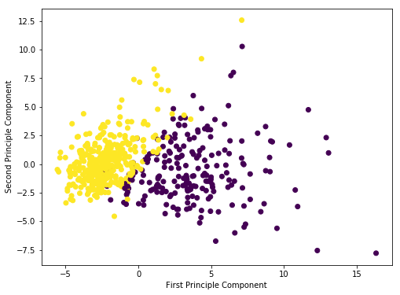

最近在讀這學期修的言談分析(Discourse Analysis)paper時，看到有一篇在寫怎麼用Factor Analysis(因素分析)來判別網路文本(比如說twitter, FB, online messages......etc)之間共通淺在的語言特徵。我覺得很有趣，於是上網查了一下發現主成分分析(Principal Component Analysis, PCA)跟因素分析(Factor Analysis)是同一個家族的概念。這週的microblog就是想整理一下我的讀書筆記，並利用現成的機器學習資料集實作一下PCA。

### 讀書筆記 

主成分分析(PCA)在機器學習內被歸類成為降維(Dimension reduction)內特徵擷取(Feature extraction)的一種方法，簡單來說，降維就是**當資料維度數(變數)很多的時候，有沒有辦法讓維度數(變數)少一點，但資料特性不會差太多**。如果透過少數變數或成分便能有效代表多個變項之間的結構，那會是相當有效率的方式。PCA的目的即是把少數的變數賦予線性關係，使經由線性組合而得的**成分的變異數最大(在這些成分方面顯示最大的差異)。**

因素分析(Factor Analysis)跟主成分分析(PCA)最大的不同即是在這：**因素分析的目的是在找出共同因素，強調共同點。**

下面是一些小疑問：

* PCA及Factor Analysis裡對於變數的性質有沒有特定限制？(比如說一定要是numerical variables?)
* “資料維度數(變數)很多”是指多少以上？有沒有最低限制？

當然上面講的這些都只是兩者的基本概念，背後還有許多數學模型(線性代數概念)及成分(或因素)的萃取方式、負荷量(loading)、模型評估、轉軸不轉軸等等，這些在論文裡都有出現，但無奈我才疏學淺，還需要一點時間摸索(或可以有高人提點～～)，不過看來本週的大腦“負荷量”已超載，希望之後能有時間慢慢研究。

### PCA小實作 

1.載入scikit learn內建的乳癌資料集及所需套件


```python
import matplotlib.pyplot as plt
import pandas as pd
import numpy as np
import seaborn as sns
%matplotlib inline
```


```python
from sklearn.datasets import load_breast_cancer
cancer = load_breast_cancer()

#這個資料集是以dictionary存在
cancer.keys()

#取得乳癌資料集的描述資料，記得要用print印出，不然只輸入'cancer['DESCR']'，閱讀時可能會看到'\n'等分行符號
print(cancer['DESCR'])

#將資料集轉成data frame
df = pd.DataFrame(cancer['data'],columns=cancer['feature_names'])
df.head()

#資料集中的target則是是否得到惡性腫瘤或良性腫瘤的結果
cancer['target']
```

    .. _breast_cancer_dataset:
    
    Breast cancer wisconsin (diagnostic) dataset
    --------------------------------------------
    
    **Data Set Characteristics:**
    
        :Number of Instances: 569
    
        :Number of Attributes: 30 numeric, predictive attributes and the class
    
        :Attribute Information:
            - radius (mean of distances from center to points on the perimeter)
            - texture (standard deviation of gray-scale values)
            - perimeter
            - area
            - smoothness (local variation in radius lengths)
            - compactness (perimeter^2 / area - 1.0)
            - concavity (severity of concave portions of the contour)
            - concave points (number of concave portions of the contour)
            - symmetry 
            - fractal dimension ("coastline approximation" - 1)
    
            The mean, standard error, and "worst" or largest (mean of the three
            largest values) of these features were computed for each image,
            resulting in 30 features.  For instance, field 3 is Mean Radius, field
            13 is Radius SE, field 23 is Worst Radius.
    
            - class:
                    - WDBC-Malignant
                    - WDBC-Benign
    
        :Summary Statistics:
    
        ===================================== ====== ======
                                               Min    Max
        ===================================== ====== ======
        radius (mean):                        6.981  28.11
        texture (mean):                       9.71   39.28
        perimeter (mean):                     43.79  188.5
        area (mean):                          143.5  2501.0
        smoothness (mean):                    0.053  0.163
        compactness (mean):                   0.019  0.345
        concavity (mean):                     0.0    0.427
        concave points (mean):                0.0    0.201
        symmetry (mean):                      0.106  0.304
        fractal dimension (mean):             0.05   0.097
        radius (standard error):              0.112  2.873
        texture (standard error):             0.36   4.885
        perimeter (standard error):           0.757  21.98
        area (standard error):                6.802  542.2
        smoothness (standard error):          0.002  0.031
        compactness (standard error):         0.002  0.135
        concavity (standard error):           0.0    0.396
        concave points (standard error):      0.0    0.053
        symmetry (standard error):            0.008  0.079
        fractal dimension (standard error):   0.001  0.03
        radius (worst):                       7.93   36.04
        texture (worst):                      12.02  49.54
        perimeter (worst):                    50.41  251.2
        area (worst):                         185.2  4254.0
        smoothness (worst):                   0.071  0.223
        compactness (worst):                  0.027  1.058
        concavity (worst):                    0.0    1.252
        concave points (worst):               0.0    0.291
        symmetry (worst):                     0.156  0.664
        fractal dimension (worst):            0.055  0.208
        ===================================== ====== ======
    
        :Missing Attribute Values: None
    
        :Class Distribution: 212 - Malignant, 357 - Benign
    
        :Creator:  Dr. William H. Wolberg, W. Nick Street, Olvi L. Mangasarian
    
        :Donor: Nick Street
    
        :Date: November, 1995
    
    This is a copy of UCI ML Breast Cancer Wisconsin (Diagnostic) datasets.
    https://goo.gl/U2Uwz2
    
    Features are computed from a digitized image of a fine needle
    aspirate (FNA) of a breast mass.  They describe
    characteristics of the cell nuclei present in the image.
    
    Separating plane described above was obtained using
    Multisurface Method-Tree (MSM-T) [K. P. Bennett, "Decision Tree
    Construction Via Linear Programming." Proceedings of the 4th
    Midwest Artificial Intelligence and Cognitive Science Society,
    pp. 97-101, 1992], a classification method which uses linear
    programming to construct a decision tree.  Relevant features
    were selected using an exhaustive search in the space of 1-4
    features and 1-3 separating planes.
    
    The actual linear program used to obtain the separating plane
    in the 3-dimensional space is that described in:
    [K. P. Bennett and O. L. Mangasarian: "Robust Linear
    Programming Discrimination of Two Linearly Inseparable Sets",
    Optimization Methods and Software 1, 1992, 23-34].
    
    This database is also available through the UW CS ftp server:
    
    ftp ftp.cs.wisc.edu
    cd math-prog/cpo-dataset/machine-learn/WDBC/
    
    .. topic:: References
    
       - W.N. Street, W.H. Wolberg and O.L. Mangasarian. Nuclear feature extraction 
         for breast tumor diagnosis. IS&T/SPIE 1993 International Symposium on 
         Electronic Imaging: Science and Technology, volume 1905, pages 861-870,
         San Jose, CA, 1993.
       - O.L. Mangasarian, W.N. Street and W.H. Wolberg. Breast cancer diagnosis and 
         prognosis via linear programming. Operations Research, 43(4), pages 570-577, 
         July-August 1995.
       - W.H. Wolberg, W.N. Street, and O.L. Mangasarian. Machine learning techniques
         to diagnose breast cancer from fine-needle aspirates. Cancer Letters 77 (1994) 
         163-171.


    array([0, 0, 0, 0, 0, 0, 0, 0, 0, 0, 0, 0, 0, 0, 0, 0, 0, 0, 0, 1, 1, 1,
           0, 0, 0, 0, 0, 0, 0, 0, 0, 0, 0, 0, 0, 0, 0, 1, 0, 0, 0, 0, 0, 0,
           0, 0, 1, 0, 1, 1, 1, 1, 1, 0, 0, 1, 0, 0, 1, 1, 1, 1, 0, 1, 0, 0,
           1, 1, 1, 1, 0, 1, 0, 0, 1, 0, 1, 0, 0, 1, 1, 1, 0, 0, 1, 0, 0, 0,
           1, 1, 1, 0, 1, 1, 0, 0, 1, 1, 1, 0, 0, 1, 1, 1, 1, 0, 1, 1, 0, 1,
           1, 1, 1, 1, 1, 1, 1, 0, 0, 0, 1, 0, 0, 1, 1, 1, 0, 0, 1, 0, 1, 0,
           0, 1, 0, 0, 1, 1, 0, 1, 1, 0, 1, 1, 1, 1, 0, 1, 1, 1, 1, 1, 1, 1,
           1, 1, 0, 1, 1, 1, 1, 0, 0, 1, 0, 1, 1, 0, 0, 1, 1, 0, 0, 1, 1, 1,
           1, 0, 1, 1, 0, 0, 0, 1, 0, 1, 0, 1, 1, 1, 0, 1, 1, 0, 0, 1, 0, 0,
           0, 0, 1, 0, 0, 0, 1, 0, 1, 0, 1, 1, 0, 1, 0, 0, 0, 0, 1, 1, 0, 0,
           1, 1, 1, 0, 1, 1, 1, 1, 1, 0, 0, 1, 1, 0, 1, 1, 0, 0, 1, 0, 1, 1,
           1, 1, 0, 1, 1, 1, 1, 1, 0, 1, 0, 0, 0, 0, 0, 0, 0, 0, 0, 0, 0, 0,
           0, 0, 1, 1, 1, 1, 1, 1, 0, 1, 0, 1, 1, 0, 1, 1, 0, 1, 0, 0, 1, 1,
           1, 1, 1, 1, 1, 1, 1, 1, 1, 1, 1, 0, 1, 1, 0, 1, 0, 1, 1, 1, 1, 1,
           1, 1, 1, 1, 1, 1, 1, 1, 1, 0, 1, 1, 1, 0, 1, 0, 1, 1, 1, 1, 0, 0,
           0, 1, 1, 1, 1, 0, 1, 0, 1, 0, 1, 1, 1, 0, 1, 1, 1, 1, 1, 1, 1, 0,
           0, 0, 1, 1, 1, 1, 1, 1, 1, 1, 1, 1, 1, 0, 0, 1, 0, 0, 0, 1, 0, 0,
           1, 1, 1, 1, 1, 0, 1, 1, 1, 1, 1, 0, 1, 1, 1, 0, 1, 1, 0, 0, 1, 1,
           1, 1, 1, 1, 0, 1, 1, 1, 1, 1, 1, 1, 0, 1, 1, 1, 1, 1, 0, 1, 1, 0,
           1, 1, 1, 1, 1, 1, 1, 1, 1, 1, 1, 1, 0, 1, 0, 0, 1, 0, 1, 1, 1, 1,
           1, 0, 1, 1, 0, 1, 0, 1, 1, 0, 1, 0, 1, 1, 1, 1, 1, 1, 1, 1, 0, 0,
           1, 1, 1, 1, 1, 1, 0, 1, 1, 1, 1, 1, 1, 1, 1, 1, 1, 0, 1, 1, 1, 1,
           1, 1, 1, 0, 1, 0, 1, 1, 0, 1, 1, 1, 1, 1, 0, 0, 1, 0, 1, 0, 1, 1,
           1, 1, 1, 0, 1, 1, 0, 1, 0, 1, 0, 0, 1, 1, 1, 0, 1, 1, 1, 1, 1, 1,
           1, 1, 1, 1, 1, 0, 1, 0, 0, 1, 1, 1, 1, 1, 1, 1, 1, 1, 1, 1, 1, 1,
           1, 1, 1, 1, 1, 1, 1, 1, 1, 1, 1, 1, 0, 0, 0, 0, 0, 0, 1])


2.預處理：先將資料轉成一樣的比例尺


```python
from sklearn.preprocessing import StandardScaler
scaler = StandardScaler()
scaler.fit(df)
scaled_data = scaler.transform(df)
```

3.載入PCA套件


```python
from sklearn.decomposition import PCA

#輸入有多少成份我們想要留住分解
pca = PCA(n_components=2)

#將資料轉成兩個主成份
pca.fit(scaled_data)
x_pca = pca.transform(scaled_data)

#原本有30種維度
scaled_data.shape

#轉型後變成只有兩種維度
x_pca.shape
```


    (569, 2)


4.製作畫出剛剛兩個篩選出的主成份


```python
plt.figure(figsize=(8,6))
plt.scatter(x_pca[:,0],x_pca[:,1],c=cancer['target'])
plt.xlabel('First Principle Component')
plt.ylabel('Second Principle Component')
```


    Text(0, 0.5, 'Second Principle Component')





```python
#最後取得的成份會和原始變數相關，但轉變後的成份也會儲存在調整過的PCA變數中
pca.components_
```


    array([[ 0.21890244,  0.10372458,  0.22753729,  0.22099499,  0.14258969,
             0.23928535,  0.25840048,  0.26085376,  0.13816696,  0.06436335,
             0.20597878,  0.01742803,  0.21132592,  0.20286964,  0.01453145,
             0.17039345,  0.15358979,  0.1834174 ,  0.04249842,  0.10256832,
             0.22799663,  0.10446933,  0.23663968,  0.22487053,  0.12795256,
             0.21009588,  0.22876753,  0.25088597,  0.12290456,  0.13178394],
           [-0.23385713, -0.05970609, -0.21518136, -0.23107671,  0.18611302,
             0.15189161,  0.06016536, -0.0347675 ,  0.19034877,  0.36657547,
            -0.10555215,  0.08997968, -0.08945723, -0.15229263,  0.20443045,
             0.2327159 ,  0.19720728,  0.13032156,  0.183848  ,  0.28009203,
            -0.21986638, -0.0454673 , -0.19987843, -0.21935186,  0.17230435,
             0.14359317,  0.09796411, -0.00825724,  0.14188335,  0.27533947]])


上面的numpy矩陣陣列中，每橫排代表一個主成份，而每行則代表和原始變數的相關度


```python
df_comp = pd.DataFrame(pca.components_,columns=cancer['feature_names'])
```

5.利用heatmap把相關性給畫出


```python
plt.figure(figsize=(12,6))
sns.heatmap(df_comp,cmap='plasma')
```


    <matplotlib.axes._subplots.AxesSubplot at 0x11953bba8>


Reference

[Python學習筆記#18：機器學習之Principle Component Analysis實作篇](http://psop-blog.logdown.com/posts/3161978-python-machine-learning-principle-component-analysis)

[機器/統計學習:主成分分析(Principal Component Analysis, PCA)](https://medium.com/@chih.sheng.huang821/%E6%A9%9F%E5%99%A8-%E7%B5%B1%E8%A8%88%E5%AD%B8%E7%BF%92-%E4%B8%BB%E6%88%90%E5%88%86%E5%88%86%E6%9E%90-principle-component-analysis-pca-58229cd26e71) -->這個我覺得把PCA概念講得很淺顯易懂，推！

[主成份分析&因素分析](https://zh.scribd.com/presentation/23108284/%E4%B8%BB%E6%88%90%E4%BB%BD%E5%88%86%E6%9E%90-%E5%9B%A0%E7%B4%A0%E5%88%86%E6%9E%90)
