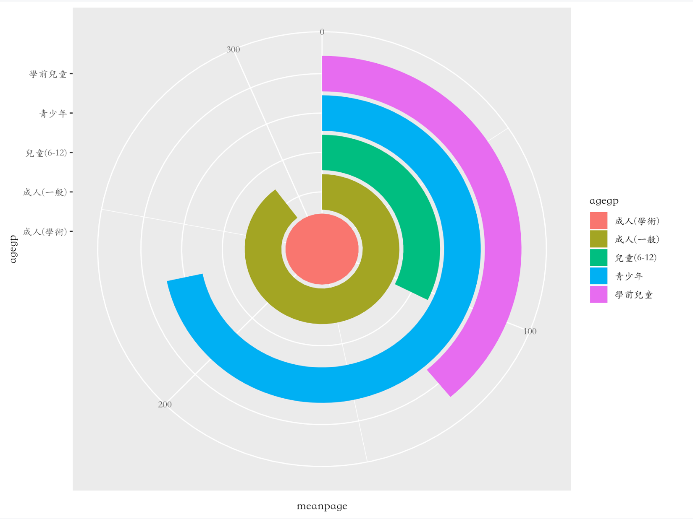
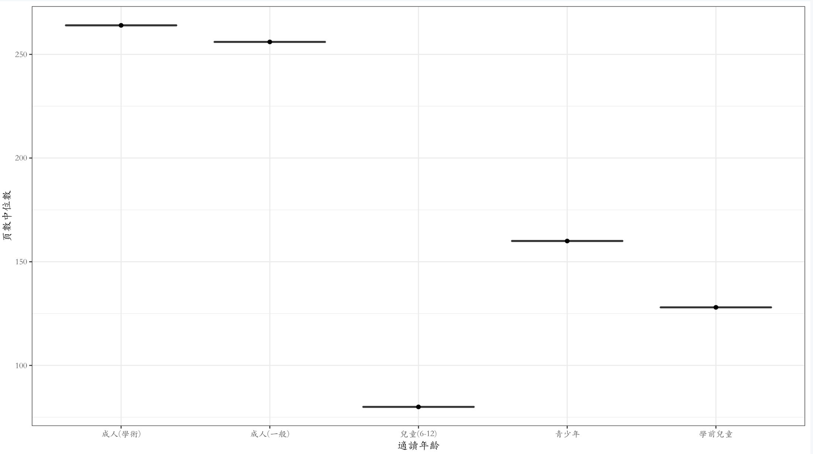
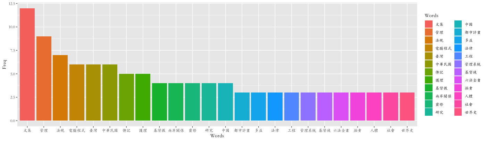
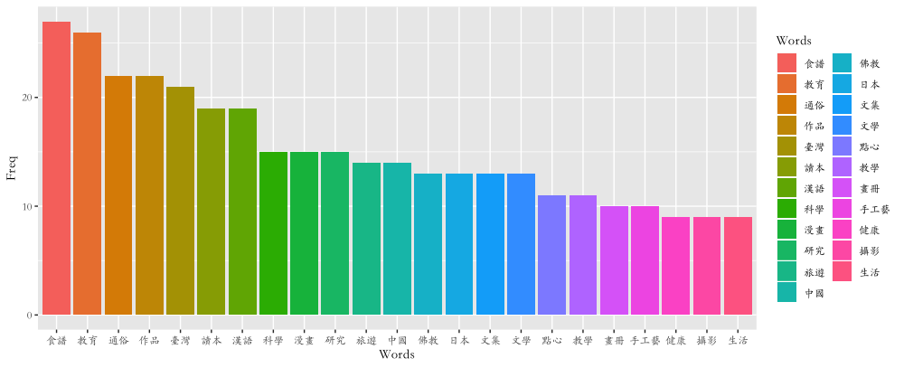

```{r setup, include=FALSE}
knitr::opts_chunk$set(echo = TRUE)
```

我是一個非常愛逛書店的人，平時的我也很喜歡看書，各式各樣的書都看。我認為看書，是一種享受，是與作者做心靈交流的時刻。以往，在我們的傳統觀念裡，與「書」、「文學」相關的一切應該都和「數字」扯不上任何一點關係。然而，將資料科學的思維導入文學、出版事業，能讓我們從經驗導向的世界換位思考，以客觀的資料事實及科學方法看待事物，這在現今講求「數據」的時代是無比重要的。因此，這次的微專案我決定從我最熟悉的地方做起。

這次的資料集是取自[政府開放資料網站](https://data.gov.tw) 裡的[臺灣出版新書預告書訊](https://data.gov.tw/dataset/6730) 。此資料集搜集了台灣2019年1月的所有出版書籍，包括書名、作者、出版單位、版次、出版年月、標題、適讀對象、類號、ISBN、開數、頁數、得獎紀錄，並提供多種下載格式(CSV, XLSX,ODS,XML,JSON)，非常方便。從此資料中可以看出1月份台灣總共有3453本書籍出版，刪除掉一些NA值之後，真正分析的資料共有1621筆。
	
## 什麼！幼兒讀的書竟然比小學生厚！？

首先，我最好奇的是適讀對象與頁數之間的關聯性。適讀對象根據的是出版單位將書籍向國家圖書館送存時所註名的資訊。分為一般類成人、學術類成人、青少年、兒童(6~12歲)、學前兒童、樂齡等六類。從下面的圖中可以看出針對各適讀年齡層所出版的平均書籍頁數：

```{r pressure1, echo=FALSE, fig.cap="各年齡層平均頁數", out.width = '100%'}

```

平均頁數最長的是學術類成人書籍，超過300頁。接下來的平均頁數則隨著年齡層的下降而減少，這個十分的理所當然。不過，有一個有趣的點是學前兒童的平均頁數竟然比學齡兒童(6~12歲)多出20頁左右！然而仔細想想之後發現這並不難理解，因為給幼兒的書絕大多數都是圖片、較少文字的部分，因此篇幅也會比較長。而學齡兒童的閱讀則逐漸邁向文字，頁數當然也不會像「圖畫書」那樣多了。而這樣的現象可以在下面各適讀年齡層的書籍頁數中位數中更清楚的看到：
```{r pressure2, echo=FALSE, fig.cap="各年齡層頁數中位數", out.width = '100%'}

```

## 大部頭的書都是怎樣的書？

我有一陣子對大部頭的書很感興趣，越厚的書越能引起我的興趣。因此，這次我篩選出500頁以上的書籍書名、標題(其實是一種主題分類，給予一書主題的詞彙描述以便於將相同概念不同的主題，彙整一處)詳見[國家圖書館中文主題詞表](http://catweb.ncl.edu.tw/portal_e3_cnt.php?button_num=e3&folder_id=72)、出版單位等三項作了詞頻分析：
```{r pressure3, echo=FALSE, fig.cap="500頁以上的書籍書名詞頻表", out.width = '100%'}
knitr::include_graphics("500頁以上書籍的書名＿詞頻表.png")
```

從圖中可以看出500頁以上的書籍裡都是「寶典」、「理論」、「法規」、「歷史」、「論文集」等級的啊～不過比較有趣的是「護理」、「護理學」竟然頻頻出現！這是否只是巧合呢？從資料上來看，1月份出了好幾本護理學的教科書及參考書，像是「全方位護理應考e寶典: 兒科護理學」、「急重症護理學」等等。如果是教科書的話，好像一切就比較合理了🐻。

再來看看主題分類的部分，看看大部頭書都是屬於哪一種分類的書？
```{r pressure4, echo=FALSE, fig.cap="500頁以上的書籍主題分類詞頻表", out.width = '100%'}

```

文集、管理類、法規類、電腦程式、傳記、基督教、研究類的書顯然很厚啊～這個我真的深有同感，電腦程式類的書我覺得~~好像有越做越厚的趨勢~~(不專業心得)～～

隨著網路席捲世界，能一頁一頁翻閱書的人已經幾乎消失殆盡，大家都改滑手機、或看電子書。因此，我十分佩服還有勇氣出大部頭書的出版社。從資料中來看，崧博、五南、聯經這三家出版社是1月份出最多500頁以上書的出版社。崧博在1月份出了一些烹飪、酒店規劃等方面的參考書，也出一些兩岸關係上的評論及研究書籍。五南則出了好幾本法規類的書，而聯經本來就是出版人文社科書籍的大出版社，1月份也出版很多在人文社科方面的書，比如說「康有為思想研究」、「當代歷史學新趨勢」、「自由主義的道德處境」......等等。這些基本上符合前面所說的：法規類、研究類、教科書及參考書通常都比較厚。

## 看完了大部頭書，那輕薄短小的書呢？

為了公平起見，我也挑出200頁以下的書籍的書名、主題分類、及出版社作為對照。
```{r pressure5, echo=FALSE, fig.cap="200頁以下的書籍書名詞頻表", out.width = '100%'}
knitr::include_graphics("小於200頁書籍的書名.png")
```
華語課本、手冊、設計、生活方面的書看來較為輕便。咦？等等，華語課本不也是教科書嗎？為什麼它們大都是200頁以下的呢？念了華語教學相關科系四年，我應該有資格來稍稍解釋一下。現在的華語教學教科書大都分級的十分清楚，從入門到進階分為好幾冊，每個級數裡也會分課文、漢字練習本、課外閱讀(文化教材)等等好幾本，所以每本的頁數幾乎都不多，但是分為很多冊( ~~樹木的眼淚~~ )。況且學生大概也不願看到很厚的課本吧！

主題分類方面，食譜、通俗作品、漢語讀本、漫畫、旅遊類、手工藝、畫冊、攝影、生活類書籍大都比較薄。這明顯與上面厚厚的文集、管理類、法規類、電腦程式、傳記、基督教、研究類的書形成強烈對比。
```{r pressure6, echo=FALSE, fig.cap="200頁以下的書籍主題分類詞頻表", out.width = '100%'}

```
至於出版社，花木蘭文化、僑委會、ＸＸ基金會等等出版比較多小而薄的書。花木蘭文化是以出版當代中國文化、歷史、美術方面的博士論文為其特色。我自己私心以為，博士論文要寫到200頁以上是不是不太容易？而僑委會、基金會等等出版比較多應該是其業務或是所關心的議題上的宣導手冊或介紹，所以也會比較薄一些。

## 小小的結論

這次的微專案我小小的分析了一下台灣2019年1月的所有新出版書籍。首先有頁數跟適讀對象之間的關聯、以及關於大部頭書及輕薄小書的一些小分析。不過，其實這次的資料[臺灣出版新書預告書訊](https://data.gov.tw/dataset/6730) ，還有很多值得探索的東西，比如說得獎紀錄、作者等等的資料，或是若能取得歷年的台灣出版新書資訊應該也會很有趣。希望之後能有機會做。

