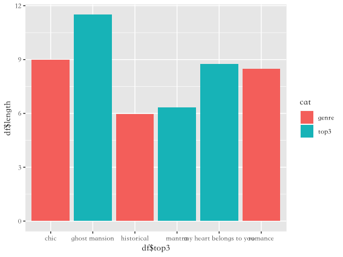
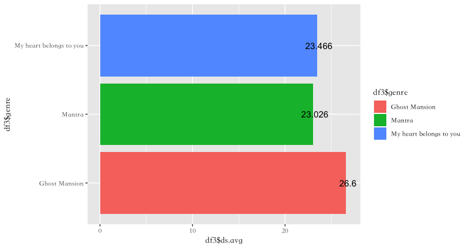
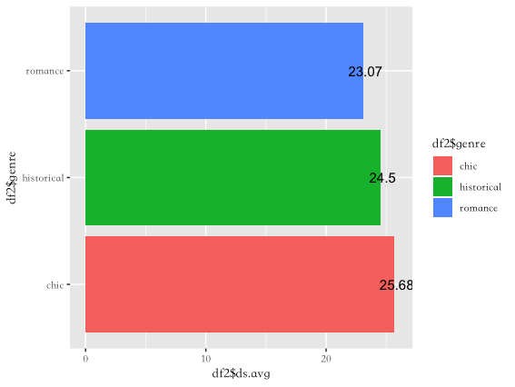

```{r setup, include=FALSE}
knitr::opts_chunk$set(echo = TRUE)
```

上週提到了我是一個非常喜歡逛書店、看書的人。上次的blog（從數字看新書）主要是著重在書的「外在環境」：台灣的出版業及不同年齡讀者的喜好上。這週我想要回歸到書本的「內在」，即是書裡面的文字部分。
如果問大多數人，書本、小說裡面的文字是屬於書面語還是口語呢？大多數人應該都會覺得：你在說什麼廢話！？當然是「書」面語啊～它都叫「書」了！那如果是問書裡面角色的對白呢？這時候你可能就有點遲疑了，書中人物講話「很像」我們平時講話，但卻又沒那麼像。若將我們平時講的話都錄下來，應該會像下面這樣充滿斷句、打岔、贅句、未完句：

> 秘書：「還是……我等一下再……」  
> 主管：「要問一下，問一下啦。」  
> 秘書：「恩恩...好...好」

真實對話，大部份是無聊的碎渣。但你有看過小說裡面的人這樣講話的嗎？小說裡的人，講話好像都比我們再「有水準」一點，像下面這樣：

> 傑西：「嗨，比爾，我其實是迷路了，剛才有人搶了我的皮包，你看，我的鼻子。」  
> 比爾：「天哪，傑西，你的鼻子大而紅腫，流了一些鼻血，發生什麼事了？」

例子取自 [《變身暢銷小說家：倪采青談小說寫作技巧》](http://rosenovel.pixnet.net/blog/post/14293582)

這時候你又會覺得：哪個正常人平常會這樣講話啦～因為其實很少人在見面講話時，會頻頻稱對方的名字，也應該很少人在被搶之後，還會冷靜地用語言，不加任何狀聲詞和手勢，來描述那個事件。

## 啊講了那麼多，所以......

總之，我就是對小說裡面的對話很感興趣，像是小說裡的對話大都是怎樣呈現、不同類型的小說是否會有不同的對話表現，這些都是在這篇blog裡面會談到的。

## 人物要講話前，都會出現什麼......?

首先，我從[鏡文學](www.mirrorfiction.com)網站上，爬了點擊總排行榜上的前三名，又根據不同類型（都會、歷史、愛情），抓了各類型的第一、二名的小說。然後利用[文本分析器](https://pulipulichen.github.io/HTML5-Text-Analyzer/)，找出在“「」”前最常出現的句子，並計算它們的句子長度（幾個字），結果如下：
```{r pressure1, echo=FALSE, fig.cap="對話前句子長度", out.width = '100%'}

```

圖表顯示，不管是哪一種類型的小說，對話前的句子都不長，集中在6~12個字中間。但是，*Ghost Mansion鬼魅豪宅*(總點擊排行榜第一名）的作者特別愛用長句來表現對話前的句子，比跟它同是都會小說（chic)的其他作品還要來得高。這表示這位作者特別喜歡在讓角色說話前給予很多描述，比如說：操著孟加拉腔調的司機長篇大論地繼續發表著、小范立刻脫掉西裝強迫自己露出笑容......。
接下來我們來看看這些「對話前」的句子都長什麼樣吧！
```{r table1}
tagger1 = readRDS('top3_dialogue_tagger.rds')
knitr::kable(tagger1, caption = "top3_詞性標註")
```

```{r table2}
tagger2=readRDS("tagger2.rds")
knitr::kable(tagger2, caption = "genre_詞性標註")
```

除了將這些對話列出來，我還使用了[國教院分詞](http://120.127.233.228/Segmentor/)系統幫這些句子做了詞性標註。國教院的詞性是完全採用中研院的詞性標記系統。之所以會選用，是因為試了好多其他的詞性標註工具或套件，但不是安裝太麻煩就是成效不彰。像是Jieba其實有繁體中文的詞性標註功能，速度也很快，但標出來的結果真的是很令人失望，「笑」著說的「笑」竟然會標「Na」!而其他像是SnowNLP, Hanlp其實也都有詞性標註功能，但無奈我暫時還裝不起來這些套件ＱＱ，所以這禮拜先暫時使用國教院的分詞系統。從結果上來看，整體正確率還不錯，但還是偶有疏漏之處，像是ＸＸＸ「道」，就會被標成「Na」。我猜測有可能是因為它背後訓練的資料新近詞的收量較大，而像「道」這種古典的用法就沒有涵蓋。

## 再來看看對話本身吧

利用前面所提到的文本分析器，我也抓出“「」”內的句子長度，以及這些對話佔整篇小說的比例。
```{r pressure2, echo=FALSE, fig.cap="熱門點擊小說平均對話長度", out.width = '100%'}

```

```{r pressure3, echo=FALSE, fig.cap="各類型小說平均對話長度", out.width = '100%'}

```

```{r}
top3_dg_pro=readRDS("top3_before_dialogue_proportion.rds")
knitr::kable(top3_dg_pro, caption = "top3 對話比例")
```

```{r}
genre_dg_pro=readRDS("genre_before_dialogue_proportion.rds")
knitr::kable(genre_dg_pro, caption = "genre 對話比例")
```

其實從小說對話的長度來看，好像看不出個什麼端倪，因為都差不多在20多個字左右。但若是看對話比例的話，也許可以看出一些趨勢。*My Heart Belongs to you心有所屬* (愛情小說)的對話比例是18% ，這硬生生地比 *Ghost Mansion鬼魅豪宅* (都會小說)的5%高出許多，這應該不是小說的作者風格不同所造成的。以類型來區分，Romance(愛情小說)的對話比例(14%) 也比Chic(都會小說)的7%來得高。雖然我不是非常愛看愛情小說，但直覺告訴我：這其中必有詐！我仔細檢視了一下鏡文學網站上的愛情小說，發現它們的主題都偏向青春浪漫校園取向，如果一本這麼「❤️少女粉紅泡泡❤️」的小說裡都是充滿這無聊冗長的敘述，而缺少懷抱著曖昧情愫的男女主角之間的情話綿綿，讀者才不要看呢！

## 結論…...或許不是結尾？

這週的主題還是圍繞在我喜愛的文學小說上，程式說實話使用得不多，都集中在使用ggplot的繪圖套件上，但還是比上一週有一點小進展......?就是我終於可以畫出並列的長條圖了！！（就是對話前的句子長度那張圖） ~~自我安慰模式啟動~~ 😄
之所以說應該不是結尾，是因為我對小說中的對話這件事還是有很大的興趣，所以下週希望還會繼續做下去(希望啦，如果沒有意外的話)，然後我會努力搞清楚那個分詞系統的套件到底要怎麼安裝！！
最後附上一些我覺得很有用的reference，給我自己看也分享給有需要的人參考。

### Reference

[中文處理工具簡介 - HackMD](https://g0v.hackmd.io/fR51fyEcQYOVIGSCanO3TA)

[RPubs - Visualization](http://www.rpubs.com/chiahung_tsai/lecture05012018)

[輕鬆學習 R 語言 | Learn R The Easy Way](http://www.learn-r-the-easy-way.tw/chapters/14)

[國教院分詞系統原始碼下載](https://github.com/naernlp/Segmentor/?fbclid=IwAR0wRWqNIFPTGdj8ltXcALhF_OEqGpGW_Znjv4b7diwQteqEVMZt9tSQmUA)

