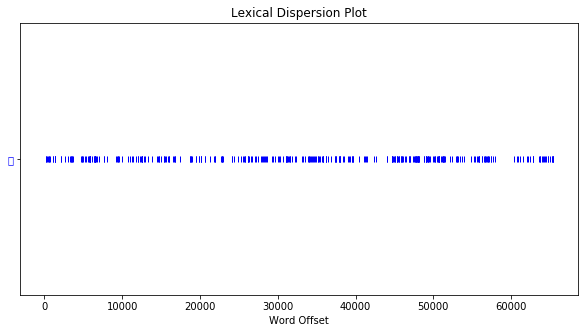

# W3 Microblog
## *中文文本分析工具小評比*

上週我提到“我對小說中的對話這件事還是有很大的興趣，所以下週希望還會繼續做下去(希望啦，如果沒有意外的話)”～所以本來應該要繼續做下去的。
但反正～噹噹～意外就！是！發生惹(其實也不是什麼意外啦)，我“意外”地發現要做文本分析前，應該先弄清楚最基本的中文斷詞、詞性標記到底是怎麼運作的。這也算是解決了我上禮拜說的“我會努力搞清楚那個分詞系統的套件到底要怎麼安裝！！ ”
所以，接下來會試試看使用能處理中文不同的斷詞及詞性標記工具與套件～

# 1. NLTK真是太強大啦

NLTK可以做的事情真多！斷詞部分似乎還是使用jieba，但只要一個簡單的步驟，就可以找到指定詞彙的相似詞。不過所謂“相似”的意思是指什麼，我還沒有弄懂。從結果上來看，似乎是指常常一起出現的字？


```python
#jieba.cut 是做中文斷詞， nltk.text.Text 讓文本成為 NLTK 可以吃的格式
import nltk
import jieba.analyse
raw=open('ghost_mansion.txt', encoding='utf-8').read()
text=nltk.text.Text(jieba.lcut(raw))
text.similar("說")                       
```

    Building prefix dict from the default dictionary ...
    Loading model from cache /var/folders/s3/x6bgjnss22ggm9fct3z9mgz00000gn/T/jieba.cache
    Loading model cost 0.848 seconds.
    Prefix dict has been built succesfully.


    對 聽 看 父親 知道 告訴 想 是 也 都 跟 搞 的 只是 幫 了 把 和 房子 爸爸


- - - -
NLTK還可以像語料庫一樣呈現特定詞的concordance


```python
print(text.concordance(u'說'))
```

    Displaying 25 of 339 matches:
     的 角色 ， 雖然 他 也 只是 那個 掠奪 的 時代 （ 文雅 一點 的 說 法 是 相 對 剝奪 ） 的 幫 兇 ， 雖然 他 自己 至少 在 財產上 
     個 月 ， 七十多 歲 的 他 在 病榻 前花 了 好 幾個 禮拜 對 我 說 出 整件 事件 ， 然 後 交代 我務 必想 辦法 把 事件 見諸 文字 ，
    有 的 小康 國家 慢慢 崩壞 成 宛如 第三世界 ， 不 ！ 就 實情 來 說 ， 已經 被 列為 第三世界 ， 許多人 歸咎 於 人口 減少 ， 從 23
     這些 外籍 移工 繳交稅 金付給 軍 公教 新水 與 退休金 。 也 有人 說 是 房 地產 炒 過頭 ， 所有 的 資源 都 投入 沒什麼 生產力 的 房
     的 人士 ， 誰 又 不是 如此 ？ 我 不如 僅憑 他 在 病榻 前所訴 說 的 故事 ， 就 武斷 地書 寫 出 在 當年 鬧 的 沸沸 騰騰 的 「 
    騰 的 「 星友 事件 」 ， 除了 信任感 的 疑慮 外 ， 我 老爸 的 說 法中 彷 彿 存在 許多神 祕 的 謎團 ， 或許 是 忘 了 ！ 或許 是
    準確 無誤 地 再現 事件 的 原貌 是 不 可能 的 ， 因為 經由 口中 說 出來 的 事永遠 不 可能 與 事件 原樣 絲 毫不 差 。 總難免 有 許
    裝 保全 的 面前 吐露 積藏 在 內心 幾 十年 的 祕 密 ， 尤其 是 說 不定 還會 引來 不必要 的 曝光 與 糾紛 的 秘密 。   從捷運 的 
    ， 沒人願 意載 客到 星 友社 區 ， 好不容易 找到 一部 ， 好 說歹 說 外 加上 支付 兩倍 的 現金 ， 司機 才 願 意載 我 。 「 妳 真的
     呼嘯而過 的 一瞥 ， 但 殘敗 的 程度 完全 映 在 眼簾 ， 與 其 說 是 破舊 ， 到 不如 說 是 已經 進入 自然 演化 的 廢墟 。   「
     殘敗 的 程度 完全 映 在 眼簾 ， 與 其 說 是 破舊 ， 到 不如 說 是 已經 進入 自然 演化 的 廢墟 。   「 那裡頭 聽 說 有 鹿 啊
     到 不如 說 是 已經 進入 自然 演化 的 廢墟 。   「 那裡頭 聽 說 有 鹿 啊 、 山羌 啊 ！ 我 有 幾個 朋友 ， 偶爾會 來 這一帶 打
    朋友 ， 偶爾會 來 這一帶 打獵 呢 ！ 」 司機 喜孜孜 地 指著 窗外 說 著 。   過了 一 大片 廢棄 的 體育 園區 與 高球 場遺址 後 ， 
     抵達 第四 棟 必須 先 穿越 過這三棟 大樓 中間 的 中庭 ， 與 其 說 是 中庭 ， 倒不如 說 是 小型 破敗 農村 ， 中庭 已經 被 少數 還
     穿越 過這三棟 大樓 中間 的 中庭 ， 與 其 說 是 中庭 ， 倒不如 說 是 小型 破敗 農村 ， 中庭 已經 被 少數 還住 在 這裡 的 居民 充
    裡 找 人 ？ 找什麼 人 ？ 或許 一個 人 的 姓名 對 這裡 的 人來 說 ， 只是 一個 虛幻 的 法律 意義 。   我 當然 知道 一點 物質 上
    開來 ， 電梯裡頭 一片 熏黑 燻 黑 ， 好像 被 燒過 似的 ， 與 其 說 是 電梯 ， 倒不如 形容 是 個 墳 墓 ， 電梯門 彷 若 陵墓 墓碑 
    的 話 聽 進去 ， 自顧 自地 走 到 最 角落 的 一戶 ， 指著 大門 說 ：   「 就 這一戶 ！ 」   她 直接 推開 生 鏽 的 鐵 門 ， 
     屋內 飛到 電梯間 走 道 。   「 是 野 鴿子 啦 ！ 」 那婦 人 說 著 。   「 牠 們 八成 是 從 破損 的 窗戶 鑽 進來 的 ， 後 
    有人 在 嗎 ？ 我要 找 姚 莉莉 女士 ！ 」   那婦 人 對 著 我 說 ： 「 妳 別 喊 了 ！ 」   「 難道 姚 莉莉 不 在家 嗎 ？ 」
    ， 我 不 自覺 地 把 外套 拉著 緊緊 的 ， 滿腦 都 是 剛剛 老婦 說 的 毒蟲 遊民 的 畫面 。   「 我 就是 姚 莉莉 ！ 」 那 老婦 
     毒蟲 遊民 的 畫面 。   「 我 就是 姚 莉莉 ！ 」 那 老婦 人 說 著 。 
     「 妳 就是 yoyo ？ 」 我 沒 有 在 第一 時間 就 
    經 卸下 心防 ， 把 我 當成 忘 年 的 閨密 。     衣物 間 可 說 是 別 有 洞天 ， 至少 擺上 五十 款 各種 名牌 包包 、 上百 雙名
    菜 鳥 警察 會嚇 得 亂 開槍 喔 ！ 回收 的 資源 對 這裡 的 人來 說 ， 可是 一筆 不小 的 財富 ， 運氣 好 的 話 ， 曾經 有人 搶到 
    的 事情 啦 ！ 我開 玩笑 的 ！ 」   yoyo 收起 笑容 嚴肅 地 說 著 。   看樣子 她 這句 話 應該 沒 說 謊 ， 但 我 還是 無 法
    None


- - - -
可以呈現詞彙分布圖:可以看到詞之間的先後順序，以及頻率分佈，下面以「說」為例：


```python
import matplotlib.pyplot as plt
plt.figure(figsize=(10, 5)) 
plt.rcParams['font.sans-serif'] = 'SimHei'
print(text.dispersion_plot(["說"]))
```

    /Library/Frameworks/Python.framework/Versions/3.7/lib/python3.7/site-packages/matplotlib/font_manager.py:1241: UserWarning: findfont: Font family ['sans-serif'] not found. Falling back to DejaVu Sans.
      (prop.get_family(), self.defaultFamily[fontext]))





    None


不過中文字體一直出不來，不知道為什麼，希望之後能解決。

# 2. SnowNLP

SnowNLP也是個可以處理中文的套件。它主要的功能有很多：可以分詞、詞性標註、情感分析、文本摘要、提取關鍵字、文本分類等等，看起來是個CP值非常高的工具。不過它斷詞的功能似乎不怎麼樣，看下面以“葉國強打斷她的話”為例，幾乎把每個字都斷開了，詞性標註也不知道是怎麼標的？


```python
from snownlp import SnowNLP
s = SnowNLP(u'葉國強打斷她的話')
s.words
list(s.tags)
```


    [('葉', 'o'),
     ('國', 'e'),
     ('強', 'e'),
     ('打', 'v'),
     ('斷', 'y'),
     ('她', 'r'),
     ('的', 'u'),
     ('話', 'Yg')]


我查了一下之後發現它是以簡體中文為訓練集的資料庫。而且加上它自帶了一些訓練好的字典，所以使用者雖然不用自己自建詞典於，但也因此受限於它的訓練資料庫。

# 3. Jieba：功能強悍的Python 中文斷詞(以及其他？)套件


jieba 斷詞有三種模式：全模式、精確模式(默認)、搜尋引擎模式，下面將分別用三種模式試試看哪種效果最好


```python
# 全模式
import jieba
seg_list = jieba.cut("葉國強打斷她的話", cut_all=True)
print("Full Mode:", "/ ".join(seg_list)) 
```

    Building prefix dict from the default dictionary ...
    Loading model from cache /var/folders/s3/x6bgjnss22ggm9fct3z9mgz00000gn/T/jieba.cache
    Loading model cost 1.014 seconds.
    Prefix dict has been built succesfully.


    Full Mode: 葉/ 國/ 強/ 打/ 斷/ 她/ 的/ 話


```python
# 默認模式
seg_list = jieba.cut("葉國強打斷她的話", cut_all=False)
print("Default Mode:", "/ ".join(seg_list) ) 
seg_list = jieba.cut("小范立刻脫掉西裝強迫自己露出笑容", cut_all=False)
print("Default Mode:", "/ ".join(seg_list) ) 
```

    Default Mode: 葉國強/ 打斷/ 她/ 的/ 話
    Default Mode: 小范/ 立刻/ 脫掉/ 西裝/ 強迫/ 自己/ 露出/ 笑容


```python
# 搜索引擎模式
seg_list = jieba.cut_for_search("葉國強打斷她的話")
print (", ".join(seg_list))
seg_list = jieba.cut_for_search("矗立著又大又明顯且看起來還很新的告示牌")
print (", ".join(seg_list))
```

    葉國強, 打斷, 她, 的, 話
    矗立, 著, 又, 大, 又, 明, 顯且, 看, 起來還, 很, 新, 的, 告示, 告示牌


* 全模式將所有詞都斷開，似乎效果不佳
* 默認的精確模式看起來效果最好，能將句子準確斷開，適合文本分析
* 搜索引擎模式看起來也很不錯，但“明顯”兩字被斷開，似乎是因為搜尋引擎模式是基於精確模式上再將長詞繼續細分所造成的結果

- - - -
Jieba 還能將斷開的詞標註詞性，如下面所示：


```python
import jieba.posseg as jp
print(jp.lcut('葉國強打斷她的話'))

```

    [pair('葉國強', 'nr'), pair('打斷', 'v'), pair('她', 'r'), pair('的', 'uj'), pair('話', 'n')]


```python
print(jp.lcut('小范立刻脫掉西裝強迫自己露出笑容'))
```

    [pair('小范', 'n'), pair('立刻', 'd'), pair('脫掉', 'v'), pair('西裝', 'n'), pair('強迫', 'a'), pair('自己', 'r'), pair('露出', 'v'), pair('笑容', 'n')]


```python
print(jp.lcut('矗立著又大又明顯且看起來還很新的告示牌'))
```

    [pair('矗立', 'v'), pair('著', 'v'), pair('又', 'd'), pair('大', 'a'), pair('又', 'd'), pair('明顯', 'a'), pair('且', 'c'), pair('看', 'v'), pair('起來', 'v'), pair('還', 'd'), pair('很', 'd'), pair('新', 'a'), pair('的', 'uj'), pair('告示牌', 'n')]


```python
print(jp.lcut('說道'))
```

    [pair('說', 'v'), pair('道', 'q')]


效果看起來很不錯，連“葉國華”這種人名都可以知道是專有名詞！(我甚至沒有沒有set user dictionary)，真是太強大了～只不過較古典一點的用法“說道”似乎就沒有辦法識別。看來還是需要input自己的字典會更好。

- - - -
Jieba 居然還可以提取關鍵字！分為TF-IDF與TextRank兩種：


```python
# TF-IDF
#找出的關鍵詞會依照詞頻權重排列
s = "操著孟加拉腔調的司機長篇大論地繼續發表著"
print(jieba.analyse.extract_tags(s, topK=20, withWeight=False, allowPOS=())) #topK為返回幾個TF / IDF權重最大的關鍵詞，默認值為20
for x, w in jieba.analyse.extract_tags(s, withWeight=True):
    print('%s %s' % (x, w))
```

    ['操著', '腔調', '司機長', '大論', '地繼續', '發表著', '孟加拉']
    操著 1.7078239289857142
    腔調 1.7078239289857142
    司機長 1.7078239289857142
    大論 1.7078239289857142
    地繼續 1.7078239289857142
    發表著 1.7078239289857142
    孟加拉 1.3092113147971427


這句的重點竟是“操著”！？“司機長”看起來是被斷開了.......


```python
# TextRank
print(jieba.analyse.textrank(s,  withWeight=False))
for x, w in jieba.analyse.textrank(s, withWeight=True):
    print('%s %s' % (x, w))
```

    ['司機', '繼續', '腔調', '操著', '表著']
    司機 1.0
    繼續 0.7470070442103558
    腔調 0.6683682393186766
    操著 0.6656674769499933
    表著 0.40679763001497043


如果比較兩種關鍵字算法，我會覺得兩個算法似乎都比較不符合人的思考邏輯跟解讀。因為這句“操著孟加拉腔調的司機長篇大論地繼續發表著”要表達的重點應該是句中的動詞組「長篇大論地發表」，而不是「操著」或「司機」。當然，這是我個人的想法啦，如果有不同的意見歡迎提出～

# 結論

其實也不是什麼結論啦，就是綜合評比下來結果覺得jieba在斷詞及標註詞性結果上最好，而中文的分析上還是nltk最好用。這篇blog其實只有提到部分的中文處理工具，所以或許還有更多厲害的套件或工具沒有被提到，希望之後若有機會能再多探索。

### Reference

* [Python jieba詞性標註表](https://blog.csdn.net/Yellow_python/article/details/83991967 )
* [SnowNLP: Simplified Chinese Text Processing](https://github.com/isnowfy/snownlp)
* [NLTK 初學指南(一)：簡單易上手的自然語言工具箱－探索篇](https://medium.com/pyladies-taiwan/nltk-%E5%88%9D%E5%AD%B8%E6%8C%87%E5%8D%97-%E4%B8%80-%E7%B0%A1%E5%96%AE%E6%98%93%E4%B8%8A%E6%89%8B%E7%9A%84%E8%87%AA%E7%84%B6%E8%AA%9E%E8%A8%80%E5%B7%A5%E5%85%B7%E7%AE%B1-%E6%8E%A2%E7%B4%A2%E7%AF%87-2010fd7c7540)

