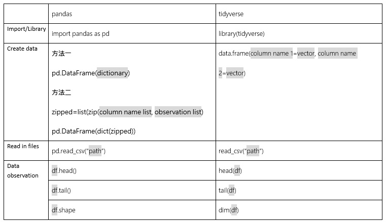
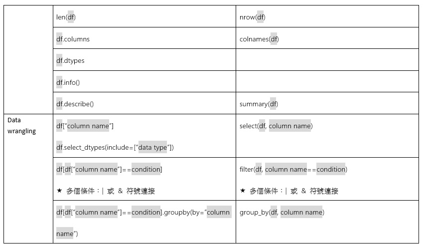
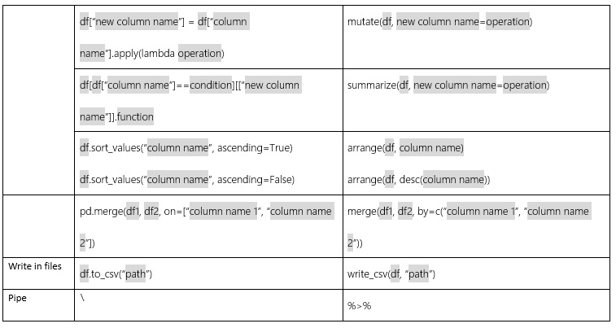

# Comparison between pandas in Python and tidyverse in R

　　這個禮拜我練習了pandas和tidyverse的轉換，因為最早學到處理資料的時候是使用R語言的tidyverse套件，語法上給我的感覺很乾脆，像是mutate、summarize這些字詞都很好理解，所以一碰到data frame的時候就都使用tidyverse，但在整理下面這張表格的時候發現pandas的語法其實也滿有規則的，有點像是先以list篩選出要處理的欄位（對應到R語言的select或filter），再以df.<function>的方式直接進行處理（對應到summarize），如果沒有單純的function可以處理，可以使用apply加上lamda的方式來完成這個步驟。在看教學文章的時候整理了下面的表格，希望可以分享給大家。　：）

<b>References:</b> 

1. 從 pandas 開始 Python 與資料科學之旅 - 仿效 Tidyverse 的學習模式 
https://medium.com/datainpoint/%E5%BE%9E-pandas-%E9%96%8B%E5%A7%8B-python-%E8%88%87%E8%B3%87%E6%96%99%E7%A7%91%E5%AD%B8%E4%B9%8B%E6%97%85-8dee36796d4a

2. 10 Python Pandas tricks that make your work more efficient 
https://towardsdatascience.com/10-python-pandas-tricks-that-make-your-work-more-efficient-2e8e483808ba
