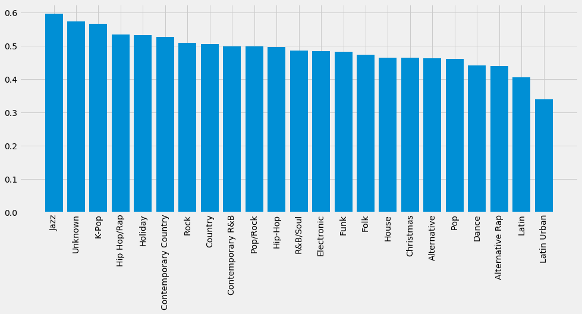

```python
import json
import pickle
import re

from matplotlib import pyplot as plt
from nltk.corpus import stopwords
import numpy as np
```


```python
def add_attr(stats, attr, attr_dict):
    for day in stats:
        for track in stats[day]:
            song = track['song']
            artist = track['artist']
            a = attr_dict.get((song, artist))
            track[attr] = a
            
            
def get_genre(track):
    if not track['meta']:
        return ['Unknown']
    genre_list = track['meta']['primary_genres']['music_genre_list']
    if not genre_list:
        return ['Unknown']
    genres = [genre_dict['music_genre']['music_genre_name'] for genre_dict in genre_list]
    return genres


def get_lyrics(stats):
    genre_lyric_dict = {}
    for date in stats:
        for track in stats[date]:
            genres = get_genre(track)
            lyrics = track['lyrics']
            if not lyrics:
                continue
            for genre in genres:
                lyric_set = genre_lyric_dict.get(genre, set())
                lyric_set.add(lyrics)
                genre_lyric_dict[genre] = lyric_set
    return genre_lyric_dict


def preprocess(lyrics):
    en_stop = stopwords.words('english')
    lyrics = [word.lower() for word in re.split(r'\s', lyrics) if word.lower() not in en_stop and word.isalpha()]
    return lyrics

def get_ttr(genre_lyrics, threshold=5):
    ttr_dict = {}
    for genre, lyrics in genre_lyrics.items():
        # Avoid skewing results
        if len(lyrics) < threshold:
            continue
        ttr_lst = []
        for l in lyrics:
            l = preprocess(l)
            ttr = len(set(l))/len(l)
            ttr_lst.append(ttr)
        ttr_avg = np.mean(ttr_lst)
        ttr_dict[genre] = ttr_avg
    return ttr_dict
```


```python
with open('spotify_top_200_with_meta_20170101-20180101.json') as f1, open('spotify_lyrics.pkl', 'rb') as f2, open('spotify_lyrics_freq.pkl', 'rb') as f3:
    stats = json.load(f1)
    lyrics = pickle.load(f2)
    lyrics_count = pickle.load(f3)
```


```python
# add lyrics
add_attr(stats, 'lyrics', lyrics)
# get unique lyrics for each genre
genre_lyric_dict = get_lyrics(stats)
```


```python
# Get average type-token ratio for each genre
ttr_dict = get_ttr(genre_lyric_dict, threshold=5)
```


```python
plt.style.use('fivethirtyeight')
fig, ax = plt.subplots(figsize=(15, 6))
labels, values = zip(*sorted(ttr_dict.items(), key=lambda x: x[1], reverse=True))
ax.bar(labels, values)
for tick in ax.get_xticklabels():
    tick.set_rotation(90)
plt.show()
```





```python
# The few songs still skew the results
print('Hip Hop/Rap:', len(genre_lyric_dict['Hip Hop/Rap']))
print('Jazz:', len(genre_lyric_dict['Jazz']))
```

    Hip Hop/Rap: 356
    Jazz: 7


```python
# Doesn't seem that diverse to me
print(list(genre_lyric_dict['Jazz'])[0])
```

    Here's a little song I wrote
    You might want to sing it note for note
    Don't worry, be happy
    In every life we have some trouble
    But when you worry you make it double
    Don't worry, be happy
    Don't worry, be happy now
    
    Don't worry, be happy
    Don't worry, be happy
    Don't worry, be happy
    Don't worry, be happy
    
    Ain't got no place to lay your head
    Somebody came and took your bed
    Don't worry, be happy
    The landlord say your rent is late
    He may have to litigate
    Don't worry, be happy
    Don't worry, be happy (Look at me, I'm happy)
    
    Don't worry, be happy
    (Hey I'll give you my phone number, when you worry call me I'll make you happy!)
    Don't worry, be happy
    
    Ain't got no cash, ain't got no style
    Ain't got no gal to make you smile
    But don't worry, be happy
    'Cause when you worry your face will frown
    And that will bring everybody down
    So don't worry, be happy
    Don't worry, be happy now
    
    Don't worry, be happy
    Don't worry, be happy
    Don't worry, be happy
    Don't worry, be happy
    
    Now there is the song I wrote
    I hope you learned it note for note, like good little children
    Don't worry, be happy
    Now listen to what I said, in your life expect some trouble
    When you worry you make it double
    But don't worry, be happy, be happy now
    
    Don't worry, be happy
    Don't worry, be happy
    Don't worry, be happy
    Don't worry, be happy
    Don't worry, be happy
    (Don't worry, don't worry, don't do it, be happy
    Put a smile on your face
    Don't bring everybody down like this
    Don't worry, it will soon pass whatever it is)
    Don't worry, be happy
    I'm not worried


```python
# Maybe the common use of English in K-Pop increases the type count on average?
print(list(genre_lyric_dict['K-Pop'])[0])
```

    이 모든건 우연이 아냐
    그냥 그냥 나의 느낌으로
    온 세상이 어제완 달라
    그냥 그냥 너의 기쁨으로
    네가 날 불렀을 때 나는 너의 꽃으로
    기다렸던 것 처럼 우리 시리도록 펴
    어쩌면 우주의 섭리 그냥 그랬던 거야
    You know, I know
    너는 나, 나는 너
    
    설레는 만큼 많이 두려워 운명이 우릴 자꾸 질투해서
    너만큼 나도 많이 무서워
    When you see me
    When you touch me
    우주가 우릴 위해 움직였어
    조금의 어긋남 조차 없었어
    너와 내 행복은 예정됐던 걸
    Cause you love me and I love you
    
    넌 내 푸른 곰팡이
    날 구원해준 나의 천사 나의 세상
    난 네 삼색 고양이 널 만나러 온
    Love me now
    Touch me now
    
    Just let me love you (let me, love, let me love you)
    Just let me love you (let me, love, let me love you)
    우주가 처음 생겨났을 때부터 모든 건 정해진 거였어
    Just let me love you (let me, love, let me love you)
    
    Let me love, let me love you
    Let me love, let me love you


```python
print(list(genre_lyric_dict['Latin Urban'])[0])
```

    Maluma baby
    
    Apenas sale el sol y tú te vas corriendo
    Sé que pensarás que esto me está doliendo
    Yo no estoy pensando en lo que estás haciendo
    Si somos ajenos y así nos queremos (mm-mm-mm)
    
    Si conmigo te quedas, o con otro tú te vas
    No me importa un carajo porque sé que volverás
    Si conmigo te quedas, o con otro tú te vas
    No me importa un carajo porque sé que volverás
    
    Y si con otro pasas el rato
    Vamo' a ser feliz, vamo' a ser feliz, felices los 4
    Te agrandamo' el cuarto
    Y si con otro pasas el rato
    Vamo' a ser feliz, vamo' a ser feliz, felices los 4
    Yo te acepto el trato
    
    Y lo hacemo' otro rato
    Y lo hacemo' otro rato
    Y lo hacemo' otro rato
    Y lo hacemo' otro rato (alright-alright, baby)
    
    Y lo hacemo' otro rato
    Lo nuestro no depende de un pacto
    Disfruta y sólo siente el impacto
    El boom boom que te quema, ese cuerpo de sirena
    Tranquila que no creo en contratos (y tú menos...)
    
    Y siempre que se va, regresa a mí, y felices los 4
    No importa el qué dirán, nos gusta así
    (Te agrandamos el cuarto, baby)
    Y siempre que se va, regresa a mí, y felices los 4
    No importa el qué dirán, somos tal para cual
    
    Y si con otro pasas el rato
    Vamo' a ser feliz, vamo' a ser feliz, felices los 4
    Te agrandamos el cuarto
    Y si con otro pasas el rato
    Vamo' a ser feliz, vamo' a ser feliz, felices los 4
    Yo te acepto el trato
    
    Y lo hacemo' otro rato
    Y lo hacemo' otro rato
    Y lo hacemo' otro rato
    Y lo hacemo' otro rato
    
    Si conmigo te quedas, o con otro tú te vas
    No me importa un carajo porque sé que volverás
    Si conmigo te quedas, o con otro tú te vas (a-as)
    No me importa un carajo porque sé que volverás
    
    Y si con otro pasas el rato
    Vamo' a ser feliz, vamo' a ser feliz, felices los 4
    Te agrandamo' el cuarto
    Y si con otro pasas el rato
    Vamo' a ser feliz, vamo' a ser feliz, felices los 4
    Yo te acepto el trato
    
    Y lo hacemo' otro rato
    Y lo hacemo' otro rato
    Y lo hacemo' otro rato
    Y lo hacemo' otro rato
    
    (Y siempre que se va, regresa a mí)
    Maluma baby
    (No importa el qué dirán, nos gusta así)
    Kevin ADG, Chan El Genio, RudeBoyz
    (Y siempre que se va, regresa a mí)
    El código secreto, baby
    (No importa el que dirán (Ily Wonder)
    Somos tal para cual)
    Así lo quiso el destino mami
    Muah


```python

```
