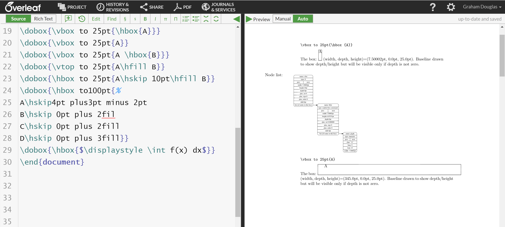
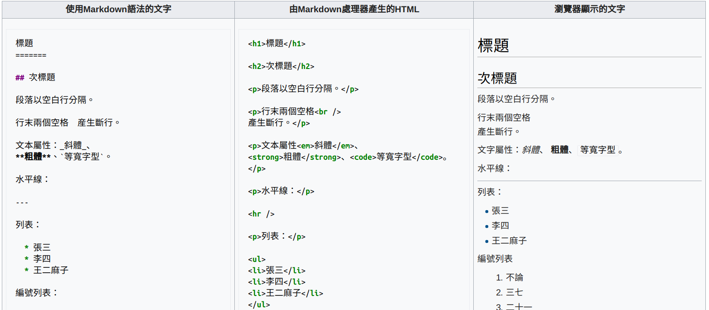

```{r setup, include=FALSE}
knitr::opts_chunk$set(echo = TRUE)
```


這篇文章並非 **R Markdown** 的教學文[^intro-rmd]，而是一篇**企圖說服**讀者採用 **R Markdown** 作為寫作工具的文章。本文以 **R Markdown** 撰寫並使用 **blogdown** 輸出部落格文章。原始碼[託管於 GitHub](https://github.com/liao961120/collabin/tree/master/content/yongfu/write-in-rmd)。

{style='width:30%;float: right;padding-left:18px'}
從第一次接觸 **R Markdown** 至今經過了一年又三個月。而最近六個多月，我都沒有使用過 Microsoft Word 寫東西，因為 **R Markdown** 強大的功能使我得以不用 Word 也能生存 -- 我用 **R Markdown** 寫[作業](https://liao961120.github.io/notes/106-2/multivariate)、[文章](https://github.com/liao961120/ling-rmd/blob/master/main.pdf)、[書](https://liao961120.github.io/MVA)、[論文](https://liao961120.github.io/ntuthesis)和部落格 (本文)，製作[筆記](https://liao961120.github.io/notes/mylinux.html)、[投影片](https://liao961120.github.io/slides/xaringan)、甚至[網頁](https://twlangsurvey.github.io)。事實上，這正是 **R Markdown** 最吸引人的地方：

> 用相同的語法撰寫各式類型的文件。

## 兩種媒介：紙本 vs. 網頁 {#printing-vs-surfing}

寫作的目的有一部分是**要給人看**，因此[排版](https://zh.wikipedia.org/wiki/排版)自然而然就成為作者的工作之一。在文字普及後的絕大多數時間，排版僅需要考慮**紙本印刷物**。即使十幾年前電腦已十分盛行，排版軟體仍主要在解決**紙本印刷物**的排版問題。這本身不是個問題，但今日網路已成為主流的資訊傳播管道，**網頁因而成為與紙本同等 (甚至更加) 重要的文字承載媒介**。

這對文字工作者^[這裡對文字工作者的定義很廣，任何常寫文章的人都可算是文字工作者 (例如，學生) 。]造成了新的負擔，因為兩種不同的文字承載媒介 -- **紙本**與**網頁**，在歷史上各自衍生出兩種設計邏輯十分迥異的排版系統， [$\TeX$](https://zh.wikipedia.org/wiki/TeX) 以及 [HTML](https://zh.wikipedia.org/wiki/HTML)，而這兩種系統彼此是無法 (輕易) 相互轉換的 (例如，嘗試使用 Chrome 將網頁轉存成 PDF 時，你會發現一張圖片常被分割在不同頁面)。因此，今日的文字工作者在寫作前得先回答一個問題：

> 我的作品會活在**網路上**還是要**印出來**？


## 兩種工具：WYSIWYG vs. WYSIWYM {#WYSIWYG-vs-WYSIWYM}

上一段內容或許對許多人來說相當陌生，因為**我們都是用 Microsoft Word 長大的**，根本不知道什麼是 $\TeX$。MS Word 和 $\TeX$ 一樣，皆是以紙本排版為目的而設計，但 MS Word 不同於 $\TeX$ 在於其為[所見即所**得**](https://zh.wikipedia.org/wiki/所見即所得) (What You See Is What You **Get**, WYSIWYG) 的排版軟體，讓使用者不須接觸到複雜的[標記式語言](https://zh.wikipedia.org/wiki/標記式語言) (Markup Language)[^markup]。但簡潔的使用界面需付出代價 -- 複雜的檔案格式^[Word 檔 (`.docx`) 不是純文字檔案，只能用 Word 等複雜的軟體才能閱讀編輯，更不能直接於網頁中顯示。]，因而較難進行檔案管理[^file-management]。


(ref:tex) $\TeX$ 排版系統

```{r tex, echo=FALSE, fig.cap="(ref:tex)"}

```

相較於**所見即所得**的排版軟體，[所見即所**思**](https://en.wikipedia.org/wiki/WYSIWYM) (What You See Is What You **Mean**, WYSIWYM) 的系統如 $\TeX$ 和 HTML 通常以純文字檔的形式儲存，再以編譯器輸出或以閱讀軟體 (瀏覽器即是 HTML 的閱讀軟體) 讓讀者看到最終的排版結果。這類系統少了 Word 難以管理的缺點，但卻有一個**令許多使用者卻步的大缺點** -- 太過複雜的標記式語言讓作者難以專注在**寫作的內容**，必須時時擔心**排版**問題。

```{r wysiwym, echo=FALSE, fig.cap='所見即所得 (WYSIWYG) vs. 所見即所思 (WYSIWYM)', out.width='60%'}
knitr::include_graphics('https://bit.ly/2DsQ9Od')
```

## Markdown：改善 WYSIWYM {#md-enhance}

面對過於複雜的標記式語言，[John Gruber](https://en.wikipedia.org/wiki/John_Gruber) 發明了 Markdown 以避開撰寫網頁時過於複雜的 HTML 語法。Markdown 是一種容易學習、極為簡化的標記式語言。事實上，由於原始的 Markdown 語法過於簡單^[Markdown 的語法雖然簡單，但這並不代表其排版能力弱於 HTML，因為 Markdown 語法可與 HTML 混用。]，造成許多衍生「風格」Markdown 的發明以擴充原本不足的語法。這也間接導致今日 Markdown 並非可通行 (portable) 於所有聲稱支援 Markdown 的平台。

```{r md2html, echo=FALSE, fig.cap='Markdown 轉換成 HTML'}

```

Markdown 的出現使得**所見即所思**的排版方式不再如此地惡名昭彰，因為 Markdown 簡潔的語法使其極易閱讀(比較圖 \@ref(fig:md2html) 最左與最右)。原本為了處理網頁排版而設計的 Markdown，也將目標擴展到了**紙本媒介** (將 Markdown 轉換成 $\TeX$ 再輸出成 PDF)，這大大增強了使用 Markdown 撰寫文件的動機：**同一份文件能選擇輸出成適合「網頁瀏覽」或「紙本列印」的格式**。

總結來說，Markdown 的出現使過去排版系統的問題出現了改善的契機：

1. 簡化複雜的標記式語言，讓 **WYSIWYM** 的排版方式變得平易近人
1. 使用相同原始檔 (source file) 輸出適合**網頁**及**印刷**的格式


|          | 所見即所得                                     | 所見即所思                       |
|----------|------------------------------------------------|----------------------------------|
| **紙本** | MS Word                                        | $\TeX$,<br>Markdown (近年目標)   |
| **網頁** | 部落格文章撰寫後台<br>(e.g. WordPress, Medium) | HTML,<br>Markdown (初創目的) |


## **R Markdown**：R + Markdown {#r-plus-md}

**R Markdown**，顧名思義就是 **R 語言** + **Markdown**。[**R**](https://zh.wikipedia.org/wiki/R語言) 是一個統計計算的程式語言。你可能會好奇結合程式語言和 **Markdown** 的用途為何？**R Markdown** 最初發展的目的，有一部份與 **R 語言**強大的繪圖功能有關：

> 透過在 **Markdown** 文件中穿插「程式語言區塊 (code chunk) 」，可以讓程式語言執行的結果直接顯示於文件中。如此就不須手動將 (統計軟體跑出來的) 圖片插入文件中。

下方的是個簡單的例子，用 3 行 **R** 指令畫出著名的[鳶尾花數據集](https://zh.wikipedia.org/wiki/安德森鸢尾花卉数据集)：

```{r, out.width='65%'}
library(ggplot2)
ggplot(data = iris) +
  geom_point(aes(x = Sepal.Length,
                 y = Petal.Width,
                 color = Species)
            )
```

這項功能對從事數據分析或科學研究的使用者非常實用，因為它自動化了麻煩的事情。

但對於**非 R 語言使用者**，使用 **R Markdown** 有比較好嗎 (相對 **Markdown** 而言)？

### R 社群 {#r-community}

一個程式語言 (包含套件擴充功能) 的發展與特色，很大部份與使用族群之組成相關。不同於其它多數程式語言，使用 **R 語言**的人，**絕大多數都屬於使用者 (user) 而非開發者 (developer)**。換言之，許多 **R** 使用者並沒有深厚的程式基礎，使用 **R** 的目的是為了 (快速) 解決當下問題，而非開發工具給其他人使用。

**R** 社群因此發展出非常友善的文化，而 **R** 許多套件的設計也**預設使用者是沒有程式經驗的**。例如，許多 **R Markdown** 相關套件 (e.g. [shiny](https://cran.r-project.org/web/packages/shiny), [htmlwidgets](https://cran.r-project.org/web/packages/htmlwidgets)) 目的在於幫助不熟悉或完全不懂 HTML/CSS/JS 的使用者快速製作 (互動式) 網頁。此外，**R** 套件常將外部功能整合進 **R** 的世界，並且提供簡單易讀的說明文件，讓使用者省去自行研究的麻煩 -- **R Markdown** 正是這樣的例子。

### Pandoc

**R Markdown** 背後運作的關鍵是 [Pandoc](https://zh.wikipedia.org/wiki/Pandoc)，一個用於不同標記式語言間格式轉換的工具。如上文所述，Markdown 原本被用作簡化的標記式語言來撰寫網頁，而 Pandoc 則是用來將 Markdown 轉換成 HTML 的 (其中一種) 工具。然而，Pandoc **不只能將 Markdown 轉換成 HTML**。它也能將 Markdown 轉換成其它[多種格式](https://zh.wikipedia.org/wiki/Pandoc#Pandoc支持的标记语言格式)，而其中最實用的就是前述以**紙本媒介**為目標的 $\TeX$ 及 PDF。

透過 Pandoc 的加持，**R Markdown** 能輸出成多種格式。此外，也因為 Pandoc Markdown[^pandoc-md] 的語法完整，**R Markdown** 能進行非常精緻的排版 (精緻到能輸出[可直接送印出版的書籍](https://yihui.name/en/2018/08/bookdown-crc/))。但 Pandoc 強大的功能卻反而讓它與**沒有程式經驗的使用者**絕緣，因為這些使用者不可能會去研究、下載、打開 Command Line 執行 Pandoc。**R Markdown** 將對於新手過於複雜的 Pandoc 隱藏起來，讓使用者透過 GUI 界面就能直覺地使用 Pandoc 的功能。

(ref:rmdflow) **R Markdown** 運作流程。先由 `knitr` 將 `.Rmd` 中的程式碼執行結果插入 `.md` (文件由 `.Rmd` 轉換為 `.md`)，再透過 Pandoc 將 `.md` 轉換成其它輸出格式。

```{r echo=FALSE, fig.cap='(ref:rmdflow)'}
knitr::include_graphics('rmarkdownflow.png')
```


### 回到 **R Markdown** {#back-to-rmd}

> 對於非 **R 語言**使用者而言，**R Markdown** 有比 **Markdown** 好嗎？

我的答案是肯定的。**R** 社群的組成使得 **R Markdown** 致力於讓自己更易於使用。因此，縱使使用目的並非資料分析或科學研究這類「硬」功能，使用者仍能從 **R Markdown** 獲得許多好處：

- 美觀的預設樣式

    Markdown 轉換成 HTML 後能在網頁上正常顯示，但要**漂亮**的顯示，需要額外的 CSS 裝飾。這對一般使用者來說是非常困難的 (誰懂 CSS 啊？)。**R Markdown** 內建許多相當美觀的輸出樣式 ([Bootstrap](https://getbootstrap.com))，所以使用者不須去擔心 CSS 的問題。甚至對於更龜毛的使用者 (對所有內建樣式都不滿)，也可以安裝社群中[其他人開發的樣式](https://slides.yihui.name/2017-rstudio-conf-ext-rmd-Yihui-Xie.html#15)。例如，你可以在[這裡](https://liao961120.github.io/notes/write-in-rmd/rmdformats.html)看到本文透過 [rmdformats](https://github.com/juba/rmdformats) 套件以 [Read The Docs](https://docs.readthedocs.io) 風格輸出的樣式。

- 統一的 Markdown 語法

    文章前面提及，原始的 Markdown 因為語法過於簡化，導致各種「風格」 Markdown 語法的出現。例如，GitHub, Stack Overflow, Jekyll (靜態網頁產生器), Hugo (靜態網頁產生器) 等等所支援的 Markdown 在語法上都有些微差異。換句話說，使用者無法使用相同的 Markdown 語法橫行各個平台，需要記得不同平台支援哪些語法[^md-variety]。
    
    這個問題對於自行架設部落格的使用者可能是個問題，因為當其想換新的網頁模板時，可能使用不同的靜態網頁產生器 (例如，Jekyll → Hugo)，而原本以 Markdown 撰寫的文章在新的靜態網頁產生器可能會語法不相容。**R Markdown** 在此可以解決這個問題：透過 [`html_fragment`](https://rmarkdown.rstudio.com/html_fragment_format.html) 輸出格式，靜態網頁產生器能透過 **R Markdown** 輸出的 HTML，而不非語法不一的 Markdown，產生網頁。

- 程式語言支持

    **R Markdown** 的另一個特色是程式語言的整合。**即使不會寫程式，背後有程式語言支持的 R Markdown 仍能提供使用者非常方便的功能**。**R Markdown** 支援使用特殊語法在文件**內文插入變項**，例如，我可以在文內插入 **R** 「回傳目前時間的函數」，自動顯示文件輸出時的時間：

    <code>上次更新：&#96;r Sys.time()&#96;</code> 會輸出成：<code>上次更新：`r Sys.time()`</code>

    這個功能對於從事數據分析的使用者 (e.g. 寫統計學作業的學生) 非常方便。例如，他可以使用 <code>*p*-value = &#96;r pval&#96;</code> (`pval` 儲存先前計算出來的數值) 直接在內文插入 *p*-value，而不用在每次數據更新時 (例如發現之前資料有誤)，重新手動複製貼上數值。

- 強大的靠山

    **R** 社群今日能如此活躍，有很大一部分是因為 [RStudio](https://www.rstudio.com/) 這家公司的推行。**R** 使用者用到的許多套件是由 RStudio 僱用的工程師專職開發的，因此，這些套件會持續的維護、更新、出現更強大的新功能。

    **R Markdown** 的生態圈最主要的貢獻者 -- [Yihui Xie](https://yihui.name) 即是 RStudio 的工程師。在這些開發者的努力下，**R Markdown** 在這幾年功能越來越強大：涵蓋的範圍從簡單的文件、投影片、互動式網頁、學術期刊、書籍甚至到網站與部落格 [@xie2018r]。


## R Markdown 的未來 {#future-of-rmd}

以紙本印刷為主流的過去在今日留下許多痕跡。學術論文格式和印刷物排版的處理仍以 $\LaTeX$ 和 $\TeX$ 的功能最為齊全，但以 $\LaTeX$ 撰寫而成的文件難以轉換為適合網頁閱讀的格式。至於另一個方向，以 HTML/CSS/JS 為基礎排版的網頁，有機會轉換成排版美觀、適合印刷的 PDF 格式嗎？

以目前資訊科技的發展來看，後者是比較可能的，畢竟網路科技是程式軟體開發的重要焦點，以網頁為媒介的文件只會越來越多；相對來說，$\LaTeX$ 可能只剩學術界在使用，學術界本身更是缺乏人力去做這種吃力不討好的工作 (開發程式將 $\LaTeX$ 轉換成 HTML)。

事實上，目前已有實際的專案在嘗試這件事。例如，網頁的 CSS 可定義 [page media](https://developer.mozilla.org/en-US/docs/Web/CSS/Paged_Media)，嘗試控制瀏覽器如何生成 PDF。另一個更有前景的專案是 **R Markdown** 生態圈裡的新套件 -- [pagedown](https://github.com/rstudio/pagedown)。pagedown 旨在直接生成**以印刷為目的的 HTML 文件**，而略過 **R Markdown** 透過 Pandoc 及 $\LaTeX$ 生成 PDF 的歷程^[這是一個困難重重的過程，看見 $\LaTeX$ 噴錯是一件驚心動魄的事。]。你可以在[這裡](https://liao961120.github.io/notes/write-in-rmd/paged.html)看看本文以 pagedown 輸出的樣式。我完全不需更動文章內容，只要使用不同的輸出指令，就能從部落格文章瞬間轉換成漂亮的紙本印刷物 (可用 chrome 列印 → 儲存成 PDF)。

## 小結 {#conclusion}

- 因為歷史因素，現存兩種文字承載媒介 -- 紙本和網頁。對多數人來說，必需**在使用紙本或使用網頁發表之間抉擇**。

- 排版軟體的兩種設計邏輯 -- WYSIWYG vs. WYSIWYM，各自存在優缺點。WYSIWYG 使用起來直覺，但檔案管理不便；WYSIWYM 則語法複雜，但能作出十分精美之排版且檔案管理方便。

- Markdown 結合了過去 WYSIWYG 和 WYSIWYM 的優點，也解決了兩者的缺點。同時，Markdown 也有潛力解決紙本發表與網頁發表之間的矛盾。

- R Markdown 擴充 Markdown 語法使其能撰寫相當複雜的文件 (如期刊文章、書籍、網站等) 並結合程式語言的支持，自動化許多麻煩事，讓使用者能快速上手使用。

- 面對**紙本 vs. 網頁**，未來似乎向著以網頁為文字承載媒介主流的世界前進。而資訊科技的發展，使得紙本印刷之排版困難逐漸能被網頁技術解決。

---

> I have a dream that one day all students and researchers will forget what "formatting a paper" even means. I have a dream that one day journals and grad schools no longer have style guides. I have a dream that one day no missing $ is inserted, and \\hbox is never overfull.
>
> --- Yihui Xie[^quote]

[^quote]: https://twitter.com/xieyihui/status/1022873179532996609)

這段文字是 Yihui 的夢想，我想也是 R Markdown 的終極目標：讓文字工作者能**專注在寫作內容**，而將格式與排版等麻煩事交給 R Markdown。


## 參考資料 {#references -}

這篇文章的想法源自下列資源。

<!-- 以下語法用於插入 ref.bib 中所有文獻
     見 https://pandoc.org/MANUAL.html#citations -->
---
nocite: | 
  @*
...


[^intro-rmd]: 關於 **R Markdown** 的介紹有許多網路資源，繁體中文可參考此文 (http://www.learn-r-the-easy-way.tw/chapters/17)，英文資源可先從 bookdown (https://bookdown.org/yihui/bookdown) 下手。

[^markup]: 排版是一件複雜的問題。試想，電腦要如何知道哪些字需要粗體、斜體、空行、縮排等等？標記式語言處理的就是這類問題：透過特殊字元標記出文字中需要特殊格式的地方。

[^file-management]: 舉例來說，假設我的資料夾中有 200 份 **Word 檔**，我要如何找出其中哪幾份文件有出現特定字元，例如，「王小明」？

    相較之下，如果這 200 份文件是**純文字檔**，要找出哪幾份文件中有出現「王小明」就非常簡單。在類 unix 的電腦上(如 Mac 或 Linux)，只需要打開 Command Line 輸入 `grep -r '王小明' *.Rmd` 就可找到這些檔案 (在 Windows 上也行，但指令可能不太一樣)。


[^pandoc-md]: Pandoc 自行定義的 Markdown 語法，是市面上盛行的其中一種 Markdown「風格」。Pandoc Markdown 的特色在於其**支援功能非常完整**，例如，它除了大幅擴充原本的 Markdown 語法外，甚至還增加了插入文獻引用的功能 (如同 Endnote，自動處理文獻引用格式)。

[^md-variety]: 其中一種解決方法是只用**最簡化的 Markdown** (https://daringfireball.net/projects/markdown/syntax)。如果還需更複雜的排版，就使用 HTML tag。