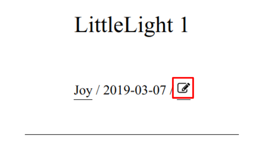

## Outline

```{r echo=FALSE, message=FALSE, warning=FALSE, results='asis', comment=NA}
temp <- tempfile()
invisible(mindr::outline('index.Rmd', savefilename = temp))
headers <- readLines(temp)
top_level_headers <- unique(headers[grepl('^# ', headers)])

print_str <- stringr::str_replace(top_level_headers, '# ', '- ')

cat('.larger[')
for (i in print_str) {
  cat('\n')
  cat(i)
  cat('\n')
}
cat(']')
```

---

class: inverse, center, middle

# 文章撰寫

---
name: relative-path

## 文章撰寫

- 格式：
    - **Markdown** (`.md`)
    - **R Markdown** (`.Rmd`)
    - **Jupyter Notebook** (`.ipynb`)
    
- **`.md`** 與 **`.Rmd`**：使用**.red[相對路徑 (relative path)]**

      ````md
                           <!--Correct-->
               <!--Correct-->
        <!--WRONG !!!-->
      ````
      
      ````r
      source('./path/to/file.csv')               # Correct
      source('path/to/file.csv')                 # Correct
      source('/Users/who/i/cant/find/file.csv')  # WRONG !!!
      ````

- **`.ipynb`**：請**.red[先跑出結果]** (i.e. `.ipynb` 內含圖片、程式執行結果)


---

class: inverse, center, middle

# 文章上傳

---
## 文章上傳


.left-column[
### R Markdown
]

.right-column[

1. 撰寫：**`index.Rmd`** + dependencies (figures, `.R`)

1. 確認：使用[相對路徑](#relative-path)、可 knit 成 HTML

1. 壓縮：`index.Rmd` + dependencies → **`.zip`**

1. [上傳](https://goo.gl/forms/t76C5JNDjMx8DxX42)：填寫文章資訊 (標題、文章標籤等)

]

---

## 文章上傳

.left-column[
### R Markdown
### Markdown
]

.right-column[

1. 撰寫：**`index.md`** + dependencies (figures)

1. 確認：使用[相對路徑](#relative-path)

1. 壓縮：`index.md` + dependencies → **`.zip`**

1. [上傳](https://goo.gl/forms/t76C5JNDjMx8DxX42)：填寫文章資訊 (標題、文章標籤等)

]

---

## 文章上傳

.left-column[
### R Markdown
### Markdown
### Jupyter nb
]

.right-column[

1. 撰寫：**`index.ipynb`**

1. 執行：先跑出結果 (`.ipynb` 內含圖片、程式執行結果)

1. 壓縮：`index.ipynb` + dependencies<sup>\*</sup> → **`.zip`**

1. [上傳](https://goo.gl/forms/t76C5JNDjMx8DxX42)：填寫文章資訊 (標題、文章標籤等)

]

.footnote[
.smaller[
\[\*\]: 不附上 dependencies 仍可在網頁正常顯示 (因為已先執行過 `.ipynb`)。
]
]

---

class: inverse, center, middle


# 修改文章

---

## 文章修正

.pull-left[

#### (R) Markdown

1. 協作閣文章頁面點擊 

1. 透過 GitHub 修改文章<sup>\*</sup>

1. 提出 Pull Request



.footnote[
.smaller[
\[\*\]: 第一次編輯時，會跳出需要 Fork 的畫面，請按確定。編輯的過程可完全透過網頁進行，別擔心會因為按錯什麼而毀損檔案。
]]

]

--

.pull-right[

#### Jupyter Notebook

.smaller[
如果使用 Jupyter Notebook 撰寫文章，點擊  所修改的會是已轉換成 `.md` 的文件。換言之，原始的 `.ipynb` 並未被修改。

若想保持兩者的一致，請在進入  進行修改之後，再透過 pull request **上傳、複寫 Repo 中的 `index.ipynb`** (與 `.md` 在同一個資料夾，並且檔名皆為 `index` 開頭)
]

]

